## 2. System Containers

### Host Integration Boundary

- **Logical Type:** External boundary adapter
- **Responsibility:** Expose Tuvren Runtime to embedding environments, initiate turns, await terminal execution results, consume event streams, list and read durable state through the host-facing Durable-Read Surface, surface status, deliver steering, route approvals, and trigger cancellation. The first product-depth proof host is a serious REPL CLI built against this same boundary rather than a privileged internal harness, with both an interactive operating mode and a headless stdin-driven mode.
- **Inputs:** User or system signals, approval responses, steering signals, cancellation requests, runtime events, durable-read queries (list threads, list branches, get state at TurnNode, walk turn history, read branch messages).
- **Outputs:** Turn-start requests, control signals, terminal execution results, translated protocol events, host-visible execution status, durable-read responses, captured transcript artifacts.
- **Depends on:** Framework Shared Services (including its Durable-Read Surface), Event Stream Adapter Layer.

### Curated Host-Facing SDK Surface

- **Logical Type:** Host-developer ergonomics boundary
- **Responsibility:** Compose the underlying runtime containers into one curated host-facing surface that a host developer consumes. This is a logical boundary, not a single physical artifact: it groups a Shared Primitive Container (subpath-exported primitives covering messages, tools, events, errors, execution, driver contracts, provider contracts, and extensions) and a Slim Convenience Container (re-exports the curated primitives and exposes the Batteries-Included Composition entrypoint that assembles kernel, backend, driver registry, and framework runtime from one factory call). Leaf integration containers (backends, stream adapters, drivers, provider bridges, MCP Client Container, Schema Authoring Helper, Tool Source Container) peer-depend on the Shared Primitive Container so that one runtime instance always sees one primitive instance.
- **Inputs:** Host-developer composition requests (which backend, which driver, which provider, which tools), leaf integration container choices, primitive imports from subpaths.
- **Outputs:** A wired-up Framework Shared Services instance the host can drive through the Host Integration Boundary; curated primitive exports consumable by hosts, extensions, and downstream packages.
- **Depends on:** Shared Primitive Container, Slim Convenience Container, Framework Shared Services, Kernel Boundary, Durable State Boundary (through chosen backend), Driver Runtime, Provider Gateway, Tool Execution Gateway, Schema Authoring Helper, MCP Client Container.

### Framework Shared Services

- **Logical Type:** Application service layer
- **Responsibility:** Own the stable framework contracts and shared runtime services above the kernel, including execution-handle lifecycle, turn/run orchestration shell, context manifest maintenance, event publication, extension coordination, driver selection, terminal-value resolution on every execution handle (the unified `awaitResult` surface), and the Durable-Read Surface. The Durable-Read Surface composes existing kernel structural primitives (`branch.list`, `node.get`, `node.walkBack`, `tree.resolve`, `tree.manifest`, `store.get`) and the new kernel `thread.list` primitive into host-facing operations: list threads owned by the runtime instance (with cursor-based pagination and optional filters), list branches inside a thread, read structured runtime state at any TurnNode, walk turn history of a branch as an async iterator with a cursor (newest-first), and read durable conversational messages on a branch without requiring the host to reconstruct messages from TurnTree references and the content-addressed object store by hand. Framework Shared Services also owns Execution Bound enforcement: it caps per-turn iterations, tool calls, and resource budget above driver discretion, and when a configured bound is reached it forces a safe terminal outcome (a typed bounded-execution result) rather than allowing an unbounded loop. It emits canonical runtime activity to the Telemetry & Observability Boundary in the same vocabulary it publishes to the Event Stream Adapter Layer.
- **Inputs:** Host commands, execution state from durable history, extension contributions, driver-emitted control outcomes, provider and tool gateway results, durable-read queries from hosts, execution-bound configuration.
- **Outputs:** Driver invocation requests, kernel syscalls (read and write), runtime status transitions, event publication, approval state, steering incorporation, host-visible execution handles with terminal-value resolution, host-facing durable-read responses.
- **Depends on:** Driver Runtime, Context Assembly and Engineering, Extension Runtime, Orchestration Runtime, Kernel Boundary, Event Stream Adapter Layer.

### Driver Runtime

- **Logical Type:** Execution strategy boundary
- **Responsibility:** Implement one concrete execution model over shared framework primitives. The initial baseline is the ReAct Driver, which renders prompts, interprets provider responses, evaluates loop decisions, and determines when to continue, pause, hand off, fail, or end a turn.
- **Inputs:** Active context, driver configuration, provider responses, tool results, extension verdicts, steering state, and framework-owned control constraints.
- **Outputs:** Canonical assistant messages, tool batches, runtime resolutions, driver-specific state transitions, and context-engineering or orchestration intents.
- **Depends on:** Provider Gateway, Tool Execution Gateway, Extension Runtime, Context Assembly and Engineering.

### Context Assembly and Engineering

- **Logical Type:** Domain service layer
- **Responsibility:** Build the active working context from durable history, maintain the context manifest, and execute explicit context reshaping actions such as reduction, compaction, substitution, or handoff context rewrites.
- **Inputs:** TurnTree state, message lineage, context policies, extension-generated context plans, handoff intents, steering signals, and driver requests.
- **Outputs:** Active message sets, rebuilt manifests, replacement message collections, and context-engineering actions for checkpointing.
- **Depends on:** Kernel Boundary.

### Extension Runtime

- **Logical Type:** Policy composition boundary
- **Responsibility:** Host lifecycle hooks, around-model wrappers, around-tool wrappers, system prompt contributions, extension-owned state updates, and declared shared exports within bounded contracts.
- **Inputs:** Execution context, manifests, prompts, tool calls, model responses, tool results, iteration outcomes.
- **Outputs:** Verdicts, state updates, custom events, prompt contributions, pause requests, and wrapped execution behavior.
- **Depends on:** Framework Shared Services, Driver Runtime, Event Stream Adapter Layer.

### Provider Gateway

- **Logical Type:** External integration boundary
- **Responsibility:** Translate canonical prompts to provider-facing requests and translate provider outputs and streams back into canonical Kraken representations while preserving provider continuity artifacts without promoting provider-specific ontology inward. Provider credentials are held only at this edge for the duration of a request and are excluded from durable lineage, operational telemetry, and transcripts; opaque provider continuity artifacts that must persist for correct multi-turn operation are not credentials and must not carry secret material. Within the capability-orchestration model this gateway also owns provider-native capabilities (the provider executes the tool; Tuvren enables/configures the surface and records only provider-exposed tool events and results) and provider-mediated developer-provided capabilities (the provider invokes a developer endpoint; Tuvren configures the mediated relationship and records what the provider/tool protocol exposes). For these classes Tuvren does not assume full invocation-lifecycle control.
- **Inputs:** Canonical prompt, rendered tool definitions, structured-output requests, model configuration.
- **Outputs:** Canonical model responses, normalized stream chunks, continuity artifacts, and provider failure signals.
- **Depends on:** External Model Providers.

### Tool Execution Gateway

- **Logical Type:** External integration boundary
- **Responsibility:** Resolve tools, validate inputs, apply approval gating, execute tool work, stage tool results incrementally, return canonical tool result messages to the runtime, and integrate multiple Tool Source Containers (including built-in registries and the MCP Client Container) into one unified tool resolution surface for the active agent segment. Tool definitions consumed by this gateway adhere to the boundary CustomSchema contract; the Schema Authoring Helper normalizes richer authoring shapes into that contract upstream of this gateway. Within the capability-orchestration model this gateway is the Tuvren-server execution class: it owns the full invocation lifecycle (validate, dispatch, stage, retry or cancel where supported, audit) for capabilities the Binding & Endpoint Resolver bound to server-side execution. Today's developer-defined runtime-executed tools resolve here unchanged; capabilities bound to provider-native, provider-mediated, or Tuvren-client execution are not executed here.
- **Inputs:** Canonical tool calls, tool registry definitions drawn from one or more Tool Source Containers, approval decisions, tool execution context.
- **Outputs:** Canonical tool results, approval requests, partial batch completion state, and tool-related events.
- **Depends on:** External Tools and Systems, Tool Source Container (one or more), Extension Runtime, Kernel Boundary.

### Schema Authoring Helper

- **Logical Type:** Host-facing authoring boundary
- **Responsibility:** Expose a schema-agnostic tool-authoring entrypoint that accepts multiple schema authoring styles (Zod v3 and v4, Standard Schema-compliant schemas, wrapped JSON Schema, and lazy wrappers around any of those) while preserving strict TypeScript inference for the execute callback's input parameter. Normalize all accepted authoring shapes into a single boundary-stable representation that satisfies the existing CustomSchema contract (a tool definition the Tool Execution Gateway can resolve). The normalization surface is centralized: one detection routine routes each schema kind to its adapter, and one schema-conversion pipeline produces the JSON Schema artifact used for provider-wire rendering. Bare JSON Schema and the existing CustomSchema interop shape remain legal at the boundary contract; this container only adds ergonomics on top.
- **Inputs:** Host-developer tool authoring calls carrying any accepted schema shape; the input/output type parameters the host intends to flow through inference.
- **Outputs:** Tool definitions matching the boundary CustomSchema contract, with the original authoring schema's TypeScript input type preserved on the execute callback signature.
- **Depends on:** Shared Primitive Container (boundary tool definition shape), the host's chosen schema toolkit (Zod, Standard Schema-compliant lib, or none).

### Tool Source Container

- **Logical Type:** Tool-discovery integration boundary
- **Responsibility:** Provide one source of tool definitions to the Tool Execution Gateway. Multiple Tool Source Containers may exist concurrently for one active agent segment (for example: a built-in static registry, an extension-contributed registry, and one or more MCP Client Containers). Each source is responsible for translating its native tool advertisement format into Tuvren tool definitions matching the boundary CustomSchema contract before they reach the Tool Execution Gateway. Within the capability-orchestration model a tool source contributes capabilities and their model-facing tool surfaces to the Capability Registry; the Binding & Endpoint Resolver then decides which execution class and endpoint serves each one.
- **Inputs:** Source-specific tool advertisements (static definitions, MCP server tool lists, extension contributions).
- **Outputs:** Tuvren tool definitions registered with the Tool Execution Gateway.
- **Depends on:** Shared Primitive Container (boundary tool definition shape), source-specific upstream systems.

### MCP Client Container

- **Logical Type:** External tool-ecosystem integration boundary
- **Responsibility:** Implement the Model Context Protocol client side over both stdio and HTTP/SSE transports as one unified client interface. Establish and maintain the MCP session lifecycle (initialization handshake, tool list discovery, tool invocation, tool result reception, transport-level error handling, session shutdown). Translate MCP tool advertisements into Tuvren tool definitions (an MCP-flavored Tool Source Container). Treat the external MCP server as an untrusted boundary: validate tool inputs against the advertised schema before sending across the transport and validate tool outputs against the advertised result shape before surfacing them as agent-visible results. The MCP server-side projection (exposing Tuvren itself as an MCP server) is explicitly out of scope; only the client side is in this container. External MCP server credentials (transport auth, headers, tokens) are held only at this edge and are excluded from durable lineage, operational telemetry, and transcripts. Within the capability-orchestration model MCP is a binding mechanism, not an execution class: an MCP server may be invoked by the provider (provider-mediated, configured through the Provider Gateway), by Tuvren server-side (Tuvren-server, this container), or by a client endpoint (Tuvren-client, run through the Client Endpoint Boundary). Execution class is determined by who invokes or runs the server, not by the protocol.
- **Inputs:** External MCP server endpoint specifications (transport choice, command or URL), MCP protocol messages from the server, tool invocations from the Tool Execution Gateway.
- **Outputs:** Tuvren tool definitions for each MCP-advertised tool; canonical tool results from MCP tool invocations; MCP session lifecycle events translated into runtime events.
- **Depends on:** External MCP Servers, Tool Source Container interface, Shared Primitive Container, Extension Runtime (for connection lifecycle hooks).

### Capability Registry

- **Logical Type:** Capability composition boundary
- **Responsibility:** Hold the capabilities a runtime instance may use and the model-facing tool surfaces that present them, drawn from one or more Tool Source Containers and from provider-native and provider-mediated declarations. Decide which tool surfaces are eligible to be exposed for a given agent segment before policy is applied. Keep the model-facing Tool Surface distinct from the underlying Capability so one capability can back multiple surfaces and one surface can resolve to different capabilities across providers.
- **Inputs:** Capability and tool-surface contributions from Tool Source Containers, provider-native tool declarations, provider-mediated tool configurations, agent-segment configuration.
- **Outputs:** The candidate set of capabilities and tool surfaces for an agent segment.
- **Depends on:** Tool Source Container (one or more), Provider Gateway (provider-native/mediated declarations), Shared Primitive Container.

### Binding & Endpoint Resolver

- **Logical Type:** Capability routing boundary
- **Responsibility:** Resolve each capability to a binding — one execution class (provider-native, provider-mediated developer-provided, Tuvren-server, or Tuvren-client) and one concrete Endpoint (provider runtime, a Tuvren host/server/worker/sandbox, a client endpoint, or a local/remote MCP server) — based on provider, model, policy, endpoint availability, and product configuration. Allow one logical capability to have multiple possible bindings and select or admit the binding for the active context. Classify MCP bindings by who invokes or runs the server.
- **Inputs:** Candidate capabilities and tool surfaces, active provider and model, endpoint availability, product configuration, policy outcomes.
- **Outputs:** A resolved binding per capability (execution class + endpoint), or a typed unavailable-binding outcome.
- **Depends on:** Capability Registry, Capability Policy Engine, Provider Gateway, Tool Execution Gateway, Client Endpoint Boundary, MCP Client Container.

### Capability Policy Engine

- **Logical Type:** Policy decision boundary
- **Responsibility:** Evaluate policy at two distinct decision points: exposure-time (whether a tool surface may be exposed to the model for the active provider, model, permissions, data-residency, and endpoint-availability constraints) and invocation-time (whether a resolved capability may actually run, covering approval requirements, credential boundaries, user-presence, idempotency/retry, and risk classification). Policy outcomes gate the Capability Registry's exposed set and the Binding & Endpoint Resolver's admitted invocations.
- **Inputs:** Candidate tool surfaces and resolved bindings; provider, model, permission, residency, and presence context; approval state.
- **Outputs:** Exposure decisions over tool surfaces, invocation decisions over bindings, and typed policy-denied outcomes.
- **Depends on:** Capability Registry, Binding & Endpoint Resolver, Extension Runtime, Framework Shared Services (approval state).

### Client Endpoint Boundary

- **Logical Type:** Leased client-execution integration boundary
- **Responsibility:** Realize the Tuvren-client execution class. Orchestrate capability invocations whose execution happens inside an attached, leased client endpoint (browser extension, desktop app, device agent, or client-side MCP). Lease and track endpoint availability, dispatch an invocation envelope to the attached endpoint, receive the client-reported result, and handle unavailability, late completion, and stale responses. The runtime owns orchestration and policy; the client endpoint owns environmental execution, may hold authority the server does not, and provides only partial observability.
- **Inputs:** Resolved Tuvren-client bindings, attached client-endpoint leases, client-reported results and lifecycle signals.
- **Outputs:** Canonical capability results from client-reported outcomes, dispatch/result envelopes, and availability/staleness signals.
- **Depends on:** Binding & Endpoint Resolver, External Client Endpoints, Extension Runtime, Shared Primitive Container.

### Orchestration Runtime

- **Logical Type:** Coordination service
- **Responsibility:** Provide the documented handle/tree-based orchestration primitives for child execution, descendant event aggregation, parent-child execution coordination, handoff continuity, execution inheritance, and nested attribution without creating ambiguous control ownership.
- **Inputs:** Child launch requests, child completion signals, parent execution status, and child subtree events.
- **Outputs:** New execution handles for children, descendant-attributed event streams, and child completion access.
- **Depends on:** Framework Shared Services, Context Assembly and Engineering, Event Stream Adapter Layer, Host Integration Boundary.

### Kernel Boundary

- **Logical Type:** Mechanism core boundary
- **Responsibility:** Own durable objects, TurnTree construction, TurnNode lineage, staging, run lifecycle operations, thread and branch containment, checkpoint atomicity, and structural enumeration primitives. Structural enumeration includes the existing `branch.list(threadId)` primitive and the new `thread.list(options?)` primitive: both are mechanism-not-policy and provide pure structural reads with no semantic interpretation. The new `thread.list` primitive is backend-advertised: backends declare whether they support efficient thread enumeration through a capability bit, and substrates that cannot enumerate efficiently (object-store-style backends) may advertise non-support and remain conformant.
- **Inputs:** Explicit framework requests for storage, staging, tree construction, run lifecycle, thread lifecycle, branch movement, turn head updates, structural enumeration (branches in a thread; threads in the runtime instance, subject to backend capability).
- **Outputs:** Durable identities, recovered state, structural diffs, validated lineage relationships, committed history points, enumerated branch and thread identifiers.
- **Depends on:** Durable State Boundary.

### Durable State Boundary

- **Logical Type:** Persistence boundary
- **Responsibility:** Provide the atomic durable storage substrate required for immutable objects, staging durability, checkpoint transactions, and read-after-write consistency. Each concrete backend advertises a capability descriptor that includes whether thread enumeration is supported efficiently. Backends that cannot enumerate must still satisfy every other Storage Contract guarantee.
- **Inputs:** Object writes, structured state writes, transaction requests, recovery reads, structural enumeration queries (within advertised capabilities).
- **Outputs:** Durable committed records, structural state retrieval, existence checks, transaction success or failure, enumerated thread identifiers when capability is advertised.
- **Depends on:** None.

### Event Stream Adapter Layer

- **Logical Type:** Outbound protocol adaptation boundary
- **Responsibility:** Convert canonical Kraken runtime events into host-facing protocol shapes while preserving source attribution, execution ordering, and driver/runtime distinctions. Canonical events and SSE are core portable surfaces; ecosystem-specific adapters are downstream projections.
- **Inputs:** Canonical runtime events, custom events, worker-forwarded events, and driver-attributed event metadata.
- **Outputs:** Protocol-ready event streams for host consumers.
- **Depends on:** Framework Shared Services, Extension Runtime, Orchestration Runtime.

### Telemetry & Observability Boundary

- **Logical Type:** Outbound operational-telemetry adaptation boundary
- **Responsibility:** Observe canonical runtime activity and produce correlated operational telemetry — structured records of turns, runs, model interactions, tool calls, checkpoints, approvals, steering, recovery events, and errors — keyed to runtime lineage concepts (thread, branch, turn, run, TurnNode) so an operator can reconstruct what a turn did after the fact. This surface is distinct from the Event Stream Adapter Layer: the event stream serves a host UI consuming one live turn, while operational telemetry serves monitoring, postmortems, performance investigation, and incident response, and may correlate across turns and runs. The canonical telemetry vocabulary is boundary-owned portable authority; a vendor-neutral export edge projects that vocabulary into standard observability tooling without coupling the runtime to any one vendor or wire format. The boundary must never emit secrets (see the Secret Isolation Model in §5).
- **Inputs:** Canonical runtime activity signals from Framework Shared Services, Driver Runtime, Tool Execution Gateway, and Orchestration Runtime, including checkpoint and recovery telemetry derived by framework/runtime observation of kernel outcomes rather than by direct kernel-owned emission; telemetry configuration (sampling, redaction, export target selection).
- **Outputs:** Correlated operational telemetry records in the canonical telemetry vocabulary; vendor-neutral telemetry exports for external observability tooling.
- **Depends on:** Framework Shared Services, Driver Runtime, Tool Execution Gateway, Orchestration Runtime.

### Reference Host

- **Logical Type:** First-party proving host (a concrete instance of the Host Integration Boundary)
- **Responsibility:** Exercise every host-facing capability the SDK exposes (durable threads, branching, streaming, approvals, steering, orchestration, extension behavior, persistence, durable reads, transcript capture and replay) as one coherent operator experience, in two modes: an interactive readline mode for human operators and a headless stdin-driven mode for tests, scripts, and operations tooling. Both modes share the same package, command surface, and execution path. The headless mode consumes line-delimited input on stdin and emits structured output (one record per line); it does not consume external script files or define an out-of-band scripting language. The reference host MUST consume only the host-facing SDK boundary; no private seams, no kernel inspectors, no backend-direct reads. Transcript capture writes a durable on-disk record of one session for postmortems; transcript replay drives a fresh runtime instance from a captured transcript to reproduce session behavior for regression tests. Target-state Epic AT retirement removes the historical playground host so the reference host is the sole first-party proving host.
- **Inputs:** Operator input (interactive readline or stdin line-delimited), command tree invocations, transcript file paths (for replay).
- **Outputs:** Operator-visible session interactions (interactive) or structured records (headless), captured transcript artifacts, exit codes and structured failure reports for headless runs.
- **Depends on:** Curated Host-Facing SDK Surface (exclusively; no direct kernel access).

### Contract Authority Assets

- **Logical Type:** Boundary-owned specification surface
- **Responsibility:** Capture machine-readable shape contracts owned by a boundary, including public payload shapes, protocol grammars, and reviewed generated artifacts derived from authored sources.
- **Inputs:** Human-approved semantic changes from the docs and constitution, boundary-owned schema sources, and implementation feedback when promoting a shape to normative status.
- **Outputs:** Machine-readable contract artifacts consumed by validation, code generation, and later implementation lines.
- **Depends on:** None.

### Behavioral Conformance Assets

- **Logical Type:** Boundary-owned behavior corpus
- **Responsibility:** Capture versioned fixtures, schemas, and scenario definitions that express observable behavior independently of any single implementation.
- **Inputs:** Human-approved behavioral expectations, boundary-owned fixture definitions, and implementation evidence when promoting a behavior to normative status.
- **Outputs:** Shared conformance suites consumed by language-specific runners and compatibility reporting.
- **Depends on:** Contract Authority Assets.

### Interop Transport Boundary

- **Logical Type:** Cross-process boundary contract
- **Responsibility:** Define the narrow transport surface used when kernel or other runtime boundaries cross process and language seams. Includes the gRPC projection of the kernel syscall surface; the new `thread.list` kernel primitive extends this projection with one additional RPC.
- **Inputs:** Canonical boundary operations, stable event and error envelopes, and host/runtime control requirements.
- **Outputs:** Versioned transport exchanges and implementation-facing transport contracts.
- **Depends on:** Kernel Boundary, Contract Authority Assets.

### Compatibility Reporting Boundary

- **Logical Type:** Generated evidence boundary
- **Responsibility:** Aggregate conformance and interop results into machine-readable compatibility reports without becoming semantic authority itself.
- **Inputs:** Language-specific runner results, interop smoke results, and suite metadata.
- **Outputs:** Compatibility matrices and health reports for maintainers and CI.
- **Depends on:** Behavioral Conformance Assets, Interop Transport Boundary.

### Authority Packet Surface

- **Logical Type:** Boundary-owned authority manifest
- **Responsibility:** For each cross-implementation semantic surface, declare exactly which Contract Authority Assets, Behavioral Conformance Assets, Interop Transport Boundary entries, generated artifacts, conformance plans, and language-binding projections together carry that semantic; declare the forbidden authority sources for the same surface; and declare freshness and compatibility checks the surface must satisfy. The packet is a meta-container whose authority is the act of declaration; it does not host new semantics by itself. The new kernel `thread.list` syscall, the new Framework Shared Services Durable-Read Surface, and the unified `awaitResult` execution-handle terminal-value surface require corresponding entries in their relevant authority packets.
- **Inputs:** Approved promotions of contract sources, conformance plans, transport projections, telemetry vocabulary, and binding projections; review decisions about what may and may not act as authority for the surface.
- **Outputs:** A single boundary-owned manifest per surface that names authoritative sources, generated artifacts, allowed binding appendices, forbidden authority sources, and required executable verification paths.
- **Depends on:** Contract Authority Assets, Behavioral Conformance Assets, Interop Transport Boundary, Conformance Plan Authority.

### Conformance Plan Authority

- **Logical Type:** Boundary-owned executable behavior surface
- **Responsibility:** Express named semantic checks, fixtures, scenarios, assertions, evidence requirements, and runner applicability as data-owned artifacts that any generic runner can consume. Carry behavior assertions that exceed shape grammar (event ordering, terminality, lifecycle transitions, recovery state, approval pause/resume continuity, structured-output validation, durable-read result shapes, thread enumeration semantics, terminal-value resolution on every handle) without delegating that authority to runner code.
- **Inputs:** Approved behavior promotions from human authority, fixture and scenario sources, schema references, and evidence-shape definitions.
- **Outputs:** Versioned conformance plans referenced by Authority Packet manifests and consumed by Generic Conformance Runner over Implementation Adapter Boundary instances.
- **Depends on:** Contract Authority Assets, Behavioral Conformance Assets.

### Implementation Adapter Boundary

- **Logical Type:** Language-specific executable seam
- **Responsibility:** Expose a particular implementation to a Generic Conformance Runner through a neutral surface for operation dispatch, ordered event consumption, cancellation and deadline control, error envelopes, and where applicable durable-state inspection. Each implementation language provides at least one adapter per authority packet it claims to support.
- **Inputs:** Generic runner invocations driven by a conformance plan; implementation under test; language-binding projections from the relevant authority packet.
- **Outputs:** Operation results, ordered event streams, error envelopes, evidence emissions, and adapter lifecycle signals consumed by the Generic Conformance Runner.
- **Depends on:** The implementation under test, the relevant Authority Packet Surface, and the language-binding projections it declares.

### Generic Conformance Runner

- **Logical Type:** Implementation-agnostic verification process
- **Responsibility:** Load a conformance plan, drive an Implementation Adapter Boundary, validate operation results and event streams against schemas and assertions named in the plan, and emit evidence for the Compatibility Reporting Boundary. The runner owns generic mechanics (adapter startup, dispatch, schema validation, generic assertion operators, ordered-channel consumption, cancellation injection, timeout control, evidence emission) and never hard-codes product semantics, expected event sequences, expected check IDs, or expected error codes outside what the plan supplies.
- **Inputs:** A conformance plan version, an Implementation Adapter Boundary instance, fixtures and scenarios named by the plan, and evidence shape definitions.
- **Outputs:** Per-check pass/fail results, captured evidence artifacts, and structured run summaries forwarded to the Compatibility Reporting Boundary.
- **Depends on:** Conformance Plan Authority, Implementation Adapter Boundary, Behavioral Conformance Assets.

### 2.1 Communication Relationships

- Host Integration Boundary -> Framework Shared Services: synchronous execution commands, control signals, and durable-read queries
- Framework Shared Services -> Driver Runtime: in-process execution strategy invocation
- Framework Shared Services -> Kernel Boundary: synchronous runtime syscalls (read and write), checkpoint orchestration, and structural enumeration
- Framework Shared Services <-> Context Assembly and Engineering: in-process context reads and explicit context rewrite actions
- Driver Runtime -> Provider Gateway: synchronous request / streaming response interaction
- Driver Runtime -> Tool Execution Gateway: synchronous or batched tool dispatch
- Driver Runtime <-> Extension Runtime: in-process lifecycle callbacks and wrapper invocation
- Tool Execution Gateway <-> Tool Source Container: tool resolution and tool-set composition for the active agent segment
- Tool Source Container <- Schema Authoring Helper: registers tool definitions whose original authoring schema has been normalized to the boundary CustomSchema contract
- MCP Client Container <-> External MCP Servers: protocol-bound tool advertisement, invocation, and result exchange over stdio or HTTP/SSE
- MCP Client Container -> Tool Source Container: contributes MCP-advertised tools as Tuvren tool definitions
- Driver Runtime -> Capability Registry / Binding & Endpoint Resolver / Capability Policy Engine: request which tool surfaces are exposed and resolve which execution class and endpoint owns each capability invocation
- Tool Source Container / Provider Gateway -> Capability Registry: contribute capabilities and tool surfaces (built-in, MCP-advertised, provider-native, provider-mediated)
- Binding & Endpoint Resolver -> Provider Gateway / Tool Execution Gateway / Client Endpoint Boundary / MCP Client Container: route a resolved capability invocation to its execution-class endpoint
- Capability Policy Engine <-> Capability Registry / Binding & Endpoint Resolver: exposure-time and invocation-time policy decisions
- Client Endpoint Boundary <-> External Client Endpoints: lease, dispatch an invocation envelope, and receive a client-reported result under partial observability
- Curated Host-Facing SDK Surface -> Framework Shared Services / Kernel Boundary / Durable State Boundary / Driver Runtime / Provider Gateway / Tool Execution Gateway / Schema Authoring Helper / MCP Client Container: assembles these containers through the Batteries-Included Composition for one runtime instance per host
- Reference Host -> Curated Host-Facing SDK Surface: consumes the host-facing SDK exclusively, in both interactive and headless modes
- Orchestration Runtime <-> Framework Shared Services: in-process worker launch, handoff, and resume coordination
- Kernel Boundary -> Durable State Boundary: atomic persistence transactions and structural enumeration (subject to backend capability)
- Framework Shared Services / Orchestration Runtime / Extension Runtime -> Event Stream Adapter Layer: canonical event publication
- Framework Shared Services / Driver Runtime / Tool Execution Gateway / Orchestration Runtime -> Telemetry & Observability Boundary: canonical operational-telemetry signal emission (including checkpoint and recovery events derived from kernel outcomes)
- Telemetry & Observability Boundary -> External Observability Tooling: vendor-neutral operational-telemetry export
- Framework Shared Services / Provider Gateway / Kernel Boundary -> Contract Authority Assets: consume boundary-owned machine-readable shapes for validation and generated support
- Language-specific runners -> Behavioral Conformance Assets: execute shared suites without redefining semantics locally
- Host Integration Boundary / Framework Shared Services <-> Interop Transport Boundary: use transport contracts when a runtime boundary spans processes or languages
- Behavioral Conformance Assets / Interop Transport Boundary -> Compatibility Reporting Boundary: publish suite and interop results for implementation parity reporting
- Authority Packet Surface -> Contract Authority Assets / Behavioral Conformance Assets / Interop Transport Boundary / Conformance Plan Authority: declare which sources, plans, and projections together carry one cross-implementation semantic and which sources are forbidden authority for that surface
- Conformance Plan Authority -> Generic Conformance Runner: deliver versioned, data-owned conformance plans that drive verification mechanics
- Generic Conformance Runner <-> Implementation Adapter Boundary: dispatch neutral operations, consume ordered event channels, inject cancellation and deadlines, and collect error envelopes and evidence for one implementation under test
- Generic Conformance Runner -> Compatibility Reporting Boundary: emit per-check evidence keyed by authority packet, conformance plan version, and adapter identity

### 2.2 Boundary Notes

- The architecture keeps the Kernel Boundary and Durable State Boundary distinct so later implementation work can vary backend realization without changing logical design.
- Framework Shared Services exist so host control, event vocabulary, context manifest handling, execution-handle semantics, and durable-read composition do not get welded to the first driver.
- The Durable-Read Surface is a Framework Shared Services responsibility, not a separate container; it is logically grouped with execution-handle management because both are host-facing read paths over kernel structural primitives.
- Driver Runtime is a logical boundary, not a promise that every future driver needs a separate process or deployment unit.
- The current active driver is ReAct-oriented, but the architecture keeps room for future workflow-oriented drivers such as pipeline, router, evaluator-optimizer, or orchestrator-worker patterns.
- Ordered multi-agent pipelines are in current product scope, but they remain driver-level orchestration policy above the shared handoff/orchestration primitives rather than shared-core semantics.
- Target-state Epic AT makes the Reference Host the sole first-party proving host by retiring the historical playground host. It consumes the same Curated Host-Facing SDK Surface that downstream hosts use; both its interactive and headless modes share one execution path and one package.
- Contract authority, behavioral conformance, and interop transport are separate containers on purpose; no single artifact type is allowed to silently become the meaning of the runtime.
- Native language toolchains may differ, but their outputs must still fit the same boundary-owned contract, conformance, and compatibility system.
- Authority Packet Surface, Conformance Plan Authority, Implementation Adapter Boundary, and Generic Conformance Runner are first-class containers because their absence is the failure mode that lets a TypeScript file, Rust crate, runner source file, or Markdown document quietly become the cross-language oracle.
- Implementation Adapter Boundary is logically per-language but does not imply a separate process; an adapter may be in-process for the language under test while the Generic Conformance Runner remains language-agnostic.
- Canonical stream semantics and SSE translation are part of the portable runtime contract. AG-UI or similar ecosystem adapters may exist above them, but they remain secondary projections rather than cross-language product authority.
- The Curated Host-Facing SDK Surface is a logical boundary; its decomposition into a Shared Primitive Container plus a Slim Convenience Container is an architectural commitment rather than a packaging accident, and downstream artifacts (TechSpec) may bind those containers to concrete package identifiers.
- The Schema Authoring Helper sits above the Tool Execution Gateway and below the host; it never narrows what is legal at the boundary CustomSchema contract, it only enriches the authoring side with type inference and ergonomic defaults.
- The MCP Client Container is one instance of the Tool Source Container abstraction; built-in static tool registries are another instance; future tool sources slot into the same abstraction.
- The Telemetry & Observability Boundary and the Event Stream Adapter Layer are distinct outbound surfaces on purpose: the event stream is a real-time, single-turn, host-UI projection, while operational telemetry is a correlated, cross-turn, operator/observability projection. They share one canonical runtime activity vocabulary so they cannot diverge into two incompatible descriptions of the same runtime.
- Execution Bound enforcement is a Framework Shared Services responsibility, not a driver responsibility, precisely so that a misbehaving or adversarial driver cannot opt out of the runtime's safety limits; drivers still own loop-continuation policy strictly within those bounds.
- Secret isolation is a cross-cutting boundary rule rather than a container: credentials are confined to the Provider Gateway and MCP Client Container edges, and the Kernel Boundary, Durable State Boundary, Telemetry & Observability Boundary, and transcript surfaces are credential-free zones.
- The fault-injection seam used to verify durability and recovery is a verification-time capability at the persistence boundary, not a production control path; it exists to drive crash-recovery conformance and must not be reachable by hosts or drivers in normal operation.
- Capability orchestration sits above the execution edges: the Capability Registry, Binding & Endpoint Resolver, and Capability Policy Engine are framework responsibilities that decide what is exposed, what is invoked, and by whom, while the Provider Gateway, Tool Execution Gateway, Client Endpoint Boundary, and MCP Client Container are the execution-class endpoints. The Tool Execution Gateway is specifically the Tuvren-server execution class; today's developer-defined runtime-executed tools resolve to it unchanged.
- MCP is a binding mechanism, not a container-level execution class: the same MCP server may be reached as a provider-mediated, Tuvren-server, or Tuvren-client binding. The MCP Client Container is the client path Tuvren runs (server-side, or client-side when a client runs it); provider-mediated MCP is configured through the Provider Gateway.
- The Client Endpoint Boundary is a leased, partially-observable execution edge, not an ordinary in-process tool path: client endpoints may be unavailable or return stale results, and the runtime records client-reported outcomes rather than directly observing execution.
- Capability Observation is a cross-cutting rule, not a separate container: per execution class the runtime bounds what it can know, persist, resume, cancel, retry, and audit, and the Event Stream Adapter Layer and Telemetry & Observability Boundary distinguish provider-native invocations (provider-exposed events only) from Tuvren-owned invocations (full lifecycle).

## 3. Container Diagram (Mermaid)

```mermaid
C4Container
title Container Diagram
Person(hostUser, "Host / Integrator", "Starts turns, observes execution, resolves control decisions, lists threads, replays transcripts")
System_Boundary(tuvren_runtime, "Tuvren Runtime") {
  Container(hostBoundary, "Host Integration Boundary", "Boundary Adapter", "Entry point for turns, durable reads, steering, approval, cancellation, status")
  Container(refHost, "Reference Host", "First-Party Proving Host", "Interactive readline + headless stdin modes over the curated SDK only; transcript capture and replay")
  Container(sdkSurface, "Curated Host-Facing SDK Surface", "Host-Developer Ergonomics Boundary", "Shared primitive container + slim convenience container with batteries-included composition")
  Container(frameworkServices, "Framework Shared Services", "Application Service Layer", "Execution-handle lifecycle, awaitResult terminal-value surface, Durable-Read Surface, event publication, driver selection")
  Container(driverRuntime, "Driver Runtime", "Execution Strategy Boundary", "Concrete execution model; initial baseline is the ReAct-oriented driver")
  Container(contextLayer, "Context Assembly and Engineering", "Domain Service", "Builds active context and performs context rewrites")
  Container(extensionRuntime, "Extension Runtime", "Policy Runtime", "Hooks, wrappers, prompt contributions, extension state")
  Container(providerGateway, "Provider Gateway", "Integration Boundary", "Canonical <-> provider translation")
  Container(toolGateway, "Tool Execution Gateway", "Integration Boundary", "Validation, approval gating, tool execution, incremental result staging; unifies one or more tool sources")
  Container(toolSource, "Tool Source Container", "Tool Discovery Boundary", "Source of tool definitions (built-in registry, extension contributions, or MCP-advertised tools)")
  Container(mcpClient, "MCP Client Container", "External Tool-Ecosystem Boundary", "MCP client over stdio and HTTP/SSE; translates MCP tools into Tuvren tool definitions; binding mechanism, not an execution class")
  Container(capRegistry, "Capability Registry", "Capability Composition Boundary", "Capabilities plus model-facing tool surfaces; eligible-surface selection per agent segment")
  Container(bindingResolver, "Binding & Endpoint Resolver", "Capability Routing Boundary", "Resolves capability -> execution class + endpoint; classifies MCP bindings")
  Container(policyEngine, "Capability Policy Engine", "Policy Decision Boundary", "Exposure-time and invocation-time policy decisions")
  Container(clientEndpoint, "Client Endpoint Boundary", "Leased Client-Execution Boundary", "Tuvren-client execution class: lease, dispatch, client-reported results, staleness handling")
  Container(schemaHelper, "Schema Authoring Helper", "Authoring Boundary", "Multi-schema defineTool entrypoint normalizing Zod / Standard Schema / wrapped JSON Schema into the boundary CustomSchema contract")
  Container(orchestrationRuntime, "Orchestration Runtime", "Coordination Service", "Workers, handoffs, execution inheritance, descendant attribution, pipeline-level orchestration policy")
  Container(eventAdapter, "Event Stream Adapter Layer", "Outbound Adapter", "Canonical event translation for hosts")
  Container(telemetry, "Telemetry & Observability Boundary", "Outbound Telemetry Adapter", "Correlated operational telemetry (turns, tools, checkpoints, approvals, recovery) with vendor-neutral export; distinct from the live event stream")
  Container(kernelBoundary, "Kernel Boundary", "Mechanism Core", "Durable objects, staging, trees, lineage, runs, branches; structural enumeration (branch.list + capability-advertised thread.list)")
  ContainerDb(stateBoundary, "Durable State Boundary", "Persistence Boundary", "Atomic durable storage substrate; advertises thread-enumeration capability")
  Container(contractAssets, "Contract Authority Assets", "Specification Surface", "Boundary-owned machine-readable shape contracts and reviewed generated artifacts")
  Container(conformanceAssets, "Behavioral Conformance Assets", "Behavior Corpus", "Boundary-owned fixtures, schemas, and scenarios shared across implementations")
  Container(interopBoundary, "Interop Transport Boundary", "Cross-Process Contract", "Transport surface for runtime boundaries that span processes or languages")
  Container(compatibilityReporting, "Compatibility Reporting Boundary", "Generated Evidence", "Aggregates suite and interop results into compatibility reports")
  Container(authorityPacket, "Authority Packet Surface", "Authority Manifest", "Per-surface declaration of authoritative sources, generated artifacts, allowed bindings, forbidden authority sources, and freshness checks")
  Container(conformancePlan, "Conformance Plan Authority", "Executable Behavior Surface", "Data-owned named checks, fixtures, scenarios, assertions, and evidence requirements consumed by generic runners")
  Container(implAdapter, "Implementation Adapter Boundary", "Language-Specific Seam", "Per-language adapter exposing operations, ordered events, cancellation, errors, and state inspection to the generic runner")
  Container(genericRunner, "Generic Conformance Runner", "Verification Process", "Implementation-agnostic process that drives an adapter against a conformance plan and emits per-check evidence")
}
System_Ext(modelProviders, "Model Providers", "External generation systems")
System_Ext(externalTools, "External Tools and Systems", "External side-effecting capabilities")
System_Ext(mcpServers, "External MCP Servers", "External tool-advertising MCP processes")
System_Ext(clientEndpoints, "External Client Endpoints", "Browser extensions, desktop apps, device agents, or client-side MCP that execute leased client-side capabilities")
System_Ext(observabilityTooling, "External Observability Tooling", "Consumes exported operational telemetry for monitoring, postmortems, and incident response")

Rel(hostUser, hostBoundary, "Starts turns, sends control inputs, issues durable-read queries")
Rel(hostUser, refHost, "Drives the first-party proving host interactively or headlessly")
Rel(refHost, sdkSurface, "Consumes the curated host-facing SDK exclusively")
Rel(sdkSurface, frameworkServices, "Composes a runtime instance via the batteries-included composition")
Rel(hostBoundary, frameworkServices, "Execution commands, control signals, durable-read queries")
Rel(frameworkServices, driverRuntime, "Invokes active driver")
Rel(frameworkServices, contextLayer, "Reads and rewrites active context")
Rel(frameworkServices, kernelBoundary, "Run lifecycle, checkpoints, lineage operations, structural enumeration")
Rel(driverRuntime, extensionRuntime, "Lifecycle callbacks and wrappers")
Rel(driverRuntime, providerGateway, "Canonical prompts / model responses")
Rel(driverRuntime, toolGateway, "Tool batches / tool results")
Rel(toolGateway, toolSource, "Resolve tool definitions for active segment")
Rel(toolSource, mcpClient, "MCP-advertised tools translated into Tuvren tool definitions")
Rel(toolSource, schemaHelper, "Tool definitions authored through schema-agnostic helper")
Rel(driverRuntime, capRegistry, "Requests eligible tool surfaces for the active segment")
Rel(driverRuntime, bindingResolver, "Resolves capability invocations to an execution class and endpoint")
Rel(toolSource, capRegistry, "Contributes capabilities and tool surfaces")
Rel(providerGateway, capRegistry, "Declares provider-native and provider-mediated capabilities")
Rel(capRegistry, policyEngine, "Exposure-time policy over candidate tool surfaces")
Rel(bindingResolver, policyEngine, "Invocation-time policy over resolved bindings")
Rel(bindingResolver, providerGateway, "Provider-native and provider-mediated invocations")
Rel(bindingResolver, toolGateway, "Tuvren-server invocations")
Rel(bindingResolver, clientEndpoint, "Tuvren-client invocations")
Rel(bindingResolver, mcpClient, "MCP-binding invocations Tuvren runs")
Rel(clientEndpoint, clientEndpoints, "Lease, dispatch envelope, receive client-reported result")
Rel(mcpClient, mcpServers, "MCP session: initialize, list tools, invoke, receive results")
Rel(orchestrationRuntime, frameworkServices, "Child execution coordination")
Rel(frameworkServices, orchestrationRuntime, "Child launch and orchestration requests")
Rel(providerGateway, modelProviders, "Provider-facing requests and streams")
Rel(toolGateway, externalTools, "Validated tool execution")
Rel(kernelBoundary, stateBoundary, "Atomic durable transactions; capability-advertised enumeration")
Rel(frameworkServices, eventAdapter, "Canonical runtime events")
Rel(orchestrationRuntime, eventAdapter, "Descendant-attributed orchestration events")
Rel(extensionRuntime, eventAdapter, "Custom events")
Rel(eventAdapter, hostBoundary, "Host-facing event streams")
Rel(frameworkServices, telemetry, "Operational-telemetry signals (incl. checkpoint and recovery events)")
Rel(driverRuntime, telemetry, "Driver execution telemetry")
Rel(toolGateway, telemetry, "Tool execution telemetry")
Rel(telemetry, observabilityTooling, "Vendor-neutral telemetry export")
Rel(frameworkServices, contractAssets, "Consumes contract shapes")
Rel(providerGateway, contractAssets, "Consumes provider/runtime shapes")
Rel(kernelBoundary, contractAssets, "Consumes protocol grammars")
Rel(conformanceAssets, compatibilityReporting, "Publishes suite results")
Rel(interopBoundary, compatibilityReporting, "Publishes interop results")
Rel(hostBoundary, interopBoundary, "Uses transport when boundaries span processes")
Rel(frameworkServices, interopBoundary, "Uses transport client/server contracts")
Rel(authorityPacket, contractAssets, "Declares authoritative contract sources")
Rel(authorityPacket, conformanceAssets, "Declares authoritative behavioral assets")
Rel(authorityPacket, interopBoundary, "Declares authoritative transport projections")
Rel(authorityPacket, conformancePlan, "References versioned conformance plans")
Rel(conformancePlan, genericRunner, "Supplies named checks and assertions")
Rel(genericRunner, implAdapter, "Drives operations and consumes events")
Rel(genericRunner, compatibilityReporting, "Emits per-check evidence")
```

