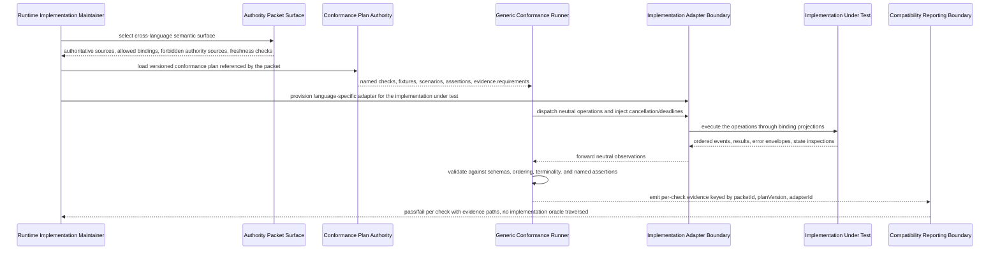

### 4.6 Authority-Packet-Driven Conformance Validation

- **Maps to PRD capability:** CAP-P0-037, CAP-P1-038, CAP-P1-035, CAP-P1-036

```mermaid
sequenceDiagram
participant Maintainer as Runtime Implementation Maintainer
participant Packet as Authority Packet Surface
participant Plan as Conformance Plan Authority
participant Runner as Generic Conformance Runner
participant Adapter as Implementation Adapter Boundary
participant Impl as Implementation Under Test
participant Report as Compatibility Reporting Boundary

Maintainer->>Packet: select cross-language semantic surface
Packet-->>Maintainer: authoritative sources, allowed bindings, forbidden authority sources, freshness checks
Maintainer->>Plan: load versioned conformance plan referenced by the packet
Plan-->>Runner: named checks, fixtures, scenarios, assertions, evidence requirements
Maintainer->>Adapter: provision language-specific adapter for the implementation under test
Runner->>Adapter: dispatch neutral operations and inject cancellation/deadlines
Adapter->>Impl: execute the operations through binding projections
Impl-->>Adapter: ordered events, results, error envelopes, state inspections
Adapter-->>Runner: forward neutral observations
Runner->>Runner: validate against schemas, ordering, terminality, and named assertions
Runner-->>Report: emit per-check evidence keyed by packetId, planVersion, adapterId
Report-->>Maintainer: pass/fail per check with evidence paths, no implementation oracle traversed
```

