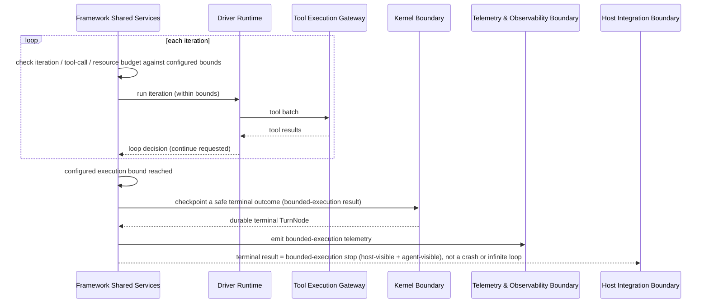

### 4.13 Bounded Execution Stops a Runaway Turn Safely

- **Maps to PRD capability:** CAP-P0-054 (and the Security / Reliability NFRs on bounded execution)

```mermaid
sequenceDiagram
participant Framework as Framework Shared Services
participant Driver as Driver Runtime
participant Tooling as Tool Execution Gateway
participant Kernel as Kernel Boundary
participant Telemetry as Telemetry & Observability Boundary
participant Host as Host Integration Boundary

loop each iteration
  Framework->>Framework: check iteration / tool-call / resource budget against configured bounds
  Framework->>Driver: run iteration (within bounds)
  Driver->>Tooling: tool batch
  Tooling-->>Driver: tool results
  Driver-->>Framework: loop decision (continue requested)
end
Framework->>Framework: configured execution bound reached
Framework->>Kernel: checkpoint a safe terminal outcome (bounded-execution result)
Kernel-->>Framework: durable terminal TurnNode
Framework->>Telemetry: emit bounded-execution telemetry
Framework-->>Host: terminal result = bounded-execution stop (host-visible + agent-visible), not a crash or infinite loop
```

