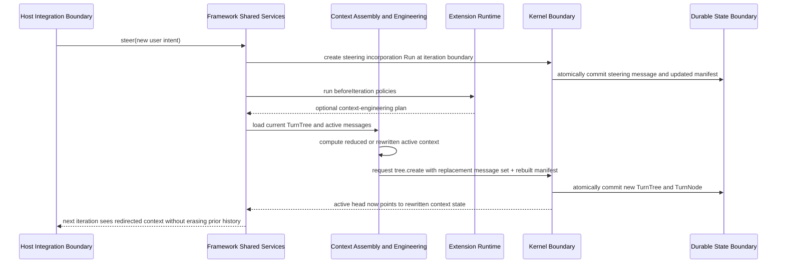

### 4.3 Context Engineering and Steering Between Iterations

- **Maps to PRD capability:** CAP-P0-010, CAP-P0-019, CAP-P1-022

```mermaid
sequenceDiagram
participant Host as Host Integration Boundary
participant Framework as Framework Shared Services
participant Context as Context Assembly and Engineering
participant Ext as Extension Runtime
participant Kernel as Kernel Boundary
participant State as Durable State Boundary

Host->>Framework: steer(new user intent)
Framework->>Kernel: create steering incorporation Run at iteration boundary
Kernel->>State: atomically commit steering message and updated manifest
Framework->>Ext: run beforeIteration policies
Ext-->>Framework: optional context-engineering plan
Framework->>Context: load current TurnTree and active messages
Context->>Context: compute reduced or rewritten active context
Context->>Kernel: request tree.create with replacement message set + rebuilt manifest
Kernel->>State: atomically commit new TurnTree and TurnNode
Kernel-->>Framework: active head now points to rewritten context state
Framework-->>Host: next iteration sees redirected context without erasing prior history
```

