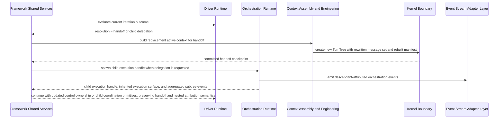

### 4.4 Driver Handoff and Documented Child Orchestration

- **Maps to PRD capability:** CAP-P0-023, CAP-P0-026, CAP-P0-027, CAP-P1-029, CAP-P0-033

```mermaid
sequenceDiagram
participant Framework as Framework Shared Services
participant Driver as Driver Runtime
participant Orch as Orchestration Runtime
participant Context as Context Assembly and Engineering
participant Kernel as Kernel Boundary
participant Events as Event Stream Adapter Layer

Framework->>Driver: evaluate current iteration outcome
Driver-->>Framework: resolution = handoff or child delegation
Framework->>Context: build replacement active context for handoff
Context->>Kernel: create new TurnTree with rewritten message set and rebuilt manifest
Kernel-->>Framework: committed handoff checkpoint
Framework->>Orch: spawn child execution handle when delegation is requested
Orch->>Events: emit descendant-attributed orchestration events
Orch-->>Framework: child execution handle, inherited execution surface, and aggregated subtree events
Framework-->>Driver: continue with updated control ownership or child coordination primitives, preserving handoff and nested attribution semantics
```

