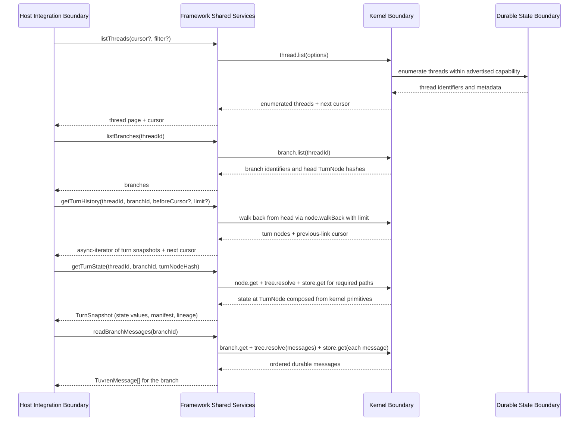

### 4.8 Host Lists Threads and Reads State at a Chosen TurnNode

- **Maps to PRD capability:** CAP-P0-039, CAP-P0-043, CAP-P0-044, CAP-P0-045, CAP-P0-046, CAP-P0-047

```mermaid
sequenceDiagram
participant Host as Host Integration Boundary
participant Framework as Framework Shared Services
participant Kernel as Kernel Boundary
participant State as Durable State Boundary

Host->>Framework: listThreads(cursor?, filter?)
Framework->>Kernel: thread.list(options)
Kernel->>State: enumerate threads within advertised capability
State-->>Kernel: thread identifiers and metadata
Kernel-->>Framework: enumerated threads + next cursor
Framework-->>Host: thread page + cursor
Host->>Framework: listBranches(threadId)
Framework->>Kernel: branch.list(threadId)
Kernel-->>Framework: branch identifiers and head TurnNode hashes
Framework-->>Host: branches
Host->>Framework: getTurnHistory(threadId, branchId, beforeCursor?, limit?)
Framework->>Kernel: walk back from head via node.walkBack with limit
Kernel-->>Framework: turn nodes + previous-link cursor
Framework-->>Host: async-iterator of turn snapshots + next cursor
Host->>Framework: getTurnState(threadId, branchId, turnNodeHash)
Framework->>Kernel: node.get + tree.resolve + store.get for required paths
Kernel-->>Framework: state at TurnNode composed from kernel primitives
Framework-->>Host: TurnSnapshot (state values, manifest, lineage)
Host->>Framework: readBranchMessages(branchId)
Framework->>Kernel: branch.get + tree.resolve(messages) + store.get(each message)
Kernel-->>Framework: ordered durable messages
Framework-->>Host: TuvrenMessage[] for the branch
```

