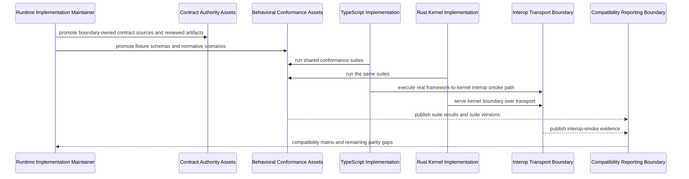

### 4.5 Multi-Implementation Conformance and Compatibility Validation

- **Maps to PRD capability:** CAP-P1-035, CAP-P1-036

```mermaid
sequenceDiagram
participant Maintainer as Runtime Implementation Maintainer
participant Contract as Contract Authority Assets
participant Conf as Behavioral Conformance Assets
participant Ts as TypeScript Implementation
participant Rust as Rust Kernel Implementation
participant Interop as Interop Transport Boundary
participant Report as Compatibility Reporting Boundary

Maintainer->>Contract: promote boundary-owned contract sources and reviewed artifacts
Maintainer->>Conf: promote fixture schemas and normative scenarios
Ts->>Conf: run shared conformance suites
Rust->>Conf: run the same suites
Ts->>Interop: execute real framework-to-kernel interop smoke path
Rust->>Interop: serve kernel boundary over transport
Conf-->>Report: publish suite results and suite versions
Interop-->>Report: publish interop-smoke evidence
Report-->>Maintainer: compatibility matrix and remaining parity gaps
```

