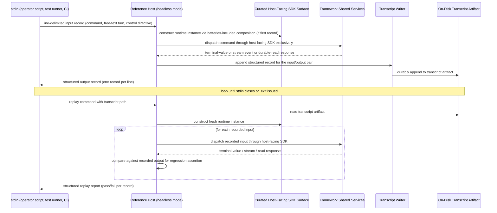

### 4.10 Reference Host Runs Headlessly and Captures a Transcript

- **Maps to PRD capability:** CAP-P1-050, CAP-P1-051

```mermaid
sequenceDiagram
participant Stdin as stdin (operator script, test runner, CI)
participant Host as Reference Host (headless mode)
participant SDK as Curated Host-Facing SDK Surface
participant Framework as Framework Shared Services
participant Transcript as Transcript Writer
participant Disk as On-Disk Transcript Artifact

Stdin->>Host: line-delimited input record (command, free-text turn, control directive)
Host->>SDK: construct runtime instance via batteries-included composition (if first record)
Host->>Framework: dispatch command through host-facing SDK exclusively
Framework-->>Host: terminal-value or stream event or durable-read response
Host->>Transcript: append structured record for the input/output pair
Transcript->>Disk: durably append to transcript artifact
Host-->>Stdin: structured output record (one record per line)
Note over Stdin,Disk: loop until stdin closes or .exit issued

Stdin->>Host: replay command with transcript path
Host->>Disk: read transcript artifact
Host->>SDK: construct fresh runtime instance
loop for each recorded input
  Host->>Framework: dispatch recorded input through host-facing SDK
  Framework-->>Host: terminal-value / stream / read response
  Host->>Host: compare against recorded output for regression assertion
end
Host-->>Stdin: structured replay report (pass/fail per record)
```

