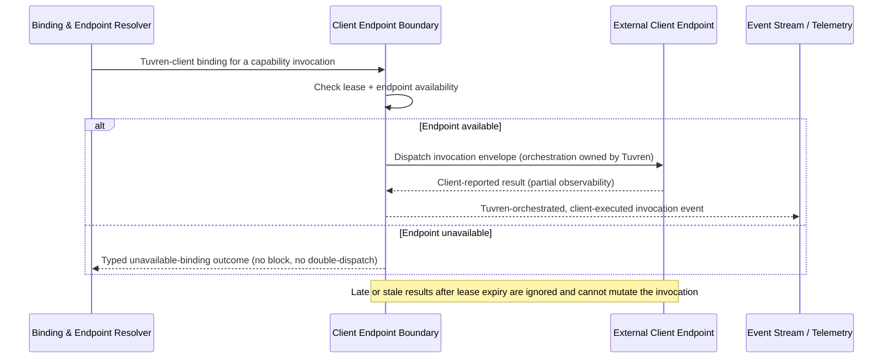

### 4.16 Tuvren-Client Capability Lease and Dispatch

- **Maps to PRD capability:** CAP-P1-063, CAP-P0-061

```mermaid
sequenceDiagram
  participant Resolver as Binding & Endpoint Resolver
  participant Client as Client Endpoint Boundary
  participant Endpoint as External Client Endpoint
  participant Events as Event Stream / Telemetry
  Resolver->>Client: Tuvren-client binding for a capability invocation
  Client->>Client: Check lease + endpoint availability
  alt Endpoint available
    Client->>Endpoint: Dispatch invocation envelope (orchestration owned by Tuvren)
    Endpoint-->>Client: Client-reported result (partial observability)
    Client-->>Events: Tuvren-orchestrated, client-executed invocation event
  else Endpoint unavailable
    Client-->>Resolver: Typed unavailable-binding outcome (no block, no double-dispatch)
  end
  Note over Client,Endpoint: Late or stale results after lease expiry are ignored and cannot mutate the invocation
```

