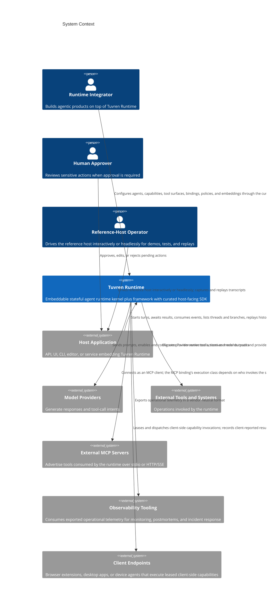
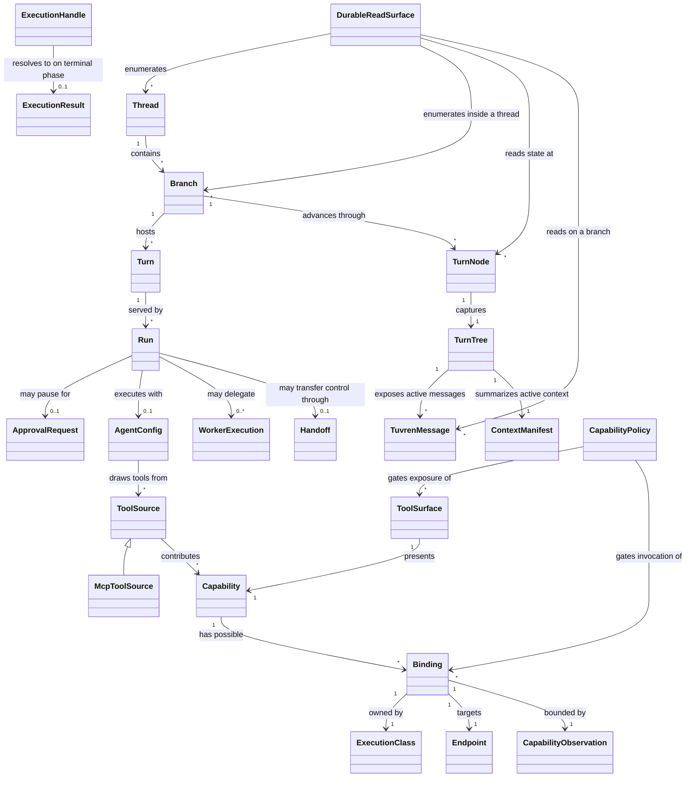

## 7. Conceptual Diagrams (Mermaid)

### 7.1 System Context

```mermaid
C4Context
title System Context
Person(builder, "Runtime Integrator", "Builds agentic products on top of Tuvren Runtime")
Person(approver, "Human Approver", "Reviews sensitive actions when approval is required")
Person(operator, "Reference-Host Operator", "Drives the reference host interactively or headlessly for demos, tests, and replays")
System(runtime, "Tuvren Runtime", "Embeddable stateful agent runtime kernel plus framework with curated host-facing SDK")
System_Ext(host, "Host Application", "API, UI, CLI, editor, or service embedding Tuvren Runtime")
System_Ext(modelProviders, "Model Providers", "Generate responses and tool-call intents")
System_Ext(externalTools, "External Tools and Systems", "Operations invoked by the runtime")
System_Ext(mcpServers, "External MCP Servers", "Advertise tools consumed by the runtime over stdio or HTTP/SSE")
System_Ext(observability, "Observability Tooling", "Consumes exported operational telemetry for monitoring, postmortems, and incident response")
System_Ext(clientEndpoints, "Client Endpoints", "Browser extensions, desktop apps, or device agents that execute leased client-side capabilities")

Rel(builder, runtime, "Configures agents, capabilities, tool surfaces, bindings, policies, and embeddings through the curated SDK")
Rel(host, runtime, "Starts turns, awaits results, consumes events, lists threads and branches, replays history, injects steering, resolves approvals")
Rel(approver, host, "Approves, edits, or rejects pending actions")
Rel(operator, host, "Drives reference host interactively or headlessly; captures and replays transcripts")
Rel(runtime, modelProviders, "Sends prompts, enables and configures provider-native tools, receives model outputs and provider-tool events")
Rel(runtime, externalTools, "Executes Tuvren-server tool actions and records results")
Rel(runtime, mcpServers, "Connects as an MCP client; the MCP binding's execution class depends on who invokes the server")
Rel(runtime, clientEndpoints, "Leases and dispatches client-side capability invocations; records client-reported results")
Rel(runtime, observability, "Exports operational telemetry in a vendor-neutral format")
```

### 7.2 Domain Model

```mermaid
classDiagram
class Thread
class Branch
class Turn
class Run
class TurnNode
class TurnTree
class TuvrenMessage
class ContextManifest
class ApprovalRequest
class AgentConfig
class WorkerExecution
class Handoff
class ExecutionHandle
class ExecutionResult
class DurableReadSurface
class ToolSource
class McpToolSource

Thread "1" --> "*" Branch : contains
Branch "1" --> "*" Turn : hosts
Turn "1" --> "*" Run : served by
Branch "1" --> "*" TurnNode : advances through
TurnNode "1" --> "1" TurnTree : captures
TurnTree "1" --> "*" TuvrenMessage : exposes active messages
TurnTree "1" --> "1" ContextManifest : summarizes active context
Run --> "0..1" ApprovalRequest : may pause for
Run --> "0..1" AgentConfig : executes with
Run --> "0..*" WorkerExecution : may delegate
Run --> "0..1" Handoff : may transfer control through
ExecutionHandle --> "0..1" ExecutionResult : resolves to on terminal phase
DurableReadSurface --> "*" Thread : enumerates
DurableReadSurface --> "*" Branch : enumerates inside a thread
DurableReadSurface --> "*" TurnNode : reads state at
DurableReadSurface --> "*" TuvrenMessage : reads on a branch
ToolSource <|-- McpToolSource
AgentConfig --> "*" ToolSource : draws tools from
class ToolSurface
class Capability
class ExecutionClass
class Binding
class Endpoint
class CapabilityPolicy
class CapabilityObservation
ToolSurface "1" --> "1" Capability : presents
ToolSource --> "*" Capability : contributes
Capability "1" --> "*" Binding : has possible
Binding "1" --> "1" ExecutionClass : owned by
Binding "1" --> "1" Endpoint : targets
Binding "1" --> "1" CapabilityObservation : bounded by
CapabilityPolicy --> "*" ToolSurface : gates exposure of
CapabilityPolicy --> "*" Binding : gates invocation of
```

