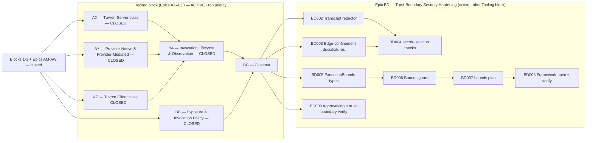

# Critical Path & Execution Plan

## 0. Version

Current local Stage 4 SemVer; full history in `changelog.md`.

## 1. Executive Summary & Active Critical Path

- **Total Active Story Points:** 170 gross (**50 remaining**) across the remainder of the Tooling block plus the trust block — the **Tooling block remainder (Epic BC, 17 points)** as the top-priority front of the queue, and **Epic BD (Trust-Boundary Security Hardening, 33 remaining points, formerly Epic AW, with `KRT-BD001` already complete)** sequenced after it. Epics AM through BB are closed and retained as a compact audit ledger below.
- **Critical Path:** Epics AW, AX, AY, AZ, BA, and BB are closed. Next: closeout — `KRT-BC001 → KRT-BC002 → KRT-BC004` (BC003 can run parallel with BC002). Only after the Tooling block closes does Epic BD run: `KRT-BD002 → KRT-BD004` and `KRT-BD005 → KRT-BD006 → KRT-BD007 → KRT-BD008`, with `KRT-BD009` as an independent close-condition lane (`KRT-BD001` already complete).
- **Planning Assumptions:** The Tooling block (Epics AW–BC) is governed by PRD v0.9.0, Architecture v0.9.0, and TechSpec v0.29.0 (ADR-046, ADR-047); the upstream contracts (`@tuvren/core/capabilities` §3.13, the §4.21 contract) are authored, so the tickets are implementation-ready. Tuvren-client scope is the runtime protocol + attachment seam only — concrete client endpoints (browser extension, desktop, device) remain host-developer deliverables per PRD §6. Provider-native and provider-mediated scope is runtime support proven against today's AI-SDK-bridged providers, with at least one concrete proof per class and additional providers additive later. Epic BD (formerly Epic AW) is governed by PRD v0.8.0 / Architecture v0.8.0 / TechSpec v0.28.x (ADR-042 through ADR-045); it remains active and runs after the Tooling block per product priority. The prior chain (PRD v0.7.0 / Architecture v0.7.0 / TechSpec v0.27.x, ADR-034 through ADR-041, Epics AM-AT) is closed. The Tooling block reframes tool representation within the existing TypeScript line and keeps today's developer-defined tool path working unchanged as the Tuvren-server execution class; it adds no Rust framework/product scope, no new host protocol, no new backend, and no new model-provider family beyond the existing AI SDK bridge. The `product proof gate`, `platform gate`, and `portability gate` from Epic AL remain the staged-gate baseline. The locked external dependency versions per TechSpec §1 still apply.

### Brownfield Continuity Note

- Epics A-AL remain historical context. Epic AL's closure of the staged gates is the foundation this chain extends.
- The current repo proves the host-facing SDK through the serious REPL host (`@tuvren/repl-host`) and its named `proving-host:*` validation lanes; exercises PostgreSQL as a first-class backend; closes the portability gate through `tools/scripts/portability-gate.ts`; and carries the shared primitive surface in `@tuvren/core` with source-bearing runtime implementation in `@tuvren/runtime`. The old contract package handles and `@tuvren/runtime-core` are compatibility shims only.
- Historical closure inventories live under `.constitution/archived/` for audit only.

### Sequential Scope Rule

- The Tooling block (Epics AW–BC) restructures how tools are represented within the existing TypeScript line. It adds no Rust scope, no new model-provider family beyond the existing AI SDK bridge, no new host protocol, and no new backend. It keeps the existing `defineTool` / Tool Execution Gateway path working unchanged as the Tuvren-server execution class.
- The Tuvren-client execution class (Epic AZ) is **closed**: the runtime gained the leased client-endpoint dispatch/result protocol and attachment seam, client-side MCP classification, availability/staleness handling, and partial-observability model. Concrete client endpoints (browser extension, desktop app, device agent) remain host-developer deliverables per PRD §6.
- Provider-native and provider-mediated execution (Epic AY) is closed: the runtime gained representation, configuration, attribution, and observation for those classes with one concrete proof each through mock-backed end-to-end tests. Real live-provider testing (API keys not in CI) is additive scope per the gap note in `.constitution/reports/ay001-provider-surface-matrix.md`. The AY005 multi-turn providerContinuity round-trip is structurally wired; a complete multi-turn proof is deferred to a follow-on epic.
- No Rust framework or Rust product-line expansion is active. No first-class Tuvren model-provider packages are active beyond the AI SDK bridge; the MCP client remains a tool source / binding mechanism, not a model provider.
- No additional host protocols beyond the canonical stream and SSE surfaces are active. Public package publication remains deferred (Epic BG in the roadmap).
- The production-trust block (now Epic BD) hardens the existing TypeScript line only and runs after the Tooling block. Epic AU's fault-injection seam is closed and testkit-only; Epic AV's telemetry surface is closed; execution bounds and secret isolation (Epic BD) add framework-owned guards and credential-edge confinement without altering kernel semantics.

### Planning Heuristic

- Prefer ticket slices that fit focused solo-dev execution while preserving strict gates around product proof, backend rigor, and conformance truthfulness.
- Treat “green because a private harness succeeds” as insufficient evidence once a proving-host or conformance ticket exists on the critical path.

## 2. Project Phasing & Iteration Strategy

### Current Active Scope

- **Block 5 — Tooling restructuring (Epics AW–BC): Epics AW, AX, AY, AZ, BA, and BB closed; Epic BC ACTIVE, top priority.** AW delivered the capability-orchestration foundation; AX delivered the full Tuvren-server execution class; AY delivered provider-native and provider-mediated execution classes; AZ delivered the Tuvren-client execution class; BA delivered the cross-class invocation lifecycle and observation model; BB delivered the full exposure/invocation policy model. The remainder (BC) closes out the Tooling block.
  - **AW — Capability Orchestration Foundation: CLOSED.** See Completed Work Ledger.
  - **AX — Tuvren-Server Execution Class: CLOSED.** See Completed Work Ledger.
  - **AY — Provider-Native & Provider-Mediated Execution Classes: CLOSED.** See Completed Work Ledger.
  - **AZ — Tuvren-Client Execution Class: CLOSED.** See Completed Work Ledger.
  - **BA — Invocation Lifecycle & Observation Model: CLOSED.** See Completed Work Ledger.
  - **BB — Exposure & Invocation Policy Model: CLOSED.** See Completed Work Ledger.
  - **BC — Tooling Restructuring Closeout:** cross-class integration conformance, the framework-spec "Capability Orchestration" section, portability inventory, and the clean `bun run verify` that proves the tooling aspect is finished.
- **Block 4 — Production trust remainder (Epic BD, formerly Epic AW): active, sequenced after the Tooling block.** Hardens execution bounds with a typed `execution_bound_exceeded` terminal result, secret isolation across durable/telemetry/transcript surfaces, and verification that approval gates are non-bypassable and untrusted MCP/tool inputs are validated. `KRT-BD001` (telemetry secret-screening helpers) is already complete.
- **Block 1 — Boundary correctness gate (Epics AM, AN, AO):** closed. `thread.list`, base-handle `awaitResult`, and the five-method `TuvrenRuntime` durable-read surface.
- **Block 2 — Curated surface + ergonomics (Epics AP, AQ, AR):** closed. `@tuvren/core` consolidation, schema-agnostic `defineTool`, and the `createTuvren({...})` batteries-included factory.
- **Block 3 — Capability spikes (Epics AS, AT):** closed. `@tuvren/mcp-client` as a first-class tool source and the consolidated REPL reference host with headless mode and transcript replay.

### Future / Deferred Scope

- Rust framework and Rust product-line work — still blocked.
- First-class Tuvren-owned model-provider packages beyond the TypeScript AI SDK bridge.
- Cross-tenant thread search, multi-tenant ACLs, full-text indexed querying through the embeddable SDK (deferred to a future hosted/server projection).
- Server or REST projection of the durable-read surface (same future projection).
- Model Context Protocol server-side projection — Tuvren as an MCP server. Only the client side and the MCP-as-binding classification are in scope.
- Concrete client endpoint products (browser extension, desktop app, device agent) — the runtime orchestrates and leases attached client endpoints (Epic AZ) but does not ship the endpoints themselves.
- Schema adapters beyond Zod, Standard Schema, and wrapped JSON Schema in the core surface.
- Driver hot-swap or additional drivers beyond the ReAct baseline.
- Additional host protocols beyond the canonical stream and SSE surfaces; additional official backends beyond memory, SQLite, and PostgreSQL.
- Public package publication and final long-lived package curation (Epic BG in the roadmap below).

#### Post-Tooling / Post-Trust Roadmap (Epics BE–BI) — Named, Not Yet Ticketed

These epics are the agreed direction after the Tooling block and the trust block, toward host adoption plus first-party dogfooding (PRD §1.4). They are recorded with enough scope to anchor a future planning session; they are intentionally NOT decomposed into tickets yet.

- **Epic BE — Performance Characterization & Regression Budgets.** Benchmark the hot paths, publish documented performance budgets, and wire a `bench` regression gate into the canonical verification path. Prerequisite: the durability guarantees from Epic AU are proven first.
- **Epic BF — Public API Surface Freeze & Semver Discipline.** Define the stable public API of `@tuvren/core` (including the new `/capabilities` surface) + `@tuvren/runtime`. Run after the reference application (BI) so the surface is frozen against real usage friction. BF and BI form an iteration ordering, not a hard dependency cycle: BI builds on the still-unfrozen surface, and BF performs the freeze after absorbing BI's friction feedback.
- **Epic BG — Publication & Release Engineering.** npm publication of the curated packages, changesets / versioning, CI release pipeline, and provenance. Gated on BF's surface freeze.
- **Epic BH — Documentation & Onboarding.** Docs site, getting-started, cookbook, and API reference.
- **Epic BI — Reference Application (Dogfood Target).** A real, non-trivial application built end-to-end on Tuvren that exercises the capability-orchestration model and surfaces API friction feeding back into BF.

### Archived or Already Completed Scope

- Epic AH completed the constitutional authority reset; the live authority chain is the four constitutional documents plus explicit support inputs.
- Epics A-Q established the baseline TypeScript runtime, ReAct path, provider bridge, stream adapters, playground host, and release-hardening work.
- Epics AI–AL completed the high-level SDK audit, the serious REPL proving host, the PostgreSQL platform gate, and the portability-gate closure.
- Epics R-AG established the multi-language transition foundation, shared conformance architecture, and kernel interop.
- Epics AM-AV are summarized in the completed-work ledger in §4.
- The active forward path is the Tooling block (Epics AW–BC) followed by the trust block (Epic BD); see Current Active Scope.

## 3. Build Order (Mermaid)

## 5. Issue-Level Definition of Done

The active chain is not closed until every applicable statement below is true in the repository and in the live constitution.

### Tooling block (Epics AW–BC) — "the tooling aspect is finished"

- `@tuvren/core` exposes the `./capabilities` subpath carrying the §3.13 shapes, declared as a binding section in the merged shared-core authority packet.
- The runtime separates the model-facing Tool Surface from the underlying Capability (Capability Registry), resolves each capability to one execution class and endpoint (Binding & Endpoint Resolver), and enforces exposure-time and invocation-time policy above driver discretion (Capability Policy Engine) with the full policy dimensions (residency, risk, presence, idempotency/retry, credential boundaries, composition/precedence).
- All four execution classes are orchestrated with honest per-class observation/control limits: **Tuvren-server** has the full lifecycle (validate, retry, cancel, trace, audit, tenant isolation, rate-limit, server-side MCP, server sandbox), today's `defineTool` path included unchanged; **provider-native** and **provider-mediated** are enabled/configured/attributed through the AI SDK bridge with one concrete proof each and recorded from provider-exposed events only; **Tuvren-client** is orchestrated through the leased dispatch/result protocol and attachment seam (runtime side only — concrete endpoints remain host deliverables), including client-side MCP, availability/staleness, and partial observability.
- MCP is classified as a binding mechanism by who invokes or runs the server, never as an execution class, across all applicable classes.
- The conceptual invariant holds and is conformance-verified end to end: every model-visible tool call resolves to a policy-checked capability invocation against a known execution class, including a cross-class integration check exercising all four classes in one agent segment.
- Canonical events and operational telemetry carry the execution-class and `owner` attribution; the runtime exposes no cancel/retry/audit affordance for a class that does not grant it; secret isolation holds for every class.
- `docs/KrakenFrameworkSpecification.md` states the normative Capability Orchestration model; the capability surface is in the portability inventory; and `bun run verify` exits zero from a clean checkout with refreshed compatibility evidence for the capability-orchestration lanes.

### Epic BD — Trust-Boundary Security Hardening

- The completed-work ledger remains the only live Tasks summary for Epics AM-AV; historical ticket bodies stay in git history or `.constitution/archived/`.
- The framework enforces execution bounds (`maxIterations`, `maxToolCalls`, `maxWallClockMs`) above driver discretion by stopping runtime control flow at the bound and propagating abort signals through `TuvrenPrompt.signal` and `ToolExecutionContext.signal`.
- Breaching a hard-stop bound yields a `failed` `ExecutionResult` with code `execution_bound_exceeded`, a fatal canonical `error` event carrying the same code/details, a failed terminal `turn.end` event, and a bounded-execution telemetry event; bound metadata is carried by the result/error-details/telemetry rather than `turn.end`; late completion after abort is ignored; `AgentConfig.maxIterations` is clamped by `bounds.maxIterations`; `maxConcurrentToolCalls` is enforced as a throttle; and invalid non-finite or non-positive bound configuration is rejected.
- Secret isolation is enforced and verified: credentials are confined to the Provider Gateway and MCP Client edges; durable, canonical-stream, telemetry, and transcript surfaces are credential-free zones; transcript headers redact credential-shaped backend options; telemetry secret-screening helpers exclude credential-shaped attributes and sanitize telemetry error summaries; the `secret-isolation` check set asserts absence of the configured secrets and their common encoded variants across persisted records, stream events, telemetry, and transcripts.
- The trust-boundary guarantees are verified: approval-gated tool work is non-bypassable, and untrusted MCP/tool inputs are validated before execution with failures surfaced as agent-visible results.
- `docs/KrakenFrameworkSpecification.md` states the Execution Bounds guard; `bun run verify` exits zero from a clean checkout after the Tooling block and Epic BD close.
