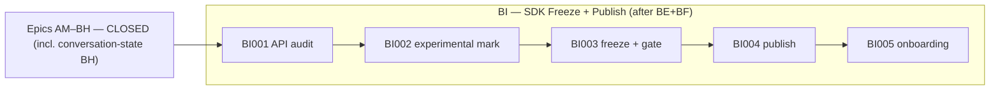

# Critical Path & Execution Plan

## 0. Version

Current local Stage 4 SemVer; full history in `changelog.md`.

## 1. Executive Summary & Active Critical Path

- **Total Active Story Points:** 21 (**21 remaining**) — with the conversation-state **Epic BH (Conversation-State Ownership Hardening, 16 pts) now closed** (following the tenancy keystone Epic BE, the data-lifecycle Epic BF, and the lease-clock Epic BG), the remaining **SaaS-Readiness block is Epic BI alone** — the active execution plan that lets any host embed Tuvren as a multi-tenant SaaS substrate without forking the runtime. Per-epic: BI 21. Everything through Epic BH (the Tooling block AW–BC, the trust block BD, the tenancy keystone BE, the data-lifecycle epic BF, the lease-clock epic BG, and the conversation-state epic BH) remains closed and is retained as a compact audit ledger below.
- **Critical Path:** `KRT-BI001 → KRT-BI002 → KRT-BI003 → KRT-BI004 → KRT-BI005`. With the keystone Epic BE (tenancy scope + isolation), the data-lifecycle Epic BF (reclamation + crypto-shredding erasure), the lease-clock Epic BG (backend-authoritative lease clock + side-effect-once), and the conversation-state Epic BH (conversation-state ownership hardening) all closed, the active critical path is the SDK freeze epic (BI) alone, which per ADR-054 (freeze-after-tenancy+GC) has both of its gating epics (BE + BF) landed.
- **Planning Note — implementation epics landed:** Epics BE, BF, BG, and BH have **landed**: BE's kernel `docs/KrakenKernelSpecification.md` §2.3 scope-resolved-identity claims and the framework scope notes, BF's §9.4 `maintenance.reclamation` reachability-primitive claims, BG's §5.2 backend-authoritative lease-clock + framework "Running Lease Ownership" side-effect-once / client-result-as-proposal claims, and BH's framework `docs/KrakenFrameworkSpecification.md` §1.1 v0.21 conversation-state-ownership claim, are all promoted from `missing-conformance-follow-up` to `authority-backed-conformance-covered` (the kernel-protocol authority packet declares `bindingSections.scope-isolation` and `bindingSections.reclamation` and registers the runnable, evidence-backed `kernel-scope-isolation.json` and `kernel-reclamation.json` plans; the shared-core operational-telemetry plan proves scope-correlated telemetry/transcripts, and BF's reclaim-probe + erasure-probe carry per-backend evidence across memory/SQLite/PostgreSQL; BG registers a `kernel.shared-lease-clock`-gated clock-skew-preemption check on `kernel-run-liveness.json` and a client-result-as-proposal check on `runtime-api-lifecycle-extended.json`; and BH registers the `provider-api-conversation-state.json` plan — gated behind the `providers.conversation-state-ownership` capability the providers conformance adapter advertises — in the provider-api authority packet, carrying per-lane evidence), with implementation source, schema, generated artifacts, conformance plans, and refreshed compatibility evidence all changed accordingly. The §9.4 non-support row (a backend advertising `maintenance.reclamation=false` rejecting with `kernel_capability_unsupported`) stays classified with the rest of the capability-gating contract (`missing-conformance-follow-up`, tracked to `KRT-AM010`), since the promoted plan only exercises capability-bearing backends. No SaaS-readiness implementation-epic spec section remains deferred; the only active epic, BI (SDK Stabilization + Publication), freezes and publishes the existing surface and adds no new kernel/framework semantics, so the docs-to-authority freeze gate (264 classified claims) and `bun run verify` pass **green** with no false conformance coverage. The declare-then-promote discipline was used by every implementation epic — `KRT-BE001`/`KRT-BF001`/`KRT-BG001`/`KRT-BH001` declared their surfaces and conformance-plan references in the owning boundary authority packet, and `KRT-BE007`/`KRT-BF007`/`KRT-BG005` plus the BH closeout promotion flipped them to `authority-backed-conformance-covered` once each plan was runnable, registered, and evidence-backed, because the portability gate (`plan-applicability-has-adapter`) and the compatibility evidence gate forbid registering a runnable plan before an adapter can execute it.
- **Planning Assumptions:** The Tooling block (Epics AW–BC) is governed by PRD v0.9.0, Architecture v0.9.0, and TechSpec v0.29.0 (ADR-046, ADR-047); the upstream contracts (`@tuvren/core/capabilities` §3.13, the §4.21 contract) are authored, so the tickets are implementation-ready. Tuvren-client scope is the runtime protocol + attachment seam only — concrete client endpoints (browser extension, desktop, device) remain host-developer deliverables per PRD §6. Provider-native and provider-mediated scope is runtime support proven against today's AI-SDK-bridged providers, with at least one concrete proof per class and additional providers additive later. Epic BD (formerly Epic AW) is governed by PRD v0.8.0 / Architecture v0.8.0 / TechSpec v0.28.x (ADR-042 through ADR-045); it is now closed, having run after the Tooling block per product priority. The prior chain (PRD v0.7.0 / Architecture v0.7.0 / TechSpec v0.27.x, ADR-034 through ADR-041, Epics AM-AT) is closed. The Tooling block reframes tool representation within the existing TypeScript line and keeps today's developer-defined tool path working unchanged as the Tuvren-server execution class; it adds no Rust framework/product scope, no new host protocol, no new backend, and no new model-provider family beyond the existing AI SDK bridge. The `product proof gate`, `platform gate`, and `portability gate` from Epic AL remain the staged-gate baseline. The locked external dependency versions per TechSpec §1 still apply.

### Brownfield Continuity Note

- Epics A-AL remain historical context. Epic AL's closure of the staged gates is the foundation this chain extends.
- The current repo proves the host-facing SDK through the serious REPL host (`@tuvren/repl-host`) and its named `proving-host:*` validation lanes; exercises PostgreSQL as a first-class backend; closes the portability gate through `tools/scripts/portability-gate.ts`; and carries the shared primitive surface in `@tuvren/core` with source-bearing runtime implementation in `@tuvren/runtime`. The old contract package handles and `@tuvren/runtime-core` are compatibility shims only.
- Historical closure inventories live under `.constitution/archived/` for audit only.

### Sequential Scope Rule

- The Tooling block (Epics AW–BC) restructures how tools are represented within the existing TypeScript line. It adds no Rust scope, no new model-provider family beyond the existing AI SDK bridge, no new host protocol, and no new backend. It keeps the existing `defineTool` / Tool Execution Gateway path working unchanged as the Tuvren-server execution class.
- The Tuvren-client execution class (Epic AZ) is **closed**: the runtime gained the leased client-endpoint dispatch/result protocol and attachment seam, client-side MCP classification, availability/staleness handling, and partial-observability model. Concrete client endpoints (browser extension, desktop app, device agent) remain host-developer deliverables per PRD §6.
- Provider-native and provider-mediated execution (Epic AY) is closed: the runtime gained representation, configuration, attribution, and observation for those classes with one concrete proof each through mock-backed end-to-end tests. Real live-provider testing (API keys not in CI) is additive scope per the gap note in `.constitution/reports/ay001-provider-surface-matrix.md`. The AY005 multi-turn providerContinuity round-trip is structurally wired; a complete multi-turn proof is deferred to a follow-on epic.
- No Rust framework or Rust product-line expansion is active. No first-class Tuvren model-provider packages are active beyond the AI SDK bridge; the MCP client remains a tool source / binding mechanism, not a model provider.
- No additional host protocols beyond the canonical stream and SSE surfaces are active. Public package publication is now **active** scope in Epic BI (SDK Stabilization + npm Publication), gated to run after the tenancy (BE) and data-lifecycle (BF) epics.
- The production-trust block (now Epic BD) hardened the existing TypeScript line only and ran after the Tooling block; it is now closed. Epic AU's fault-injection seam is closed and testkit-only; Epic AV's telemetry surface is closed; execution bounds and secret isolation (Epic BD) added framework-owned guards and credential-edge confinement without altering kernel semantics.

### Planning Heuristic

- Prefer ticket slices that fit focused solo-dev execution while preserving strict gates around product proof, backend rigor, and conformance truthfulness.
- Treat “green because a private harness succeeds” as insufficient evidence once a proving-host or conformance ticket exists on the critical path.
- Size each epic to roughly **3k–8k LoC** of implementation. In the SaaS-Readiness block, BE and BF sit toward the upper end (multi-backend scope work; the kernel reclamation primitive plus the multi-edge crypto-shredding envelope), while BG, BH, and BI sit toward the lower end (lease-clock refinement, conversation-state hardening, and freeze/publish tooling).

## 2. Project Phasing & Iteration Strategy

### Current Active Scope

- **Block 6 — SaaS-Readiness (Epic BI active; BE–BH closed): ACTIVE.** The runtime is functionally complete and production-trust-hardened; this block makes it safe and stable to embed as a multi-tenant SaaS substrate without forking, governed by PRD v0.10.0 (CAP-P0-064 through CAP-P0-070), Architecture v0.10.0, and TechSpec v0.30.x (ADR-048 through ADR-055). Tuvren stays tenancy-agnostic: it provides the mechanism (scope seam, isolation, reclamation, erasure, side-effect-once, conversation-state ownership, a published stable SDK), and the host owns tenancy/retention policy and keys. The keystone Epic BE, the data-lifecycle Epic BF, the lease-clock Epic BG, and the conversation-state Epic BH have landed; Epic BI remains active.
  - **BE — Tenancy Scope Seam + Isolation-by-Construction: CLOSED.** Scope bound at backend construction across memory/SQLite/PostgreSQL (memory scope-keyed stores; SQLite file-per-scope; PostgreSQL scope-keyed `(snapshot_id, scope)` row under row-level isolation); scope-resolved content addressing with no cross-scope dedup; durable-read scope safety across all three backends; scope-tagged telemetry and transcripts proven leak-free; cross-scope isolation conformance promoted to runnable, evidence-backed coverage. The keystone; the kernel syscall surface and gRPC interop stay scope-free (ADR-048). See Completed Work Ledger.
  - **BF — Data Lifecycle: Reclamation + Crypto-Shredding Erasure: CLOSED.** Kernel `maintenance.reclamation` reachability mark-and-sweep (capability-advertised, grace-windowed against the oldest active lease, per-Scope) across memory/SQLite/PostgreSQL, with non-supporting backends rejecting via `kernel_capability_unsupported`; host-key-encrypted untrusted-edge payload envelope (interface-first `PayloadCodec` contract plus a default AES-256-GCM codec; keys stay host-held, the kernel stores only ciphertext + keyRef) at the provider/tool/MCP/client edges with typed erased reads; per-scope reclaim and the §4.17 tenant-offboarding flow (destroy keys + reclaim + drop the scope partition, no other scope affected); data-lifecycle conformance promoted to runnable, evidence-backed coverage (reclaim-probe + erasure-probe, all five checks passing across the three backends). See Completed Work Ledger.
  - **BG — Backend-Authoritative Lease Clock + Side-Effect-Once: CLOSED.** PostgreSQL backend-time lease stamping/comparison via `RuntimeBackendTx.now()` (`clock_timestamp()`) and the `shared-lease-clock` `BackendCapability` bit (memory + single-file SQLite keep the in-process clock); the `(runId, callId, fencingToken)` idempotency envelope on server (`ToolExecutionContext`) and client (`ClientInvocationEnvelope`) dispatch; no-retry of in-flight `nonRetryable` on lease loss with completed results recovered by `callId`; client-result-as-proposal gated behind a valid run fencing token; preemption-under-clock-skew conformance promoted to runnable, evidence-backed coverage (a `kernel.shared-lease-clock`-gated clock-skew-preemption check proving no split-brain + side-effect-once-by-`callId`, and a client-result-as-proposal check proving no stale-client commit). Realizes ADR-050/052; the `(runId, callId, fencingToken)` identity is a per-attempt envelope and cross-recovery side-effect-once is achieved by composition (recorded in tech-spec/changelog v0.30.3). See Completed Work Ledger.
  - **BH — Conversation-State Ownership Hardening: CLOSED.** Reconstruct-from-DAG proof (next-turn provider request rebuilt purely from durable head-state equals the live-path request, no provider-held state); continuity artifacts shreddable via the BF005 `MESSAGE_PAYLOAD_EDGE` codec, so no new `provider.continuity` edge was needed; the AY005 multi-turn `providerContinuity` round-trip closed with a real multi-turn test (existing message-part replay already round-trips); provider-side caching proven correctness-neutral (identical produced canonical result on cache miss vs hit, only cost/latency differ); and the ADR-055 AI SDK bridge `providerExecuted`/`dynamic` fidelity audit, which confirmed structural immunity to vercel/ai #10888 and found + fixed a real defect (declared provider-executed `tool-call` parts were rejected before the `tool-result` carrying the provider-native attribution; the fix skips declared provider-executed calls and still rejects undeclared ones). The framework §1.1 v0.21 conversation-state note is promoted to `authority-backed-conformance-covered`. See Completed Work Ledger.
  - **BI — SDK Stabilization + npm Publication: ACTIVE (gated after BE + BF).** Stable-core API audit; experimental `@tuvren/core/capabilities` marking; semver freeze + API-stability gate; registry publication; adopter onboarding.
- **Block 5 — Tooling restructuring (Epics AW–BC): FULLY CLOSED.** AW delivered the capability-orchestration foundation; AX delivered the full Tuvren-server execution class; AY delivered provider-native and provider-mediated execution classes; AZ delivered the Tuvren-client execution class; BA delivered the cross-class invocation lifecycle and observation model; BB delivered the full exposure/invocation policy model; BC delivered the cross-class integration conformance, normative §11 framework-spec section, portability inventory v0.4.0, and a clean `bun run verify` with 446/446 applicable framework checks passing. See Completed Work Ledger.
  - **AW — Capability Orchestration Foundation: CLOSED.** See Completed Work Ledger.
  - **AX — Tuvren-Server Execution Class: CLOSED.** See Completed Work Ledger.
  - **AY — Provider-Native & Provider-Mediated Execution Classes: CLOSED.** See Completed Work Ledger.
  - **AZ — Tuvren-Client Execution Class: CLOSED.** See Completed Work Ledger.
  - **BA — Invocation Lifecycle & Observation Model: CLOSED.** See Completed Work Ledger.
  - **BB — Exposure & Invocation Policy Model: CLOSED.** See Completed Work Ledger.
  - **BC — Tooling Restructuring Closeout: CLOSED.** See Completed Work Ledger.
- **Block 4 — Production trust remainder (Epic BD, formerly Epic AW): CLOSED.** Hardened execution bounds with a typed `execution_bound_exceeded` terminal result and a framework-owned bounds guard enforced above driver discretion (iteration/tool-call/wall-clock hard stops, concurrency throttle, deadline-abort propagation, late-completion ignoring); secret isolation across durable, canonical-stream, telemetry, and transcript surfaces verified by a shared runner-owned secret-absence helper; and independent verification that approval gates are non-bypassable and untrusted MCP/tool inputs are validated before execution. `KRT-BD001` (telemetry secret-screening helpers) closed earlier with Epic AV. With Epic BD closed, the active execution plan is empty. See Completed Work Ledger.
- **Block 1 — Boundary correctness gate (Epics AM, AN, AO):** closed. `thread.list`, base-handle `awaitResult`, and the five-method `TuvrenRuntime` durable-read surface.
- **Block 2 — Curated surface + ergonomics (Epics AP, AQ, AR):** closed. `@tuvren/core` consolidation, schema-agnostic `defineTool`, and the `createTuvren({...})` batteries-included factory.
- **Block 3 — Capability spikes (Epics AS, AT):** closed. `@tuvren/mcp-client` as a first-class tool source and the consolidated REPL reference host with headless mode and transcript replay.

### Future / Deferred Scope

- Rust framework and Rust product-line work — still blocked.
- Native first-class Tuvren-owned model-provider clients (Anthropic/OpenAI/Gemini) beyond the TypeScript AI SDK bridge — deferred behind the named ADR-055 trigger (provider statefulness that cannot round-trip through the baseline `LanguageModelV3` contract, or context-manifest-driven optimizations the bridge cannot express). Recast as Epic BJ below.
- Cross-tenant thread search, multi-tenant ACLs, full-text indexed querying through the embeddable SDK (deferred to a future hosted/server projection).
- Server or REST projection of the durable-read surface (same future projection).
- Model Context Protocol server-side projection — Tuvren as an MCP server. Only the client side and the MCP-as-binding classification are in scope.
- Concrete client endpoint products (browser extension, desktop app, device agent) — the runtime orchestrates and leases attached client endpoints (Epic AZ) but does not ship the endpoints themselves.
- Schema adapters beyond Zod, Standard Schema, and wrapped JSON Schema in the core surface.
- Driver hot-swap or additional drivers beyond the ReAct baseline.
- Additional host protocols beyond the canonical stream and SSE surfaces; additional official backends beyond memory, SQLite, and PostgreSQL.
#### Post-SaaS-Readiness Roadmap (Epics BJ–BM) — Named, Not Yet Ticketed

The productionization roadmap previously sketched under Epics BE–BI has been **recast**: BE–BI are now the ticketed SaaS-Readiness block above (tenancy, data-lifecycle, lease-clock/side-effect-once, conversation-state ownership, and SDK freeze+publication, which absorbs the former "API surface freeze" and "publication & release engineering" epics). The remaining adoption/dogfooding themes are renumbered and stay named-but-not-yet-ticketed, recorded with enough scope to anchor a future planning session:

- **Epic BJ — Native Provider Clients.** First-class Anthropic/OpenAI/Gemini clients implementing the existing Tuvren provider contract, additive to (never replacing) the AI SDK bridge. Deferred behind the named ADR-055 trigger; the standing business case is the full-input-token cost of conversation-state ownership (ADR-053) that manifest-driven caching in a native client would cut.
- **Epic BK — Performance Characterization & Regression Budgets.** Benchmark the hot paths (including the scope, reclamation, and lease-clock additions), publish documented performance budgets, and wire a `bench` regression gate into the canonical verification path.
- **Epic BL — Documentation & Onboarding.** Docs site, getting-started, cookbook, and API reference for the now-published stable core (extends the onboarding seed in `KRT-BI005`).
- **Epic BM — Reference Application (Dogfood Target).** A real, non-trivial multi-tenant application built end-to-end on the published SaaS-ready SDK that exercises the capability-orchestration model and surfaces API friction.

### Archived or Already Completed Scope

- Epic AH completed the constitutional authority reset; the live authority chain is the four constitutional documents plus explicit support inputs.
- Epics A-Q established the baseline TypeScript runtime, ReAct path, provider bridge, stream adapters, playground host, and release-hardening work.
- Epics AI–AL completed the high-level SDK audit, the serious REPL proving host, the PostgreSQL platform gate, and the portability-gate closure.
- Epics R-AG established the multi-language transition foundation, shared conformance architecture, and kernel interop.
- Epics AM-AV are summarized in the completed-work ledger in §4.
- The Tooling block (Epics AW–BC), the trust block (Epic BD, Trust-Boundary Security Hardening), the tenancy keystone (Epic BE, Tenancy Scope Seam + Isolation-by-Construction), the data-lifecycle epic (Epic BF, Reclamation + Crypto-Shredding Erasure), the lease-clock epic (Epic BG, Backend-Authoritative Lease Clock + Side-Effect-Once), and the conversation-state epic (Epic BH, Conversation-State Ownership Hardening) are fully closed. The active execution plan is now Epic BI alone (SDK Stabilization + Publication), the final ticketed epic of the SaaS-Readiness block; see Current Active Scope and the Post-SaaS-Readiness Roadmap (Epics BJ–BM).

## 3. Build Order (Mermaid)

Active SaaS-Readiness block only (Epics AM–BH are closed; Epics BJ–BM are deferred and excluded).

## 5. Issue-Level Definition of Done

The active chain is not closed until every applicable statement below is true in the repository and in the live constitution.

### SaaS-Readiness block (Epics BE–BI) — "Tuvren is embeddable as a multi-tenant SaaS substrate"

- **(Epic BE — CLOSED; satisfied.)** A host binds a Scope at backend/connection construction and gets isolation-by-construction: across memory, SQLite, and PostgreSQL, no read, enumeration, or existence check crosses a Scope, identical content in two Scopes is two independent durable objects, and the kernel syscall surface and gRPC interop remain scope-free (no scope argument). Cross-scope isolation conformance passes per backend; telemetry and transcripts are scope-correlated and carry no other Scope's data.
- **(Epic BF — CLOSED; satisfied.)** The kernel exposes a capability-gated `maintenance.reclamation` reachability primitive that releases only state unreachable from live roots, is grace-windowed against active leases, and is per-Scope; backends advertise support honestly and non-supporting backends reject with `kernel_capability_unsupported`. Sensitive untrusted-edge payloads (provider/tool/MCP/client results and carried continuity artifacts) are stored as host-key-encrypted references so erasure is crypto-shredding (host destroys the key) that renders the payload unrecoverable while the lineage hash structure stays intact; the tenant-offboarding flow (drop Scope + destroy keys) works. Data-lifecycle conformance proves no reachable state is released and erasure preserves lineage structure.
- **(Epic BG — CLOSED; satisfied.)** For shared multi-worker backends the lease-expiry clock is backend-authoritative (PostgreSQL server time via `RuntimeBackendTx.now()`), the `BackendCapability` advertises shared-lease-clock support, single-writer embedded backends keep the in-process clock, and recovery of a stale execution never re-runs an in-flight `nonRetryable` side effect: side-effecting invocations carry the `(runId, callId, fencingToken)` idempotency identity, and a stale or late client-reported result is a proposal that cannot mutate committed history. Preemption-under-clock-skew conformance proves at-most-once side effects and no stale-client commit. (Realization note: the identity is a per-attempt envelope key; cross-recovery side-effect-once is achieved by composition of backend-clock no-split-brain + no-retry + recovery-skip-by-`callId` + client-result-as-proposal — tech-spec/changelog v0.30.3.)
- **(Epic BH — CLOSED; satisfied.)** The durable lineage is the unconditional source of truth for provider requests: a request is reconstructable from lineage alone (proven by rebuilding the next-turn provider request from durable head-state with no provider-held state, equal to the live-path request), carried continuity artifacts are shreddable references (message-part `providerMetadata` via the BF005 `MESSAGE_PAYLOAD_EDGE` codec — no separate `provider.continuity` edge was needed), provider-side caching is proven correctness-neutral (identical produced canonical result on cache miss vs hit, only cost/latency differ), the AY005 multi-turn `providerContinuity` round-trip is closed with a real multi-turn test, and the AI SDK bridge `providerExecuted`/`dynamic` fidelity audit confirms provider-native attribution without spurious validation errors (structurally immune to vercel/ai #10888; one inline provider-executed-call rejection defect found and fixed).
- After Epics BE and BF land, the curated host-facing SDK is frozen under semantic versioning with an API-stability gate in the verification path, the `@tuvren/core/capabilities` advanced classes are marked experimental and excluded from the guarantee, no `Kraken*` internal type leaks on the public surface, the curated packages are published to the registry with peer-dependency version-skew safety and provenance, and an adopter can install and issue a first Turn from the published packages.
- Each implementation epic's first ticket (`KRT-BE001`, `KRT-BF001`, `KRT-BG001`, `KRT-BH001`) promotes the docs-to-authority coverage matrix, authority packets, and conformance plans for the kernel v0.12 / framework v0.21 spec sections it implements from `missing-conformance-follow-up` to `authority-backed-conformance-covered`, so `bun run verify` exits zero from a clean checkout. Epics BE, BF, BG, and BH have all completed this cascade (BE's §2.3 scope-isolation, BF's §9.4 reclamation, BG's §5.2 backend-clock + framework side-effect-once / client-result-as-proposal, and BH's §1.1 conversation-state-ownership claims are authority-backed and evidence-covered; the §9.4 non-support rejection row stays with the capability-gating contract tracked to `KRT-AM010`). No implementation-epic spec section remains deferred; the only remaining active epic, BI, freezes and publishes the existing surface and introduces no new kernel/framework spec semantics.

### Tooling block (Epics AW–BC) — "the tooling aspect is finished"

- `@tuvren/core` exposes the `./capabilities` subpath carrying the §3.13 shapes, declared as a binding section in the merged shared-core authority packet.
- The runtime separates the model-facing Tool Surface from the underlying Capability (Capability Registry), resolves each capability to one execution class and endpoint (Binding & Endpoint Resolver), and enforces exposure-time and invocation-time policy above driver discretion (Capability Policy Engine) with the full policy dimensions (residency, risk, presence, idempotency/retry, credential boundaries, composition/precedence).
- All four execution classes are orchestrated with honest per-class observation/control limits: **Tuvren-server** has the full lifecycle (validate, retry, cancel, trace, audit, tenant isolation, rate-limit, server-side MCP, server sandbox), today's `defineTool` path included unchanged; **provider-native** and **provider-mediated** are enabled/configured/attributed through the AI SDK bridge with one concrete proof each and recorded from provider-exposed events only; **Tuvren-client** is orchestrated through the leased dispatch/result protocol and attachment seam (runtime side only — concrete endpoints remain host deliverables), including client-side MCP, availability/staleness, and partial observability.
- MCP is classified as a binding mechanism by who invokes or runs the server, never as an execution class, across all applicable classes.
- The conceptual invariant holds and is conformance-verified end to end: every model-visible tool call resolves to a policy-checked capability invocation against a known execution class, including a cross-class integration check exercising all four classes in one agent segment.
- Canonical events and operational telemetry carry the execution-class and `owner` attribution; the runtime exposes no cancel/retry/audit affordance for a class that does not grant it; secret isolation holds for every class.
- `docs/KrakenFrameworkSpecification.md` states the normative Capability Orchestration model; the capability surface is in the portability inventory; and `bun run verify` exits zero from a clean checkout with refreshed compatibility evidence for the capability-orchestration lanes.

### Epic BD — Trust-Boundary Security Hardening — CLOSED

All statements below now hold in the repository and the live constitution; the epic file is archived under `.constitution/tasks/completed/` and summarized in the Completed Work Ledger.

- The completed-work ledger remains the only live Tasks summary for Epics AM-AV; historical ticket bodies stay in git history or `.constitution/archived/`.
- The framework enforces execution bounds (`maxIterations`, `maxToolCalls`, `maxWallClockMs`) above driver discretion by stopping runtime control flow at the bound and propagating abort signals through `TuvrenPrompt.signal` and `ToolExecutionContext.signal`.
- Breaching a hard-stop bound yields a `failed` `ExecutionResult` with code `execution_bound_exceeded`, a fatal canonical `error` event carrying the same code/details, a failed terminal `turn.end` event, and a bounded-execution telemetry event; bound metadata is carried by the result/error-details/telemetry rather than `turn.end`; late completion after abort is ignored; `AgentConfig.maxIterations` is clamped by `bounds.maxIterations`; `maxConcurrentToolCalls` is enforced as a throttle; and invalid non-finite or non-positive bound configuration is rejected.
- Secret isolation is enforced and verified: credentials are confined to the Provider Gateway and MCP Client edges; durable, canonical-stream, telemetry, and transcript surfaces are credential-free zones; transcript headers redact credential-shaped backend options; telemetry secret-screening helpers exclude credential-shaped attributes and sanitize telemetry error summaries; the `secret-isolation` check set asserts absence of the configured secrets and their common encoded variants across persisted records, stream events, telemetry, and transcripts.
- The trust-boundary guarantees are verified: approval-gated tool work is non-bypassable, and untrusted MCP/tool inputs are validated before execution with failures surfaced as agent-visible results.
- `docs/KrakenFrameworkSpecification.md` states the Execution Bounds guard; `bun run verify` exits zero from a clean checkout after the Tooling block and Epic BD close.
