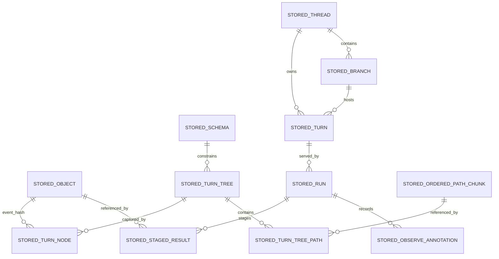

# Data Models

> **Authority note:** This file is descriptive documentation migrated verbatim from `TechSpec.md §3`. The authoritative durable-state schemas are boundary-owned (kernel CBOR record profile, the official SQLite/PostgreSQL backend schemas, and the capability concept JSON schemas under `boundaries/shared/contracts/core/artifacts/json-schema/`). Per ADR-023/024/025 and the authority-packet `forbiddenAuthoritySources`, the constitution is never the cross-implementation schema oracle — it points to boundary authority rather than duplicating raw schema files.

## 3. State & Data Modeling

### 3.1 Canonical Kernel Record Profile

- **Purpose:** Define the durable data profile that all kernel implementations and backends must preserve.
- **Storage Shape:** Structured kernel records are deterministic CBOR maps with string keys. Opaque objects remain raw bytes plus media type metadata.
- **Constraints / Invariants:**
  - Hashes are lowercase hex-encoded SHA-256 digests.
  - Core kernel records do not use floating-point values.
  - Persisted timestamps are signed Unix epoch milliseconds.
  - Core kernel records do not use CBOR indefinite lengths.
  - Core kernel records do not use CBOR tags in v0.1.
  - TypeScript implementations must reject `NaN`, `Infinity`, non-safe integers, and non-canonical record shapes before persistence.
- **Indexes / Access Paths:** Hash-addressable records for all immutable entities; lineage walks by `previousTurnNodeHash`; run-scoped staging by `(runId, taskId)`.
- **Migration Notes:** Record profile changes are protocol changes and therefore semver-major.

#### Primitive Aliases

- `HashString`
  - lowercase hex string of a 32-byte SHA-256 digest
- `EpochMs`
  - signed integer Unix epoch milliseconds
- `KernelRecord`
  - deterministic-CBOR-encodable value using the restricted profile above

### 3.2 Canonical Entity Shapes

- **Purpose:** Define the exact logical records the TypeScript implementation persists and hashes.
- **Storage Shape:** Immutable records encoded with deterministic CBOR unless the item is an opaque Object blob.
- **Constraints / Invariants:**
  - `StoredObject.bytes` are hashed as raw bytes.
  - Every other record below is hashed from deterministic CBOR bytes.
  - `schemaId`, `threadId`, `branchId`, `turnId`, `runId`, and `taskId` are opaque framework/kernel identifiers and are never derived from storage vendor internals.
  - `StoredTurnTree.manifestCbor` is the immutable cached full-manifest representation of the logical TurnTree. `StoredTurnTreePath` rows are the backend-side indexed path realization used for efficient `resolve`, `diff`, and ordered-path chunking. Both must always describe the same logical TurnTree.
- **Indexes / Access Paths:** As listed per entity below.
- **Migration Notes:** Field additions require explicit compatibility handling; field removals or semantic changes are semver-major.

#### Canonical Entity Definitions

- `StoredObject`
  - `hash: HashString`
  - `mediaType: string`
  - `bytes: Uint8Array`
  - `byteLength: number`
  - `createdAtMs: EpochMs`
- `StoredSchema`
  - `schemaId: string`
  - `schemaCbor: Uint8Array`
  - `createdAtMs: EpochMs`
- `StoredTurnTree`
  - `hash: HashString`
  - `schemaId: string`
  - `manifestCbor: Uint8Array`
  - `createdAtMs: EpochMs`
  - identity note: `hash` is derived from the logical tree identity tuple `{ schemaId, manifest }`, so identical manifests under different schemas never alias
- `StoredTurnTreePath`
  - `turnTreeHash: HashString`
  - `path: string`
  - `collectionKind: "single" | "ordered"`
  - `singleHash?: HashString | null`
  - `orderedEncoding?: "flat" | "chunked"`
  - `orderedCount?: number`
  - `orderedInlineCbor?: Uint8Array`
  - `orderedChunkListCbor?: Uint8Array`
- `StoredOrderedPathChunk`
  - `chunkHash: HashString`
  - `itemCount: number`
  - `itemsCbor: Uint8Array`
  - `createdAtMs: EpochMs`
  - identity note: `chunkHash` is derived from the deterministic-CBOR logical chunk item list represented by `itemsCbor`; `itemCount` and `createdAtMs` are not identity inputs
- `StoredTurnNode`
  - `hash: HashString`
  - `previousTurnNodeHash: HashString | null`
  - `turnTreeHash: HashString`
  - `consumedStagedResultsCbor: Uint8Array`
  - `schemaId: string`
  - `eventHash: HashString | null`
  - `createdAtMs: EpochMs`
  - identity note: `hash` is derived from the logical TurnNode fields excluding `hash` itself; stored metadata such as `createdAtMs` is not part of the logical TurnNode identity
- `StoredObserveAnnotation`
  - `annotationHash: HashString`
  - `runId: string`
  - `turnNodeHash: HashString | null`
  - `annotationCbor: Uint8Array`
  - `createdAtMs: EpochMs`
  - identity note: Observe annotations are persisted by the kernel at `run.completeStep` as durable annotation records, but they are not TurnNode identity inputs and do not change the frozen TurnNode hash contract.
- `StoredThread`
  - `threadId: string`
  - `schemaId: string`
  - `rootTurnNodeHash: HashString`
  - `createdAtMs: EpochMs`
- `StoredBranch`
  - `branchId: string`
  - `threadId: string`
  - `headTurnNodeHash: HashString`
  - `archivedFromBranchId?: string`
  - `createdAtMs: EpochMs`
  - `updatedAtMs: EpochMs`
- `StoredTurn`
  - `turnId: string`
  - `threadId: string`
  - `branchId: string`
  - `parentTurnId: string | null`
  - `startTurnNodeHash: HashString`
  - `headTurnNodeHash: HashString`
  - `createdAtMs: EpochMs`
  - `updatedAtMs: EpochMs`
- `StoredRun`
  - `runId: string`
  - `turnId: string`
  - `branchId: string`
  - `schemaId: string`
  - `startTurnNodeHash: HashString`
  - `status: "running" | "paused" | "completed" | "failed"`
  - `currentStepIndex: number`
  - `stepSequenceCbor: Uint8Array`
  - `createdTurnNodesCbor: Uint8Array`
  - `pendingSignalsCbor?: Uint8Array`
  - `createdAtMs: EpochMs`
  - `updatedAtMs: EpochMs`
  - liveness note: the base 28-operation surface does not by itself claim stale-`running` recovery from process death. Epic AB closed the optional `kernel.run-liveness` extension below as contract-first work, so storage fields, protocol helpers, framework recovery behavior, and conformance now move together only for implementations that advertise that extension.
- `StoredStagedResult`
  - `runId: string`
  - `taskId: string`
  - `objectHash: HashString`
  - `objectType: string`
  - `status: "completed" | "failed" | "interrupted"`
  - `interruptPayloadCbor?: Uint8Array`
  - `createdAtMs: EpochMs`

#### Run Liveness Extension Gate

- **Purpose:** Define the required implementation delta before Tuvren Runtime can claim durable recovery of stale `running` Runs.
- **Storage Shape:** Leased Run ownership extends `StoredRun` with backend-neutral fields equivalent to `executionOwnerId`, `leaseExpiresAtMs`, `fencingToken`, and `preemptionReason`. These fields are nullable/absent for non-leased base Runs and mandatory for any implementation claiming `kernel.run-liveness` capability.
- **Constraints / Invariants:**
  - Lease renewal is compare-and-swap by current owner and fencing token.
  - Lease renewal is valid only for `running` Runs.
  - `paused` Runs are approval-owned and are not lease-expiry candidates.
  - Stale-running preemption atomically verifies expiry, preserves verifiable staged work through reactive checkpointing, marks the superseded Run `failed`, and returns recovery state for a replacement Run.
  - Replacement execution creates a new Run; stale Runs are never reopened.
- **Indexes / Access Paths:** Backends implementing the extension must provide active stale-run discovery by status and lease expiry, plus owner/token lookup for renewal.
- **Migration Notes:** This extension is not a SQLite-only change and is not retroactively part of the frozen 28-operation base. Kernel protocol extension types, framework recovery behavior, runtime configuration, backend repositories, validators, conformance tests, and physical schemas must move together.



### 3.3 TurnTree Physical Realization

- **Purpose:** Concretize how the first implementation realizes path-granular TurnTrees without changing the frozen protocol.
- **Storage Shape:** Path-granular manifests plus internal ordered-path chunk storage where needed.
- **Constraints / Invariants:**
  - The protocol-facing meaning of an ordered path is always `Hash[]`.
  - The protocol-facing meaning of a single path is always `Hash | null`.
  - Ordered paths begin as flat inline sequences.
  - Ordered paths may promote to chunked storage after crossing an implementation-defined threshold.
  - Promotion is invisible to callers of `tree.resolve()` and `tree.manifest()`.
  - Chunk storage is append-optimized, fixed-size, and uses whole-chunk structural sharing.
  - Threshold and chunk-size numeric values are implementation constants, not protocol constants.
- **Indexes / Access Paths:**
  - by `(turnTreeHash, path)` for path lookup
  - by `chunkHash` for chunk reuse
  - by `turnTreeHash` for manifest reconstruction
- **Migration Notes:** Physical chunk policy may evolve without changing the protocol so long as `tree.create`, `tree.incorporate`, `tree.resolve`, `tree.diff`, and `tree.manifest` preserve the same behavior.

### 3.4 Backend Adapter Model

- **Purpose:** Define what it means for a backend package to be an official Tuvren Runtime backend.
- **Storage Shape:** Each backend package is a concrete implementation of the kernel storage contract. Physical schema is backend-specific.
- **Constraints / Invariants:**
  - Every official backend implements the full kernel contract.
  - No official backend exposes kernel-visible optional capabilities in v0.1.
  - No official backend may weaken the kernel’s required atomicity, lineage, or recovery guarantees.
  - Backends may optimize internally, but optimization must not change semantics.
- **Conformance note:** Shared backend contract tests are the authority for semantic conformance.
- **Product note:** `@tuvren/backend-memory` is intentionally non-persistent and must not be described as satisfying the durable-runtime guarantees of the PRD or kernel spec.
- **Indexes / Access Paths:** Backend-specific, but all must satisfy the canonical access patterns named in §§3.1-3.3.
- **Migration Notes:** Each backend package owns its own migration mechanism and version history.

### 3.5 Official Persistent Backend Schemas

#### SQLite Backend Schema

- **Purpose:** Specify the first official persistent backend package concretely enough to implement without guesswork.
- **Storage Shape:** Embedded in-process SQLite database using WAL mode and `BEGIN IMMEDIATE` transactions for kernel writes.
- **Constraints / Invariants:**
  - Foreign keys enabled.
  - WAL mode enabled.
  - Kernel write transactions use `BEGIN IMMEDIATE` and commit atomically.
  - Normal kernel write transactions validate touched records, referenced records, active Branch/Run constraints, and required lineage proofs without reloading and validating the full database.
  - Full persisted-state validation belongs to explicit health and diagnostic paths.
  - SQLite may maintain backend-local validation indexes such as TurnNode lineage root/depth metadata; those indexes do not change canonical kernel record shapes.
  - The first SQLite backend implementation uses `better-sqlite3@12.8.0`.
  - Because of that binding choice, the first SQLite backend implementation targets Node.js runtimes with local filesystem access and native addon support.
  - SQLite backend is not an edge/serverless target in v0.1.
  - SQLite is the first official persistent backend, not the canonical physical model for all future backends.
- **Indexes / Access Paths:** Listed per table below.
- **Migration Notes:** Forward-only SQL migrations owned by `@tuvren/backend-sqlite`.

##### SQLite Tables

- `objects`
  - columns: `hash TEXT PRIMARY KEY`, `media_type TEXT NOT NULL`, `bytes BLOB NOT NULL`, `byte_length INTEGER NOT NULL`, `created_at_ms INTEGER NOT NULL`
  - indexes: primary key on `hash`
- `schemas`
  - columns: `schema_id TEXT PRIMARY KEY`, `schema_cbor BLOB NOT NULL`, `created_at_ms INTEGER NOT NULL`
  - indexes: primary key on `schema_id`
- `turn_trees`
  - columns: `hash TEXT PRIMARY KEY`, `schema_id TEXT NOT NULL`, `manifest_cbor BLOB NOT NULL`, `created_at_ms INTEGER NOT NULL`
  - foreign keys: `schema_id -> schemas(schema_id)`
  - indexes: primary key on `hash`, secondary on `schema_id`
- `turn_tree_paths`
  - columns: `turn_tree_hash TEXT NOT NULL`, `path TEXT NOT NULL`, `collection_kind TEXT NOT NULL`, `single_hash TEXT NULL`, `ordered_encoding TEXT NULL`, `ordered_count INTEGER NULL`, `ordered_inline_cbor BLOB NULL`, `ordered_chunk_list_cbor BLOB NULL`
  - primary key: `(turn_tree_hash, path)`
  - foreign keys: `turn_tree_hash -> turn_trees(hash)`
  - indexes: primary key, secondary on `(path, turn_tree_hash)`
- `ordered_path_chunks`
  - columns: `chunk_hash TEXT PRIMARY KEY`, `item_count INTEGER NOT NULL`, `items_cbor BLOB NOT NULL`, `created_at_ms INTEGER NOT NULL`
  - indexes: primary key on `chunk_hash`
- `turn_nodes`
  - columns: `hash TEXT PRIMARY KEY`, `previous_turn_node_hash TEXT NULL`, `turn_tree_hash TEXT NOT NULL`, `consumed_staged_results_cbor BLOB NOT NULL`, `schema_id TEXT NOT NULL`, `event_hash TEXT NULL`, `created_at_ms INTEGER NOT NULL`
  - foreign keys: `previous_turn_node_hash -> turn_nodes(hash)`, `turn_tree_hash -> turn_trees(hash)`, `schema_id -> schemas(schema_id)`, `event_hash -> objects(hash)`
  - indexes: primary key on `hash`, secondary on `previous_turn_node_hash`, `turn_tree_hash`
- `turn_node_lineage_roots`
  - backend-local validation index; not a canonical kernel record
  - columns: `turn_node_hash TEXT PRIMARY KEY`, `root_turn_node_hash TEXT NOT NULL`, `depth INTEGER NOT NULL`
  - foreign keys: `turn_node_hash -> turn_nodes(hash)`, `root_turn_node_hash -> turn_nodes(hash)`
  - indexes: primary key on `turn_node_hash`, secondary on `(root_turn_node_hash, depth)`
- `threads`
  - columns: `thread_id TEXT PRIMARY KEY`, `schema_id TEXT NOT NULL`, `root_turn_node_hash TEXT NOT NULL`, `created_at_ms INTEGER NOT NULL`
  - foreign keys: `schema_id -> schemas(schema_id)`, `root_turn_node_hash -> turn_nodes(hash)`
  - indexes: primary key on `thread_id`, unique secondary on `root_turn_node_hash`
- `branches`
  - columns: `branch_id TEXT PRIMARY KEY`, `thread_id TEXT NOT NULL`, `head_turn_node_hash TEXT NOT NULL`, `archived_from_branch_id TEXT NULL`, `created_at_ms INTEGER NOT NULL`, `updated_at_ms INTEGER NOT NULL`
  - foreign keys: `thread_id -> threads(thread_id)`, `head_turn_node_hash -> turn_nodes(hash)`, `archived_from_branch_id -> branches(branch_id)`
  - indexes: primary key on `branch_id`, secondary on `thread_id`, `head_turn_node_hash`, `archived_from_branch_id`
- `turns`
  - columns: `turn_id TEXT PRIMARY KEY`, `thread_id TEXT NOT NULL`, `branch_id TEXT NOT NULL`, `parent_turn_id TEXT NULL`, `start_turn_node_hash TEXT NOT NULL`, `head_turn_node_hash TEXT NOT NULL`, `created_at_ms INTEGER NOT NULL`, `updated_at_ms INTEGER NOT NULL`
  - foreign keys: `thread_id -> threads(thread_id)`, `branch_id -> branches(branch_id)`, `parent_turn_id -> turns(turn_id)`, `start_turn_node_hash -> turn_nodes(hash)`, `head_turn_node_hash -> turn_nodes(hash)`
  - indexes: primary key on `turn_id`, secondary on `thread_id`, `branch_id`, `parent_turn_id`, `(thread_id, branch_id, head_turn_node_hash)`
- `runs`
  - columns: `run_id TEXT PRIMARY KEY`, `turn_id TEXT NOT NULL`, `branch_id TEXT NOT NULL`, `schema_id TEXT NOT NULL`, `start_turn_node_hash TEXT NOT NULL`, `status TEXT NOT NULL`, `current_step_index INTEGER NOT NULL`, `step_sequence_cbor BLOB NOT NULL`, `created_turn_nodes_cbor BLOB NOT NULL`, `created_at_ms INTEGER NOT NULL`, `updated_at_ms INTEGER NOT NULL`
  - foreign keys: `turn_id -> turns(turn_id)`, `branch_id -> branches(branch_id)`, `schema_id -> schemas(schema_id)`, `start_turn_node_hash -> turn_nodes(hash)`
  - indexes: primary key on `run_id`, secondary on `turn_id`, `branch_id`, `(branch_id, status)`
- `staged_results`
  - columns: `run_id TEXT NOT NULL`, `task_id TEXT NOT NULL`, `object_hash TEXT NOT NULL`, `object_type TEXT NOT NULL`, `status TEXT NOT NULL`, `interrupt_payload_cbor BLOB NULL`, `created_at_ms INTEGER NOT NULL`
  - primary key: `(run_id, task_id)`
  - foreign keys: `run_id -> runs(run_id)`, `object_hash -> objects(hash)`
  - indexes: primary key, secondary on `(run_id, status)`, `object_hash`

#### PostgreSQL Backend Schema

- **Purpose:** Specify the service-backed PostgreSQL backend concretely enough to implement, verify, and operate without weakening the shared kernel contract.
- **Storage Shape:** PostgreSQL schema-local storage using Postgres.js, one backend-owned schema per backend instance, a forward-only migration ledger, and a single canonical snapshot row containing deterministic-CBOR-encoded backend state.
- **Constraints / Invariants:**
  - Development and CI standardize on `devenv`-managed `services.postgres`; the backend itself accepts normal PostgreSQL connection settings such as `PGHOST`, `PGPORT`, `PGUSER`, `PGPASSWORD`, and `PGDATABASE`.
  - Kernel writes run inside PostgreSQL transactions and take a `FOR UPDATE` lock on the canonical snapshot row before mutating state.
  - The first PostgreSQL backend implementation uses one in-memory state clone per transaction, validates the committed draft against the shared kernel-visible invariants, and then atomically rewrites the canonical snapshot row.
  - Nested backend transactions are forbidden.
  - Backend-owned PostgreSQL schema names are validated and may be disposable per proving-host or conformance run.
  - PostgreSQL persistence remains backend-local: the kernel contract still exposes no backend capability negotiation or backend-specific semantic branches.
  - PostgreSQL is an official persistent backend, not the canonical physical model for all future service-backed backends.
- **Indexes / Access Paths:**
  - `backend_postgres_migrations(name)` primary key for forward-only backend migration tracking
  - `backend_postgres_snapshots(snapshot_id)` primary key for the single canonical persisted state row
- **Migration Notes:** `@tuvren/backend-postgres` owns schema initialization, forward-only migration names, and snapshot payload versioning.

##### PostgreSQL Tables

- `backend_postgres_migrations`
  - columns: `name TEXT PRIMARY KEY`, `applied_at_ms BIGINT NOT NULL`
  - indexes: primary key on `name`
- `backend_postgres_snapshots`
  - columns: `snapshot_id SMALLINT PRIMARY KEY`, `schema_version INTEGER NOT NULL`, `snapshot_cbor BYTEA NOT NULL`, `updated_at_ms BIGINT NOT NULL`
  - indexes: primary key on `snapshot_id`
  - notes: the first implementation persists exactly one row with `snapshot_id = 1`; `snapshot_cbor` stores the deterministic-CBOR-encoded canonical backend state and is row-locked during kernel writes

### 3.6 Boundary-Owned Contract, Conformance, and Compatibility Assets

- **Purpose:** Define the machine-readable assets that preserve one semantic system across TypeScript and future implementation lines.
- **Storage Shape:** Boundary-owned authored sources under `contracts/spec/`, `conformance/`, and `interop/`; reviewed generated artifacts under boundary-owned `artifacts/`; generated compatibility output under `reports/compatibility/`; and observability conventions under `telemetry/`.
- **Constraints / Invariants:**
  - Authored sources are primary. This includes `.tsp`, `.cddl`, `.proto`, JSON conformance fixtures, and conformance fixture schemas.
  - Framework- and provider-facing shape contracts may promote TypeSpec to the authored source and emit JSON Schema 2020-12 plus OpenAPI artifacts under the owning contract package.
  - Kernel record grammar is authored under boundary-owned CDDL and does not replace the human semantic authority of `docs/KrakenKernelSpecification.md`.
  - Boundary-owned conformance suites contain language-neutral schemas, fixtures, and scenarios with stable identity and explicit versioning.
  - Boundary-owned conformance assets are the behavioral source of truth for implementation parity. TypeScript runners consume them as one peer implementation path and do not retain special semantic authority after the split.
  - Mature conformance suites must identify named semantic checks, not only fixture files or smoke commands. A compatibility `pass` must be traceable to the exact check set that ran.
  - Promoted conformance checks are decided only by runner-observed domains (`result`, `events`, `state`) and decisive assertions over those domains, schema validity, error-envelope shape, event ordering, terminality, or explicit absence of events. Adapter `evidence` is diagnostic/provenance only and cannot be the sole proof of promoted check success.
  - Compatibility status is authoritative only as `pass`, `fail`, `unsupported`, or `not_applicable`; `pass` requires `applicableChecks > 0`, `failedChecks === 0`, and `passedChecks === applicableChecks`. `status: "pass"` with `applicableChecks === 0` is invalid.
  - Implementation-local tests may continue to exist for package internals, regressions, and convenience harnessing, but normative semantics that future implementations must share must be promoted into boundary-owned suites or explicitly marked implementation-specific.
  - A semantic coverage matrix must map the human specifications and high-value TypeScript implementation tests to boundary-owned suites, implementation runners, compatibility evidence, and documented gaps before any new implementation line is activated.
  - A docs-to-authority coverage matrix must classify every normative claim in `docs/KrakenFrameworkSpecification.md` and `docs/KrakenKernelSpecification.md` before any new framework implementation line is activated.
  - Freeze-gate reporting must name which claims are authority-backed and shared-conformance-covered, which remain implementation-local or implementation-defined, which are explicitly deferred, and which stale claims require docs cleanup before a future implementation line is authorized.
  - Checked-in generated language bindings, if they exist, must live under the consuming implementation tree rather than a shared root generated directory.
  - `reports/compatibility/compatibility-matrix.json` is generated from actual suite and interop results, is never hand-authored as a semantic claim, and should be suitable for near-public readiness scrutiny once the measured evidence exists.
  - `telemetry/semconv/tuvren-runtime.yaml` is the authored observability source for current and future implementation lines; reviewed summaries and generated language helpers are downstream outputs of that source.
- **Indexes / Access Paths:**
  - by boundary ownership: `boundaries/<area>/contracts/...`, `boundaries/<area>/conformance/...`, `boundaries/<area>/interop/...`
  - by repo-global generated outputs: `reports/compatibility/...`
  - by repo-global observability conventions: `telemetry/...`
- **Migration Notes:** Existing TypeScript testkit packages remain implementation-local helper/facade packages under `boundaries/<area>/implementations/typescript/testkit/`. Promoted compatibility evidence now flows through the shared semantic runner and implementation adapter hosts, not implementation-specific semantic runners. Epics AD through AG are archived historical context only; the live readiness baseline is the current staged-gate model plus fresh build-sequence evidence. Historical closure inventories may inform future maintenance, but current readiness claims must be generated from live checks or removed.
- **Authority packet membership (Epic Y):** Per ADR-026, every cross-implementation semantic surface owns exactly one Authority Packet manifest at the surface's `spec/authority-packet.json`. The manifest names which boundary-owned contract sources, conformance plans, transport projections, and binding projections together carry that surface and which sources are forbidden authority for it. A cross-implementation semantic claim that is not declared in such a manifest is not authoritative. Existing surfaces without a manifest (`runtime-api`, `driver-api`, `event-stream`, `core-types`, callable seams) are promoted through Epic Y; until promoted, their TypeScript implementations remain valid binding projections but cannot be cited as cross-language authority.

### 3.7 BackendCapability Descriptor

- **Purpose:** Per ADR-034, each `RuntimeBackend` advertises which optional kernel-level structural enumerations it supports efficiently so the kernel can reject unsupported syscalls with a typed error rather than degrading silently.
- **Storage Shape:** Static descriptor returned synchronously by `backend.capabilities()`. Not persisted; recomputed on backend construction. Carried into the kernel by `createRuntimeKernel({ backend })` and consulted on the dispatch path of capability-gated syscalls.
- **Constraints / Invariants:**
  - The descriptor must be honest. A backend that advertises `thread.enumeration: true` must implement `ThreadRepository.list(options?)` with consistent ordering, durable cursor stability under concurrent inserts, and read-after-write consistency for newly-created threads.
  - A backend that advertises `thread.enumeration: false` does not implement `ThreadRepository.list`; the kernel never invokes it on that backend.
  - Adding a new capability bit is semver-minor for the backend contract. Removing or repurposing a capability bit is semver-major.
  - Conformance plans evaluate capability-gated checks per-backend: a backend that does not advertise a capability is `not_applicable` for that check set, not `unsupported` (per ADR-031's truthful-states rule, where `not_applicable` means the check set does not target the backend's advertised capability surface).
- **Indexes / Access Paths:** Direct accessor on `RuntimeBackend.capabilities()`; surfaced in `health()` output for diagnostics.
- **Migration Notes:** Existing backends (`memory`, `sqlite`, `postgres`) all advertise `thread.enumeration: true` in their initial implementation of this descriptor; the capability machinery exists to keep the kernel contract honest for future object-store-style backends.

```ts
export interface BackendCapability {
  /**
   * Backend supports efficient enumeration of threads via
   * ThreadRepository.list(options?). Required for hosts that consume
   * TuvrenRuntime.listThreads.
   */
  readonly "thread.enumeration": boolean;

  /**
   * Reserved for future capability bits. Backends may safely return
   * any boolean for unknown keys; the kernel ignores them.
   */
  readonly [extraCapability: string]: boolean | undefined;
}

export interface RuntimeBackend {
  transact<T>(work: (tx: RuntimeBackendTx) => Promise<T>): Promise<T>;
  health(): Promise<{ ok: true } | { ok: false; reason: string }>;
  capabilities(): BackendCapability;
}
```

### 3.8 Durable-Read Cursor Shapes

- **Purpose:** Per ADR-036, the `TuvrenRuntime` durable-read surface uses cursor-based pagination. Cursors are opaque to host developers, but their internal shape must be specified for runtime implementers and for conformance.
- **Storage Shape:** Cursors are URL-safe base64-encoded JSON strings carrying a stable structure per cursor kind. Hosts treat them as opaque tokens and pass them back unchanged. The runtime decodes, validates, and uses the structured payload to resume enumeration.
- **Constraints / Invariants:**
  - Cursors are stable across process restarts when the underlying durable state has not changed.
  - Cursors do not embed authentication or tenancy data; tenancy is implicit in the runtime instance the host is operating.
  - A cursor returned by version N of the runtime must remain decodable by version N+1 (cursor format additions are minor; removals are major).
  - Decoding a malformed or unrecognized cursor produces `TuvrenValidationError` with code `invalid_durable_read_cursor`.
  - Cursors must not embed sensitive state; their decoded contents must be safe to log.
- **Cursor Shapes:**

```ts
// ListThreadsCursor: collection enumeration over threads
interface ListThreadsCursorPayload {
  v: 1;
  kind: "list-threads";
  // Last threadId returned, plus its creation timestamp. Backends
  // sort by (createdAtMs, threadId) ascending; the cursor resumes
  // strictly after the named thread.
  lastThreadId: string;
  lastCreatedAtMs: EpochMs;
  // Echoed filter so the runtime can detect a host paging with
  // mismatched filters between calls (TuvrenValidationError code
  // "durable_read_cursor_filter_mismatch").
  filter?: { schemaId?: string };
}

// TurnHistoryCursor: lineage walk over a branch's turn history
interface TurnHistoryCursorPayload {
  v: 1;
  kind: "turn-history";
  branchId: string;
  // The hash of the TurnNode whose previousTurnNodeHash defines the
  // next yield. Newest-first iteration; the cursor resumes strictly
  // before (older than) the named TurnNode.
  lastTurnNodeHash: HashString;
}

// BranchMessagesCursor: collection enumeration over a branch's
// durable conversational messages
interface BranchMessagesCursorPayload {
  v: 1;
  kind: "branch-messages";
  branchId: string;
  // Ordinal position in the messages path (TurnTree-resolved order
  // for the branch's current head at the time the cursor was issued).
  // The runtime detects head movement between paged calls and
  // re-resolves the messages path from the new head; if the prefix
  // up to the cursor position has diverged, the runtime returns
  // TuvrenValidationError code "durable_read_cursor_head_drift" so
  // the host can restart pagination from the new head.
  positionFromOldest: number;
  branchHeadAtCursorIssuance: HashString;
}
```

### 3.9 Reference Host Transcript File Format

- **Purpose:** Per ADR-041, the Reference Host can capture a session transcript to durable on-disk storage and replay it against a fresh runtime instance.
- **Storage Shape:** JSON Lines (JSONL) file: UTF-8 encoded, newline-terminated, one JSON object per line. The first line is always a `header` record; all subsequent lines are `entry` records. The file is append-only during recording.
- **Constraints / Invariants:**
  - Field ordering within each record is alphabetical to support deterministic textual comparison across recordings.
  - Timestamps use `EpochMs` (signed safe-integer Unix epoch milliseconds).
  - Streaming event payloads are captured as canonical `TuvrenStreamEvent` records, not protocol-projected (SSE or AG-UI) forms.
  - The header records the backend kind plus a non-secret replay descriptor in `config.backend.options` so replay can construct a matching fresh runtime. Credential-bearing backend fields are redacted or omitted; when replay needs credentials (for example PostgreSQL passwords), it rehydrates them from environment-supplied or equivalently host-supplied secrets rather than from transcript contents. Provider mode and scenario are captured as well, but a transcript recorded against a real provider may produce non-deterministic replay output; the replay report distinguishes deterministic-asserted from non-deterministic-recorded records.
  - A transcript file is forward-compatible across runtime minor versions: header `runtimeVersion` is informational; replay does not fail on version mismatch but emits a warning.
- **File format:**

```ts
type TranscriptHeader = {
  recordKind: "header";
  v: 1;
  recordedAtMs: EpochMs;
  runtimeVersion: string;             // e.g. "@tuvren/runtime@0.27.0"
  config: {
    backend: {
      kind: BackendKind;
      options?: unknown;             // redacted non-secret replay descriptor only
      credentialSource?: "env";     // when replay must rehydrate secrets outside the transcript
    };
    providerMode: string;             // e.g. "aimock-openai" | "ai-sdk-google"
    scenario?: string;                // defaults to "streaming" for older transcripts
    modelId?: string;
    systemPrompt?: string;
  };
};

type TranscriptInputRecord = {
  recordKind: "input";
  v: 1;
  recordedAtMs: EpochMs;
  ordinal: number;                    // 0-based, monotonic per file
  // The raw stdin / readline line as the operator entered it.
  input: string;
};

type TranscriptOutputRecord = {
  recordKind: "output";
  v: 1;
  recordedAtMs: EpochMs;
  ordinal: number;                    // matches the preceding input record
  // The structured ReplCommandResult.output (string) and exit flag.
  output: string | null;
  exit?: boolean;
};

type TranscriptStreamEventRecord = {
  recordKind: "stream-event";
  v: 1;
  recordedAtMs: EpochMs;
  ordinal: number;                    // matches the input record this stream belongs to
  // The canonical event as emitted by the runtime.
  event: TuvrenStreamEvent;
};

type TranscriptDurableReadRecord = {
  recordKind: "durable-read";
  v: 1;
  recordedAtMs: EpochMs;
  ordinal: number;                    // matches the input record this read belongs to
  // Which durable-read operation was invoked.
  operation: "listThreads" | "listBranches" | "getTurnState" | "getTurnHistory" | "readBranchMessages";
  // The structured result. For getTurnHistory, this is the array of
  // snapshots produced by full iterator consumption during the
  // recorded session.
  result: unknown;
};

type TranscriptEntry =
  | TranscriptInputRecord
  | TranscriptOutputRecord
  | TranscriptStreamEventRecord
  | TranscriptDurableReadRecord;

type TranscriptFile = [TranscriptHeader, ...TranscriptEntry[]];
```

### 3.10 Operational Telemetry Record Model

- **Purpose:** Per ADR-042, the operational telemetry surface emits structured, lineage-correlated records an operator can use to reconstruct what a turn did. The vocabulary is the authored OpenTelemetry semantic convention at `telemetry/semconv/tuvren-runtime.yaml`; this section defines the TypeScript record shape the sink receives.
- **Storage Shape:** Not persisted by the runtime; handed to the configured `TuvrenTelemetrySink` (§4.18) for the sink to export, buffer, or drop. Records are plain serializable objects keyed by runtime lineage.
- **Constraints / Invariants:**
  - Every record carries the lineage correlation keys it can know: `threadId`, `branchId`, `turnId`, `runId`, and where relevant `turnNodeHash`. Attribute keys come from the semconv source (run id, turn id, branch id, driver id, tool call id, checkpoint hash, parent checkpoint hash, resumed-from hash, backend id, provider id).
  - Records carry no secret material (ADR-044); attributes pass through the allowlist before reaching the sink, and any telemetry error summary is sanitized before emission.
  - Timestamps are `EpochMs`; durations are integer milliseconds.
  - A telemetry record is informative, never authoritative: dropping all telemetry must not change durable execution outcomes.
- **Record shape:**

```ts
export type TelemetryLineage = {
  threadId: string;
  branchId: string;
  turnId: string;
  runId?: string;
  turnNodeHash?: HashString;
};

export type TelemetrySpanKind =
  | "turn" | "run" | "iteration" | "model_call" | "tool_call" | "checkpoint" | "recovery";

export interface TelemetrySpan {
  kind: TelemetrySpanKind;
  name: string;                 // semconv span name
  lineage: TelemetryLineage;
  startMs: EpochMs;
  endMs: EpochMs;
  status: "ok" | "error";
  attributes: Record<string, string | number | boolean>; // semconv-allowlisted
  error?: {
    code: TuvrenErrorCode;
    message: string; // sanitized runtime summary; no raw provider/MCP/backend secret-bearing text
  };
}

export type TelemetryEventKind =
  | "turn.start" | "turn.end" | "approval.requested" | "approval.resolved"
  | "state.checkpoint" | "recovery.resumed" | "recovery.failed"
  | "execution.bounded" | "error";

export interface TelemetryEvent {
  kind: TelemetryEventKind;
  lineage: TelemetryLineage;
  atMs: EpochMs;
  attributes: Record<string, string | number | boolean>;
}
```

### 3.11 Execution Bounds and Bounded-Execution Result

- **Purpose:** Per ADR-043, the framework enforces hard per-turn bounds above driver discretion and surfaces a typed terminal outcome when a bound is reached.
- **Storage Shape:** `ExecutionBounds` is runtime configuration (not persisted as kernel record state); the bounded-execution outcome is surfaced as a `failed` `ExecutionResult` (ADR-035), as a fatal canonical `error` event followed by a failed `turn.end` event on the canonical stream, and as a bounded-execution telemetry event. The bound metadata itself lives on the `ExecutionResult`, the canonical `error` event details, and the telemetry record, not on the canonical `turn.end` event shape.
- **Host-visible result rule:** The framework reuses ADR-035's normal terminal-result channel for bounded stops: `ExecutionHandle.awaitResult()` (and `OrchestrationHandle.awaitResult()` for orchestration) resolves to that failed `ExecutionResult`, while live stream consumers observe the fatal `error` event plus the failed `turn.end`; there is no separate bounded-only result variant.
- **Constraints / Invariants:**
  - Unset bound fields take the documented safe defaults; the guard is always active and there is no "disable all bounds" mode.
  - Each configured bound must be a finite positive integer; `Infinity`, `NaN`, zero, and negative values are invalid configuration.
  - `maxIterations` and `maxToolCalls` are evaluated by the framework at iteration and tool-batch boundaries, never delegated to the driver. When `AgentConfig.maxIterations` is present, the effective iteration limit is `min(AgentConfig.maxIterations, bounds.maxIterations)`.
  - `maxWallClockMs` is enforced as an end-to-end deadline over the whole turn by propagating an abort signal through `TuvrenPrompt.signal` and `ToolExecutionContext.signal`; official bridges and owned tools must honor that signal for full containment, while late completions from non-cooperative integrations are discarded.
  - `maxConcurrentToolCalls` is enforced by throttling parallel tool execution to the configured cap.
  - Reaching a hard-stop bound produces a `failed` result with code `execution_bound_exceeded`; it is not a crash and not a silent stop.
- **Shapes:**

```ts
export interface ExecutionBounds {
  maxIterations?: number;          // default 64
  maxToolCalls?: number;           // default 256, cumulative per turn
  maxWallClockMs?: number;         // default 600_000 (10 minutes per turn)
  maxConcurrentToolCalls?: number; // default 16
}

// Surfaced via TuvrenRuntimeError.details when a bound is hit:
export interface ExecutionBoundExceededDetails {
  bound: "maxIterations" | "maxToolCalls" | "maxWallClockMs";
  limit: number;
  observed: number;
}
```

### 3.12 Fault-Injection Plan (Test-Only)

- **Purpose:** Per ADR-045, a test-only seam interrupts persistence at controlled points so crash-recovery and concurrency invariants can be verified. This shape lives in `@tuvren/kernel-testkit` and is never reachable from production packages.
- **Storage Shape:** In-memory test configuration consumed by `createFaultInjectingBackend`; never persisted.
- **Constraints / Invariants:**
  - The seam is testkit-only: no production package, backend, runtime, host, or driver may import or expose it.
  - Injection points are defined relative to the durable commit so atomicity can be probed on both atomic and non-atomic substrates.
  - `mid-commit` injection requires backend-specific test-only commit-phase hooks; it must not be inferred from the generic `RuntimeBackend.transact` wrapper alone.
  - A fault is reproducible: the same `FaultPlan` against the same scenario produces the same interruption.
- **Shape:**

```ts
export type FaultPoint = "before-commit" | "mid-commit" | "after-commit-before-ack";

export interface FaultPlan {
  point: FaultPoint;
  // Restrict injection to matching checkpoint commits and/or a specific branch.
  match?: { operation?: "checkpoint"; branchId?: string };
  // "once" injects on first match then passes through; "always" repeats.
  policy: "once" | "always";
  // Optionally simulate a concurrent writer racing the same branch head
  // after the matched commit is interrupted.
  concurrentWriter?: { branchId: string };
}

export declare function createFaultInjectingBackend(
  inner: RuntimeBackend,
  plan: FaultPlan,
): RuntimeBackend;
```

### 3.13 Capability Orchestration Concept Shapes

- **Purpose:** Per ADR-046, the runtime represents tools as a composition of Tool Surface, Capability, Execution Class, Binding, Endpoint, Policy, and Observation rather than a single `execute`-shaped tool. These shapes are owned by `@tuvren/core/capabilities`; they are runtime/configuration types, not new kernel record state.
- **Storage Shape:** Not persisted as kernel records. Capability invocations are observed on the canonical event stream (§4.5) and operational telemetry (§3.10) with an execution-class attribution; durable lineage records the invocation result the way it already records tool results, with no secret material and no provider/client-owned execution internals.
- **Constraints / Invariants:**
  - Every model-visible tool call resolves to exactly one Capability invocation against exactly one Execution Class (the conceptual invariant); there is no unclassified tool call.
  - Tool Surface is distinct from Capability: one Capability may back multiple Surfaces; one Surface may resolve to different Capabilities across providers/contexts.
  - A Binding names exactly one Execution Class and one Endpoint; a Capability may carry multiple candidate Bindings, and the resolver selects/admits one per context.
  - `ExecutionClass` is a closed set: `provider-native | provider-mediated | tuvren-server | tuvren-client`. MCP is never an execution class; it is an Endpoint/binding mechanism classified by who invokes or runs the server (`endpoint.kind === "mcp-server"`).
  - Observation limits are per class and the runtime must not claim control it lacks: only `tuvren-server` has full lifecycle control; `provider-native`/`provider-mediated` are observed from provider-exposed events/results; `tuvren-client` is observed through the dispatch/result envelope plus client-reported details.
  - A `TuvrenToolDefinition` with `execute` (ADR-038) is exactly a Capability with a `tuvren-server` Binding to the in-process Endpoint (back-compat; no host change).
- **Shapes:**

```ts
export type ExecutionClass =
  | "provider-native"
  | "provider-mediated"
  | "tuvren-server"
  | "tuvren-client";

export type EndpointKind =
  | "provider-runtime"
  | "tuvren-in-process"
  | "tuvren-server"
  | "tuvren-worker"
  | "tuvren-sandbox"
  | "client-endpoint"
  | "mcp-server";

export interface Capability {
  id: string;                    // e.g. "web.search", "mcp.shopify.search_products"
  title?: string;
  riskClass?: "low" | "medium" | "high";
}

export interface ToolSurface {
  name: string;                  // model-facing name
  description: string;
  inputSchema: TuvrenJsonSchema;  // provider-wire shape (CustomSchema-normalized upstream)
  capabilityId: string;          // the Capability this surface presents
  providerRendering?: Record<string, unknown>; // provider-specific rendering constraints
}

export interface Endpoint {
  kind: EndpointKind;
  id: string;                    // stable, non-secret endpoint identifier
  // Concrete connection/transport detail (URL, command, lease handle) is owned by the
  // execution-class endpoint container, not stored here; credentials never appear.
}

export interface Binding {
  capabilityId: string;
  executionClass: ExecutionClass;
  endpoint: Endpoint;
  // MCP appears here as endpoint.kind === "mcp-server" under tuvren-server
  // or tuvren-client — never as its own execution class (§11.3).
}

export interface CapabilityObservation {
  executionClass: ExecutionClass;
  canObserveIntermediate: boolean;
  canPersistResult: boolean;
  canResume: boolean;
  canCancel: boolean;
  canRetry: boolean;
  canAudit: boolean;
}

// Two distinct policy decision points (§4.21).
export interface ExposureDecision {
  surfaceName: string;
  exposed: boolean;
  reason?: string;               // non-secret denial reason
}

export interface InvocationDecision {
  capabilityId: string;
  executionClass: ExecutionClass;
  admitted: boolean;
  requiresApproval?: boolean;
  reason?: string;
}

// Canonical event-stream / telemetry attribution for an invocation (§4.5, §3.10).
export type InvocationOwner = "provider" | "tuvren";
export interface CapabilityInvocationAttribution {
  capabilityId: string;
  executionClass: ExecutionClass;
  owner: InvocationOwner;        // "provider" for provider-native/mediated; "tuvren" otherwise
  observation: CapabilityObservation;
}
```

