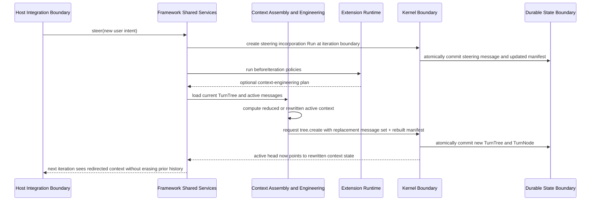
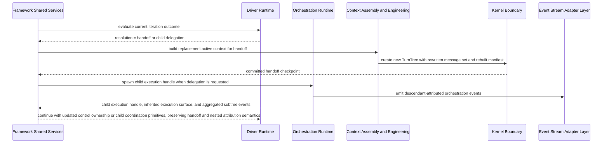
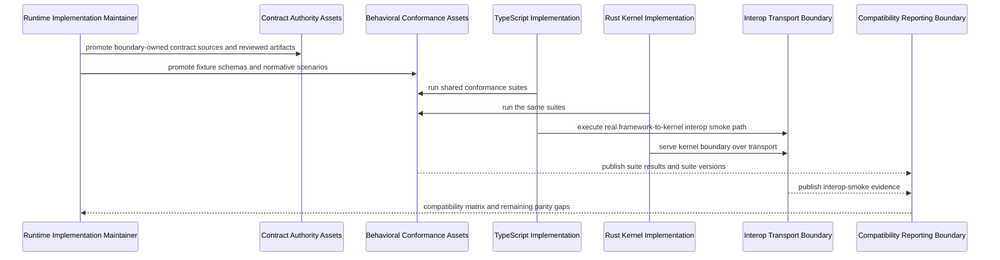
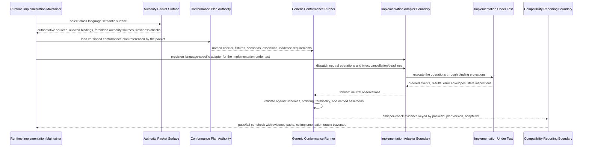
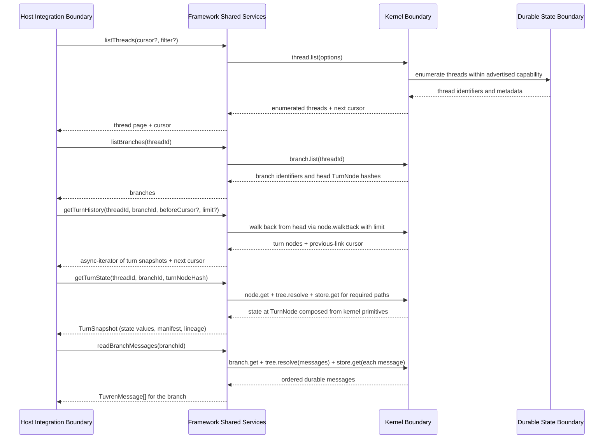
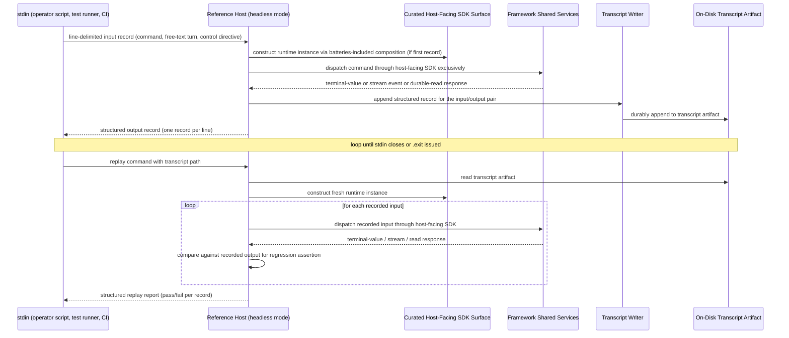
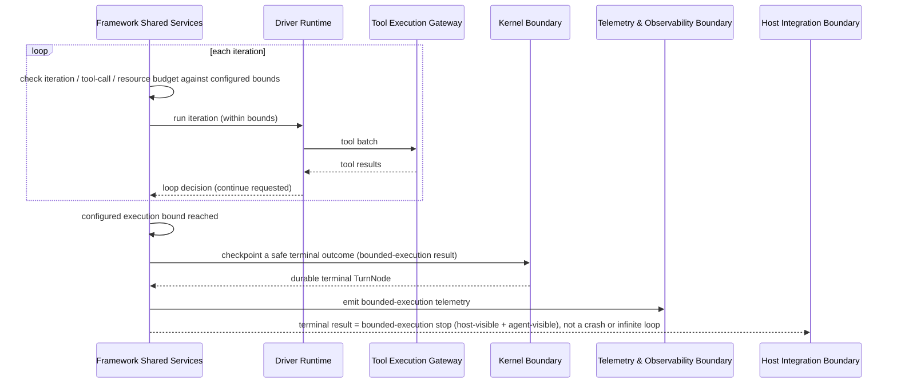

# Solution Architecture

## 0. Version History & Changelog

- v0.8.0 - Realized the production-trust block in the logical layer: added the Telemetry & Observability Boundary container (correlated operational-telemetry surface plus vendor-neutral export edge, distinct from the real-time host event stream) tracing to CAP-P0-052 / CAP-P1-053; added framework-owned Execution Bound enforcement (CAP-P0-054) and a cross-cutting Secret Isolation Model (CAP-P0-055); added a Recovery & Durability Verification Model with a verification-time fault-injection seam and crash-recovery conformance backing the sharpened Reliability guarantee; added matching architectural principles, trust relationships, failure classes, three critical flows (crash-recovery, telemetry capture/export, bounded-execution stop), and logical risks.
- v0.7.1 - Clarified current Reference Host posture after Epics AM-AT landed: durable reads now remove the kernel-inspector seam, the MCP client is first-class, and the retired playground host has been consolidated into a REPL CLI with headless mode, streaming JSONL output, and transcript replay.
- v0.7.0 - Added the Durable-Read Surface responsibility on Framework Shared Services, thread enumeration as a kernel structural primitive with backend-advertised capability, the Curated Host-Facing SDK container with shared-primitive plus slim-convenience split, the Schema Authoring Helper and MCP Tool Source responsibilities under the Tool Execution Gateway, and the headless plus transcript responsibilities on the Reference Host; promoted the SDK-only proving-host invariant from a risk-mitigation aspiration to a satisfied invariant; added new logical risks for the kernel-spec amendment cascade, schema-adapter detection ambiguity, MCP transport fragmentation, and durable-read pagination shape divergence.
- ... [Older history truncated, refer to git logs]

## 1. Architectural Strategy & Archetype Alignment

- **Architectural Pattern:** Layered modular runtime with a narrow kernel boundary, shared framework services, pluggable drivers, explicit adapter edges, and a curated host-facing SDK surface composed of one shared-primitive container plus a slim convenience container with leaf integration containers peer-depending on the shared primitives.
- **Why this pattern fits the PRD:** Tuvren Runtime must be embeddable, durable, provider-neutral, capable of supporting more than one execution style over time without redefining its durable core, and ergonomic enough that serious operator-facing host products can be built directly on the host-facing SDK without private shortcuts. A layered modular runtime preserves a stable mechanism foundation while letting shared framework services and individual drivers evolve independently, and the curated host-facing SDK shape lets the product satisfy host-developer ergonomics without weakening any underlying semantic boundary.
- **Core trade-offs accepted:** The design prioritizes explicit boundaries, recoverability, inspectability, and host-developer ergonomics over minimum surface area; it accepts more internal structure than a lightweight prompt wrapper; it accepts a deliberate split between a shared-primitive container (subpath-exported) and a slim convenience container (re-exporting curated primitives plus a batteries-included composition) rather than collapsing into one umbrella or fragmenting into many separately-versioned contract packages; and it rejects distributed topology until the product proves that one in-process runtime can no longer carry the scope.

### 1.1 Problem Context

- Tuvren Runtime is a runtime substrate, not a single agent application and not one fixed control-flow style.
- The architecture therefore has to satisfy four needs at once: durable execution truth, clean embedding into hosts, room for more than one runtime driver over shared primitives, and an ergonomic host-facing surface that lets serious downstream products build directly on the SDK rather than reaching around it.
- The product’s defining value comes from preserving execution truth across interruption, redirection, governance, orchestration, and future driver variation, *and* from exposing that truth through a curated host-facing surface that no proving host needs to bypass. The architecture must center execution truth in one authoritative durable boundary while preventing the first driver from becoming the whole ontology and while ensuring that everything the first-party reference host needs is achievable through the same host-facing SDK that downstream hosts use.

### 1.2 Core Architectural Principles

- **Mechanism-policy-driver separation:** The Kernel owns durable mechanism; the Framework owns shared runtime contracts and services; Drivers own concrete execution policy.
- **Single source of execution truth:** Durable lineage and state are authoritative; streams, wrappers, and provider-native representations are informative but non-authoritative.
- **In-process modularity first:** Containers are logical boundaries inside one embeddable runtime system, aligning with solo-dev realism and avoiding premature service decomposition.
- **Adapter edges at trust boundaries:** Hosts, model providers, and external tools connect through explicit boundary adapters rather than leaking their protocols inward.
- **Reference-host realism:** The first product-depth host must consume the same host-facing SDK boundary that downstream host developers use, rather than proving the runtime through privileged internal seams. The Durable-Read Surface responsibility (§2) is the architectural mechanism that makes this principle materially achievable rather than aspirational.
- **Curated host-facing SDK:** Host-developer ergonomics is an architectural concern, not a packaging accident. The host-facing surface is a deliberately composed container with one shared-primitive boundary (subpath exports) and a slim convenience boundary (batteries-included composition plus curated re-exports). Leaf integration containers peer-depend on the shared-primitive boundary so consumers cannot end up with version-skewed primitive instances.
- **Artifact-backed semantic authority:** Human semantic authority lives in the docs and constitution, while machine-readable contract, conformance, and interop assets make those semantics executable across implementations.
- **Machine-enforced neutral authority:** Every cross-implementation semantic must be carried by a boundary-owned authority packet that pairs neutral machine-readable sources with at least one executable verification path. No implementation language file, generic runner source file, or human-prose document can act as the source of cross-language truth.
- **History-preserving correction:** Rollback, steering, handoff, and context engineering create new lineage rather than rewriting the past.
- **Driver plurality without product sprawl:** The architecture must support multiple drivers conceptually, but only one driver needs to be implemented to production depth at a time.
- **Portable stream spine:** The canonical event stream and SSE projection are core runtime surfaces; ecosystem-specific protocol adapters may exist above them, but they must not become the product’s semantic center.
- **Structural reads stay in the kernel; composed reads stay in the framework:** Enumerating threads and branches and reading TurnNodes are kernel structural primitives. Composing those primitives into host-facing operations such as "read durable messages on this branch" or "walk turn history with a cursor" is a framework responsibility under the Durable-Read Surface. The host-facing SDK never reaches past the framework into the kernel for reads it cannot get through the framework.
- **Operational observability is a first-class outbound surface:** Operating Tuvren in production requires more than the real-time host event stream. A dedicated Telemetry & Observability Boundary produces correlated operational telemetry (turns, model and tool interactions, checkpoints, approvals, recovery events, errors) keyed to runtime lineage, with a portable canonical telemetry vocabulary and a vendor-neutral export edge. The telemetry vocabulary is portable authority; the export projection is an ecosystem adapter, mirroring the canonical-stream-plus-SSE pattern.
- **Execution is bounded by the framework, not the driver:** A driver may decide whether to continue a loop, but the framework enforces hard bounds on iterations, tool calls, and resource budget so that a misbehaving driver, model, or tool cannot loop forever or exhaust resources. When a bound is reached the framework forces a safe, observable terminal outcome rather than relying on driver discretion.
- **Secrets live only at the integration edges:** Credentials needed to reach providers and external tools (provider keys, MCP server auth) are confined to the Provider Gateway and MCP Client Container edges. They must never enter durable lineage, operational telemetry, or transcripts; the surfaces that make Tuvren inspectable must not become the channel through which secrets leak.
- **Durability and recovery guarantees are verification-backed:** The recovery and durability promises are not asserted by design alone. A verification-time fault-injection seam at the persistence boundary and crash-recovery conformance scenarios prove that an interruption at any point resolves to resume-from-checkpoint or clean failure with no torn or partial lineage.

### 1.3 Named Trust Relationships

- **Trusted core:** Kernel Boundary, Durable State Boundary, Framework Shared Services, and the active Driver Runtime are trusted to preserve runtime invariants.
- **Conditionally trusted extensions:** Extensions can influence execution, but only through declared lifecycle points and bounded contracts.
- **Untrusted provider boundary:** Model provider outputs are advisory inputs that must be normalized before affecting durable execution.
- **Untrusted external MCP server boundary:** External MCP servers are out-of-process or out-of-host tool sources. Their tool advertisements, tool inputs, and tool outputs cross a process or network boundary and are treated as untrusted: tool inputs are validated against declared schemas before execution, tool outputs are surfaced as agent-visible results rather than implicitly trusted, and transport errors are translated into canonical failure events.
- **Partially trusted host boundary:** Hosts may start, steer, cancel, resolve approvals, and read durable state through the host-facing SDK, but they do not become the source of runtime truth.
- **High-risk tool boundary:** External tool execution is where side effects happen and where approval, staging, and recovery protections matter most.
- **Trusted semantic assets:** Boundary-owned contract and conformance assets are trusted to carry machine-readable meaning, while generated bindings and reports are evidence rather than primary authority.
- **Untrusted semantic candidates:** Implementation language source trees, generic runner code, and human-prose documents are untrusted as cross-language semantic sources. They may project, validate, or describe authority, but they may not become it.
- **Edge-confined credential boundary:** Provider keys and external MCP server credentials are held only at the Provider Gateway and MCP Client Container edges for the duration of a request. The Kernel Boundary, Durable State Boundary, Telemetry & Observability Boundary, and transcript surfaces are credential-free zones: they must never receive, persist, or emit secrets.
- **Operator-facing telemetry consumer:** External observability tooling consumes exported operational telemetry. It is an outbound consumer of a vendor-neutral projection and never a source of runtime truth; the canonical telemetry vocabulary it consumes is boundary-owned authority, while the export format is an ecosystem-specific projection.

### 1.4 Failure Classes

- **Execution interruption:** Process stop, cancellation, or stream interruption during model or tool work.
- **Partial side-effect completion:** Some tool work or staged results completed, but the turn has not fully advanced.
- **Context divergence risk:** Active context is reshaped, handed off, or steered in ways that could become unintelligible without explicit lineage.
- **Driver lock-in risk:** Shared framework services accidentally absorb assumptions that only one driver actually needs.
- **Boundary translation risk:** Provider-native or host-native representations conflict with Kraken’s canonical model unless normalized at the edge.
- **Cross-language drift risk:** Human specs, machine-readable artifacts, and implementation lines diverge enough that “same runtime” stops meaning the same thing across languages or processes.
- **Forbidden authority source risk:** A semantic that should live in a boundary-owned authority packet leaks into an implementation language file, a generic runner's hard-coded assertions, or a Markdown document, quietly making that surface the de facto cross-language oracle.
- **Generated artifact staleness risk:** Generated artifacts (validators, bindings, conformance plans, transport descriptors) drift from their authority sources and silently change observable meaning without a corresponding authored change.
- **Boundary-bypass durable-read risk:** A host (including the first-party reference host) reads durable state by piercing past the Framework Shared Services into the Kernel Boundary directly, creating a private read seam that downstream hosts cannot use. The Durable-Read Surface responsibility on Framework Shared Services exists specifically to make this risk avoidable.
- **External tool-source boundary translation risk:** External MCP servers expose tools whose advertised schemas, input shapes, or output shapes do not match Tuvren tool conventions; the tool-source boundary must normalize advertisements into Tuvren tool definitions and validate inputs/outputs in both directions.
- **Schema-authoring detection ambiguity risk:** The schema-agnostic tool-authoring helper must accept multiple schema kinds (Zod v3, Zod v4, Standard Schema, wrapped JSON Schema); ambiguous detection could route a schema to the wrong adapter and silently change validation behavior.
- **Curated SDK version-skew risk:** If leaf integration containers do not peer-depend on the single shared-primitive container, consumers can end up with mismatched primitive instances (mismatched error classes, hash brands, schema brands) that fail referential checks at runtime.
- **Runaway-loop / resource-exhaustion risk:** A driver, model, or tool drives unbounded iterations, tool calls, or resource consumption, turning a recoverable failure into an outage unless the framework enforces hard execution bounds with a safe stop.
- **Torn-checkpoint-under-crash risk:** A process crash lands in the middle of a checkpoint commit, threatening partial or corrupt lineage unless commits are atomic and recovery distinguishes committed from incomplete work; this risk must be proven addressed by fault injection rather than assumed.
- **Secret-leakage risk:** Credentials used transiently to reach a provider or tool leak into durable lineage, operational telemetry, or transcripts, so that the very surfaces that make Tuvren inspectable and replayable also expose secrets.
- **Telemetry-vocabulary divergence risk:** The operational telemetry surface grows a second, parallel vocabulary that drifts from the canonical runtime event vocabulary, so operators and host UIs come to describe the same runtime activity in incompatible terms.

## 2. System Containers

### Host Integration Boundary

- **Logical Type:** External boundary adapter
- **Responsibility:** Expose Tuvren Runtime to embedding environments, initiate turns, await terminal execution results, consume event streams, list and read durable state through the host-facing Durable-Read Surface, surface status, deliver steering, route approvals, and trigger cancellation. The first product-depth proof host is a serious REPL CLI built against this same boundary rather than a privileged internal harness, with both an interactive operating mode and a headless stdin-driven mode.
- **Inputs:** User or system signals, approval responses, steering signals, cancellation requests, runtime events, durable-read queries (list threads, list branches, get state at TurnNode, walk turn history, read branch messages).
- **Outputs:** Turn-start requests, control signals, terminal execution results, translated protocol events, host-visible execution status, durable-read responses, captured transcript artifacts.
- **Depends on:** Framework Shared Services (including its Durable-Read Surface), Event Stream Adapter Layer.

### Curated Host-Facing SDK Surface

- **Logical Type:** Host-developer ergonomics boundary
- **Responsibility:** Compose the underlying runtime containers into one curated host-facing surface that a host developer consumes. This is a logical boundary, not a single physical artifact: it groups a Shared Primitive Container (subpath-exported primitives covering messages, tools, events, errors, execution, driver contracts, provider contracts, and extensions) and a Slim Convenience Container (re-exports the curated primitives and exposes the Batteries-Included Composition entrypoint that assembles kernel, backend, driver registry, and framework runtime from one factory call). Leaf integration containers (backends, stream adapters, drivers, provider bridges, MCP Client Container, Schema Authoring Helper, Tool Source Container) peer-depend on the Shared Primitive Container so that one runtime instance always sees one primitive instance.
- **Inputs:** Host-developer composition requests (which backend, which driver, which provider, which tools), leaf integration container choices, primitive imports from subpaths.
- **Outputs:** A wired-up Framework Shared Services instance the host can drive through the Host Integration Boundary; curated primitive exports consumable by hosts, extensions, and downstream packages.
- **Depends on:** Shared Primitive Container, Slim Convenience Container, Framework Shared Services, Kernel Boundary, Durable State Boundary (through chosen backend), Driver Runtime, Provider Gateway, Tool Execution Gateway, Schema Authoring Helper, MCP Client Container.

### Framework Shared Services

- **Logical Type:** Application service layer
- **Responsibility:** Own the stable framework contracts and shared runtime services above the kernel, including execution-handle lifecycle, turn/run orchestration shell, context manifest maintenance, event publication, extension coordination, driver selection, terminal-value resolution on every execution handle (the unified `awaitResult` surface), and the Durable-Read Surface. The Durable-Read Surface composes existing kernel structural primitives (`branch.list`, `node.get`, `node.walkBack`, `tree.resolve`, `tree.manifest`, `store.get`) and the new kernel `thread.list` primitive into host-facing operations: list threads owned by the runtime instance (with cursor-based pagination and optional filters), list branches inside a thread, read structured runtime state at any TurnNode, walk turn history of a branch as an async iterator with a cursor (newest-first), and read durable conversational messages on a branch without requiring the host to reconstruct messages from TurnTree references and the content-addressed object store by hand. Framework Shared Services also owns Execution Bound enforcement: it caps per-turn iterations, tool calls, and resource budget above driver discretion, and when a configured bound is reached it forces a safe terminal outcome (a typed bounded-execution result) rather than allowing an unbounded loop. It emits canonical runtime activity to the Telemetry & Observability Boundary in the same vocabulary it publishes to the Event Stream Adapter Layer.
- **Inputs:** Host commands, execution state from durable history, extension contributions, driver-emitted control outcomes, provider and tool gateway results, durable-read queries from hosts, execution-bound configuration.
- **Outputs:** Driver invocation requests, kernel syscalls (read and write), runtime status transitions, event publication, approval state, steering incorporation, host-visible execution handles with terminal-value resolution, host-facing durable-read responses.
- **Depends on:** Driver Runtime, Context Assembly and Engineering, Extension Runtime, Orchestration Runtime, Kernel Boundary, Event Stream Adapter Layer.

### Driver Runtime

- **Logical Type:** Execution strategy boundary
- **Responsibility:** Implement one concrete execution model over shared framework primitives. The initial baseline is the ReAct Driver, which renders prompts, interprets provider responses, evaluates loop decisions, and determines when to continue, pause, hand off, fail, or end a turn.
- **Inputs:** Active context, driver configuration, provider responses, tool results, extension verdicts, steering state, and framework-owned control constraints.
- **Outputs:** Canonical assistant messages, tool batches, runtime resolutions, driver-specific state transitions, and context-engineering or orchestration intents.
- **Depends on:** Provider Gateway, Tool Execution Gateway, Extension Runtime, Context Assembly and Engineering.

### Context Assembly and Engineering

- **Logical Type:** Domain service layer
- **Responsibility:** Build the active working context from durable history, maintain the context manifest, and execute explicit context reshaping actions such as reduction, compaction, substitution, or handoff context rewrites.
- **Inputs:** TurnTree state, message lineage, context policies, extension-generated context plans, handoff intents, steering signals, and driver requests.
- **Outputs:** Active message sets, rebuilt manifests, replacement message collections, and context-engineering actions for checkpointing.
- **Depends on:** Kernel Boundary.

### Extension Runtime

- **Logical Type:** Policy composition boundary
- **Responsibility:** Host lifecycle hooks, around-model wrappers, around-tool wrappers, system prompt contributions, extension-owned state updates, and declared shared exports within bounded contracts.
- **Inputs:** Execution context, manifests, prompts, tool calls, model responses, tool results, iteration outcomes.
- **Outputs:** Verdicts, state updates, custom events, prompt contributions, pause requests, and wrapped execution behavior.
- **Depends on:** Framework Shared Services, Driver Runtime, Event Stream Adapter Layer.

### Provider Gateway

- **Logical Type:** External integration boundary
- **Responsibility:** Translate canonical prompts to provider-facing requests and translate provider outputs and streams back into canonical Kraken representations while preserving provider continuity artifacts without promoting provider-specific ontology inward. Provider credentials are held only at this edge for the duration of a request and are excluded from durable lineage, operational telemetry, and transcripts; opaque provider continuity artifacts that must persist for correct multi-turn operation are not credentials and must not carry secret material.
- **Inputs:** Canonical prompt, rendered tool definitions, structured-output requests, model configuration.
- **Outputs:** Canonical model responses, normalized stream chunks, continuity artifacts, and provider failure signals.
- **Depends on:** External Model Providers.

### Tool Execution Gateway

- **Logical Type:** External integration boundary
- **Responsibility:** Resolve tools, validate inputs, apply approval gating, execute tool work, stage tool results incrementally, return canonical tool result messages to the runtime, and integrate multiple Tool Source Containers (including built-in registries and the MCP Client Container) into one unified tool resolution surface for the active agent segment. Tool definitions consumed by this gateway adhere to the boundary CustomSchema contract; the Schema Authoring Helper normalizes richer authoring shapes into that contract upstream of this gateway.
- **Inputs:** Canonical tool calls, tool registry definitions drawn from one or more Tool Source Containers, approval decisions, tool execution context.
- **Outputs:** Canonical tool results, approval requests, partial batch completion state, and tool-related events.
- **Depends on:** External Tools and Systems, Tool Source Container (one or more), Extension Runtime, Kernel Boundary.

### Schema Authoring Helper

- **Logical Type:** Host-facing authoring boundary
- **Responsibility:** Expose a schema-agnostic tool-authoring entrypoint that accepts multiple schema authoring styles (Zod v3 and v4, Standard Schema-compliant schemas, wrapped JSON Schema, and lazy wrappers around any of those) while preserving strict TypeScript inference for the execute callback's input parameter. Normalize all accepted authoring shapes into a single boundary-stable representation that satisfies the existing CustomSchema contract (a tool definition the Tool Execution Gateway can resolve). The normalization surface is centralized: one detection routine routes each schema kind to its adapter, and one schema-conversion pipeline produces the JSON Schema artifact used for provider-wire rendering. Bare JSON Schema and the existing CustomSchema interop shape remain legal at the boundary contract; this container only adds ergonomics on top.
- **Inputs:** Host-developer tool authoring calls carrying any accepted schema shape; the input/output type parameters the host intends to flow through inference.
- **Outputs:** Tool definitions matching the boundary CustomSchema contract, with the original authoring schema's TypeScript input type preserved on the execute callback signature.
- **Depends on:** Shared Primitive Container (boundary tool definition shape), the host's chosen schema toolkit (Zod, Standard Schema-compliant lib, or none).

### Tool Source Container

- **Logical Type:** Tool-discovery integration boundary
- **Responsibility:** Provide one source of tool definitions to the Tool Execution Gateway. Multiple Tool Source Containers may exist concurrently for one active agent segment (for example: a built-in static registry, an extension-contributed registry, and one or more MCP Client Containers). Each source is responsible for translating its native tool advertisement format into Tuvren tool definitions matching the boundary CustomSchema contract before they reach the Tool Execution Gateway.
- **Inputs:** Source-specific tool advertisements (static definitions, MCP server tool lists, extension contributions).
- **Outputs:** Tuvren tool definitions registered with the Tool Execution Gateway.
- **Depends on:** Shared Primitive Container (boundary tool definition shape), source-specific upstream systems.

### MCP Client Container

- **Logical Type:** External tool-ecosystem integration boundary
- **Responsibility:** Implement the Model Context Protocol client side over both stdio and HTTP/SSE transports as one unified client interface. Establish and maintain the MCP session lifecycle (initialization handshake, tool list discovery, tool invocation, tool result reception, transport-level error handling, session shutdown). Translate MCP tool advertisements into Tuvren tool definitions (an MCP-flavored Tool Source Container). Treat the external MCP server as an untrusted boundary: validate tool inputs against the advertised schema before sending across the transport and validate tool outputs against the advertised result shape before surfacing them as agent-visible results. The MCP server-side projection (exposing Tuvren itself as an MCP server) is explicitly out of scope; only the client side is in this container. External MCP server credentials (transport auth, headers, tokens) are held only at this edge and are excluded from durable lineage, operational telemetry, and transcripts.
- **Inputs:** External MCP server endpoint specifications (transport choice, command or URL), MCP protocol messages from the server, tool invocations from the Tool Execution Gateway.
- **Outputs:** Tuvren tool definitions for each MCP-advertised tool; canonical tool results from MCP tool invocations; MCP session lifecycle events translated into runtime events.
- **Depends on:** External MCP Servers, Tool Source Container interface, Shared Primitive Container, Extension Runtime (for connection lifecycle hooks).

### Orchestration Runtime

- **Logical Type:** Coordination service
- **Responsibility:** Provide the documented handle/tree-based orchestration primitives for child execution, descendant event aggregation, parent-child execution coordination, handoff continuity, execution inheritance, and nested attribution without creating ambiguous control ownership.
- **Inputs:** Child launch requests, child completion signals, parent execution status, and child subtree events.
- **Outputs:** New execution handles for children, descendant-attributed event streams, and child completion access.
- **Depends on:** Framework Shared Services, Context Assembly and Engineering, Event Stream Adapter Layer, Host Integration Boundary.

### Kernel Boundary

- **Logical Type:** Mechanism core boundary
- **Responsibility:** Own durable objects, TurnTree construction, TurnNode lineage, staging, run lifecycle operations, thread and branch containment, checkpoint atomicity, and structural enumeration primitives. Structural enumeration includes the existing `branch.list(threadId)` primitive and the new `thread.list(options?)` primitive: both are mechanism-not-policy and provide pure structural reads with no semantic interpretation. The new `thread.list` primitive is backend-advertised: backends declare whether they support efficient thread enumeration through a capability bit, and substrates that cannot enumerate efficiently (object-store-style backends) may advertise non-support and remain conformant.
- **Inputs:** Explicit framework requests for storage, staging, tree construction, run lifecycle, thread lifecycle, branch movement, turn head updates, structural enumeration (branches in a thread; threads in the runtime instance, subject to backend capability).
- **Outputs:** Durable identities, recovered state, structural diffs, validated lineage relationships, committed history points, enumerated branch and thread identifiers.
- **Depends on:** Durable State Boundary.

### Durable State Boundary

- **Logical Type:** Persistence boundary
- **Responsibility:** Provide the atomic durable storage substrate required for immutable objects, staging durability, checkpoint transactions, and read-after-write consistency. Each concrete backend advertises a capability descriptor that includes whether thread enumeration is supported efficiently. Backends that cannot enumerate must still satisfy every other Storage Contract guarantee.
- **Inputs:** Object writes, structured state writes, transaction requests, recovery reads, structural enumeration queries (within advertised capabilities).
- **Outputs:** Durable committed records, structural state retrieval, existence checks, transaction success or failure, enumerated thread identifiers when capability is advertised.
- **Depends on:** None.

### Event Stream Adapter Layer

- **Logical Type:** Outbound protocol adaptation boundary
- **Responsibility:** Convert canonical Kraken runtime events into host-facing protocol shapes while preserving source attribution, execution ordering, and driver/runtime distinctions. Canonical events and SSE are core portable surfaces; ecosystem-specific adapters are downstream projections.
- **Inputs:** Canonical runtime events, custom events, worker-forwarded events, and driver-attributed event metadata.
- **Outputs:** Protocol-ready event streams for host consumers.
- **Depends on:** Framework Shared Services, Extension Runtime, Orchestration Runtime.

### Telemetry & Observability Boundary

- **Logical Type:** Outbound operational-telemetry adaptation boundary
- **Responsibility:** Observe canonical runtime activity and produce correlated operational telemetry — structured records of turns, runs, model interactions, tool calls, checkpoints, approvals, steering, recovery events, and errors — keyed to runtime lineage concepts (thread, branch, turn, run, TurnNode) so an operator can reconstruct what a turn did after the fact. This surface is distinct from the Event Stream Adapter Layer: the event stream serves a host UI consuming one live turn, while operational telemetry serves monitoring, postmortems, performance investigation, and incident response, and may correlate across turns and runs. The canonical telemetry vocabulary is boundary-owned portable authority; a vendor-neutral export edge projects that vocabulary into standard observability tooling without coupling the runtime to any one vendor or wire format. The boundary must never emit secrets (see the Secret Isolation Model in §5).
- **Inputs:** Canonical runtime activity signals from Framework Shared Services, Driver Runtime, Tool Execution Gateway, Orchestration Runtime, and Kernel Boundary (including checkpoint and recovery events); telemetry configuration (sampling, redaction, export target selection).
- **Outputs:** Correlated operational telemetry records in the canonical telemetry vocabulary; vendor-neutral telemetry exports for external observability tooling.
- **Depends on:** Framework Shared Services, Driver Runtime, Tool Execution Gateway, Orchestration Runtime, Kernel Boundary.

### Reference Host

- **Logical Type:** First-party proving host (a concrete instance of the Host Integration Boundary)
- **Responsibility:** Exercise every host-facing capability the SDK exposes (durable threads, branching, streaming, approvals, steering, orchestration, extension behavior, persistence, durable reads, transcript capture and replay) as one coherent operator experience, in two modes: an interactive readline mode for human operators and a headless stdin-driven mode for tests, scripts, and operations tooling. Both modes share the same package, command surface, and execution path. The headless mode consumes line-delimited input on stdin and emits structured output (one record per line); it does not consume external script files or define an out-of-band scripting language. The reference host MUST consume only the host-facing SDK boundary; no private seams, no kernel inspectors, no backend-direct reads. Transcript capture writes a durable on-disk record of one session for postmortems; transcript replay drives a fresh runtime instance from a captured transcript to reproduce session behavior for regression tests. Target-state Epic AT retirement removes the historical playground host so the reference host is the sole first-party proving host.
- **Inputs:** Operator input (interactive readline or stdin line-delimited), command tree invocations, transcript file paths (for replay).
- **Outputs:** Operator-visible session interactions (interactive) or structured records (headless), captured transcript artifacts, exit codes and structured failure reports for headless runs.
- **Depends on:** Curated Host-Facing SDK Surface (exclusively; no direct kernel access).

### Contract Authority Assets

- **Logical Type:** Boundary-owned specification surface
- **Responsibility:** Capture machine-readable shape contracts owned by a boundary, including public payload shapes, protocol grammars, and reviewed generated artifacts derived from authored sources.
- **Inputs:** Human-approved semantic changes from the docs and constitution, boundary-owned schema sources, and implementation feedback when promoting a shape to normative status.
- **Outputs:** Machine-readable contract artifacts consumed by validation, code generation, and later implementation lines.
- **Depends on:** None.

### Behavioral Conformance Assets

- **Logical Type:** Boundary-owned behavior corpus
- **Responsibility:** Capture versioned fixtures, schemas, and scenario definitions that express observable behavior independently of any single implementation.
- **Inputs:** Human-approved behavioral expectations, boundary-owned fixture definitions, and implementation evidence when promoting a behavior to normative status.
- **Outputs:** Shared conformance suites consumed by language-specific runners and compatibility reporting.
- **Depends on:** Contract Authority Assets.

### Interop Transport Boundary

- **Logical Type:** Cross-process boundary contract
- **Responsibility:** Define the narrow transport surface used when kernel or other runtime boundaries cross process and language seams. Includes the gRPC projection of the kernel syscall surface; the new `thread.list` kernel primitive extends this projection with one additional RPC.
- **Inputs:** Canonical boundary operations, stable event and error envelopes, and host/runtime control requirements.
- **Outputs:** Versioned transport exchanges and implementation-facing transport contracts.
- **Depends on:** Kernel Boundary, Contract Authority Assets.

### Compatibility Reporting Boundary

- **Logical Type:** Generated evidence boundary
- **Responsibility:** Aggregate conformance and interop results into machine-readable compatibility reports without becoming semantic authority itself.
- **Inputs:** Language-specific runner results, interop smoke results, and suite metadata.
- **Outputs:** Compatibility matrices and health reports for maintainers and CI.
- **Depends on:** Behavioral Conformance Assets, Interop Transport Boundary.

### Authority Packet Surface

- **Logical Type:** Boundary-owned authority manifest
- **Responsibility:** For each cross-implementation semantic surface, declare exactly which Contract Authority Assets, Behavioral Conformance Assets, Interop Transport Boundary entries, generated artifacts, conformance plans, and language-binding projections together carry that semantic; declare the forbidden authority sources for the same surface; and declare freshness and compatibility checks the surface must satisfy. The packet is a meta-container whose authority is the act of declaration; it does not host new semantics by itself. The new kernel `thread.list` syscall, the new Framework Shared Services Durable-Read Surface, and the unified `awaitResult` execution-handle terminal-value surface require corresponding entries in their relevant authority packets.
- **Inputs:** Approved promotions of contract sources, conformance plans, transport projections, telemetry vocabulary, and binding projections; review decisions about what may and may not act as authority for the surface.
- **Outputs:** A single boundary-owned manifest per surface that names authoritative sources, generated artifacts, allowed binding appendices, forbidden authority sources, and required executable verification paths.
- **Depends on:** Contract Authority Assets, Behavioral Conformance Assets, Interop Transport Boundary, Conformance Plan Authority.

### Conformance Plan Authority

- **Logical Type:** Boundary-owned executable behavior surface
- **Responsibility:** Express named semantic checks, fixtures, scenarios, assertions, evidence requirements, and runner applicability as data-owned artifacts that any generic runner can consume. Carry behavior assertions that exceed shape grammar (event ordering, terminality, lifecycle transitions, recovery state, approval pause/resume continuity, structured-output validation, durable-read result shapes, thread enumeration semantics, terminal-value resolution on every handle) without delegating that authority to runner code.
- **Inputs:** Approved behavior promotions from human authority, fixture and scenario sources, schema references, and evidence-shape definitions.
- **Outputs:** Versioned conformance plans referenced by Authority Packet manifests and consumed by Generic Conformance Runner over Implementation Adapter Boundary instances.
- **Depends on:** Contract Authority Assets, Behavioral Conformance Assets.

### Implementation Adapter Boundary

- **Logical Type:** Language-specific executable seam
- **Responsibility:** Expose a particular implementation to a Generic Conformance Runner through a neutral surface for operation dispatch, ordered event consumption, cancellation and deadline control, error envelopes, and where applicable durable-state inspection. Each implementation language provides at least one adapter per authority packet it claims to support.
- **Inputs:** Generic runner invocations driven by a conformance plan; implementation under test; language-binding projections from the relevant authority packet.
- **Outputs:** Operation results, ordered event streams, error envelopes, evidence emissions, and adapter lifecycle signals consumed by the Generic Conformance Runner.
- **Depends on:** The implementation under test, the relevant Authority Packet Surface, and the language-binding projections it declares.

### Generic Conformance Runner

- **Logical Type:** Implementation-agnostic verification process
- **Responsibility:** Load a conformance plan, drive an Implementation Adapter Boundary, validate operation results and event streams against schemas and assertions named in the plan, and emit evidence for the Compatibility Reporting Boundary. The runner owns generic mechanics (adapter startup, dispatch, schema validation, generic assertion operators, ordered-channel consumption, cancellation injection, timeout control, evidence emission) and never hard-codes product semantics, expected event sequences, expected check IDs, or expected error codes outside what the plan supplies.
- **Inputs:** A conformance plan version, an Implementation Adapter Boundary instance, fixtures and scenarios named by the plan, and evidence shape definitions.
- **Outputs:** Per-check pass/fail results, captured evidence artifacts, and structured run summaries forwarded to the Compatibility Reporting Boundary.
- **Depends on:** Conformance Plan Authority, Implementation Adapter Boundary, Behavioral Conformance Assets.

### 2.1 Communication Relationships

- Host Integration Boundary -> Framework Shared Services: synchronous execution commands, control signals, and durable-read queries
- Framework Shared Services -> Driver Runtime: in-process execution strategy invocation
- Framework Shared Services -> Kernel Boundary: synchronous runtime syscalls (read and write), checkpoint orchestration, and structural enumeration
- Framework Shared Services <-> Context Assembly and Engineering: in-process context reads and explicit context rewrite actions
- Driver Runtime -> Provider Gateway: synchronous request / streaming response interaction
- Driver Runtime -> Tool Execution Gateway: synchronous or batched tool dispatch
- Driver Runtime <-> Extension Runtime: in-process lifecycle callbacks and wrapper invocation
- Tool Execution Gateway <-> Tool Source Container: tool resolution and tool-set composition for the active agent segment
- Tool Source Container <- Schema Authoring Helper: registers tool definitions whose original authoring schema has been normalized to the boundary CustomSchema contract
- MCP Client Container <-> External MCP Servers: protocol-bound tool advertisement, invocation, and result exchange over stdio or HTTP/SSE
- MCP Client Container -> Tool Source Container: contributes MCP-advertised tools as Tuvren tool definitions
- Curated Host-Facing SDK Surface -> Framework Shared Services / Kernel Boundary / Durable State Boundary / Driver Runtime / Provider Gateway / Tool Execution Gateway / Schema Authoring Helper / MCP Client Container: assembles these containers through the Batteries-Included Composition for one runtime instance per host
- Reference Host -> Curated Host-Facing SDK Surface: consumes the host-facing SDK exclusively, in both interactive and headless modes
- Orchestration Runtime <-> Framework Shared Services: in-process worker launch, handoff, and resume coordination
- Kernel Boundary -> Durable State Boundary: atomic persistence transactions and structural enumeration (subject to backend capability)
- Framework Shared Services / Orchestration Runtime / Extension Runtime -> Event Stream Adapter Layer: canonical event publication
- Framework Shared Services / Driver Runtime / Tool Execution Gateway / Orchestration Runtime / Kernel Boundary -> Telemetry & Observability Boundary: canonical operational-telemetry signal emission (including checkpoint and recovery events)
- Telemetry & Observability Boundary -> External Observability Tooling: vendor-neutral operational-telemetry export
- Framework Shared Services / Provider Gateway / Kernel Boundary -> Contract Authority Assets: consume boundary-owned machine-readable shapes for validation and generated support
- Language-specific runners -> Behavioral Conformance Assets: execute shared suites without redefining semantics locally
- Host Integration Boundary / Framework Shared Services <-> Interop Transport Boundary: use transport contracts when a runtime boundary spans processes or languages
- Behavioral Conformance Assets / Interop Transport Boundary -> Compatibility Reporting Boundary: publish suite and interop results for implementation parity reporting
- Authority Packet Surface -> Contract Authority Assets / Behavioral Conformance Assets / Interop Transport Boundary / Conformance Plan Authority: declare which sources, plans, and projections together carry one cross-implementation semantic and which sources are forbidden authority for that surface
- Conformance Plan Authority -> Generic Conformance Runner: deliver versioned, data-owned conformance plans that drive verification mechanics
- Generic Conformance Runner <-> Implementation Adapter Boundary: dispatch neutral operations, consume ordered event channels, inject cancellation and deadlines, and collect error envelopes and evidence for one implementation under test
- Generic Conformance Runner -> Compatibility Reporting Boundary: emit per-check evidence keyed by authority packet, conformance plan version, and adapter identity

### 2.2 Boundary Notes

- The architecture keeps the Kernel Boundary and Durable State Boundary distinct so later implementation work can vary backend realization without changing logical design.
- Framework Shared Services exist so host control, event vocabulary, context manifest handling, execution-handle semantics, and durable-read composition do not get welded to the first driver.
- The Durable-Read Surface is a Framework Shared Services responsibility, not a separate container; it is logically grouped with execution-handle management because both are host-facing read paths over kernel structural primitives.
- Driver Runtime is a logical boundary, not a promise that every future driver needs a separate process or deployment unit.
- The current active driver is ReAct-oriented, but the architecture keeps room for future workflow-oriented drivers such as pipeline, router, evaluator-optimizer, or orchestrator-worker patterns.
- Ordered multi-agent pipelines are in current product scope, but they remain driver-level orchestration policy above the shared handoff/orchestration primitives rather than shared-core semantics.
- Target-state Epic AT makes the Reference Host the sole first-party proving host by retiring the historical playground host. It consumes the same Curated Host-Facing SDK Surface that downstream hosts use; both its interactive and headless modes share one execution path and one package.
- Contract authority, behavioral conformance, and interop transport are separate containers on purpose; no single artifact type is allowed to silently become the meaning of the runtime.
- Native language toolchains may differ, but their outputs must still fit the same boundary-owned contract, conformance, and compatibility system.
- Authority Packet Surface, Conformance Plan Authority, Implementation Adapter Boundary, and Generic Conformance Runner are first-class containers because their absence is the failure mode that lets a TypeScript file, Rust crate, runner source file, or Markdown document quietly become the cross-language oracle.
- Implementation Adapter Boundary is logically per-language but does not imply a separate process; an adapter may be in-process for the language under test while the Generic Conformance Runner remains language-agnostic.
- Canonical stream semantics and SSE translation are part of the portable runtime contract. AG-UI or similar ecosystem adapters may exist above them, but they remain secondary projections rather than cross-language product authority.
- The Curated Host-Facing SDK Surface is a logical boundary; its decomposition into a Shared Primitive Container plus a Slim Convenience Container is an architectural commitment rather than a packaging accident, and downstream artifacts (TechSpec) may bind those containers to concrete package identifiers.
- The Schema Authoring Helper sits above the Tool Execution Gateway and below the host; it never narrows what is legal at the boundary CustomSchema contract, it only enriches the authoring side with type inference and ergonomic defaults.
- The MCP Client Container is one instance of the Tool Source Container abstraction; built-in static tool registries are another instance; future tool sources slot into the same abstraction.
- The Telemetry & Observability Boundary and the Event Stream Adapter Layer are distinct outbound surfaces on purpose: the event stream is a real-time, single-turn, host-UI projection, while operational telemetry is a correlated, cross-turn, operator/observability projection. They share one canonical runtime activity vocabulary so they cannot diverge into two incompatible descriptions of the same runtime.
- Execution Bound enforcement is a Framework Shared Services responsibility, not a driver responsibility, precisely so that a misbehaving or adversarial driver cannot opt out of the runtime's safety limits; drivers still own loop-continuation policy strictly within those bounds.
- Secret isolation is a cross-cutting boundary rule rather than a container: credentials are confined to the Provider Gateway and MCP Client Container edges, and the Kernel Boundary, Durable State Boundary, Telemetry & Observability Boundary, and transcript surfaces are credential-free zones.
- The fault-injection seam used to verify durability and recovery is a verification-time capability at the persistence boundary, not a production control path; it exists to drive crash-recovery conformance and must not be reachable by hosts or drivers in normal operation.

## 3. Container Diagram (Mermaid)

```mermaid
C4Container
title Container Diagram
Person(hostUser, "Host / Integrator", "Starts turns, observes execution, resolves control decisions, lists threads, replays transcripts")
System_Boundary(tuvren_runtime, "Tuvren Runtime") {
  Container(hostBoundary, "Host Integration Boundary", "Boundary Adapter", "Entry point for turns, durable reads, steering, approval, cancellation, status")
  Container(refHost, "Reference Host", "First-Party Proving Host", "Interactive readline + headless stdin modes over the curated SDK only; transcript capture and replay")
  Container(sdkSurface, "Curated Host-Facing SDK Surface", "Host-Developer Ergonomics Boundary", "Shared primitive container + slim convenience container with batteries-included composition")
  Container(frameworkServices, "Framework Shared Services", "Application Service Layer", "Execution-handle lifecycle, awaitResult terminal-value surface, Durable-Read Surface, event publication, driver selection")
  Container(driverRuntime, "Driver Runtime", "Execution Strategy Boundary", "Concrete execution model; initial baseline is the ReAct-oriented driver")
  Container(contextLayer, "Context Assembly and Engineering", "Domain Service", "Builds active context and performs context rewrites")
  Container(extensionRuntime, "Extension Runtime", "Policy Runtime", "Hooks, wrappers, prompt contributions, extension state")
  Container(providerGateway, "Provider Gateway", "Integration Boundary", "Canonical <-> provider translation")
  Container(toolGateway, "Tool Execution Gateway", "Integration Boundary", "Validation, approval gating, tool execution, incremental result staging; unifies one or more tool sources")
  Container(toolSource, "Tool Source Container", "Tool Discovery Boundary", "Source of tool definitions (built-in registry, extension contributions, or MCP-advertised tools)")
  Container(mcpClient, "MCP Client Container", "External Tool-Ecosystem Boundary", "MCP client over stdio and HTTP/SSE; translates MCP tools into Tuvren tool definitions")
  Container(schemaHelper, "Schema Authoring Helper", "Authoring Boundary", "Multi-schema defineTool entrypoint normalizing Zod / Standard Schema / wrapped JSON Schema into the boundary CustomSchema contract")
  Container(orchestrationRuntime, "Orchestration Runtime", "Coordination Service", "Workers, handoffs, execution inheritance, descendant attribution, pipeline-level orchestration policy")
  Container(eventAdapter, "Event Stream Adapter Layer", "Outbound Adapter", "Canonical event translation for hosts")
  Container(telemetry, "Telemetry & Observability Boundary", "Outbound Telemetry Adapter", "Correlated operational telemetry (turns, tools, checkpoints, approvals, recovery) with vendor-neutral export; distinct from the live event stream")
  Container(kernelBoundary, "Kernel Boundary", "Mechanism Core", "Durable objects, staging, trees, lineage, runs, branches; structural enumeration (branch.list + capability-advertised thread.list)")
  ContainerDb(stateBoundary, "Durable State Boundary", "Persistence Boundary", "Atomic durable storage substrate; advertises thread-enumeration capability")
  Container(contractAssets, "Contract Authority Assets", "Specification Surface", "Boundary-owned machine-readable shape contracts and reviewed generated artifacts")
  Container(conformanceAssets, "Behavioral Conformance Assets", "Behavior Corpus", "Boundary-owned fixtures, schemas, and scenarios shared across implementations")
  Container(interopBoundary, "Interop Transport Boundary", "Cross-Process Contract", "Transport surface for runtime boundaries that span processes or languages")
  Container(compatibilityReporting, "Compatibility Reporting Boundary", "Generated Evidence", "Aggregates suite and interop results into compatibility reports")
  Container(authorityPacket, "Authority Packet Surface", "Authority Manifest", "Per-surface declaration of authoritative sources, generated artifacts, allowed bindings, forbidden authority sources, and freshness checks")
  Container(conformancePlan, "Conformance Plan Authority", "Executable Behavior Surface", "Data-owned named checks, fixtures, scenarios, assertions, and evidence requirements consumed by generic runners")
  Container(implAdapter, "Implementation Adapter Boundary", "Language-Specific Seam", "Per-language adapter exposing operations, ordered events, cancellation, errors, and state inspection to the generic runner")
  Container(genericRunner, "Generic Conformance Runner", "Verification Process", "Implementation-agnostic process that drives an adapter against a conformance plan and emits per-check evidence")
}
System_Ext(modelProviders, "Model Providers", "External generation systems")
System_Ext(externalTools, "External Tools and Systems", "External side-effecting capabilities")
System_Ext(mcpServers, "External MCP Servers", "External tool-advertising MCP processes")
System_Ext(observabilityTooling, "External Observability Tooling", "Consumes exported operational telemetry for monitoring, postmortems, and incident response")

Rel(hostUser, hostBoundary, "Starts turns, sends control inputs, issues durable-read queries")
Rel(hostUser, refHost, "Drives the first-party proving host interactively or headlessly")
Rel(refHost, sdkSurface, "Consumes the curated host-facing SDK exclusively")
Rel(sdkSurface, frameworkServices, "Composes a runtime instance via the batteries-included composition")
Rel(hostBoundary, frameworkServices, "Execution commands, control signals, durable-read queries")
Rel(frameworkServices, driverRuntime, "Invokes active driver")
Rel(frameworkServices, contextLayer, "Reads and rewrites active context")
Rel(frameworkServices, kernelBoundary, "Run lifecycle, checkpoints, lineage operations, structural enumeration")
Rel(driverRuntime, extensionRuntime, "Lifecycle callbacks and wrappers")
Rel(driverRuntime, providerGateway, "Canonical prompts / model responses")
Rel(driverRuntime, toolGateway, "Tool batches / tool results")
Rel(toolGateway, toolSource, "Resolve tool definitions for active segment")
Rel(toolSource, mcpClient, "MCP-advertised tools translated into Tuvren tool definitions")
Rel(toolSource, schemaHelper, "Tool definitions authored through schema-agnostic helper")
Rel(mcpClient, mcpServers, "MCP session: initialize, list tools, invoke, receive results")
Rel(orchestrationRuntime, frameworkServices, "Child execution coordination")
Rel(frameworkServices, orchestrationRuntime, "Child launch and orchestration requests")
Rel(providerGateway, modelProviders, "Provider-facing requests and streams")
Rel(toolGateway, externalTools, "Validated tool execution")
Rel(kernelBoundary, stateBoundary, "Atomic durable transactions; capability-advertised enumeration")
Rel(frameworkServices, eventAdapter, "Canonical runtime events")
Rel(orchestrationRuntime, eventAdapter, "Descendant-attributed orchestration events")
Rel(extensionRuntime, eventAdapter, "Custom events")
Rel(eventAdapter, hostBoundary, "Host-facing event streams")
Rel(frameworkServices, telemetry, "Operational-telemetry signals (incl. checkpoint and recovery events)")
Rel(driverRuntime, telemetry, "Driver execution telemetry")
Rel(toolGateway, telemetry, "Tool execution telemetry")
Rel(kernelBoundary, telemetry, "Checkpoint and recovery telemetry")
Rel(telemetry, observabilityTooling, "Vendor-neutral telemetry export")
Rel(frameworkServices, contractAssets, "Consumes contract shapes")
Rel(providerGateway, contractAssets, "Consumes provider/runtime shapes")
Rel(kernelBoundary, contractAssets, "Consumes protocol grammars")
Rel(conformanceAssets, compatibilityReporting, "Publishes suite results")
Rel(interopBoundary, compatibilityReporting, "Publishes interop results")
Rel(hostBoundary, interopBoundary, "Uses transport when boundaries span processes")
Rel(frameworkServices, interopBoundary, "Uses transport client/server contracts")
Rel(authorityPacket, contractAssets, "Declares authoritative contract sources")
Rel(authorityPacket, conformanceAssets, "Declares authoritative behavioral assets")
Rel(authorityPacket, interopBoundary, "Declares authoritative transport projections")
Rel(authorityPacket, conformancePlan, "References versioned conformance plans")
Rel(conformancePlan, genericRunner, "Supplies named checks and assertions")
Rel(genericRunner, implAdapter, "Drives operations and consumes events")
Rel(genericRunner, compatibilityReporting, "Emits per-check evidence")
```



## 4. Critical Execution Flows

### 4.1 ReAct Driver Turn Execution with Durable Checkpointing

- **Maps to PRD capability:** CAP-P0-001, CAP-P0-002, CAP-P0-004, CAP-P0-006, CAP-P0-007, CAP-P0-008, CAP-P0-012, CAP-P0-019, CAP-P0-020, CAP-P0-030, CAP-P0-033

```mermaid
sequenceDiagram
participant Host as Host Integration Boundary
participant Framework as Framework Shared Services
participant Context as Context Assembly and Engineering
participant Driver as Driver Runtime
participant Ext as Extension Runtime
participant Provider as Provider Gateway
participant Kernel as Kernel Boundary
participant State as Durable State Boundary
participant Events as Event Stream Adapter Layer

Host->>Framework: executeTurn(input signal, driver selection)
Framework->>Kernel: create Turn and input Run
Kernel->>State: atomically stage input message, manifest, runtime status
Kernel-->>Framework: committed TurnNode / updated head
Framework->>Events: emit turn.start and iteration.start
Framework->>Context: assemble active messages + manifest
Framework->>Driver: execute iteration with active context
Driver->>Ext: collect prompts / aroundModel wrappers
Driver->>Provider: stream canonical prompt
Provider-->>Driver: normalized response stream + final response
Driver-->>Framework: assistant message, tool intents, loop decision, state updates
Framework->>Kernel: stage message + manifest and checkpoint iteration
Kernel->>State: atomically commit staged results into new TurnNode / TurnTree
Kernel-->>Framework: new head committed
Framework->>Events: emit canonical lifecycle and state events
Framework-->>Host: continue iteration or end turn with durable history preserved; awaitResult resolves on terminal phase
```

### 4.2 Tool Approval Pause and Exact Resume

- **Maps to PRD capability:** CAP-P0-005, CAP-P0-008, CAP-P0-013, CAP-P0-014, CAP-P0-016, CAP-P0-017, CAP-P0-019

```mermaid
sequenceDiagram
participant Host as Host Integration Boundary
participant Framework as Framework Shared Services
participant Driver as Driver Runtime
participant Tooling as Tool Execution Gateway
participant Ext as Extension Runtime
participant Kernel as Kernel Boundary
participant State as Durable State Boundary
participant Events as Event Stream Adapter Layer

Framework->>Driver: submit tool batch from current iteration
Driver->>Tooling: resolve, validate, and classify tools
Tooling->>Ext: evaluate aroundTool and approval policies
Tooling->>Tooling: execute auto-approved tools
Tooling->>Kernel: incrementally stage completed tool results
Kernel->>State: durably record completed staged results
Tooling-->>Driver: partial results + approval request for pending tools
Driver-->>Framework: resolution = pause(approval required)
Framework->>Kernel: stage paused runtime status + manifest, complete paused Run
Kernel->>State: checkpoint partial batch into new TurnNode
Framework->>Events: emit approval.requested then paused turn.end
Host->>Framework: resolveApproval(decisions)
Framework->>Kernel: close paused Run to unblock Branch
Framework->>Kernel: create replacement Run from pause TurnNode
Framework->>Driver: apply approval decisions and resume only unfinished approved or edited tool calls
Driver->>Tooling: continue execution
Tooling->>Kernel: stage resumed tool results
Kernel->>State: commit resumed results and new history point
Framework->>Events: emit approval.resolved and resumed execution events
Framework-->>Host: continue same Turn without redoing completed side effects; rejection-only continuation policy remains host/driver owned
```

### 4.3 Context Engineering and Steering Between Iterations

- **Maps to PRD capability:** CAP-P0-010, CAP-P0-019, CAP-P1-022



### 4.4 Driver Handoff and Documented Child Orchestration

- **Maps to PRD capability:** CAP-P0-023, CAP-P0-026, CAP-P0-027, CAP-P1-029, CAP-P0-033



### 4.5 Multi-Implementation Conformance and Compatibility Validation

- **Maps to PRD capability:** CAP-P1-035, CAP-P1-036



### 4.6 Authority-Packet-Driven Conformance Validation

- **Maps to PRD capability:** CAP-P0-037, CAP-P1-038, CAP-P1-035, CAP-P1-036



### 4.7 Reference Host Proves the SDK End to End Without Private Seams

- **Maps to PRD capability:** CAP-P0-005, CAP-P0-010, CAP-P0-016, CAP-P0-019, CAP-P0-020, CAP-P0-023, CAP-P0-026, CAP-P0-027, CAP-P0-042, CAP-P0-043, CAP-P0-044, CAP-P0-045, CAP-P0-046, CAP-P0-047, CAP-P0-048, CAP-P0-049, CAP-P1-022, CAP-P1-024

```mermaid
sequenceDiagram
participant Operator as Reference Host Operator
participant Host as Reference Host
participant SDK as Curated Host-Facing SDK Surface
participant Framework as Framework Shared Services
participant Driver as Driver Runtime
participant Tooling as Tool Execution Gateway
participant Orch as Orchestration Runtime
participant Kernel as Kernel Boundary
participant State as Durable State Boundary
participant SSE as Event Stream Adapter Layer

Operator->>Host: start or resume thread, issue command, inspect status, request thread list, read messages
Host->>SDK: construct runtime via Batteries-Included Composition (one factory)
SDK->>Framework: assemble and start a runtime instance
Host->>Framework: executeTurn / awaitResult / steer / resolveApproval / cancel / listThreads / readBranchMessages via host-facing SDK
Framework->>Driver: run active turn over durable state
Driver->>Tooling: execute or pause tool batches
Driver->>Orch: spawn workers or hand off control when requested
Framework->>Kernel: checkpoint progress; perform structural enumeration and reads for durable-read queries
Kernel->>State: durably commit thread, branch, and turn state; serve enumeration within advertised capability
Framework->>SSE: publish canonical stream and SSE projection
SSE-->>Host: ordered host-consumable runtime events
Host-->>Operator: real-time control, inspection, durable reload, and durable-read responses without private runtime shortcuts
```

### 4.8 Host Lists Threads and Reads State at a Chosen TurnNode

- **Maps to PRD capability:** CAP-P0-039, CAP-P0-043, CAP-P0-044, CAP-P0-045, CAP-P0-046, CAP-P0-047



### 4.9 Host Adds an External MCP Server as a Tool Source

- **Maps to PRD capability:** CAP-P0-041

```mermaid
sequenceDiagram
participant Host as Host Integration Boundary
participant SDK as Curated Host-Facing SDK Surface
participant MCP as MCP Client Container
participant Server as External MCP Server
participant ToolSource as Tool Source Container
participant Tooling as Tool Execution Gateway
participant Driver as Driver Runtime

Host->>SDK: configure MCP tool source (transport=stdio|http+sse, endpoint, auth)
SDK->>MCP: construct MCP client over chosen transport
MCP->>Server: MCP initialize handshake
Server-->>MCP: server capabilities, protocol version
MCP->>Server: list tools
Server-->>MCP: MCP tool advertisements (name, description, input schema)
MCP->>MCP: translate each MCP tool into a Tuvren tool definition (validate schema, wrap into CustomSchema)
MCP->>ToolSource: register translated tool definitions
ToolSource-->>Tooling: tools available to the active agent segment
Driver->>Tooling: tool batch invocation
Tooling->>Tooling: validate input against advertised schema
Tooling->>MCP: invoke MCP tool with validated input
MCP->>Server: MCP tools/call
Server-->>MCP: MCP tool result (or transport/protocol error)
MCP->>MCP: validate result shape; translate transport errors into canonical failure
MCP-->>Tooling: canonical ToolResultPart (success or error)
Tooling-->>Driver: tool result incorporated into iteration
```

### 4.10 Reference Host Runs Headlessly and Captures a Transcript

- **Maps to PRD capability:** CAP-P1-050, CAP-P1-051



### 4.11 Crash Mid-Checkpoint and Clean Recovery (Fault-Injection-Verified)

- **Maps to PRD capability:** CAP-P0-005, CAP-P0-006 (and the sharpened Reliability NFR: resume-or-fail-clean under fault injection)

```mermaid
sequenceDiagram
participant Verify as Recovery Verification Harness
participant Framework as Framework Shared Services
participant Kernel as Kernel Boundary
participant Fault as Fault-Injection Seam
participant State as Durable State Boundary
participant NewProc as Recovered Runtime Instance

Framework->>Kernel: checkpoint iteration (stage results + manifest + status)
Kernel->>Fault: begin atomic checkpoint commit
Verify->>Fault: inject crash mid-commit
Fault--xState: commit interrupted before durable completion
Note over Fault,State: atomic commit either fully lands or does not land; no torn TurnNode
NewProc->>Kernel: restart and open the same branch
Kernel->>State: read last durable committed TurnNode + recoverable staged work
State-->>Kernel: committed head + any recoverable staged results
Kernel-->>NewProc: distinguish committed progress from incomplete work
NewProc->>Framework: resume only unfinished work, or fail the run cleanly
Framework-->>Verify: recovered head is consistent; no partial or corrupt lineage
Note over Verify,NewProc: conformance asserts resume-or-fail-clean across every supported backend capability
```

### 4.12 Operational Telemetry Capture and Vendor-Neutral Export

- **Maps to PRD capability:** CAP-P0-052, CAP-P1-053

```mermaid
sequenceDiagram
participant Framework as Framework Shared Services
participant Driver as Driver Runtime
participant Tooling as Tool Execution Gateway
participant Kernel as Kernel Boundary
participant Telemetry as Telemetry & Observability Boundary
participant Export as Vendor-Neutral Export Edge
participant Obs as External Observability Tooling

Framework->>Telemetry: turn/run/iteration telemetry (keyed to thread, branch, turn, run)
Driver->>Telemetry: model interaction telemetry
Tooling->>Telemetry: tool call + approval telemetry
Kernel->>Telemetry: checkpoint + recovery telemetry
Telemetry->>Telemetry: correlate records by runtime lineage; apply redaction (no secrets)
Telemetry->>Export: emit canonical telemetry vocabulary
Export->>Obs: project into vendor-neutral telemetry without coupling to any one vendor
Note over Telemetry,Obs: telemetry vocabulary is portable authority; export format is an ecosystem projection
```

### 4.13 Bounded Execution Stops a Runaway Turn Safely

- **Maps to PRD capability:** CAP-P0-054 (and the Security / Reliability NFRs on bounded execution)



## 5. Resilience & Cross-Cutting Concerns

- **Security / Identity Strategy:** Host applications authenticate and authorize their own callers before exposing Tuvren Runtime controls; the Kraken engine itself treats host commands, provider responses, tool outputs, and external MCP server messages as boundary inputs that require validation and normalization. External MCP servers are out-of-process or out-of-host: tool advertisements, inputs, and outputs cross a process or network boundary and are validated by the MCP Client Container in both directions before being surfaced.
- **Failure Handling Strategy:** The kernel and durable state boundary preserve committed progress, staged tool results, and lineage so interruption, pause/resume, rollback, and replacement-run behavior can be realized without history corruption. MCP transport failures are translated into canonical tool-result failures so that an unreachable or misbehaving MCP server appears as an agent-visible tool error rather than a runtime crash. Backend capability advertisement means a host running on a non-enumerating backend receives a typed capability error from the Durable-Read Surface rather than a silent empty result.
- **Observability Strategy:** Two outbound surfaces share one canonical runtime activity vocabulary. The Event Stream Adapter Layer projects real-time events for a host UI consuming one live turn; the Telemetry & Observability Boundary produces correlated operational telemetry (turns, runs, model and tool interactions, checkpoints, approvals, steering, recovery events, errors) keyed to runtime lineage for monitoring, postmortems, performance investigation, and incident response, and exports it to external observability tooling through a vendor-neutral edge. Driver attribution must remain visible on both surfaces so operators can tell shared-runtime activity from driver-specific behavior; durable-read responses do not emit lifecycle events but contribute to the same canonical vocabulary when part of a host-driven flow; the canonical telemetry vocabulary is boundary-owned portable authority while the vendor-neutral export format is an ecosystem projection above it; and future cross-language execution must share that one telemetry vocabulary plus compatibility-report evidence. No secret material may appear on either outbound surface.
- **Configuration Strategy:** Driver selection, provider choice, tool registry composition (built-in + extension + MCP), extension activation, schema-authoring helper choices, and backend configuration are runtime-selected concerns above the kernel; the kernel remains unaware of provider, host, and MCP semantics; and native toolchain configuration remains authoritative inside each implementation subtree. The Batteries-Included Composition in the Curated Host-Facing SDK Surface is the documented single entrypoint for assembling these choices.
- **Data Integrity / Consistency Notes:** Kernel-visible semantics remain uniform across backends; drivers may differ in control flow but must still rely on the same durable object, staging, lineage, and checkpoint rules; machine-readable contract/conformance assets must stay aligned with the docs and constitution instead of drifting into a parallel truth system; the Durable-Read Surface composes existing kernel structural primitives and the new `thread.list` primitive without introducing a parallel state model.
- **Backend Capability Advertisement Model:** Each concrete Durable State Boundary realization declares a capability descriptor that names which optional structural enumerations it supports efficiently. Thread enumeration is a capability bit: backends that can enumerate (relational, in-memory, document store with index) advertise support; substrates that cannot (pure object stores) advertise non-support and still satisfy every other Storage Contract guarantee. The Durable-Read Surface inspects the advertised capability and either fulfills the host's request or returns a typed capability error so hosts can adapt gracefully. Conformance plans for the kernel `thread.list` primitive evaluate per-capability rather than mandating support across all backends.
- **MCP Server Boundary Trust Model:** Every external MCP server is untrusted. The MCP Client Container validates tool advertisements (rejecting malformed schemas), validates tool invocation inputs against the advertised schema before sending, validates tool results against the advertised result shape before surfacing, translates transport errors into canonical tool-result failures, and applies the same approval gating to MCP-sourced tools that built-in tools receive. MCP-sourced tools may carry explicit approval requirements that the Tool Execution Gateway honors uniformly with built-in approval policies.
- **Transcript Determinism Contract:** Transcript replay produces identical structured output for the same recorded input sequence when the underlying runtime is deterministic for that flow (deterministic step declarations, deterministic provider outputs, deterministic tool implementations, no wall-clock dependencies in extensions). When the underlying flow includes non-deterministic elements (real model providers, real external tools), replay is best-effort and the transcript records what occurred rather than what must reoccur. Conformance plans for transcript replay evaluate the deterministic subset.
- **Curated SDK Version-Skew Safety Model:** Every leaf integration container (backends, stream adapters, drivers, provider bridges, Schema Authoring Helper, MCP Client Container) peer-depends on the Shared Primitive Container rather than directly depending on it. The Slim Convenience Container also peer-depends on the Shared Primitive Container. This guarantees that for any host instance, all leaf containers and the convenience container share one Shared Primitive Container instance, which is load-bearing for runtime referential checks (error class identity, brand symbols on schema wrappers, identity hashes, event-source attribution). The packaging-level realization of "peer dependency" is a TechSpec concern; the architectural commitment is that one runtime instance always sees one primitive instance.
- **Execution Safety / Bounded Execution Model:** Framework Shared Services enforces hard, configurable bounds on per-turn iterations, tool calls, and resource budget above driver discretion. Reaching a bound is not a crash: the framework checkpoints a safe terminal outcome (a typed bounded-execution result) and surfaces it as both host-visible and agent-visible, so a runaway loop becomes a recoverable, observable stop. Bounds default to safe limits and are configurable per runtime instance. Drivers retain loop-continuation policy strictly within these bounds and cannot disable them. Conformance plans assert that exceeding each bound produces the typed terminal outcome rather than unbounded execution.
- **Secret Isolation Model:** Credentials needed to reach providers and external tools are confined to the Provider Gateway and MCP Client Container edges for the duration of a request. The Kernel Boundary, Durable State Boundary, Event Stream Adapter Layer, Telemetry & Observability Boundary, and transcript surfaces are credential-free zones. Persisted lineage, canonical stream events, exported telemetry, and replayable transcripts must never carry secrets; redaction at the event, telemetry, and transcript surfaces is a backstop, but the primary rule is that secrets never reach those surfaces in the first place. Provider continuity artifacts that must persist are non-secret opaque tokens, not credentials. Conformance and review assert the absence of secret material on durable, event-stream, telemetry, and transcript surfaces.
- **Recovery & Durability Verification Model:** The reliability guarantee (resume-from-checkpoint or fail-clean, with atomic checkpoints and concurrency-safe lineage) is verification-backed, not design-asserted. A verification-time fault-injection seam at the persistence boundary lets verification interrupt commits at controlled points (before, during, and after checkpoint persistence) and under concurrent writers; crash-recovery conformance then asserts that recovery distinguishes committed from incomplete work and never observes torn or partial lineage. This verification runs per backend capability across every supported Durable State Boundary realization. The seam is a verification-time capability only and is not part of any production control path, is not reachable through the host-facing SDK or drivers, and exists solely to drive conformance.

## 6. Logical Risks & Technical Debt

- **Risk:** Shared framework services absorb ReAct-specific semantics and quietly erase the value of driver modularity.
- **Why it matters:** Future workflow-oriented drivers would either duplicate framework logic or be forced into a ReAct-shaped abstraction they do not actually fit.
- **Mitigation or follow-up:** Keep driver contracts explicit in the implementation layer and treat the current behavior as the ReAct baseline rather than as anonymous “framework default” behavior.

- **Risk:** Driver plurality inflates early scope beyond what a solo developer can validate well.
- **Why it matters:** Trying to implement multiple drivers now would dilute the quality of the kernel, provider, and host foundations.
- **Mitigation or follow-up:** Ship one production-depth driver first, keep future drivers as deferred scope, and use the architecture only to preserve the conceptual boundary.

- **Risk:** Host-facing contracts and event vocabulary drift if adapters or drivers bypass shared framework services.
- **Why it matters:** Different hosts would observe different runtime truths, weakening portability and operability.
- **Mitigation or follow-up:** Route host controls and canonical event publication through the shared framework layer even when a driver has specialized execution behavior.

- **Risk (mitigated):** The first-party proving host relies on privileged seams that downstream hosts cannot use, creating false confidence in the SDK.
- **Why it mattered:** The product would appear host-buildable while still depending on implementation-local shortcuts, undermining both SDK quality and later portability work.
- **Mitigation status:** The Durable-Read Surface on Framework Shared Services now promotes every durable read that previously justified a private inspector (branch messages, runtime status, turn state, history walks, thread enumeration) onto the host-facing SDK. The Reference Host container explicitly states the SDK-only invariant. Epic AT closes the proving-host consolidation risk by deleting the playground host package, renaming playground-named REPL internals, adding headless mode, adding streaming JSONL output, and adding transcript replay. The private-inspector and proving-host consolidation risks are closed for the current Reference Host scope.

- **Risk:** TypeScript-first repo structure or test tooling becomes a permanent exception that later languages have to work around.
- **Why it matters:** A one-off structure would turn every future implementation into an adapter to historical accidents instead of a peer in one boundary-owned semantic system.
- **Mitigation or follow-up:** Epic X now enforces the topology rule in repo reality: language-neutral assets stay at boundary-owned roots, and language-specific package roots live only under `implementations/<lang>/`. Future implementation lines must enter through that normalized structure instead of reopening TypeScript-first exceptions.

- **Risk:** Machine-readable artifacts drift away from the human semantic sources in `docs/` and `constitution/`.
- **Why it matters:** Cross-language parity collapses quickly when schemas, fixtures, or reports become de facto truth without matching the normative specs.
- **Mitigation or follow-up:** Treat docs and constitution as the human authority chain, require boundary-owned review for artifact changes, and generate compatibility reports from actual suite evidence rather than hand-authored claims.

- **Risk:** A cross-language semantic continues to be defined only by TypeScript source, Rust source, generic runner code, or Markdown prose, making one of those surfaces the silent oracle.
- **Why it matters:** Future implementations must then chase implementation accidents instead of honoring shared meaning, and "the same runtime" stops surviving the addition of any new language line.
- **Mitigation or follow-up:** Every cross-language semantic must live in a boundary-owned Authority Packet Surface that names its authoritative sources and forbidden authority sources, with at least one Conformance Plan Authority entry and a Generic Conformance Runner path that can drive any compliant Implementation Adapter Boundary; CI must reject claims that depend only on implementation language source, runner-internal assertions, or prose documents.

- **Risk:** Generic conformance runners absorb product semantics through hard-coded expected event sequences, expected error codes, expected check IDs, or expected lifecycle transitions and quietly become a second oracle in their own right.
- **Why it matters:** Switching runner implementations or adding a new language line then depends on inheriting hidden runner assumptions rather than reading the conformance plan.
- **Mitigation or follow-up:** Runners must own only generic mechanics (adapter startup, dispatch, schema validation, generic assertion operators, ordered-channel consumption, cancellation injection, timeout control, evidence emission), and product semantics must arrive only from Conformance Plan Authority artifacts referenced by an Authority Packet Surface.

- **Risk:** Generated artifacts (validators, bindings, transport descriptors, conformance plans) drift from their authority sources and silently change observable meaning.
- **Why it matters:** Stale generated artifacts are functionally an unreviewed authority change.
- **Mitigation or follow-up:** Authority Packet Surface manifests must declare freshness checks, and CI must fail when generated artifacts diverge from their authoritative sources.

- **Risk:** Amending the kernel syscall surface to add `thread.list` ripples through every downstream artifact that names the syscall set (authority packet, conformance plans, both kernel implementations, gRPC interop, backends, and the Durable-Read Surface composition).
- **Why it matters:** A partial amendment leaves cross-language drift between what one implementation supports and what another claims to support, or between what conformance plans verify and what backends actually implement.
- **Mitigation or follow-up:** Treat the kernel amendment as one architectural action with a closed checklist: kernel spec version bump (also correcting the pre-existing 28-vs-29 syscall-count discrepancy to the new count), authority packet entry, conformance plan entries (per backend capability), TypeScript `RuntimeKernel` interface, Rust kernel `InMemoryKernel` implementation, all three TypeScript backends, gRPC proto + codec regeneration, and the Durable-Read Surface composition. The TechSpec and Tasks artifacts must explicitly sequence these so no implementation language advances ahead of its authority.

- **Risk:** Schema-adapter detection in the Schema Authoring Helper is ambiguous between Zod v3, Zod v4, Standard Schema, and wrapped JSON Schema, and a schema is silently routed to the wrong adapter.
- **Why it matters:** Misrouted detection changes validation behavior without changing the tool definition's source, which becomes a subtle correctness bug that surfaces only on bad input.
- **Mitigation or follow-up:** Centralize detection in one normalization routine with an explicit precedence order (already-wrapped Schema brand → Zod v4 marker → Zod v3 marker → Standard Schema vendor property → lazy function unwrap). The precedence order is part of the authority for the Schema Authoring Helper and is conformance-checked through a fixture set in the relevant conformance plan.

- **Risk:** MCP transport fragmentation: stdio and HTTP/SSE have different connection lifecycles, different framing, and different error models, and the runtime ends up with two parallel client paths whose behaviors diverge.
- **Why it matters:** A host that switches transports for the same MCP server would observe different tool advertisements, different invocation semantics, or different error translations, breaking portability of host-side tool configuration.
- **Mitigation or follow-up:** The MCP Client Container exposes one unified client interface with two transport implementations behind it. The interface owns the MCP protocol session lifecycle and validation; transports own only framing and connection. Conformance plans for the MCP Client Container exercise both transports against the same scenario set to enforce behavioral parity.

- **Risk:** Durable-Read Surface pagination shape diverges (cursor for histories vs. limit-offset for collections vs. async iterator everywhere), and host developers receive inconsistent reading ergonomics that complicate downstream tooling.
- **Why it matters:** A scrollback loop that works for turn history must not behave fundamentally differently from a scrollback loop for threads or branches; mismatched pagination forces every host to re-implement the same paging adapter.
- **Mitigation or follow-up:** Adopt an architectural rule: **history surfaces use a runtime-internal cursor returned from the previous read plus an async iterator (newest-first), and collection surfaces use a runtime-internal cursor plus an optional limit (no offsets)**. Both shapes return an opaque cursor token the host does not have to interpret. Cursor opacity preserves backend freedom; the iterator-vs-page distinction tracks whether the read is over a lineage chain or over an unordered collection. The Durable-Read Surface conformance plan enforces both shapes.

- **Risk:** The operational telemetry surface grows a second vocabulary that diverges from the canonical runtime event vocabulary.
- **Why it matters:** Operators and host UIs would describe the same runtime activity in incompatible terms, and cross-language telemetry parity would collapse.
- **Mitigation or follow-up:** The Telemetry & Observability Boundary derives from the same canonical runtime activity vocabulary as the Event Stream Adapter Layer; the telemetry vocabulary is boundary-owned authority with an Authority Packet Surface entry, and the vendor-neutral export is an ecosystem projection above it rather than a parallel source of meaning.

- **Risk:** Credentials leak into durable lineage, operational telemetry, or transcripts.
- **Why it matters:** The durability, observability, and replay surfaces that make Tuvren trustworthy would become the exact channel through which secrets escape, and replayable transcripts would be unsafe to share.
- **Mitigation or follow-up:** Enforce the Secret Isolation Model: confine credentials to the Provider Gateway and MCP Client Container edges, treat the durable, telemetry, and transcript surfaces as credential-free zones, and assert their absence through conformance and review rather than relying on redaction alone.

- **Risk:** Execution bounds are placed at driver discretion instead of framework enforcement.
- **Why it matters:** A misbehaving, buggy, or adversarial driver could then opt out of the runtime's safety limits, reintroducing the runaway loops and resource exhaustion that bounded execution exists to prevent.
- **Mitigation or follow-up:** Keep Execution Bound enforcement in Framework Shared Services above driver discretion; drivers may choose to continue only within the framework-enforced bounds, and conformance asserts that exceeding a bound yields the typed bounded-execution terminal outcome.

- **Risk:** The fault-injection seam used for recovery verification leaks into production control paths.
- **Why it matters:** A failure-injection capability reachable by hosts or drivers in normal operation would be both a reliability hazard and an attack surface.
- **Mitigation or follow-up:** Scope the fault-injection seam to verification-time only at the persistence boundary; it must not be reachable through the host-facing SDK, drivers, or any production path, and its realization is a TechSpec-controlled test seam rather than a runtime feature.
