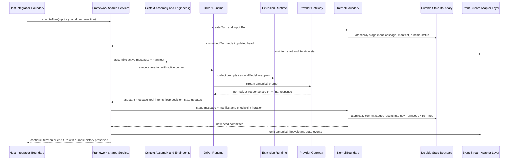
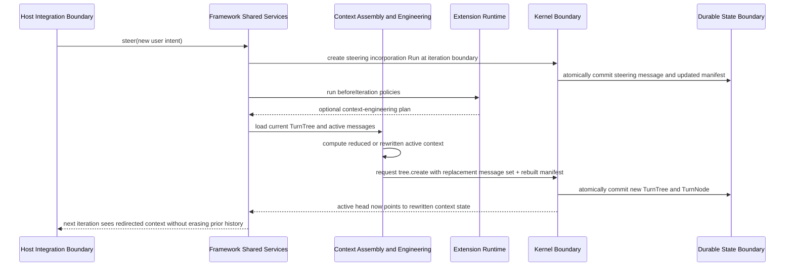
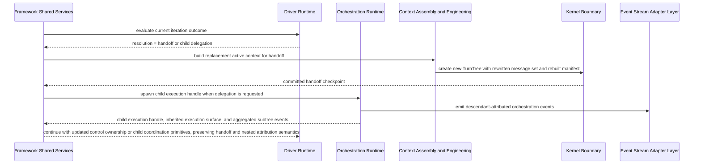
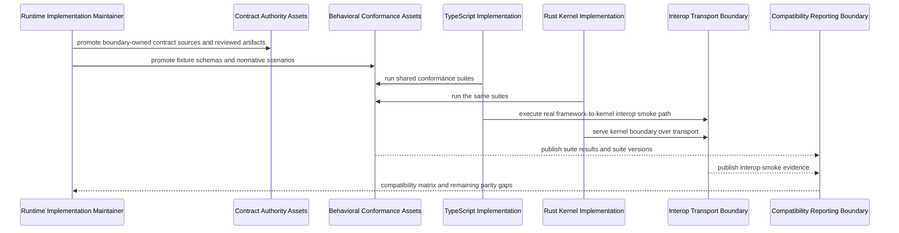
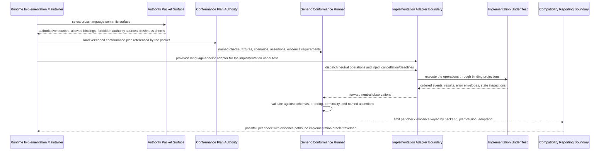
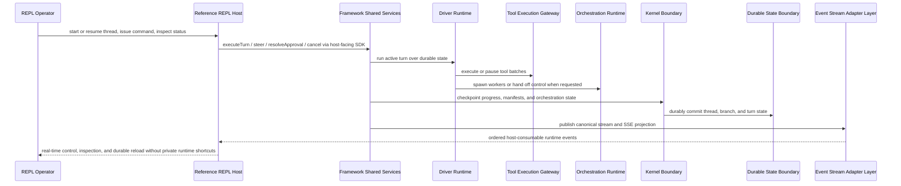

# Solution Architecture

## 0. Version History & Changelog

- v0.6.0 - Realigned the logical architecture around an SDK-first product line, a serious REPL-style proving host, portable canonical plus SSE stream surfaces, and a full documented orchestration scope for the first product-depth implementation line.
- v0.5.0 - Added the machine-authority-packet surface (Authority Packet, Conformance Plan, Implementation Adapter, Generic Conformance Runner), the forbidden-authority-source failure class, and the packet-driven conformance flow that realizes PRD CAP-P0-037 / CAP-P1-038.
- v0.4.0 - Added the multi-implementation asset boundaries, the cross-language conformance and compatibility flow, and the semantic-authority posture for the post-TypeScript transition line.
- ... [Older history truncated, refer to git logs]

## 1. Architectural Strategy & Archetype Alignment

- **Architectural Pattern:** Layered modular runtime with a narrow kernel boundary, shared framework services, pluggable drivers, and explicit adapter edges
- **Why this pattern fits the PRD:** Tuvren Runtime must be embeddable, durable, provider-neutral, and capable of supporting more than one execution style over time without redefining its durable core. A layered modular runtime preserves a stable mechanism foundation while letting shared framework services and individual drivers evolve independently.
- **Core trade-offs accepted:** The design prioritizes explicit boundaries, recoverability, and inspectability over minimum surface area; it accepts more internal structure than a lightweight prompt wrapper; and it rejects distributed topology until the product proves that one in-process runtime can no longer carry the scope.

### 1.1 Problem Context

- Tuvren Runtime is a runtime substrate, not a single agent application and not one fixed control-flow style.
- The architecture therefore has to satisfy three needs at once: durable execution truth, clean embedding into hosts, and room for more than one runtime driver over shared primitives.
- The product’s defining value comes from preserving execution truth across interruption, redirection, governance, orchestration, and future driver variation. The architecture must center that truth in one authoritative durable boundary while preventing the first driver from becoming the whole ontology.

### 1.2 Core Architectural Principles

- **Mechanism-policy-driver separation:** The Kernel owns durable mechanism; the Framework owns shared runtime contracts and services; Drivers own concrete execution policy.
- **Single source of execution truth:** Durable lineage and state are authoritative; streams, wrappers, and provider-native representations are informative but non-authoritative.
- **In-process modularity first:** Containers are logical boundaries inside one embeddable runtime system, aligning with solo-dev realism and avoiding premature service decomposition.
- **Adapter edges at trust boundaries:** Hosts, model providers, and external tools connect through explicit boundary adapters rather than leaking their protocols inward.
- **Reference-host realism:** The first product-depth host must consume the same host-facing SDK boundary that downstream host developers use, rather than proving the runtime through privileged internal seams.
- **Artifact-backed semantic authority:** Human semantic authority lives in the docs and constitution, while machine-readable contract, conformance, and interop assets make those semantics executable across implementations.
- **Machine-enforced neutral authority:** Every cross-implementation semantic must be carried by a boundary-owned authority packet that pairs neutral machine-readable sources with at least one executable verification path. No implementation language file, generic runner source file, or human-prose document can act as the source of cross-language truth.
- **History-preserving correction:** Rollback, steering, handoff, and context engineering create new lineage rather than rewriting the past.
- **Driver plurality without product sprawl:** The architecture must support multiple drivers conceptually, but only one driver needs to be implemented to production depth at a time.
- **Portable stream spine:** The canonical event stream and SSE projection are core runtime surfaces; ecosystem-specific protocol adapters may exist above them, but they must not become the product’s semantic center.

### 1.3 Named Trust Relationships

- **Trusted core:** Kernel Boundary, Durable State Boundary, Framework Shared Services, and the active Driver Runtime are trusted to preserve runtime invariants.
- **Conditionally trusted extensions:** Extensions can influence execution, but only through declared lifecycle points and bounded contracts.
- **Untrusted provider boundary:** Model provider outputs are advisory inputs that must be normalized before affecting durable execution.
- **Partially trusted host boundary:** Hosts may start, steer, cancel, and resolve approvals, but they do not become the source of runtime truth.
- **High-risk tool boundary:** External tool execution is where side effects happen and where approval, staging, and recovery protections matter most.
- **Trusted semantic assets:** Boundary-owned contract and conformance assets are trusted to carry machine-readable meaning, while generated bindings and reports are evidence rather than primary authority.
- **Untrusted semantic candidates:** Implementation language source trees, generic runner code, and human-prose documents are untrusted as cross-language semantic sources. They may project, validate, or describe authority, but they may not become it.

### 1.4 Failure Classes

- **Execution interruption:** Process stop, cancellation, or stream interruption during model or tool work.
- **Partial side-effect completion:** Some tool work or staged results completed, but the turn has not fully advanced.
- **Context divergence risk:** Active context is reshaped, handed off, or steered in ways that could become unintelligible without explicit lineage.
- **Driver lock-in risk:** Shared framework services accidentally absorb assumptions that only one driver actually needs.
- **Boundary translation risk:** Provider-native or host-native representations conflict with Kraken’s canonical model unless normalized at the edge.
- **Cross-language drift risk:** Human specs, machine-readable artifacts, and implementation lines diverge enough that “same runtime” stops meaning the same thing across languages or processes.
- **Forbidden authority source risk:** A semantic that should live in a boundary-owned authority packet leaks into an implementation language file, a generic runner's hard-coded assertions, or a Markdown document, quietly making that surface the de facto cross-language oracle.
- **Generated artifact staleness risk:** Generated artifacts (validators, bindings, conformance plans, transport descriptors) drift from their authority sources and silently change observable meaning without a corresponding authored change.

## 2. System Containers

### Host Integration Boundary

- **Logical Type:** External boundary adapter
- **Responsibility:** Expose Tuvren Runtime to embedding environments, initiate turns, consume event streams, surface status, deliver steering, route approvals, and trigger cancellation. The first product-depth proof host is a serious REPL CLI built against this same boundary rather than a privileged internal harness.
- **Inputs:** User or system signals, approval responses, steering signals, cancellation requests, runtime events.
- **Outputs:** Turn-start requests, control signals, translated protocol events, host-visible execution status.
- **Depends on:** Framework Shared Services, Event Stream Adapter Layer.

### Framework Shared Services

- **Logical Type:** Application service layer
- **Responsibility:** Own the stable framework contracts and shared runtime services above the kernel, including execution-handle lifecycle, turn/run orchestration shell, context manifest maintenance, event publication, extension coordination, and driver selection.
- **Inputs:** Host commands, execution state from durable history, extension contributions, driver-emitted control outcomes, provider and tool gateway results.
- **Outputs:** Driver invocation requests, kernel syscalls, runtime status transitions, event publication, approval state, steering incorporation, and host-visible execution handles.
- **Depends on:** Driver Runtime, Context Assembly and Engineering, Extension Runtime, Orchestration Runtime, Kernel Boundary, Event Stream Adapter Layer.

### Driver Runtime

- **Logical Type:** Execution strategy boundary
- **Responsibility:** Implement one concrete execution model over shared framework primitives. The initial baseline is the ReAct Driver, which renders prompts, interprets provider responses, evaluates loop decisions, and determines when to continue, pause, hand off, fail, or end a turn.
- **Inputs:** Active context, driver configuration, provider responses, tool results, extension verdicts, steering state, and framework-owned control constraints.
- **Outputs:** Canonical assistant messages, tool batches, runtime resolutions, driver-specific state transitions, and context-engineering or orchestration intents.
- **Depends on:** Provider Gateway, Tool Execution Gateway, Extension Runtime, Context Assembly and Engineering.

### Context Assembly and Engineering

- **Logical Type:** Domain service layer
- **Responsibility:** Build the active working context from durable history, maintain the context manifest, and execute explicit context reshaping actions such as reduction, compaction, substitution, or handoff context rewrites.
- **Inputs:** TurnTree state, message lineage, context policies, extension-generated context plans, handoff intents, steering signals, and driver requests.
- **Outputs:** Active message sets, rebuilt manifests, replacement message collections, and context-engineering actions for checkpointing.
- **Depends on:** Kernel Boundary.

### Extension Runtime

- **Logical Type:** Policy composition boundary
- **Responsibility:** Host lifecycle hooks, around-model wrappers, around-tool wrappers, system prompt contributions, extension-owned state updates, and declared shared exports within bounded contracts.
- **Inputs:** Execution context, manifests, prompts, tool calls, model responses, tool results, iteration outcomes.
- **Outputs:** Verdicts, state updates, custom events, prompt contributions, pause requests, and wrapped execution behavior.
- **Depends on:** Framework Shared Services, Driver Runtime, Event Stream Adapter Layer.

### Provider Gateway

- **Logical Type:** External integration boundary
- **Responsibility:** Translate canonical prompts to provider-facing requests and translate provider outputs and streams back into canonical Kraken representations while preserving provider continuity artifacts without promoting provider-specific ontology inward.
- **Inputs:** Canonical prompt, rendered tool definitions, structured-output requests, model configuration.
- **Outputs:** Canonical model responses, normalized stream chunks, continuity artifacts, and provider failure signals.
- **Depends on:** External Model Providers.

### Tool Execution Gateway

- **Logical Type:** External integration boundary
- **Responsibility:** Resolve tools, validate inputs, apply approval gating, execute tool work, stage tool results incrementally, and return canonical tool result messages to the runtime.
- **Inputs:** Canonical tool calls, tool registry definitions, approval decisions, tool execution context.
- **Outputs:** Canonical tool results, approval requests, partial batch completion state, and tool-related events.
- **Depends on:** External Tools and Systems, Extension Runtime, Kernel Boundary.

### Orchestration Runtime

- **Logical Type:** Coordination service
- **Responsibility:** Provide the documented handle/tree-based orchestration primitives for child execution, descendant event aggregation, parent-child execution coordination, handoff continuity, execution inheritance, and nested attribution without creating ambiguous control ownership.
- **Inputs:** Child launch requests, child completion signals, parent execution status, and child subtree events.
- **Outputs:** New execution handles for children, descendant-attributed event streams, and child completion access.
- **Depends on:** Framework Shared Services, Context Assembly and Engineering, Event Stream Adapter Layer, Host Integration Boundary.

### Kernel Boundary

- **Logical Type:** Mechanism core boundary
- **Responsibility:** Own durable objects, TurnTree construction, TurnNode lineage, staging, run lifecycle operations, thread and branch containment, and checkpoint atomicity.
- **Inputs:** Explicit framework requests for storage, staging, tree construction, run lifecycle, thread lifecycle, branch movement, and turn head updates.
- **Outputs:** Durable identities, recovered state, structural diffs, validated lineage relationships, and committed history points.
- **Depends on:** Durable State Boundary.

### Durable State Boundary

- **Logical Type:** Persistence boundary
- **Responsibility:** Provide the atomic durable storage substrate required for immutable objects, staging durability, checkpoint transactions, and read-after-write consistency.
- **Inputs:** Object writes, structured state writes, transaction requests, and recovery reads.
- **Outputs:** Durable committed records, structural state retrieval, existence checks, and transaction success or failure.
- **Depends on:** None.

### Event Stream Adapter Layer

- **Logical Type:** Outbound protocol adaptation boundary
- **Responsibility:** Convert canonical Kraken runtime events into host-facing protocol shapes while preserving source attribution, execution ordering, and driver/runtime distinctions. Canonical events and SSE are core portable surfaces; ecosystem-specific adapters are downstream projections.
- **Inputs:** Canonical runtime events, custom events, worker-forwarded events, and driver-attributed event metadata.
- **Outputs:** Protocol-ready event streams for host consumers.
- **Depends on:** Framework Shared Services, Extension Runtime, Orchestration Runtime.

### Contract Authority Assets

- **Logical Type:** Boundary-owned specification surface
- **Responsibility:** Capture machine-readable shape contracts owned by a boundary, including public payload shapes, protocol grammars, and reviewed generated artifacts derived from authored sources.
- **Inputs:** Human-approved semantic changes from the docs and constitution, boundary-owned schema sources, and implementation feedback when promoting a shape to normative status.
- **Outputs:** Machine-readable contract artifacts consumed by validation, code generation, and later implementation lines.
- **Depends on:** None.

### Behavioral Conformance Assets

- **Logical Type:** Boundary-owned behavior corpus
- **Responsibility:** Capture versioned fixtures, schemas, and scenario definitions that express observable behavior independently of any single implementation.
- **Inputs:** Human-approved behavioral expectations, boundary-owned fixture definitions, and implementation evidence when promoting a behavior to normative status.
- **Outputs:** Shared conformance suites consumed by language-specific runners and compatibility reporting.
- **Depends on:** Contract Authority Assets.

### Interop Transport Boundary

- **Logical Type:** Cross-process boundary contract
- **Responsibility:** Define the narrow transport surface used when kernel or other runtime boundaries cross process and language seams.
- **Inputs:** Canonical boundary operations, stable event and error envelopes, and host/runtime control requirements.
- **Outputs:** Versioned transport exchanges and implementation-facing transport contracts.
- **Depends on:** Kernel Boundary, Contract Authority Assets.

### Compatibility Reporting Boundary

- **Logical Type:** Generated evidence boundary
- **Responsibility:** Aggregate conformance and interop results into machine-readable compatibility reports without becoming semantic authority itself.
- **Inputs:** Language-specific runner results, interop smoke results, and suite metadata.
- **Outputs:** Compatibility matrices and health reports for maintainers and CI.
- **Depends on:** Behavioral Conformance Assets, Interop Transport Boundary.

### Authority Packet Surface

- **Logical Type:** Boundary-owned authority manifest
- **Responsibility:** For each cross-implementation semantic surface, declare exactly which Contract Authority Assets, Behavioral Conformance Assets, Interop Transport Boundary entries, generated artifacts, conformance plans, and language-binding projections together carry that semantic; declare the forbidden authority sources for the same surface; and declare freshness and compatibility checks the surface must satisfy. The packet is a meta-container whose authority is the act of declaration; it does not host new semantics by itself.
- **Inputs:** Approved promotions of contract sources, conformance plans, transport projections, telemetry vocabulary, and binding projections; review decisions about what may and may not act as authority for the surface.
- **Outputs:** A single boundary-owned manifest per surface that names authoritative sources, generated artifacts, allowed binding appendices, forbidden authority sources, and required executable verification paths.
- **Depends on:** Contract Authority Assets, Behavioral Conformance Assets, Interop Transport Boundary, Conformance Plan Authority.

### Conformance Plan Authority

- **Logical Type:** Boundary-owned executable behavior surface
- **Responsibility:** Express named semantic checks, fixtures, scenarios, assertions, evidence requirements, and runner applicability as data-owned artifacts that any generic runner can consume. Carry behavior assertions that exceed shape grammar (event ordering, terminality, lifecycle transitions, recovery state, approval pause/resume continuity, structured-output validation) without delegating that authority to runner code.
- **Inputs:** Approved behavior promotions from human authority, fixture and scenario sources, schema references, and evidence-shape definitions.
- **Outputs:** Versioned conformance plans referenced by Authority Packet manifests and consumed by Generic Conformance Runner over Implementation Adapter Boundary instances.
- **Depends on:** Contract Authority Assets, Behavioral Conformance Assets.

### Implementation Adapter Boundary

- **Logical Type:** Language-specific executable seam
- **Responsibility:** Expose a particular implementation to a Generic Conformance Runner through a neutral surface for operation dispatch, ordered event consumption, cancellation and deadline control, error envelopes, and where applicable durable-state inspection. Each implementation language provides at least one adapter per authority packet it claims to support.
- **Inputs:** Generic runner invocations driven by a conformance plan; implementation under test; language-binding projections from the relevant authority packet.
- **Outputs:** Operation results, ordered event streams, error envelopes, evidence emissions, and adapter lifecycle signals consumed by the Generic Conformance Runner.
- **Depends on:** The implementation under test, the relevant Authority Packet Surface, and the language-binding projections it declares.

### Generic Conformance Runner

- **Logical Type:** Implementation-agnostic verification process
- **Responsibility:** Load a conformance plan, drive an Implementation Adapter Boundary, validate operation results and event streams against schemas and assertions named in the plan, and emit evidence for the Compatibility Reporting Boundary. The runner owns generic mechanics (adapter startup, dispatch, schema validation, generic assertion operators, ordered-channel consumption, cancellation injection, timeout control, evidence emission) and never hard-codes product semantics, expected event sequences, expected check IDs, or expected error codes outside what the plan supplies.
- **Inputs:** A conformance plan version, an Implementation Adapter Boundary instance, fixtures and scenarios named by the plan, and evidence shape definitions.
- **Outputs:** Per-check pass/fail results, captured evidence artifacts, and structured run summaries forwarded to the Compatibility Reporting Boundary.
- **Depends on:** Conformance Plan Authority, Implementation Adapter Boundary, Behavioral Conformance Assets.

### 2.1 Communication Relationships

- Host Integration Boundary -> Framework Shared Services: synchronous execution commands and control signals
- Framework Shared Services -> Driver Runtime: in-process execution strategy invocation
- Framework Shared Services -> Kernel Boundary: synchronous runtime syscalls and checkpoint orchestration
- Framework Shared Services <-> Context Assembly and Engineering: in-process context reads and explicit context rewrite actions
- Driver Runtime -> Provider Gateway: synchronous request / streaming response interaction
- Driver Runtime -> Tool Execution Gateway: synchronous or batched tool dispatch
- Driver Runtime <-> Extension Runtime: in-process lifecycle callbacks and wrapper invocation
- Orchestration Runtime <-> Framework Shared Services: in-process worker launch, handoff, and resume coordination
- Kernel Boundary -> Durable State Boundary: atomic persistence transactions
- Framework Shared Services / Orchestration Runtime / Extension Runtime -> Event Stream Adapter Layer: canonical event publication
- Framework Shared Services / Provider Gateway / Kernel Boundary -> Contract Authority Assets: consume boundary-owned machine-readable shapes for validation and generated support
- Language-specific runners -> Behavioral Conformance Assets: execute shared suites without redefining semantics locally
- Host Integration Boundary / Framework Shared Services <-> Interop Transport Boundary: use transport contracts when a runtime boundary spans processes or languages
- Behavioral Conformance Assets / Interop Transport Boundary -> Compatibility Reporting Boundary: publish suite and interop results for implementation parity reporting
- Authority Packet Surface -> Contract Authority Assets / Behavioral Conformance Assets / Interop Transport Boundary / Conformance Plan Authority: declare which sources, plans, and projections together carry one cross-implementation semantic and which sources are forbidden authority for that surface
- Conformance Plan Authority -> Generic Conformance Runner: deliver versioned, data-owned conformance plans that drive verification mechanics
- Generic Conformance Runner <-> Implementation Adapter Boundary: dispatch neutral operations, consume ordered event channels, inject cancellation and deadlines, and collect error envelopes and evidence for one implementation under test
- Generic Conformance Runner -> Compatibility Reporting Boundary: emit per-check evidence keyed by authority packet, conformance plan version, and adapter identity

### 2.2 Boundary Notes

- The architecture keeps the Kernel Boundary and Durable State Boundary distinct so later implementation work can vary backend realization without changing logical design.
- Framework Shared Services exist so host control, event vocabulary, context manifest handling, and execution-handle semantics do not get welded to the first driver.
- Driver Runtime is a logical boundary, not a promise that every future driver needs a separate process or deployment unit.
- The current active driver is ReAct-oriented, but the architecture keeps room for future workflow-oriented drivers such as pipeline, router, evaluator-optimizer, or orchestrator-worker patterns.
- Ordered multi-agent pipelines are in current product scope, but they remain driver-level orchestration policy above the shared handoff/orchestration primitives rather than shared-core semantics.
- The first product-depth proof host is a serious REPL CLI that must consume the same host-facing boundary other hosts use; it may exercise more scenarios than downstream hosts need, but it must not bypass the boundary with private orchestration or persistence shortcuts.
- Contract authority, behavioral conformance, and interop transport are separate containers on purpose; no single artifact type is allowed to silently become the meaning of the runtime.
- Native language toolchains may differ, but their outputs must still fit the same boundary-owned contract, conformance, and compatibility system.
- Authority Packet Surface, Conformance Plan Authority, Implementation Adapter Boundary, and Generic Conformance Runner are first-class containers because their absence is the failure mode that lets a TypeScript file, Rust crate, runner source file, or Markdown document quietly become the cross-language oracle.
- Implementation Adapter Boundary is logically per-language but does not imply a separate process; an adapter may be in-process for the language under test while the Generic Conformance Runner remains language-agnostic.
- Canonical stream semantics and SSE translation are part of the portable runtime contract. AG-UI or similar ecosystem adapters may exist above them, but they remain secondary projections rather than cross-language product authority.

## 3. Container Diagram (Mermaid)

```mermaid
C4Container
title Container Diagram
Person(hostUser, "Host / Integrator", "Starts turns, observes execution, resolves control decisions")
System_Boundary(tuvren_runtime, "Tuvren Runtime") {
  Container(hostBoundary, "Host Integration Boundary", "Boundary Adapter", "Entry point for turns, steering, approval, cancellation, and status")
  Container(frameworkServices, "Framework Shared Services", "Application Service Layer", "Stable host-facing services, runtime control shell, context manifest handling, driver selection, and event publication")
  Container(driverRuntime, "Driver Runtime", "Execution Strategy Boundary", "Concrete execution model; initial baseline is the ReAct-oriented driver")
  Container(contextLayer, "Context Assembly and Engineering", "Domain Service", "Builds active context and performs context rewrites")
  Container(extensionRuntime, "Extension Runtime", "Policy Runtime", "Hooks, wrappers, prompt contributions, extension state")
  Container(providerGateway, "Provider Gateway", "Integration Boundary", "Canonical <-> provider translation")
  Container(toolGateway, "Tool Execution Gateway", "Integration Boundary", "Validation, approval gating, tool execution, incremental result staging")
  Container(orchestrationRuntime, "Orchestration Runtime", "Coordination Service", "Workers, handoffs, execution inheritance, descendant attribution, and pipeline-level orchestration policy")
  Container(eventAdapter, "Event Stream Adapter Layer", "Outbound Adapter", "Canonical event translation for hosts")
  Container(kernelBoundary, "Kernel Boundary", "Mechanism Core", "Durable objects, staging, trees, lineage, runs, branches")
  ContainerDb(stateBoundary, "Durable State Boundary", "Persistence Boundary", "Atomic durable storage substrate")
  Container(contractAssets, "Contract Authority Assets", "Specification Surface", "Boundary-owned machine-readable shape contracts and reviewed generated artifacts")
  Container(conformanceAssets, "Behavioral Conformance Assets", "Behavior Corpus", "Boundary-owned fixtures, schemas, and scenarios shared across implementations")
  Container(interopBoundary, "Interop Transport Boundary", "Cross-Process Contract", "Transport surface for runtime boundaries that span processes or languages")
  Container(compatibilityReporting, "Compatibility Reporting Boundary", "Generated Evidence", "Aggregates suite and interop results into compatibility reports")
  Container(authorityPacket, "Authority Packet Surface", "Authority Manifest", "Per-surface declaration of authoritative sources, generated artifacts, allowed bindings, forbidden authority sources, and freshness checks")
  Container(conformancePlan, "Conformance Plan Authority", "Executable Behavior Surface", "Data-owned named checks, fixtures, scenarios, assertions, and evidence requirements consumed by generic runners")
  Container(implAdapter, "Implementation Adapter Boundary", "Language-Specific Seam", "Per-language adapter exposing operations, ordered events, cancellation, errors, and state inspection to the generic runner")
  Container(genericRunner, "Generic Conformance Runner", "Verification Process", "Implementation-agnostic process that drives an adapter against a conformance plan and emits per-check evidence")
}
System_Ext(modelProviders, "Model Providers", "External generation systems")
System_Ext(externalTools, "External Tools and Systems", "External side-effecting capabilities")

Rel(hostUser, hostBoundary, "Starts turns and sends control inputs")
Rel(hostBoundary, frameworkServices, "Execution commands and control signals")
Rel(frameworkServices, driverRuntime, "Invokes active driver")
Rel(frameworkServices, contextLayer, "Reads and rewrites active context")
Rel(frameworkServices, kernelBoundary, "Run lifecycle, checkpoints, lineage operations")
Rel(driverRuntime, extensionRuntime, "Lifecycle callbacks and wrappers")
Rel(driverRuntime, providerGateway, "Canonical prompts / model responses")
Rel(driverRuntime, toolGateway, "Tool batches / tool results")
Rel(orchestrationRuntime, frameworkServices, "Child execution coordination")
Rel(frameworkServices, orchestrationRuntime, "Child launch and orchestration requests")
Rel(providerGateway, modelProviders, "Provider-facing requests and streams")
Rel(toolGateway, externalTools, "Validated tool execution")
Rel(kernelBoundary, stateBoundary, "Atomic durable transactions")
Rel(frameworkServices, eventAdapter, "Canonical runtime events")
Rel(orchestrationRuntime, eventAdapter, "Descendant-attributed orchestration events")
Rel(extensionRuntime, eventAdapter, "Custom events")
Rel(eventAdapter, hostBoundary, "Host-facing event streams")
Rel(frameworkServices, contractAssets, "Consumes contract shapes")
Rel(providerGateway, contractAssets, "Consumes provider/runtime shapes")
Rel(kernelBoundary, contractAssets, "Consumes protocol grammars")
Rel(conformanceAssets, compatibilityReporting, "Publishes suite results")
Rel(interopBoundary, compatibilityReporting, "Publishes interop results")
Rel(hostBoundary, interopBoundary, "Uses transport when boundaries span processes")
Rel(frameworkServices, interopBoundary, "Uses transport client/server contracts")
Rel(authorityPacket, contractAssets, "Declares authoritative contract sources")
Rel(authorityPacket, conformanceAssets, "Declares authoritative behavioral assets")
Rel(authorityPacket, interopBoundary, "Declares authoritative transport projections")
Rel(authorityPacket, conformancePlan, "References versioned conformance plans")
Rel(conformancePlan, genericRunner, "Supplies named checks and assertions")
Rel(genericRunner, implAdapter, "Drives operations and consumes events")
Rel(genericRunner, compatibilityReporting, "Emits per-check evidence")
```



## 4. Critical Execution Flows

### 4.1 ReAct Driver Turn Execution with Durable Checkpointing

- **Maps to PRD capability:** CAP-P0-001, CAP-P0-002, CAP-P0-004, CAP-P0-006, CAP-P0-007, CAP-P0-008, CAP-P0-012, CAP-P0-019, CAP-P0-020, CAP-P0-030, CAP-P0-033



### 4.2 Tool Approval Pause and Exact Resume

- **Maps to PRD capability:** CAP-P0-005, CAP-P0-008, CAP-P0-013, CAP-P0-014, CAP-P0-016, CAP-P0-017, CAP-P0-019

```mermaid
sequenceDiagram
participant Host as Host Integration Boundary
participant Framework as Framework Shared Services
participant Driver as Driver Runtime
participant Tooling as Tool Execution Gateway
participant Ext as Extension Runtime
participant Kernel as Kernel Boundary
participant State as Durable State Boundary
participant Events as Event Stream Adapter Layer

Framework->>Driver: submit tool batch from current iteration
Driver->>Tooling: resolve, validate, and classify tools
Tooling->>Ext: evaluate aroundTool and approval policies
Tooling->>Tooling: execute auto-approved tools
Tooling->>Kernel: incrementally stage completed tool results
Kernel->>State: durably record completed staged results
Tooling-->>Driver: partial results + approval request for pending tools
Driver-->>Framework: resolution = pause(approval required)
Framework->>Kernel: stage paused runtime status + manifest, complete paused Run
Kernel->>State: checkpoint partial batch into new TurnNode
Framework->>Events: emit approval.requested then paused turn.end
Host->>Framework: resolveApproval(decisions)
Framework->>Kernel: close paused Run to unblock Branch
Framework->>Kernel: create replacement Run from pause TurnNode
Framework->>Driver: apply approval decisions and resume only unfinished approved or edited tool calls
Driver->>Tooling: continue execution
Tooling->>Kernel: stage resumed tool results
Kernel->>State: commit resumed results and new history point
Framework->>Events: emit approval.resolved and resumed execution events
Framework-->>Host: continue same Turn without redoing completed side effects; rejection-only continuation policy remains host/driver owned
```

### 4.3 Context Engineering and Steering Between Iterations

- **Maps to PRD capability:** CAP-P0-010, CAP-P0-019, CAP-P1-022



### 4.4 Driver Handoff and Documented Child Orchestration

- **Maps to PRD capability:** CAP-P0-023, CAP-P0-026, CAP-P0-027, CAP-P1-029, CAP-P0-033



### 4.5 Multi-Implementation Conformance and Compatibility Validation

- **Maps to PRD capability:** CAP-P1-035, CAP-P1-036



### 4.6 Authority-Packet-Driven Conformance Validation

- **Maps to PRD capability:** CAP-P0-037, CAP-P1-038, CAP-P1-035, CAP-P1-036



### 4.7 Serious REPL Host Proves the SDK End to End

- **Maps to PRD capability:** CAP-P0-005, CAP-P0-010, CAP-P0-016, CAP-P0-019, CAP-P0-020, CAP-P0-023, CAP-P0-026, CAP-P0-027, CAP-P1-022, CAP-P1-024



## 5. Resilience & Cross-Cutting Concerns

- **Security / Identity Strategy:** Host applications authenticate and authorize their own callers before exposing Tuvren Runtime controls; the Kraken engine itself treats host commands, provider responses, and tool outputs as boundary inputs that require validation and normalization.
- **Failure Handling Strategy:** The kernel and durable state boundary preserve committed progress, staged tool results, and lineage so interruption, pause/resume, rollback, and replacement-run behavior can be realized without history corruption.
- **Observability Strategy:** Canonical runtime events are emitted from shared framework services and translated outward by stream adapters; driver attribution must remain visible so hosts can tell shared-runtime events from driver-specific behavior; and future cross-language execution must share one telemetry vocabulary plus compatibility-report evidence.
- **Configuration Strategy:** Driver selection, provider choice, tool registry, extension activation, and backend configuration are runtime-selected concerns above the kernel; the kernel remains unaware of provider and host semantics; and native toolchain configuration remains authoritative inside each implementation subtree.
- **Data Integrity / Consistency Notes:** Kernel-visible semantics remain uniform across backends; drivers may differ in control flow but must still rely on the same durable object, staging, lineage, and checkpoint rules; and machine-readable contract/conformance assets must stay aligned with the docs and constitution instead of drifting into a parallel truth system.

## 6. Logical Risks & Technical Debt

- **Risk:** Shared framework services absorb ReAct-specific semantics and quietly erase the value of driver modularity.
- **Why it matters:** Future workflow-oriented drivers would either duplicate framework logic or be forced into a ReAct-shaped abstraction they do not actually fit.
- **Mitigation or follow-up:** Keep driver contracts explicit in the implementation layer and treat the current behavior as the ReAct baseline rather than as anonymous “framework default” behavior.

- **Risk:** Driver plurality inflates early scope beyond what a solo developer can validate well.
- **Why it matters:** Trying to implement multiple drivers now would dilute the quality of the kernel, provider, and host foundations.
- **Mitigation or follow-up:** Ship one production-depth driver first, keep future drivers as deferred scope, and use the architecture only to preserve the conceptual boundary.

- **Risk:** Host-facing contracts and event vocabulary drift if adapters or drivers bypass shared framework services.
- **Why it matters:** Different hosts would observe different runtime truths, weakening portability and operability.
- **Mitigation or follow-up:** Route host controls and canonical event publication through the shared framework layer even when a driver has specialized execution behavior.

- **Risk:** The first-party proving host relies on privileged seams that downstream hosts cannot use, creating false confidence in the SDK.
- **Why it matters:** The product would appear host-buildable while still depending on implementation-local shortcuts, undermining both SDK quality and later portability work.
- **Mitigation or follow-up:** Treat the serious REPL host as an SDK consumer at the Host Integration Boundary, require end-to-end proving flows through canonical controls and streams, and reject product-proof claims that bypass the host-facing abstractions.

- **Risk:** TypeScript-first repo structure or test tooling becomes a permanent exception that later languages have to work around.
- **Why it matters:** A one-off structure would turn every future implementation into an adapter to historical accidents instead of a peer in one boundary-owned semantic system.
- **Mitigation or follow-up:** Epic X now enforces the topology rule in repo reality: language-neutral assets stay at boundary-owned roots, and language-specific package roots live only under `implementations/<lang>/`. Future implementation lines must enter through that normalized structure instead of reopening TypeScript-first exceptions.

- **Risk:** Machine-readable artifacts drift away from the human semantic sources in `docs/` and `constitution/`.
- **Why it matters:** Cross-language parity collapses quickly when schemas, fixtures, or reports become de facto truth without matching the normative specs.
- **Mitigation or follow-up:** Treat docs and constitution as the human authority chain, require boundary-owned review for artifact changes, and generate compatibility reports from actual suite evidence rather than hand-authored claims.

- **Risk:** A cross-language semantic continues to be defined only by TypeScript source, Rust source, generic runner code, or Markdown prose, making one of those surfaces the silent oracle.
- **Why it matters:** Future implementations must then chase implementation accidents instead of honoring shared meaning, and "the same runtime" stops surviving the addition of any new language line.
- **Mitigation or follow-up:** Every cross-language semantic must live in a boundary-owned Authority Packet Surface that names its authoritative sources and forbidden authority sources, with at least one Conformance Plan Authority entry and a Generic Conformance Runner path that can drive any compliant Implementation Adapter Boundary; CI must reject claims that depend only on implementation language source, runner-internal assertions, or prose documents.

- **Risk:** Generic conformance runners absorb product semantics through hard-coded expected event sequences, expected error codes, expected check IDs, or expected lifecycle transitions and quietly become a second oracle in their own right.
- **Why it matters:** Switching runner implementations or adding a new language line then depends on inheriting hidden runner assumptions rather than reading the conformance plan.
- **Mitigation or follow-up:** Runners must own only generic mechanics (adapter startup, dispatch, schema validation, generic assertion operators, ordered-channel consumption, cancellation injection, timeout control, evidence emission), and product semantics must arrive only from Conformance Plan Authority artifacts referenced by an Authority Packet Surface.

- **Risk:** Generated artifacts (validators, bindings, transport descriptors, conformance plans) drift from their authority sources and silently change observable meaning.
- **Why it matters:** Stale generated artifacts are functionally an unreviewed authority change.
- **Mitigation or follow-up:** Authority Packet Surface manifests must declare freshness checks, and CI must fail when generated artifacts diverge from their authoritative sources.
