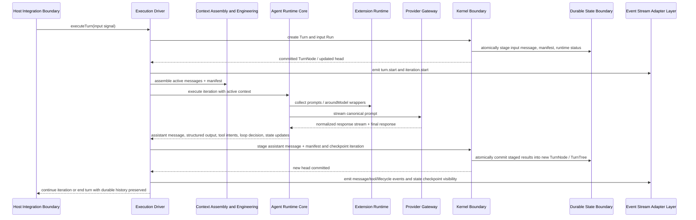
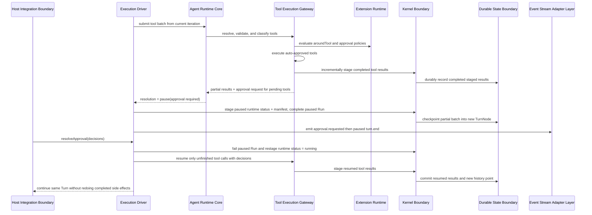
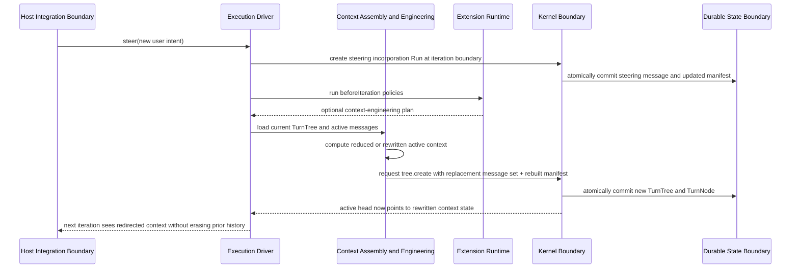
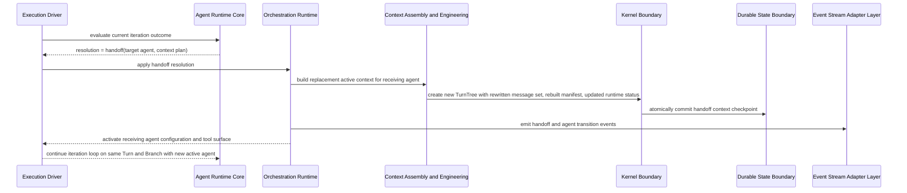
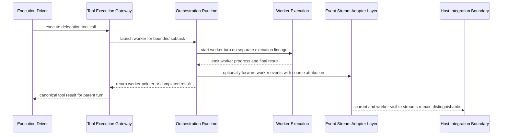
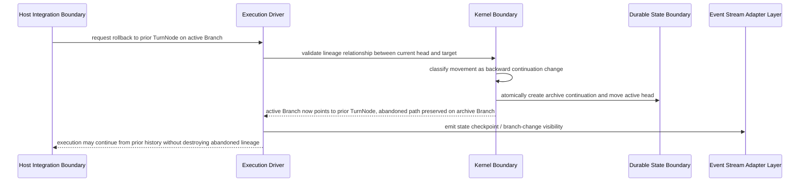

# Solution Architecture

## 0. Version History & Changelog
- v0.1.0 - Initial architecture derived from PRD v0.1.0, establishing the logical container model, critical flows, and resilience posture for Kraken Runtime.

## 1. Architectural Strategy & Archetype Alignment
- **Architectural Pattern:** Layered modular runtime with a narrow kernel boundary, explicit adapter edges, and orchestrated execution loops
- **Why this pattern fits the PRD:** Kraken must be embeddable, durable, provider-neutral, and capable of pause/resume, context engineering, and multi-agent orchestration without collapsing responsibilities. A layered modular runtime preserves a stable mechanism core while allowing higher-level execution policy and host integration to evolve independently.
- **Core trade-offs accepted:** The design prioritizes explicit boundaries, recoverability, and inspectability over minimal surface area; it accepts more internal structure than a lightweight prompt wrapper, and it rejects distributed complexity unless the PRD later proves it necessary.

### 1.1 Problem Context
- The PRD defines Kraken as a runtime substrate, not a single agent application.
- The architecture therefore has to satisfy two simultaneous needs: durable internal execution semantics and clean embedding into external hosts.
- The product’s defining value comes from preserving execution truth across interruption, redirection, governance, and orchestration. The architecture must center that truth in one authoritative state boundary.

### 1.2 Core Architectural Principles
- **Mechanism-policy separation:** The Kernel owns durable mechanism; the Framework owns execution policy and agent semantics.
- **Single source of execution truth:** Durable lineage and state are authoritative; ephemeral streams and wrappers are informative but non-authoritative.
- **In-process modularity first:** Containers are logical boundaries inside one embeddable runtime system, aligning with solo-dev realism and avoiding premature distributed topology.
- **Adapter edges at trust boundaries:** Hosts, model providers, and external tools connect through explicit boundary adapters rather than leaking their protocols inward.
- **History-preserving correction:** Rollback, handoff, and context engineering create new state lineage rather than rewriting the past.

### 1.3 Named Trust Relationships
- **Trusted core:** Kernel, Framework execution driver, and canonical state model are trusted to preserve runtime invariants.
- **Conditionally trusted extensions:** Extensions can influence execution, but only through declared lifecycle points and bounded contracts.
- **Untrusted provider boundary:** Model provider outputs are advisory inputs that must be normalized and validated before affecting execution.
- **Partially trusted host boundary:** Hosts may steer, cancel, or resolve approvals, but they do not become the source of runtime truth.
- **High-risk tool boundary:** External tool execution is where side effects occur and where approval, validation, staging, and recovery protections are most critical.

### 1.4 Failure Classes
- **Execution interruption:** Process stop, cancellation, or stream interruption during model or tool work.
- **Partial side-effect completion:** Some tool work or staged results completed, but the turn has not fully advanced.
- **Context divergence risk:** Active context is reshaped, handed off, or steered in ways that could become unintelligible without explicit lineage.
- **Policy interference risk:** Extensions, approvals, or loop decisions create contradictory or invalid control outcomes.
- **Boundary translation risk:** Provider-native or host-native representations conflict with Kraken’s canonical model unless normalized at the edge.

## 2. System Containers
### Host Integration Boundary
- **Logical Type:** External boundary adapter
- **Responsibility:** Expose Kraken to embedding environments, initiate turns, consume event streams, surface status, deliver steering, route approvals, and trigger cancellation.
- **Inputs:** User or system signals, approval responses, steering signals, cancellation requests, runtime events.
- **Outputs:** Turn-start requests, control signals, translated protocol events, host-visible execution status.
- **Depends on:** Execution Driver, Event Stream Adapter Layer.

### Execution Driver
- **Logical Type:** Application service / orchestration core
- **Responsibility:** Own the turn lifecycle, iteration loop, run boundaries, resolution handling, checkpoint timing, and coordination between the other runtime containers.
- **Inputs:** Input signals from the host boundary, execution status from durable state, canonical model responses, tool execution outcomes, extension verdicts, orchestration signals.
- **Outputs:** Run creation/completion requests, streaming lifecycle events, approval pauses, steering incorporation, handoff transitions, final turn outcomes.
- **Depends on:** Context Assembly and Engineering, Agent Runtime Core, Kernel Boundary, Event Stream Adapter Layer, Orchestration Runtime.

### Agent Runtime Core
- **Logical Type:** Domain service layer
- **Responsibility:** Render prompts, manage canonical content types including structured output, evaluate loop decisions, normalize provider responses, define tool batches, and compose extension behavior around model and tool work.
- **Inputs:** Active messages and manifest, agent configuration, extension contributions, provider responses, tool definitions, approval decisions.
- **Outputs:** Canonical assistant messages, tool call batches, runtime resolutions, runtime status updates, extension state updates.
- **Depends on:** Provider Gateway, Tool Execution Gateway, Extension Runtime, Context Assembly and Engineering.

### Context Assembly and Engineering
- **Logical Type:** Domain service layer
- **Responsibility:** Build the active working context from durable history, maintain the context manifest, and execute explicit context reshaping actions such as reduction, compaction, summarization, substitution, or handoff context rewrites.
- **Inputs:** TurnTree state, message lineage, context policies, extension-generated context plans, handoff intent, steering signals.
- **Outputs:** Active message sets, rebuilt manifests, replacement message collections, context-engineering actions for checkpointing.
- **Depends on:** Kernel Boundary.

### Extension Runtime
- **Logical Type:** Policy composition boundary
- **Responsibility:** Host lifecycle hooks, around-model wrappers, around-tool wrappers, system prompt contributions, extension-owned state updates, and shared exports within declared boundaries.
- **Inputs:** Execution context, manifests, prompts, tool calls, model responses, tool results, iteration outcomes.
- **Outputs:** Verdicts, state updates, custom events, prompt contributions, pause requests, wrapped execution behavior.
- **Depends on:** Agent Runtime Core, Event Stream Adapter Layer.

### Provider Gateway
- **Logical Type:** External integration boundary
- **Responsibility:** Translate canonical prompts to provider-facing requests, translate provider outputs and streams back into canonical Kraken representations including structured output, and preserve provider continuity artifacts without leaking provider-specific ontology inward.
- **Inputs:** Canonical prompt, rendered tool definitions, model configuration.
- **Outputs:** Canonical model responses, normalized stream chunks, provider metadata continuity artifacts, provider failure signals.
- **Depends on:** External Model Providers.

### Tool Execution Gateway
- **Logical Type:** External integration boundary
- **Responsibility:** Resolve tools, validate inputs, apply approval gating, execute tool work, stage tool results incrementally, and return canonical tool result messages to the runtime.
- **Inputs:** Canonical tool calls, tool registry definitions, approval decisions, tool execution context.
- **Outputs:** Canonical tool results, approval requests, partial batch completion state, tool-related events.
- **Depends on:** External Tools and Systems, Extension Runtime, Kernel Boundary.

### Orchestration Runtime
- **Logical Type:** Coordination service
- **Responsibility:** Manage delegated workers, handoff transitions, sequence progression, worker event forwarding, and parent-child execution coordination without creating ambiguous control ownership.
- **Inputs:** Handoff resolutions, worker launch requests, worker completion signals, parent execution status.
- **Outputs:** New execution handles for workers or resumed agents, worker status updates, forwarded worker events, handoff context plans.
- **Depends on:** Execution Driver, Context Assembly and Engineering, Event Stream Adapter Layer, Host Integration Boundary.

### Kernel Boundary
- **Logical Type:** Mechanism core boundary
- **Responsibility:** Own durable objects, TurnTree construction, TurnNode lineage, staging, run lifecycle operations, thread and branch containment, and checkpoint atomicity.
- **Inputs:** Explicit framework requests for storage, staging, tree construction, run lifecycle, thread lifecycle, branch movement, and turn head updates.
- **Outputs:** Durable identities, recovered state, structural diffs, validated lineage relationships, committed history points.
- **Depends on:** Durable State Boundary.

### Durable State Boundary
- **Logical Type:** Persistence boundary
- **Responsibility:** Provide the atomic durable storage substrate required for immutable objects, staging durability, checkpoint transactions, and read-after-write consistency.
- **Inputs:** Object writes, structured state writes, transaction requests, recovery reads.
- **Outputs:** Durable committed records, structural state retrieval, existence checks, transaction success or failure.
- **Depends on:** None.

### Event Stream Adapter Layer
- **Logical Type:** Outbound protocol adaptation boundary
- **Responsibility:** Convert canonical Kraken stream events, including structured-output events, into host-facing protocol shapes while preserving source attribution and execution ordering.
- **Inputs:** Canonical runtime events, custom events, worker-forwarded events.
- **Outputs:** Protocol-ready event streams for host consumers.
- **Depends on:** Execution Driver, Extension Runtime, Orchestration Runtime.

### 2.1 Communication Relationships
- Host Integration Boundary -> Execution Driver: synchronous execution commands and control signals
- Execution Driver -> Kernel Boundary: synchronous runtime syscalls and checkpoint orchestration
- Execution Driver -> Agent Runtime Core: in-process execution orchestration calls
- Agent Runtime Core -> Provider Gateway: synchronous request / streaming response interaction
- Agent Runtime Core -> Tool Execution Gateway: synchronous or batched tool dispatch
- Agent Runtime Core <-> Extension Runtime: in-process lifecycle callbacks and wrapper invocation
- Execution Driver <-> Context Assembly and Engineering: in-process context reads and explicit context rewrite actions
- Orchestration Runtime <-> Execution Driver: in-process coordination for worker launch, handoff, and resume
- Kernel Boundary -> Durable State Boundary: atomic persistence transactions
- Execution Driver / Orchestration Runtime / Extension Runtime -> Event Stream Adapter Layer: canonical event publication

### 2.2 Boundary Notes
- The architecture keeps the Kernel Boundary and Durable State Boundary distinct so the later implementation stage can decide whether they live in one package, one process, or one language boundary without changing the logical design.
- Provider Gateway and Tool Execution Gateway are separate because provider normalization and external side-effect execution have materially different trust and failure characteristics.
- Context Assembly and Engineering is separated from the Agent Runtime Core because active-context shaping is a governing architectural concern, not a hidden helper.

## 3. Container Diagram (Mermaid)

```mermaid
C4Container
title Container Diagram
Person(hostUser, "Host / Integrator", "Starts turns, observes execution, resolves control decisions")
System_Boundary(kraken, "Kraken Runtime") {
  Container(hostBoundary, "Host Integration Boundary", "Boundary Adapter", "Entry point for turns, steering, approval, cancellation, and status")
  Container(execDriver, "Execution Driver", "Application Service", "Owns turn lifecycle, iteration loop, checkpoints, and resolutions")
  Container(agentCore, "Agent Runtime Core", "Domain Service", "Canonical message model, rendering, loop control, tool batching")
  Container(contextLayer, "Context Assembly and Engineering", "Domain Service", "Builds active context and performs context rewrites")
  Container(extensionRuntime, "Extension Runtime", "Policy Runtime", "Hooks, wrappers, prompt contributions, extension state")
  Container(providerGateway, "Provider Gateway", "Integration Boundary", "Canonical <-> provider translation")
  Container(toolGateway, "Tool Execution Gateway", "Integration Boundary", "Validation, approval gating, tool execution, incremental result staging")
  Container(orchestrationRuntime, "Orchestration Runtime", "Coordination Service", "Workers, handoffs, sequences, forwarded events")
  Container(eventAdapter, "Event Stream Adapter Layer", "Outbound Adapter", "Canonical event translation for hosts")
  Container(kernelBoundary, "Kernel Boundary", "Mechanism Core", "Durable objects, staging, trees, lineage, runs, branches")
  ContainerDb(stateBoundary, "Durable State Boundary", "Persistence Boundary", "Atomic durable storage substrate")
}
System_Ext(modelProviders, "Model Providers", "External generation systems")
System_Ext(externalTools, "External Tools and Systems", "External side-effecting capabilities")

Rel(hostUser, hostBoundary, "Starts turns and sends control inputs")
Rel(hostBoundary, execDriver, "Execution commands and control signals")
Rel(execDriver, agentCore, "Orchestrates iteration work")
Rel(execDriver, contextLayer, "Reads and rewrites active context")
Rel(execDriver, kernelBoundary, "Run lifecycle, checkpoints, lineage operations")
Rel(agentCore, extensionRuntime, "Lifecycle callbacks and wrappers")
Rel(agentCore, providerGateway, "Canonical prompts / model responses")
Rel(agentCore, toolGateway, "Tool batches / tool results")
Rel(orchestrationRuntime, execDriver, "Worker and handoff coordination")
Rel(execDriver, orchestrationRuntime, "Delegation and handoff requests")
Rel(providerGateway, modelProviders, "Provider-facing requests and streams")
Rel(toolGateway, externalTools, "Validated tool execution")
Rel(kernelBoundary, stateBoundary, "Atomic durable transactions")
Rel(execDriver, eventAdapter, "Canonical runtime events")
Rel(orchestrationRuntime, eventAdapter, "Worker and handoff events")
Rel(extensionRuntime, eventAdapter, "Custom events")
Rel(eventAdapter, hostBoundary, "Host-facing event streams")
```

## 4. Critical Execution Flows
### 4.1 Turn Execution with Durable Checkpointing
- **Maps to PRD capability:** CAP-P0-001, CAP-P0-002, CAP-P0-004, CAP-P0-006, CAP-P0-007, CAP-P0-008, CAP-P0-012, CAP-P0-019, CAP-P0-020, CAP-P0-030

### 4.2 Tool Approval Pause and Exact Resume
- **Maps to PRD capability:** CAP-P0-005, CAP-P0-008, CAP-P0-013, CAP-P0-014, CAP-P0-016, CAP-P0-017, CAP-P0-019

### 4.3 Context Engineering and Steering Between Iterations
- **Maps to PRD capability:** CAP-P0-010, CAP-P0-019, CAP-P1-022

### 4.4 Multi-Agent Handoff Within the Same Work Item
- **Maps to PRD capability:** CAP-P0-004, CAP-P0-007, CAP-P0-008, CAP-P0-019, CAP-P0-023, CAP-P0-026, CAP-P0-027

### 4.5 Delegated Worker Execution with Parent Continuity
- **Maps to PRD capability:** CAP-P0-019, CAP-P0-020, CAP-P0-026

### 4.6 Non-Destructive Rollback and Alternate Continuation
- **Maps to PRD capability:** CAP-P0-002, CAP-P0-003, CAP-P0-019

## 5. Resilience & Cross-Cutting Concerns
- **Security / Identity Strategy:** Host-issued control actions are treated as privileged runtime controls, not conversational content. Approval decisions apply only to explicitly pending tool work. Provider outputs and tool requests are validated at the edge before they influence state transitions or side effects.
- **Failure Handling Strategy:** The architecture centers recovery on staged durability and checkpoint atomicity. Partial progress is preserved before turn advancement, incomplete work is treated as incomplete rather than guessed as successful, and side-effecting boundaries are isolated so retries and resume behavior can be applied deliberately.
- **Observability Strategy:** The canonical event stream is the runtime’s live observability surface, while durable lineage and state are the post hoc truth surface. Both are required: events for real-time UX and operations, durable state for audit, replay reasoning, and recovery.
- **Configuration Strategy:** Agent configurations, tool registries, extension composition, and policy contracts are runtime inputs at the framework layer, while the kernel and durable state boundaries remain configuration-agnostic mechanism layers. Handoffs rebuild the active execution surface from the receiving configuration rather than mutating the old one in place.
- **Data Integrity / Consistency Notes:** Durable state is authoritative over ephemeral streams; TurnTree and TurnNode lineage enforce structural continuity; context engineering rewrites only the active working set while preserving historical lineage; and host, provider, and tool boundaries never become direct writers of core state outside kernel-mediated operations.

### 5.1 Standards Posture
- The architecture standardizes on canonical internal runtime concepts rather than provider-native or host-native ones.
- External protocols are adapter concerns. The architecture requires stable internal vocabularies for content, control, and events so later implementation choices can vary without changing system meaning.

### 5.2 Solo-Developer Fit
- The architecture is intentionally shaped as a modular monolith at the logical deployment level unless a later stage proves otherwise.
- Multi-agent behavior is modeled as orchestration patterns on top of the same runtime model rather than as a mandate for multiple deployed services.
- This keeps the system conceptually rich but operationally contained.

## 6. Logical Risks & Technical Debt
- **Risk:** The architecture has a high conceptual surface area because it must model durable history, control flow, streaming, approvals, extensions, and orchestration together.
- **Why it matters:** Without strict vocabulary and boundary discipline, later stages could collapse concepts or reintroduce hidden coupling.
- **Mitigation or follow-up:** Preserve canonical terminology from the PRD, keep the kernel/framework split explicit in the TechSpec, and require every new interface to name its boundary and authority.

- **Risk:** Context engineering and handoff both rewrite active context, which could become semantically confusing if treated as generic “message mutation.”
- **Why it matters:** The wrong abstraction here would weaken auditability and make behavior explanations unreliable.
- **Mitigation or follow-up:** In the TechSpec, distinguish ordinary append flows from full-context replacement flows and preserve lineage-based visibility into pre-rewrite state.

- **Risk:** Extensions are powerful enough to create hidden policy coupling if their durable state, shared exports, and wrapper behavior are underspecified.
- **Why it matters:** This would make the runtime hard to reason about and brittle under composition.
- **Mitigation or follow-up:** The implementation contract should formalize extension state namespaces, ordering rules, and failure semantics before extension libraries grow.

- **Risk:** The boundary between live stream truth and durable state truth may confuse host implementers.
- **Why it matters:** Hosts might accidentally treat ephemeral events as authoritative or fail to reconcile interrupted streams with committed state.
- **Mitigation or follow-up:** The TechSpec should define explicit host reconciliation rules and event/state consistency expectations.

- **Risk:** Worker delegation and handoff are distinct patterns but both involve multiple agent configurations and forwarded signals.
- **Why it matters:** If implementation shortcuts collapse them into one mechanism, control ownership and recovery semantics will degrade.
- **Mitigation or follow-up:** Preserve separate execution contracts for worker lineage versus same-turn handoff continuation in the next stage.
