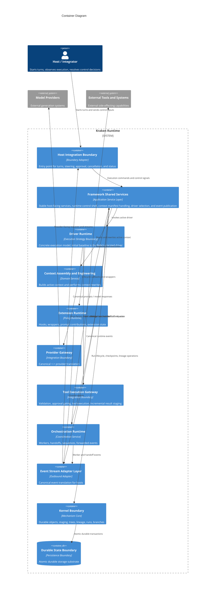
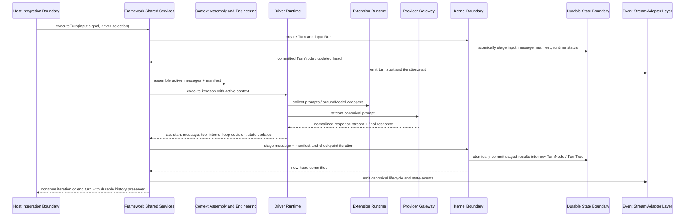
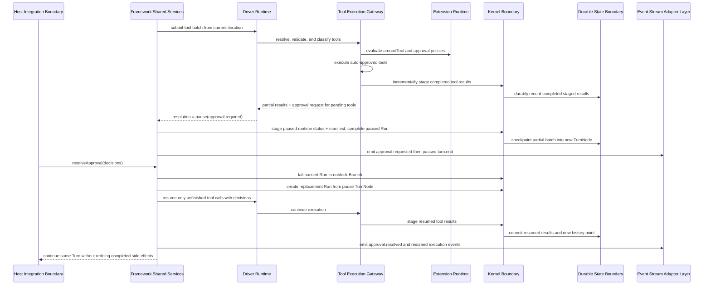
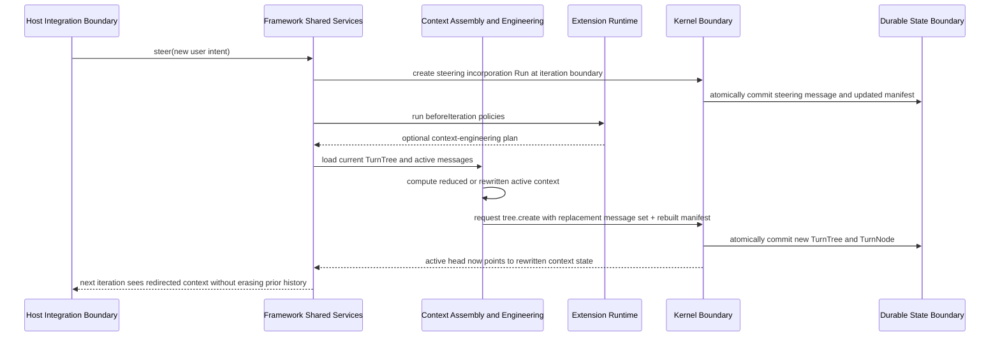
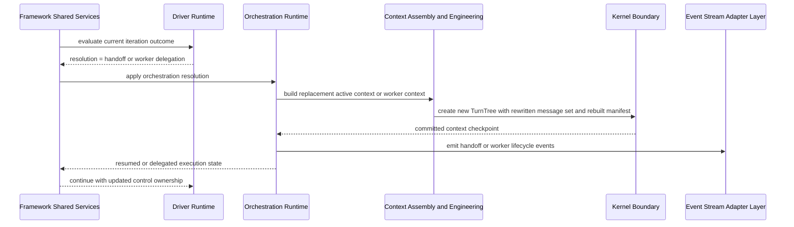

# Solution Architecture

## 0. Version History & Changelog
- v0.2.0 - Reframed the runtime around shared framework services plus pluggable drivers, with the current execution semantics treated as the initial ReAct-oriented driver.
- v0.1.0 - Initial architecture derived from PRD v0.1.0, establishing the logical container model, critical flows, and resilience posture for Kraken Runtime.
- ... [Older history truncated, refer to git logs]

## 1. Architectural Strategy & Archetype Alignment
- **Architectural Pattern:** Layered modular runtime with a narrow kernel boundary, shared framework services, pluggable drivers, and explicit adapter edges
- **Why this pattern fits the PRD:** Kraken must be embeddable, durable, provider-neutral, and capable of supporting more than one execution style over time without redefining its durable core. A layered modular runtime preserves a stable mechanism foundation while letting shared framework services and individual drivers evolve independently.
- **Core trade-offs accepted:** The design prioritizes explicit boundaries, recoverability, and inspectability over minimum surface area; it accepts more internal structure than a lightweight prompt wrapper; and it rejects distributed topology until the product proves that one in-process runtime can no longer carry the scope.

### 1.1 Problem Context
- Kraken is a runtime substrate, not a single agent application and not one fixed control-flow style.
- The architecture therefore has to satisfy three needs at once: durable execution truth, clean embedding into hosts, and room for more than one runtime driver over shared primitives.
- The product’s defining value comes from preserving execution truth across interruption, redirection, governance, orchestration, and future driver variation. The architecture must center that truth in one authoritative durable boundary while preventing the first driver from becoming the whole ontology.

### 1.2 Core Architectural Principles
- **Mechanism-policy-driver separation:** The Kernel owns durable mechanism; the Framework owns shared runtime contracts and services; Drivers own concrete execution policy.
- **Single source of execution truth:** Durable lineage and state are authoritative; streams, wrappers, and provider-native representations are informative but non-authoritative.
- **In-process modularity first:** Containers are logical boundaries inside one embeddable runtime system, aligning with solo-dev realism and avoiding premature service decomposition.
- **Adapter edges at trust boundaries:** Hosts, model providers, and external tools connect through explicit boundary adapters rather than leaking their protocols inward.
- **History-preserving correction:** Rollback, steering, handoff, and context engineering create new lineage rather than rewriting the past.
- **Driver plurality without product sprawl:** The architecture must support multiple drivers conceptually, but only one driver needs to be implemented to production depth at a time.

### 1.3 Named Trust Relationships
- **Trusted core:** Kernel Boundary, Durable State Boundary, Framework Shared Services, and the active Driver Runtime are trusted to preserve runtime invariants.
- **Conditionally trusted extensions:** Extensions can influence execution, but only through declared lifecycle points and bounded contracts.
- **Untrusted provider boundary:** Model provider outputs are advisory inputs that must be normalized before affecting durable execution.
- **Partially trusted host boundary:** Hosts may start, steer, cancel, and resolve approvals, but they do not become the source of runtime truth.
- **High-risk tool boundary:** External tool execution is where side effects happen and where approval, staging, and recovery protections matter most.

### 1.4 Failure Classes
- **Execution interruption:** Process stop, cancellation, or stream interruption during model or tool work.
- **Partial side-effect completion:** Some tool work or staged results completed, but the turn has not fully advanced.
- **Context divergence risk:** Active context is reshaped, handed off, or steered in ways that could become unintelligible without explicit lineage.
- **Driver lock-in risk:** Shared framework services accidentally absorb assumptions that only one driver actually needs.
- **Boundary translation risk:** Provider-native or host-native representations conflict with Kraken’s canonical model unless normalized at the edge.

## 2. System Containers
### Host Integration Boundary
- **Logical Type:** External boundary adapter
- **Responsibility:** Expose Kraken to embedding environments, initiate turns, consume event streams, surface status, deliver steering, route approvals, and trigger cancellation.
- **Inputs:** User or system signals, approval responses, steering signals, cancellation requests, runtime events.
- **Outputs:** Turn-start requests, control signals, translated protocol events, host-visible execution status.
- **Depends on:** Framework Shared Services, Event Stream Adapter Layer.

### Framework Shared Services
- **Logical Type:** Application service layer
- **Responsibility:** Own the stable framework contracts and shared runtime services above the kernel, including execution-handle lifecycle, turn/run orchestration shell, context manifest maintenance, event publication, extension coordination, and driver selection.
- **Inputs:** Host commands, execution state from durable history, extension contributions, driver-emitted control outcomes, provider and tool gateway results.
- **Outputs:** Driver invocation requests, kernel syscalls, runtime status transitions, event publication, approval state, steering incorporation, and host-visible execution handles.
- **Depends on:** Driver Runtime, Context Assembly and Engineering, Extension Runtime, Orchestration Runtime, Kernel Boundary, Event Stream Adapter Layer.

### Driver Runtime
- **Logical Type:** Execution strategy boundary
- **Responsibility:** Implement one concrete execution model over shared framework primitives. The initial baseline is the ReAct Driver, which renders prompts, interprets provider responses, evaluates loop decisions, and determines when to continue, pause, hand off, fail, or end a turn.
- **Inputs:** Active context, driver configuration, provider responses, tool results, extension verdicts, steering state, and framework-owned control constraints.
- **Outputs:** Canonical assistant messages, tool batches, runtime resolutions, driver-specific state transitions, and context-engineering or orchestration intents.
- **Depends on:** Provider Gateway, Tool Execution Gateway, Extension Runtime, Context Assembly and Engineering.

### Context Assembly and Engineering
- **Logical Type:** Domain service layer
- **Responsibility:** Build the active working context from durable history, maintain the context manifest, and execute explicit context reshaping actions such as reduction, compaction, substitution, or handoff context rewrites.
- **Inputs:** TurnTree state, message lineage, context policies, extension-generated context plans, handoff intents, steering signals, and driver requests.
- **Outputs:** Active message sets, rebuilt manifests, replacement message collections, and context-engineering actions for checkpointing.
- **Depends on:** Kernel Boundary.

### Extension Runtime
- **Logical Type:** Policy composition boundary
- **Responsibility:** Host lifecycle hooks, around-model wrappers, around-tool wrappers, system prompt contributions, extension-owned state updates, and declared shared exports within bounded contracts.
- **Inputs:** Execution context, manifests, prompts, tool calls, model responses, tool results, iteration outcomes.
- **Outputs:** Verdicts, state updates, custom events, prompt contributions, pause requests, and wrapped execution behavior.
- **Depends on:** Framework Shared Services, Driver Runtime, Event Stream Adapter Layer.

### Provider Gateway
- **Logical Type:** External integration boundary
- **Responsibility:** Translate canonical prompts to provider-facing requests and translate provider outputs and streams back into canonical Kraken representations while preserving provider continuity artifacts without promoting provider-specific ontology inward.
- **Inputs:** Canonical prompt, rendered tool definitions, structured-output requests, model configuration.
- **Outputs:** Canonical model responses, normalized stream chunks, continuity artifacts, and provider failure signals.
- **Depends on:** External Model Providers.

### Tool Execution Gateway
- **Logical Type:** External integration boundary
- **Responsibility:** Resolve tools, validate inputs, apply approval gating, execute tool work, stage tool results incrementally, and return canonical tool result messages to the runtime.
- **Inputs:** Canonical tool calls, tool registry definitions, approval decisions, tool execution context.
- **Outputs:** Canonical tool results, approval requests, partial batch completion state, and tool-related events.
- **Depends on:** External Tools and Systems, Extension Runtime, Kernel Boundary.

### Orchestration Runtime
- **Logical Type:** Coordination service
- **Responsibility:** Manage delegated workers, handoff transitions, sequence progression, driver handover semantics, worker event forwarding, and parent-child execution coordination without creating ambiguous control ownership.
- **Inputs:** Handoff resolutions, worker launch requests, worker completion signals, parent execution status, and context plans.
- **Outputs:** New execution handles for workers or resumed agents, worker status updates, forwarded worker events, and handoff coordination outcomes.
- **Depends on:** Framework Shared Services, Context Assembly and Engineering, Event Stream Adapter Layer, Host Integration Boundary.

### Kernel Boundary
- **Logical Type:** Mechanism core boundary
- **Responsibility:** Own durable objects, TurnTree construction, TurnNode lineage, staging, run lifecycle operations, thread and branch containment, and checkpoint atomicity.
- **Inputs:** Explicit framework requests for storage, staging, tree construction, run lifecycle, thread lifecycle, branch movement, and turn head updates.
- **Outputs:** Durable identities, recovered state, structural diffs, validated lineage relationships, and committed history points.
- **Depends on:** Durable State Boundary.

### Durable State Boundary
- **Logical Type:** Persistence boundary
- **Responsibility:** Provide the atomic durable storage substrate required for immutable objects, staging durability, checkpoint transactions, and read-after-write consistency.
- **Inputs:** Object writes, structured state writes, transaction requests, and recovery reads.
- **Outputs:** Durable committed records, structural state retrieval, existence checks, and transaction success or failure.
- **Depends on:** None.

### Event Stream Adapter Layer
- **Logical Type:** Outbound protocol adaptation boundary
- **Responsibility:** Convert canonical Kraken runtime events into host-facing protocol shapes while preserving source attribution, execution ordering, and driver/runtime distinctions.
- **Inputs:** Canonical runtime events, custom events, worker-forwarded events, and driver-attributed event metadata.
- **Outputs:** Protocol-ready event streams for host consumers.
- **Depends on:** Framework Shared Services, Extension Runtime, Orchestration Runtime.

### 2.1 Communication Relationships
- Host Integration Boundary -> Framework Shared Services: synchronous execution commands and control signals
- Framework Shared Services -> Driver Runtime: in-process execution strategy invocation
- Framework Shared Services -> Kernel Boundary: synchronous runtime syscalls and checkpoint orchestration
- Framework Shared Services <-> Context Assembly and Engineering: in-process context reads and explicit context rewrite actions
- Driver Runtime -> Provider Gateway: synchronous request / streaming response interaction
- Driver Runtime -> Tool Execution Gateway: synchronous or batched tool dispatch
- Driver Runtime <-> Extension Runtime: in-process lifecycle callbacks and wrapper invocation
- Orchestration Runtime <-> Framework Shared Services: in-process worker launch, handoff, and resume coordination
- Kernel Boundary -> Durable State Boundary: atomic persistence transactions
- Framework Shared Services / Orchestration Runtime / Extension Runtime -> Event Stream Adapter Layer: canonical event publication

### 2.2 Boundary Notes
- The architecture keeps the Kernel Boundary and Durable State Boundary distinct so later implementation work can vary backend realization without changing logical design.
- Framework Shared Services exist so host control, event vocabulary, context manifest handling, and execution-handle semantics do not get welded to the first driver.
- Driver Runtime is a logical boundary, not a promise that every future driver needs a separate process or deployment unit.
- The current active driver is ReAct-oriented, but the architecture keeps room for future workflow-oriented drivers such as pipeline, router, evaluator-optimizer, or orchestrator-worker patterns.

## 3. Container Diagram (Mermaid)

## 4. Critical Execution Flows
### 4.1 ReAct Driver Turn Execution with Durable Checkpointing
- **Maps to PRD capability:** CAP-P0-001, CAP-P0-002, CAP-P0-004, CAP-P0-006, CAP-P0-007, CAP-P0-008, CAP-P0-012, CAP-P0-019, CAP-P0-020, CAP-P0-030, CAP-P0-033

### 4.2 Tool Approval Pause and Exact Resume
- **Maps to PRD capability:** CAP-P0-005, CAP-P0-008, CAP-P0-013, CAP-P0-014, CAP-P0-016, CAP-P0-017, CAP-P0-019

### 4.3 Context Engineering and Steering Between Iterations
- **Maps to PRD capability:** CAP-P0-010, CAP-P0-019, CAP-P1-022

### 4.4 Driver Handoff and Worker Coordination
- **Maps to PRD capability:** CAP-P0-023, CAP-P0-026, CAP-P0-027, CAP-P1-029, CAP-P0-033

## 5. Resilience & Cross-Cutting Concerns
- **Security / Identity Strategy:** Host applications authenticate and authorize their own callers before exposing Kraken controls; Kraken itself treats host commands, provider responses, and tool outputs as boundary inputs that require validation and normalization.
- **Failure Handling Strategy:** The kernel and durable state boundary preserve committed progress, staged tool results, and lineage so interruption, pause/resume, rollback, and replacement-run behavior can be realized without history corruption.
- **Observability Strategy:** Canonical runtime events are emitted from shared framework services and translated outward by stream adapters; driver attribution must remain visible so hosts can tell shared-runtime events from driver-specific behavior.
- **Configuration Strategy:** Driver selection, provider choice, tool registry, extension activation, and backend configuration are runtime-selected concerns above the kernel; the kernel remains unaware of provider and host semantics.
- **Data Integrity / Consistency Notes:** Kernel-visible semantics remain uniform across backends; drivers may differ in control flow but must still rely on the same durable object, staging, lineage, and checkpoint rules.

## 6. Logical Risks & Technical Debt
- **Risk:** Shared framework services absorb ReAct-specific semantics and quietly erase the value of driver modularity.
- **Why it matters:** Future workflow-oriented drivers would either duplicate framework logic or be forced into a ReAct-shaped abstraction they do not actually fit.
- **Mitigation or follow-up:** Keep driver contracts explicit in the implementation layer and treat the current behavior as the ReAct baseline rather than as anonymous “framework default” behavior.

- **Risk:** Driver plurality inflates early scope beyond what a solo developer can validate well.
- **Why it matters:** Trying to implement multiple drivers now would dilute the quality of the kernel, provider, and host foundations.
- **Mitigation or follow-up:** Ship one production-depth driver first, keep future drivers as deferred scope, and use the architecture only to preserve the conceptual boundary.

- **Risk:** Host-facing contracts and event vocabulary drift if adapters or drivers bypass shared framework services.
- **Why it matters:** Different hosts would observe different runtime truths, weakening portability and operability.
- **Mitigation or follow-up:** Route host controls and canonical event publication through the shared framework layer even when a driver has specialized execution behavior.
