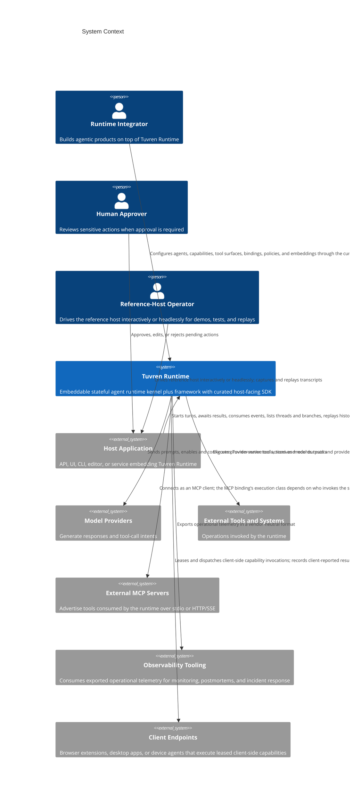
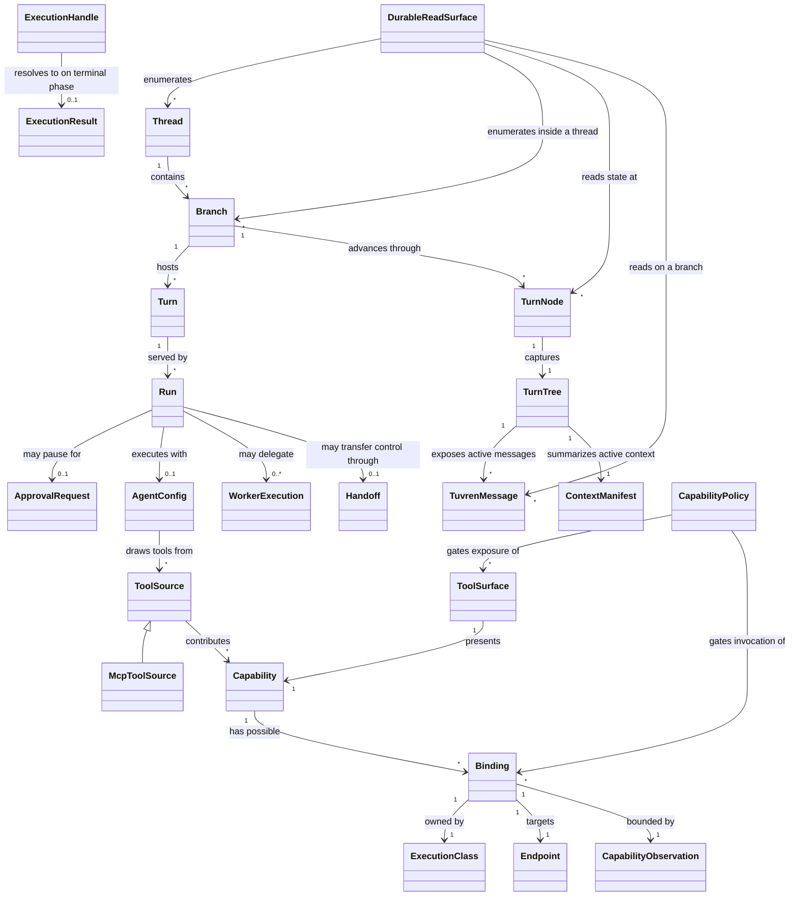

# Product Requirements Document

## 0. Version History & Changelog

- v0.9.0 - Reframed the product as a cross-provider capability orchestration runtime rather than a single tool executor: separated the model-facing Tool Surface from the underlying Capability, recognized four execution classes (provider-native, provider-mediated developer-provided, Tuvren-server, Tuvren-client) with distinct execution/state/credential/observability/control ownership, introduced Bindings, Endpoints, exposure-time and invocation-time Policy, and per-class Observation limits, classified MCP as a binding mechanism rather than an execution class, and recorded the conceptual invariant that every model-visible tool call resolves to a policy-checked capability invocation against a known execution class. Added the Capability Orchestration and Execution Classes epic (CAP-P0-056 through CAP-P1-063), glossary terms, scope distinctions, prohibited patterns, and boundary-analysis items; preserved every existing tool, approval, secret-isolation, and telemetry guarantee (today's developer-defined runtime-executed tool is the Tuvren-server execution class). Implementation is captured as the active Tooling block (Epics AW–BC) in Tasks.md, sequenced ahead of the trust block (Epic BD) and the productionization roadmap (Epics BE–BI).
- v0.8.0 - Promoted production-trust commitments to first-class product scope: durability and crash-recovery guarantees that are verified under fault injection (resume-or-fail-clean with no partial or corrupt lineage), a first-class operational observability and telemetry surface with optional vendor-neutral export, and explicit execution-safety and trust-boundary controls (untrusted MCP and tool inputs, non-bypassable approval enforcement, bounded execution against runaway loops and resource exhaustion, and credential isolation from durable state, telemetry, and transcripts). Recorded the near-term strategic direction (host adoption plus first-party dogfooding, with multi-language parity preserved but deprioritized) and a named post-trust-block roadmap as deferred planning.
- v0.7.0 - Promoted host-developer ergonomics, single-tenant durable-read surface, kernel-level thread enumeration, unified handle terminal-value surface, schema-agnostic tool authoring, MCP client integration, headless reference-host mode, transcript persistence, and consolidated curated SDK package layout to in-scope product capabilities; retired the playground host and the split contract packages.
- ... [Older history truncated, refer to git logs]

## 1. Executive Summary & Target Archetype

- **Target Archetype:** Embeddable stateful agent and workflow runtime kernel plus driver-oriented framework/SDK
- **Vision:** Tuvren Runtime becomes a trustworthy substrate for building long-lived agent systems whose progress, state transitions, interruptions, and control transfers remain durable, inspectable, and recoverable instead of opaque and fragile, and whose host-developer surface is ergonomic enough that serious operator-facing products can be built directly on the SDK without private shortcuts.
- **Problem:** Existing agent runtimes often make state continuity, tool execution, pause/resume, context shaping, and multi-agent control feel incidental or ad hoc, while many workflow systems hard-code one execution style as if it were the whole product. Equally, even when their underlying engines are sound, their host-developer surfaces force every consumer to compose low-level primitives, hand-roll terminal-value handling, reach around the SDK to read durable state, or commit to a single tool-authoring style. That makes long-running agent work hard to audit, hard to recover after interruption, hard to govern, hard to adapt cleanly across different execution models, and hard to build a credible product on without leaking implementation accidents into every host.
- **Jobs to Be Done:** Enable a builder to run durable agent or workflow execution with explicit history; let a host observe and steer execution safely; let a system execute tools, approvals, and handoffs without losing continuity; let downstream teams reason about what happened, why it happened, and how to resume, redirect, or swap execution strategy without discarding the shared runtime foundation; let a host developer assemble a serious operator-facing product (CLI, IDE integration, web console, ambient agent runner) from one curated SDK entrypoint without bypassing the host-facing boundary; and let a host inspect, list, and replay its own durable state without coupling to kernel internals.

### 1.1 Product Posture

- Tuvren is the company brand, Tuvren Runtime is the runtime product, and Kraken is the engine identity behind it.
- Tuvren Runtime must treat durable state continuity as a first-class product outcome, not an implementation detail.
- Tuvren Runtime must separate low-level runtime mechanism from higher-level execution policy so that the product can stay stable while agent and workflow behaviors evolve.
- Tuvren Runtime must be host-embeddable. The product serves applications, services, CLIs, and protocol adapters rather than replacing them.
- Tuvren Runtime must support a shared runtime foundation that can host more than one execution driver over time rather than treating one agent loop as the entire product ontology.
- Tuvren Runtime must preserve a language-neutral semantic core so future implementations can share one runtime meaning without turning the first TypeScript line into the permanent oracle.
- Tuvren Runtime must enforce that cross-implementation meaning lives in boundary-owned machine-readable authority and executable evidence rather than in any single implementation language, runner codebase, or human-prose document.
- The first product-depth implementation line must prove the SDK through a serious REPL-style reference host that exercises the runtime end to end without relying on private-only shortcuts that other hosts cannot use.
- Documented core runtime surfaces are expected to become real product scope for the first product-depth implementation line; long-lived deferral is reserved for ecosystem expansion or integrations that inherently depend on external SDK ecosystems.
- Every in-scope runtime feature defined by the project’s semantic docs is intended to be portable across implementation lines unless it exists only as an adapter to an external SDK or ecosystem-specific protocol.
- Host-developer ergonomics are a first-class product outcome on equal footing with semantic correctness. A curated host-facing SDK boundary, a batteries-included entrypoint, schema-agnostic tool authoring, and a first-party tool ecosystem surface are part of the product, not a courtesy facade.
- Single-tenant durable state must be inspectable, enumerable, and replayable through the host-facing SDK rather than through private kernel access; the first-party reference host must not need any seam that downstream hosts cannot also use.
- Production trustworthiness is a first-class product outcome on equal footing with semantic correctness and host-developer ergonomics: the durability and recovery promises must be demonstrably true under failure, the runtime must be observable enough to operate and debug in production, and untrusted edges must be governed rather than implicitly trusted.
- Tuvren Runtime is a cross-provider capability orchestration runtime, not only a tool executor. It decides which tool surfaces are exposed to a model, which capabilities back them, where execution authority lives, which policies apply before exposure and before invocation, and what it can observe, persist, resume, cancel, retry, or audit.
- Tuvren Runtime must distinguish the model-facing Tool Surface from the underlying Capability, and must represent the execution class that owns each capability invocation rather than treating every tool as a locally executed developer function.
- Tuvren Runtime must never imply stronger control than the execution class actually grants; provider-owned and client-owned invocations are represented as known capabilities with explicit observation and control limits.

### 1.2 Success Criteria

- A builder can embed Tuvren Runtime as the execution substrate for an agentic product without having to invent custom persistence, pause/resume, or recovery semantics.
- A host can observe execution in real time and still rely on a durable post hoc history of what was committed.
- A human supervisor can interrupt, approve, reject, or resume sensitive work without corrupting the execution lineage.
- A multi-agent workflow can delegate, hand off, and continue work while preserving traceability and avoiding ambiguous control transfer.
- A host application developer can build a serious operator-facing host from the same high-level SDK surface used by the first-party reference host rather than depending on private runtime seams.
- A host application developer can issue a first Turn from one batteries-included entrypoint without composing kernel, backend, driver registry, and runtime factories by hand, while retaining the ability to swap any of those substrates when product needs require it.
- A host application developer can author tools using Zod, Standard Schema, or wrapped JSON Schema with type inference flowing into the execute callback, and can also pass raw JSON Schema at the contract boundary without breaking compatibility.
- A host application developer can attach external Model Context Protocol servers (stdio or HTTP/SSE) as first-class tool sources without writing a bespoke bridge.
- A host application developer can list the threads owned by the runtime, list branches inside a thread, read the state at any TurnNode, walk turn history with a cursor, and read durable messages on a branch through the host-facing SDK alone.
- A first-party reference host proves durable threads, branching, streaming, approvals, steering, orchestration, extension behavior, and persistence as one coherent operator experience, in both an interactive readline mode and a headless stdin-driven mode, while reading durable state exclusively through the host-facing SDK.
- A test author or operations script can drive the reference host headlessly through stdin and capture an on-disk transcript that can later be replayed for postmortems or regressions.
- A runtime maintainer can introduce a new implementation language against shared contracts and behavioral fixtures without redefining the product’s semantic model.
- A runtime maintainer can build and judge a new implementation strictly from boundary-owned machine authority, generated artifacts, executable conformance evidence, and language-binding adapters, without reading another language's implementation, a generic runner's source code, or a Markdown document as the source of cross-language truth.
- A builder can trust that when a process is interrupted mid-turn, the runtime either resumes the unfinished work from the last durable checkpoint or fails cleanly, and never leaves partial or corrupt lineage; this guarantee is backed by reproducible failure-injection evidence rather than asserted by design alone.
- An operator can observe and reconstruct what a turn did — model interactions, tool calls, checkpoints, approvals, and recovery events — through a first-class telemetry surface, and can export that telemetry to standard tooling without coupling to runtime internals.
- A host can connect untrusted external tool sources and run sensitive tool work while trusting that inputs are validated, approval gates cannot be bypassed, runaway loops and resource exhaustion are bounded, and provider credentials never leak into durable state, telemetry, or transcripts.
- A builder can expose the same logical capability (for example search or code execution) through different execution classes — provider-native, Tuvren-server, provider-mediated, or client-side — and trust that the runtime applies policy before exposure and before invocation, resolves each model-visible call to a known execution class, and represents honestly what it can observe, persist, resume, cancel, retry, or audit for that class.

### 1.3 Scope Distinctions That Must Remain Stable

- **Semantic turn vs. execution run:** A user-visible turn may span more than one execution run when approval or recovery interrupts work.
- **Delegation vs. handoff:** Workers perform subordinate tasks and return results; handoffs transfer active control to another agent.
- **History preservation vs. active context shaping:** The active working context may be reduced or rewritten, but previously committed history remains recoverable.
- **Host control vs. runtime execution:** The host initiates, observes, and influences execution, but the runtime remains responsible for the execution lifecycle itself.
- **Framework vs. driver:** The framework supplies shared runtime services and contracts, while a driver defines one concrete execution model built on that shared foundation.
- **Machine authority vs. implementation projection:** Cross-implementation meaning lives in boundary-owned machine authority and executable evidence; an implementation language, generic runner codebase, or human-prose document is a projection of that authority and is never the source of cross-language truth.
- **Single-tenant durable reads vs. cross-tenant discovery:** Listing, reading, and replaying state for the runtime instance the host owns is a host-facing SDK capability; cross-tenant search, multi-tenant access control, and full-text indexed querying are deferred to a future hosted/server projection and are not part of the embeddable SDK.
- **SDK ergonomics vs. semantic correctness:** A curated host-facing surface, batteries-included composition, type-inferring helpers, and re-exported primitives are product responsibilities; they are not a substitute for the underlying semantic contracts, and they must not silently weaken any guarantee the boundary contracts make.
- **Authoring style vs. boundary contract:** Tool authoring may use Zod, Standard Schema, wrapped JSON Schema, or future schema adapters; the boundary contract still accepts raw JSON Schema and a `CustomSchema` interop shape. Authoring helpers add type inference and ergonomic defaults without narrowing what is legal at the contract seam.
- **Tool surface vs. capability:** The model-facing tool surface (what the model may see and call) is distinct from the underlying capability (the authority to perform an action); one capability may back several surfaces and one surface may resolve to different capabilities across providers and contexts.
- **Execution class vs. tool source:** The execution class names who owns a capability invocation — provider-native, provider-mediated developer-provided, Tuvren-server, or Tuvren-client — and is not the same as the tool source or the protocol used to reach the tool.
- **MCP as binding vs. execution class:** The Model Context Protocol is a binding/protocol mechanism that can appear under provider-mediated, Tuvren-server, or Tuvren-client execution; it is classified by who invokes or runs the MCP server, not treated as a top-level execution class.
- **Provider-native tools vs. local functions:** Provider-native tools are configured and exposed by Tuvren and executed by the provider; they are not modeled as locally executable functions, and Tuvren records only provider-exposed events and results for them.
- **Tuvren-client capabilities vs. server functions:** Client-side capabilities are leased endpoint capabilities executed in a client environment that may hold authority the server does not; they are not ordinary server functions and carry availability, lease, staleness, and partial-observability properties.

### 1.4 Strategic Direction (Near-Term)

The documented v1 runtime surface is functionally complete in the first implementation line. The near-term product goal is therefore not new runtime surface area but **trustworthiness and adoption**: making Tuvren Runtime something both its own maintainers and external host developers will build real products on.

- **Primary goal:** external host adoption combined with first-party dogfooding. Both audiences need the same thing first — a runtime whose durability, recovery, observability, and trust-boundary promises are demonstrably true.
- **Deprioritized (not abandoned):** multi-language implementation parity as an architectural showcase. The language-neutral semantic posture and authority discipline remain non-negotiable, but a second full implementation line is explicitly below adoption and dogfooding in priority.
- **Active scope:** the production-trust capabilities and constraints introduced in this revision (durability-under-failure verification, operational observability, and execution-safety / trust-boundary controls).
- **Deferred post-trust roadmap themes (to be planned in a later session, recorded in `Tasks.md` deferred scope):** performance characterization with regression budgets; public SDK API-stability guarantees and package publication; documentation and onboarding for external adopters; and a first-party reference application that dogfoods the SDK end to end. These themes are captured so a future planning session inherits clear focus; they are intentionally not decomposed into tickets yet.

## 2. Ubiquitous Language (Glossary)

| Term                | Definition                                                                                                                                   | Do Not Use                             |
| ------------------- | -------------------------------------------------------------------------------------------------------------------------------------------- | -------------------------------------- |
| Tuvren Runtime      | The overall product surface that enables durable, stateful agent execution and orchestration.                                                | engine, bot framework, wrapper         |
| Kernel              | The mechanism-focused layer that owns durable storage, structural state, lineage, and recovery primitives.                                   | framework core, agent brain            |
| Framework           | The shared runtime layer built on the kernel that provides common contracts, services, and integration surfaces used by one or more drivers. | kernel, single agent loop              |
| Driver              | A concrete execution model built on the shared framework and kernel primitives.                                                              | workflow preset, implementation detail |
| ReAct Driver        | The initial Kraken driver centered on iterative model reasoning, tool use, and runtime feedback within one ongoing turn.                     | the whole framework, generic agent     |
| Thread              | The long-lived container for one continuing line of work or conversation.                                                                    | session log, chat room                 |
| Branch              | A named continuation within a thread representing one active path through history.                                                           | forked chat, duplicate thread          |
| Turn                | One user-visible interaction span within a thread.                                                                                           | step, request packet                   |
| Run                 | One concrete execution attempt serving part or all of a turn.                                                                                | turn, transaction                      |
| Step                | A declared unit of work inside a run boundary.                                                                                               | callback, stage magic                  |
| TurnNode            | A durable checkpoint in execution history that captures resulting state and lineage.                                                         | savepoint, mutable snapshot            |
| TurnTree            | The structured runtime state visible at a TurnNode.                                                                                          | cache blob, transcript only            |
| Staged Result       | Durable work product recorded before it is committed into history.                                                                           | temp output, ephemeral result          |
| Context Manifest    | The lightweight structural index used to reason about active context without rescanning full history.                                        | summary, prompt cache                  |
| Context Engineering | Intentional reshaping of active context while preserving historical auditability.                                                            | deleting history, prompt trimming      |
| Structured Output   | Assistant-authored schema-constrained data produced as content, not as a tool call or side effect.                                           | JSON mode, fake tool call              |
| Steering            | Host-supplied user input injected between iterations of a running turn.                                                                      | cancel, edit-in-place                  |
| Approval            | Human review required before executing one or more sensitive tool actions.                                                                   | pause forever, manual override only    |
| Extension           | A composable policy or behavior unit that can observe, influence, or wrap execution.                                                         | plugin blob, middleware soup           |
| Handoff             | A controlled transfer of active execution responsibility from one agent configuration to another.                                            | worker result, tool call               |
| Worker              | A subordinate agent execution used to perform delegated work and return results.                                                             | handoff, branch clone                  |
| ExecutionHandle     | The host-facing control surface for consuming events, awaiting a terminal value, and issuing runtime controls.                               | adapter, transport                     |
| Execution Result    | The terminal-value surface a host receives when an execution reaches a completed or failed phase.                                            | last event, raw status                 |
| Batteries-Included Entrypoint | The single curated factory that assembles kernel, backend, driver registry, and runtime so a host can issue a Turn without composing lower-level primitives by hand.            | helper, scaffold              |
| Durable-Read Surface | The host-facing SDK capability set that lists threads, lists branches, reads state at a TurnNode, walks turn history, and reads durable messages on a branch.                  | inspector, internal API       |
| Schema Adapter      | A normalization wrapper that lets the tool-authoring helper accept Zod, Standard Schema, wrapped JSON Schema, or future schema kinds while preserving type inference and provider-wire JSON Schema. | validator, schema lib                |
| MCP Tool Source     | A first-class tool source that connects to an external Model Context Protocol server and exposes its tools as Tuvren tool definitions.        | bridge, proxy                          |
| Headless Host Mode  | The non-interactive operating mode of the reference host that consumes line-delimited input on stdin and emits structured output, intended for tests and scripts.              | daemon, server               |
| Transcript          | A durable on-disk capture of a reference-host session that can later be replayed for postmortems or regression tests.                         | log file, history dump                 |
| Curated SDK Surface | The single host-facing SDK boundary composed of `@tuvren/core` (subpath-exported primitives) and `@tuvren/runtime` (slim convenience entrypoint), with leaf packages peer-depending on `@tuvren/core` for version-skew safety. | barrel, megapackage         |
| Authority Packet    | A boundary-owned bundle that names the machine-readable sources, generated artifacts, conformance evidence, and binding projections that together carry one cross-implementation semantic surface.       | spec doc, README, schema folder        |
| Conformance Plan    | An executable, data-owned description of the named semantic checks, fixtures, scenarios, assertions, and required evidence that an implementation must satisfy for a given authority packet.             | test suite, runner script              |
| Implementation Adapter | The language-specific seam that exposes a particular implementation to a generic conformance runner over a neutral operation, event, cancellation, error, and state-inspection surface.                | bespoke test harness, fixture loader   |
| Generic Runner      | An implementation-agnostic process that consumes a conformance plan plus an implementation adapter and produces evidence; never the home of product semantics itself.                                    | reference implementation, oracle test  |
| Operational Telemetry | The first-class, structured, correlated record of what a turn did (model interactions, tool calls, checkpoints, approvals, recovery events, errors), keyed to runtime lineage concepts, used for operating and debugging the runtime in production and distinct from the real-time host event stream. | logs, metrics blob, the event stream |
| Execution Bound     | A configured limit on a single turn's iterations, tool calls, or resource consumption that, when reached, makes the runtime stop safely and surface the outcome rather than looping or exhausting resources. | timeout hack, kill switch |
| Secret Isolation    | The guarantee that sensitive credentials and provider secrets used transiently during execution never reach durable history, operational telemetry, or transcripts. | redaction afterthought, masking only |
| Capability Orchestration | The runtime responsibility of deciding which tool surfaces are exposed to a model, which capabilities back them, which execution class and endpoint owns each invocation, which policies apply before exposure and before invocation, and what the runtime can observe or control for that invocation. | tool executor, plugin manager |
| Tool Surface        | The model-facing representation of a capability: the name, description, schema, and provider-specific rendering constraints that determine what the model may see and call. | tool, function spec |
| Capability          | The underlying authority to perform an action (for example web.search, code.execute, crm.contact.lookup), independent of how it is surfaced to a model or who executes it. | tool, skill |
| Execution Class     | The execution-ownership category for a capability invocation: provider-native, provider-mediated developer-provided, Tuvren-server, or Tuvren-client. Each class has distinct execution, state, credential, observability, and control ownership. | tool type, origin flag |
| Binding             | The relationship that ties a capability to a specific execution class and endpoint in a given context, answering where and by whom the capability is executed. | route, adapter |
| Endpoint            | The concrete execution target for a binding: provider runtime, a Tuvren host/server/worker/sandbox, a client endpoint, or a local or remote MCP server. | server, transport |
| Capability Policy   | The rules that decide whether a tool surface may be exposed and whether a capability may be invoked, covering provider/model compatibility, permissions, approval, data residency, endpoint availability, presence, credential boundaries, idempotency/retry, and risk classification. | guard, config flag |
| Capability Observation | The level of visibility the runtime has into an invocation — what it can know, persist, resume, cancel, retry, or audit — which differs by execution class. | log level, trace |

## 3. Actors & Personas

### 3.1 Primary Actor

- **Role:** Runtime Integrator
- **Context:** Builds an agentic product, platform feature, internal tool, or service that needs durable execution rather than one-shot prompting.
- **Goals:** Embed a runtime that can preserve state, recover progress, govern tool execution, manage context growth, and support advanced agent patterns without bespoke infrastructure.
- **Frictions:** Existing agent tooling often hides execution state, couples behavior to vendor specifics, loses progress on failure, and makes pause/resume or multi-agent control feel improvised.

### 3.2 Host Application Developer

- **Role:** Host Application Developer
- **Context:** Exposes Tuvren Runtime through an API, UI, CLI, editor integration, or protocol bridge. Builds an operator-facing product (for example an IDE coding agent, a CLI assistant, an ambient agent runner, or a web console) on top of the host-facing SDK and expects to reach a working first Turn within minutes, list and inspect threads owned by the runtime, replay past sessions, and connect external Model Context Protocol servers without writing bespoke adapters.
- **Goals:** Start turns, consume streamed events, await terminal values, inject steering, route approvals, surface execution status, list threads and branches the host owns, read state at any TurnNode, replay past sessions, and connect external tool servers without owning the runtime semantics.
- **Frictions:** Needs one batteries-included entrypoint instead of composing five low-level factories; needs a uniform terminal-value surface instead of hand-rolling completion detection from event streams; needs first-party durable reads instead of reaching around the SDK into kernel internals; needs to keep schema-authoring choices open (Zod, Standard Schema, raw JSON Schema) rather than being forced into one validator; needs first-class MCP support to access the existing tool ecosystem.

### 3.3 Extension and Tool Author

- **Role:** Extension and Tool Author
- **Context:** Adds cross-cutting policy, observability, gating, or domain-specific tool behavior around agent execution.
- **Goals:** Intervene in execution predictably, add tools cleanly, express approvals or policy decisions without breaking runtime guarantees, and author tools using their preferred schema toolkit while still getting type inference for the execute callback's input.
- **Frictions:** Ad hoc hook systems are easy to misuse and often blur durable behavior with ephemeral wrappers; tool-authoring surfaces that force one validator narrow the ecosystem and lose type inference whenever the host's chosen toolkit differs.

### 3.4 Human Approver or Supervisor

- **Role:** Human Approver or Supervisor
- **Context:** Must review sensitive or consequential actions while the agent is mid-turn.
- **Goals:** Understand what the runtime is asking to do, approve or reject safely, and resume work without duplicated or lost side effects.
- **Frictions:** Approval systems often lack durable continuity, forcing operators to choose between safety and productivity.

### 3.5 Multi-Agent Workflow Designer

- **Role:** Multi-Agent Workflow Designer
- **Context:** Coordinates specialists, workers, or pipelines that need to share responsibility without collapsing traceability.
- **Goals:** Delegate subtasks, hand off control, forward worker signals, and preserve execution lineage across agent boundaries.
- **Frictions:** Many systems conflate delegation with transfer of control or make multi-agent behavior impossible to inspect after the fact.

### 3.6 Runtime Implementation Maintainer

- **Role:** Runtime Implementation Maintainer
- **Context:** Must extend or maintain Tuvren Runtime in a new language, runtime, or process boundary without weakening the kernel/framework semantics already promised to hosts and builders.
- **Goals:** Consume stable contracts, prove behavior against shared fixtures, preserve observability and compatibility signals, and add new implementation lines without creating a shadow specification.
- **Frictions:** Ports often drift into rewrites, language-specific toolchains often leak into semantic boundaries, and shared behavior usually becomes folklore unless parity is enforced mechanically.

### 3.7 Reference-Host Operator and Test Author

- **Role:** Reference-Host Operator and Test Author
- **Context:** Uses the first-party reference host to exercise, demo, debug, or regression-test the runtime end to end, either at the interactive REPL or as a headless stdin-driven process inside CI, evaluation suites, or operations scripts.
- **Goals:** Drive the runtime through every host-facing capability the SDK exposes, capture on-disk transcripts of meaningful sessions, replay those transcripts for postmortems and regressions, and trust that everything the reference host can do is achievable by any downstream host through the same SDK.
- **Frictions:** Interactive-only tooling is hard to embed in CI; transcript-less debugging is fragile; reference hosts that pierce private seams give false confidence about what downstream products can build.

### 3.8 Capability and Endpoint Integrator

- **Role:** Capability and Endpoint Integrator
- **Context:** Configures which capabilities a runtime instance may use, how they are surfaced to models, and where they execute — enabling provider-native tools, configuring provider-mediated tools, registering Tuvren-server capabilities, and attaching client endpoints.
- **Goals:** Expose the right tool surfaces per provider and model; choose or allow the execution class and endpoint for each capability; apply exposure and invocation policy; and rely on honest per-class observation and control limits rather than assuming uniform runtime control.
- **Frictions:** A single tool abstraction hides who executes, who owns state, who owns credentials, who can cancel or retry, and what is observable; forcing provider-native, provider-mediated, server-side, and client-side capabilities into one shape makes runtime behavior unsafe to reason about.

## 4. Functional Capabilities

### Epic: Durable Stateful Runtime Foundation

- **Priority:** P0
- **Capability ID:** CAP-P0-001
- **Capability:** The product must preserve agent execution as durable, inspectable state transitions rather than as only transient in-memory flow.
- **Rationale:** Long-running or interrupted agent work is only trustworthy if progress survives failures and can be audited.

- **Priority:** P0
- **Capability ID:** CAP-P0-002
- **Capability:** The product must maintain explicit lineage for each thread of work so builders can understand how the current state was reached and what prior states remain recoverable.
- **Rationale:** Stateful agent systems need trustworthy continuity, rollback, and auditability.

- **Priority:** P0
- **Capability ID:** CAP-P0-003
- **Capability:** The product must allow active work to continue on named alternate continuations without destroying previously committed history.
- **Rationale:** Exploration, rollback, and correction require preserved prior paths rather than destructive overwrite.

- **Priority:** P0
- **Capability ID:** CAP-P0-039
- **Capability:** The product must support first-party enumeration of the threads owned by a runtime instance at the kernel-level structural boundary, with a backend-advertised capability bit so storage substrates that cannot enumerate efficiently can opt out and remain conformant.
- **Rationale:** A host application developer cannot build a serious operator-facing product (recent-threads pane, multi-thread debugger, replay UI) without listing the threads the runtime owns; the kernel already exposes branch enumeration inside a thread, and thread enumeration is the symmetric structural primitive that completes that picture without violating the mechanism-not-policy rule.

### Epic: Turn Execution and Recovery

- **Priority:** P0
- **Capability ID:** CAP-P0-004
- **Capability:** The product must execute user-visible work in turns while allowing internal execution attempts to pause, fail, resume, or restart within that turn.
- **Rationale:** Human-visible continuity and machine execution continuity are related but not identical and must both be represented.

- **Priority:** P0
- **Capability ID:** CAP-P0-005
- **Capability:** The product must recover safely after interruption by distinguishing committed progress from incomplete work and resuming only what remains unfinished.
- **Rationale:** Crash-safe recovery is a core product promise for stateful agents.

- **Priority:** P0
- **Capability ID:** CAP-P0-006
- **Capability:** The product must commit execution progress at declared boundaries so that nondeterministic or side-effecting work does not depend on best-effort memory alone.
- **Rationale:** Builders need clear trust boundaries around what is durable and what may re-execute.

### Epic: Conversational and Structural State

- **Priority:** P0
- **Capability ID:** CAP-P0-007
- **Capability:** The product must retain conversational content in natural order while also exposing sufficient structure for runtime decisions about context, control flow, and status.
- **Rationale:** Agent systems need both human-readable history and machine-readable runtime state.

- **Priority:** P0
- **Capability ID:** CAP-P0-008
- **Capability:** The product must persist execution status that reflects whether work is running, paused, completed, failed, or partially interrupted.
- **Rationale:** Hosts, operators, and orchestrators need durable visibility into active execution state.

- **Priority:** P1
- **Capability ID:** CAP-P1-009
- **Capability:** The product must preserve a compact structural summary of active context so context-management decisions can be made without full history scans.
- **Rationale:** Long-lived agent sessions become impractical if every context decision requires re-reading everything.

### Epic: Context Engineering

- **Priority:** P0
- **Capability ID:** CAP-P0-010
- **Capability:** The product must support deliberate reshaping of the active context window, including reduction, replacement, or condensation of active material, without erasing historical traceability.
- **Rationale:** Practical agent runtime use requires controlling context growth while preserving audit history.

- **Priority:** P1
- **Capability ID:** CAP-P1-011
- **Capability:** The product must allow context engineering to operate as an explicit runtime action with visible consequences to subsequent execution.
- **Rationale:** Hidden or implicit context mutation makes agent behavior hard to explain and debug.

### Epic: Model and Tool Interaction

- **Priority:** P0
- **Capability ID:** CAP-P0-012
- **Capability:** The product must normalize model outputs into a canonical internal representation of conversational content, reasoning content, structured output, tool calls, tool results, and file-like payloads.
- **Rationale:** Builders need one stable runtime model even when upstream model providers differ.

- **Priority:** P0
- **Capability ID:** CAP-P0-013
- **Capability:** The product must execute requested tools, capture their results durably, and feed those results back into subsequent agent reasoning as part of the ongoing turn.
- **Rationale:** Tool execution is a core part of practical agent behavior and must be a first-class runtime concern.

- **Priority:** P0
- **Capability ID:** CAP-P0-014
- **Capability:** The product must preserve partial progress within a tool batch so completed tool work is not needlessly repeated after interruption.
- **Rationale:** Batch execution without partial durability produces duplicated side effects and wasted work.

- **Priority:** P1
- **Capability ID:** CAP-P1-015
- **Capability:** The product must validate tool inputs against declared contracts before execution and surface failures as agent-visible results rather than silent runtime corruption.
- **Rationale:** Tooling reliability depends on explicit validation and recoverable failure semantics.

- **Priority:** P0
- **Capability ID:** CAP-P0-040
- **Capability:** The product must offer a tool-authoring helper that accepts multiple schema authoring styles (Zod v3 and v4, Standard Schema-compliant schemas, and wrapped JSON Schema) without locking the host into one validator, while preserving strict TypeScript inference for the execute callback's input parameter and continuing to accept raw JSON Schema and the existing `CustomSchema` interop shape at the boundary contract.
- **Rationale:** A tool ecosystem that forces one validator narrows adoption, loses type inference whenever the host's chosen toolkit differs, and contradicts the product posture that ergonomics is a first-class outcome; the boundary contract must remain stable for portability, but the authoring helper is where the SDK earns its DX.

- **Priority:** P0
- **Capability ID:** CAP-P0-041
- **Capability:** The product must integrate with the Model Context Protocol as a first-class tool source, allowing a host to connect to any MCP server over stdio or HTTP/SSE and consume its advertised tools as Tuvren tool definitions without writing a bespoke bridge.
- **Rationale:** MCP is the emerging standard for AI tool ecosystems in 2026; a runtime claiming to rival LangChain/LangGraph cannot ignore the most active tool-ecosystem surface without forcing every host to write its own MCP adapter.

### Epic: Capability Orchestration and Execution Classes

- **Priority:** P0
- **Capability ID:** CAP-P0-056
- **Capability:** The product must separate the model-facing tool surface (what the model may see and call) from the underlying capability (the authority to perform an action), so that one capability can back multiple surfaces and one surface can resolve to different capabilities across providers and contexts.
- **Rationale:** A single `name + description + schema + execute` shape only describes a developer-defined function executed locally; it cannot honestly represent capabilities the provider executes, capabilities a provider invokes against a developer endpoint, or capabilities a client environment executes.

- **Priority:** P0
- **Capability ID:** CAP-P0-057
- **Capability:** The product must recognize four execution classes — provider-native, provider-mediated developer-provided, Tuvren-server, and Tuvren-client — each with distinct ownership of execution, state, credentials, observability, and control, and must not model all of them as locally executed functions.
- **Rationale:** These classes differ in who executes, who owns state, who owns credentials, who sees intermediate steps, who can cancel, retry, or audit, who pays, where data is processed, and whether behavior is portable; collapsing them into one abstraction makes runtime behavior unsafe to reason about.

- **Priority:** P0
- **Capability ID:** CAP-P0-058
- **Capability:** The product must resolve every model-visible tool call to a policy-checked capability invocation against a known execution class; provider-native invocations are the only case where the provider owns execution, and they must still be represented as known provider-native capabilities with explicit observation and control limits.
- **Rationale:** This invariant keeps the runtime honest: there is no untyped, unclassified tool call, and the runtime never silently assumes control it does not have.

- **Priority:** P0
- **Capability ID:** CAP-P0-059
- **Capability:** The product must bind a capability to a specific execution class and endpoint based on provider, model, policy, endpoint availability, and product configuration, and must allow one logical capability to have multiple possible bindings.
- **Rationale:** The same logical capability (for example search or code execution) may be served provider-native, Tuvren-server, provider-mediated, or client-side; the runtime must select or allow the binding rather than hard-coding one execution owner.

- **Priority:** P0
- **Capability ID:** CAP-P0-060
- **Capability:** The product must apply policy at two distinct decision points — before a tool surface is exposed to a model, and before a capability is invoked — covering at least provider/model compatibility, user and organization permissions, approval requirements, data-residency restrictions, active-endpoint requirements, user-presence requirements, credential boundaries, idempotency and retry behavior, and risk classification.
- **Rationale:** Exposure and invocation are different trust decisions; conflating them hides whether a capability was withheld from the model or merely blocked at call time.

- **Priority:** P0
- **Capability ID:** CAP-P0-061
- **Capability:** The product must bound and represent, per execution class, what it can observe, persist, resume, cancel, retry, and audit, and must distinguish runtime events that represent provider-native invocations from events that represent Tuvren-owned invocations.
- **Rationale:** Observation differs by execution class; the runtime must record provider-exposed events for provider-owned work and full-lifecycle events for Tuvren-owned work without overstating visibility.

- **Priority:** P1
- **Capability ID:** CAP-P1-062
- **Capability:** The product must treat the Model Context Protocol as a binding mechanism that can appear under provider-mediated, Tuvren-server, or Tuvren-client execution, classified by who invokes or runs the MCP server, rather than as a top-level execution class.
- **Rationale:** MCP is a protocol, not an execution owner; the same MCP server may be invoked by a provider, by Tuvren server-side, or by a client endpoint, with different observability and control in each case.

- **Priority:** P1
- **Capability ID:** CAP-P1-063
- **Capability:** The product must orchestrate Tuvren-client capabilities as leased endpoint capabilities, accounting for client availability, leases, stale endpoint responses, and partial observability, rather than as ordinary server functions.
- **Rationale:** Client environments may hold authority the server does not and should not hold; the runtime owns orchestration and policy while the client endpoint owns environmental execution.

### Epic: Human-in-the-Loop Governance

- **Priority:** P0
- **Capability ID:** CAP-P0-016
- **Capability:** The product must support approval-gated tool execution, including partial completion before pause and exact continuation after a human decision.
- **Rationale:** Real-world agent systems need governed execution for sensitive operations.

- **Priority:** P0
- **Capability ID:** CAP-P0-017
- **Capability:** The product must let a host provide approval decisions that approve, edit, reject, or otherwise resolve pending tool work without requiring a new conversational turn.
- **Rationale:** Approval resolution is operational control, not ordinary user chat.

- **Priority:** P1
- **Capability ID:** CAP-P1-018
- **Capability:** The product must make approval state visible to hosts and operators in a structured way that explains what is pending and what has already completed.
- **Rationale:** Effective human supervision requires clarity, not implicit pause states.

### Epic: Host Control and Streaming Observability

- **Priority:** P0
- **Capability ID:** CAP-P0-019
- **Capability:** The product must expose a host control surface that can start execution, stream runtime events, cancel work, inject steering, and resolve approvals.
- **Rationale:** Tuvren Runtime is meant to be embedded into host systems, so the host contract is part of the product, not a side detail.

- **Priority:** P0
- **Capability ID:** CAP-P0-020
- **Capability:** The product must emit a canonical stream of lifecycle, model, tool, control, and error events that downstream adapters can translate into other protocols.
- **Rationale:** Hosts and UIs need real-time insight into execution without coupling to provider-specific event shapes.

- **Priority:** P1
- **Capability ID:** CAP-P1-021
- **Capability:** The product must support both streaming and non-streaming model integrations while preserving a consistent outward event vocabulary.
- **Rationale:** Builders should not need separate host integrations for different provider transport modes.

- **Priority:** P1
- **Capability ID:** CAP-P1-022
- **Capability:** The product must support non-destructive steering that injects user intent between iterations of a running turn.
- **Rationale:** Hosts need a way to redirect active work without discarding committed progress.

- **Priority:** P0
- **Capability ID:** CAP-P0-042
- **Capability:** The product must expose a unified terminal-value surface on every execution handle so that a host can await an execution's completion as a single promise resolving to a structured execution result, without having to derive completion from raw event iteration or status polling. The same surface must exist on both single-turn execution handles and orchestration handles.
- **Rationale:** Every serious host treats "await this turn's final value" as a primitive; today only orchestration handles expose it, forcing single-turn hosts to hand-roll the same plumbing the reference host already wrote internally.

### Epic: Single-Tenant Durable-Read Surface

- **Priority:** P0
- **Capability ID:** CAP-P0-043
- **Capability:** The product must let a host list the threads owned by the runtime instance it is operating, with cursor-based pagination and optional filters, through the host-facing SDK alone.
- **Rationale:** A serious operator-facing product needs a recent-threads or thread-picker surface; today the host cannot list threads at all, which forces it either to maintain a parallel index or to pierce kernel internals.

- **Priority:** P0
- **Capability ID:** CAP-P0-044
- **Capability:** The product must let a host list the branches that exist within a thread it owns through the host-facing SDK.
- **Rationale:** Branching is a first-party kernel concept; the host cannot reason about exploratory paths or rollback positions without enumerating them, and the kernel already supports the underlying structural enumeration.

- **Priority:** P0
- **Capability ID:** CAP-P0-045
- **Capability:** The product must let a host read the structured runtime state at any specific TurnNode of a branch it owns through the host-facing SDK.
- **Rationale:** Debugging, replay, and time-travel inspection all require reading the exact state at a chosen turn, not only the current head.

- **Priority:** P0
- **Capability ID:** CAP-P0-046
- **Capability:** The product must let a host walk the turn history of a branch it owns through the host-facing SDK, using a cursor that is meaningful inside the runtime's lineage model, in newest-first order, and as an async iterator that does not require loading the entire history into memory.
- **Rationale:** Conversation history scrollback and audit trails are bounded by the host's display window, not by the runtime's full lineage depth; an async-iterator cursor is the only shape that scales to long-lived threads.

- **Priority:** P0
- **Capability ID:** CAP-P0-047
- **Capability:** The product must let a host read the durable conversational messages of a branch it owns through the host-facing SDK without requiring the host to reconstruct messages from TurnTree references and the content-addressed object store by hand.
- **Rationale:** Reading "the messages on this branch" is the most common host operation; today it requires composing tree resolution, store reads, and content decoding manually, which is exactly why the reference host had to introduce a private inspector.

### Epic: Extensibility and Policy Composition

- **Priority:** P0
- **Capability ID:** CAP-P0-023
- **Capability:** The product must let builders add composable cross-cutting behaviors that can observe, influence, or wrap execution at defined lifecycle points.
- **Rationale:** Governance, telemetry, budget control, approval policy, and domain behavior should be additive rather than hard-coded into the core.

- **Priority:** P1
- **Capability ID:** CAP-P1-024
- **Capability:** The product must allow extensions to maintain their own scoped persisted state and expose declared shared outputs to other runtime participants.
- **Rationale:** Useful extensions require continuity across iterations and sometimes across agents.

- **Priority:** P1
- **Capability ID:** CAP-P1-025
- **Capability:** The product must support pluggable policies for context shaping, prompt rendering, loop continuation, and tool execution.
- **Rationale:** Different agent products need different execution policies without redefining the runtime’s core ontology.

### Epic: Driver Modularity

- **Priority:** P0
- **Capability ID:** CAP-P0-033
- **Capability:** The product must support a shared runtime foundation that can host multiple execution drivers over time rather than hard-coding one execution model as the whole framework.
- **Rationale:** Durable state, host control, provider neutrality, and orchestration primitives should be reusable across ReAct-style agents and future workflow-oriented drivers.

- **Priority:** P1
- **Capability ID:** CAP-P1-034
- **Capability:** The product must ship with one primary driver-first baseline, centered initially on a ReAct-style execution model, while keeping room for future workflow, routing, evaluator, or orchestration-focused drivers.
- **Rationale:** Tuvren Runtime needs one strong default execution path now without letting that first choice become an accidental product monopoly.

### Epic: Multi-Agent Orchestration

- **Priority:** P0
- **Capability ID:** CAP-P0-026
- **Capability:** The product must support delegated worker execution as a first-class pattern for subordinate tasks whose results return to a parent workflow.
- **Rationale:** Complex agent systems often need bounded sub-work without transferring full control.

- **Priority:** P0
- **Capability ID:** CAP-P0-027
- **Capability:** The product must support explicit handoff between agent configurations within the same ongoing work item while preserving continuity and traceability.
- **Rationale:** Specialization requires transfer of responsibility without pretending the work started over.

- **Priority:** P1
- **Capability ID:** CAP-P1-028
- **Capability:** The product must support pipeline-style agent sequences where one agent’s output becomes the next agent’s starting context.
- **Rationale:** Many multi-agent workflows are structured pipelines rather than open-ended collaboration.

- **Priority:** P1
- **Capability ID:** CAP-P1-029
- **Capability:** The product must preserve the distinction between worker execution, handoff, and sequence progression in both runtime behavior and observable events.
- **Rationale:** These patterns solve different user problems and should not collapse into one vague orchestration mechanism.

### Epic: Portability and Provider Neutrality

- **Priority:** P0
- **Capability ID:** CAP-P0-030
- **Capability:** The product must provide a provider-neutral internal model so that agent behavior does not depend on any one provider’s wire format or naming conventions.
- **Rationale:** Tuvren Runtime’s product value depends on stable internal semantics even as model ecosystems change.

- **Priority:** P1
- **Capability ID:** CAP-P1-031
- **Capability:** The product must preserve opaque provider continuity artifacts when needed for correct multi-turn operation without promoting provider-specific concepts into the core product language.
- **Rationale:** Portability requires a neutral core, but operational correctness may still depend on carrying provider-specific continuity data through the system.

- **Priority:** P1
- **Capability ID:** CAP-P1-035
- **Capability:** The product must preserve language-neutral semantic seams so future TypeScript, Rust, Go, Python, Zig, or other implementations can share one runtime meaning rather than drifting behind per-language wrappers.
- **Rationale:** Long-term portability only matters if multiple implementations can remain part of one semantic ecosystem instead of becoming parallel products.

- **Priority:** P1
- **Capability ID:** CAP-P1-036
- **Capability:** The product must let implementations prove parity through shared machine-readable contracts and behavioral fixtures instead of relying on one language codebase as the long-term oracle.
- **Rationale:** Durable multi-language portability needs executable semantic evidence, not only prose promises or reference-implementation folklore.

- **Priority:** P0
- **Capability ID:** CAP-P0-037
- **Capability:** The product must guarantee that no single implementation language, runner codebase, or human-prose document can act as the source of cross-implementation semantic truth; every binding cross-language semantic must live in a boundary-owned machine authority packet that pairs machine-readable sources with at least one executable verification path.
- **Rationale:** Multi-language portability collapses the moment a TypeScript file, Rust crate, generic runner, or Markdown specification becomes the de facto oracle, because future implementations are then forced to chase implementation accidents rather than honor a shared meaning.

- **Priority:** P1
- **Capability ID:** CAP-P1-038
- **Capability:** The product must let a new implementation be built and judged against shared meaning by inspecting only authority packets, generated artifacts, conformance plans, fixtures, language-binding adapters, and measured evidence, without reading another language's implementation source, a generic runner's hard-coded assertions, or Markdown prose as the binding semantic source.
- **Rationale:** Adding a new language line is only an honest portability claim when the work is reproducible from boundary-owned machine authority alone.

### Epic: Host Developer Ergonomics

- **Priority:** P0
- **Capability ID:** CAP-P0-048
- **Capability:** The product must expose a single batteries-included entrypoint that assembles a working runtime (kernel, backend, driver registry, framework runtime) from one curated factory call so a host developer can issue a first Turn without composing five lower-level factories, while retaining the ability to substitute any of those substrates when the host's needs require it.
- **Rationale:** First-Turn time-to-value is a measurable adoption lever; every serious agent SDK in 2026 has a one-call composition story, and the absence of one is the strongest single contributor to perceived complexity in the current host-facing surface.

- **Priority:** P0
- **Capability ID:** CAP-P0-049
- **Capability:** The product must expose one curated host-facing SDK boundary composed of a single shared-primitive package with named subpath exports and a slim convenience package that bundles the batteries-included entrypoint and the curated primitive re-exports, with all leaf packages (backends, stream adapters, drivers, provider bridges, MCP client) peer-depending on the shared-primitive package so that consumers experience a coherent SDK surface and never carry mismatched primitive versions.
- **Rationale:** The current split into multiple separately-versioned contract packages forces every consumer to depend on the right combination of five primitive packages and risks version skew between primitive packages; one shared-primitive package with subpath exports is the convergent pattern in comparable ecosystems and is the only way to ship a coherent SDK without bundle-size penalties or unsafe duplicated primitive instances.

### Epic: Reference Host Operational Ergonomics

- **Priority:** P1
- **Capability ID:** CAP-P1-050
- **Capability:** The product must expose a headless operating mode of the reference host that consumes line-delimited input on stdin and emits structured output, intended for tests, scripts, and operations tooling, sharing the same package, same command set, and same execution path as the interactive mode.
- **Rationale:** Interactive-only proving hosts cannot be exercised in CI without bespoke scaffolding; a stdin-driven mode shares all behavior with the interactive surface and gives test authors and operations scripts a single durable target.

- **Priority:** P1
- **Capability ID:** CAP-P1-051
- **Capability:** The product must allow the reference host to capture a session transcript to durable on-disk storage and to replay a captured transcript against a fresh runtime instance for postmortems and regression tests.
- **Rationale:** Debugging interactive sessions without a transcript is fragile; replayability turns one-off operator sessions into reusable regression fixtures and makes incident investigation tractable.

### Epic: Reader and Operator Clarity

- **Priority:** P1
- **Capability ID:** CAP-P1-032
- **Capability:** The product must be explainable through a stable set of canonical concepts so builders can reason about behavior without reverse-engineering implementation details.
- **Rationale:** A runtime this foundational only becomes adoptable if its conceptual model is teachable and inspectable.

### Epic: Operational Observability and Telemetry

- **Priority:** P0
- **Capability ID:** CAP-P0-052
- **Capability:** The product must expose a first-class operational telemetry surface that makes the lifecycle of a turn observable after the fact — model interactions, tool calls, checkpoints, approvals, recovery events, and errors — as structured, correlated records keyed to the runtime's own lineage concepts, distinct from the real-time host event stream and usable for operating and debugging the runtime in production.
- **Rationale:** The real-time host event stream (CAP-P0-020) serves a UI consuming a live turn; operating Tuvren in production additionally requires durable, correlatable telemetry for postmortems, performance investigation, and incident response. Without it, the durability and recovery promises cannot be observed or trusted in a running system.

- **Priority:** P1
- **Capability ID:** CAP-P1-053
- **Capability:** The product must allow operational telemetry to be exported to standard, vendor-neutral observability tooling without coupling the runtime's canonical telemetry vocabulary to any one observability vendor or wire format.
- **Rationale:** Adopters operate Tuvren inside existing observability stacks; a vendor-neutral export path is the difference between telemetry that is usable in production and telemetry that is trapped inside the runtime.

### Epic: Execution Safety and Trust Boundaries

- **Priority:** P0
- **Capability ID:** CAP-P0-054
- **Capability:** The product must enforce bounded execution so that a single turn cannot run unbounded iterations, tool calls, or resource consumption; when a configured bound is reached, the runtime must stop safely and surface the outcome as a host-visible failed result plus a live runtime-stream failure signal rather than looping or exhausting resources silently.
- **Rationale:** A runtime that hosts untrusted model output and external tools cannot be trusted in production if a misbehaving agent can loop forever or exhaust resources; bounded execution is the difference between a recoverable failure and an outage.

- **Priority:** P0
- **Capability ID:** CAP-P0-055
- **Capability:** The product must isolate sensitive credentials and provider secrets from durable state, operational telemetry, and transcripts, so that persisted history, exported observability data, and replayable transcripts never carry secrets that were only needed transiently to reach a provider or tool.
- **Rationale:** The runtime's durability, observability, and replay surfaces all persist or emit execution data; without explicit isolation, the very features that make Tuvren trustworthy would become the channel through which credentials leak.

### 4.1 Scope Notes

- The PRD intentionally treats persistence, streaming, tool dispatch, approvals, context engineering, orchestration, host-developer ergonomics, single-tenant durable reads, and the curated SDK surface as product capabilities because they materially define the user-facing value of Tuvren Runtime as a runtime.
- The initial active product line is the shared runtime foundation plus the ReAct Driver, not a commitment to implement every possible driver pattern in the first release line.
- The first product-depth implementation line is expected to prove nearly the whole documented runtime surface through a serious reference host rather than carrying large core features as indefinite “later” promises.
- This PRD does not prescribe the concrete storage engine, programming language, packaging layout, or transport stack used to implement those capabilities, except where it explicitly commits to one curated host-facing SDK boundary and to the MCP wire protocol as the supported tool-ecosystem surface.
- Long-term portability is a boundary-preservation goal, not a rewrite mandate; future implementation lines must extend the shared semantic system rather than replace it wholesale.
- The proving-host clarification of the right high-level SDK boundary that was previously deferred is now considered closed; the consolidated curated SDK surface and the batteries-included entrypoint are the v1 commitments and downstream artifacts may plan around them.
- The capability-orchestration model reframes how tools are represented without removing any existing tool capability: a developer-defined tool executed by the runtime (CAP-P0-013) is the Tuvren-server execution class, validated tool inputs (CAP-P1-015) and approval gating (CAP-P0-016/CAP-P0-017) continue to apply, and the MCP client integration (CAP-P0-041) becomes an MCP binding. Provider-native, provider-mediated, and Tuvren-client classes are additive.
- The capability-orchestration capabilities (CAP-P0-056 through CAP-P1-063) define the target model; their implementation is phased, with the core split delivered first and the deep per-class build-out (notably the Tuvren-client endpoint lifecycle and advanced policy) sequenced behind it. The PRD commits to the model; sequencing lives in the execution plan.

### 4.2 Distinction Notes

- A paused turn is not a completed turn and not a failed turn; it represents approval-gated continuation of already-started work.
- A handoff is not a worker result and not a branch creation; it is a control transfer within the same ongoing work item.
- Context engineering changes the active working set, not the fact that prior committed history still exists.
- Semantic neutrality is not toolchain neutrality; implementations may use native package and build workflows while preserving shared runtime meaning at the boundary seams.
- Authority-packet ownership is not artifact format ownership; an authority packet may pair multiple machine-readable formats (such as logical contract sources, binary grammar, transport projections, telemetry vocabulary, and conformance plans) under one boundary, but no single format silently becomes the meaning of the surface.
- A proving host is not a privileged exception to the SDK story; it exists to prove that the same host-facing abstractions are sufficient for serious downstream products, which means the proving host cannot rely on any seam that is not part of the host-facing SDK boundary.
- A durable-read surface is not a hosted discovery service; it lets a host inspect, list, and replay the state of the runtime instance it owns, but it does not provide cross-tenant search, indexed querying, or multi-tenant access control.
- A schema-authoring helper is not a boundary contract; the helper accepts richer schema shapes for type inference and ergonomics, but the boundary contract still accepts raw JSON Schema and the existing `CustomSchema` interop shape, so portability and conformance are unaffected.
- The MCP client integration is not an MCP server projection; the runtime can consume any MCP server's tools, but does not expose itself as an MCP server in v1.
- A headless mode is not a script-file interpreter; the reference host accepts line-delimited input on stdin, exactly the same input shape as the interactive mode, with no out-of-band scripting language.
- A curated SDK surface is not a megapackage; primitives live in one shared package with subpath exports, but backends, stream adapters, drivers, provider bridges, and the MCP client remain separate leaf packages that peer-depend on the shared primitives.
- Tool surface, capability, binding, and execution class are four distinct concepts: the surface is model-facing, the capability is the authority to act, the binding ties a capability to an execution class and endpoint, and the execution class names who owns the invocation.
- Exposure-time policy and invocation-time policy are distinct decisions: one decides whether the model ever sees a surface, the other decides whether a resolved capability may actually run.

## 5. Non-Functional Constraints

- **Performance:** The product must remain usable for long-lived agent sessions, and routine context-management decisions should rely on compact structural state rather than repeated full-history rescans whenever practical. Durable-read operations against a single thread or branch must scale to bounded host display windows without forcing the host to load entire history into memory at once.
- **Reliability:** The product must make committed progress durable, distinguish incomplete work from committed work, and converge safely after interruptions without ambiguous replay. An interruption at any point must resolve to one of two outcomes — the unfinished work resumes from the last durable checkpoint, or the turn fails cleanly — with no partial, torn, or corrupt lineage left behind; checkpoint commits must be atomic and lineage must remain consistent under concurrent writers. These recovery and durability guarantees must be demonstrable through reproducible fault-injection and crash-recovery evidence across every supported persistent storage substrate, plus the applicable in-process atomicity and concurrency invariants for non-persistent backends, not asserted by design alone. Headless reference-host mode and transcript replay must produce deterministic outputs for the same inputs whenever the underlying runtime is itself deterministic.
- **Security & Privacy:** Sensitive actions must be governable through approval workflows, and approval gates must be non-bypassable: work that requires approval cannot proceed without an explicit decision. Provider-specific continuity artifacts must be preserved only as required for correct operation, and sensitive credentials or secrets must be isolated from durable state, operational telemetry, and transcripts. Runtime state and event surfaces must remain inspectable enough for supervision and audit without becoming a channel for secret leakage. External MCP servers and tool inputs must be treated as untrusted boundaries: data crossing a process or network boundary must be validated and surfaced as agent-visible results rather than implicitly trusted. Execution must be bounded so that untrusted model output or tools cannot drive unbounded loops or resource exhaustion. Capabilities executed by a provider or a client environment must be represented with explicit observation and control limits; the runtime must not imply that it can cancel, retry, or audit an invocation it does not own. Credentials must remain confined to the execution edge that needs them (provider or endpoint) and must not be required by execution classes that never reach that edge.
- **Operability:** The product must be embeddable into different host surfaces, support real-time observation, and expose explicit control points for cancellation, steering, approval, and status inspection. The host-facing SDK must allow a host to inspect, list, and replay its own durable state without reaching around the SDK boundary. Beyond the real-time event stream, the runtime must expose a first-class operational telemetry surface — structured, correlated records of turns, model and tool interactions, checkpoints, approvals, and recovery events — that supports postmortems, performance investigation, and incident response, and that can be exported to standard vendor-neutral observability tooling.
- **Domain-specific Constraints:** The product must preserve a clear separation between low-level runtime mechanism and higher-level agent policy; the canonical runtime language must remain provider-neutral; history-preserving correction must be preferred over destructive overwrite; active-context reshaping must never imply that prior committed history ceased to exist; future implementation languages must prove parity against shared semantic assets rather than reinterpret the product independently; the first-party reference host must consume only the same host-facing SDK boundary that downstream hosts use; and the runtime must not collapse provider-native, provider-mediated, server-side, and client-side execution into one tool abstraction, keeping the model-facing tool surface distinct from the underlying capability.

### Prohibited Patterns

- The product must not depend on provider-native content or tool-call shapes as its canonical internal model.
- The product must not require the core runtime to call back into higher layers in order to satisfy its own durability or recovery obligations.
- The product must not treat destructive deletion of prior committed history as the normal way to correct or redirect work.
- The product must not collapse delegation, handoff, approval, and cancellation into one generic control concept.
- The product must not let any implementation language file, generic runner source file, or human-prose document act as the authoritative source of a cross-implementation semantic.
- The product must not satisfy a portability or compatibility claim through smoke success, object existence, or runner-internal assertions alone; every such claim must trace to an authority packet plus measured evidence.
- The product must not let the first-party reference host depend on any private seam that downstream hosts cannot use; durable-read needs that today justify a private inspector must instead be promoted onto the host-facing SDK boundary.
- The product must not lock tool authoring into a single schema validator; the tool-authoring helper must accept multiple schema shapes without breaking the underlying boundary contract.
- The product must not expose cross-tenant search, indexed querying, or multi-tenant access control through the embeddable SDK; those concerns belong to a separately-scoped future hosted/server projection.
- The product must not let the curated SDK surface split shared primitives into multiple separately-versioned packages; primitives ship under one shared package so leaf packages can peer-depend on a single primitive instance.
- The product must not claim crash-safe recovery or durability guarantees that are not backed by reproducible fault-injection and crash-recovery evidence; design-time assertion alone is not sufficient proof for a first-class durability promise.
- The product must not allow a single turn to run unbounded iterations, tool calls, or resource consumption without enforced limits and a safe, observable stop.
- The product must not allow approval gates to be bypassed, and must not let sensitive credentials or secrets reach durable history, operational telemetry, or transcripts.
- The product must not represent execution-class differences with a single `origin` field on a tool, nor with a rigid tool subclass taxonomy that hard-codes current deployment patterns; the model must be compositional (tool surface, capability, binding, endpoint, policy, observation).
- The product must not model provider-native tools as locally executable functions, nor model client-side capabilities as ordinary server functions.
- The product must not treat MCP as a top-level execution class; its execution class depends on who invokes or runs the MCP server.
- The product must not imply stronger observation or control over an invocation than its execution class actually grants.

## 6. Boundary Analysis

### In Scope

- A runtime kernel that preserves durable execution state, lineage, and recoverable history
- A framework layer that executes agent turns, manages iteration, and incorporates model and tool work
- A serious REPL-style reference host that proves the embeddable SDK can drive a real operator-facing agent product without private shortcuts, in both an interactive and a headless mode
- A headless operating mode for the reference host that consumes line-delimited stdin input and emits structured output
- Transcript capture and replay for reference-host sessions
- Canonical runtime representations for messages, reasoning content, structured output, tool calls, tool results, and file-like payloads
- Context engineering for active-context pruning, summarization, compaction, or replacement while preserving audit history
- Host-facing controls for event consumption, awaiting terminal values, cancellation, steering, and approval resolution
- A unified terminal-value surface on every execution handle
- A single-tenant durable-read surface on the host-facing SDK covering thread listing, branch listing, state at any TurnNode, cursor-based turn history walking, and branch-message reads
- A first-party kernel-level thread enumeration primitive with backend-advertised capability for substrates that cannot enumerate efficiently
- Human-in-the-loop approval flows for sensitive tool execution
- Extension and policy composition at defined lifecycle points
- Provider-neutral model integration with canonical streaming and non-streaming behavior
- Multi-agent orchestration patterns including workers, handoffs, and sequences
- A batteries-included host-facing SDK entrypoint that assembles kernel, backend, driver registry, and framework runtime from one curated factory call
- A consolidated curated SDK surface composed of one shared-primitive package with subpath exports and a slim convenience entrypoint, with leaf packages peer-depending on the shared primitives
- A schema-agnostic tool-authoring helper supporting Zod, Standard Schema, and wrapped JSON Schema with strict type inference while preserving raw JSON Schema and the existing `CustomSchema` interop shape at the boundary contract
- A first-class Model Context Protocol client integration that consumes external MCP servers over stdio and HTTP/SSE as tool sources
- A language-neutral semantic foundation that can support more than one implementation line over time through shared contracts, conformance artifacts, and compatibility evidence
- A boundary-owned machine authority surface where every cross-implementation semantic is anchored to authority packets, generated artifacts, conformance plans, and measured evidence rather than to any one language's implementation, runner code, or prose document
- Reproducible fault-injection and crash-recovery verification that proves the durability and recovery guarantees across every supported storage substrate
- A first-class operational telemetry surface covering turns, model and tool interactions, checkpoints, approvals, and recovery events, with an optional vendor-neutral export path
- Execution-safety controls that bound iterations, tool calls, and resource usage and stop safely when a limit is reached
- Credential and secret isolation that keeps sensitive values out of durable state, operational telemetry, and transcripts
- A capability-orchestration model that separates the model-facing tool surface from the underlying capability and binds capabilities to execution classes and endpoints
- Recognition of four execution classes — provider-native, provider-mediated developer-provided, Tuvren-server, and Tuvren-client — with distinct execution, state, credential, observability, and control ownership
- Exposure-time and invocation-time policy decisions over tool surfaces and capabilities
- Per-execution-class observation and control limits, and a runtime event distinction between provider-native and Tuvren-owned invocations
- Classification of MCP as a binding mechanism across execution classes rather than as an execution class

### Out of Scope

- A managed hosted control plane, SaaS product, or operations console
- Concrete cloud-vendor selection beyond the curated host-facing SDK boundary and the MCP wire protocol
- A UI-first showcase whose primary value is presentation rather than proving the host-building SDK
- Automatic agent discovery, agent marketplace behavior, or dynamic agent self-registration
- Cross-thread shared memory semantics beyond deliberate runtime coordination mechanisms
- Branch merge semantics for reconciling divergent histories
- Worker process scheduling, infrastructure supervision, or operating-system-level orchestration
- Garbage-collection policy for historical data or archival branches
- Domain-specific business tools, vertical workflows, or provider-exclusive capabilities as core product requirements
- A simultaneous full-framework port across multiple languages before the shared semantic system is artifact-backed and stable
- Bespoke per-implementation conformance suites that re-encode product semantics inside runner code instead of consuming a shared, data-owned conformance plan
- Cross-tenant thread search, multi-tenant access control, and full-text indexed querying through the embeddable SDK (deferred to a future hosted/server projection)
- A server or REST projection of the durable-read surface (same future projection)
- A Model Context Protocol server projection that lets external clients consume the runtime as an MCP server (only the client side is in scope)
- Schema adapters beyond Zod, Standard Schema, and wrapped JSON Schema in the core surface (additional adapters such as Valibot, ArkType, or Effect Schema ship as separate optional packages)
- Driver hot-swap or additional drivers beyond the ReAct baseline in v1
- Per-call approval edit forms beyond the existing approve/reject/edit verbs in the reference host (UX scope, not runtime semantics)
- A script-file interpreter or external scripting language for the headless reference-host mode
- Shipping concrete client endpoints themselves (browser extensions, desktop clients, device agents) as product deliverables; the runtime orchestrates and leases client endpoints but does not provide them
- Provider-exclusive parameters or behaviors of any one provider-native tool as core, portable product requirements
- The concrete transport, schema, adapter API, MCP implementation strategy, deployment model, or package layout for the capability-orchestration model (those are implementation decisions for the execution plan, not product requirements)

## 7. Conceptual Diagrams (Mermaid)

### 7.1 System Context

### 7.2 Domain Model

## Appendix: Operator Preferences

- Formalize the project through the staged framework process, starting with a comprehensive PRD before architecture or implementation artifacts.
- Preserve the conceptual separation already established between kernel concerns and framework concerns while keeping the PRD technology-agnostic.
- Treat the first product-depth implementation line as TypeScript, with a serious REPL CLI as the proving host for the embeddable SDK rather than as a separate product direction.
- Keep the baseline TypeScript provider strategy limited to the AI SDK bridge while preserving Tuvren-owned provider semantics as portable authority.
- Treat the canonical event stream and SSE projection as portable runtime surfaces, while allowing AG-UI integration to remain implementation-specific because it depends on external SDK ecosystems.
- The proving host has now clarified the right high-level SDK boundary; the v1 commitment is one shared-primitive package with subpath exports plus one slim convenience package, with leaf packages peer-depending on the shared primitive package. Package publication and long-lived public-surface curation are no longer deferred and can be planned against this layout.
- Prefer path-level imports (subpath exports) for the shared-primitive layer; keep backends, stream adapters, drivers, provider bridges, and the MCP client as separate root-only-exported leaf packages.
- Treat schema-agnostic tool authoring as a first-class DX property; the v1 supported authoring styles are Zod (v3 and v4), Standard Schema-compliant schemas, and wrapped JSON Schema; additional adapters ship as separate optional packages and are not part of the core surface.
- Treat MCP client integration over both stdio and HTTP/SSE as v1 scope; MCP server-side projection remains deferred.
- Treat headless mode for the reference host as stdin-driven only; do not introduce a script-file interpreter or external scripting language.
- Treat the kernel-level `thread.list` syscall addition as the structural completion of the existing `branch.list` primitive; advertise enumeration capability per backend so object-store-style substrates can opt out and remain conformant.
