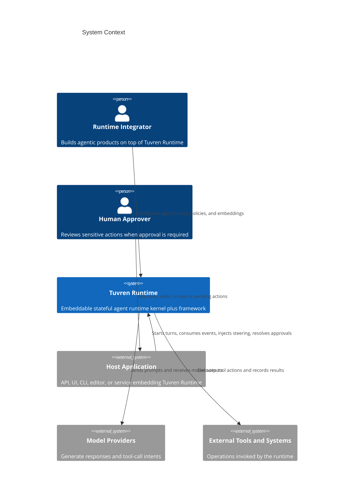
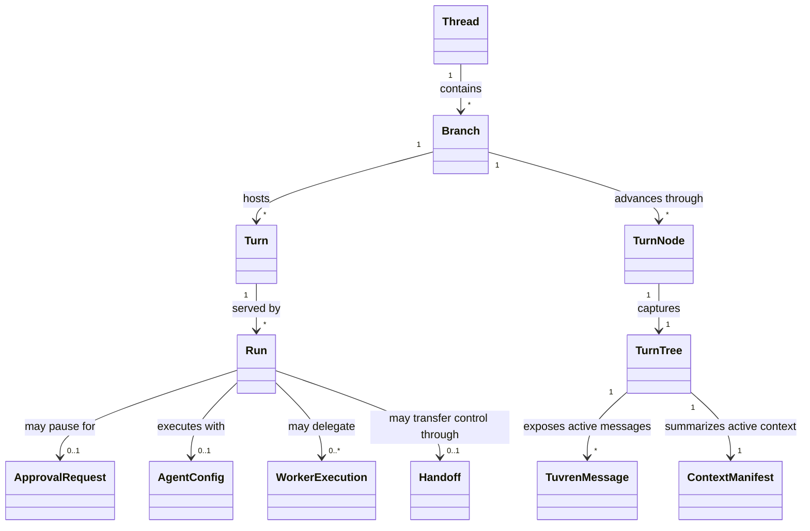

# Product Requirements Document

## 0. Version History & Changelog

- v0.4.0 - Added the machine-enforced neutral authority capabilities, the authority-packet and conformance-plan domain terms, the no-implementation-oracle and no-prose-oracle prohibited patterns, and the runtime-maintainer success criterion that a new implementation must be buildable without reading another language's source as truth.
- v0.3.0 - Added the multi-implementation portability posture, the runtime implementation maintainer actor, and explicit language-neutral semantic parity capabilities for the post-TypeScript transition line.
- v0.2.0 - Reframed Tuvren Runtime as a driver-oriented runtime where the framework can host multiple execution drivers over shared kernel primitives, with ReAct as the initial driver.
- ... [Older history truncated, refer to git logs]

## 1. Executive Summary & Target Archetype

- **Target Archetype:** Embeddable stateful agent and workflow runtime kernel plus driver-oriented framework/SDK
- **Vision:** Tuvren Runtime becomes a trustworthy substrate for building long-lived agent systems whose progress, state transitions, interruptions, and control transfers remain durable, inspectable, and recoverable instead of opaque and fragile.
- **Problem:** Existing agent runtimes often make state continuity, tool execution, pause/resume, context shaping, and multi-agent control feel incidental or ad hoc, while many workflow systems hard-code one execution style as if it were the whole product. That makes long-running agent work hard to audit, hard to recover after interruption, hard to govern, and hard to adapt cleanly across different execution models.
- **Jobs to Be Done:** Enable a builder to run durable agent or workflow execution with explicit history; let a host observe and steer execution safely; let a system execute tools, approvals, and handoffs without losing continuity; and let downstream teams reason about what happened, why it happened, and how to resume, redirect, or swap execution strategy without discarding the shared runtime foundation.

### 1.1 Product Posture

- Tuvren is the company brand, Tuvren Runtime is the runtime product, and Kraken is the engine identity behind it.
- Tuvren Runtime must treat durable state continuity as a first-class product outcome, not an implementation detail.
- Tuvren Runtime must separate low-level runtime mechanism from higher-level execution policy so that the product can stay stable while agent and workflow behaviors evolve.
- Tuvren Runtime must be host-embeddable. The product serves applications, services, CLIs, and protocol adapters rather than replacing them.
- Tuvren Runtime must support a shared runtime foundation that can host more than one execution driver over time rather than treating one agent loop as the entire product ontology.
- Tuvren Runtime must preserve a language-neutral semantic core so future implementations can share one runtime meaning without turning the first TypeScript line into the permanent oracle.
- Tuvren Runtime must enforce that cross-implementation meaning lives in boundary-owned machine-readable authority and executable evidence rather than in any single implementation language, runner codebase, or human-prose document.

### 1.2 Success Criteria

- A builder can embed Tuvren Runtime as the execution substrate for an agentic product without having to invent custom persistence, pause/resume, or recovery semantics.
- A host can observe execution in real time and still rely on a durable post hoc history of what was committed.
- A human supervisor can interrupt, approve, reject, or resume sensitive work without corrupting the execution lineage.
- A multi-agent workflow can delegate, hand off, and continue work while preserving traceability and avoiding ambiguous control transfer.
- A runtime maintainer can introduce a new implementation language against shared contracts and behavioral fixtures without redefining the product’s semantic model.
- A runtime maintainer can build and judge a new implementation strictly from boundary-owned machine authority, generated artifacts, executable conformance evidence, and language-binding adapters, without reading another language's implementation, a generic runner's source code, or a Markdown document as the source of cross-language truth.

### 1.3 Scope Distinctions That Must Remain Stable

- **Semantic turn vs. execution run:** A user-visible turn may span more than one execution run when approval or recovery interrupts work.
- **Delegation vs. handoff:** Workers perform subordinate tasks and return results; handoffs transfer active control to another agent.
- **History preservation vs. active context shaping:** The active working context may be reduced or rewritten, but previously committed history remains recoverable.
- **Host control vs. runtime execution:** The host initiates, observes, and influences execution, but the runtime remains responsible for the execution lifecycle itself.
- **Framework vs. driver:** The framework supplies shared runtime services and contracts, while a driver defines one concrete execution model built on that shared foundation.
- **Machine authority vs. implementation projection:** Cross-implementation meaning lives in boundary-owned machine authority and executable evidence; an implementation language, generic runner codebase, or human-prose document is a projection of that authority and is never the source of cross-language truth.

## 2. Ubiquitous Language (Glossary)

| Term                | Definition                                                                                                                                   | Do Not Use                             |
| ------------------- | -------------------------------------------------------------------------------------------------------------------------------------------- | -------------------------------------- |
| Tuvren Runtime      | The overall product surface that enables durable, stateful agent execution and orchestration.                                                | engine, bot framework, wrapper         |
| Kernel              | The mechanism-focused layer that owns durable storage, structural state, lineage, and recovery primitives.                                   | framework core, agent brain            |
| Framework           | The shared runtime layer built on the kernel that provides common contracts, services, and integration surfaces used by one or more drivers. | kernel, single agent loop              |
| Driver              | A concrete execution model built on the shared framework and kernel primitives.                                                              | workflow preset, implementation detail |
| ReAct Driver        | The initial Kraken driver centered on iterative model reasoning, tool use, and runtime feedback within one ongoing turn.                     | the whole framework, generic agent     |
| Thread              | The long-lived container for one continuing line of work or conversation.                                                                    | session log, chat room                 |
| Branch              | A named continuation within a thread representing one active path through history.                                                           | forked chat, duplicate thread          |
| Turn                | One user-visible interaction span within a thread.                                                                                           | step, request packet                   |
| Run                 | One concrete execution attempt serving part or all of a turn.                                                                                | turn, transaction                      |
| Step                | A declared unit of work inside a run boundary.                                                                                               | callback, stage magic                  |
| TurnNode            | A durable checkpoint in execution history that captures resulting state and lineage.                                                         | savepoint, mutable snapshot            |
| TurnTree            | The structured runtime state visible at a TurnNode.                                                                                          | cache blob, transcript only            |
| Staged Result       | Durable work product recorded before it is committed into history.                                                                           | temp output, ephemeral result          |
| Context Manifest    | The lightweight structural index used to reason about active context without rescanning full history.                                        | summary, prompt cache                  |
| Context Engineering | Intentional reshaping of active context while preserving historical auditability.                                                            | deleting history, prompt trimming      |
| Structured Output   | Assistant-authored schema-constrained data produced as content, not as a tool call or side effect.                                           | JSON mode, fake tool call              |
| Steering            | Host-supplied user input injected between iterations of a running turn.                                                                      | cancel, edit-in-place                  |
| Approval            | Human review required before executing one or more sensitive tool actions.                                                                   | pause forever, manual override only    |
| Extension           | A composable policy or behavior unit that can observe, influence, or wrap execution.                                                         | plugin blob, middleware soup           |
| Handoff             | A controlled transfer of active execution responsibility from one agent configuration to another.                                            | worker result, tool call               |
| Worker              | A subordinate agent execution used to perform delegated work and return results.                                                             | handoff, branch clone                  |
| ExecutionHandle     | The host-facing control surface for consuming events and issuing runtime controls.                                                           | adapter, transport                     |
| Authority Packet    | A boundary-owned bundle that names the machine-readable sources, generated artifacts, conformance evidence, and binding projections that together carry one cross-implementation semantic surface.       | spec doc, README, schema folder        |
| Conformance Plan    | An executable, data-owned description of the named semantic checks, fixtures, scenarios, assertions, and required evidence that an implementation must satisfy for a given authority packet.             | test suite, runner script              |
| Implementation Adapter | The language-specific seam that exposes a particular implementation to a generic conformance runner over a neutral operation, event, cancellation, error, and state-inspection surface.                | bespoke test harness, fixture loader   |
| Generic Runner      | An implementation-agnostic process that consumes a conformance plan plus an implementation adapter and produces evidence; never the home of product semantics itself.                                    | reference implementation, oracle test  |

## 3. Actors & Personas

### 3.1 Primary Actor

- **Role:** Runtime Integrator
- **Context:** Builds an agentic product, platform feature, internal tool, or service that needs durable execution rather than one-shot prompting.
- **Goals:** Embed a runtime that can preserve state, recover progress, govern tool execution, manage context growth, and support advanced agent patterns without bespoke infrastructure.
- **Frictions:** Existing agent tooling often hides execution state, couples behavior to vendor specifics, loses progress on failure, and makes pause/resume or multi-agent control feel improvised.

### 3.2 Host Application Developer

- **Role:** Host Application Developer
- **Context:** Exposes Tuvren Runtime through an API, UI, CLI, editor integration, or protocol bridge.
- **Goals:** Start turns, consume streamed events, inject steering, route approvals, and surface execution status without owning the runtime semantics.
- **Frictions:** Needs a clear control surface and event vocabulary instead of reverse-engineering runtime internals.

### 3.3 Extension and Tool Author

- **Role:** Extension and Tool Author
- **Context:** Adds cross-cutting policy, observability, gating, or domain-specific tool behavior around agent execution.
- **Goals:** Intervene in execution predictably, add tools cleanly, and express approvals or policy decisions without breaking runtime guarantees.
- **Frictions:** Ad hoc hook systems are easy to misuse and often blur durable behavior with ephemeral wrappers.

### 3.4 Human Approver or Supervisor

- **Role:** Human Approver or Supervisor
- **Context:** Must review sensitive or consequential actions while the agent is mid-turn.
- **Goals:** Understand what the runtime is asking to do, approve or reject safely, and resume work without duplicated or lost side effects.
- **Frictions:** Approval systems often lack durable continuity, forcing operators to choose between safety and productivity.

### 3.5 Multi-Agent Workflow Designer

- **Role:** Multi-Agent Workflow Designer
- **Context:** Coordinates specialists, workers, or pipelines that need to share responsibility without collapsing traceability.
- **Goals:** Delegate subtasks, hand off control, forward worker signals, and preserve execution lineage across agent boundaries.
- **Frictions:** Many systems conflate delegation with transfer of control or make multi-agent behavior impossible to inspect after the fact.

### 3.6 Runtime Implementation Maintainer

- **Role:** Runtime Implementation Maintainer
- **Context:** Must extend or maintain Tuvren Runtime in a new language, runtime, or process boundary without weakening the kernel/framework semantics already promised to hosts and builders.
- **Goals:** Consume stable contracts, prove behavior against shared fixtures, preserve observability and compatibility signals, and add new implementation lines without creating a shadow specification.
- **Frictions:** Ports often drift into rewrites, language-specific toolchains often leak into semantic boundaries, and shared behavior usually becomes folklore unless parity is enforced mechanically.

## 4. Functional Capabilities

### Epic: Durable Stateful Runtime Foundation

- **Priority:** P0
- **Capability ID:** CAP-P0-001
- **Capability:** The product must preserve agent execution as durable, inspectable state transitions rather than as only transient in-memory flow.
- **Rationale:** Long-running or interrupted agent work is only trustworthy if progress survives failures and can be audited.

- **Priority:** P0
- **Capability ID:** CAP-P0-002
- **Capability:** The product must maintain explicit lineage for each thread of work so builders can understand how the current state was reached and what prior states remain recoverable.
- **Rationale:** Stateful agent systems need trustworthy continuity, rollback, and auditability.

- **Priority:** P0
- **Capability ID:** CAP-P0-003
- **Capability:** The product must allow active work to continue on named alternate continuations without destroying previously committed history.
- **Rationale:** Exploration, rollback, and correction require preserved prior paths rather than destructive overwrite.

### Epic: Turn Execution and Recovery

- **Priority:** P0
- **Capability ID:** CAP-P0-004
- **Capability:** The product must execute user-visible work in turns while allowing internal execution attempts to pause, fail, resume, or restart within that turn.
- **Rationale:** Human-visible continuity and machine execution continuity are related but not identical and must both be represented.

- **Priority:** P0
- **Capability ID:** CAP-P0-005
- **Capability:** The product must recover safely after interruption by distinguishing committed progress from incomplete work and resuming only what remains unfinished.
- **Rationale:** Crash-safe recovery is a core product promise for stateful agents.

- **Priority:** P0
- **Capability ID:** CAP-P0-006
- **Capability:** The product must commit execution progress at declared boundaries so that nondeterministic or side-effecting work does not depend on best-effort memory alone.
- **Rationale:** Builders need clear trust boundaries around what is durable and what may re-execute.

### Epic: Conversational and Structural State

- **Priority:** P0
- **Capability ID:** CAP-P0-007
- **Capability:** The product must retain conversational content in natural order while also exposing sufficient structure for runtime decisions about context, control flow, and status.
- **Rationale:** Agent systems need both human-readable history and machine-readable runtime state.

- **Priority:** P0
- **Capability ID:** CAP-P0-008
- **Capability:** The product must persist execution status that reflects whether work is running, paused, completed, failed, or partially interrupted.
- **Rationale:** Hosts, operators, and orchestrators need durable visibility into active execution state.

- **Priority:** P1
- **Capability ID:** CAP-P1-009
- **Capability:** The product must preserve a compact structural summary of active context so context-management decisions can be made without full history scans.
- **Rationale:** Long-lived agent sessions become impractical if every context decision requires re-reading everything.

### Epic: Context Engineering

- **Priority:** P0
- **Capability ID:** CAP-P0-010
- **Capability:** The product must support deliberate reshaping of the active context window, including reduction, replacement, or condensation of active material, without erasing historical traceability.
- **Rationale:** Practical agent runtime use requires controlling context growth while preserving audit history.

- **Priority:** P1
- **Capability ID:** CAP-P1-011
- **Capability:** The product must allow context engineering to operate as an explicit runtime action with visible consequences to subsequent execution.
- **Rationale:** Hidden or implicit context mutation makes agent behavior hard to explain and debug.

### Epic: Model and Tool Interaction

- **Priority:** P0
- **Capability ID:** CAP-P0-012
- **Capability:** The product must normalize model outputs into a canonical internal representation of conversational content, reasoning content, structured output, tool calls, tool results, and file-like payloads.
- **Rationale:** Builders need one stable runtime model even when upstream model providers differ.

- **Priority:** P0
- **Capability ID:** CAP-P0-013
- **Capability:** The product must execute requested tools, capture their results durably, and feed those results back into subsequent agent reasoning as part of the ongoing turn.
- **Rationale:** Tool execution is a core part of practical agent behavior and must be a first-class runtime concern.

- **Priority:** P0
- **Capability ID:** CAP-P0-014
- **Capability:** The product must preserve partial progress within a tool batch so completed tool work is not needlessly repeated after interruption.
- **Rationale:** Batch execution without partial durability produces duplicated side effects and wasted work.

- **Priority:** P1
- **Capability ID:** CAP-P1-015
- **Capability:** The product must validate tool inputs against declared contracts before execution and surface failures as agent-visible results rather than silent runtime corruption.
- **Rationale:** Tooling reliability depends on explicit validation and recoverable failure semantics.

### Epic: Human-in-the-Loop Governance

- **Priority:** P0
- **Capability ID:** CAP-P0-016
- **Capability:** The product must support approval-gated tool execution, including partial completion before pause and exact continuation after a human decision.
- **Rationale:** Real-world agent systems need governed execution for sensitive operations.

- **Priority:** P0
- **Capability ID:** CAP-P0-017
- **Capability:** The product must let a host provide approval decisions that approve, edit, reject, or otherwise resolve pending tool work without requiring a new conversational turn.
- **Rationale:** Approval resolution is operational control, not ordinary user chat.

- **Priority:** P1
- **Capability ID:** CAP-P1-018
- **Capability:** The product must make approval state visible to hosts and operators in a structured way that explains what is pending and what has already completed.
- **Rationale:** Effective human supervision requires clarity, not implicit pause states.

### Epic: Host Control and Streaming Observability

- **Priority:** P0
- **Capability ID:** CAP-P0-019
- **Capability:** The product must expose a host control surface that can start execution, stream runtime events, cancel work, inject steering, and resolve approvals.
- **Rationale:** Tuvren Runtime is meant to be embedded into host systems, so the host contract is part of the product, not a side detail.

- **Priority:** P0
- **Capability ID:** CAP-P0-020
- **Capability:** The product must emit a canonical stream of lifecycle, model, tool, control, and error events that downstream adapters can translate into other protocols.
- **Rationale:** Hosts and UIs need real-time insight into execution without coupling to provider-specific event shapes.

- **Priority:** P1
- **Capability ID:** CAP-P1-021
- **Capability:** The product must support both streaming and non-streaming model integrations while preserving a consistent outward event vocabulary.
- **Rationale:** Builders should not need separate host integrations for different provider transport modes.

- **Priority:** P1
- **Capability ID:** CAP-P1-022
- **Capability:** The product must support non-destructive steering that injects user intent between iterations of a running turn.
- **Rationale:** Hosts need a way to redirect active work without discarding committed progress.

### Epic: Extensibility and Policy Composition

- **Priority:** P0
- **Capability ID:** CAP-P0-023
- **Capability:** The product must let builders add composable cross-cutting behaviors that can observe, influence, or wrap execution at defined lifecycle points.
- **Rationale:** Governance, telemetry, budget control, approval policy, and domain behavior should be additive rather than hard-coded into the core.

- **Priority:** P1
- **Capability ID:** CAP-P1-024
- **Capability:** The product must allow extensions to maintain their own scoped persisted state and expose declared shared outputs to other runtime participants.
- **Rationale:** Useful extensions require continuity across iterations and sometimes across agents.

- **Priority:** P1
- **Capability ID:** CAP-P1-025
- **Capability:** The product must support pluggable policies for context shaping, prompt rendering, loop continuation, and tool execution.
- **Rationale:** Different agent products need different execution policies without redefining the runtime’s core ontology.

### Epic: Driver Modularity

- **Priority:** P0
- **Capability ID:** CAP-P0-033
- **Capability:** The product must support a shared runtime foundation that can host multiple execution drivers over time rather than hard-coding one execution model as the whole framework.
- **Rationale:** Durable state, host control, provider neutrality, and orchestration primitives should be reusable across ReAct-style agents and future workflow-oriented drivers.

- **Priority:** P1
- **Capability ID:** CAP-P1-034
- **Capability:** The product must ship with one primary driver-first baseline, centered initially on a ReAct-style execution model, while keeping room for future workflow, routing, evaluator, or orchestration-focused drivers.
- **Rationale:** Tuvren Runtime needs one strong default execution path now without letting that first choice become an accidental product monopoly.

### Epic: Multi-Agent Orchestration

- **Priority:** P0
- **Capability ID:** CAP-P0-026
- **Capability:** The product must support delegated worker execution as a first-class pattern for subordinate tasks whose results return to a parent workflow.
- **Rationale:** Complex agent systems often need bounded sub-work without transferring full control.

- **Priority:** P0
- **Capability ID:** CAP-P0-027
- **Capability:** The product must support explicit handoff between agent configurations within the same ongoing work item while preserving continuity and traceability.
- **Rationale:** Specialization requires transfer of responsibility without pretending the work started over.

- **Priority:** P1
- **Capability ID:** CAP-P1-028
- **Capability:** The product must support pipeline-style agent sequences where one agent’s output becomes the next agent’s starting context.
- **Rationale:** Many multi-agent workflows are structured pipelines rather than open-ended collaboration.

- **Priority:** P1
- **Capability ID:** CAP-P1-029
- **Capability:** The product must preserve the distinction between worker execution, handoff, and sequence progression in both runtime behavior and observable events.
- **Rationale:** These patterns solve different user problems and should not collapse into one vague orchestration mechanism.

### Epic: Portability and Provider Neutrality

- **Priority:** P0
- **Capability ID:** CAP-P0-030
- **Capability:** The product must provide a provider-neutral internal model so that agent behavior does not depend on any one provider’s wire format or naming conventions.
- **Rationale:** Tuvren Runtime’s product value depends on stable internal semantics even as model ecosystems change.

- **Priority:** P1
- **Capability ID:** CAP-P1-031
- **Capability:** The product must preserve opaque provider continuity artifacts when needed for correct multi-turn operation without promoting provider-specific concepts into the core product language.
- **Rationale:** Portability requires a neutral core, but operational correctness may still depend on carrying provider-specific continuity data through the system.

- **Priority:** P1
- **Capability ID:** CAP-P1-035
- **Capability:** The product must preserve language-neutral semantic seams so future TypeScript, Rust, Go, Python, Zig, or other implementations can share one runtime meaning rather than drifting behind per-language wrappers.
- **Rationale:** Long-term portability only matters if multiple implementations can remain part of one semantic ecosystem instead of becoming parallel products.

- **Priority:** P1
- **Capability ID:** CAP-P1-036
- **Capability:** The product must let implementations prove parity through shared machine-readable contracts and behavioral fixtures instead of relying on one language codebase as the long-term oracle.
- **Rationale:** Durable multi-language portability needs executable semantic evidence, not only prose promises or reference-implementation folklore.

- **Priority:** P0
- **Capability ID:** CAP-P0-037
- **Capability:** The product must guarantee that no single implementation language, runner codebase, or human-prose document can act as the source of cross-implementation semantic truth; every binding cross-language semantic must live in a boundary-owned machine authority packet that pairs machine-readable sources with at least one executable verification path.
- **Rationale:** Multi-language portability collapses the moment a TypeScript file, Rust crate, generic runner, or Markdown specification becomes the de facto oracle, because future implementations are then forced to chase implementation accidents rather than honor a shared meaning.

- **Priority:** P1
- **Capability ID:** CAP-P1-038
- **Capability:** The product must let a new implementation be built and judged against shared meaning by inspecting only authority packets, generated artifacts, conformance plans, fixtures, language-binding adapters, and measured evidence, without reading another language's implementation source, a generic runner's hard-coded assertions, or Markdown prose as the binding semantic source.
- **Rationale:** Adding a new language line is only an honest portability claim when the work is reproducible from boundary-owned machine authority alone.

### Epic: Reader and Operator Clarity

- **Priority:** P1
- **Capability ID:** CAP-P1-032
- **Capability:** The product must be explainable through a stable set of canonical concepts so builders can reason about behavior without reverse-engineering implementation details.
- **Rationale:** A runtime this foundational only becomes adoptable if its conceptual model is teachable and inspectable.

### 4.1 Scope Notes

- The PRD intentionally treats persistence, streaming, tool dispatch, approvals, context engineering, and orchestration as product capabilities because they materially define the user-facing value of Tuvren Runtime as a runtime.
- The initial active product line is the shared runtime foundation plus the ReAct Driver, not a commitment to implement every possible driver pattern in the first release line.
- This PRD does not prescribe the concrete storage engine, programming language, packaging layout, or transport stack used to implement those capabilities.
- Long-term portability is a boundary-preservation goal, not a rewrite mandate; future implementation lines must extend the shared semantic system rather than replace it wholesale.

### 4.2 Distinction Notes

- A paused turn is not a completed turn and not a failed turn; it represents approval-gated continuation of already-started work.
- A handoff is not a worker result and not a branch creation; it is a control transfer within the same ongoing work item.
- Context engineering changes the active working set, not the fact that prior committed history still exists.
- Semantic neutrality is not toolchain neutrality; implementations may use native package and build workflows while preserving shared runtime meaning at the boundary seams.
- Authority-packet ownership is not artifact format ownership; an authority packet may pair multiple machine-readable formats (such as logical contract sources, binary grammar, transport projections, telemetry vocabulary, and conformance plans) under one boundary, but no single format silently becomes the meaning of the surface.

## 5. Non-Functional Constraints

- **Performance:** The product must remain usable for long-lived agent sessions, and routine context-management decisions should rely on compact structural state rather than repeated full-history rescans whenever practical.
- **Reliability:** The product must make committed progress durable, distinguish incomplete work from committed work, and converge safely after interruptions without ambiguous replay.
- **Security & Privacy:** Sensitive actions must be governable through approval workflows; provider-specific continuity artifacts must be preserved only as required for correct operation; runtime state and event surfaces must remain inspectable enough for supervision and audit.
- **Operability:** The product must be embeddable into different host surfaces, support real-time observation, and expose explicit control points for cancellation, steering, approval, and status inspection.
- **Domain-specific Constraints:** The product must preserve a clear separation between low-level runtime mechanism and higher-level agent policy; the canonical runtime language must remain provider-neutral; history-preserving correction must be preferred over destructive overwrite; active-context reshaping must never imply that prior committed history ceased to exist; and future implementation languages must prove parity against shared semantic assets rather than reinterpret the product independently.

### Prohibited Patterns

- The product must not depend on provider-native content or tool-call shapes as its canonical internal model.
- The product must not require the core runtime to call back into higher layers in order to satisfy its own durability or recovery obligations.
- The product must not treat destructive deletion of prior committed history as the normal way to correct or redirect work.
- The product must not collapse delegation, handoff, approval, and cancellation into one generic control concept.
- The product must not let any implementation language file, generic runner source file, or human-prose document act as the authoritative source of a cross-implementation semantic.
- The product must not satisfy a portability or compatibility claim through smoke success, object existence, or runner-internal assertions alone; every such claim must trace to an authority packet plus measured evidence.

## 6. Boundary Analysis

### In Scope

- A runtime kernel that preserves durable execution state, lineage, and recoverable history
- A framework layer that executes agent turns, manages iteration, and incorporates model and tool work
- Canonical runtime representations for messages, reasoning content, structured output, tool calls, tool results, and file-like payloads
- Context engineering for active-context pruning, summarization, compaction, or replacement while preserving audit history
- Host-facing controls for event consumption, cancellation, steering, and approval resolution
- Human-in-the-loop approval flows for sensitive tool execution
- Extension and policy composition at defined lifecycle points
- Provider-neutral model integration with canonical streaming and non-streaming behavior
- Multi-agent orchestration patterns including workers, handoffs, and sequences
- A language-neutral semantic foundation that can support more than one implementation line over time through shared contracts, conformance artifacts, and compatibility evidence
- A boundary-owned machine authority surface where every cross-implementation semantic is anchored to authority packets, generated artifacts, conformance plans, and measured evidence rather than to any one language's implementation, runner code, or prose document

### Out of Scope

- A managed hosted control plane, SaaS product, or operations console
- Concrete language, framework, storage engine, transport, or cloud-vendor selection
- Automatic agent discovery, agent marketplace behavior, or dynamic agent self-registration
- Cross-thread shared memory semantics beyond deliberate runtime coordination mechanisms
- Branch merge semantics for reconciling divergent histories
- Worker process scheduling, infrastructure supervision, or operating-system-level orchestration
- Garbage-collection policy for historical data or archival branches
- Domain-specific business tools, vertical workflows, or provider-exclusive capabilities as core product requirements
- A simultaneous full-framework port across multiple languages before the shared semantic system is artifact-backed and stable
- Bespoke per-implementation conformance suites that re-encode product semantics inside runner code instead of consuming a shared, data-owned conformance plan

## 7. Conceptual Diagrams (Mermaid)

### 7.1 System Context

### 7.2 Domain Model

## Appendix: Operator Preferences

- Formalize the project through the staged framework process, starting with a comprehensive PRD before architecture or implementation artifacts.
- Preserve the conceptual separation already established between kernel concerns and framework concerns while keeping the PRD technology-agnostic.
- Treat the current project as greenfield with specifications as source intent rather than implementation reality.
