# Engineering Execution Plan

## 0. Version History & Changelog

- v0.10.0 - Opened Epic Y Machine-Enforced Neutral Authority Closure as the active critical path (KRT-Y001..KRT-Y012) backed by the Epic Y planning spike, the new Authority Packet / Conformance Plan / Implementation Adapter contracts in TechSpec §4.11–§4.13, and ADR-023..028. Critical path totals 45 active story points.
- v0.9.2 - Closed Epic X in current repo reality with the topology inventory, relocated TypeScript testkit and contract package roots, implementation-root workspace rewires, path-topology guardrails, and the Epic X closure inventory.
- v0.9.1 - Opened Epic X TypeScript Topology Normalization to relocate TS-only assets out of the language-neutral boundary slots so the repository tree reveals language ownership through path alone before another implementation line lands.
- ... [Older history truncated, refer to git logs]

## 1. Executive Summary & Active Critical Path

- **Total Active Story Points:** 45
- **Critical Path:** KRT-Y001 → KRT-Y002 → KRT-Y008 → KRT-Y009 → KRT-Y005 → KRT-Y010 → KRT-Y011 → KRT-Y012. Y003, Y004, Y006, and Y007 land in parallel after Y008 and Y009 unblock, with Y003 sequenced first so other promotions can reference its core types.
- **Planning Assumptions:** Epics A-X are closed in current repo reality. Epic Y is the active machine-enforced neutral authority closure line. It does not open a new implementation language, widen kernel/framework semantics, or replace existing TypeScript public package APIs; existing packages become declared binding projections of their authority packets per ADR-023, ADR-024, ADR-025, ADR-026, ADR-027, and ADR-028. Authority Packet manifests follow TechSpec §4.11; Conformance Plans follow §4.12; Implementation Adapter Protocol follows §4.13. The planning artifact is `constitution/spikes/epic-y-machine-enforced-authority-plan.md`.

### Brownfield Continuity Note

- The current codebase already contains the workspace scaffold, shared core types, kernel protocol package, memory backend, SQLite backend, kernel testkit, shared framework contract packages, provider contract package, `runtime-core`, and the ReAct Driver foundation package.
- Current repository reality includes closed Epic K, L, M, N, O, and P behavior with explicit closure artifacts in `constitution/spikes/epic-k-react-loop-cancellation-inventory.md`, `constitution/spikes/epic-l-parity-inventory.md`, `constitution/spikes/epic-m-tool-approval-gap-inventory.md`, `constitution/spikes/epic-n-ai-sdk-bridge-inventory.md`, `constitution/spikes/epic-o-stream-adapter-inventory.md`, and `constitution/spikes/epic-p-playground-host-inventory.md`.
- `KRT-Q001` is now closed in current repo reality through `constitution/spikes/epic-q-hardening-gap-inventory.md`, which inventories the extraction targets, release-check targets, portability matrix, deferred Deno work, and remaining hardening gaps for the rest of Epic Q.
- The Epic Q target packages now live under `boundaries/framework/implementations/typescript/testkit` and `boundaries/providers/implementations/typescript/testkit`, with release and verification scripts under `tools/scripts`.
- The private playground host now also owns automated aimock E2E validation lanes that exercise `@tuvren/provider-bridge-ai-sdk` through local OpenAI-, Anthropic-, and Gemini-compatible HTTP mock provider boundaries without provider credentials, covering streamed text, structured output, tool continuation, approval pause/resume, provider metadata, cancellation, provider failure, malformed responses, and unmatched fixtures.
- The private playground host now also exposes an opt-in `host-playground:scenario-gemini` lane that exercises the same bridge through `@ai-sdk/google@3.0.64` and real Gemini credentials for streaming, metadata, structured output, multi-step streamed tool continuity, and approval resume behavior without moving live-provider cost and flake into default verification.
- Those Epic Q testkit packages are now helper/facade packages; compatibility evidence flows through implementation-scoped TypeScript conformance runners over shared boundary-owned assets.
- Planning verification confirmed `ai@6.0.142` and `@ai-sdk/provider@3.0.8` are available and that `@ai-sdk/provider@3.0.8` exports `LanguageModelV3`, `ProviderV3`, `LanguageModelV3CallOptions`, `LanguageModelV3GenerateResult`, and `LanguageModelV3StreamPart`.
- Epic N now extends repo reality beyond those planning notes: the bridge package exists and the closure artifact above is the authoritative upstream seam for Epic O.
- Epic O now extends repo reality beyond those planning notes: `@tuvren/stream-core`, `@tuvren/stream-sse`, and `@tuvren/stream-agui` exist, `constitution/spikes/epic-o-stream-adapter-inventory.md` is the authoritative adapter mapping record, and Epic P must treat tee-based fanout plus the documented `tuvren.runtime.*` AG-UI custom namespace as the handoff surface rather than rediscovering protocol gaps or resubscription hazards.
- Epic P now extends repo reality beyond those planning notes: `@tuvren/playground-host` exists under `boundaries/hosts/implementations/typescript/playground`, `constitution/spikes/epic-p-playground-host-inventory.md` is the authoritative playground handoff, full-turn streams cover canonical/SSE/AG-UI fanout, approval resume continuation is projected to canonical/SSE only, non-reload memory scenarios run under Bun tests, branching is validated from a completed source head, and SQLite reload is validated through the built Node CLI path.
- Epic R now extends repo reality beyond those planning notes: the repository has the explicit multi-language transition guide plus the closure inventory in `constitution/spikes/epic-r-multilanguage-transition-foundation-inventory.md`, Epic S has since closed the artifact promotion line, Epic T has since closed the kernel interop governance line, Epic U has since closed the Rust kernel baseline line, and Epic V has since closed the TypeScript framework to Rust kernel interop stabilization line.

### Sequential Scope Rule

- Epic V is closed. Epic W starts from the measured compatibility evidence and the Epic V closure inventories, but it is not Rust framework work. Epic W must mature the semantic ecosystem itself: coverage matrix, assertion-bearing conformance suites, promoted TypeScript-local semantics, and compatibility evidence precise enough for future implementations to consume without treating TypeScript as the oracle.
- Epic W and Epic X are closed. Epic X completed the structural normalization that relocated TS-only assets out of language-neutral boundary slots without changing semantics, conformance suites, fixtures, public package APIs, or generated artifacts.
- Epic Y is the active line. It authors neutral authority packets for the four surfaces that still lack one (`runtime-api`, `driver-api`, `event-stream`, `core-types`) plus the callable seam, replaces TypeScript / Rust / runner-source / Markdown oracle paths with packet-driven authority, and adds CI guardrails for those rules. Epic Y is not Rust framework work, not a new driver, not a new backend, and not a new host protocol; it eliminates the oracle paths that would otherwise force future implementation lines to reverse-engineer TypeScript or Rust to find the contract.

### Planning Heuristic

- Prefer epic slices that look likely to land comfortably below roughly `5,000` lines of new code and treat roughly `10,000` lines as a warning threshold.
- This is a scoping heuristic for planning clarity, not an execution cap or a substitute for code review judgment.

## 2. Project Phasing & Iteration Strategy

### Delivery Cadence Posture

- No sprint or release-train cadence is assumed in this plan.
- This section uses "iteration strategy" only because the planning framework requires that heading; the content below is dependency phasing and scope partitioning, not a commitment to Scrum-style iterations.

### Current Active Scope

- Epic Y Machine-Enforced Neutral Authority Closure is active. Planning artifact: `constitution/spikes/epic-y-machine-enforced-authority-plan.md`. KRT-Y001 is the entry ticket; the rest of the build order follows §3.
- Epic W and Epic X are closed in current repo reality through their respective closure inventories under `constitution/spikes/`.
- Future implementation-line work must start from the named semantic evidence in Epic W, the normalized Epic X topology, and the Epic Y authority packets rather than reopening TypeScript-local semantic authority, filesystem drift, or implementation-language oracles by default.

### Future / Deferred Scope

- Rust framework implementation work is deferred beyond Epic Y and requires a later TechSpec revision that cites both Epic W semantic evidence and the Epic Y authority packets.
- `LanguageModelV2` / `ProviderV2` compatibility is deferred.
- AI SDK agent loops, AI SDK UI message protocols, AI SDK transport helpers, LangChain bridges, provider-native tool support, and first-class Tuvren provider packages are deferred.
- ACP or any additional host protocol beyond SSE and AG-UI is deferred until a future TechSpec revision names it.
- Future concrete drivers beyond ReAct, official peer backends beyond memory/SQLite, and future language lines beyond Rust are deferred beyond Epic Y unless a later TechSpec revision activates them from the matured semantic evidence and authority packets.
- FFI-based Rust embedding is deferred until after the process-boundary kernel seam is proven boring and durable.
- Deno portability checks are deferred until public package surfaces stabilize enough to avoid testing scaffolding churn.
- Authoring authority packets for surfaces beyond the five named in Epic Y (kernel protocol packet hardening, host stream adapter packets, telemetry semconv packet, compatibility-ledger packet, AI SDK bridge packet) is deferred to a later epic that may build on Epic Y mechanics.

### Archived or Already Completed Scope

- Epics A-J established the architecture-first monorepo, shared core types, kernel protocol, memory and SQLite backends, shared framework contracts, `runtime-core`, the first ReAct driver slice, and the runtime-foundation hardening line.
- Epics K-M closed the first production-depth ReAct loop, streaming/provider parity, and tool/approval integration; authoritative closure evidence lives in `constitution/spikes/epic-k-react-loop-cancellation-inventory.md`, `constitution/spikes/epic-l-parity-inventory.md`, and `constitution/spikes/epic-m-tool-approval-gap-inventory.md`.
- Epics N-Q closed the post-ReAct TypeScript expansion line for the AI SDK bridge, host stream adapters, playground host harness, and release/portability hardening; authoritative closure evidence lives in `constitution/spikes/epic-n-ai-sdk-bridge-inventory.md`, `constitution/spikes/epic-o-stream-adapter-inventory.md`, `constitution/spikes/epic-p-playground-host-inventory.md`, and `constitution/spikes/epic-q-release-hardening-inventory.md`. That closure line now includes automated aimock provider-boundary coverage across OpenAI, Anthropic, and Gemini plus an opt-in real Gemini playground lane without reactivating the closed Epic Q backlog.
- Epic R closed the multi-language transition foundation through `constitution/spikes/epic-r-multilanguage-transition-guide.md` and `constitution/spikes/epic-r-multilanguage-transition-foundation-inventory.md`, delivering boundary-owned conformance and contract scaffold, canonical target vocabulary, telemetry codegen authority, and the first measured TypeScript-only compatibility baseline.
- Epic S closed boundary contract and conformance artifactization through `constitution/spikes/epic-s-boundary-contract-conformance-artifactization-inventory.md`, delivering TypeSpec-authored tool/provider artifacts, kernel CDDL grammar, implementation-scoped TypeScript conformance runners, and compatibility evidence sourced from those runners.
- Epic T closed kernel interop governance through `constitution/spikes/epic-t-kernel-interop-surface-inventory.md` and `constitution/spikes/epic-t-kernel-interop-governance-inventory.md`, delivering the governed kernel-only proto authority and Buf-backed interop governance lane.
- Epic U closed the Rust kernel baseline through `constitution/spikes/epic-u-rust-kernel-baseline-inventory.md`, delivering the root Cargo workspace, Rust kernel core, Rust conformance runner, runnable Rust gRPC service, and Rust telemetry helper without adding a TypeScript transport client or Rust framework path.
- Epic V closed TypeScript framework to Rust kernel interop stabilization through `constitution/spikes/epic-v-transport-decision-inventory.md` and `constitution/spikes/epic-v-framework-rust-kernel-interop-closure-inventory.md`, delivering the TypeScript gRPC transport helper, runtime selection seam, real interop-smoke evidence, compatibility-ledger interop entries, and separated cross-language verification.
- Rust framework start is no longer Epic W. It is deferred behind Epic W's semantic maturity evidence.

## 3. Build Order (Mermaid)

```mermaid
flowchart TD
  KRTR001[KRT-R001 Multilanguage Transition Guide] --> KRTR002[KRT-R002 Boundary-Owned Transition Scaffolding]
  KRTR002 --> KRTR003[KRT-R003 Canonical Target Vocabulary and Tool Wrappers]
  KRTR003 --> KRTR004[KRT-R004 Telemetry Semantic-Convention Source and Compatibility Contract]
  KRTR003 --> KRTS001[KRT-S001 Contract Promotion Inventory]
  KRTS001 --> KRTS002[KRT-S002 Framework and Provider TypeSpec Promotion]
  KRTS001 --> KRTS003[KRT-S003 Kernel CDDL Grammar]
  KRTS002 --> KRTS004[KRT-S004 Conformance Asset Split and TS Runners]
  KRTS003 --> KRTS004
  KRTS004 --> KRTT001[KRT-T001 Kernel Interop Surface Inventory]
  KRTT001 --> KRTT002[KRT-T002 Proto and Buf Governance]
  KRTR003 --> KRTT003[KRT-T003 Interop-Smoke Target Wiring]
  KRTT002 --> KRTT003
  KRTT002 --> KRTU001[KRT-U001 Cargo Workspace Integration]
  KRTR004 --> KRTU002[KRT-U002 Rust Kernel Core Scaffold]
  KRTS003 --> KRTU002[KRT-U002 Rust Kernel Core Scaffold]
  KRTU001 --> KRTU002
  KRTS004 --> KRTU003[KRT-U003 Rust Conformance Runner]
  KRTU002 --> KRTU003
  KRTT002 --> KRTU004[KRT-U004 Rust gRPC Kernel Service]
  KRTU002 --> KRTU004
  KRTU004 --> KRTV001[KRT-V001 TypeScript Transport Client and Runtime Switch]
  KRTU003 --> KRTV002[KRT-V002 Cross-Language Interop and Compatibility Matrix]
  KRTV001 --> KRTV002
  KRTR004 --> KRTV003[KRT-V003 Telemetry Conventions and CI Lane Separation]
  KRTV002 --> KRTV003
  KRTV003 --> KRTV004[KRT-V004 Interop Closure Inventory]
  KRTV004 --> KRTW001[KRT-W001 Semantic Coverage Matrix]
  KRTW001 --> KRTW002[KRT-W002 Assertion-Bearing Suite Contract]
  KRTW002 --> KRTW003[KRT-W003 Kernel Semantic Conformance Promotion]
  KRTW002 --> KRTW004[KRT-W004 Framework and Driver Semantic Conformance Promotion]
  KRTW002 --> KRTW005[KRT-W005 Provider and Stream Semantic Conformance Promotion]
  KRTW003 --> KRTW006[KRT-W006 Compatibility Evidence Hardening and Closure]
  KRTW004 --> KRTW006
  KRTW005 --> KRTW006
  KRTW006 --> KRTX001[KRT-X001 Topology Inventory]
  KRTX001 --> KRTX002[KRT-X002 Testkit Relocation]
  KRTX002 --> KRTX003[KRT-X003 Contract Implementation Relocation]
  KRTX003 --> KRTX004[KRT-X004 Topology Guardrail Documentation]
  KRTX004 --> KRTX005[KRT-X005 Epic X Closure Inventory]
  KRTX005 --> KRTY001[KRT-Y001 Authority Inventory and Conflict Map]
  KRTY001 --> KRTY002[KRT-Y002 Authority Packet Manifest and Validator]
  KRTY002 --> KRTY003[KRT-Y003 Core Types Authority Packet]
  KRTY002 --> KRTY008[KRT-Y008 Conformance Plan Compiler]
  KRTY002 --> KRTY009[KRT-Y009 Implementation Adapter Protocol]
  KRTY003 --> KRTY004[KRT-Y004 Event Stream Authority Packet]
  KRTY008 --> KRTY004
  KRTY009 --> KRTY004
  KRTY003 --> KRTY005[KRT-Y005 Runtime API Authority Packet]
  KRTY008 --> KRTY005
  KRTY009 --> KRTY005
  KRTY003 --> KRTY006[KRT-Y006 Driver API Authority Packet]
  KRTY008 --> KRTY006
  KRTY009 --> KRTY006
  KRTY005 --> KRTY007[KRT-Y007 Callable Seam Authority]
  KRTY006 --> KRTY007
  KRTY004 --> KRTY010[KRT-Y010 TS Binding Rebase and Rust Projection Alignment]
  KRTY005 --> KRTY010
  KRTY006 --> KRTY010
  KRTY007 --> KRTY010
  KRTY010 --> KRTY011[KRT-Y011 Machine Authority Guardrails]
  KRTY011 --> KRTY012[KRT-Y012 Epic Y Closure Inventory]
```



## 4. Ticket List

### Epic R - Multilanguage Transition Foundation (MTF)

- Epic R is closed in current repo reality.
- Closure artifacts:
  - `constitution/spikes/epic-r-multilanguage-transition-guide.md`
  - `constitution/spikes/epic-r-multilanguage-transition-foundation-inventory.md`
- Durable outcome:
  - the constitution now records the authority stack, target repo shape, migration phases, and Rust-kernel-first transition rule
  - the repo now contains boundary-owned conformance roots, future contract-authority homes, the kernel interop home, canonical `lint` / `conformance` / `codegen` targets, a formal telemetry semantic-convention source plus generated outputs, and a measured TypeScript-only compatibility baseline
  - the TypeScript testkits remain helper/facade packages over language-agnostic assets rather than compatibility-evidence authority
  - Epic S has closed the artifact promotion work that follows this foundation

**KRT-R001 Multilanguage Transition Guide**

- **Type:** Spike
- **Effort:** 2
- **Status:** Closed in current repo reality.
- **Dependencies:** KRT-Q006
- **Capability / Contract Mapping:** PRD `CAP-P1-035`, `CAP-P1-036`; Architecture `1.2`, `2`, `4.5`; TechSpec `1.1`, `3.6`, `5.4.1`
- **Description:** Formalize the multi-language transition guide into the constitution so the next implementation line begins from explicit repo-owned authority instead of ad hoc portability assumptions.
- **Acceptance Criteria (Gherkin):**

```gherkin
Given Epic Q is closed in current repo reality
When the multilanguage transition guide is formalized
Then the constitution records the authority stack, target repo shape, migration phases, immediate guardrails, and the Tasks and TechSpec status language for the next implementation line
```

**KRT-R002 Boundary-Owned Transition Scaffolding**

- **Type:** Chore
- **Effort:** 3
- **Status:** Closed in current repo reality.
- **Dependencies:** KRT-R001
- **Capability / Contract Mapping:** PRD `CAP-P1-035`, `CAP-P1-036`; Architecture `2`, `5`; TechSpec `3.6`, `5.1`, `5.1.1`
- **Description:** Add the first substantial boundary-owned `conformance/`, `interop/`, `telemetry/`, and `reports/compatibility/` scaffolding needed by the transition line while preserving current TypeScript package behavior.
- **Acceptance Criteria (Gherkin):**

```gherkin
Given the transition guide is the new planning handoff
When boundary-owned transition scaffolding is added
Then the owning boundaries and repo root have the planned artifact homes for conformance, interop, telemetry, and compatibility reporting
And the new structure creates a meaningful early slice of the target repo shape rather than only placeholder stubs
And the existing TypeScript implementation path still builds and tests without semantic rewrites
```

**KRT-R003 Canonical Target Vocabulary and Tool Wrappers**

- **Type:** Feature
- **Effort:** 3
- **Status:** Closed in current repo reality.
- **Dependencies:** KRT-R002
- **Capability / Contract Mapping:** PRD `CAP-P1-035`; Architecture `2.1`, `5`; TechSpec `1.1`, `5.1.1`, `5.2`
- **Description:** Define the canonical repo-wide target vocabulary and wire Nx/tool wrappers so `build`, `test`, `lint`, `typecheck`, `conformance`, `codegen`, and `interop-smoke` delegate to the native toolchain for each active ecosystem.
- **Acceptance Criteria (Gherkin):**

```gherkin
Given the transition scaffolding exists
When canonical targets and wrappers are introduced
Then relevant projects expose the shared target vocabulary
And each target delegates to Bun, Cargo, Buf, or another native tool rather than replacing it with TypeScript-specific orchestration logic
```

**KRT-R004 Telemetry Semantic-Convention Source and Compatibility Contract**

- **Type:** Chore
- **Effort:** 2
- **Status:** Closed in current repo reality.
- **Dependencies:** KRT-R003
- **Capability / Contract Mapping:** PRD `CAP-P1-036`; Architecture `4.5`, `5`; TechSpec `3.6`, `4.10`, `5.2`
- **Description:** Add the formal telemetry semantic-convention source plus the compatibility-ledger contract so later cross-language work has a stable evidence surface before Rust code lands.
- **Acceptance Criteria (Gherkin):**

```gherkin
Given the transition foundation is active
When the telemetry semantic-convention source and compatibility contract are added
Then the repository contains an authored OpenTelemetry semantic-convention source plus reviewed compatibility-ledger shape definitions
And the telemetry source is ready to drive generated TypeScript and Rust constants or helpers for current and future implementation lines
And no hand-authored pass or fail claims are recorded in place of measured suite evidence
```

### Epic S - Boundary Contract and Conformance Artifactization (BCA)

- Closed in current repo reality. Closure evidence lives in `constitution/spikes/epic-s-boundary-contract-conformance-artifactization-inventory.md`.

**KRT-S001 Contract Promotion Inventory**

- **Type:** Spike
- **Effort:** 2
- **Status:** Closed in current repo reality.
- **Dependencies:** KRT-R003
- **Capability / Contract Mapping:** PRD `CAP-P1-035`, `CAP-P1-036`; Architecture `2`, `4.5`; TechSpec `3.6`, `4.8`, `5.1`
- **Description:** Inventory which framework and provider contract packages should promote TypeSpec now, which should remain unchanged for now, and how current testkit responsibilities map onto future boundary-owned conformance assets.
- **Acceptance Criteria (Gherkin):**

```gherkin
Given the transition scaffolding and target vocabulary exist
When the contract promotion inventory is completed
Then the repository records which contract packages adopt TypeSpec now, which stay unchanged, which artifacts each emits, and how current testkit responsibilities map into future conformance ownership
```

**KRT-S002 Framework and Provider TypeSpec Promotion**

- **Type:** Feature
- **Effort:** 5
- **Status:** Closed in current repo reality.
- **Dependencies:** KRT-S001
- **Capability / Contract Mapping:** PRD `CAP-P0-019`, `CAP-P0-020`, `CAP-P1-035`; Architecture `2`, `5`; TechSpec `3.6`, `4.8`, `5.2`
- **Description:** Promote the selected framework and provider contract packages to authored TypeSpec sources and emit reviewed JSON Schema/OpenAPI artifacts without changing the shared semantic meaning of their public contracts.
- **Acceptance Criteria (Gherkin):**

```gherkin
Given the promotion inventory names the first contract packages
When TypeSpec promotion is complete
Then each selected contract package contains boundary-owned TypeSpec sources and emitted JSON Schema and OpenAPI artifacts
And the public contract meaning stays aligned with the existing runtime semantics and docs
```

**KRT-S003 Kernel CDDL Grammar**

- **Type:** Feature
- **Effort:** 3
- **Status:** Closed in current repo reality.
- **Dependencies:** KRT-S001
- **Capability / Contract Mapping:** PRD `CAP-P0-001`, `CAP-P0-004`, `CAP-P1-035`; Architecture `2`, `4.5`; TechSpec `3.1`, `3.6`, `4.8`
- **Description:** Add CDDL-authored kernel record grammar for the canonical protocol records, manifests, runs, and recovery-shaped payloads without treating grammar as semantic authority over behavior.
- **Acceptance Criteria (Gherkin):**

```gherkin
Given the transition inventory has named the kernel artifact work
When kernel CDDL grammar is added
Then canonical kernel record families are represented under boundary-owned CDDL
And the grammar aligns with current protocol shapes without redefining recovery or lineage semantics in place of the docs
```

**KRT-S004 Conformance Asset Split and TypeScript Runners**

- **Type:** Feature
- **Effort:** 5
- **Status:** Closed in current repo reality.
- **Dependencies:** KRT-S002, KRT-S003
- **Capability / Contract Mapping:** PRD `CAP-P0-005`, `CAP-P1-036`; Architecture `2`, `4.5`; TechSpec `3.6`, `4.8`, `5.2`
- **Description:** Split the current TypeScript-first testkit responsibilities into boundary-owned conformance schemas, fixtures, and scenarios plus TypeScript-specific runners that consume those suites as one peer implementation path among many.
- **Acceptance Criteria (Gherkin):**

```gherkin
Given contract packages and kernel grammar have authored machine-readable sources
When the conformance split is complete
Then the owning boundaries contain shared conformance schemas, fixtures, and scenarios
And the TypeScript implementation runs those suites through implementation-specific runners instead of treating testkit helpers as the semantic authority
And the resulting structure makes TypeScript one peer consumer of the shared behavioral corpus rather than the root implementation authority
```

### Epic T - Kernel Interop Governance (KIG)

- Closed in current repo reality.
- Closure artifacts:
  - `constitution/spikes/epic-t-kernel-interop-surface-inventory.md`
  - `constitution/spikes/epic-t-kernel-interop-governance-inventory.md`
- Durable outcome:
  - the repo now contains kernel-only proto authority under `boundaries/kernel/interop/grpc/proto/`
  - root Buf v2 lint, generation, and `FILE` breaking governance are in place
  - Devenv declares the native Buf and Protobuf-ES generator tooling
  - generated bindings are placed under the consuming framework implementation tree and ignored by source control
  - `kernel-interop-grpc` exposes `codegen` and `interop-smoke` lanes without claiming real Rust interop evidence early

**KRT-T001 Kernel Interop Surface Inventory**

- **Type:** Spike
- **Effort:** 2
- **Status:** Closed in current repo reality.
- **Dependencies:** KRT-S004
- **Capability / Contract Mapping:** PRD `CAP-P1-035`, `CAP-P1-036`; Architecture `2`, `4.5`; TechSpec `4.9`, `5.4.1`
- **Description:** Inventory the narrow kernel-only interop surface, transport non-goals, versioning posture, and event/error envelope boundaries before authoring `.proto` files, including the existing thread/branch/head operations the framework must preserve over a remote kernel path.
- **Acceptance Criteria (Gherkin):**

```gherkin
Given boundary-owned conformance assets now exist
When the kernel interop surface inventory is completed
Then the repository records the kernel operations, event and error envelopes, transport non-goals, and the rule that the initial interop seam is narrower than the full framework API
And the inventory explicitly includes the thread, branch, turn, and run lifecycle operations needed to preserve the current runtime surface over a remote kernel path
And the inventory explicitly excludes framework-owned ExecutionHandle controls such as cancel, steer, and approval resolution from the kernel transport
```

**KRT-T002 Proto and Buf Governance**

- **Type:** Feature
- **Effort:** 5
- **Status:** Closed in current repo reality.
- **Dependencies:** KRT-T001
- **Capability / Contract Mapping:** PRD `CAP-P1-035`, `CAP-P1-036`; Architecture `2`, `5`; TechSpec `4.9`, `5.2`
- **Description:** Add kernel `.proto` ownership plus root Buf v2 configuration so the first transport surface has lint, generation, and breaking-change governance from the start without widening into framework handle controls.
- **Acceptance Criteria (Gherkin):**

```gherkin
Given the kernel interop surface has been inventoried
When proto and Buf governance is added
Then the repository contains boundary-owned kernel `.proto` files plus root Buf configuration
And transport changes are gated by lint and breaking-change checks rather than ad hoc review alone
And Buf `FILE` compatibility is the default breaking gate from the first `.proto` merge onward
```

**KRT-T003 Interop-Smoke Target Wiring and Binding Placement**

- **Type:** Feature
- **Effort:** 3
- **Status:** Closed in current repo reality.
- **Dependencies:** KRT-R003, KRT-T002
- **Capability / Contract Mapping:** PRD `CAP-P1-036`; Architecture `2.1`, `4.5`; TechSpec `4.9`, `5.1.1`, `5.2`
- **Description:** Wire `codegen` and `interop-smoke` targets plus generated-binding placement rules so transport support code stays with the consuming implementation tree and the repo can exercise real cross-process checks later.
- **Acceptance Criteria (Gherkin):**

```gherkin
Given the kernel `.proto` surface is Buf-governed
When interop-smoke target wiring is complete
Then generated bindings live under the consuming implementation tree
And the repo exposes `codegen` and `interop-smoke` targets that invoke the native generators and smoke paths for the active ecosystems
```

### Epic U - Rust Kernel Baseline (RKB)

- Closed in current repo reality through `constitution/spikes/epic-u-rust-kernel-baseline-inventory.md`. This epic introduced Rust only under the kernel boundary and only after the artifact-backed seam existed.

**KRT-U001 Cargo Workspace and Rust Toolchain Integration**

- **Type:** Chore
- **Effort:** 3
- **Dependencies:** KRT-T002
- **Capability / Contract Mapping:** PRD `CAP-P1-035`; Architecture `2`, `5`; TechSpec `1`, `5.1`, `5.2`
- **Description:** Introduce the root Cargo workspace and Rust toolchain files plus repo wrappers so Rust tasks join the monorepo without redefining boundary ownership or replacing Nx orchestration.
- **Acceptance Criteria (Gherkin):**

```gherkin
Given the kernel transport surface is governed
When Rust workspace integration is added
Then the repository contains the root Cargo workspace and toolchain files
And repo orchestration can invoke Rust-native build and test flows without redefining the boundary-owned layout
```

**KRT-U002 Rust Kernel Core Scaffold**

- **Type:** Feature
- **Effort:** 5
- **Dependencies:** KRT-R004, KRT-S003, KRT-U001
- **Capability / Contract Mapping:** PRD `CAP-P0-001`, `CAP-P0-005`, `CAP-P1-035`; Architecture `2`, `4.5`; TechSpec `3.1`, `3.6`, `5.4.1`
- **Description:** Implement the first Rust kernel core scaffold against the shared protocol profile, deterministic identity rules, and kernel-visible operations without widening semantics or transport scope.
- **Acceptance Criteria (Gherkin):**

```gherkin
Given the Rust workspace exists and kernel grammar is authored
When the Rust kernel core scaffold is complete
Then Rust implements the required protocol record and validation baselines for the first conformance phase
And the Rust kernel does not widen the shared semantics or depend on framework-specific shortcuts
And Rust implementation work consumes the preexisting telemetry semantic-convention source instead of inventing a second observability vocabulary
```

**KRT-U003 Rust Conformance Runner**

- **Type:** Feature
- **Effort:** 5
- **Dependencies:** KRT-S004, KRT-U002
- **Capability / Contract Mapping:** PRD `CAP-P0-005`, `CAP-P1-036`; Architecture `4.5`; TechSpec `3.6`, `5.2`, `5.4.1`
- **Description:** Add a Rust conformance runner that consumes the shared boundary-owned protocol and recovery suites using the same suite naming and reporting discipline as TypeScript.
- **Acceptance Criteria (Gherkin):**

```gherkin
Given the Rust kernel core and shared conformance assets exist
When the Rust conformance runner is added
Then the protocol and recovery suites run against Rust through the shared suite contract
And the reported results are comparable with the TypeScript runner outputs without bespoke interpretation
```

**KRT-U004 Rust gRPC Kernel Service**

- **Type:** Feature
- **Effort:** 5
- **Dependencies:** KRT-T002, KRT-U002
- **Capability / Contract Mapping:** PRD `CAP-P1-035`, `CAP-P1-036`; Architecture `2`, `4.5`; TechSpec `4.9`, `5.4.1`
- **Description:** Expose the Rust kernel over the governed transport contract as the first real cross-process runtime seam.
- **Acceptance Criteria (Gherkin):**

```gherkin
Given the Rust kernel core and governed transport surface exist
When the Rust gRPC kernel service is implemented
Then the kernel operations and stable event and error payloads are available over the defined process boundary
And the service remains limited to the kernel scope rather than reimplementing the framework surface
```

### Epic V - TypeScript Framework and Rust Kernel Interop Stabilization (TRI)

- Closed in current repo reality through `constitution/spikes/epic-v-transport-decision-inventory.md` and `constitution/spikes/epic-v-framework-rust-kernel-interop-closure-inventory.md`. This epic proved the boring day-two TS-framework-to-Rust-kernel path; Epic W now uses that evidence as input to mature the semantic ecosystem before any additional implementation line starts.

**KRT-V001 TypeScript Transport Client and Runtime Switch**

- **Type:** Feature
- **Effort:** 5
- **Status:** Closed in current repo reality.
- **Dependencies:** KRT-U004
- **Capability / Contract Mapping:** PRD `CAP-P0-019`, `CAP-P1-035`; Architecture `2.1`, `4.5`; TechSpec `4.1`, `4.9`, `5.4.1`
- **Description:** Add the TypeScript-side transport client and explicit runtime selection seam so the framework can target either the in-process TypeScript kernel or the Rust kernel service without changing host-facing semantics.
- **Acceptance Criteria (Gherkin):**

```gherkin
Given the Rust kernel service exists
When the TypeScript transport client and runtime switch are added
Then the framework can target either the local TypeScript kernel or the Rust kernel through an explicit seam
And host-facing runtime behavior stays aligned with the existing public contracts
```

**KRT-V002 Cross-Language Interop and Compatibility Matrix**

- **Type:** Feature
- **Effort:** 5
- **Status:** Closed in current repo reality.
- **Dependencies:** KRT-U003, KRT-V001
- **Capability / Contract Mapping:** PRD `CAP-P1-036`; Architecture `4.5`; TechSpec `4.10`, `5.2`, `5.4.1`
- **Description:** Run real TS framework to Rust kernel scenarios and generate the compatibility matrix from the resulting conformance and interop-smoke evidence as a conservative near-public readiness signal.
- **Acceptance Criteria (Gherkin):**

```gherkin
Given the Rust kernel passes its conformance runner and the TypeScript framework can target the transport seam
When cross-language interop scenarios run
Then named TS framework to Rust kernel smoke suites pass or fail explicitly
And the repository generates a compatibility matrix that records implementation ids, suite ids, suite versions, statuses, and evidence paths from those measured results
And the resulting report is worded conservatively enough to function as a near-public readiness signal rather than an internal-only scratch artifact
```

**KRT-V003 Telemetry Conventions and CI Lane Separation**

- **Type:** Feature
- **Effort:** 3
- **Status:** Closed in current repo reality.
- **Dependencies:** KRT-R004, KRT-V002
- **Capability / Contract Mapping:** PRD `CAP-P1-036`; Architecture `5`; TechSpec `3.6`, `4.10`, `5.2`
- **Description:** Apply the shared telemetry vocabulary across TypeScript and Rust interop paths and separate CI into repo-global, language-native, and cross-language validation lanes.
- **Acceptance Criteria (Gherkin):**

```gherkin
Given cross-language interop scenarios now exist
When telemetry conventions and CI lane separation are implemented
Then TypeScript and Rust interop traces and reports use the shared runtime attribute vocabulary
And both implementation lines consume helpers or constants derived from the preexisting telemetry semantic-convention source
And CI clearly separates repo-global checks, language-native checks, and cross-language parity checks
```

**KRT-V004 Interop Closure Inventory**

- **Type:** Chore
- **Effort:** 2
- **Status:** Closed in current repo reality.
- **Dependencies:** KRT-V003
- **Capability / Contract Mapping:** PRD `CAP-P1-035`, `CAP-P1-036`; Architecture `5`, `6`; TechSpec `4.10`, `5.3`, `5.4.1`
- **Description:** Record parity status, residual gaps, and the readiness gate for future semantic maturity work in a closure inventory and update the planning artifacts for the next revision.
- **Acceptance Criteria (Gherkin):**

```gherkin
Given the TS framework to Rust kernel seam has conformance, interop, telemetry, and compatibility evidence
When the interop closure inventory is recorded
Then the repository documents measured parity status, remaining gaps, semantic maturity prerequisites, and the TechSpec and Tasks status updates for the next planning pass
```

### Epic W - Semantic Ecosystem Maturity (SEM)

- Closed in current repo reality through `constitution/spikes/epic-w-semantic-coverage-matrix.md` and `constitution/spikes/epic-w-semantic-ecosystem-maturity-closure-inventory.md`.
- Epic W is not Rust framework work. Rust framework start, future concrete drivers, new official backends, provider expansion, host protocol expansion, and future language lines remain deferred unless a later TechSpec revision activates them from Epic W evidence.

**KRT-W001 Semantic Coverage Matrix and Gap Inventory**

- **Type:** Spike
- **Effort:** 3
- **Status:** Closed in current repo reality.
- **Dependencies:** KRT-V004
- **Capability / Contract Mapping:** PRD `CAP-P1-035`, `CAP-P1-036`; Architecture `2`, `4.5`, `5`; TechSpec `2 ADR-021`, `3.6`, `4.8`, `5.4`
- **Description:** Inventory the semantic coverage gap between `docs/`, TypeScript implementation tests, boundary-owned conformance suites, implementation runners, and compatibility evidence.
- **Acceptance Criteria (Gherkin):**

```gherkin
Given Epics A through V are closed in current repo reality
When the semantic coverage matrix is created
Then each high-value kernel, framework, driver, provider, stream, backend, and error semantic area is mapped to its human spec section, current implementation tests, boundary-owned conformance coverage, compatibility evidence, and gap status
And every gap is classified as promote-to-conformance, implementation-specific, deferred-with-rationale, obsolete, or requiring upstream clarification
And no future implementation line is treated as authorized by object existence or smoke success alone
```

**KRT-W002 Assertion-Bearing Conformance Suite Contract**

- **Type:** Feature
- **Effort:** 3
- **Status:** Closed in current repo reality.
- **Dependencies:** KRT-W001
- **Capability / Contract Mapping:** PRD `CAP-P1-036`; Architecture `4.5`, `5`; TechSpec `3.6`, `4.8`, `4.10`
- **Description:** Mature conformance suite manifests so they name semantic checks, required assertions, runner applicability, evidence fields, and suite-version policy instead of only listing fixture files.
- **Acceptance Criteria (Gherkin):**

```gherkin
Given the coverage matrix identifies semantics that must be shared across implementations
When the conformance suite contract is updated
Then boundary-owned suite manifests can declare named semantic checks, fixtures or scenarios, required assertions, implementation applicability, and expected evidence fields
And compatibility reporting can distinguish a check-level pass from a command-level smoke success
And existing TypeScript and Rust conformance runners remain compatible or are migrated in the same change
```

**KRT-W003 Kernel Semantic Conformance Promotion**

- **Type:** Feature
- **Effort:** 5
- **Status:** Closed in current repo reality.
- **Dependencies:** KRT-W002
- **Capability / Contract Mapping:** PRD `CAP-P0-001`, `CAP-P0-004`, `CAP-P0-005`, `CAP-P1-036`; Architecture `2`, `4.5`; TechSpec `3.1`, `3.2`, `3.6`, `4.8`
- **Description:** Promote kernel lifecycle, lineage, recovery, stable error, invalid transition, staged-result, and branch-head semantics from implementation-local tests into boundary-owned kernel conformance suites with TypeScript and Rust runner evidence where applicable.
- **Acceptance Criteria (Gherkin):**

```gherkin
Given kernel semantics are currently split between boundary fixtures and implementation-local tests
When kernel semantic conformance promotion is complete
Then the kernel boundary owns assertion-bearing suites for durable identity, lifecycle transitions, lineage validation, recovery state, branch-head movement, staged-result invariants, and stable error codes
And TypeScript and Rust kernel runners publish comparable evidence for every applicable kernel check
And any kernel behavior not promoted is explicitly classified in the semantic coverage matrix
```

**KRT-W004 Framework and Driver Semantic Conformance Promotion**

- **Type:** Feature
- **Effort:** 5
- **Status:** Closed in current repo reality.
- **Dependencies:** KRT-W002
- **Capability / Contract Mapping:** PRD `CAP-P0-019`, `CAP-P0-020`, `CAP-P1-036`; Architecture `2.1`, `4.5`; TechSpec `4.1`, `4.2`, `4.3`, `4.8`
- **Description:** Promote framework and initial ReAct-driver semantics for turn lifecycle, stream reconciliation, approval pause/resume/reject/cancel, steering, branching, manifests, hook outcomes, tool execution ordering, and stable runtime errors into boundary-owned conformance suites.
- **Acceptance Criteria (Gherkin):**

```gherkin
Given the TypeScript runtime-core tests currently carry rich framework and driver semantics
When framework and driver semantic conformance promotion is complete
Then boundary-owned suites assert the shared semantics required for future framework or driver implementations
And TypeScript runtime evidence proves those suites against the existing implementation without making runtime-core the semantic oracle
And ReAct-specific checks are separated from driver-neutral framework checks
```

**KRT-W005 Provider and Stream Semantic Conformance Promotion**

- **Type:** Feature
- **Effort:** 3
- **Status:** Closed in current repo reality.
- **Dependencies:** KRT-W002
- **Capability / Contract Mapping:** PRD `CAP-P0-020`, `CAP-P1-036`; Architecture `2.1`, `4.5`, `5`; TechSpec `4.5`, `4.6`, `4.7`, `4.8`
- **Description:** Promote provider bridge, provider contract, canonical stream, SSE, AG-UI, metadata continuity, structured output, tool continuation, and provider-failure semantics into boundary-owned provider/framework conformance where those semantics are not implementation-specific.
- **Acceptance Criteria (Gherkin):**

```gherkin
Given provider and stream semantics are currently split across contract tests, playground tests, and adapter tests
When provider and stream semantic conformance promotion is complete
Then boundary-owned suites assert the provider-neutral prompt, response, stream chunk, tool, structured output, metadata, error, and adapter projection semantics required by future implementations
And provider-family-specific or host-specific behavior remains documented as implementation-specific or local validation
And compatibility evidence records the promoted provider and stream checks separately from playground-only smoke coverage
```

**KRT-W006 Compatibility Evidence Hardening and Closure Inventory**

- **Type:** Chore
- **Effort:** 2
- **Status:** Closed in current repo reality.
- **Dependencies:** KRT-W003, KRT-W004, KRT-W005
- **Capability / Contract Mapping:** PRD `CAP-P1-035`, `CAP-P1-036`; Architecture `5`, `6`; TechSpec `4.10`, `5.3`, `5.4.1`
- **Description:** Harden compatibility evidence so suite results cite named checks and record the remaining gates for future implementation-line activation.
- **Acceptance Criteria (Gherkin):**

```gherkin
Given the promoted conformance suites now emit assertion-level evidence
When compatibility evidence hardening is complete
Then the compatibility matrix records suite ids, versions, implementation ids, check summaries, statuses, and evidence paths from measured runs
And the Epic W closure inventory records which semantic surfaces are mature, which remain deferred, and what a later TechSpec must cite before authorizing Rust framework or other new implementation work
And no public or planning claim implies that a new implementation can start without satisfying the named semantic maturity gates
```

### Epic X - TypeScript Topology Normalization (TTN)

- Closed in current repo reality. Planning artifact: `constitution/spikes/epic-x-typescript-topology-normalization-plan.md`.
- Closure artifacts:
  - `constitution/spikes/epic-x-typescript-topology-normalization-inventory.md`
  - `constitution/spikes/epic-x-typescript-topology-normalization-closure-inventory.md`
- Goal: relocate every TypeScript-only asset out of the language-neutral slots in `boundaries/` so the path topology reveals language ownership without opening files. No semantic changes, no public API renames, no new neutral specs.
- Out of scope: authoring TypeSpec or CDDL for surfaces that lack a neutral source today (`runtime-api`, `driver-api`, `event-stream`, `core-types`); renaming TypeScript packages; moving Rust crates; changing fixtures, suites, or generated artifacts.

**KRT-X001 Topology Inventory**

- **Type:** Spike
- **Effort:** 1
- **Status:** Closed in current repo reality.
- **Dependencies:** KRT-W006
- **Capability / Contract Mapping:** PRD `CAP-P1-035`; Architecture `1.4`, `6`; TechSpec `1.1.2`, `5.1`
- **Description:** Confirm the directory list, package list, Nx project list, and consumer list named in the Epic X plan against live repo state, and freeze them as inputs to the relocation tickets.
- **Acceptance Criteria (Gherkin):**

```gherkin
Given the Epic X plan exists
When the topology inventory is recorded
Then every TypeScript-only directory under a language-neutral boundary slot is enumerated
And every consumer of an impacted package is enumerated
And the inventory is committed alongside the plan as a frozen input to the relocation tickets
```

**KRT-X002 Testkit Relocation**

- **Type:** Chore
- **Effort:** 3
- **Status:** Closed in current repo reality.
- **Dependencies:** KRT-X001
- **Capability / Contract Mapping:** PRD `CAP-P1-035`; Architecture `1.4`, `2`, `6`; TechSpec `1.1.2`, `5.1`
- **Description:** Move the kernel, framework, and provider testkit packages out of `boundaries/<area>/testkit/` into `boundaries/<area>/implementations/typescript/testkit/`, update Nx project metadata, regenerate workspace symlinks, and verify all consumer build/typecheck/test/conformance lanes still pass.
- **Acceptance Criteria (Gherkin):**

```gherkin
Given the testkit packages currently live at boundary-root testkit slots
When KRT-X002 is complete
Then each testkit package directory lives under boundaries/<area>/implementations/typescript/testkit/
And no testkit consumer requires a package.json edit because of the move
And bun run typecheck, bun run conformance, and per-package nx test targets pass for every consumer
And no fixture, suite manifest, or public package API has been modified
```

**KRT-X003 Contract Implementation Relocation**

- **Type:** Chore
- **Effort:** 5
- **Status:** Closed in current repo reality.
- **Dependencies:** KRT-X002
- **Capability / Contract Mapping:** PRD `CAP-P1-035`; Architecture `1.4`, `2`, `6`; TechSpec `1.1.2`, `5.1`
- **Description:** Move the TypeScript package guts of every contract package (`kernel-protocol`, `runtime-api`, `driver-api`, `event-stream`, `tool-contracts`, `provider-api`, `core-types`) into a sibling `implementations/typescript/` directory while leaving language-neutral `spec/`, `artifacts/`, and README assets at the contract root. Update Nx project metadata and verify all build/typecheck/test/conformance lanes.
- **Acceptance Criteria (Gherkin):**

```gherkin
Given the contract directories currently mix language-neutral spec assets with TypeScript package guts
When KRT-X003 is complete
Then each contract directory exposes only language-neutral assets at its root and houses TypeScript implementation files under implementations/typescript/
And no consumer package.json requires editing because of the move
And bun run typecheck, bun run conformance, bun run codegen, and per-package nx test targets pass without regression
And no public package API, fixture, suite manifest, or generated artifact has been modified beyond path updates
```

**KRT-X004 Topology Guardrail Documentation**

- **Type:** Chore
- **Effort:** 2
- **Status:** Closed in current repo reality.
- **Dependencies:** KRT-X003
- **Capability / Contract Mapping:** PRD `CAP-P1-035`; Architecture `1.4`, `6`; TechSpec `1.1.2`, `5.1`
- **Description:** Codify the path-topology rule so the gaps cannot re-emerge. Update `AGENTS.md` boundary-discipline guidance, add a TechSpec ADR pinning the rule, and update Architecture.md `6` to mark the cross-language drift mitigation as enforced through Epic X.
- **Acceptance Criteria (Gherkin):**

```gherkin
Given KRT-X002 and KRT-X003 have moved every TS-only asset into implementations/typescript/
When the topology guardrail documentation is complete
Then AGENTS.md states the path-topology rule explicitly enough that a reviewer can reject misplaced TS-only files
And the TechSpec carries an ADR that names the rule, its rationale, and the deferred Gap C surfaces
And Architecture.md section 6 notes that the cross-language drift mitigation is enforced through Epic X
```

**KRT-X005 Epic X Closure Inventory**

- **Type:** Chore
- **Effort:** 1
- **Status:** Closed in current repo reality.
- **Dependencies:** KRT-X004
- **Capability / Contract Mapping:** PRD `CAP-P1-035`; Architecture `6`; TechSpec `1.1.2`, `5.1`, `5.4.1`
- **Description:** Record what Epic X delivered, which gaps it closed, which it deliberately deferred, and the planning-doc status updates needed for the next epic.
- **Acceptance Criteria (Gherkin):**

```gherkin
Given KRT-X001 through KRT-X004 are complete
When the Epic X closure inventory is recorded
Then the closure file lists relocated packages, updated Nx project paths, the topology rule's authority location, and the deferred Gap C surfaces with their rationale
And TechSpec.md and Tasks.md status language is updated to mark Epic X closed in current repo reality
```

### Epic Y - Machine-Enforced Neutral Authority Closure (MENAC)

- Open in current repo reality. Planning artifact: `constitution/spikes/epic-y-machine-enforced-authority-plan.md`.
- Goal: Eliminate TypeScript, Rust, generic-runner-source, and Markdown as possible sources of cross-implementation semantic truth by promoting `core-types`, `event-stream`, `runtime-api`, `driver-api`, and the callable seams to boundary-owned Authority Packet manifests (TechSpec §4.11), executable Conformance Plans (§4.12), and Implementation Adapter projections (§4.13). Add CI guardrails per ADR-023, ADR-024, ADR-025, ADR-026, ADR-027, and ADR-028.
- Out of scope: opening a new implementation language line; widening kernel/framework semantics; renaming or breaking existing TypeScript public package APIs (which become declared binding projections of their packets); promoting surfaces beyond the five named here; producing a public compatibility matrix change beyond the existing `reports/compatibility/` evidence shape.

**KRT-Y001 Authority Inventory and Conflict Map**

- **Type:** Spike
- **Effort:** 3
- **Status:** Open
- **Dependencies:** KRT-X005
- **Capability / Contract Mapping:** PRD `CAP-P0-037`, `CAP-P1-038`; Architecture `1.2`, `2`, `6`; TechSpec `2 ADR-023..028`, `3.6`
- **Description:** Inventory every place where current docs, specs, READMEs, package manifests, runner source, and Tasks language name TypeScript, Rust, runner code, or Markdown as the source of a cross-implementation semantic. Classify each leak as data shape, operation, ordered stream/channel, cancellation/control, error, lifecycle behavior, recovery behavior, telemetry, transport, conformance assertion, evidence, or implementation-only concern. Map each entry to the surface that should own it.
- **Acceptance Criteria (Gherkin):**

```gherkin
Given the Epic Y planning spike exists
When the authority inventory is recorded
Then the constitution carries a closure-eligible inventory file under `constitution/spikes/` that enumerates every TypeScript, Rust, runner-source, and Markdown citation that is currently treated as cross-implementation authority across `boundaries/`, `docs/`, `constitution/`, `AGENTS.md`, and root tooling
And every entry is classified by surface (`core-types`, `event-stream`, `runtime-api`, `driver-api`, callable seam, kernel protocol, telemetry, interop, compatibility, implementation-specific) and by leak kind (shape, operation, ordered channel, control, error, lifecycle, recovery, telemetry, transport, assertion, evidence, implementation-only)
And the inventory names which leaks Epic Y will close, which are deferred to a later epic with rationale, and which are intentionally implementation-specific and therefore not authority leaks
And no entry is left unclassified
```

**KRT-Y002 Authority Packet Manifest and Validator**

- **Type:** Feature
- **Effort:** 3
- **Status:** Open
- **Dependencies:** KRT-Y001
- **Capability / Contract Mapping:** PRD `CAP-P0-037`, `CAP-P1-038`; Architecture `2`, `4.5`, `4.6`; TechSpec `2 ADR-026`, `4.11`
- **Description:** Author the Authority Packet manifest JSON Schema at `tools/schemas/authority-packet.schema.json` and the validator/loader under `tools/scripts/authority-packet/` that reads a manifest, verifies declared sources exist, verifies binding projections appear in `forbiddenAuthoritySources`, and verifies that every declared generated artifact has a regenerate command. Wire the validator into the existing `bun run codegen` and `bun run verify` lanes.
- **Acceptance Criteria (Gherkin):**

```gherkin
Given the authority inventory is recorded
When the manifest schema and validator are added
Then `tools/schemas/authority-packet.schema.json` exists and matches TechSpec §4.11
And a validator under `tools/scripts/authority-packet/` loads any manifest, validates it against the schema, and fails when a declared source is missing, when a binding projection is not also a forbidden authority source, or when a declared generated artifact lacks a regenerate command
And `bun run codegen` and `bun run verify` invoke the validator across every manifest under `boundaries/`
And no semantic surfaces have been promoted yet; the validator runs against zero or more manifests without introducing one
```

**KRT-Y003 Core Types Authority Packet**

- **Type:** Feature
- **Effort:** 3
- **Status:** Open
- **Dependencies:** KRT-Y002
- **Capability / Contract Mapping:** PRD `CAP-P0-037`, `CAP-P1-038`, `CAP-P0-012`, `CAP-P0-030`; Architecture `2`, `4.5`, `4.6`; TechSpec `2 ADR-023..028`, `3.6`, `4.11`
- **Description:** Promote `boundaries/shared/contracts/core-types` to a boundary-owned Authority Packet. Author neutral TypeSpec sources for shared identifiers, JSON values, metadata, byte sequences, messages, content parts, tool calls, tool results, provider responses, and stable error envelopes; emit JSON Schema 2020-12 artifacts; declare the manifest with `forbiddenAuthoritySources` covering the TypeScript implementation root, README, docs, and constitution paths.
- **Acceptance Criteria (Gherkin):**

```gherkin
Given the manifest validator exists
When the core-types authority packet is promoted
Then `boundaries/shared/contracts/core-types/spec/typespec/` carries the neutral TypeSpec sources and `boundaries/shared/contracts/core-types/artifacts/json-schema/` carries the emitted JSON Schema 2020-12 artifacts
And `boundaries/shared/contracts/core-types/spec/authority-packet.json` declares packetId `tuvren.shared.core-types`, the authoritative TypeSpec sources, the generated JSON Schema artifacts, and the TypeScript implementation root as a binding projection that is also a forbidden authority source
And the existing `@tuvren/core-types` TypeScript package compiles unchanged but is documented as a binding projection of the packet rather than the source of truth
And the manifest validator and `bun run codegen` pass for the new packet
```

**KRT-Y004 Event Stream Authority Packet**

- **Type:** Feature
- **Effort:** 5
- **Status:** Open
- **Dependencies:** KRT-Y003, KRT-Y008, KRT-Y009
- **Capability / Contract Mapping:** PRD `CAP-P0-037`, `CAP-P1-038`, `CAP-P0-019`, `CAP-P0-020`, `CAP-P1-021`; Architecture `2.1`, `4.5`, `4.6`; TechSpec `2 ADR-023..028`, `3.6`, `4.5`, `4.11`, `4.12`
- **Description:** Promote `boundaries/framework/contracts/event-stream` to a boundary-owned Authority Packet covering event families, event identity (`messageId`, `callId`), correlation fields, ordering rules, terminality, replay safety, provider metadata continuity, approval pause/resume projection, adapter projection invariants, and stable error events. Author the corresponding Conformance Plan(s) so the runner asserts the event sequence, terminality, and ordering rules from data rather than from runner code.
- **Acceptance Criteria (Gherkin):**

```gherkin
Given the core-types packet, the conformance plan compiler, and the implementation adapter protocol exist
When the event-stream authority packet is promoted
Then `boundaries/framework/contracts/event-stream/spec/` carries neutral TypeSpec or JSON Schema sources for every `TuvrenStreamEvent` family and `boundaries/framework/contracts/event-stream/spec/authority-packet.json` declares packetId `tuvren.framework.event-stream`
And one or more conformance plans under `boundaries/framework/conformance/plans/` express the canonical event sequence, terminal-event rules, ordering rules, and approval pause/resume projection rules using the §4.12 assertion kinds rather than runner-side code
And the existing `@tuvren/event-stream` TypeScript package compiles unchanged and is declared a binding projection in the manifest
And the framework conformance runner consumes the new plans through the §4.13 adapter protocol and the existing event suites pass without runner-side product semantics for the promoted assertions
```

**KRT-Y005 Runtime API Authority Packet**

- **Type:** Feature
- **Effort:** 5
- **Status:** Open
- **Dependencies:** KRT-Y003, KRT-Y008, KRT-Y009
- **Capability / Contract Mapping:** PRD `CAP-P0-037`, `CAP-P1-038`, `CAP-P0-001`, `CAP-P0-004`, `CAP-P0-005`, `CAP-P0-019`; Architecture `2.1`, `4.5`, `4.6`; TechSpec `2 ADR-023..028`, `3.6`, `4.1`, `4.11`, `4.12`
- **Description:** Promote `boundaries/framework/contracts/runtime-api` to a boundary-owned Authority Packet covering runtime operations, provider calls, tool execution, approval resolution, context transformation, branching, orchestration, cancellation, result recovery, and durable execution behavior. Replace the "TypeScript is the semantic anchor" framing with the manifest. Author the conformance plans that drive these operations through the adapter protocol.
- **Acceptance Criteria (Gherkin):**

```gherkin
Given the core-types packet, plan compiler, and adapter protocol exist
When the runtime-api authority packet is promoted
Then `boundaries/framework/contracts/runtime-api/spec/typespec/` carries neutral TypeSpec sources for the runtime operations and `boundaries/framework/contracts/runtime-api/spec/authority-packet.json` declares packetId `tuvren.framework.runtime-api` with the TypeScript runtime-core implementation declared as a binding projection and a forbidden authority source
And conformance plans under `boundaries/framework/conformance/plans/` express the runtime lifecycle, cancellation, approval resolve, branching, and recovery semantics using §4.12 assertion kinds
And TechSpec §4.1 is updated in the same change to remove the phrase that names `@tuvren/runtime-api` as the semantic anchor and to point to the authority packet instead
And the framework conformance runner consumes the runtime-api plans through the §4.13 adapter protocol with no runner-side product semantics for the promoted assertions
```

**KRT-Y006 Driver API Authority Packet**

- **Type:** Feature
- **Effort:** 5
- **Status:** Open
- **Dependencies:** KRT-Y003, KRT-Y008, KRT-Y009
- **Capability / Contract Mapping:** PRD `CAP-P0-037`, `CAP-P1-038`, `CAP-P0-023`, `CAP-P0-033`, `CAP-P1-034`; Architecture `2.1`, `4.5`, `4.6`; TechSpec `2 ADR-023..028`, `3.6`, `4.6`, `4.11`, `4.12`
- **Description:** Promote `boundaries/framework/contracts/driver-api` to a boundary-owned Authority Packet covering driver identity, manifest semantics, input/output envelopes, lifecycle hooks, step boundaries, checkpoint obligations, event emission obligations, error obligations, and cancellation obligations. Keep ReAct-specific behavior in ReAct-only conformance plans rather than in driver-neutral packets.
- **Acceptance Criteria (Gherkin):**

```gherkin
Given the core-types packet, plan compiler, and adapter protocol exist
When the driver-api authority packet is promoted
Then `boundaries/framework/contracts/driver-api/spec/` carries neutral driver-API sources and `boundaries/framework/contracts/driver-api/spec/authority-packet.json` declares packetId `tuvren.framework.driver-api`
And driver-neutral conformance plans live under `boundaries/framework/conformance/plans/` and ReAct-specific conformance plans live under a separate plan family clearly scoped to the ReAct driver
And the existing `@tuvren/driver-api` TypeScript package compiles unchanged and is declared a binding projection
And no driver-neutral plan asserts ReAct-specific behavior, and no ReAct-specific plan is referenced by the driver-neutral authority packet
```

**KRT-Y007 Callable Seam Authority**

- **Type:** Feature
- **Effort:** 3
- **Status:** Open
- **Dependencies:** KRT-Y005, KRT-Y006
- **Capability / Contract Mapping:** PRD `CAP-P0-037`, `CAP-P1-038`, `CAP-P0-013`, `CAP-P0-016`, `CAP-P0-017`; Architecture `2.1`, `4.5`, `4.6`; TechSpec `2 ADR-023..028`, `4.4`, `4.6`, `4.11`, `4.12`, `4.13`
- **Description:** Replace any "callables stay in TypeScript" posture across docs, READMEs, contract specs, and ADR commentary with neutral operation semantics for provider invocation, provider streaming, tool execution, approval resolution, validation failure, structured output, timeout, retry, cancellation, idempotency, and driver hooks. Express each callable as a neutral operation in the relevant authority packet (runtime-api or driver-api) with at least one conformance plan check.
- **Acceptance Criteria (Gherkin):**

```gherkin
Given the runtime-api and driver-api authority packets are promoted
When the callable seams are normalized
Then no contract spec, README, ADR, or `constitution/` text claims that any callable seam (provider invoke, provider stream, tool execute, approval resolve, validation failure, structured output, timeout, retry, cancellation, idempotency, driver hook) stays in TypeScript as the source of cross-implementation truth
And every named callable resolves to a neutral operation declared in either the runtime-api or driver-api authority packet
And every named callable has at least one conformance plan check that exercises it through the §4.13 adapter protocol
And TypeScript function signatures and Rust trait shapes for these callables remain only inside the binding appendices declared by their respective authority packets
```

**KRT-Y008 Conformance Plan Compiler**

- **Type:** Feature
- **Effort:** 5
- **Status:** Open
- **Dependencies:** KRT-Y002
- **Capability / Contract Mapping:** PRD `CAP-P0-037`, `CAP-P1-038`, `CAP-P1-036`; Architecture `2`, `4.5`, `4.6`; TechSpec `2 ADR-025`, `4.12`
- **Description:** Author the Conformance Plan JSON Schema at `tools/schemas/conformance-plan.schema.json` and the loader/compiler under `tools/conformance/plan-compiler/` that resolves fixtures, validates assertion shapes, expands evidence requirements, and emits a runtime-loadable plan object the existing TypeScript and Rust generic runners can consume. Implement the §4.12 assertion kinds (`eventSequence`, `terminalEvent`, `schemaValid`, `errorEnvelope`, `stateField`, `evidenceField`, `ordering`, `noEvent`).
- **Acceptance Criteria (Gherkin):**

```gherkin
Given the authority packet validator exists
When the conformance plan compiler is added
Then `tools/schemas/conformance-plan.schema.json` exists and matches TechSpec §4.12
And `tools/conformance/plan-compiler/` exposes a loader that validates a plan against the schema, resolves fixtures and scenarios, expands required evidence, and emits a runtime-loadable plan object
And every §4.12 assertion kind has a corresponding generic operator implemented once in the compiler's runtime layer rather than per-runner
And the existing TypeScript and Rust generic conformance runners can consume a sample plan and execute it without hard-coding any expected event type, error code, or check id outside the loaded plan
```

**KRT-Y009 Implementation Adapter Protocol**

- **Type:** Feature
- **Effort:** 3
- **Status:** Open
- **Dependencies:** KRT-Y002
- **Capability / Contract Mapping:** PRD `CAP-P0-037`, `CAP-P1-038`, `CAP-P1-035`; Architecture `2`, `4.5`, `4.6`; TechSpec `2 ADR-025`, `4.13`
- **Description:** Define the Implementation Adapter Protocol artifact under `tools/conformance/adapter-protocol/` (neutral protocol document plus per-language binding appendices for TypeScript and Rust) so adapters expose neutral operations, ordered event channels, cancellation, error envelopes, and where applicable durable-state inspection. Provide reference TypeScript and Rust adapter scaffolds that a future implementation can copy.
- **Acceptance Criteria (Gherkin):**

```gherkin
Given the authority packet validator exists
When the implementation adapter protocol is published
Then `tools/conformance/adapter-protocol/protocol.md` documents the neutral surface specified in TechSpec §4.13
And `tools/conformance/adapter-protocol/bindings/typescript.md` and `tools/conformance/adapter-protocol/bindings/rust.md` describe the language-native adapter shape for each binding
And reference adapter scaffolds exist for TypeScript and Rust under the appropriate boundary `implementations/<lang>/conformance-runner/` tree and demonstrate dispatching one neutral operation, consuming one ordered event channel, honoring cancellation, and emitting one evidence record
And no adapter encodes product semantics; all assertion logic comes from compiled plans
```

**KRT-Y010 TypeScript Binding Rebase and Rust Projection Alignment**

- **Type:** Feature
- **Effort:** 5
- **Status:** Open
- **Dependencies:** KRT-Y004, KRT-Y005, KRT-Y006, KRT-Y007
- **Capability / Contract Mapping:** PRD `CAP-P0-037`, `CAP-P1-038`, `CAP-P0-019`, `CAP-P1-035`; Architecture `2.1`, `4.5`, `4.6`; TechSpec `2 ADR-023..028`, `3.6`, `4.1`, `4.6`, `5.1`
- **Description:** Rebase the existing TypeScript packages (`@tuvren/core-types`, `@tuvren/event-stream`, `@tuvren/runtime-api`, `@tuvren/driver-api`, `@tuvren/runtime-core`, `@tuvren/react-driver` where relevant) onto the new authority packets as binding projections, and align the Rust kernel and Rust conformance runner with the matching packet projections. Existing TypeScript public package APIs remain unchanged; only the authority lineage moves to the packets.
- **Acceptance Criteria (Gherkin):**

```gherkin
Given the four authority packets and the callable seam normalization are complete
When the TypeScript binding rebase and Rust projection alignment are complete
Then every TypeScript package named above declares its source of truth as the relevant authority packet in its package README and exposes the same public API surface it did before Epic Y
And every Rust crate under `boundaries/<area>/implementations/rust/` that consumes a promoted packet derives its types from the packet projection rather than from a hand-authored Rust source
And `bun run typecheck`, `bun run conformance`, `cargo test --workspace`, and `bun run verify` all pass with no runtime-core, react-driver, or rust-kernel test rewritten to encode product semantics that should live in a conformance plan
And no consumer of the renamed-only files requires a `package.json` edit
```

**KRT-Y011 Machine Authority Guardrails**

- **Type:** Feature
- **Effort:** 3
- **Status:** Open
- **Dependencies:** KRT-Y010
- **Capability / Contract Mapping:** PRD `CAP-P0-037`, `CAP-P1-038`; Architecture `1.4`, `4.5`, `4.6`, `6`; TechSpec `2 ADR-023..028`
- **Description:** Add CI guardrails under `tools/scripts/authority-guardrails/` that fail the build when (a) generated artifacts declared by an authority packet differ from regeneration output (ADR-027), (b) a conformance evidence file cites a forbidden authority source declared by its packet (ADR-023, ADR-024), (c) a generic runner source file contains product-semantic literals outside permitted plan-loading code paths (ADR-025), or (d) an authority source uses forbidden implementation vocabulary outside a declared binding appendix (ADR-028). Wire the guardrails into `bun run verify`.
- **Acceptance Criteria (Gherkin):**

```gherkin
Given the binding rebase and Rust projection alignment are complete
When the machine authority guardrails are added
Then `bun run verify` runs the freshness check, the forbidden-authority-source check, the runner-oracle check, and the forbidden-vocabulary check across every authority packet
And each guardrail has a regression fixture under `tools/scripts/authority-guardrails/__fixtures__/` that demonstrates a failing input the check rejects with a non-zero exit code
And the four guardrails fail with distinct, actionable messages that name the offending packet, source, or runner file
And no guardrail relies on Markdown text alone to make its claim
```

**KRT-Y012 Epic Y Closure Inventory**

- **Type:** Chore
- **Effort:** 2
- **Status:** Open
- **Dependencies:** KRT-Y011
- **Capability / Contract Mapping:** PRD `CAP-P0-037`, `CAP-P1-038`; Architecture `5`, `6`; TechSpec `2 ADR-023..028`, `5.3`, `5.4.1`
- **Description:** Record the final authority stack, the promoted surfaces, the remaining deferred surfaces, the compatibility evidence delta, and the future activation gates. Remove or rephrase any stale `constitution/` or `docs/` language that still implies `@tuvren/runtime-api`, another implementation file, a runner source file, or a Markdown document is a cross-implementation semantic authority.
- **Acceptance Criteria (Gherkin):**

```gherkin
Given KRT-Y001 through KRT-Y011 are complete
When the Epic Y closure inventory is recorded
Then `constitution/spikes/epic-y-machine-enforced-authority-closure-inventory.md` lists the promoted authority packets, the conformance plans they reference, the binding projections, the residual deferred surfaces with rationale, and the activation gates a future implementation line must satisfy
And `constitution/Tasks.md` and `constitution/TechSpec.md` are updated in the same change to mark Epic Y closed in current repo reality and to remove or rephrase any remaining "TypeScript is the semantic anchor" / "see docs/ for semantics" / "runner asserts the sequence" framing
And `constitution/AGENTS.md` and the root `AGENTS.md` continue to cite the No Implementation Oracle, No Prose Oracle, and No Runner Oracle guardrails as enforced rather than aspirational
And `reports/compatibility/` evidence still passes after the rephrasing without requiring re-measured runs beyond the existing verify lane
```
