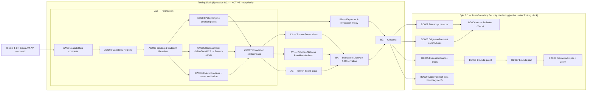

# Engineering Execution Plan

## 0. Version History & Changelog

- v0.31.0 - Restructured the capability/tool restructuring into a contiguous, fully-ticketed **Tooling block (Epics AW–BC)** placed at the front of the queue, implementing the PRD v0.9.0 / Architecture v0.9.0 / TechSpec v0.29.0 capability-orchestration model (ADR-046, ADR-047): AW Capability Orchestration Foundation, AX Tuvren-Server Execution Class, AY Provider-Native & Provider-Mediated Execution Classes, AZ Tuvren-Client Execution Class, BA Invocation Lifecycle & Observation Model, BB Exposure & Invocation Policy Model, BC Tooling Restructuring Closeout. Tuvren-client scope is runtime protocol + attachment seam only (concrete client endpoints stay host deliverables); provider-native/mediated scope is runtime support proven against the AI-SDK-bridged providers. The whole block precedes the trust block and the productionization roadmap, so the former Epic AW (Trust-Boundary Security Hardening) is renumbered to **Epic BD** and the roadmap shifts to **Epics BE–BI**. Supersedes the intra-session v0.30.0 single-epic-plus-reserved-BD–BJ plan.
- v0.29.2 - Closed Epic AV operational telemetry: added `@tuvren/core/telemetry`, framework sink wiring with secret-screening, `@tuvren/telemetry-otel`, the `framework-operational-telemetry` conformance plan, curated runtime re-exports, portability-inventory updates, and verification coverage.
- v0.29.1 - Maintenance alignment after Epic AU closure: compacted completed Epics AM-AU into the closed-work ledger, marked AU closed with `kernel-crash-recovery` evidence, and updated the active graph/DoD accordingly.
- ... [Older history truncated, refer to git logs]

## 1. Executive Summary & Active Critical Path

- **Total Active Story Points:** 253 across the front-loaded Tooling block plus the trust block — the **Tooling block (Epics AW–BC, 217 points)** as the top-priority front of the queue, and **Epic BD (Trust-Boundary Security Hardening, 36 points, formerly Epic AW, with `KRT-BD001` already complete)** sequenced after it. Epics AM (32), AN (13), AO (26), AP (37), AQ (15), AR (15), AS (31), AT (34), AU (23), and AV (24) are closed and retained as a compact audit ledger below.
- **Critical Path:** Foundation first — `KRT-AW001 → KRT-AW002 → KRT-AW003 → KRT-AW004 → KRT-AW007`. Then the execution-class epics build on the foundation (`AX`, `AY`, `AZ`), then the cross-class depth (`BA`, `BB`), then closeout: a representative longest path is `KRT-AW007 → KRT-AY001 → KRT-AY002 → KRT-AY006 → KRT-AY007 → KRT-BA001 → KRT-BA002 → KRT-BA005 → KRT-BC001 → KRT-BC002 → KRT-BC004`. Only after the Tooling block closes does Epic BD run: `KRT-BD002 → KRT-BD004` and `KRT-BD005 → KRT-BD006 → KRT-BD007 → KRT-BD008`, with `KRT-BD009` as an independent close-condition lane (`KRT-BD001` already complete).
- **Planning Assumptions:** The Tooling block (Epics AW–BC) is governed by PRD v0.9.0, Architecture v0.9.0, and TechSpec v0.29.0 (ADR-046, ADR-047); the upstream contracts (`@tuvren/core/capabilities` §3.13, the §4.21 contract) are authored, so the tickets are implementation-ready. Tuvren-client scope is the runtime protocol + attachment seam only — concrete client endpoints (browser extension, desktop, device) remain host-developer deliverables per PRD §6. Provider-native and provider-mediated scope is runtime support proven against today's AI-SDK-bridged providers, with at least one concrete proof per class and additional providers additive later. Epic BD (formerly Epic AW) is governed by PRD v0.8.0 / Architecture v0.8.0 / TechSpec v0.28.x (ADR-042 through ADR-045); it remains active and runs after the Tooling block per product priority. The prior chain (PRD v0.7.0 / Architecture v0.7.0 / TechSpec v0.27.x, ADR-034 through ADR-041, Epics AM-AT) is closed. The Tooling block reframes tool representation within the existing TypeScript line and keeps today's developer-defined tool path working unchanged as the Tuvren-server execution class; it adds no Rust framework/product scope, no new host protocol, no new backend, and no new model-provider family beyond the existing AI SDK bridge. The `product proof gate`, `platform gate`, and `portability gate` from Epic AL remain the staged-gate baseline. The locked external dependency versions per TechSpec §1 still apply.

### Brownfield Continuity Note

- Epics A-AL remain historical context. Epic AL's closure of the staged gates is the foundation this chain extends.
- The current repo proves the host-facing SDK through the serious REPL host (`@tuvren/repl-host`) and its named `proving-host:*` validation lanes; exercises PostgreSQL as a first-class backend; closes the portability gate through `tools/scripts/portability-gate.ts`; and carries the shared primitive surface in `@tuvren/core` with source-bearing runtime implementation in `@tuvren/runtime`. The old contract package handles and `@tuvren/runtime-core` are compatibility shims only.
- Historical closure inventories live under `constitution/archived/` for audit only.

### Sequential Scope Rule

- The Tooling block (Epics AW–BC) restructures how tools are represented within the existing TypeScript line. It adds no Rust scope, no new model-provider family beyond the existing AI SDK bridge, no new host protocol, and no new backend. It keeps the existing `defineTool` / Tool Execution Gateway path working unchanged as the Tuvren-server execution class.
- The Tuvren-client execution class (Epic AZ) lands the runtime-side lease/dispatch/result protocol and the attachment seam only. Concrete client endpoints (browser extension, desktop app, device agent) are host-developer deliverables and are out of scope for the runtime per PRD §6.
- Provider-native and provider-mediated execution (Epic AY) is bounded by what the AI-SDK-bridged providers actually expose in 2026; the runtime gains representation, configuration, attribution, and observation for those classes with one concrete proof each, and additional providers are additive scope.
- No Rust framework or Rust product-line expansion is active. No first-class Tuvren model-provider packages are active beyond the AI SDK bridge; the MCP client remains a tool source / binding mechanism, not a model provider.
- No additional host protocols beyond the canonical stream and SSE surfaces are active. Public package publication remains deferred (Epic BG in the roadmap).
- The production-trust block (now Epic BD) hardens the existing TypeScript line only and runs after the Tooling block. Epic AU's fault-injection seam is closed and testkit-only; Epic AV's telemetry surface is closed; execution bounds and secret isolation (Epic BD) add framework-owned guards and credential-edge confinement without altering kernel semantics.

### Planning Heuristic

- Prefer ticket slices that fit focused solo-dev execution while preserving strict gates around product proof, backend rigor, and conformance truthfulness.
- Treat “green because a private harness succeeds” as insufficient evidence once a proving-host or conformance ticket exists on the critical path.

## 2. Project Phasing & Iteration Strategy

### Current Active Scope

- **Block 5 — Tooling restructuring (Epics AW–BC): ACTIVE, top priority.** The complete capability-orchestration restructuring, sequenced ahead of everything else. It separates the model-facing Tool Surface from the underlying Capability, implements all four execution classes (provider-native, provider-mediated, Tuvren-server, Tuvren-client), Bindings, Endpoints, exposure-time and invocation-time Policy, the per-class Observation/event model, and MCP-as-binding classification, and preserves the invariant that every model-visible tool call resolves to a policy-checked capability invocation against a known execution class. The block is "finished" when all four execution classes are orchestrated by the runtime with honest per-class observation/control limits, cross-class conformance passes, and the framework specification states the model.
  - **AW — Capability Orchestration Foundation:** the contracts, Capability Registry, Binding & Endpoint Resolver, Capability Policy Engine decision points, execution-class/owner attribution, the invariant, and back-compat (`defineTool` → Tuvren-server).
  - **AX — Tuvren-Server Execution Class:** full server lifecycle (input/output validation, retry, cancel, trace, audit, tenant isolation, rate-limit, server-side MCP binding, server sandbox).
  - **AY — Provider-Native & Provider-Mediated Execution Classes:** provider-native enablement/attribution and provider-mediated (provider-invoked remote MCP) through the AI SDK bridge, plus the provider continuation-state model, with one concrete proof each.
  - **AZ — Tuvren-Client Execution Class:** the leased client-endpoint protocol and attachment seam (runtime side only), client-side MCP, availability/staleness/partial-observability.
  - **BA — Invocation Lifecycle & Observation Model:** the cross-class invocation lifecycle and the full observation/event taxonomy depth.
  - **BB — Exposure & Invocation Policy Model:** policy depth (data residency, risk classification, presence, idempotency/retry, credential boundaries, composition/precedence).
  - **BC — Tooling Restructuring Closeout:** cross-class integration conformance, the framework-spec "Capability Orchestration" section, portability inventory, and the clean `bun run verify` that proves the tooling aspect is finished.
- **Block 4 — Production trust remainder (Epic BD, formerly Epic AW): active, sequenced after the Tooling block.** Hardens execution bounds with a typed `execution_bound_exceeded` terminal result, secret isolation across durable/telemetry/transcript surfaces, and verification that approval gates are non-bypassable and untrusted MCP/tool inputs are validated. `KRT-BD001` (telemetry secret-screening helpers) is already complete.
- **Block 1 — Boundary correctness gate (Epics AM, AN, AO):** closed. `thread.list`, base-handle `awaitResult`, and the five-method `TuvrenRuntime` durable-read surface.
- **Block 2 — Curated surface + ergonomics (Epics AP, AQ, AR):** closed. `@tuvren/core` consolidation, schema-agnostic `defineTool`, and the `createTuvren({...})` batteries-included factory.
- **Block 3 — Capability spikes (Epics AS, AT):** closed. `@tuvren/mcp-client` as a first-class tool source and the consolidated REPL reference host with headless mode and transcript replay.

### Future / Deferred Scope

- Rust framework and Rust product-line work — still blocked.
- First-class Tuvren-owned model-provider packages beyond the TypeScript AI SDK bridge.
- Cross-tenant thread search, multi-tenant ACLs, full-text indexed querying through the embeddable SDK (deferred to a future hosted/server projection).
- Server or REST projection of the durable-read surface (same future projection).
- Model Context Protocol server-side projection — Tuvren as an MCP server. Only the client side and the MCP-as-binding classification are in scope.
- Concrete client endpoint products (browser extension, desktop app, device agent) — the runtime orchestrates and leases attached client endpoints (Epic AZ) but does not ship the endpoints themselves.
- Schema adapters beyond Zod, Standard Schema, and wrapped JSON Schema in the core surface.
- Driver hot-swap or additional drivers beyond the ReAct baseline.
- Additional host protocols beyond the canonical stream and SSE surfaces; additional official backends beyond memory, SQLite, and PostgreSQL.
- Public package publication and final long-lived package curation (Epic BG in the roadmap below).

#### Post-Tooling / Post-Trust Roadmap (Epics BE–BI) — Named, Not Yet Ticketed

These epics are the agreed direction after the Tooling block and the trust block, toward host adoption plus first-party dogfooding (PRD §1.4). They are recorded with enough scope to anchor a future planning session; they are intentionally NOT decomposed into tickets yet.

- **Epic BE — Performance Characterization & Regression Budgets.** Benchmark the hot paths, publish documented performance budgets, and wire a `bench` regression gate into the canonical verification path. Prerequisite: the durability guarantees from Epic AU are proven first.
- **Epic BF — Public API Surface Freeze & Semver Discipline.** Define the stable public API of `@tuvren/core` (including the new `/capabilities` surface) + `@tuvren/runtime`. Run after the reference application (BI) so the surface is frozen against real usage friction.
- **Epic BG — Publication & Release Engineering.** npm publication of the curated packages, changesets / versioning, CI release pipeline, and provenance. Gated on BF's surface freeze.
- **Epic BH — Documentation & Onboarding.** Docs site, getting-started, cookbook, and API reference.
- **Epic BI — Reference Application (Dogfood Target).** A real, non-trivial application built end-to-end on Tuvren that exercises the capability-orchestration model and surfaces API friction feeding back into BF.

### Archived or Already Completed Scope

- Epic AH completed the constitutional authority reset; the live authority chain is the four constitutional documents plus explicit support inputs.
- Epics A-Q established the baseline TypeScript runtime, ReAct path, provider bridge, stream adapters, playground host, and release-hardening work.
- Epics AI–AL completed the high-level SDK audit, the serious REPL proving host, the PostgreSQL platform gate, and the portability-gate closure.
- Epics R-AG established the multi-language transition foundation, shared conformance architecture, and kernel interop.
- Epics AM-AV are summarized in the completed-work ledger in §4.
- The active forward path is the Tooling block (Epics AW–BC) followed by the trust block (Epic BD); see Current Active Scope.

## 3. Build Order (Mermaid)



## 4. Ticket List

### Completed Work Ledger (Epics AM–AV)

Completed ticket detail is removed from the active execution plan and retained through git history plus archived support artifacts. This ledger is the live audit summary for recently closed execution scope.

| Epic | Points | Closed Outcome | Evidence Anchor |
| --- | ---: | --- | --- |
| AM | 32 | Added `thread.list`, corrected the kernel operation narrative to 30 operations, and covered TypeScript/Rust/gRPC paths. | `kernel-protocol.thread.enumeration`; kernel protocol authority packet |
| AN | 13 | Promoted `ExecutionHandle.awaitResult` to the base handle with `ExecutionResult`. | `runtime-api-handle-terminal-value` |
| AO | 26 | Added the five-method `TuvrenRuntime` durable-read surface and removed the proving-host kernel-inspector seam. | `runtime-api-durable-reads` |
| AP | 37 | Consolidated shared primitives into `@tuvren/core`, folded source-bearing runtime code into `@tuvren/runtime`, kept deprecated shims for one cycle. | `boundaries/shared/contracts/core/spec/authority-packet.json` |
| AQ | 15 | Added schema-agnostic `defineTool`, `FlexibleSchema`, `asSchema`, `jsonSchema`, `zodSchema`, `standardSchema`. | `runtime-api-schema-authoring` |
| AR | 15 | Added the `createTuvren({...})` batteries-included factory, lifecycle cleanup, and curated runtime re-exports. | `runtime-api-batteries-included` |
| AS | 31 | Added `@tuvren/mcp-client` as a first-class tool source over stdio and Streamable HTTP-backed public `http-sse` transport. | `providers-mcp-client`; MCP authority packet |
| AT | 34 | Consolidated the reference host on the REPL CLI; headless stdin mode, streaming JSONL, transcript capture/replay; retired `@tuvren/playground-host`. | `proving-host-headless-transcript-replay` |
| AU | 23 | Proved durability and recovery under failure with a testkit-only fault-injection seam and the Crash Recovery Invariant. | `kernel.crash-recovery.*`; `createFaultInjectingBackend` |
| AV | 24 | Added first-class operational telemetry with `@tuvren/core/telemetry`, framework emission and secret screening, `@tuvren/telemetry-otel`. | `framework-operational-telemetry` |

### Epic AW — Capability Orchestration Foundation (KRT)

**Status:** Active, top priority. Foundation for the whole Tooling block. Realizes ADR-046 / ADR-047 against the upstream contracts (`@tuvren/core/capabilities` §3.13, the §4.21 contract). Establishes the conceptual invariant: **every model-visible tool call resolves to a policy-checked capability invocation against a known execution class.** The execution-class endpoint behaviors land in Epics AX (Tuvren-server), AY (provider classes), and AZ (Tuvren-client); this epic makes the Tuvren-server class fully work via back-compat and stands up the registry, resolver, policy, and attribution seams the rest depend on.

**KRT-AW001 `@tuvren/core/capabilities` Contract Types + Merged Packet Section**
- **Type:** Feature
- **Effort:** 5
- **Dependencies:** None
- **Capability / Contract Mapping:** PRD `CAP-P0-056`, `CAP-P0-057`; TechSpec ADR-046, §3.13, §4.21
- **Description:** Add the `./capabilities` subpath to `@tuvren/core` exporting the §3.13 types (`ExecutionClass`, `EndpointKind`, `Capability`, `ToolSurface`, `Endpoint`, `Binding`, `CapabilityObservation`, `ExposureDecision`, `InvocationDecision`, `InvocationOwner`, `CapabilityInvocationAttribution`). Add the `capabilities` binding section to the merged shared-core authority packet, generate the capability JSON Schemas, bump the packet version, and add the 11th tsup entry. Contract types only — no runtime behavior.
- **Acceptance Criteria (Gherkin):**
```gherkin
Given the §3.13 capability-orchestration shapes and §4.21 contract
When the @tuvren/core/capabilities subpath is added
Then the §3.13 types are exported from @tuvren/core/capabilities
And ExecutionClass is the closed set provider-native, provider-mediated, tuvren-server, and tuvren-client
And the merged shared-core authority packet gains a capabilities binding section and a bumped version
And the generated capability JSON Schema artifacts are committed and formatter-clean
And typecheck passes and no existing @tuvren/core export changes
```

**KRT-AW002 Capability Registry**
- **Type:** Feature
- **Effort:** 8
- **Dependencies:** `KRT-AW001`
- **Capability / Contract Mapping:** PRD `CAP-P0-056`; TechSpec ADR-046, §4.21; Architecture Capability Registry container
- **Description:** Implement the Capability Registry in `@tuvren/runtime`: hold capabilities and the model-facing tool surfaces that present them, drawn from tool sources and (later) provider declarations; keep Tool Surface distinct from Capability so one capability can back multiple surfaces and one surface can resolve to different capabilities across providers; produce the eligible-surface candidate set for an agent segment before policy is applied.
- **Acceptance Criteria (Gherkin):**
```gherkin
Given the capability contract types exist
When the Capability Registry is implemented
Then the registry holds capabilities and the tool surfaces that present them, keeping surface distinct from capability
And one capability can back multiple tool surfaces and one surface can map to different capabilities by context
And the registry produces an eligible-surface candidate set per agent segment
And unit coverage proves the surface-versus-capability separation
```

**KRT-AW003 Binding & Endpoint Resolver**
- **Type:** Feature
- **Effort:** 8
- **Dependencies:** `KRT-AW001`, `KRT-AW002`
- **Capability / Contract Mapping:** PRD `CAP-P0-057`, `CAP-P0-058`, `CAP-P0-059`, `CAP-P1-062`; TechSpec ADR-046, §3.13, §4.21
- **Description:** Implement the Binding & Endpoint Resolver in `@tuvren/runtime`: resolve each capability to exactly one execution class and one endpoint based on provider, model, policy, endpoint availability, and configuration; support multiple candidate bindings per capability and select/admit one per context; classify MCP bindings by who runs the server; route a resolved invocation to its execution-class endpoint seam. Add the `capability_binding_unavailable` `TuvrenRuntimeError` (in `@tuvren/core/errors`) for when no admissible binding exists or an execution-class endpoint is not yet attached. Preserve the conceptual invariant.
- **Acceptance Criteria (Gherkin):**
```gherkin
Given the Capability Registry exists
When the Binding & Endpoint Resolver is implemented
Then every model-visible tool call resolves to exactly one execution class and one endpoint
And a capability with multiple candidate bindings resolves to the binding admitted for the active context
And MCP bindings are classified by who invokes or runs the server rather than as their own execution class
And an unresolvable or unattached binding yields a capability_binding_unavailable error surfaced as a tool.result with isError true
And the conceptual invariant holds for every routed invocation
```

**KRT-AW004 Capability Policy Engine (Exposure-Time + Invocation-Time Decision Points)**
- **Type:** Feature
- **Effort:** 8
- **Dependencies:** `KRT-AW002`, `KRT-AW003`
- **Capability / Contract Mapping:** PRD `CAP-P0-060`, `CAP-P0-016`, `CAP-P0-017`; TechSpec ADR-046, §4.21; Architecture Capability Policy Engine container
- **Description:** Implement the Capability Policy Engine in `@tuvren/runtime` with two framework-owned decision points above driver discretion: exposure-time (gating the registry's exposed surface set so withheld surfaces are never rendered to the model) and invocation-time (gating admitted invocations). Wire the baseline dimensions (provider/model compatibility, permissions, endpoint availability for exposure; approval, credential boundary for invocation); the deeper policy dimensions land in Epic BB. Invocation denials surface as `tool.result` with `isError: true`. Keep existing approval gating non-bypassable.
- **Acceptance Criteria (Gherkin):**
```gherkin
Given the registry and resolver exist
When the Capability Policy Engine is implemented
Then exposure-denied tool surfaces are never rendered to the model
And invocation-denied capabilities are surfaced as tool.result with isError true rather than executed
And both decision points are framework-owned above driver discretion
And existing approval gating remains non-bypassable at the invocation-time decision point
And unit coverage proves exposure withholding and invocation denial for representative baseline policies
```

**KRT-AW005 Back-Compat Reclassification: `defineTool` and MCP → Tuvren-Server**
- **Type:** Feature
- **Effort:** 5
- **Dependencies:** `KRT-AW003`
- **Capability / Contract Mapping:** PRD `CAP-P0-056`, `CAP-P1-062`; TechSpec ADR-047, §4.21
- **Description:** Reclassify today's `TuvrenToolDefinition` (`execute`) tools as Tuvren-server capabilities bound to the in-process endpoint, and `@tuvren/mcp-client`-advertised tools as capabilities reachable through an `mcp-server` endpoint binding under the Tuvren-server class. Route both through the resolver to the existing Tool Execution Gateway so they execute exactly as today. No host code change.
- **Acceptance Criteria (Gherkin):**
```gherkin
Given the registry and resolver exist
When the back-compat reclassification is implemented
Then a developer-defined defineTool tool is a Tuvren-server capability bound to the in-process endpoint and executes exactly as today
And an MCP-advertised tool is a capability reachable through an mcp-server endpoint binding under the Tuvren-server class
And existing host code that registers and runs defineTool and MCP tools compiles and runs unchanged
And the existing tool, approval, and tool-input-validation behavior is preserved
```

**KRT-AW006 Execution-Class + Owner Attribution on Canonical Events and Telemetry**
- **Type:** Feature
- **Effort:** 5
- **Dependencies:** `KRT-AW003`
- **Capability / Contract Mapping:** PRD `CAP-P0-061`; TechSpec ADR-046, §3.10, §4.5, §4.21
- **Description:** Add the execution-class and `owner` (`provider` | `tuvren`) attribution plus `CapabilityObservation` to canonical tool/capability invocation events (§4.5) and operational telemetry (§3.10), additively (new optional fields). The runtime must not expose a cancel/retry/audit affordance for a class that does not grant it. Secret isolation holds for every class.
- **Acceptance Criteria (Gherkin):**
```gherkin
Given the resolver classifies each invocation
When the execution-class and owner attribution is added to canonical events and telemetry
Then tool/capability invocation events and telemetry carry execution class, owner, and the CapabilityObservation
And the runtime exposes no cancel, retry, or audit affordance for an invocation whose class does not grant it
And no provider, MCP, or client credential appears in any event, telemetry attribute, or durable record
And the attribution is additive so existing event-stream and telemetry consumers are unaffected
```

**KRT-AW007 Capability-Orchestration Foundation Conformance**
- **Type:** Feature
- **Effort:** 5
- **Dependencies:** `KRT-AW004`, `KRT-AW005`, `KRT-AW006`
- **Capability / Contract Mapping:** PRD `CAP-P0-056` through `CAP-P0-061`; TechSpec §4.21, §5.7.1
- **Description:** Add a `runtime-api-capability-orchestration` check set to `boundaries/framework/conformance/plans/runtime-api-callables-extended.json` asserting the foundation guarantees: the conceptual invariant, surface-vs-capability separation, exposure-time withholding, invocation-time denial as `tool.result` `isError`, execution-class/owner attribution, and the back-compat that a `defineTool` tool resolves to the Tuvren-server class. Picked up by `bun run conformance` automatically.
- **Acceptance Criteria (Gherkin):**
```gherkin
Given the foundation registry, resolver, policy engine, attribution, and back-compat are implemented
When the capability-orchestration foundation conformance check set is added
Then the check set asserts every model-visible tool call resolves to a policy-checked capability invocation against a known execution class
And the check set asserts surface is kept distinct from capability and exposure-denied surfaces are not shown to the model
And the check set asserts invocation denial surfaces as tool.result with isError true and that events carry execution-class and owner attribution
And the check set asserts a defineTool tool is the Tuvren-server execution class for back-compatibility
And bun run conformance includes the new check set automatically
```

### Epic AX — Tuvren-Server Execution Class (KRT)

**Status:** Active, after Epic AW. Deepens the Tuvren-server execution class from today's tool path into the full-control class the model promises (validate, retry, cancel, trace, audit, isolate, rate-limit, server-side MCP, server sandbox). Realizes ADR-046 / ADR-047 and the §4.21 Tuvren-server dispatch contract.

**KRT-AX001 Server Invocation Lifecycle: Input + Output Validation**
- **Type:** Feature
- **Effort:** 5
- **Dependencies:** `KRT-AW007`
- **Capability / Contract Mapping:** PRD `CAP-P1-015`, `CAP-P0-013`; TechSpec §4.21
- **Description:** Implement the full Tuvren-server invocation lifecycle in the Tool Execution Gateway as the server execution-class endpoint: validate inputs against the declared contract before execution and validate outputs against the declared result shape before surfacing, with canonical error results on failure.
- **Acceptance Criteria (Gherkin):**
```gherkin
Given a capability bound to the Tuvren-server execution class
When the server invocation lifecycle is implemented
Then inputs are validated against the declared contract before execution
And outputs are validated against the declared result shape before being surfaced
And a validation failure surfaces as tool.result with isError true carrying tool_input_validation_failed or a result-validation error
And a within-contract invocation executes and returns its result unchanged from today's behavior
```

**KRT-AX002 Idempotent Retry and Cancellation for Server Invocations**
- **Type:** Feature
- **Effort:** 5
- **Dependencies:** `KRT-AX001`
- **Capability / Contract Mapping:** PRD `CAP-P0-061`; TechSpec ADR-046, §4.21
- **Description:** Add framework-owned retry of idempotent server-side invocations and cooperative cancellation that propagates an abort signal into in-flight server tool work, with late completions after cancellation ignored. Retry is gated by the capability's declared idempotency; non-idempotent capabilities are never silently retried.
- **Acceptance Criteria (Gherkin):**
```gherkin
Given a Tuvren-server capability invocation
When retry and cancellation are implemented
Then an idempotent server invocation is retried on a retriable failure up to the configured limit
And a non-idempotent server invocation is never silently retried
And cancellation propagates an abort signal into in-flight server tool work
And a late completion after cancellation is ignored and cannot mutate the invocation
```

**KRT-AX003 Tenant Isolation and Rate-Limiting for Server Capabilities**
- **Type:** Feature
- **Effort:** 5
- **Dependencies:** `KRT-AX001`
- **Capability / Contract Mapping:** PRD `CAP-P0-060`, `CAP-P0-061`; TechSpec §4.21
- **Description:** Add tenant-scoped isolation and configurable rate-limiting to the Tuvren-server execution class so server-side capability work for one runtime instance/tenant cannot exceed its configured call budget or observe another tenant's invocation state.
- **Acceptance Criteria (Gherkin):**
```gherkin
Given server-side capabilities and a configured rate limit
When tenant isolation and rate-limiting are implemented
Then server-side invocations are scoped so one tenant cannot observe another tenant's invocation state
And server-side invocations beyond the configured rate are throttled or rejected with a typed result rather than executed unbounded
And a within-budget invocation executes normally
```

**KRT-AX004 Server-Side MCP Binding and Server Sandbox Endpoint**
- **Type:** Feature
- **Effort:** 5
- **Dependencies:** `KRT-AX001`
- **Capability / Contract Mapping:** PRD `CAP-P0-057`, `CAP-P1-062`; TechSpec §4.21
- **Description:** Implement the server-side MCP binding (Tuvren runs the MCP client server-side as a Tuvren-server binding) and a server-hosted sandbox endpoint kind for isolated server-side execution (e.g. `code.execute` in a server sandbox), both routed through the Binding & Endpoint Resolver as Tuvren-server endpoints.
- **Acceptance Criteria (Gherkin):**
```gherkin
Given the Tuvren-server execution class and the resolver
When the server-side MCP binding and server sandbox endpoint are implemented
Then an MCP server invoked by Tuvren server-side resolves as a Tuvren-server binding with endpoint kind mcp-server
And a server sandbox endpoint executes isolated server-side capability work as a Tuvren-server binding
And both expose full Tuvren-server lifecycle observation and control
```

**KRT-AX005 Trace and Audit of Server-Side Invocations**
- **Type:** Feature
- **Effort:** 3
- **Dependencies:** `KRT-AX001`
- **Capability / Contract Mapping:** PRD `CAP-P0-061`; TechSpec ADR-046, §3.10, §4.21
- **Description:** Emit full-lifecycle trace and audit signals for Tuvren-server invocations (the only class with full observability), keyed to runtime lineage and the §4.21 `CapabilityObservation`, without leaking secrets.
- **Acceptance Criteria (Gherkin):**
```gherkin
Given Tuvren-server invocations execute with full lifecycle control
When trace and audit are implemented
Then each server invocation emits lifecycle trace and audit signals keyed to runtime lineage
And the CapabilityObservation for the server class reports full observe/persist/resume/cancel/retry/audit
And no secret material appears in the trace or audit signals
```

**KRT-AX006 Tuvren-Server Execution-Class Conformance**
- **Type:** Feature
- **Effort:** 5
- **Dependencies:** `KRT-AX002`, `KRT-AX003`, `KRT-AX004`, `KRT-AX005`
- **Capability / Contract Mapping:** PRD `CAP-P0-057`; TechSpec §4.21, §5.7
- **Description:** Add a `tuvren-server-execution-class` check set asserting input/output validation, idempotent retry and cancellation, rate-limit throttling, server-side MCP binding classification, the server sandbox endpoint, and full-lifecycle observation. Picked up by `bun run conformance`.
- **Acceptance Criteria (Gherkin):**
```gherkin
Given the Tuvren-server execution class is implemented
When the tuvren-server-execution-class check set is added
Then it asserts input and output validation, idempotent-only retry, and cancellation with late-completion ignoring
And it asserts rate-limit throttling and tenant-scoped isolation
And it asserts the server-side MCP binding and server sandbox endpoint resolve as Tuvren-server bindings with full-lifecycle observation
And bun run conformance includes the new check set automatically
```

### Epic AY — Provider-Native & Provider-Mediated Execution Classes (KRT)

**Status:** Active, after Epic AW. Lands the two provider-owned execution classes through the existing AI SDK bridge: provider-native (the provider executes the tool) and provider-mediated (the provider invokes a developer endpoint, e.g. provider-invoked remote MCP), plus the provider continuation-state model. Scope is bounded by what the bridged providers expose in 2026, with one concrete proof per class.

**KRT-AY001 Spike: Provider-Native & Provider-Mediated Surface Across the AI SDK Bridge**
- **Type:** Spike
- **Effort:** 3
- **Dependencies:** `KRT-AW007`
- **Capability / Contract Mapping:** PRD `CAP-P0-057`, `CAP-P1-062`; TechSpec ADR-046
- **Description:** Time-boxed investigation of what the AI-SDK-bridged providers actually expose in 2026 for provider-native tools (provider-hosted search, code execution, etc.) and provider-mediated tools (provider-invoked remote endpoints / remote MCP), including the events/results Tuvren can observe. Output: a concrete capability matrix that pins which concrete proofs `KRT-AY006` can deliver and which degrade to a documented representative integration.
- **Acceptance Criteria (Gherkin):**
```gherkin
Given the AI SDK bridge and the providers it reaches today
When the provider-native and provider-mediated surface is investigated
Then a capability matrix records which bridged providers expose provider-native tools and what events/results are observable
And the matrix records which bridged providers expose provider-mediated tool invocation and what is observable
And the matrix pins the concrete proofs KRT-AY006 will deliver and any class that must degrade to a documented representative integration
And the findings are captured as a support artifact referenced by this epic
```

**KRT-AY002 Provider-Native Representation, Enablement, and Configuration**
- **Type:** Feature
- **Effort:** 8
- **Dependencies:** `KRT-AY001`
- **Capability / Contract Mapping:** PRD `CAP-P0-057`; TechSpec ADR-046, §3.13, §4.4, §4.21
- **Description:** Represent provider-native capabilities and enable/configure them on the model request through the Provider Gateway / AI SDK bridge. The provider owns execution; Tuvren owns exposure, configuration, and policy. Route provider-native bindings through the resolver to the Provider Gateway endpoint.
- **Acceptance Criteria (Gherkin):**
```gherkin
Given the provider surface matrix from the spike
When provider-native representation and enablement are implemented
Then a provider-native capability can be enabled and configured on the model request through the Provider Gateway
And the provider-native binding routes to the provider-runtime endpoint via the resolver
And Tuvren applies exposure-time and invocation-time policy before the provider request is sent
And the runtime does not attempt to execute a provider-native tool locally
```

**KRT-AY003 Provider-Native Event/Result Recording + Attribution**
- **Type:** Feature
- **Effort:** 5
- **Dependencies:** `KRT-AY002`
- **Capability / Contract Mapping:** PRD `CAP-P0-061`; TechSpec ADR-046, §3.10, §4.5, §4.21
- **Description:** Record provider-native invocations from provider-exposed events and results only, tagged `owner: "provider"` with provider-native observation limits, on the canonical stream and telemetry. The runtime must not claim cancel/retry/audit it does not have for this class.
- **Acceptance Criteria (Gherkin):**
```gherkin
Given provider-native capabilities are enabled
When provider-native event and result recording is implemented
Then provider-native invocations are recorded from provider-exposed events and results only
And recorded events carry owner provider and the provider-native observation limits
And the runtime exposes no cancel, retry, or audit affordance for provider-native invocations
And no provider credential appears in any recorded event, telemetry attribute, or durable record
```

**KRT-AY004 Provider-Mediated Capability Representation (Provider-Invoked Remote Endpoints)**
- **Type:** Feature
- **Effort:** 8
- **Dependencies:** `KRT-AY001`
- **Capability / Contract Mapping:** PRD `CAP-P0-057`, `CAP-P1-062`; TechSpec ADR-046, §4.21
- **Description:** Represent provider-mediated developer-provided capabilities where the developer supplies the endpoint but the provider invokes it (e.g. provider-invoked remote MCP). Configure the mediated relationship and exposure/invocation policy; record what the provider/tool protocol exposes (partial observability); do not assume full invocation-lifecycle control. Classify provider-mediated MCP as an MCP binding under the provider-mediated class.
- **Acceptance Criteria (Gherkin):**
```gherkin
Given the provider surface matrix from the spike
When provider-mediated representation is implemented
Then a provider-mediated capability configures the mediated relationship between the provider and the developer endpoint
And provider-mediated MCP is classified as an MCP binding under the provider-mediated execution class
And the runtime records what the provider/tool protocol exposes as partial observability without assuming full lifecycle control
And exposure-time and invocation-time policy are applied before the mediated tool is configured for the request
```

**KRT-AY005 Provider Continuation-State Model**
- **Type:** Feature
- **Effort:** 5
- **Dependencies:** `KRT-AY002`
- **Capability / Contract Mapping:** PRD `CAP-P0-057`; TechSpec ADR-046, §4.4
- **Description:** Implement the provider continuation-state model: preserve the opaque, non-secret provider continuity artifacts required for correct multi-turn provider-owned tool operation, kept at the Provider Gateway edge and excluded from durable lineage, telemetry, and transcripts as secrets are.
- **Acceptance Criteria (Gherkin):**
```gherkin
Given provider-owned invocations that span turns
When the provider continuation-state model is implemented
Then opaque non-secret provider continuity artifacts are preserved as required for correct multi-turn operation
And those artifacts are held at the Provider Gateway edge and are not treated as secrets
And no credential or secret continuity material reaches durable lineage, telemetry, or transcripts
```

**KRT-AY006 Concrete Provider-Native and Provider-Mediated Proofs**
- **Type:** Feature
- **Effort:** 5
- **Dependencies:** `KRT-AY003`, `KRT-AY004`
- **Capability / Contract Mapping:** PRD `CAP-P0-057`, `CAP-P0-058`; TechSpec §5.7
- **Description:** Deliver at least one concrete working provider-native integration and one concrete working provider-mediated integration against a bridged provider per the spike matrix. Where the spike found no bridged provider supports a class in 2026, deliver a documented representative integration test plus a recorded gap rather than a false claim.
- **Acceptance Criteria (Gherkin):**
```gherkin
Given the spike capability matrix and the implemented provider classes
When the concrete proofs are delivered
Then one provider-native capability works end-to-end against a bridged provider that supports it
And one provider-mediated capability works end-to-end against a bridged provider that supports it
And any class with no supporting bridged provider in 2026 is covered by a documented representative integration test and a recorded gap rather than a false claim
And the conceptual invariant holds for each proven invocation
```

**KRT-AY007 Provider-Native + Provider-Mediated Conformance**
- **Type:** Feature
- **Effort:** 5
- **Dependencies:** `KRT-AY006`
- **Capability / Contract Mapping:** PRD `CAP-P0-057`, `CAP-P0-061`, `CAP-P1-062`; TechSpec §4.21, §5.7
- **Description:** Add `provider-native-execution-class` and `provider-mediated-execution-class` check sets (to the framework and/or `providers-mcp-client.json` plans) asserting attribution (`owner: provider`), partial-observability limits, MCP-binding classification under provider-mediated, and that the runtime never claims control it lacks. Picked up by `bun run conformance`.
- **Acceptance Criteria (Gherkin):**
```gherkin
Given the provider-native and provider-mediated classes are implemented and proven
When the provider-class conformance check sets are added
Then they assert provider-native and provider-mediated invocations carry owner provider and their observation limits
And they assert provider-mediated MCP is classified as an MCP binding under the provider-mediated class
And they assert the runtime exposes no control affordance it does not have for these classes
And bun run conformance includes the new check sets automatically
```

### Epic AZ — Tuvren-Client Execution Class (KRT)

**Status:** Active, after Epic AW. Lands the runtime side of the Tuvren-client execution class: the leased client-endpoint protocol and attachment seam, client-side MCP, and availability/staleness/partial-observability handling. Concrete client endpoints (browser extension, desktop app, device agent) are host-developer deliverables and are out of scope per PRD §6; this epic makes the runtime able to orchestrate any conforming attached endpoint.

**KRT-AZ001 Client Endpoint Attachment Seam and Lease Model**
- **Type:** Feature
- **Effort:** 8
- **Dependencies:** `KRT-AW007`
- **Capability / Contract Mapping:** PRD `CAP-P1-063`; TechSpec ADR-046, §4.21; Architecture Client Endpoint Boundary container
- **Description:** Implement the Client Endpoint Boundary in `@tuvren/runtime`: a seam to attach a client endpoint to a runtime instance, a lease model that tracks endpoint availability and lease validity, and registration of the endpoint's advertised client-side capabilities into the Capability Registry as Tuvren-client bindings.
- **Acceptance Criteria (Gherkin):**
```gherkin
Given the foundation registry and resolver
When the client endpoint attachment seam and lease model are implemented
Then a host can attach a conforming client endpoint to a runtime instance and the runtime tracks its availability and lease validity
And the endpoint's advertised capabilities register as Tuvren-client bindings in the Capability Registry
And a capability with a Tuvren-client binding resolves to the attached client endpoint when its lease is valid
And no concrete client endpoint implementation is required by the runtime itself
```

**KRT-AZ002 Invocation Dispatch Envelope and Client-Reported Result Capture**
- **Type:** Feature
- **Effort:** 8
- **Dependencies:** `KRT-AZ001`
- **Capability / Contract Mapping:** PRD `CAP-P1-063`, `CAP-P0-061`; TechSpec ADR-046, §4.21
- **Description:** Implement dispatch of an invocation envelope to an attached client endpoint and capture of the client-reported result, with Tuvren owning orchestration and policy while the client owns environmental execution. Surface the client-reported result as a canonical capability result.
- **Acceptance Criteria (Gherkin):**
```gherkin
Given an attached client endpoint with a valid lease
When dispatch and result capture are implemented
Then the runtime dispatches an invocation envelope to the attached endpoint after invocation-time policy admits it
And the client-reported result is captured and surfaced as a canonical capability result
And the runtime owns orchestration and policy while the client endpoint owns environmental execution
And no client credential or environment secret reaches durable lineage, events, telemetry, or transcripts
```

**KRT-AZ003 Availability, Staleness, and Late-Completion Handling**
- **Type:** Feature
- **Effort:** 5
- **Dependencies:** `KRT-AZ002`
- **Capability / Contract Mapping:** PRD `CAP-P1-063`; TechSpec ADR-046, §4.21; Architecture Client-Endpoint Lease Model
- **Description:** Handle the unhappy paths of leased client execution: an unavailable endpoint yields a typed `capability_binding_unavailable` outcome rather than a block or double-dispatch; a result arriving after the lease expires is ignored and cannot mutate the invocation.
- **Acceptance Criteria (Gherkin):**
```gherkin
Given a Tuvren-client binding
When availability and staleness handling are implemented
Then an unavailable client endpoint yields a typed capability_binding_unavailable outcome rather than blocking or double-dispatching
And a client-reported result arriving after the lease expires is ignored and cannot mutate the invocation
And a within-lease invocation completes normally
```

**KRT-AZ004 Client-Side MCP Binding**
- **Type:** Feature
- **Effort:** 5
- **Dependencies:** `KRT-AZ002`
- **Capability / Contract Mapping:** PRD `CAP-P1-062`, `CAP-P1-063`; TechSpec ADR-046, §4.21
- **Description:** Support an MCP server that a client endpoint runs or reaches (client-side MCP) as an MCP binding under the Tuvren-client execution class, classified by the fact that the client endpoint invokes/runs the server.
- **Acceptance Criteria (Gherkin):**
```gherkin
Given an attached client endpoint that runs or reaches an MCP server
When the client-side MCP binding is implemented
Then a client-run MCP server is classified as an MCP binding under the Tuvren-client execution class
And its invocations are dispatched and observed through the client dispatch/result envelope
And it is never reclassified as a Tuvren-server or provider-mediated binding
```

**KRT-AZ005 Partial-Observability Model for Client Invocations**
- **Type:** Feature
- **Effort:** 3
- **Dependencies:** `KRT-AZ002`
- **Capability / Contract Mapping:** PRD `CAP-P0-061`, `CAP-P1-063`; TechSpec ADR-046, §3.10, §4.5
- **Description:** Record Tuvren-client invocations from the dispatch/result envelope plus client-reported details, tagged `owner: "tuvren"` (Tuvren-orchestrated, client-executed) with the partial-observability limits of the class, on the canonical stream and telemetry.
- **Acceptance Criteria (Gherkin):**
```gherkin
Given Tuvren-client invocations
When the partial-observability model is implemented
Then client invocations are recorded from the dispatch/result envelope plus client-reported details
And recorded events carry the Tuvren-client observation limits and Tuvren orchestration ownership
And the runtime does not claim observation it does not have for the client-executed work
```

**KRT-AZ006 Tuvren-Client Execution-Class Conformance**
- **Type:** Feature
- **Effort:** 5
- **Dependencies:** `KRT-AZ003`, `KRT-AZ004`, `KRT-AZ005`
- **Capability / Contract Mapping:** PRD `CAP-P1-063`; TechSpec §4.21, §5.7
- **Description:** Add a `tuvren-client-execution-class` check set using a mock client endpoint, asserting attach/lease, dispatch/result, unavailability and staleness handling, client-side MCP classification, and partial observability. Picked up by `bun run conformance`.
- **Acceptance Criteria (Gherkin):**
```gherkin
Given the Tuvren-client execution class is implemented
When the tuvren-client-execution-class check set is added using a mock client endpoint
Then it asserts attach/lease, dispatch of the invocation envelope, and client-reported result capture
And it asserts unavailability yields capability_binding_unavailable and stale late completions are ignored
And it asserts client-side MCP is classified under the Tuvren-client class and partial-observability limits are honored
And bun run conformance includes the new check set automatically
```

**KRT-AZ007 Client-Endpoint Integration Contract Documentation**
- **Type:** Chore
- **Effort:** 3
- **Dependencies:** `KRT-AZ002`
- **Capability / Contract Mapping:** PRD `CAP-P1-063`; TechSpec §4.21
- **Description:** Document the client-endpoint integration contract a host must implement to attach a conforming client endpoint (the dispatch/result envelope, lease lifecycle, capability advertisement), since concrete endpoints are host-developer deliverables.
- **Acceptance Criteria (Gherkin):**
```gherkin
Given the runtime-side Tuvren-client protocol exists
When the client-endpoint integration contract is documented
Then the documentation states the dispatch/result envelope, lease lifecycle, and capability-advertisement a host endpoint must implement
And it states that concrete client endpoints are host deliverables and not shipped by the runtime
And it points to the conformance mock endpoint as a reference for the contract
```

### Epic BA — Invocation Lifecycle & Observation Model (KRT)

**Status:** Active, after the execution-class epics. Unifies the four classes at the lifecycle level and deepens the observation/event model so the runtime's resume/cancel/retry/audit story is coherent and honest across classes.

**KRT-BA001 Cross-Class Invocation Lifecycle State Machine**
- **Type:** Feature
- **Effort:** 8
- **Dependencies:** `KRT-AX006`, `KRT-AY007`, `KRT-AZ006`
- **Capability / Contract Mapping:** PRD `CAP-P0-058`, `CAP-P0-061`; TechSpec ADR-046, §4.21
- **Description:** Implement a single cross-class invocation lifecycle state machine (resolved → policy-admitted → dispatched → observed → result/failed/ignored) that all four execution classes flow through, so the runtime reasons about an invocation uniformly regardless of who executes it.
- **Acceptance Criteria (Gherkin):**
```gherkin
Given all four execution classes are implemented
When the cross-class invocation lifecycle state machine is implemented
Then every capability invocation, regardless of class, flows through one uniform lifecycle from resolution to terminal state
And each class maps its execution into the same lifecycle states without collapsing class-specific ownership
And the conceptual invariant holds across all classes through the lifecycle
```

**KRT-BA002 Observation/Event Taxonomy Depth**
- **Type:** Feature
- **Effort:** 5
- **Dependencies:** `KRT-BA001`
- **Capability / Contract Mapping:** PRD `CAP-P0-061`; TechSpec ADR-046, §3.10, §4.5
- **Description:** Deepen the observation/event taxonomy so provider-native vs Tuvren-owned events are fully distinguished, and per-class resume/cancel/retry/audit affordances are exposed only where the class grants them, across the canonical stream and telemetry.
- **Acceptance Criteria (Gherkin):**
```gherkin
Given the cross-class lifecycle exists
When the observation/event taxonomy depth is implemented
Then runtime events fully distinguish provider-native invocations from Tuvren-owned invocations
And resume, cancel, retry, and audit affordances are exposed only for the classes that grant them
And the taxonomy is consistent across the canonical event stream and operational telemetry
```

**KRT-BA003 Cross-Class Resume and Recovery Semantics**
- **Type:** Feature
- **Effort:** 5
- **Dependencies:** `KRT-BA001`
- **Capability / Contract Mapping:** PRD `CAP-P0-005`, `CAP-P0-061`; TechSpec ADR-046, §4.21
- **Description:** Define and implement what resumes versus fails clean for an in-flight capability invocation across classes when a turn is interrupted: Tuvren-server work resumes per existing durability rules; provider-owned and client-owned invocations resolve from their observed state or fail clean without fabricating a result.
- **Acceptance Criteria (Gherkin):**
```gherkin
Given an interrupted turn with in-flight capability invocations
When cross-class resume and recovery semantics are implemented
Then a Tuvren-server invocation resumes or fails clean per the existing durability rules
And a provider-owned or client-owned invocation resolves from its observed state or fails clean without fabricating a result
And no torn or partial invocation record is observable after recovery
```

**KRT-BA004 Lifecycle Telemetry Depth**
- **Type:** Feature
- **Effort:** 3
- **Dependencies:** `KRT-BA002`
- **Capability / Contract Mapping:** PRD `CAP-P0-052`, `CAP-P0-061`; TechSpec §3.10
- **Description:** Emit lifecycle spans/events for capability invocations keyed to runtime lineage and execution class, reusing the operational telemetry surface and the semconv vocabulary (extending the semconv source first if new attributes are required).
- **Acceptance Criteria (Gherkin):**
```gherkin
Given the deepened observation taxonomy
When lifecycle telemetry depth is implemented
Then capability invocation lifecycle spans and events are emitted keyed to runtime lineage and execution class
And any new canonical telemetry attribute is added to the semconv source before it is emitted
And no secret material appears in the lifecycle telemetry
```

**KRT-BA005 Invocation-Lifecycle & Observation Conformance**
- **Type:** Feature
- **Effort:** 5
- **Dependencies:** `KRT-BA002`, `KRT-BA003`
- **Capability / Contract Mapping:** PRD `CAP-P0-061`; TechSpec §4.21, §5.7
- **Description:** Add an `invocation-lifecycle-observation` check set asserting the uniform lifecycle across classes, provider-native vs Tuvren-owned event distinction, per-class affordance gating, and cross-class resume/recovery semantics. Picked up by `bun run conformance`.
- **Acceptance Criteria (Gherkin):**
```gherkin
Given the cross-class lifecycle and observation model are implemented
When the invocation-lifecycle-observation check set is added
Then it asserts every class flows through the uniform lifecycle and the invariant holds across classes
And it asserts provider-native vs Tuvren-owned event distinction and per-class affordance gating
And it asserts cross-class resume and clean-failure semantics on interruption
And bun run conformance includes the new check set automatically
```

### Epic BB — Exposure & Invocation Policy Model (KRT)

**Status:** Active, after Epic AW (and informed by the execution-class epics). Deepens the Capability Policy Engine's two decision points with the full policy dimensions the model promises.

**KRT-BB001 Data-Residency Policy Dimension**
- **Type:** Feature
- **Effort:** 5
- **Dependencies:** `KRT-AW004`
- **Capability / Contract Mapping:** PRD `CAP-P0-060`; TechSpec ADR-046, §4.21
- **Description:** Add a data-residency policy dimension to both the exposure-time and invocation-time decision points so a capability whose execution class/endpoint would process data outside an allowed residency is withheld from exposure or denied at invocation.
- **Acceptance Criteria (Gherkin):**
```gherkin
Given the policy engine decision points
When the data-residency policy dimension is implemented
Then a tool surface whose binding would process data outside an allowed residency is withheld at exposure time
And an invocation that would violate residency is denied at invocation time with a typed result
And a residency-compliant capability is exposed and invoked normally
```

**KRT-BB002 Risk-Classification Policy Dimension**
- **Type:** Feature
- **Effort:** 3
- **Dependencies:** `KRT-AW004`
- **Capability / Contract Mapping:** PRD `CAP-P0-060`; TechSpec ADR-046, §3.13, §4.21
- **Description:** Use the capability `riskClass` (§3.13) to drive exposure and invocation policy (e.g. high-risk capabilities require approval or are withheld for incompatible contexts).
- **Acceptance Criteria (Gherkin):**
```gherkin
Given capabilities carry a riskClass
When the risk-classification policy dimension is implemented
Then high-risk capabilities can be gated to require approval or withheld in incompatible contexts
And the risk dimension composes with the other policy dimensions rather than overriding them silently
And a low-risk capability in a permitted context is unaffected
```

**KRT-BB003 User-Presence and Active-Endpoint Requirement Policy**
- **Type:** Feature
- **Effort:** 3
- **Dependencies:** `KRT-AW004`
- **Capability / Contract Mapping:** PRD `CAP-P0-060`; TechSpec §4.21
- **Description:** Add user-presence and active-endpoint requirement policy (e.g. a Tuvren-client capability is only exposed when its endpoint is attached and, where required, a user is present).
- **Acceptance Criteria (Gherkin):**
```gherkin
Given presence and endpoint-availability requirements
When the presence and active-endpoint policy is implemented
Then a capability requiring an active endpoint is withheld when no endpoint is attached
And a capability requiring user presence is denied at invocation when presence is absent
And a capability whose requirements are met is exposed and invoked normally
```

**KRT-BB004 Idempotency/Retry and Credential-Boundary Policy Depth**
- **Type:** Feature
- **Effort:** 5
- **Dependencies:** `KRT-AW004`
- **Capability / Contract Mapping:** PRD `CAP-P0-060`, `CAP-P0-055`; TechSpec ADR-046, §4.21, §5.6.3
- **Description:** Add idempotency/retry policy (which capabilities may be retried and under what conditions, consumed by the per-class retry logic) and credential-boundary policy (which execution classes/endpoints may receive which credential scopes, enforcing the edge-confinement rule at policy time).
- **Acceptance Criteria (Gherkin):**
```gherkin
Given the per-class retry logic and the secret-isolation edge rule
When the idempotency/retry and credential-boundary policy is implemented
Then idempotency/retry policy governs which capabilities may be retried and under what conditions
And credential-boundary policy ensures a credential scope is only made available to the execution edge entitled to it
And a capability violating the credential boundary is denied rather than executed
```

**KRT-BB005 Policy Composition and Precedence**
- **Type:** Feature
- **Effort:** 5
- **Dependencies:** `KRT-BB001`, `KRT-BB002`, `KRT-BB003`, `KRT-BB004`
- **Capability / Contract Mapping:** PRD `CAP-P0-060`; TechSpec ADR-046, §4.21
- **Description:** Define and implement how the policy dimensions and extension-contributed policies compose at each decision point, with a deterministic precedence so a deny from any dimension is honored and the resulting decision is explainable with a non-secret reason.
- **Acceptance Criteria (Gherkin):**
```gherkin
Given multiple policy dimensions and extension-contributed policies
When policy composition and precedence are implemented
Then a deny from any dimension is honored at the relevant decision point
And the composed decision is deterministic and carries a non-secret explanation reason
And extension-contributed policies compose within the documented precedence rather than bypassing framework dimensions
```

**KRT-BB006 Exposure/Invocation Policy Conformance**
- **Type:** Feature
- **Effort:** 5
- **Dependencies:** `KRT-BB005`
- **Capability / Contract Mapping:** PRD `CAP-P0-060`; TechSpec §4.21, §5.7
- **Description:** Add a `capability-policy` check set asserting each policy dimension at both decision points, composition/precedence, and explainable non-secret denial reasons. Picked up by `bun run conformance`.
- **Acceptance Criteria (Gherkin):**
```gherkin
Given the full policy model is implemented
When the capability-policy check set is added
Then it asserts residency, risk, presence/active-endpoint, idempotency/retry, and credential-boundary dimensions at both decision points
And it asserts deterministic composition and precedence with explainable non-secret denial reasons
And bun run conformance includes the new check set automatically
```

### Epic BC — Tooling Restructuring Closeout (KRT)

**Status:** Active, final epic of the Tooling block. Proves the whole tooling aspect is finished end to end and states the model in the framework specification.

**KRT-BC001 Cross-Class Integration Conformance**
- **Type:** Feature
- **Effort:** 8
- **Dependencies:** `KRT-BA005`, `KRT-BB006`
- **Capability / Contract Mapping:** PRD `CAP-P0-056` through `CAP-P1-063`; TechSpec §4.21, §5.7
- **Description:** Add a `capability-orchestration-integration` check set exercising one agent segment that uses all four execution classes and at least one MCP binding under each applicable class, asserting the conceptual invariant holds across classes, policy applies at both decision points, and per-class observation limits are honored simultaneously.
- **Acceptance Criteria (Gherkin):**
```gherkin
Given all four execution classes, bindings, policy, and observation are implemented
When the cross-class integration check set is added
Then one agent segment exercises provider-native, provider-mediated, Tuvren-server, and Tuvren-client capabilities plus MCP bindings
And the conceptual invariant holds for every invocation across the segment
And exposure-time and invocation-time policy apply and per-class observation limits are honored simultaneously
And bun run conformance includes the new integration check set automatically
```

**KRT-BC002 Framework-Spec "Capability Orchestration" Section**
- **Type:** Chore
- **Effort:** 3
- **Dependencies:** `KRT-BC001`
- **Capability / Contract Mapping:** TechSpec ADR-046, §5.7.1
- **Description:** Add a normative "Capability Orchestration" section to `docs/KrakenFrameworkSpecification.md` (minor bump) describing the model (Tool Surface vs Capability, the four execution classes, bindings and endpoints, exposure-time and invocation-time policy, per-class observation limits, MCP-as-binding, and the conceptual invariant) so future drivers inherit it.
- **Acceptance Criteria (Gherkin):**
```gherkin
Given the capability-orchestration model is implemented and integration-conformance passes
When the framework specification's Capability Orchestration section is added
Then docs/KrakenFrameworkSpecification.md describes the model, the four execution classes, bindings/endpoints, policy, observation limits, and the conceptual invariant
And the section is normative so future drivers inherit the model
And the framework specification version is bumped
```

**KRT-BC003 Capability Surface Portability Inventory + Authority-Packet Finalization**
- **Type:** Chore
- **Effort:** 3
- **Dependencies:** `KRT-BC001`
- **Capability / Contract Mapping:** TechSpec §5.7; Architecture Authority Packet Surface
- **Description:** Finalize the authority packets and conformance plans for the capability surface and add them to the portability inventory (`constitution/support/live/epic-al-portability-inventory.json`) so the capability-orchestration surface is a tracked portable surface under the portability gate.
- **Acceptance Criteria (Gherkin):**
```gherkin
Given the capability-orchestration contracts and conformance plans exist
When the portability inventory and authority packets are finalized
Then the capability-orchestration surface is recorded in the portability inventory as a tracked portable surface
And its authority packets reference the capability-orchestration conformance plans
And the portability gate evaluates the capability surface
```

**KRT-BC004 Tooling Block Closeout: `verify` + Finished DoD**
- **Type:** Chore
- **Effort:** 3
- **Dependencies:** `KRT-BC002`, `KRT-BC003`
- **Capability / Contract Mapping:** TechSpec §5.7
- **Description:** Run `bun run verify` from a clean checkout, refresh compatibility evidence for the capability-orchestration lanes, and validate the block-level "tooling is finished" definition of done: all four execution classes orchestrated with honest per-class limits, MCP-as-binding across classes, exposure/invocation policy, cross-class invariant, and framework-spec coverage.
- **Acceptance Criteria (Gherkin):**
```gherkin
Given the entire Tooling block is implemented and conformance passes
When the closeout runs
Then bun run verify exits zero from a clean checkout
And fresh compatibility evidence reflects the capability-orchestration lanes
And the block-level finished definition of done in §5 is satisfied across all four execution classes
```

### Epic BD — Trust-Boundary Security Hardening (KRT)

**Status:** Active, sequenced after the Tooling block. Realizes ADR-043 (execution bounds) and ADR-044 (secret isolation), plus verification of the approval/input trust boundaries the PRD elevated. `KRT-BD001` is complete as the telemetry secret-screening prerequisite consumed by closed Epic AV.

**KRT-BD001 Telemetry Secret-Screening Helpers**
- **Type:** Security
- **Effort:** 3
- **Dependencies:** None
- **Capability / Contract Mapping:** PRD `CAP-P0-055`; TechSpec ADR-044, §5.6.3
- **Status:** Complete — closed with Epic AV because AV002 consumes the helpers.
- **Description:** Implement the telemetry secret-screening helpers consumed by `KRT-AV002`'s emission path: an attribute allowlist keyed only to `telemetry/semconv/tuvren-runtime.yaml` (reject or drop credential-shaped keys such as `authorization`, `token`, `password`, `api-key`, `secret`, and drop or sanitize secret-like values on otherwise allowed keys) plus a telemetry-error-summary sanitizer that strips raw provider, MCP, backend, and transport error text down to a runtime-safe summary with no secret-bearing values. If operational telemetry needs a new canonical attribute, update the semconv source in the same change before the allowlist admits it.
- **Acceptance Criteria (Gherkin):**
```gherkin
Given the authored semconv attribute vocabulary in telemetry/semconv/tuvren-runtime.yaml
When the telemetry secret-screening helpers are implemented
Then only keys declared in telemetry/semconv/tuvren-runtime.yaml pass through to a telemetry record
And credential-shaped keys such as authorization, token, password, api-key, and secret are rejected or dropped
And secret-like values on otherwise allowed telemetry keys are dropped or sanitized before emission
And any newly required canonical runtime telemetry attribute is added to the semconv source in the same change before the helper allows it
And telemetry error summaries exclude raw headers, tokens, connection strings, credential-bearing URLs, and other secret-bearing text
And the helpers are exported for consumption by the framework emission path
And unit tests cover allowed and denied keys and sanitized error summaries
```

**KRT-BD002 Transcript Backend-Options Redactor**
- **Type:** Security
- **Effort:** 5
- **Dependencies:** None
- **Capability / Contract Mapping:** PRD `CAP-P0-055`; TechSpec ADR-044, §3.9, §5.6.3
- **Description:** Add a backend-options redactor and a non-secret backend identity descriptor to `@tuvren/repl-host`'s `repl-transcript.ts`. Mask PostgreSQL `connectionString` / `password` and any credential-shaped backend option in the transcript header `config.backend.options`. Ensure replay reconstructs the backend from non-secret options plus environment-supplied credentials, never from transcript-embedded secrets. This is a §3.9 transcript-format constraint addition (format `v: 1` compatible).
- **Acceptance Criteria (Gherkin):**
```gherkin
Given the §3.9 transcript header carries config.backend.options
When the backend-options redactor is added to repl-transcript.ts
Then a recorded transcript header masks PostgreSQL connectionString and password and any credential-shaped backend option
And the header retains a non-secret backend identity descriptor sufficient for replay topology
And replay reconstructs the backend from non-secret options plus environment-supplied credentials
And a transcript recorded before redaction remains replayable
```

**KRT-BD003 Edge-Confinement Documentation and Fixtures**
- **Type:** Security
- **Effort:** 2
- **Dependencies:** None
- **Capability / Contract Mapping:** PRD `CAP-P0-055`; TechSpec ADR-044, §5.6.3
- **Description:** Document the edge-confinement rule in `@tuvren/mcp-client` and `@tuvren/provider-bridge-ai-sdk` READMEs and add reusable fixture inputs that carry representative provider credentials and MCP auth values for the later secret-isolation assertions in `KRT-BD004`.
- **Acceptance Criteria (Gherkin):**
```gherkin
Given the Secret Isolation Model from ADR-044
When edge-confinement is documented and fixtured in @tuvren/mcp-client and @tuvren/provider-bridge-ai-sdk
Then each package README states that credentials are confined to the integration edge
And the fixtures stage representative provider keys and MCP auth values for later secret-isolation checks
And the cross-surface absence assertions remain the responsibility of KRT-BD004
```

**KRT-BD004 `secret-isolation` Check Set Across MCP, Telemetry, and Runtime Plans**
- **Type:** Security
- **Effort:** 5
- **Dependencies:** `KRT-BD001`, `KRT-BD002`, `KRT-BD003`, `KRT-AV004`
- **Capability / Contract Mapping:** PRD `CAP-P0-055`; TechSpec ADR-044, §5.6.3
- **Description:** Add a `secret-isolation` check set to `providers-mcp-client.json`, `framework-operational-telemetry.json`, and `runtime-api-callables-extended.json`. The fixture configures a provider key plus MCP bearer-auth and header-auth secrets, runs a turn that persists state, emits canonical stream events and telemetry, and records a transcript, then uses a shared runner-owned secret-absence helper to recursively scan those surfaces and assert none of the configured secret values or their common encoded variants appear in persisted kernel records, captured canonical stream events, captured telemetry attributes or error summaries, or the recorded transcript.
- **Acceptance Criteria (Gherkin):**
```gherkin
Given the telemetry secret-screening helpers, transcript redactor, and edge-confinement fixtures exist
When the secret-isolation check set is added to the MCP, telemetry, and runtime-api plans
Then a fixture configures a provider key plus MCP bearer-auth and header-auth secrets and runs a turn
And the check set asserts none of the configured secret values appear in any persisted kernel record
And the check set asserts none of the configured secret values appear in captured canonical stream events
And the check set asserts none of the configured secret values appear in captured telemetry attributes or error summaries
And the check set asserts none of the configured secret values appear in the recorded transcript
And the absence checks are evaluated by a shared runner-owned helper over raw observations rather than adapter-supplied verdict booleans
And the helper covers common derived leak forms such as bearer-prefixed, header-normalized, URL-encoded, base64-encoded, and partial-token variants
And bun run conformance includes the new check set automatically
```

**KRT-BD005 `ExecutionBounds` Types + `execution_bound_exceeded` Code**
- **Type:** Feature
- **Effort:** 3
- **Dependencies:** None
- **Capability / Contract Mapping:** PRD `CAP-P0-054`; TechSpec ADR-043, §3.11, §4.19
- **Description:** Add `ExecutionBounds` and `ExecutionBoundExceededDetails` to the shared core execution contracts, and add the cooperative provider-cancellation surface needed by `maxWallClockMs` (including `TuvrenPrompt.signal`) to the provider contract authority owned by `boundaries/providers/contracts/provider-api/` as well as the host-facing `@tuvren/core/provider` export surface. Document the stable `execution_bound_exceeded` `TuvrenRuntimeError` code in `@tuvren/core/errors`. Update the shared core execution machine-readable sources, generated artifacts, and merged core authority packet, plus the provider-api machine-readable sources, generated artifacts, and authority packet, for the new cancellation-aware contract.
- **Acceptance Criteria (Gherkin):**
```gherkin
Given the §3.11 bounds shapes and §4.19 contract
When ExecutionBounds and ExecutionBoundExceededDetails are added to @tuvren/core/execution
Then ExecutionBounds and ExecutionBoundExceededDetails are exported from @tuvren/core/execution
And the shared provider contract includes the cooperative TuvrenPrompt.signal cancellation field
And the provider-api machine-readable sources, generated artifacts, and authority packet are updated for that cancellation field and bumped as required
And the execution_bound_exceeded code is documented in @tuvren/core/errors
And the shared core execution machine-readable sources, generated artifacts, and merged core authority packet are updated for the new execution contract and bumped as required
And typecheck passes
```

**KRT-BD006 Framework-Enforced Bounds Guard in `@tuvren/runtime`**
- **Type:** Feature
- **Effort:** 8
- **Dependencies:** `KRT-BD005`, `KRT-AV002`
- **Capability / Contract Mapping:** PRD `CAP-P0-054`; TechSpec ADR-043, §4.19, §5.6.4
- **Description:** Implement the framework bounds guard in `@tuvren/runtime`'s turn/run orchestration shell. Enforce `maxIterations` and `maxToolCalls` at iteration and tool-batch boundaries above the driver's `LoopPolicy`, clamp `AgentConfig.maxIterations` by `bounds.maxIterations`, enforce `maxWallClockMs` as an end-to-end deadline that propagates abort signals into in-flight model/tool work, update the owned provider bridge and owned tool paths to forward and honor those signals, and enforce `maxConcurrentToolCalls` by throttling tool concurrency to the configured cap. On breach of a hard-stop bound, stop the loop, checkpoint a safe terminal outcome, finalize the turn as a `failed` `ExecutionResult` with `TuvrenRuntimeError` code `execution_bound_exceeded` and `details: ExecutionBoundExceededDetails`, emit a fatal canonical `error` event carrying the same code/details, let the canonical `turn.end` event mark the failed terminal state, and emit a bounded-execution telemetry event when a sink is configured. Add `bounds?: ExecutionBounds` to `CreateTuvrenOptions` and `RuntimeCoreOptions` with the §3.11 safe defaults, and reject invalid non-integer, non-finite, or non-positive bound values at construction time. A driver cannot raise or disable a bound.
- **Acceptance Criteria (Gherkin):**
```gherkin
Given ExecutionBounds is defined and the runtime owns the turn loop
When the framework bounds guard is implemented
Then exceeding maxIterations, maxToolCalls, or maxWallClockMs stops the loop above driver discretion
And the turn finalizes as a failed ExecutionResult with code execution_bound_exceeded and correct details
And the canonical stream emits a fatal error event with code execution_bound_exceeded before the failed terminal turn.end event
And the canonical turn.end event marks the failed terminal state while the bound metadata remains on the failed ExecutionResult, canonical error-event details, and bounded-execution telemetry event
And a bounded-execution telemetry event is emitted when a sink is configured
And the runtime stops awaiting model or tool work at maxWallClockMs by propagating an abort signal through TuvrenPrompt.signal and ToolExecutionContext.signal into the in-flight work
And any late completion after that abort is ignored and cannot reopen or mutate the bounded turn
And the owned provider bridge and owned tool paths forward and honor the propagated signal for full resource containment
And AgentConfig.maxIterations is clamped by bounds.maxIterations rather than bypassing it
And parallel tool execution never exceeds maxConcurrentToolCalls because the framework throttles to the configured cap
And when AgentConfig.maxParallelToolCalls or defaultMaxParallelToolCalls is present, the effective parallel-tool limit is clamped to maxConcurrentToolCalls
And unset bound fields take the documented safe defaults
And invalid non-integer, non-finite, or non-positive bound values are rejected at construction time
And supplying both top-level bounds and runtimeOptions.bounds is rejected as invalid_createtuvren_options
And a driver that always requests continue cannot exceed the framework bound
```

**KRT-BD007 `runtime-api-execution-bounds` Check Set**
- **Type:** Feature
- **Effort:** 5
- **Dependencies:** `KRT-BD006`, `KRT-AV004`
- **Capability / Contract Mapping:** PRD `CAP-P0-054`; TechSpec ADR-043, §5.6.4
- **Description:** Add the `runtime-api-execution-bounds` check set to `runtime-api-callables-extended.json` using a runaway aimock driver fixture that always requests continue. Assert each hard-stop bound's breach yields a `failed` result with code `execution_bound_exceeded` and the correct `details`, that the canonical stream emits the matching fatal `error` event before the failed `turn.end`, that a configured capture sink observes the `execution.bounded` telemetry event, that `AgentConfig.maxIterations` is clamped by `bounds.maxIterations`, that `maxConcurrentToolCalls` is enforced by throttling parallel tool execution to the configured cap, that invalid non-integer, non-finite, or non-positive bound configuration is rejected, and that a within-bounds control turn completes normally.
- **Acceptance Criteria (Gherkin):**
```gherkin
Given the framework bounds guard is implemented
When the runtime-api-execution-bounds check set is added
Then a runaway aimock driver breaching maxIterations, maxToolCalls, or maxWallClockMs yields a failed result with code execution_bound_exceeded and correct details
And the canonical stream emits the matching fatal error event before the failed terminal turn.end event
And a configured capture sink observes the execution.bounded telemetry event for each hard-stop breach
And AgentConfig.maxIterations is clamped by bounds.maxIterations rather than bypassing it
And maxConcurrentToolCalls is enforced by throttling parallel tool execution to the configured cap
And AgentConfig.maxParallelToolCalls and defaultMaxParallelToolCalls are clamped by maxConcurrentToolCalls rather than bypassing it
And invalid non-integer, non-finite, or non-positive bound configuration is rejected
And owned provider/tool integrations are exercised so signal delivery and late-completion ignoring are verified rather than assumed
And a within-bounds control turn completes normally
And bun run conformance includes the new check set automatically
```

**KRT-BD008 Framework-Spec Execution Bounds Section + `verify`**
- **Type:** Chore
- **Effort:** 2
- **Dependencies:** `KRT-BD007`
- **Capability / Contract Mapping:** TechSpec ADR-043, §5.6.4
- **Description:** Add a normative "Execution Bounds" section to `docs/KrakenFrameworkSpecification.md` (minor bump) describing the framework-owned guard so future drivers inherit it. Run `bun run verify` from a clean checkout; capture fresh evidence.
- **Acceptance Criteria (Gherkin):**
```gherkin
Given the execution-bounds guard and conformance pass
When the framework specification's Execution Bounds section is added and bun run verify runs
Then docs/KrakenFrameworkSpecification.md describes the framework-owned bounds guard
And bun run verify exits zero from a clean checkout
And fresh compatibility evidence reflects the execution-bounds lane
```

**KRT-BD009 Approval and Untrusted-Input Trust-Boundary Verification**
- **Type:** Security
- **Effort:** 3
- **Dependencies:** None
- **Capability / Contract Mapping:** PRD `CAP-P0-016`, `CAP-P0-017`, `CAP-P1-015`, Security NFR; TechSpec ADR-039, ADR-044
- **Description:** Add a `trust-boundary` security check set to `boundaries/framework/conformance/plans/runtime-api-callables-extended.json` and `boundaries/providers/conformance/plans/providers-mcp-client.json`, asserting the existing trust-boundary guarantees the PRD elevated: approval-gated tool work cannot proceed without an explicit decision (non-bypassable), and untrusted MCP/tool inputs are validated against their declared schema before execution with canonical error results rather than implicit trust. Pin the result semantics the runner will assert: local tool-contract validation failures surface as `tool.result` with `isError: true` carrying `TuvrenValidationError` code `tool_input_validation_failed`, while MCP-advertised input validation failures surface as `tool.result` with `isError: true` carrying `TuvrenProviderError` code `mcp_tool_input_invalid`. This is an independent required close-condition lane; any gap the check set exposes is fixed under this ticket.
- **Acceptance Criteria (Gherkin):**
```gherkin
Given approval gating and tool-input validation already exist
When the trust-boundary security check set is added to runtime-api-callables-extended.json and providers-mcp-client.json
Then a tool call requiring approval cannot execute without an explicit approval decision
And a local tool input that violates its declared schema is rejected before execution and surfaced as tool.result with isError true carrying TuvrenValidationError code tool_input_validation_failed
And an MCP-advertised tool input that violates its declared schema is rejected before transport invocation and surfaced as tool.result with isError true carrying TuvrenProviderError code mcp_tool_input_invalid
And any gap the check set exposes in the existing behavior is fixed under this ticket
And bun run conformance includes the new check set automatically
```

## 5. Issue-Level Definition of Done

The active chain is not closed until every applicable statement below is true in the repository and in the live constitution.

### Tooling block (Epics AW–BC) — "the tooling aspect is finished"

- `@tuvren/core` exposes the `./capabilities` subpath carrying the §3.13 shapes, declared as a binding section in the merged shared-core authority packet.
- The runtime separates the model-facing Tool Surface from the underlying Capability (Capability Registry), resolves each capability to one execution class and endpoint (Binding & Endpoint Resolver), and enforces exposure-time and invocation-time policy above driver discretion (Capability Policy Engine) with the full policy dimensions (residency, risk, presence, idempotency/retry, credential boundaries, composition/precedence).
- All four execution classes are orchestrated with honest per-class observation/control limits: **Tuvren-server** has the full lifecycle (validate, retry, cancel, trace, audit, tenant isolation, rate-limit, server-side MCP, server sandbox), today's `defineTool` path included unchanged; **provider-native** and **provider-mediated** are enabled/configured/attributed through the AI SDK bridge with one concrete proof each and recorded from provider-exposed events only; **Tuvren-client** is orchestrated through the leased dispatch/result protocol and attachment seam (runtime side only — concrete endpoints remain host deliverables), including client-side MCP, availability/staleness, and partial observability.
- MCP is classified as a binding mechanism by who invokes or runs the server, never as an execution class, across all applicable classes.
- The conceptual invariant holds and is conformance-verified end to end: every model-visible tool call resolves to a policy-checked capability invocation against a known execution class, including a cross-class integration check exercising all four classes in one agent segment.
- Canonical events and operational telemetry carry the execution-class and `owner` attribution; the runtime exposes no cancel/retry/audit affordance for a class that does not grant it; secret isolation holds for every class.
- `docs/KrakenFrameworkSpecification.md` states the normative Capability Orchestration model; the capability surface is in the portability inventory; and `bun run verify` exits zero from a clean checkout with refreshed compatibility evidence for the capability-orchestration lanes.

### Epic BD — Trust-Boundary Security Hardening

- The completed-work ledger remains the only live Tasks summary for Epics AM-AV; historical ticket bodies stay in git history or `constitution/archived/`.
- The framework enforces execution bounds (`maxIterations`, `maxToolCalls`, `maxWallClockMs`) above driver discretion by stopping runtime control flow at the bound and propagating abort signals through `TuvrenPrompt.signal` and `ToolExecutionContext.signal`.
- Breaching a hard-stop bound yields a `failed` `ExecutionResult` with code `execution_bound_exceeded`, a fatal canonical `error` event carrying the same code/details, a failed terminal `turn.end` event, and a bounded-execution telemetry event; bound metadata is carried by the result/error-details/telemetry rather than `turn.end`; late completion after abort is ignored; `AgentConfig.maxIterations` is clamped by `bounds.maxIterations`; `maxConcurrentToolCalls` is enforced as a throttle; and invalid non-finite or non-positive bound configuration is rejected.
- Secret isolation is enforced and verified: credentials are confined to the Provider Gateway and MCP Client edges; durable, canonical-stream, telemetry, and transcript surfaces are credential-free zones; transcript headers redact credential-shaped backend options; telemetry secret-screening helpers exclude credential-shaped attributes and sanitize telemetry error summaries; the `secret-isolation` check set asserts absence of the configured secrets and their common encoded variants across persisted records, stream events, telemetry, and transcripts.
- The trust-boundary guarantees are verified: approval-gated tool work is non-bypassable, and untrusted MCP/tool inputs are validated before execution with failures surfaced as agent-visible results.
- `docs/KrakenFrameworkSpecification.md` states the Execution Bounds guard; `bun run verify` exits zero from a clean checkout after the Tooling block and Epic BD close.
