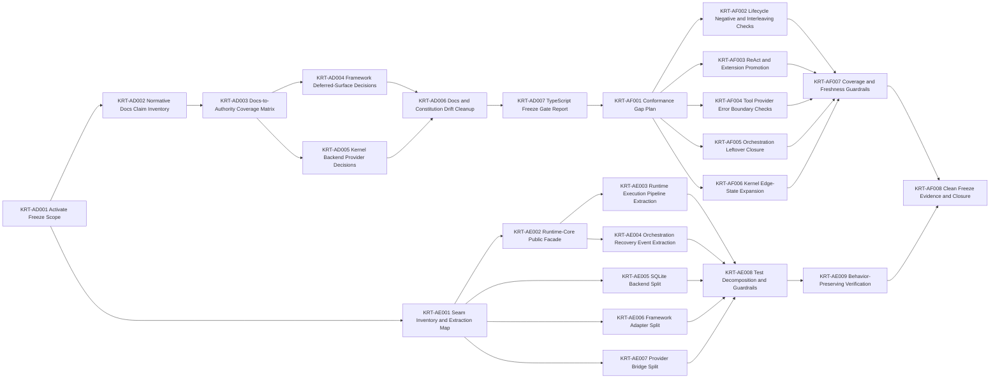

# Engineering Execution Plan

## 0. Version History & Changelog

- v0.18.0 - Closed Epic AF in current repo reality through the generated conformance gap plan, promoted AF shared-runner checks, freshness and authority guardrails, refreshed compatibility evidence, and clean freeze validation; TypeScript is freeze-ready for the currently promoted surfaces.
- v0.17.0 - Closed Epic AE in current repo reality through the modular boundary hardening inventory, repo-wide `boundaries/**/*.ts` size audit, and a clean `bun run verify`; remaining active implementation scope is Epic AF.
- v0.16.0 - Closed Epic AD in current repo reality through the docs-to-authority claim inventory, coverage matrix, deferred/local surface decisions, docs cleanup, freeze gate report, and closure inventory; at that time, remaining active scope was Epic AE plus Epic AF.
- v0.15.0 - Activated TypeScript freeze-readiness closure after Epic AC, reopened active scope around Epics AD, AE, and AF, and replaced the zero-active-scope posture with a docs/authority, modular-hardening, and freeze-evidence critical path.
- v0.14.0 - Closed Epic AC in current repo reality through the orchestration authority inventory and closure inventory, promoted framework orchestration into runtime-api authority plus shared-runner evidence, and left no implementation epic active in the current plan.
- v0.13.0 - Closed Epics Z, AA, and AB in current repo reality, moved their detail out of the active plan and into archived summaries plus closure inventories, and opened Epic AC for framework orchestration authority promotion.
- ... [Older history truncated, refer to git logs]

## 1. Executive Summary & Active Critical Path

- **Total Active Story Points:** 0
- **Critical Path:** No active implementation epic is open in this plan. Epic AF is closed through `KRT-AF008`, and any later implementation line requires a new TechSpec/Tasks revision.
- **Planning Assumptions:** The checked-in compatibility evidence currently records `typescript-framework` as pass for `265/265` applicable checks, `typescript-kernel-sqlite` as pass for `55/55`, `typescript-providers` as pass for `28/28`, and `rust-framework` as unsupported with `0/265` applicable checks. Epic AD classified docs-to-authority coverage, Epic AE closed modular hardening, and Epic AF promoted the selected portable gaps plus freshness guardrails. TechSpec ADR-021 through ADR-029 remain binding, and Rust framework product work stays out of scope until a later revision explicitly activates it.

### Brownfield Continuity Note

- Epics A-AF are closed in current repo reality through the closure inventories already cited in `constitution/spikes/`.
- Epic W explicitly left some framework, ReAct, provider-family, and backend-local surfaces outside shared semantic authority; Epic AC explicitly left orchestration static config snapshotting and extension scoping as local implementation evidence.
- The current scope is therefore closed. Later implementation work must start from the recorded freeze evidence rather than reopening the closed docs-to-authority, modular-hardening, or conformance-depth epics.

### Sequential Scope Rule

- Epics W, X, Y, Z, AA, AB, AC, and AD remain closed and must not be quietly reopened through implementation drift.
- Epic AF is closed in current repo reality. Epics AD, AE, and AF serve as freeze-readiness evidence for any later planning revision.
- Rust framework adapter-host work may continue to exist as evidence plumbing only; no Rust framework product implementation ticket is authorized in this plan.

### Planning Heuristic

- Prefer epic slices that look likely to land comfortably below roughly `5,000` lines of new code and treat roughly `10,000` lines as a warning threshold.
- This is a scoping heuristic for planning clarity, not an execution cap or a substitute for code review judgment.

## 2. Project Phasing & Iteration Strategy

### Delivery Cadence Posture

- No sprint or release-train cadence is assumed in this plan.
- This section uses "iteration strategy" only because the planning framework requires that heading; the content below is dependency phasing and freeze-gate sequencing, not a commitment to Scrum-style iterations.

### Current Active Scope

- No active implementation scope is open in this plan. TypeScript freeze-readiness for the currently promoted surfaces is recorded by Epic AF closure evidence.

### Future / Deferred Scope

- Rust framework product implementation work is deferred until a later TechSpec/Tasks revision explicitly activates that line.
- Rust framework orchestration support remains unsupported or non-applicable unless a later revision adds real implementation tickets and advertised capabilities.
- `LanguageModelV2` / `ProviderV2` compatibility is deferred.
- AI SDK agent loops, AI SDK UI message protocols, AI SDK transport helpers, LangChain bridges, provider-native tool support, and first-class Tuvren provider packages are deferred.
- ACP, A2A, or any additional host protocol beyond SSE and AG-UI is deferred until a future TechSpec revision names it.
- Future concrete drivers beyond ReAct, official peer backends beyond memory/SQLite, and future product implementation lines beyond the current TypeScript/Rust lanes are deferred until a later plan explicitly authorizes them.
- FFI-based Rust embedding is deferred until after the process-boundary kernel seam and the freeze-readiness closure are both proven boring and durable.
- Deno portability checks remain deferred until public package surfaces stabilize enough to avoid testing scaffolding churn.
- Authority packets for surfaces beyond the current promoted packet families remain deferred unless the Epic AD matrix or Epic AF classifies them as promote-now freeze blockers.

### Archived or Already Completed Scope

- Epics A-Q established the architecture-first TypeScript baseline, shared contracts, ReAct/runtime execution path, provider bridge, host stream adapters, playground host, and release/portability hardening.
- Epics R-V established the multi-language transition foundation, contract/conformance artifactization, kernel interop governance, Rust kernel baseline, and TypeScript-framework-to-Rust-kernel interop evidence.
- Epics W-AF promoted the first shared semantic authority surfaces, normalized topology, enforced neutral machine authority, closed the TypeScript kernel gap, promoted run-liveness, promoted framework orchestration, closed the docs-to-authority freeze gate, completed TypeScript modular boundary hardening, and closed the TypeScript freeze-evidence gate.
- Epics K-Q closure evidence remains anchored in `constitution/spikes/epic-k-react-loop-cancellation-inventory.md`, `constitution/spikes/epic-l-parity-inventory.md`, `constitution/spikes/epic-m-tool-approval-gap-inventory.md`, `constitution/spikes/epic-n-ai-sdk-bridge-inventory.md`, `constitution/spikes/epic-o-stream-adapter-inventory.md`, `constitution/spikes/epic-p-playground-host-inventory.md`, and `constitution/spikes/epic-q-release-hardening-inventory.md`.
- Epics R-V closure evidence remains anchored in `constitution/spikes/epic-r-multilanguage-transition-guide.md`, `constitution/spikes/epic-r-multilanguage-transition-foundation-inventory.md`, `constitution/spikes/epic-s-boundary-contract-conformance-artifactization-inventory.md`, `constitution/spikes/epic-t-kernel-interop-surface-inventory.md`, `constitution/spikes/epic-t-kernel-interop-governance-inventory.md`, `constitution/spikes/epic-u-rust-kernel-baseline-inventory.md`, `constitution/spikes/epic-v-transport-decision-inventory.md`, and `constitution/spikes/epic-v-framework-rust-kernel-interop-closure-inventory.md`.
- Epics W-AF closure evidence remains anchored in `constitution/spikes/epic-w-semantic-coverage-matrix.md`, `constitution/spikes/epic-w-semantic-ecosystem-maturity-closure-inventory.md`, `constitution/spikes/epic-x-typescript-topology-normalization-inventory.md`, `constitution/spikes/epic-x-typescript-topology-normalization-closure-inventory.md`, `constitution/spikes/epic-y-authority-leak-inventory.md`, `constitution/spikes/epic-y-machine-enforced-authority-closure-inventory.md`, `constitution/spikes/epic-y-shared-conformance-engine-closure-inventory.md`, `constitution/spikes/epic-z-typescript-kernel-syscall-closure-inventory.md`, `constitution/spikes/epic-aa-kernel-conformance-promotion-closure-inventory.md`, `constitution/spikes/epic-ab-run-liveness-recovery-closure-inventory.md`, `constitution/spikes/epic-ac-framework-orchestration-authority-inventory.md`, `constitution/spikes/epic-ac-framework-orchestration-authority-closure-inventory.md`, `constitution/spikes/epic-ad-docs-to-authority-freeze-gate-closure-inventory.md`, `constitution/spikes/epic-ae-modular-boundary-hardening-inventory.md`, and `constitution/spikes/epic-af-conformance-depth-freeze-evidence-closure-inventory.md`.

## 3. Build Order (Mermaid)



## 4. Ticket List

### Epic AD — Docs-to-Authority Freeze Gate

**KRT-AD001 Activate TypeScript Freeze-Readiness Scope**

- **Type:** Chore
- **Effort:** 2
- **Dependencies:** None
- **Capability / Contract Mapping:** TechSpec ADR-021, ADR-023, ADR-024, ADR-025, ADR-026, ADR-029; PRD CAP-P0-037, CAP-P1-038
- **Description:** Revise the planning artifacts so TypeScript freeze-readiness becomes the active implementation scope and Rust framework remains explicitly deferred.
- **Acceptance Criteria (Gherkin):**

```gherkin
Given `Tasks.md` currently has no active implementation epic
When the freeze-readiness scope is activated
Then `Tasks.md` records Epics AD, AE, and AF as the active critical path
And `TechSpec.md` records that TypeScript freeze-readiness precedes any Rust framework activation
And Epic AC remains closed rather than re-opened
And Rust framework product work remains explicitly out of scope
And no ticket authorizes a new framework language implementation
```

**KRT-AD002 Normative Docs Claim Inventory**

- **Type:** Spike
- **Effort:** 5
- **Dependencies:** KRT-AD001
- **Capability / Contract Mapping:** `docs/KrakenFrameworkSpecification.md`; `docs/KrakenKernelSpecification.md`; TechSpec §5.3
- **Description:** Inventory every normative claim in the framework and kernel docs, assign stable claim IDs, and preserve section-level traceability.
- **Acceptance Criteria (Gherkin):**

```gherkin
Given the framework and kernel docs contain product-facing behavioral claims
When the normative docs inventory is completed
Then every claim using normative language such as must, must not, should, cannot, never, always, required, guarantees, or equivalent binding language is captured with a stable claim ID
And each claim records its source file, heading, section anchor, capability mapping, and affected boundary
And non-normative rationale text is explicitly classified as rationale rather than silently ignored
And duplicate claims are linked instead of counted as independent requirements
And the inventory includes framework, kernel, provider-facing, stream-facing, tool, approval, orchestration, extension, recovery, and backend-relevant claims
```

**KRT-AD003 Docs-to-Authority Coverage Matrix**

- **Type:** Feature
- **Effort:** 5
- **Dependencies:** KRT-AD002
- **Capability / Contract Mapping:** TechSpec §3.6, §4.10, §4.11, §4.12, §4.13
- **Description:** Convert the claim inventory into a coverage matrix that classifies every normative claim against machine authority, implementation evidence, deferral, or staleness.
- **Acceptance Criteria (Gherkin):**

```gherkin
Given every normative docs claim has a stable claim ID
When the docs-to-authority coverage matrix is produced
Then every claim is assigned exactly one primary classification
And every authority-backed claim names the packet, generated artifact, conformance plan, fixture, adapter capability, and compatibility evidence that support it
And every implementation-local claim names the local test or implementation evidence without treating that evidence as cross-language authority
And every stale or overbroad claim has a required docs or constitution correction
And every missing-authority or missing-conformance claim has a follow-up ticket in Epic AF or an explicit deferral rationale
And no claim remains unclassified
```

**KRT-AD004 Framework Deferred-Surface Decisions**

- **Type:** Spike
- **Effort:** 3
- **Dependencies:** KRT-AD003
- **Capability / Contract Mapping:** `docs/KrakenFrameworkSpecification.md` §§4-10; TechSpec ADR-021, ADR-029
- **Description:** Decide the freeze posture for framework surfaces that are still TypeScript-local or only partially promoted.
- **Acceptance Criteria (Gherkin):**

```gherkin
Given the coverage matrix identifies framework claims that are not fully shared-conformance-covered
When framework deferred-surface decisions are recorded
Then each surface is classified as promote-now, implementation-defined, explicitly deferred, or stale-docs
And promote-now decisions create concrete Epic AF conformance tickets
And implementation-defined decisions update docs or binding appendices so future implementation maintainers do not infer portability
And deferred decisions include a named future trigger
And no framework behavior remains in implemented-locally-but-portability-unclear state
```

**KRT-AD005 Kernel, Backend, and Provider Local-Surface Decisions**

- **Type:** Spike
- **Effort:** 3
- **Dependencies:** KRT-AD003
- **Capability / Contract Mapping:** `docs/KrakenKernelSpecification.md`; provider authority packet; kernel protocol authority packet
- **Description:** Decide the freeze posture for kernel/backend/provider surfaces that are official TypeScript behavior but not yet established as shared cross-language semantics.
- **Acceptance Criteria (Gherkin):**

```gherkin
Given the coverage matrix identifies kernel, backend, and provider claims with local implementation evidence
When local-surface decisions are recorded
Then every official-backend guarantee is separated from cross-language kernel protocol authority
And every provider-specific behavior is separated from provider-neutral framework semantics
And optional extensions such as run-liveness remain capability-gated rather than retroactively folded into base protocol authority
And missing shared conformance creates Epic AF tickets only when the behavior is intended to be portable
And docs no longer imply that implementation-local behavior is universal runtime semantics
```

**KRT-AD006 Docs and Constitution Drift Cleanup**

- **Type:** Chore
- **Effort:** 3
- **Dependencies:** KRT-AD004, KRT-AD005
- **Capability / Contract Mapping:** TechSpec §5.3; ADR-023 through ADR-029
- **Description:** Patch docs and constitution text so prose accurately describes machine authority, implementation-defined surfaces, and deferrals.
- **Acceptance Criteria (Gherkin):**

```gherkin
Given the coverage matrix and deferred-surface decisions are complete
When docs and constitution drift cleanup is applied
Then Markdown no longer states or implies cross-language guarantees that lack authority packets, generated artifacts, conformance plans, or measured evidence
And implementation-defined behavior is labeled as implementation-defined at the nearest relevant docs section
And explicitly deferred behavior is labeled with the deferral reason and future activation trigger
And stale or duplicate prose is removed or rewritten
And no docs section points readers to TypeScript source as the source of portable truth
```

**KRT-AD007 TypeScript Freeze Gate Report**

- **Type:** Chore
- **Effort:** 2
- **Dependencies:** KRT-AD006
- **Capability / Contract Mapping:** PRD CAP-P0-037, CAP-P1-038; TechSpec §4.10
- **Description:** Produce the freeze gate report that decides whether TypeScript can be treated as a freeze candidate after AE and AF, and what still blocks a later Rust framework activation.
- **Acceptance Criteria (Gherkin):**

```gherkin
Given the docs-to-authority matrix and docs cleanup are complete
When the freeze gate report is written
Then the report states which claims are authority-backed and conformance-covered
And it lists every remaining implementation-local, implementation-defined, deferred, or stale surface
And it states whether each remaining surface blocks a future implementation line
And it defines the exact evidence required for TypeScript freeze closure
And it states that Rust framework remains blocked until Epic AF closes
```

### Epic AE — TypeScript Modular Boundary Hardening

Epic AE is closed in current repo reality; the tickets below are retained as
historical execution detail and as input evidence for Epic AF.

**KRT-AE001 TypeScript Seam Inventory and Extraction Map**

- **Type:** Spike
- **Effort:** 3
- **Dependencies:** KRT-AD001
- **Capability / Contract Mapping:** TechSpec §5.1, §5.2; ADR-020, ADR-022, ADR-023, ADR-029
- **Description:** Inventory the large TypeScript modules and produce a behavior-preserving extraction map before moving code.
- **Acceptance Criteria (Gherkin):**

```gherkin
Given the targeted TypeScript modules are currently too large to audit safely
When the seam inventory is completed
Then each module has an extraction map with named responsibilities, target files, dependency direction, and exported seams
And every extraction is classified as behavior-preserving, authority-promotion-related, or docs-cleanup-related
And no extraction requires a public API change unless a separate TechSpec revision explicitly authorizes it
And circular dependency risks are identified before implementation begins
And the map defines source-file size thresholds and any temporary allowlists
```

**KRT-AE002 Runtime-Core Public Facade Stabilization**

- **Type:** Feature
- **Effort:** 5
- **Dependencies:** KRT-AE001
- **Capability / Contract Mapping:** TechSpec §4.1, §4.6; runtime-api authority packet
- **Description:** Convert `runtime-core.ts` toward a public/internal composition facade, preserving exported behavior while preventing it from owning all semantics directly.
- **Acceptance Criteria (Gherkin):**

```gherkin
Given runtime-core currently concentrates execution, lifecycle, driver, tool, stream, recovery, and orchestration behavior
When the public facade stabilization is complete
Then public exports remain source-compatible for existing TypeScript consumers
And the facade delegates to internal modules rather than hosting unrelated execution logic directly
And exported types remain owned by contract or binding packages where applicable
And package export smoke tests pass without consumer import rewrites
And conformance evidence is unchanged except for regenerated timestamps or deterministic evidence updates
```

**KRT-AE003 Runtime Execution Pipeline Extraction**

- **Type:** Feature
- **Effort:** 8
- **Dependencies:** KRT-AE001, KRT-AE002
- **Capability / Contract Mapping:** `docs/KrakenFrameworkSpecification.md` §4; TechSpec §4.1, §4.6
- **Description:** Extract the runtime execution pipeline into modules with explicit ownership.
- **Acceptance Criteria (Gherkin):**

```gherkin
Given runtime execution behavior must remain stable
When the execution pipeline is extracted
Then each target seam lives in a named internal module with a single primary responsibility
And module dependencies flow inward toward shared primitives rather than back through the public facade
And no extracted module imports conformance plans, check IDs, compatibility reports, or test fixtures
And existing runtime-core, driver, playground, framework conformance, and interop-smoke tests still pass
And no public runtime behavior changes unless already required by an Epic AD drift correction
```

**KRT-AE004 Runtime Orchestration, Recovery, and Event Extraction**

- **Type:** Feature
- **Effort:** 8
- **Dependencies:** KRT-AE001, KRT-AE002
- **Capability / Contract Mapping:** runtime-api orchestration plan; event-stream authority packet; kernel run-liveness extension
- **Description:** Extract orchestration, recovery/liveness, event projection, and handoff/context behavior out of the main runtime core path.
- **Acceptance Criteria (Gherkin):**

```gherkin
Given orchestration and recovery are promoted or capability-gated semantics
When orchestration, recovery, and event behavior are extracted
Then orchestration code no longer depends on unrelated provider or ReAct internals
And event projection code has one clear path from native runtime events to canonical observations
And recovery/liveness code is isolated behind capability-gated kernel behavior
And handoff/context builder behavior is isolated from generic turn execution
And shared orchestration conformance remains green
And local orchestration tests remain implementation tests rather than portable authority
```

**KRT-AE005 SQLite Backend Repository Split**

- **Type:** Feature
- **Effort:** 8
- **Dependencies:** KRT-AE001
- **Capability / Contract Mapping:** TechSpec §3.5, §4.3; kernel protocol authority packet
- **Description:** Split `sqlite-backend.ts` into durable backend modules without changing the backend contract.
- **Acceptance Criteria (Gherkin):**

```gherkin
Given SQLite is the durable TypeScript backend and must not become a hidden kernel oracle
When the SQLite backend is split
Then each repository module owns one storage responsibility
And SQL statements are centralized or grouped by repository rather than scattered through runtime control flow
And transaction boundaries remain explicit and testable
And physical SQLite details do not leak into kernel protocol authority
And backend-sqlite tests, kernel TypeScript SQLite conformance, playground SQLite reload, and release-check pass
And no kernel protocol behavior changes without matching authority/conformance updates
```

**KRT-AE006 Framework Conformance Adapter Split**

- **Type:** Feature
- **Effort:** 5
- **Dependencies:** KRT-AE001
- **Capability / Contract Mapping:** TechSpec §4.13; ADR-025
- **Description:** Split the TypeScript framework conformance adapter so it cannot become a semantic runner.
- **Acceptance Criteria (Gherkin):**

```gherkin
Given implementation adapters must measure behavior but not grade it
When the framework adapter split is complete
Then adapter modules do not contain expected check IDs, pass/fail grading, assertion operators, or semantic expected-value tables
And operation routing is separated from observation projection
And fixture construction is separated from runtime state inspection
And adapter failures remain distinguishable from implementation assertion failures
And shared framework conformance still passes through the generic runner
And authority guardrails reject any adapter code that attempts to become a runner oracle
```

**KRT-AE007 Provider Bridge Internal Split**

- **Type:** Feature
- **Effort:** 5
- **Dependencies:** KRT-AE001
- **Capability / Contract Mapping:** provider-api authority packet; provider conformance plans
- **Description:** Split the AI SDK provider bridge into narrower modules so provider normalization, structured-output handling, metadata continuity, and error mapping are independently auditable.
- **Acceptance Criteria (Gherkin):**

```gherkin
Given provider bridge behavior is part of the provider-neutral portability story
When the provider bridge split is complete
Then provider-specific AI SDK details stay inside the bridge implementation subtree
And provider-neutral output shapes remain owned by provider/framework contracts
And structured-output behavior is auditable without reading stream transport logic
And native strict structured-output rejection remains conformance-covered
And provider bridge tests and provider shared conformance pass
And public package exports remain compatible
```

**KRT-AE008 Test Decomposition and Structural Guardrails**

- **Type:** Chore
- **Effort:** 5
- **Dependencies:** KRT-AE002, KRT-AE003, KRT-AE004, KRT-AE005, KRT-AE006, KRT-AE007
- **Capability / Contract Mapping:** TechSpec §5.2; ADR-023, ADR-025, ADR-029
- **Description:** Decompose oversized tests and add structural checks that prevent the same code smells from reappearing.
- **Acceptance Criteria (Gherkin):**

```gherkin
Given refactoring without guardrails allows monoliths to regrow
When structural guardrails are added
Then targeted file-size thresholds are enforced by repo tooling or explicit reviewable allowlists
And runtime-core tests are split by lifecycle, approval, tool, provider, stream, orchestration, recovery, and branching scenario families
And conformance adapter tests prove adapter behavior without encoding product semantics
And boundary topology checks still enforce language ownership by path
And the guardrails run in verify or an existing validation lane
```

**KRT-AE009 Behavior-Preserving Verification**

- **Type:** Chore
- **Effort:** 3
- **Dependencies:** KRT-AE008
- **Capability / Contract Mapping:** TechSpec §4.10, §5.3
- **Description:** Prove the TypeScript modularization changed structure, not semantics.
- **Acceptance Criteria (Gherkin):**

```gherkin
Given TypeScript internals have been split across narrower modules
When behavior-preserving verification runs
Then lint, typecheck, targeted builds, targeted tests, conformance, codegen, interop-smoke, export smoke, portability check, and release-check pass
And compatibility evidence remains semantically equivalent except for intentional Epic AF conformance additions
And public package exports remain compatible
And the refactor does not create a new authority packet, conformance plan, or docs claim unless required by Epic AD or AF
```

### Epic AF — Conformance Depth and Freeze Evidence

**KRT-AF001 Conformance Gap Plan from Coverage Matrix**

- **Type:** Spike
- **Effort:** 3
- **Dependencies:** KRT-AD007
- **Capability / Contract Mapping:** TechSpec §4.11, §4.12, §4.13
- **Description:** Convert the AD coverage matrix into a conformance implementation plan. Only promote behavior that is intended to be portable.
- **Acceptance Criteria (Gherkin):**

```gherkin
Given every docs claim has a freeze classification
When the conformance gap plan is written
Then every promote-now claim maps to a packet, plan, fixture, adapter operation, and evidence update
And every non-promoted implementation-defined or deferred claim is excluded from conformance promotion
And every new check has a stable check ID, required evidence shape, and capability requirement
And no runner or adapter code is allowed to invent expected behavior outside the plan
And the plan preserves capability-gated reporting for unsupported implementations
```

**KRT-AF002 Runtime Lifecycle Negative and Interleaving Checks**

- **Type:** Feature
- **Effort:** 5
- **Dependencies:** KRT-AF001
- **Capability / Contract Mapping:** runtime-api authority packet; event-stream authority packet; kernel run-liveness extension
- **Description:** Add shared conformance for lifecycle paths that are most likely to diverge in a second framework implementation.
- **Acceptance Criteria (Gherkin):**

```gherkin
Given runtime lifecycle behavior is a portability-critical surface
When lifecycle negative and interleaving checks are added
Then each check is represented in a conformance plan with required evidence
And the TypeScript framework adapter returns observations rather than pass/fail decisions
And unsupported capabilities remain non-applicable for Rust framework
And TypeScript framework evidence records the new checks with pass/fail detail
And docs claims covered by these checks move to authority-backed shared-conformance-covered status
```

**KRT-AF003 ReAct Driver and Extension Hook Conformance Promotion**

- **Type:** Feature
- **Effort:** 8
- **Dependencies:** KRT-AF001
- **Capability / Contract Mapping:** react-driver authority packet; driver-api authority packet; `docs/KrakenFrameworkSpecification.md` §§5, 9
- **Description:** Promote selected ReAct and extension behavior from TypeScript-local tests into shared conformance, but only where it is intended to be portable.
- **Acceptance Criteria (Gherkin):**

```gherkin
Given ReAct and extension behavior currently has TypeScript-local depth beyond shared conformance
When selected behavior is promoted
Then promoted checks live in boundary-owned conformance plans
And implementation-local behavior remains explicitly classified instead of accidentally standardized
And hook ordering and around-hook nesting are asserted by shared-runner data
And adapter observations expose phase traces without receiving expected sequences from adapter code
And TypeScript driver tests remain local regression tests rather than semantic authority
```

**KRT-AF004 Tool, Provider, Structured-Output, and Error Boundary Checks**

- **Type:** Feature
- **Effort:** 5
- **Dependencies:** KRT-AF001
- **Capability / Contract Mapping:** provider-api authority packet; runtime-api callable plans; driver-api plans
- **Description:** Expand shared conformance around provider/tool boundaries where silent provider-specific behavior could leak into framework semantics.
- **Acceptance Criteria (Gherkin):**

```gherkin
Given provider and tool behavior must remain provider-neutral
When tool/provider/error checks are added
Then shared conformance asserts neutral runtime behavior rather than AI SDK-specific mechanics
And provider-family-specific metadata remains local unless explicitly promoted
And malformed provider responses produce stable observable errors
And framework-owned approval and tool execution boundaries remain capability-labeled
And TypeScript provider evidence and framework evidence both reflect the expanded checks where applicable
```

**KRT-AF005 Orchestration Leftover Closure**

- **Type:** Feature
- **Effort:** 3
- **Dependencies:** KRT-AF001
- **Capability / Contract Mapping:** runtime-api orchestration plan; `docs/KrakenFrameworkSpecification.md` §10
- **Description:** Close the remaining orchestration ambiguity from Epic AC: static agent-config snapshotting and extension scoping must either be promoted or explicitly kept local/deferred.
- **Acceptance Criteria (Gherkin):**

```gherkin
Given Epic AC promoted the core orchestration subset but left static config snapshotting and extension scoping as local implementation evidence
When orchestration leftover closure is completed
Then static config snapshotting is either shared-conformance-covered or explicitly marked implementation-defined/deferred
And extension scoping is either shared-conformance-covered or explicitly marked implementation-defined/deferred
And docs no longer imply portable semantics for whichever behavior remains local
And any promoted behavior updates the runtime-api packet, conformance plan, adapter observations, and compatibility evidence together
And no orchestration behavior requires reading TypeScript runtime-core source to determine expected semantics
```

**KRT-AF006 Kernel Edge-State Conformance Expansion**

- **Type:** Feature
- **Effort:** 5
- **Dependencies:** KRT-AF001
- **Capability / Contract Mapping:** kernel protocol authority packet; `docs/KrakenKernelSpecification.md` appendices
- **Description:** Expand kernel conformance only where the docs-to-authority matrix shows portable kernel claims that are not yet deeply covered.
- **Acceptance Criteria (Gherkin):**

```gherkin
Given kernel protocol conformance is already strong but may not cover every documented edge state
When kernel edge-state checks are expanded
Then only portable kernel protocol claims receive shared checks
And SQLite-specific physical behavior remains backend-local unless intentionally promoted
And optional extension behavior remains capability-gated
And TypeScript memory, TypeScript SQLite, and Rust kernel evidence report pass, unsupported, or non-applicable according to advertised capabilities
And compatibility reports expose check-level outcomes for every new check
```

**KRT-AF007 Coverage and Freshness Guardrails**

- **Type:** Chore
- **Effort:** 5
- **Dependencies:** KRT-AF002, KRT-AF003, KRT-AF004, KRT-AF005, KRT-AF006
- **Capability / Contract Mapping:** TechSpec ADR-027, ADR-028, ADR-029; §5.3
- **Description:** Add machine checks so docs/authority/conformance drift cannot silently return.
- **Acceptance Criteria (Gherkin):**

```gherkin
Given freeze-readiness cannot depend on reviewer memory
When coverage and freshness guardrails are added
Then changing docs normative claims without updating the coverage matrix fails a validation lane
And changing authority packets or generated artifacts without regeneration fails validation
And adding conformance checks without required evidence shape fails validation
And compatibility evidence without check-level traceability fails validation
And implementation source, runner source, and Markdown prose remain forbidden authority sources
And the guardrails are wired into verify or an existing release validation path
```

**KRT-AF008 Clean Freeze Evidence and Closure Certification**

- **Type:** Chore
- **Effort:** 3
- **Dependencies:** KRT-AF007, KRT-AE009
- **Capability / Contract Mapping:** TechSpec §4.10; PRD CAP-P1-038
- **Description:** Regenerate final evidence from a clean environment and certify whether TypeScript is freeze-ready.
- **Acceptance Criteria (Gherkin):**

```gherkin
Given docs authority coverage, modular hardening, and expanded conformance are complete
When final freeze evidence is regenerated
Then `bun run verify` passes from a clean checkout
And `bun run release-check` passes from a clean checkout
And `bun run conformance` passes with fresh evidence
And `bun run codegen` produces no uncommitted drift
And `bun run interop-smoke` passes
And `compatibility-matrix.json` reports updated check-level evidence for all affected implementations
And `rust-framework` remains unsupported unless a later revision explicitly activates product behavior
And the closure report states whether TypeScript is freeze-ready and what future revision may unblock Rust framework work
```

## 5. Issue-Level Definition of Done

- Epics AD, AE, and AF are closed.
- `Tasks.md` no longer reports `0` active story points until these epics close.
- The docs-to-authority coverage matrix has no unclassified normative claims.
- All portable claims are backed by packet/plan/generated artifact/fixture/evidence anchors.
- All local/deferred/implementation-defined claims are labeled at the docs/constitution level.
- Large TypeScript modules have been decomposed along explicit seams.
- Structural guardrails prevent conformance adapters, generic runners, implementation files, or Markdown from becoming hidden oracles again.
- Shared conformance includes the missing high-risk negative/interleaving paths selected by the coverage matrix.
- Final evidence is regenerated cleanly and checked in.
- A later Rust framework epic is permitted only after this plan closes and a new TechSpec/Tasks revision explicitly activates that implementation line.
