# Engineering Execution Plan

## 0. Version History & Changelog
- v0.6.0 - Selected bounded active Epics K, L, and M for ReAct loop completion, streaming/provider semantics, and tool/approval integration while deferring AI SDK bridge and host protocol work as next-focus topics.
- v0.5.1 - Closed Epic J with SQLite hot-path cleanup, localized validation coverage, Run liveness spec deltas, and retention topology proof.
- v0.5.0 - Rebased active scope after Epic I completion and inserted Runtime Foundation Hardening before deeper ReAct/runtime expansion.
- ... [Older history truncated, refer to git logs]

## 1. Executive Summary & Active Critical Path
- **Total Active Story Points:** 50
- **Critical Path:** KRT-K001 -> KRT-K002 -> KRT-K003/KRT-K004 -> KRT-L001 -> KRT-L002 -> KRT-L003/KRT-L004 -> KRT-M001 -> KRT-M002 -> KRT-M003 -> KRT-M004 -> KRT-M005
- **Planning Assumptions:** Epic J is complete. The focused ReAct Driver foundation slice exists in repo reality, but the production-depth ReAct path must be completed in bounded engineering epics that stay below the `10,000` LOC warning threshold and aim near `5,000` LOC when possible. Runtime/model streaming semantics are driver/provider implementation work, not host adapter work.

### Brownfield Continuity Note
- The current codebase already contains the workspace scaffold, shared core types, kernel protocol package, memory backend, SQLite backend, kernel testkit, shared framework contract packages, provider contract package, `runtime-core`, and the ReAct Driver foundation package.
- This revision activates the next ReAct implementation band as three bounded epics: loop correctness first, streaming/provider semantics second, and tool/approval integration third.
- AI SDK bridge and host protocol/playground work remain intentionally deferred until K-M prove the canonical ReAct execution path.

### Planning Heuristic
- Prefer epic slices that look likely to land comfortably below roughly `5,000` lines of new code and treat roughly `10,000` lines as a warning threshold.
- This is a scoping heuristic for planning clarity, not an execution cap or a substitute for code review judgment.

## 2. Project Phasing & Iteration Strategy
### Delivery Cadence Posture
- No sprint or release-train cadence is assumed in this plan.
- This section uses "iteration strategy" only because the planning framework requires that heading; the content below is dependency phasing and scope partitioning, not a commitment to Scrum-style iterations.

### Current Active Scope
- Epic K completes the ReAct loop over the existing provider-neutral contract and shared runtime-core execution shell.
- Epic L hardens runtime/model streaming semantics in the ReAct driver and provider contract path.
- Epic M completes ReAct tool continuation and approval integration through shared runtime-core services.

### Future / Deferred Scope
- Epic N will focus next on the AI SDK provider bridge baseline after K-M prove the canonical driver/provider path. It must begin with compatibility verification for the pinned `ai@6.0.142` and `@ai-sdk/provider@3.0.8` surface before bridge implementation.
- Epic O will focus next on host stream protocol surfaces and playground/host experience after the provider bridge exists. Host protocol adapters translate canonical `TuvrenStreamEvent` output; they do not define model streaming semantics.
- Future later epics may add additional concrete drivers beyond ReAct, peer official backends beyond memory and SQLite, and production-grade host surfaces beyond the first playground baseline.

### Archived or Already Completed Scope
- Epic A delivered the root workspace scaffold and boundary-first monorepo structure.
- Epic B delivered the shared primitive package plus deterministic identity spike validation.
- Epic C delivered the kernel protocol contracts, deterministic CBOR/SHA helpers, and semantic fixtures.
- Epic D delivered the semantic reference memory backend.
- Epic E delivered the reusable kernel backend conformance, invariant, and recovery harness and closed the memory backend against it.
- Epic F delivered the SQLite backend, migrations, repository logic, and conformance closure.
- Epic G delivered the shared framework contract partition across runtime, driver, event, tool, and provider surfaces.
- Epic H delivered the docs-first shared framework foundations, including the minimal shared-core contract realignment and `runtime-core`.
- Epic I delivered the first focused ReAct Driver foundation slice.
- Epic J delivered Runtime Foundation Hardening: SQLite hot-path characterization, localized transaction validation, backend-local lineage metadata and indexes, explicit diagnostic validation, Run liveness spec deltas, and retention topology proof.

## 3. Build Order (Mermaid)

```mermaid
flowchart LR
  KRTK001[KRT-K001 ReAct Loop and Cancellation Semantics Inventory] --> KRTK002[KRT-K002 ReAct Resolution Policy Completion]
  KRTK002 --> KRTK003[KRT-K003 Runtime-Core Loop Integration Closure]
  KRTK002 --> KRTK004[KRT-K004 Loop Cancellation and Partial Output Boundaries]
  KRTK003 --> KRTL001[KRT-L001 Stream/Generate Parity Characterization]
  KRTK004 --> KRTL001
  KRTL001 --> KRTL002[KRT-L002 Provider Stream Accumulator Hardening]
  KRTL002 --> KRTL003[KRT-L003 Assistant Event Reconciliation and Structured Output Streaming]
  KRTL002 --> KRTL004[KRT-L004 Provider Error and Opaque Metadata Preservation]
  KRTL003 --> KRTM001[KRT-M001 Tool and Approval Gap Inventory]
  KRTL004 --> KRTM001
  KRTM001 --> KRTM002[KRT-M002 Tool Result Continuation]
  KRTM002 --> KRTM003[KRT-M003 Approval Pause and Exact Resume]
  KRTM003 --> KRTM004[KRT-M004 Edit/Reject and Partial Batch Recovery]
  KRTM004 --> KRTM005[KRT-M005 Tool Governance Integration Closure]
```


## 4. Ticket List
### Epic K — ReAct Loop Completion (RLC)

**KRT-K001 ReAct Loop and Cancellation Semantics Inventory**
- **Type:** Spike
- **Effort:** 3
- **Dependencies:** None
- **Capability / Contract Mapping:** PRD `CAP-P0-004`, `CAP-P0-005`, `CAP-P0-019`, `CAP-P0-033`, `CAP-P1-034`; Architecture `§2`, `§4.1`; TechSpec `§4.6`, `§5.4.1`; Framework Spec `§4`, `§7`
- **Description:** Inventory the current `runtime-core` and ReAct driver foundation against the normative ReAct loop semantics, verify current lab/runtime patterns for streaming cancellation and partial assistant continuation, and identify the smallest implementation surface needed for loop completion.
- **Acceptance Criteria (Gherkin):**
```gherkin
Given the ReAct foundation slice already exists
When the loop gap inventory is completed
Then the repository records the missing loop behaviors, the external cancellation/partial-output patterns considered, the files or packages that own each behavior, and any behavior that must remain deferred outside Epic K
```

**KRT-K002 ReAct Resolution Policy Completion**
- **Type:** Feature
- **Effort:** 3
- **Dependencies:** KRT-K001
- **Capability / Contract Mapping:** PRD `CAP-P0-004`, `CAP-P0-008`, `CAP-P0-012`, `CAP-P0-033`; Architecture `§2`, `§4.1`; TechSpec `§4.6`, `§5.4.1`; Framework Spec `§4`
- **Description:** Complete the ReAct driver's iteration resolution policy so assistant responses deterministically map to continue, end, fail, pause, or the existing handoff contract shape without expanding handoff policy, tool execution, or host adapter work into Epic K.
- **Acceptance Criteria (Gherkin):**
```gherkin
Given a ReAct driver iteration returns a provider-normalized assistant response
When the response contains terminal content, tool calls, handoff intent, or a provider failure
Then the driver returns the documented RuntimeResolution and driver result shape required by the shared runtime-core contract without adding new handoff behavior beyond the approved contract
```

**KRT-K003 Runtime-Core Loop Integration Closure**
- **Type:** Feature
- **Effort:** 5
- **Dependencies:** KRT-K002
- **Capability / Contract Mapping:** PRD `CAP-P0-001`, `CAP-P0-004`, `CAP-P0-006`, `CAP-P0-019`, `CAP-P0-020`; Architecture `§4.1`; TechSpec `§4.2`, `§4.5`, `§4.6`; Framework Spec `§4`, `§7`
- **Description:** Close the runtime-core integration path for ReAct loop execution, including iteration events, checkpoint advancement, state snapshots where configured, and durable status transitions for normal loop completion.
- **Acceptance Criteria (Gherkin):**
```gherkin
Given a host executes a turn through runtime-core with the ReAct driver
When the driver completes one or more iterations without tool approval pauses
Then runtime-core emits canonical lifecycle events, commits the expected checkpoints, advances the Turn head, and reports the final durable runtime status
```

**KRT-K004 Loop Cancellation and Partial Output Boundaries**
- **Type:** Feature
- **Effort:** 3
- **Dependencies:** KRT-K001, KRT-K002
- **Capability / Contract Mapping:** PRD `CAP-P0-004`, `CAP-P0-005`, `CAP-P0-008`, `CAP-P0-019`; Architecture `§1.4`, `§4.1`; TechSpec `§4.5`, `§4.6`; Framework Spec `§7`
- **Description:** Define and implement the cancellation and partial-output handling required for ReAct loop correctness, using the KRT-K001 cancellation findings and preserving already-accumulated assistant content as later model-visible durable context when it is safe to do so.
- **Acceptance Criteria (Gherkin):**
```gherkin
Given a host cancels an active ReAct turn during loop execution
When the driver has partial assistant output or no assistant output
Then the runtime records the documented failed or partial status, preserves already-accumulated assistant content as durable model-visible context when present, emits the canonical error and turn-end events, and does not continue the loop after cancellation
```

### Epic L — ReAct Streaming and Provider Semantics (RSP)

**KRT-L001 Stream/Generate Parity Characterization**
- **Type:** Spike
- **Effort:** 3
- **Dependencies:** KRT-K003, KRT-K004
- **Capability / Contract Mapping:** PRD `CAP-P0-012`, `CAP-P0-020`, `CAP-P0-030`; Architecture `§2`, `§5`; TechSpec `§4.4`, `§4.5`, `§5.4.1`; Framework Spec `§3`, `§6`
- **Description:** Characterize the current generate and stream paths in the ReAct driver/provider contract, identify parity gaps for text, reasoning, structured output, live tool-call previews, finish reasons, usage, and metadata, and record current major-lab provider metadata shapes without turning them into a normalized Tuvren metadata schema.
- **Acceptance Criteria (Gherkin):**
```gherkin
Given the ReAct driver supports both provider.generate and provider.stream modes
When parity characterization is completed
Then the repository records which canonical assistant events and durable response fields must match across generated and streamed provider responses, plus the OpenAI, Anthropic, and Google/Gemini metadata fields that should be preserved opaquely
```

**KRT-L002 Provider Stream Accumulator Hardening**
- **Type:** Feature
- **Effort:** 5
- **Dependencies:** KRT-L001
- **Capability / Contract Mapping:** PRD `CAP-P0-012`, `CAP-P0-020`, `CAP-P1-021`; Architecture `§2`; TechSpec `§4.4`, `§4.5`; Framework Spec `§3.3`, `§3.5`, `§6.3`
- **Description:** Harden the ReAct stream accumulator so normalized provider chunks produce valid canonical events and a matching durable `TuvrenModelResponse` across text, reasoning, structured output, file, and tool-call content.
- **Acceptance Criteria (Gherkin):**
```gherkin
Given a provider stream yields normalized chunks for assistant content
When the ReAct stream accumulator finalizes the stream
Then the live event sequence and durable model response contain equivalent assistant content, live tool-call previews, finish reason, usage, and opaque provider metadata
```

**KRT-L003 Assistant Event Reconciliation and Structured Output Streaming**
- **Type:** Feature
- **Effort:** 5
- **Dependencies:** KRT-L002
- **Capability / Contract Mapping:** PRD `CAP-P0-012`, `CAP-P0-020`, `CAP-P0-023`; Architecture `§2`, `§5`; TechSpec `§4.4`, `§4.5`, `§4.6`; Framework Spec `§3.5`, `§6.5`
- **Description:** Complete streaming validation for assistant event reconciliation, including structured output delta/done behavior, generated-response event synthesis, aroundModel post-stream divergence, and invalid stream rejection.
- **Acceptance Criteria (Gherkin):**
```gherkin
Given a ReAct provider call emits assistant content events before the durable assistant message is finalized
When runtime-core validates the driver result
Then matching streams are accepted, documented aroundModel divergence is accepted only in the allowed case, and invalid or incomplete assistant streams fail with a typed runtime error
```

**KRT-L004 Provider Error and Opaque Metadata Preservation**
- **Type:** Feature
- **Effort:** 3
- **Dependencies:** KRT-L002
- **Capability / Contract Mapping:** PRD `CAP-P0-005`, `CAP-P0-012`, `CAP-P0-020`, `CAP-P0-030`; Architecture `§1.3`, `§1.4`; TechSpec `§4.4`, `§4.6`; Framework Spec `§3`, `§6`
- **Description:** Normalize provider stream errors, error finish reasons, and cancellation errors while preserving usage, provider metadata, and provider continuity artifacts opaquely across generate and stream modes.
- **Acceptance Criteria (Gherkin):**
```gherkin
Given a provider returns usage, metadata, continuity artifacts, or an error in generate or stream mode
When the ReAct driver maps the provider outcome
Then successful outcomes preserve provider-shaped metadata on canonical responses without inventing a normalized metadata schema, and failure outcomes surface typed provider/runtime errors without committing invalid assistant content
```

### Epic M — ReAct Tool and Approval Integration (RTG)

**KRT-M001 Host-Owned Tool Policy Gap Inventory**
- **Type:** Spike
- **Effort:** 2
- **Dependencies:** KRT-L003, KRT-L004
- **Capability / Contract Mapping:** PRD `CAP-P0-013`, `CAP-P0-014`, `CAP-P0-016`, `CAP-P0-017`, `CAP-P1-018`; Architecture `§4.2`; TechSpec `§4.3`, `§4.5`, `§4.6`, `§5.4.1`; Framework Spec `§6.4`, `§8`
- **Description:** Inventory the current shared tool executor, approval context, ReAct tool-call result path, and resume behavior to identify the smallest implementation surface needed for durable tool/governance primitives while keeping approval continuation, execution-mode policy, and agent-facing explanation policy host-owned.
- **Acceptance Criteria (Gherkin):**
```gherkin
Given runtime-core already owns shared tool execution and approval mechanics
When the tool and approval inventory is completed
Then the repository records which missing behaviors belong to ReAct continuation, shared runtime-core execution, approval resume primitives, host-owned policy choices, and deferred host UI or provider-native tool work
```

**KRT-M002 Tool Result Continuation**
- **Type:** Feature
- **Effort:** 5
- **Dependencies:** KRT-M001
- **Capability / Contract Mapping:** PRD `CAP-P0-013`, `CAP-P0-014`; Architecture `§4.2`; TechSpec `§4.3`, `§4.6`; Framework Spec `§6.4`
- **Description:** Complete the ReAct continuation path after tool calls so executed tool results are durably staged, incorporated into message history, and fed into the next model iteration without duplicating completed work.
- **Acceptance Criteria (Gherkin):**
```gherkin
Given a ReAct assistant message requests executable tool calls
When runtime-core executes the tool batch and continues the turn
Then completed and failed tool results are staged durably per call, emitted as canonical tool events, included in the next iteration context when the host chooses continuation, and not re-executed after the checkpoint advances
```

**KRT-M003 Approval Pause and Exact Resume**
- **Type:** Feature
- **Effort:** 5
- **Dependencies:** KRT-M002
- **Capability / Contract Mapping:** PRD `CAP-P0-005`, `CAP-P0-016`, `CAP-P0-017`, `CAP-P1-018`; Architecture `§4.2`; TechSpec `§4.3`, `§4.5`, `§4.6`; Framework Spec `§8`, `§10`
- **Description:** Complete approval-gated ReAct tool execution so partial batches pause with durable approval state and can resume from the pause checkpoint according to explicit host decisions.
- **Acceptance Criteria (Gherkin):**
```gherkin
Given a ReAct tool batch contains auto-approved and approval-gated calls
When the runtime pauses for approval and later receives approval decisions
Then already completed calls are not repeated, pending approved calls resume from the pause checkpoint, rejected calls are represented as durable agent-visible tool results, and host-owned continuation or stop policy is preserved through canonical approval events
```

**KRT-M004 Edit/Reject and Partial Batch Recovery**
- **Type:** Feature
- **Effort:** 5
- **Dependencies:** KRT-M003
- **Capability / Contract Mapping:** PRD `CAP-P0-005`, `CAP-P0-014`, `CAP-P0-017`; Architecture `§1.4`, `§4.2`; TechSpec `§4.3`, `§4.6`; Kernel Spec `§5.2`; Framework Spec `§8`, `§10`
- **Description:** Complete edited and rejected approval decisions plus partial batch recovery behavior so sensitive tool work remains traceable and recoverable without inventing host UI, continuation, or agent-facing explanation policy.
- **Acceptance Criteria (Gherkin):**
```gherkin
Given a paused ReAct tool batch receives edited or rejected approval decisions
When the runtime resumes or cancels the pending batch
Then edited calls execute as calls with the approved edited input while preserving separate audit trace of the original and edited values, rejected calls become durable agent-visible tool results, and failed or interrupted batches preserve completed staged results for recovery
```

**KRT-M005 Tool Governance Integration Closure**
- **Type:** Feature
- **Effort:** 3
- **Dependencies:** KRT-M004
- **Capability / Contract Mapping:** PRD `CAP-P0-013`, `CAP-P0-014`, `CAP-P0-016`, `CAP-P0-017`, `CAP-P1-018`; Architecture `§4.2`, `§5`; TechSpec `§4.3`, `§4.5`, `§5.2`; Framework Spec `§8`
- **Description:** Close integration coverage across host-selected sequential and parallel tool batches, approval pause/resume, cancellation while paused, per-call failures, event ordering, and durable context updates.
- **Acceptance Criteria (Gherkin):**
```gherkin
Given the ReAct driver and shared runtime-core tool executor support tool continuation and approval resolution
When the integration suite exercises host-selected sequential, host-selected parallel, approved, edited, rejected, cancelled, and per-call failed tool paths
Then all paths preserve canonical event ordering, durable staged results, host-owned continuation policy, Turn head advancement when continuation is chosen, and runtime status semantics
```
