# Engineering Execution Plan

## 0. Version History & Changelog

- v0.7.8 - Recorded the expanded automated aimock provider matrix across OpenAI, Anthropic, and Gemini, documented the provider-shape-aware structured/tool/approval assertions, and captured the Gemini tool-finish normalization fix so the cross-provider playground lane is represented honestly in repo planning artifacts.
- v0.7.7 - Recorded the private manual Gemini playground validation lane on `host-playground:scenario-gemini`, keeping real-provider checks outside default verification while documenting the new `ai-sdk-google` provider mode, streamed tool-call continuity fixups, and the strengthened scenario matrix.
- v0.7.6 - Recorded the user-directed playground-owned aimock/OpenAI E2E validation lane for streamed text, structured output, tool continuation, approval pause/resume, provider metadata, cancellation, provider failure, malformed responses, and unmatched fixtures as post-Epic-Q repository reality without reopening the closed Epic Q implementation scope.
- v0.7.5 - Closed Epic Q in current repo reality, adding provider/framework testkits, release and portability tooling, the checked-in portability matrix, and the final release-hardening closure inventory.
- v0.7.4 - Closed `KRT-Q001` in current repo reality, added the Epic Q hardening gap inventory, advanced the active critical path to `KRT-Q002`, and corrected the remaining active story-point total for the open Epic Q scope.
- v0.7.3 - Closed Epic P in repo reality, added the playground host closure inventory, advanced the active critical path to Epic Q, recorded the Node-backed SQLite scenario validation path, and aligned forked-branch parent validation across runtime, memory, and SQLite backends.
- v0.7.1 - Closed Epic N in repo reality, corrected the AI SDK bridge plan to the stable shared stream seam, added the Epic N closure inventory, and advanced the active critical path to Epic O.
- v0.7.0 - Activated sequential Epics N-Q for the post-ReAct implementation line: `LanguageModelV3` AI SDK provider bridge, host stream protocol adapters, playground host harness, and testkit/release hardening.
- v0.6.2 - Closed Epic M against brownfield repo reality, added the explicit tool-and-approval inventory artifact, and archived Epics K-M so the next planning pass can start from Epic N.
- ... [Older history truncated, refer to git logs]

## 1. Executive Summary & Active Critical Path

- **Total Active Story Points:** 0
- **Critical Path:** Closed through Epic Q; the next active path requires a future planning revision.
- **Planning Assumptions:** Epics A-Q are closed in current repo reality. TechSpec v0.5.8 keeps the baseline AI SDK bridge on `LanguageModelV3` / `ProviderV3` from `@ai-sdk/provider@3.0.8`, pins the AG-UI adapter to `@ag-ui/core@0.0.52`, treats tee-based fanout above `ExecutionHandle.events()` as the sanctioned multi-consumer host path when every required tee branch subscribe before the first pull, records SQLite playground validation as a Node-backed path because `@tuvren/backend-sqlite` uses `better-sqlite3`, records the playground-owned automated aimock provider lanes across OpenAI, Anthropic, and Gemini as local validation rather than a public provider contract, records the manual Gemini lane as an opt-in local proof rather than default automation, and closes the post-ReAct implementation line through `constitution/spikes/epic-q-release-hardening-inventory.md`.

### Brownfield Continuity Note

- The current codebase already contains the workspace scaffold, shared core types, kernel protocol package, memory backend, SQLite backend, kernel testkit, shared framework contract packages, provider contract package, `runtime-core`, and the ReAct Driver foundation package.
- Current repository reality includes closed Epic K, L, M, N, O, and P behavior with explicit closure artifacts in `constitution/spikes/epic-k-react-loop-cancellation-inventory.md`, `constitution/spikes/epic-l-parity-inventory.md`, `constitution/spikes/epic-m-tool-approval-gap-inventory.md`, `constitution/spikes/epic-n-ai-sdk-bridge-inventory.md`, `constitution/spikes/epic-o-stream-adapter-inventory.md`, and `constitution/spikes/epic-p-playground-host-inventory.md`.
- `KRT-Q001` is now closed in current repo reality through `constitution/spikes/epic-q-hardening-gap-inventory.md`, which inventories the extraction targets, release-check targets, portability matrix, deferred Deno work, and remaining hardening gaps for the rest of Epic Q.
- The Epic Q target packages now exist under `boundaries/framework/testkit` and `boundaries/providers/testkit`, with release/verification scripts under `tools/scripts`.
- The private playground host now also owns automated aimock E2E validation lanes that exercise `@tuvren/provider-bridge-ai-sdk` through local OpenAI-, Anthropic-, and Gemini-compatible HTTP mock provider boundaries without provider credentials, covering streamed text, structured output, tool continuation, approval pause/resume, provider metadata, cancellation, provider failure, malformed responses, and unmatched fixtures.
- The private playground host now also exposes an opt-in `host-playground:scenario-gemini` lane that exercises the same bridge through `@ai-sdk/google@3.0.64` and real Gemini credentials for streaming, metadata, structured output, multi-step streamed tool continuity, and approval resume behavior without moving live-provider cost and flake into default verification.
- Planning verification confirmed `ai@6.0.142` and `@ai-sdk/provider@3.0.8` are available and that `@ai-sdk/provider@3.0.8` exports `LanguageModelV3`, `ProviderV3`, `LanguageModelV3CallOptions`, `LanguageModelV3GenerateResult`, and `LanguageModelV3StreamPart`.
- Epic N now extends repo reality beyond those planning notes: the bridge package exists and the closure artifact above is the authoritative upstream seam for Epic O.
- Epic O now extends repo reality beyond those planning notes: `@tuvren/stream-core`, `@tuvren/stream-sse`, and `@tuvren/stream-agui` exist, `constitution/spikes/epic-o-stream-adapter-inventory.md` is the authoritative adapter mapping record, and Epic P must treat tee-based fanout plus the documented `tuvren.runtime.*` AG-UI custom namespace as the handoff surface rather than rediscovering protocol gaps or resubscription hazards.
- Epic P now extends repo reality beyond those planning notes: `@tuvren/playground-host` exists under `boundaries/hosts/implementations/typescript/playground`, `constitution/spikes/epic-p-playground-host-inventory.md` is the authoritative playground handoff, full-turn streams cover canonical/SSE/AG-UI fanout, approval resume continuation is projected to canonical/SSE only, non-reload memory scenarios run under Bun tests, branching is validated from a completed source head, and SQLite reload is validated through the built Node CLI path.

### Sequential Scope Rule

- Epic Q is closed. The next implementation line must begin from a future Tasks/TechSpec revision rather than continuing hidden Epic Q scope.

### Planning Heuristic

- Prefer epic slices that look likely to land comfortably below roughly `5,000` lines of new code and treat roughly `10,000` lines as a warning threshold.
- This is a scoping heuristic for planning clarity, not an execution cap or a substitute for code review judgment.

## 2. Project Phasing & Iteration Strategy

### Delivery Cadence Posture

- No sprint or release-train cadence is assumed in this plan.
- This section uses "iteration strategy" only because the planning framework requires that heading; the content below is dependency phasing and scope partitioning, not a commitment to Scrum-style iterations.

### Current Active Scope

- No active implementation scope remains in this Tasks revision. Epic Q has closed provider/framework testkit extraction, release-check tooling, package export smoke coverage, Bun/Node portability import checks, and the final closure inventory.

### Future / Deferred Scope

- `LanguageModelV2` / `ProviderV2` compatibility is deferred.
- AI SDK agent loops, AI SDK UI message protocols, AI SDK transport helpers, LangChain bridges, provider-native tool support, and first-class Tuvren provider packages are deferred.
- ACP or any additional host protocol beyond SSE and AG-UI is deferred until a future TechSpec revision names it.
- Future concrete drivers beyond ReAct and official peer backends beyond memory/SQLite are deferred beyond Epic Q.
- Deno portability checks are deferred until public package surfaces stabilize enough to avoid testing scaffolding churn.

### Archived or Already Completed Scope

- Epic A delivered the root workspace scaffold and boundary-first monorepo structure.
- Epic B delivered the shared primitive package plus deterministic identity spike validation.
- Epic C delivered the kernel protocol contracts, deterministic CBOR/SHA helpers, and semantic fixtures.
- Epic D delivered the semantic reference memory backend.
- Epic E delivered the reusable kernel backend conformance, invariant, and recovery harness and closed the memory backend against it.
- Epic F delivered the SQLite backend, migrations, repository logic, and conformance closure.
- Epic G delivered the shared framework contract partition across runtime, driver, event, tool, and provider surfaces.
- Epic H delivered the docs-first shared framework foundations, including the minimal shared-core contract realignment and `runtime-core`.
- Epic I delivered the first focused ReAct Driver foundation slice.
- Epic J delivered Runtime Foundation Hardening: SQLite hot-path characterization, localized transaction validation, backend-local lineage metadata and indexes, explicit diagnostic validation, Run liveness spec deltas, and retention topology proof.
- Epic K delivered ReAct loop completion, cancellation boundaries, and the loop-closure inventory artifact.
- Epic L delivered streaming/provider parity closure and the parity inventory artifact.
- Epic M delivered ReAct tool continuation, approval pause/resume, edited and rejected approval handling, partial batch durability, and the tool-and-approval inventory artifact.
- Epic N delivered the baseline AI SDK provider bridge on `LanguageModelV3` / `ProviderV3`, preserved the shared `ProviderStreamChunk` seam, synthesized structured output from JSON text, and recorded the unsupported provider-owned tool/file surfaces in the Epic N bridge inventory artifact.
- Epic O delivered `@tuvren/stream-core`, `@tuvren/stream-sse`, and `@tuvren/stream-agui`, proved tee-based host fanout over canonical `ExecutionHandle.events()` streams, pinned AG-UI to `@ag-ui/core@0.0.52`, and recorded the lossy/custom fallback matrix in the Epic O stream adapter inventory artifact.
- Epic P delivered `@tuvren/playground-host`, proved local host embedding across memory and Node-backed SQLite reload, exercised canonical/SSE/AG-UI stream projection, structured output, tool calls, provider metadata, approval pause/resume, steering, branching from a completed source head, cancellation, deterministic fixture provider mode, AI SDK mock provider mode, automated aimock provider-boundary coverage across OpenAI, Anthropic, and Gemini, and recorded downstream hardening assumptions in the Epic P playground host inventory artifact.
- Epic Q delivered `@tuvren/provider-testkit`, `@tuvren/framework-testkit`, `tools/scripts/verify.ts`, `tools/scripts/release-check.ts`, `tools/scripts/portability-check.ts`, package export smoke coverage for the new testkits, explicit Bun/Node portability import checks, the checked-in portability matrix, and the release-hardening closure inventory artifact.

## 3. Build Order (Mermaid)

```mermaid
flowchart LR
  KRTP001[KRT-P001 Playground Host Scope Inventory] --> KRTP002[KRT-P002 Playground Package Scaffold]
  KRTP002 --> KRTP003[KRT-P003 Thread Turn and Backend Host Flows]
  KRTP003 --> KRTP004[KRT-P004 Streaming Controls and Approval Host Flows]
  KRTP004 --> KRTP005[KRT-P005 Persistent Scenario Matrix]
  KRTP005 --> KRTP006[KRT-P006 Playground Closure Inventory]
  KRTP006 --> KRTQ001[KRT-Q001 Hardening Gap Inventory]
  KRTQ001 --> KRTQ002[KRT-Q002 Provider Contract Testkit Extraction]
  KRTQ002 --> KRTQ003[KRT-Q003 Framework Adapter Testkit Extraction]
  KRTQ003 --> KRTQ004[KRT-Q004 Release and Verify Tooling]
  KRTQ004 --> KRTQ005[KRT-Q005 Bun and Node Portability Matrix]
  KRTQ005 --> KRTQ006[KRT-Q006 Post-ReAct Implementation Line Closure]
```



## 4. Ticket List

### Epic N - AI SDK Provider Bridge Baseline (APB)

- Closed in current repo reality.
- Closure artifact: `constitution/spikes/epic-n-ai-sdk-bridge-inventory.md`
- Durable outcome:
  - `@tuvren/provider-bridge-ai-sdk` now owns the `LanguageModelV3` / `ProviderV3` bridge.
  - shared runtime contracts stayed stable for Epic O: `ProviderStreamChunk` and `TuvrenStreamEvent` were not widened.
  - streamed AI SDK files, provider-executed tool results, and provider-owned approvals remain explicitly deferred and must not leak into Epic O as implicit adapter debt.

### Epic O - Host Stream Protocol Adapters (HSA)

- Closed in current repo reality.
- Closure artifact: `constitution/spikes/epic-o-stream-adapter-inventory.md`
- Durable outcome:
  - `@tuvren/stream-core` now owns shared adapter types, event cloning, tee/fanout helpers, fixture streams, and warning projection.
  - `@tuvren/stream-sse` now owns EventSource-compatible framing plus `Response` helper support over canonical event streams.
  - `@tuvren/stream-agui` now owns AG-UI translation on `@ag-ui/core@0.0.52`, including documented `tuvren.runtime.*` custom fallbacks for unsupported Tuvren-only semantics.

### Epic P - Playground Host Harness (PHH)

- Closed in current repo reality.
- Closure artifact: `constitution/spikes/epic-p-playground-host-inventory.md`
- Durable outcome:
  - `@tuvren/playground-host` now owns the private local host harness under `boundaries/hosts/implementations/typescript/playground`.
  - the scenario matrix covers streaming, structured output, tools, approval pause/resume, cancellation, metadata, branching, steering, and SQLite reload with explicit report checks that fail the CLI when false.
  - non-reload memory scenarios run under Bun tests; SQLite reload runs through the built Node CLI target, matching the Node-first `better-sqlite3` backend dependency.
  - full-turn playground streams prove tee-based canonical, SSE, and AG-UI projection over public runtime handles; approval resume continuation remains canonical/SSE-projected because AG-UI requires a complete turn lifecycle.
  - branching is validated from the completed source head with durable branch-message inspection, and forked-branch parent validation is aligned across runtime-core, memory, SQLite, and the shared backend invariant suite.
  - provider metadata and steering are asserted against durable/runtime evidence rather than only generic turn completion.

**KRT-P001 Playground Host Scope Inventory**

- **Type:** Spike
- **Effort:** 2
- **Dependencies:** Closed Epic O stream adapter inventory
- **Capability / Contract Mapping:** PRD `CAP-P0-001`, `CAP-P0-005`, `CAP-P0-020`, `CAP-P0-023`; Architecture `1.4`, `4.1`, `5`; TechSpec `4.1`, `4.7`, `5.1`; Framework Spec `7`, `8`, `9`
- **Description:** Define the local playground host harness scope, scenarios, environment variables, provider bridge configuration, backend choices, stream adapters, controls, and fixture mode boundaries without turning the harness into a production web app.
- **Acceptance Criteria (Gherkin):**

```gherkin
Given Epic O has proven stream adapters
When playground host scope inventory is completed
Then the repository records supported runtime flows, provider configuration modes, backend matrix, stream adapter outputs, controls, fixture scenarios, non-goals, and host-owned authentication assumptions
```

**KRT-P002 Playground Package Scaffold**

- **Type:** Chore
- **Effort:** 3
- **Dependencies:** KRT-P001
- **Capability / Contract Mapping:** PRD `CAP-P0-001`, `CAP-P0-020`; Architecture `1.4`, `5`; TechSpec `4.7`, `5.1`
- **Description:** Create `boundaries/hosts/implementations/typescript/playground` with package/Nx/tsconfig wiring, local scripts, fixtures, environment handling, and imports through public package surfaces.
- **Acceptance Criteria (Gherkin):**

```gherkin
Given the playground scope is documented
When the playground host harness is scaffolded
Then it builds and runs through workspace tooling, reads provider/backend configuration from host-owned environment inputs, imports only public package surfaces, and includes deterministic fixture mode for local validation without provider credentials
```

**KRT-P003 Thread Turn and Backend Host Flows**

- **Type:** Feature
- **Effort:** 5
- **Dependencies:** KRT-P002
- **Capability / Contract Mapping:** PRD `CAP-P0-001`, `CAP-P0-004`, `CAP-P0-006`, `CAP-P0-019`; Architecture `1.2`, `4.1`; TechSpec `4.1`, `4.2`, `4.7`; Framework Spec `7`
- **Description:** Implement playground flows for creating/getting threads, creating branches, executing turns, selecting memory or SQLite backends, and inspecting durable status and branch/head state.
- **Acceptance Criteria (Gherkin):**

```gherkin
Given a developer runs the playground host harness with memory or SQLite backend configuration
When they create a thread, create a branch, execute a turn, and inspect status
Then the host path uses public runtime APIs, durable branch/head state is visible, backend-specific configuration stays outside runtime contracts, and fixture mode produces deterministic output
```

**KRT-P004 Streaming Controls and Approval Host Flows**

- **Type:** Feature
- **Effort:** 5
- **Dependencies:** KRT-P003
- **Capability / Contract Mapping:** PRD `CAP-P0-005`, `CAP-P0-013`, `CAP-P0-016`, `CAP-P0-017`, `CAP-P0-020`; Architecture `4.1`, `4.2`, `5`; TechSpec `4.1`, `4.3`, `4.5`, `4.7`; Framework Spec `6`, `8`, `9`
- **Description:** Add host flows for consuming SSE and AG-UI adapter output, cancelling active turns, steering input into a run, resolving approvals, inspecting paused/completed/failed status, and verifying tool execution continuity.
- **Acceptance Criteria (Gherkin):**

```gherkin
Given a playground turn streams assistant output and reaches host-controlled states
When the host cancels, steers, resolves approvals, or observes completion/failure
Then the harness shows canonical status transitions, adapter output, approval decisions, tool results, and durable continuation behavior without embedding authentication or provider-specific policy in runtime packages
```

**KRT-P005 Persistent Scenario Matrix**

- **Type:** Feature
- **Effort:** 3
- **Dependencies:** KRT-P004
- **Capability / Contract Mapping:** PRD `CAP-P0-006`, `CAP-P0-019`, `CAP-P0-020`, `CAP-P0-023`; Architecture `1.2`, `4.1`, `5`; TechSpec `3.4`, `3.5`, `4.7`; Framework Spec `7`, `8`
- **Description:** Add scenario coverage for structured output, tool calls, provider metadata, approval pause/resume, SQLite reload, branch inspection, and fixture-provider operation.
- **Acceptance Criteria (Gherkin):**

```gherkin
Given the playground supports memory and SQLite backends
When persistent scenarios run for structured output, tools, metadata, approval resume, reload, and branch inspection
Then the same public runtime behavior is observable after SQLite reload, fixture-provider scenarios stay deterministic, and provider-backed scenarios remain optional host configuration
```

**KRT-P006 Playground Closure Inventory**

- **Type:** Chore
- **Effort:** 2
- **Dependencies:** KRT-P005
- **Capability / Contract Mapping:** PRD `CAP-P0-001`, `CAP-P0-005`, `CAP-P0-020`; Architecture `1.4`, `5`; TechSpec `4.7`, `5.3`, `5.4.1`
- **Description:** Record Epic P closure evidence, host flows, scenario matrix, known limitations, provider/backend setup notes, and downstream assumptions in `constitution/spikes/epic-p-playground-host-inventory.md`.
- **Acceptance Criteria (Gherkin):**

```gherkin
Given the playground host harness and scenarios are complete
When Epic P is closed
Then the closure inventory records implemented host flows, deterministic fixture paths, optional provider-backed paths, backend reload behavior, limitations, downstream assumptions for Epic Q, and any required TechSpec or Tasks status updates
```

### Epic Q - Testkit, Portability, and Release Hardening (TPR)

- Epic Q is closed in current repo reality.
- Hardening inventory artifact: `constitution/spikes/epic-q-hardening-gap-inventory.md`
- Closure inventory artifact: `constitution/spikes/epic-q-release-hardening-inventory.md`
- Durable outcome:
  - the repository now has extracted provider-contract and framework stream/control testkits, package export smoke coverage, release-check tooling that still includes the private playground proof, explicit Bun/Node portability import validation, a checked-in portability matrix, and final Epic Q closure evidence
  - the next active dependency is a future Tasks/TechSpec revision, not hidden continuation work inside Epic Q

**KRT-Q001 Hardening Gap Inventory**

- **Type:** Spike
- **Effort:** 2
- **Dependencies:** KRT-P006
- **Capability / Contract Mapping:** PRD `CAP-P0-012`, `CAP-P0-020`, `CAP-P0-030`, `CAP-P1-032`; Architecture `5`; TechSpec `5.1`, `5.2`, `5.3`, `5.4.1`
- **Description:** Inventory provider-contract fixture sources, stream adapter fixtures, playground scenarios, package export smoke tests, release checks, and runtime portability gaps that must be closed before the post-ReAct line can be treated as internally implementation-ready.
- **Acceptance Criteria (Gherkin):**

```gherkin
Given Epics N, O, and P are closed
When the hardening gap inventory is completed
Then the repository records the testkit extraction targets, release-check targets, portability matrix, package export smoke tests, deferred Deno work, and any remaining gaps that must close inside Epic Q
```

**KRT-Q002 Provider Contract Testkit Extraction**

- **Type:** Feature
- **Effort:** 3
- **Dependencies:** KRT-Q001
- **Capability / Contract Mapping:** PRD `CAP-P0-012`, `CAP-P0-030`; Architecture `5`; TechSpec `4.4`, `5.1`, `5.2`; Framework Spec `3`, `6`
- **Description:** Extract reusable provider-contract fixtures and conformance helpers under `boundaries/providers/testkit`, using the AI SDK bridge as the first proving implementation while keeping the shared testkit surface aligned with future contract stabilization and language-agnostic provider work.
- **Acceptance Criteria (Gherkin):**

```gherkin
Given the AI SDK bridge has package-local fixture coverage
When provider testkit extraction is complete
Then reusable testkit helpers can verify provider-contract generate and stream behavior, metadata preservation, errors, cancellation, and tool/structured-output behavior
And the shared testkit surface does not require runtime-core or future provider implementations to know about AI SDK-specific types
And the AI SDK bridge remains the first proving implementation of that shared provider testkit surface
```

**KRT-Q003 Framework Adapter Testkit Extraction**

- **Type:** Feature
- **Effort:** 3
- **Dependencies:** KRT-Q002
- **Capability / Contract Mapping:** PRD `CAP-P0-020`, `CAP-P1-024`; Architecture `5`; TechSpec `4.5`, `4.7`, `5.1`, `5.2`; Framework Spec `6`, `9`
- **Description:** Extract reusable framework stream and control-flow fixtures under `boundaries/framework/testkit`, covering canonical event streams, stream adapters, runtime controls, approvals, and terminal-status behavior without turning the testkit into a hidden host harness.
- **Acceptance Criteria (Gherkin):**

```gherkin
Given stream adapters and the playground have local scenario coverage
When framework testkit extraction is complete
Then reusable fixtures can verify canonical event ordering, SSE output, AG-UI output, cancellation, steering, approval, error, and terminal-status behavior without depending on playground internals
And resumed continuation coverage preserves the documented canonical/SSE-only projection when AG-UI lacks a complete turn lifecycle
```

**KRT-Q004 Release and Verify Tooling**

- **Type:** Chore
- **Effort:** 3
- **Dependencies:** KRT-Q003
- **Capability / Contract Mapping:** PRD `CAP-P1-032`; Architecture `5`; TechSpec `5.1`, `5.2`, `5.3`
- **Description:** Add or refresh release/verification tooling under `tools/scripts`, including workspace verification, package export smoke tests, build/typecheck/test orchestration, and release-check reporting for internal implementation-line readiness rather than public package publication.
- **Acceptance Criteria (Gherkin):**

```gherkin
Given provider, framework, stream, and playground packages are present
When the release and verification scripts run
Then they build and typecheck the relevant packages, run package export smoke tests, and execute the targeted test suites for the active Epic Q surface
And the verification surface includes the Node-backed `host-playground:scenario-sqlite` proof alongside the private playground package checks
And failures and declared-versus-observed runtime-version drift are reported clearly without making drift alone a failing result
And the verification surface avoids relying on untracked local state or provider credentials
```

**KRT-Q005 Bun and Node Portability Matrix**

- **Type:** Chore
- **Effort:** 3
- **Dependencies:** KRT-Q004
- **Capability / Contract Mapping:** PRD `CAP-P0-030`, `CAP-P1-032`; Architecture `5`; TechSpec `1`, `3.5`, `5.2`
- **Description:** Validate the clearly portable core non-native packages across Bun and Node.js, and record an explicit checked-in portability matrix that documents narrower runtime support for native or dependency-constrained packages such as SQLite and any provider-facing surfaces that do not yet earn broader claims.
- **Acceptance Criteria (Gherkin):**

```gherkin
Given the post-ReAct packages are wired into verification tooling
When Bun and Node portability checks run
Then the repository records an explicit portability matrix naming each Epic Q package surface as Bun-and-Node validated, mixed-runtime validated, Node-only, or deferred
And portable core packages pass in both runtimes
And narrower packages document their supported runtime constraints without overstating Bun, Node, edge, or serverless support
And native SQLite behavior is not misrepresented as edge/serverless support
And Deno remains explicitly deferred
```

**KRT-Q006 Post-ReAct Implementation Line Closure**

- **Type:** Chore
- **Effort:** 2
- **Dependencies:** KRT-Q005
- **Capability / Contract Mapping:** PRD `CAP-P0-001`, `CAP-P0-012`, `CAP-P0-020`, `CAP-P0-030`, `CAP-P1-032`; Architecture `5`; TechSpec `5.3`, `5.4.1`
- **Description:** Record Epic Q closure evidence, package matrix, verification commands, portability status, residual risks, and internal implementation-line readiness conclusions in `constitution/spikes/epic-q-release-hardening-inventory.md`.
- **Acceptance Criteria (Gherkin):**

```gherkin
Given Epics N-Q are complete and verified
When the post-ReAct implementation line is closed
Then the closure inventory records implemented packages, testkits, release tooling, portability classifications, residual risks, deferred scopes, internal implementation-line readiness conclusions, and the TechSpec and Tasks status language needed for the next planning pass
```
