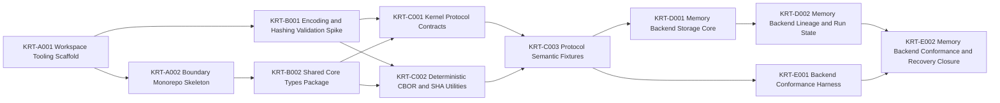

# Engineering Execution Plan

## 0. Version History & Changelog
- v0.1.0 - Initial kernel-first execution plan separating the active foundational scope from the broader TechSpec baseline.
- ... [Older history truncated, refer to git logs]

## 1. Executive Summary & Active Critical Path
- **Total Active Story Points:** 39
- **Critical Path:** `KRT-A001 -> KRT-A002 -> KRT-B002 -> KRT-C001 -> KRT-C003 -> KRT-D001 -> KRT-D002 -> KRT-E002`
- **Planning Assumptions:** This planning version covers only the user-authorized lowest-dependency foundation slice; the broader TechSpec baseline remains valid but deferred to later `Tasks.md` revisions.
- **Active-Scope Note:** `constitution/TechSpec.md` remains the authoritative full baseline for `v0.1`. This plan intentionally limits active execution to workspace setup and kernel-layer work that can stand on its own without framework, provider, stream, or host implementation dependencies.

## 2. Project Phasing & Iteration Strategy
### Current Active Scope
- Establish the reproducible workspace, root tooling, and boundary-first monorepo scaffold.
- Implement the shared cross-boundary core type primitives required before boundary contracts can compile cleanly.
- Implement the kernel protocol contract, deterministic CBOR encoding, SHA-256 identity helpers, and semantic fixtures.
- Deliver `@kraken/backend-memory` as the first semantic reference backend.
- Deliver a reusable backend conformance harness plus recovery-oriented kernel scenario coverage against the memory backend.

### Future / Deferred Scope
- Implement `@kraken/backend-sqlite`, including WAL-mode behavior and forward-only migrations.
- Implement the framework contract packages and framework core runtime.
- Implement the provider contract package and the AI SDK bridge package.
- Implement stream adapter packages and the playground host.
- Add future peer-backend conformance coverage beyond the memory and SQLite backends.

## 3. Build Order (Mermaid)


## 4. Ticket List
### Epic A — Workspace and Boundary Scaffold (WBS)

**KRT-A001 Workspace Tooling Scaffold**
- **Type:** Chore
- **Effort:** 3
- **Dependencies:** None
- **Capability / Contract Mapping:** TechSpec `§5.1`, `§5.2`, `§5.4.1`
- **Description:** Scaffold the root Bun-managed workspace, `devenv`, Nx project orchestration configuration, TypeScript, and Biome configuration so later boundary packages can be added against one reproducible toolchain baseline.
- **Acceptance Criteria (Gherkin):**
```gherkin
Given the repository contains only governing documents
When the workspace scaffold is added
Then the repository has root-level Bun workspace, Nx orchestration, TypeScript, Biome, and devenv configuration files aligned with the TechSpec
```

**KRT-A002 Boundary Monorepo Skeleton**
- **Type:** Chore
- **Effort:** 3
- **Dependencies:** KRT-A001
- **Capability / Contract Mapping:** TechSpec `§5.1`, `§5.1.1`, `§5.4.1`; ADR-003
- **Description:** Materialize the boundary-first monorepo directory structure and initial project manifests for the active foundation packages without implementing deferred framework or host logic.
- **Acceptance Criteria (Gherkin):**
```gherkin
Given the root workspace tooling exists
When the boundary-first package skeleton is created
Then the active-scope package directories and project manifests match the TechSpec structure rules without introducing deferred implementation packages
```

### Epic B — Shared Primitive Foundations (SPF)

**KRT-B001 Encoding and Hashing Validation Spike**
- **Type:** Spike
- **Effort:** 2
- **Dependencies:** KRT-A001
- **Capability / Contract Mapping:** TechSpec ADR-008, ADR-009, ADR-010; TechSpec `§3.1`, `§5.2`
- **Description:** Validate the exact deterministic CBOR and SHA-256 implementation strategy for the TypeScript baseline, including the fixture shape needed to keep Bun and Node behavior aligned before protocol code depends on it.
- **Acceptance Criteria (Gherkin):**
```gherkin
Given the kernel identity rules are fixed upstream
When the encoding and hashing spike is completed
Then the repository records a verified implementation approach and fixture strategy that matches the TechSpec's deterministic identity requirements
```

**KRT-B002 Shared Core Types Package**
- **Type:** Feature
- **Effort:** 2
- **Dependencies:** KRT-A002
- **Capability / Contract Mapping:** TechSpec `§3.1`, `§5.1`, `§5.4.2`
- **Description:** Implement `boundaries/shared/contracts/core-types` with the minimal cross-boundary primitives such as hash and epoch aliases, shared error foundations, and other truly boundary-agnostic types.
- **Acceptance Criteria (Gherkin):**
```gherkin
Given the boundary package skeleton exists
When the shared core types package is implemented
Then kernel and future framework contracts can depend on a minimal shared primitive package without duplicating foundational types
```

### Epic C — Kernel Protocol Contract (KPC)

**KRT-C001 Kernel Protocol Contracts**
- **Type:** Feature
- **Effort:** 5
- **Dependencies:** KRT-B001, KRT-B002
- **Capability / Contract Mapping:** PRD `CAP-P0-001`, `CAP-P0-002`, `CAP-P0-004`, `CAP-P0-006`; TechSpec `§3.2`, `§4.2`, `§5.4.3`; Kernel Spec `§2`, `§3`, `§4`
- **Description:** Implement the canonical kernel protocol types, operation signatures, and validation helpers for schemas, TurnTrees, TurnNodes, threads, branches, turns, runs, and staged results.
- **Acceptance Criteria (Gherkin):**
```gherkin
Given the shared primitive package and identity strategy exist
When the kernel protocol contract package is implemented
Then every kernel operation and persisted entity defined in the TechSpec is represented as a typed and validated contract in one canonical package
```

**KRT-C002 Deterministic CBOR and SHA Utilities**
- **Type:** Feature
- **Effort:** 3
- **Dependencies:** KRT-B001, KRT-B002
- **Capability / Contract Mapping:** PRD `CAP-P0-001`; TechSpec ADR-008, ADR-009, ADR-010; TechSpec `§3.1`, `§5.2`
- **Description:** Implement the deterministic CBOR encoding, decoding, record-profile validation, and SHA-256 identity helpers that the kernel contract and backends rely on for durable identity.
- **Acceptance Criteria (Gherkin):**
```gherkin
Given the kernel record profile forbids non-canonical data
When the deterministic encoding and hashing utilities are implemented
Then structured kernel records produce stable bytes and hash strings while invalid record shapes are rejected before persistence
```

**KRT-C003 Protocol Semantic Fixtures**
- **Type:** Chore
- **Effort:** 3
- **Dependencies:** KRT-C001, KRT-C002
- **Capability / Contract Mapping:** TechSpec `§3.2`, `§4.2`, `§5.2`
- **Description:** Add semantic fixtures and golden-byte tests that lock the kernel contract, entity shapes, validation failures, and identity expectations before backend implementations grow around them.
- **Acceptance Criteria (Gherkin):**
```gherkin
Given the kernel contracts and identity utilities exist
When the semantic fixture suite is added
Then canonical entities, deterministic bytes, and expected validation failures are exercised by stable tests that future backends must honor
```

### Epic D — Memory Backend Reference Implementation (MBR)

**KRT-D001 Memory Backend Storage Core**
- **Type:** Feature
- **Effort:** 5
- **Dependencies:** KRT-C003
- **Capability / Contract Mapping:** PRD `CAP-P0-001`, `CAP-P0-006`, `CAP-P0-007`; TechSpec `§3.3`, `§3.4`, `§4.3`, `§5.4.4`
- **Description:** Implement the in-memory backend's transaction shell plus the object, schema, TurnTree, ordered-path, and path-resolution storage behavior needed for protocol-semantic correctness.
- **Acceptance Criteria (Gherkin):**
```gherkin
Given the kernel contract is locked by fixtures
When the storage core of the memory backend is implemented
Then the backend can persist and resolve objects, schemas, TurnTrees, and ordered-path state in a way that matches the protocol-visible semantics
```

**KRT-D002 Memory Backend Lineage and Run State**
- **Type:** Feature
- **Effort:** 5
- **Dependencies:** KRT-D001
- **Capability / Contract Mapping:** PRD `CAP-P0-002`, `CAP-P0-004`, `CAP-P0-005`, `CAP-P0-008`; TechSpec `§3.2`, `§3.4`, `§4.3`, `§5.4.4`; Kernel Spec `§3.3`, `§3.4`, `§4`
- **Description:** Extend the memory backend to cover TurnNode lineage, thread and branch state, turn and run records, staged results, and the backend contract wiring required by the kernel implementation line.
- **Acceptance Criteria (Gherkin):**
```gherkin
Given the memory backend can already store kernel structural state
When lineage and run-state repositories are implemented
Then the backend can represent thread, branch, turn, run, and staged-result semantics required for checkpoint, recovery, and branch movement behavior
```

### Epic E — Conformance and Recovery Assurance (CRA)

**KRT-E001 Backend Conformance Harness**
- **Type:** Chore
- **Effort:** 5
- **Dependencies:** KRT-C003
- **Capability / Contract Mapping:** PRD `CAP-P0-001`, `CAP-P0-005`, `CAP-P0-014`; TechSpec `§3.4`, `§5.2`, `§5.4.10`
- **Description:** Build the shared backend conformance harness and scenario-oriented test utilities that future official backends must pass against the strict kernel-visible contract.
- **Acceptance Criteria (Gherkin):**
```gherkin
Given the protocol semantics are locked by shared fixtures
When the backend conformance harness is implemented
Then any backend can be exercised against one reusable suite that asserts kernel-semantic correctness rather than backend-specific behavior
```

**KRT-E002 Memory Backend Conformance and Recovery Closure**
- **Type:** Chore
- **Effort:** 3
- **Dependencies:** KRT-D002, KRT-E001
- **Capability / Contract Mapping:** PRD `CAP-P0-005`, `CAP-P0-014`; TechSpec `§5.2`, `§5.4.4`
- **Description:** Run the memory backend through the conformance harness and add checkpoint, staged-result, and recovery-oriented scenario coverage until the reference backend is a trustworthy semantic foundation for later layers.
- **Acceptance Criteria (Gherkin):**
```gherkin
Given the memory backend and conformance harness both exist
When recovery and conformance closure is completed
Then the memory backend passes the shared contract suite and scenario coverage demonstrates correct checkpoint and staged-progress semantics for the active foundation scope
```
