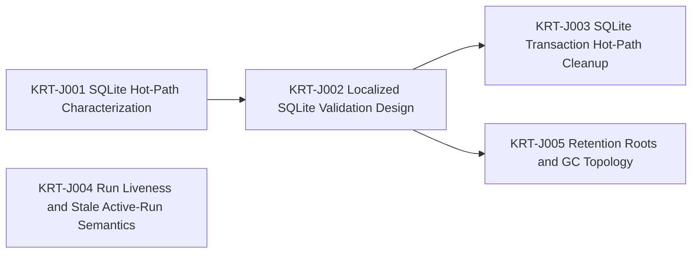

# Engineering Execution Plan

## 0. Version History & Changelog
- v0.5.0 - Rebased active scope after Epic I completion and inserted Runtime Foundation Hardening before deeper ReAct/runtime expansion.
- v0.4.0 - Advanced the active backlog past Epic H by splitting the post-runtime-core roadmap into narrower epics and making Epic I a focused ReAct Driver foundation slice.
- v0.3.1 - Narrowed Epic H around the docs-first minimal shared-core model by removing sequence semantics from core scope, reducing orchestration to handle/tree primitives, and shrinking the shared driver contract surface.
- ... [Older history truncated, refer to git logs]

## 1. Executive Summary & Active Critical Path
- **Total Active Story Points:** 16
- **Critical Path:** `KRT-J001 -> KRT-J002 -> KRT-J003`
- **Planning Assumptions:** Epic I is complete in repo reality. Before deeper ReAct loop/tool work resumes, the active scope is a bounded Runtime Foundation Hardening pass focused on confirmed persistence, run-liveness, and retention code smells. SQLite remains one backend implementation, not the runtime ontology; hardening work must preserve backend-neutral kernel semantics.

### Brownfield Continuity Note
- The current codebase already contains the workspace scaffold, shared core types, kernel protocol package, memory backend, SQLite backend, kernel testkit, shared framework contract packages, `runtime-core`, and the completed ReAct Driver foundation slice.
- This revision archives Epic I and inserts a focused foundation-hardening epic before the previously planned deeper ReAct runtime expansion.
- The supporting review is recorded in `constitution/reports/runtime-foundation-hardening-review.md`.

### Planning Heuristic
- During planning, prefer epic slices that look likely to land comfortably below roughly `5,000` lines of new code and treat roughly `10,000` lines as a warning threshold.
- This is a scoping heuristic for planning clarity, not an execution cap or a substitute for code review judgment.

## 2. Project Phasing & Iteration Strategy
### Delivery Cadence Posture
- No sprint or release-train cadence is assumed in this plan.
- This section uses "iteration strategy" only because the planning framework requires that heading; the content below is dependency phasing and scope partitioning, not a commitment to Scrum-style iterations.

### Current Active Scope
- Remove whole-database SQLite validation from the normal transaction hot path without weakening backend conformance.
- Establish a backend-local lineage validation strategy that avoids global scans and is explicit about depth-sensitive behavior.
- Specify run liveness and stale active-run recovery semantics before introducing schema or runtime contract changes.
- Define retention roots and GC reachability topology so future cleanup work preserves audit semantics.

### Future / Deferred Scope
- Epic K will extend the ReAct Driver through full loop and tool integration, including deeper ReAct-specific continuation behavior beyond the initial foundation slice.
- Epic L will implement the AI SDK provider bridge baseline once the first concrete driver exists against the provider-neutral contract.
- Epic M will implement stream adapter packages after the ReAct Driver and baseline provider bridge are in place.
- Epic N will implement the playground host after the stream adapters and baseline provider bridge exist.
- Epic O will cover additional concrete drivers beyond ReAct, such as pipeline, router, evaluator-optimizer, or orchestrator-worker variants.
- Future later epics may add peer official backends beyond memory and SQLite, along with production-grade host surfaces beyond the playground baseline.

### Archived or Already Completed Scope
- Epic A delivered the root workspace scaffold and boundary-first monorepo structure.
- Epic B delivered the shared primitive package plus deterministic identity spike validation.
- Epic C delivered the kernel protocol contracts, deterministic CBOR/SHA helpers, and semantic fixtures.
- Epic D delivered the semantic reference memory backend.
- Epic E delivered the reusable kernel backend conformance, invariant, and recovery harness and closed the memory backend against it.
- Epic F delivered the SQLite backend, migrations, repository logic, and conformance closure.
- Epic G delivered the shared framework contract partition across runtime, driver, event, tool, and provider surfaces.
- Epic H delivered the docs-first shared framework foundations, including the minimal shared-core contract realignment and `runtime-core`.
- Epic I delivered the first focused ReAct Driver foundation slice.

## 3. Build Order (Mermaid)


## 4. Ticket List
### Epic J — Runtime Foundation Hardening (RFH)

**KRT-J001 SQLite Hot-Path Characterization**
- **Type:** Spike
- **Effort:** 2
- **Dependencies:** None
- **Capability / Contract Mapping:** PRD `CAP-P0-003`, `CAP-P0-004`, `CAP-P0-005`; Architecture `§2`, `§4.3`; TechSpec `§3.4`, `§3.5`, `§5.2`
- **Description:** Characterize the current SQLite transaction hot path, isolate where full-state validation enters normal writes, and create a reproducible baseline that shows transaction cost against growing persisted history.
- **Acceptance Criteria (Gherkin):**
```gherkin
Given the SQLite backend currently validates loaded state inside normal transactions
When the hot-path characterization is completed
Then the repository contains a short findings note or benchmark output identifying the global validation entrypoints, the affected write operations, and the observed scaling risk
```

**KRT-J002 Localized SQLite Validation Design**
- **Type:** Spike
- **Effort:** 3
- **Dependencies:** KRT-J001
- **Capability / Contract Mapping:** PRD `CAP-P0-003`, `CAP-P0-004`, `CAP-P0-005`; Architecture `§2`, `§4.3`; TechSpec `§3.4`, `§3.5`
- **Description:** Design the replacement strategy for SQLite hot-path validation using targeted record checks, existing indexes, and measured lineage traversal approaches such as recursive CTEs where they fit the current schema.
- **Acceptance Criteria (Gherkin):**
```gherkin
Given the hot-path characterization identifies global validation in normal SQLite writes
When the localized validation design is completed
Then the design names the invariant checks that remain in the write path, the checks moved to diagnostics or tests, and the lineage query strategy required before implementation
```

**KRT-J003 SQLite Transaction Hot-Path Cleanup**
- **Type:** Chore
- **Effort:** 5
- **Dependencies:** KRT-J002
- **Capability / Contract Mapping:** PRD `CAP-P0-003`, `CAP-P0-004`, `CAP-P0-005`; Architecture `§2`, `§4.3`; TechSpec `§3.4`, `§3.5`, `§5.2`
- **Description:** Remove full-state validation from normal SQLite transactions, preserve explicit diagnostic validation, and close the backend against conformance, invariant, recovery, and targeted regression coverage.
- **Acceptance Criteria (Gherkin):**
```gherkin
Given the localized SQLite validation design is accepted
When the SQLite transaction hot path is cleaned up
Then normal backend transactions no longer reload and validate the full database while explicit diagnostics and shared backend suites continue to detect persisted corruption
```

**KRT-J004 Run Liveness and Stale Active-Run Semantics**
- **Type:** Spike
- **Effort:** 3
- **Dependencies:** None
- **Capability / Contract Mapping:** PRD `CAP-P0-004`, `CAP-P0-005`, `CAP-P0-008`; Architecture `§2`, `§4.4`; TechSpec `§3.2`, `§4.2`; Kernel Spec `§5.2`, `Appendix A`
- **Description:** Specify how the runtime distinguishes live running work, intentionally paused approval ownership, and stale active Runs after host or process failure without inventing backend-specific behavior.
- **Acceptance Criteria (Gherkin):**
```gherkin
Given active Runs currently block Branches until completed, failed, paused, or explicitly resolved
When the liveness semantics spike is completed
Then the resulting recommendation identifies required Kernel Spec, Framework Spec, TechSpec, and contract changes before any lease or preemption implementation begins
```

**KRT-J005 Retention Roots and GC Topology**
- **Type:** Spike
- **Effort:** 3
- **Dependencies:** KRT-J002
- **Capability / Contract Mapping:** PRD `CAP-P0-001`, `CAP-P0-002`, `CAP-P1-009`, `CAP-P0-010`; Architecture `§2`, `§4.2`, `§4.3`; TechSpec `§3.1`, `§3.2`, `§3.5`
- **Description:** Define host-authorized retention roots and prove the backend reachability topology needed for future cleanup of TurnNodes, TurnTrees, TurnTree paths, ordered chunks, Objects, Runs, and StagedResults.
- **Acceptance Criteria (Gherkin):**
```gherkin
Given the kernel preserves committed history and archives abandoned branch segments
When the retention topology spike is completed
Then the repository contains the proposed retention roots, reachability query strategy, and any SQLite index gaps without implementing destructive cleanup
```
