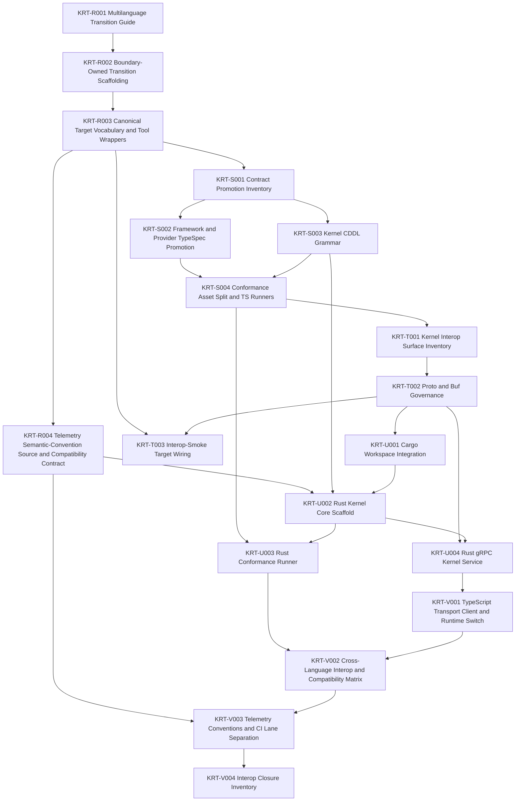

# Engineering Execution Plan

## 0. Version History & Changelog

- v0.8.1 - Tightened the transition execution line with pre-Rust telemetry semantic-convention work, strict Buf `FILE` governance, stronger peer-runner conformance language, and a near-public compatibility-matrix posture.
- v0.8.0 - Activated the multi-language transition line after Epic Q, closed `KRT-R001` in current repo reality, and defined Epics R-V plus deferred Epic W for artifact foundation, kernel interop, Rust kernel work, and cross-language stabilization.
- v0.7.6 - Recorded the user-directed playground-owned aimock/OpenAI E2E validation lane for streamed text, structured output, tool continuation, approval pause/resume, provider metadata, cancellation, provider failure, malformed responses, and unmatched fixtures as post-Epic-Q repository reality without reopening the closed Epic Q implementation scope.
- ... [Older history truncated, refer to git logs]

## 1. Executive Summary & Active Critical Path

- **Total Active Story Points:** 66
- **Critical Path:** `KRT-R002 -> KRT-R003 -> KRT-S001 -> KRT-S002 -> KRT-S004 -> KRT-T001 -> KRT-T002 -> KRT-T003 -> KRT-U001 -> KRT-U002 -> KRT-U003 -> KRT-U004 -> KRT-V001 -> KRT-V002 -> KRT-V003 -> KRT-V004`
- **Planning Assumptions:** Epics A-Q are closed in current repo reality. `KRT-R001` is now closed in current repo reality through `constitution/spikes/epic-r-multilanguage-transition-guide.md`. TechSpec v0.6.1 keeps the baseline AI SDK bridge on `LanguageModelV3` / `ProviderV3` from `@ai-sdk/provider@3.0.8`, pins the AG-UI adapter to `@ag-ui/core@0.0.52`, preserves the existing `ProviderStreamChunk` seam, treats tee-based fanout above `ExecutionHandle.events()` as the sanctioned multi-consumer host path when every required tee branch subscribes before the first pull, records SQLite playground validation as a Node-backed path because `@tuvren/backend-sqlite` uses `better-sqlite3`, keeps the playground-owned aimock/OpenAI E2E lane as local validation rather than a public provider contract, requires a formal telemetry semantic-convention source before Rust implementation work begins, treats Buf `FILE` compatibility as the default interop gate from the first `.proto` merge, and treats the compatibility matrix as a conservative near-public readiness signal rather than a private scratch report.

### Brownfield Continuity Note

- The current codebase already contains the workspace scaffold, shared core types, kernel protocol package, memory backend, SQLite backend, kernel testkit, shared framework contract packages, provider contract package, `runtime-core`, and the ReAct Driver foundation package.
- Current repository reality includes closed Epic K, L, M, N, O, and P behavior with explicit closure artifacts in `constitution/spikes/epic-k-react-loop-cancellation-inventory.md`, `constitution/spikes/epic-l-parity-inventory.md`, `constitution/spikes/epic-m-tool-approval-gap-inventory.md`, `constitution/spikes/epic-n-ai-sdk-bridge-inventory.md`, `constitution/spikes/epic-o-stream-adapter-inventory.md`, and `constitution/spikes/epic-p-playground-host-inventory.md`.
- `KRT-Q001` is now closed in current repo reality through `constitution/spikes/epic-q-hardening-gap-inventory.md`, which inventories the extraction targets, release-check targets, portability matrix, deferred Deno work, and remaining hardening gaps for the rest of Epic Q.
- The Epic Q target packages now exist under `boundaries/framework/testkit` and `boundaries/providers/testkit`, with release/verification scripts under `tools/scripts`.
- Those Epic Q testkit packages are now explicitly transitional and must be demoted from implicit authority into shared boundary-owned conformance assets plus peer implementation runners.
- The private playground host now also owns an aimock/OpenAI E2E validation lane that exercises `@tuvren/provider-bridge-ai-sdk` through a local OpenAI-compatible HTTP mock server without provider credentials, covering streamed text, structured output, tool continuation, approval pause/resume, provider metadata, cancellation, provider failure, malformed responses, and unmatched fixtures.
- Planning verification confirmed `ai@6.0.142` and `@ai-sdk/provider@3.0.8` are available and that `@ai-sdk/provider@3.0.8` exports `LanguageModelV3`, `ProviderV3`, `LanguageModelV3CallOptions`, `LanguageModelV3GenerateResult`, and `LanguageModelV3StreamPart`.
- Epic N now extends repo reality beyond those planning notes: the bridge package exists and the closure artifact above is the authoritative upstream seam for Epic O.
- Epic O now extends repo reality beyond those planning notes: `@tuvren/stream-core`, `@tuvren/stream-sse`, and `@tuvren/stream-agui` exist, `constitution/spikes/epic-o-stream-adapter-inventory.md` is the authoritative adapter mapping record, and Epic P must treat tee-based fanout plus the documented `tuvren.runtime.*` AG-UI custom namespace as the handoff surface rather than rediscovering protocol gaps or resubscription hazards.
- Epic P now extends repo reality beyond those planning notes: `@tuvren/playground-host` exists under `boundaries/hosts/implementations/typescript/playground`, `constitution/spikes/epic-p-playground-host-inventory.md` is the authoritative playground handoff, full-turn streams cover canonical/SSE/AG-UI fanout, approval resume continuation is projected to canonical/SSE only, non-reload memory scenarios run under Bun tests, branching is validated from a completed source head, and SQLite reload is validated through the built Node CLI path.
- `KRT-R001` now extends repo reality beyond those planning notes: the repository has an explicit multi-language transition guide in `constitution/spikes/epic-r-multilanguage-transition-guide.md`, and the next active scope begins with boundary-owned artifact scaffolding rather than ad hoc Rust experimentation.

### Sequential Scope Rule

- Epic Q is closed. The next implementation line begins with Epic R boundary-owned transition work and must not skip directly to Rust implementation work before the contract, conformance, interop, telemetry, and compatibility foundations exist.

### Planning Heuristic

- Prefer epic slices that look likely to land comfortably below roughly `5,000` lines of new code and treat roughly `10,000` lines as a warning threshold.
- This is a scoping heuristic for planning clarity, not an execution cap or a substitute for code review judgment.

## 2. Project Phasing & Iteration Strategy

### Delivery Cadence Posture

- No sprint or release-train cadence is assumed in this plan.
- This section uses "iteration strategy" only because the planning framework requires that heading; the content below is dependency phasing and scope partitioning, not a commitment to Scrum-style iterations.

### Current Active Scope

- Epic R activates the boundary-owned transition foundation after Epic Q: repo scaffolding, canonical target vocabulary, telemetry conventions, and compatibility placeholders.
- Epic R activates the boundary-owned transition foundation after Epic Q: substantial early target-shape scaffolding, canonical target vocabulary, a formal telemetry semantic-convention source, and compatibility foundations.
- Epic S promotes selected framework/provider contracts plus kernel record grammar into explicit machine-readable authored sources and splits the transitional TypeScript testkits into shared conformance assets plus TypeScript runners.
- Epic T defines the narrow kernel-only interop transport, Buf-governed `.proto` ownership, and interop-smoke/codegen orchestration.
- Epic U introduces the root Cargo workspace and the first Rust implementation only inside the kernel boundary.
- Epic V stabilizes real TypeScript framework to Rust kernel interoperability, compatibility-ledger generation, and cross-language telemetry/CI posture.

### Future / Deferred Scope

- Rust framework implementation work is deferred until Epic V closes.
- `LanguageModelV2` / `ProviderV2` compatibility is deferred.
- AI SDK agent loops, AI SDK UI message protocols, AI SDK transport helpers, LangChain bridges, provider-native tool support, and first-class Tuvren provider packages are deferred.
- ACP or any additional host protocol beyond SSE and AG-UI is deferred until a future TechSpec revision names it.
- Future concrete drivers beyond ReAct, official peer backends beyond memory/SQLite, and future language lines beyond Rust are deferred beyond Epic V unless a later TechSpec revision activates them.
- FFI-based Rust embedding is deferred until after the process-boundary kernel seam is proven boring and durable.
- Deno portability checks are deferred until public package surfaces stabilize enough to avoid testing scaffolding churn.

### Archived or Already Completed Scope

- Epics A-J established the architecture-first monorepo, shared core types, kernel protocol, memory and SQLite backends, shared framework contracts, `runtime-core`, the first ReAct driver slice, and the runtime-foundation hardening line.
- Epics K-M closed the first production-depth ReAct loop, streaming/provider parity, and tool/approval integration; authoritative closure evidence lives in `constitution/spikes/epic-k-react-loop-cancellation-inventory.md`, `constitution/spikes/epic-l-parity-inventory.md`, and `constitution/spikes/epic-m-tool-approval-gap-inventory.md`.
- Epics N-Q closed the post-ReAct TypeScript expansion line for the AI SDK bridge, host stream adapters, playground host harness, and release/portability hardening; authoritative closure evidence lives in `constitution/spikes/epic-n-ai-sdk-bridge-inventory.md`, `constitution/spikes/epic-o-stream-adapter-inventory.md`, `constitution/spikes/epic-p-playground-host-inventory.md`, and `constitution/spikes/epic-q-release-hardening-inventory.md`.
- `KRT-R001` delivered the multi-language transition constitution pass and the planning handoff artifact `constitution/spikes/epic-r-multilanguage-transition-guide.md`.

## 3. Build Order (Mermaid)



## 4. Ticket List

### Epic R - Multilanguage Transition Foundation (MTF)

- `KRT-R001` is closed in current repo reality.
- Closure artifact: `constitution/spikes/epic-r-multilanguage-transition-guide.md`
- Durable outcome:
  - the constitution now records the authority stack, target repo shape, migration phases, and Rust-kernel-first transition rule
  - the next active work begins with boundary-owned artifact scaffolding rather than language-specific implementation drift

**KRT-R001 Multilanguage Transition Guide**

- **Type:** Spike
- **Effort:** 2
- **Dependencies:** KRT-Q006
- **Capability / Contract Mapping:** PRD `CAP-P1-035`, `CAP-P1-036`; Architecture `1.2`, `2`, `4.5`; TechSpec `1.1`, `3.6`, `5.4.1`
- **Description:** Formalize the multi-language transition guide into the constitution so the next implementation line begins from explicit repo-owned authority instead of ad hoc portability assumptions.
- **Acceptance Criteria (Gherkin):**

```gherkin
Given Epic Q is closed in current repo reality
When the multilanguage transition guide is formalized
Then the constitution records the authority stack, target repo shape, migration phases, immediate guardrails, and the Tasks and TechSpec status language for the next implementation line
```

**KRT-R002 Boundary-Owned Transition Scaffolding**

- **Type:** Chore
- **Effort:** 3
- **Dependencies:** KRT-R001
- **Capability / Contract Mapping:** PRD `CAP-P1-035`, `CAP-P1-036`; Architecture `2`, `5`; TechSpec `3.6`, `5.1`, `5.1.1`
- **Description:** Add the first substantial boundary-owned `conformance/`, `interop/`, `telemetry/`, and `reports/compatibility/` scaffolding needed by the transition line while preserving current TypeScript package behavior.
- **Acceptance Criteria (Gherkin):**

```gherkin
Given the transition guide is the new planning handoff
When boundary-owned transition scaffolding is added
Then the owning boundaries and repo root have the planned artifact homes for conformance, interop, telemetry, and compatibility reporting
And the new structure creates a meaningful early slice of the target repo shape rather than only placeholder stubs
And the existing TypeScript implementation path still builds and tests without semantic rewrites
```

**KRT-R003 Canonical Target Vocabulary and Tool Wrappers**

- **Type:** Feature
- **Effort:** 3
- **Dependencies:** KRT-R002
- **Capability / Contract Mapping:** PRD `CAP-P1-035`; Architecture `2.1`, `5`; TechSpec `1.1`, `5.1.1`, `5.2`
- **Description:** Define the canonical repo-wide target vocabulary and wire Nx/tool wrappers so `build`, `test`, `lint`, `typecheck`, `conformance`, `codegen`, and `interop-smoke` delegate to the native toolchain for each active ecosystem.
- **Acceptance Criteria (Gherkin):**

```gherkin
Given the transition scaffolding exists
When canonical targets and wrappers are introduced
Then relevant projects expose the shared target vocabulary
And each target delegates to Bun, Cargo, Buf, or another native tool rather than replacing it with TypeScript-specific orchestration logic
```

**KRT-R004 Telemetry Semantic-Convention Source and Compatibility Contract**

- **Type:** Chore
- **Effort:** 2
- **Dependencies:** KRT-R003
- **Capability / Contract Mapping:** PRD `CAP-P1-036`; Architecture `4.5`, `5`; TechSpec `3.6`, `4.10`, `5.2`
- **Description:** Add the formal telemetry semantic-convention source plus the compatibility-ledger contract so later cross-language work has a stable evidence surface before Rust code lands.
- **Acceptance Criteria (Gherkin):**

```gherkin
Given the transition foundation is active
When the telemetry semantic-convention source and compatibility contract are added
Then the repository contains an authored OpenTelemetry semantic-convention source plus reviewed compatibility-ledger shape definitions
And the telemetry source is ready to drive generated TypeScript and Rust constants or helpers before Rust implementation work begins
And no hand-authored pass or fail claims are recorded in place of measured suite evidence
```

### Epic S - Boundary Contract and Conformance Artifactization (BCA)

- Planned. This epic promotes machine-readable authored sources and shared conformance assets before any Rust implementation becomes authoritative.

**KRT-S001 Contract Promotion Inventory**

- **Type:** Spike
- **Effort:** 2
- **Dependencies:** KRT-R003
- **Capability / Contract Mapping:** PRD `CAP-P1-035`, `CAP-P1-036`; Architecture `2`, `4.5`; TechSpec `3.6`, `4.8`, `5.1`
- **Description:** Inventory which framework and provider contract packages should promote TypeSpec now, which should remain unchanged for now, and how current testkit responsibilities map onto future boundary-owned conformance assets.
- **Acceptance Criteria (Gherkin):**

```gherkin
Given the transition scaffolding and target vocabulary exist
When the contract promotion inventory is completed
Then the repository records which contract packages adopt TypeSpec now, which stay unchanged, which artifacts each emits, and how current testkit responsibilities map into future conformance ownership
```

**KRT-S002 Framework and Provider TypeSpec Promotion**

- **Type:** Feature
- **Effort:** 5
- **Dependencies:** KRT-S001
- **Capability / Contract Mapping:** PRD `CAP-P0-019`, `CAP-P0-020`, `CAP-P1-035`; Architecture `2`, `5`; TechSpec `3.6`, `4.8`, `5.2`
- **Description:** Promote the selected framework and provider contract packages to authored TypeSpec sources and emit reviewed JSON Schema/OpenAPI artifacts without changing the shared semantic meaning of their public contracts.
- **Acceptance Criteria (Gherkin):**

```gherkin
Given the promotion inventory names the first contract packages
When TypeSpec promotion is complete
Then each selected contract package contains boundary-owned TypeSpec sources and emitted JSON Schema and OpenAPI artifacts
And the public contract meaning stays aligned with the existing runtime semantics and docs
```

**KRT-S003 Kernel CDDL Grammar**

- **Type:** Feature
- **Effort:** 3
- **Dependencies:** KRT-S001
- **Capability / Contract Mapping:** PRD `CAP-P0-001`, `CAP-P0-004`, `CAP-P1-035`; Architecture `2`, `4.5`; TechSpec `3.1`, `3.6`, `4.8`
- **Description:** Add CDDL-authored kernel record grammar for the canonical protocol records, manifests, runs, and recovery-shaped payloads without treating grammar as semantic authority over behavior.
- **Acceptance Criteria (Gherkin):**

```gherkin
Given the transition inventory has named the kernel artifact work
When kernel CDDL grammar is added
Then canonical kernel record families are represented under boundary-owned CDDL
And the grammar aligns with current protocol shapes without redefining recovery or lineage semantics in place of the docs
```

**KRT-S004 Conformance Asset Split and TypeScript Runners**

- **Type:** Feature
- **Effort:** 5
- **Dependencies:** KRT-S002, KRT-S003
- **Capability / Contract Mapping:** PRD `CAP-P0-005`, `CAP-P1-036`; Architecture `2`, `4.5`; TechSpec `3.6`, `4.8`, `5.2`
- **Description:** Split the current TypeScript-first testkit responsibilities into boundary-owned conformance schemas, fixtures, and scenarios plus TypeScript-specific runners that consume those suites as one peer implementation path among many.
- **Acceptance Criteria (Gherkin):**

```gherkin
Given contract packages and kernel grammar have authored machine-readable sources
When the conformance split is complete
Then the owning boundaries contain shared conformance schemas, fixtures, and scenarios
And the TypeScript implementation runs those suites through implementation-specific runners instead of treating testkit helpers as the semantic authority
And the resulting structure makes TypeScript one peer consumer of the shared behavioral corpus rather than the root implementation authority
```

### Epic T - Kernel Interop Governance (KIG)

- Planned. This epic defines the first cross-language transport seam before any Rust kernel implementation is treated as real.

**KRT-T001 Kernel Interop Surface Inventory**

- **Type:** Spike
- **Effort:** 2
- **Dependencies:** KRT-S004
- **Capability / Contract Mapping:** PRD `CAP-P1-035`, `CAP-P1-036`; Architecture `2`, `4.5`; TechSpec `4.9`, `5.4.1`
- **Description:** Inventory the narrow kernel-only interop surface, transport non-goals, versioning posture, and event/error envelope boundaries before authoring `.proto` files.
- **Acceptance Criteria (Gherkin):**

```gherkin
Given boundary-owned conformance assets now exist
When the kernel interop surface inventory is completed
Then the repository records the kernel operations, event and error envelopes, transport non-goals, and the rule that the initial interop seam is narrower than the full framework API
```

**KRT-T002 Proto and Buf Governance**

- **Type:** Feature
- **Effort:** 5
- **Dependencies:** KRT-T001
- **Capability / Contract Mapping:** PRD `CAP-P1-035`, `CAP-P1-036`; Architecture `2`, `5`; TechSpec `4.9`, `5.2`
- **Description:** Add kernel `.proto` ownership plus root Buf v2 configuration so the first transport surface has lint, generation, and breaking-change governance from the start.
- **Acceptance Criteria (Gherkin):**

```gherkin
Given the kernel interop surface has been inventoried
When proto and Buf governance is added
Then the repository contains boundary-owned kernel `.proto` files plus root Buf configuration
And transport changes are gated by lint and breaking-change checks rather than ad hoc review alone
And Buf `FILE` compatibility is the default breaking gate from the first `.proto` merge onward
```

**KRT-T003 Interop-Smoke Target Wiring and Binding Placement**

- **Type:** Feature
- **Effort:** 3
- **Dependencies:** KRT-R003, KRT-T002
- **Capability / Contract Mapping:** PRD `CAP-P1-036`; Architecture `2.1`, `4.5`; TechSpec `4.9`, `5.1.1`, `5.2`
- **Description:** Wire `codegen` and `interop-smoke` targets plus generated-binding placement rules so transport support code stays with the consuming implementation tree and the repo can exercise real cross-process checks later.
- **Acceptance Criteria (Gherkin):**

```gherkin
Given the kernel `.proto` surface is Buf-governed
When interop-smoke target wiring is complete
Then generated bindings live under the consuming implementation tree
And the repo exposes `codegen` and `interop-smoke` targets that invoke the native generators and smoke paths for the active ecosystems
```

### Epic U - Rust Kernel Baseline (RKB)

- Planned. This epic introduces Rust only under the kernel boundary and only after the artifact-backed seam exists.

**KRT-U001 Cargo Workspace and Rust Toolchain Integration**

- **Type:** Chore
- **Effort:** 3
- **Dependencies:** KRT-T002
- **Capability / Contract Mapping:** PRD `CAP-P1-035`; Architecture `2`, `5`; TechSpec `1`, `5.1`, `5.2`
- **Description:** Introduce the root Cargo workspace and Rust toolchain files plus repo wrappers so Rust tasks join the monorepo without redefining boundary ownership or replacing Nx orchestration.
- **Acceptance Criteria (Gherkin):**

```gherkin
Given the kernel transport surface is governed
When Rust workspace integration is added
Then the repository contains the root Cargo workspace and toolchain files
And repo orchestration can invoke Rust-native build and test flows without redefining the boundary-owned layout
```

**KRT-U002 Rust Kernel Core Scaffold**

- **Type:** Feature
- **Effort:** 5
- **Dependencies:** KRT-R004, KRT-S003, KRT-U001
- **Capability / Contract Mapping:** PRD `CAP-P0-001`, `CAP-P0-005`, `CAP-P1-035`; Architecture `2`, `4.5`; TechSpec `3.1`, `3.6`, `5.4.1`
- **Description:** Implement the first Rust kernel core scaffold against the shared protocol profile, deterministic identity rules, and kernel-visible operations without widening semantics or transport scope.
- **Acceptance Criteria (Gherkin):**

```gherkin
Given the Rust workspace exists and kernel grammar is authored
When the Rust kernel core scaffold is complete
Then Rust implements the required protocol record and validation baselines for the first conformance phase
And the Rust kernel does not widen the shared semantics or depend on framework-specific shortcuts
And Rust implementation work consumes the preexisting telemetry semantic-convention source instead of inventing a second observability vocabulary
```

**KRT-U003 Rust Conformance Runner**

- **Type:** Feature
- **Effort:** 5
- **Dependencies:** KRT-S004, KRT-U002
- **Capability / Contract Mapping:** PRD `CAP-P0-005`, `CAP-P1-036`; Architecture `4.5`; TechSpec `3.6`, `5.2`, `5.4.1`
- **Description:** Add a Rust conformance runner that consumes the shared boundary-owned protocol and recovery suites using the same suite naming and reporting discipline as TypeScript.
- **Acceptance Criteria (Gherkin):**

```gherkin
Given the Rust kernel core and shared conformance assets exist
When the Rust conformance runner is added
Then the protocol and recovery suites run against Rust through the shared suite contract
And the reported results are comparable with the TypeScript runner outputs without bespoke interpretation
```

**KRT-U004 Rust gRPC Kernel Service**

- **Type:** Feature
- **Effort:** 5
- **Dependencies:** KRT-T002, KRT-U002
- **Capability / Contract Mapping:** PRD `CAP-P1-035`, `CAP-P1-036`; Architecture `2`, `4.5`; TechSpec `4.9`, `5.4.1`
- **Description:** Expose the Rust kernel over the governed transport contract as the first real cross-process runtime seam.
- **Acceptance Criteria (Gherkin):**

```gherkin
Given the Rust kernel core and governed transport surface exist
When the Rust gRPC kernel service is implemented
Then the kernel operations and stable event and error payloads are available over the defined process boundary
And the service remains limited to the kernel scope rather than reimplementing the framework surface
```

### Epic V - TypeScript Framework and Rust Kernel Interop Stabilization (TRI)

- Planned. This epic proves the boring day-two story before any Rust framework work is allowed to start.

**KRT-V001 TypeScript Transport Client and Runtime Switch**

- **Type:** Feature
- **Effort:** 5
- **Dependencies:** KRT-U004
- **Capability / Contract Mapping:** PRD `CAP-P0-019`, `CAP-P1-035`; Architecture `2.1`, `4.5`; TechSpec `4.1`, `4.9`, `5.4.1`
- **Description:** Add the TypeScript-side transport client and explicit runtime selection seam so the framework can target either the in-process TypeScript kernel or the Rust kernel service without changing host-facing semantics.
- **Acceptance Criteria (Gherkin):**

```gherkin
Given the Rust kernel service exists
When the TypeScript transport client and runtime switch are added
Then the framework can target either the local TypeScript kernel or the Rust kernel through an explicit seam
And host-facing runtime behavior stays aligned with the existing public contracts
```

**KRT-V002 Cross-Language Interop and Compatibility Matrix**

- **Type:** Feature
- **Effort:** 5
- **Dependencies:** KRT-U003, KRT-V001
- **Capability / Contract Mapping:** PRD `CAP-P1-036`; Architecture `4.5`; TechSpec `4.10`, `5.2`, `5.4.1`
- **Description:** Run real TS framework to Rust kernel scenarios and generate the compatibility matrix from the resulting conformance and interop-smoke evidence as a conservative near-public readiness signal.
- **Acceptance Criteria (Gherkin):**

```gherkin
Given the Rust kernel passes its conformance runner and the TypeScript framework can target the transport seam
When cross-language interop scenarios run
Then named TS framework to Rust kernel smoke suites pass or fail explicitly
And the repository generates a compatibility matrix that records implementation ids, suite ids, suite versions, statuses, and evidence paths from those measured results
And the resulting report is worded conservatively enough to function as a near-public readiness signal rather than an internal-only scratch artifact
```

**KRT-V003 Telemetry Conventions and CI Lane Separation**

- **Type:** Feature
- **Effort:** 3
- **Dependencies:** KRT-R004, KRT-V002
- **Capability / Contract Mapping:** PRD `CAP-P1-036`; Architecture `5`; TechSpec `3.6`, `4.10`, `5.2`
- **Description:** Apply the shared telemetry vocabulary across TypeScript and Rust interop paths and separate CI into repo-global, language-native, and cross-language validation lanes.
- **Acceptance Criteria (Gherkin):**

```gherkin
Given cross-language interop scenarios now exist
When telemetry conventions and CI lane separation are implemented
Then TypeScript and Rust interop traces and reports use the shared runtime attribute vocabulary
And both implementation lines consume helpers or constants derived from the preexisting telemetry semantic-convention source
And CI clearly separates repo-global checks, language-native checks, and cross-language parity checks
```

**KRT-V004 Interop Closure Inventory**

- **Type:** Chore
- **Effort:** 2
- **Dependencies:** KRT-V003
- **Capability / Contract Mapping:** PRD `CAP-P1-035`, `CAP-P1-036`; Architecture `5`, `6`; TechSpec `4.10`, `5.3`, `5.4.1`
- **Description:** Record parity status, residual gaps, and the readiness gate for any future Rust framework work in a closure inventory and update the planning artifacts for the next revision.
- **Acceptance Criteria (Gherkin):**

```gherkin
Given the TS framework to Rust kernel seam has conformance, interop, telemetry, and compatibility evidence
When the interop closure inventory is recorded
Then the repository documents measured parity status, remaining gaps, Rust framework start prerequisites, and the TechSpec and Tasks status updates for the next planning pass
```

### Epic W - Rust Framework Start (RFS)

- Deferred until Epic V closes. No implementation tickets are authorized in this Tasks revision.
