# Engineering Execution Plan

## 0. Version History & Changelog

- v0.22.0 - Clarified that the proving-host and portability-gate evidence must become part of the repo's canonical verification path, and kept the portability scope focused on in-scope runtime semantics rather than explanatory or ecosystem-only material.
- v0.21.0 - Replaced the AG-closed maintenance posture with an active TypeScript productization plan centered on constitutional archive cleanup, host-facing package normalization, a serious REPL proving host, PostgreSQL, and portability-gate conformance closure before Rust resumes.
- v0.20.0 - Closed Epic AG in current repo reality through non-self-attesting promoted-plan hardening, real-kernel framework proof, refreshed compatibility evidence, and passing AG-gated `bun run codegen`, `bun run conformance`, `bun run compatibility:evidence`, `bun run interop-smoke`, `bun run release-check`, and `bun run verify`; TypeScript freeze-readiness is reaffirmed for the currently promoted supported applicable surfaces.
- ... [Older history truncated, refer to git logs]

## 1. Executive Summary & Active Critical Path

- **Total Active Story Points:** 59
- **Critical Path:** `KRT-AH001 -> KRT-AH002 -> KRT-AI001 -> KRT-AJ001 -> KRT-AI002 -> KRT-AJ002 -> KRT-AJ003 -> KRT-AK001 -> KRT-AK002 -> KRT-AK003 -> KRT-AL001 -> KRT-AL002 -> KRT-AL003`
- **Planning Assumptions:** `docs/` remains the timeless semantic authority; `constitution/` remains the live planning framework; stale constitutional support material moves under `constitution/archived/`; the SDK is the main product; the serious REPL CLI is the proving host; canonical stream plus SSE are portable surfaces; AG-UI and the TypeScript AI SDK bridge implementation are the standing implementation-specific exceptions; PostgreSQL lands before Rust; and Rust remains blocked until `product proof gate`, `platform gate`, and `portability gate` all pass.

### Brownfield Continuity Note

- Epics A-AG remain historical context, not the active forward-execution path.
- The current repo already proves a promoted semantic subset and a private playground host path, but the active plan now targets full TypeScript product proof rather than maintenance of the AG subset alone.
- Historical closure inventories may remain available for audit until archive migration lands, but they do not define current execution scope.

### Sequential Scope Rule

- No Rust framework or Rust product-line expansion is active in this plan.
- No first-class Tuvren provider packages are active in this plan.
- No AG-UI portability work is active in this plan beyond preserving correct TypeScript projection behavior.
- Public package publication remains deferred until the proving-host build and lived SDK curation clarify the stable high-level surface.

### Planning Heuristic

- Prefer ticket slices that fit focused solo-dev execution while preserving strict gates around product proof, backend rigor, and conformance truthfulness.
- Treat “green because a private harness succeeds” as insufficient evidence once a proving-host ticket exists on the critical path.

## 2. Project Phasing & Iteration Strategy

### Current Active Scope

- Narrow the live constitutional authority path and archive stale support material under `constitution/archived/`.
- Normalize host-facing TypeScript package naming and topology immediately before the proving-host build.
- Build a serious REPL host entirely on the intended high-level SDK surface.
- Add PostgreSQL as the next official backend and prove it under strict backend semantics.
- Close the portability gate across the intended portable runtime surface before Rust resumes.

### Future / Deferred Scope

- Rust framework and Rust product-line work
- First-class Tuvren provider packages and provider-family expansion beyond the TypeScript AI SDK bridge
- AG-UI as a required cross-language portable surface
- Additional host protocols beyond the current canonical stream and SSE surfaces
- Public package publication and final long-lived package curation after the proving-host experience stabilizes

### Archived or Already Completed Scope

- Epics A-Q established the baseline TypeScript runtime, ReAct path, provider bridge, stream adapters, playground host, and release-hardening work.
- Epics R-AG established the multi-language transition foundation, shared conformance architecture, kernel interop, and the AG hardening subset that remains historical evidence for promoted surfaces.
- That work remains valuable audit context, but the active path is now TypeScript product proof, TypeScript platform completion, and then portability-gate closure.

## 3. Build Order (Mermaid)

```mermaid
flowchart LR
  KRTAH001[KRT-AH001 Archive Sweep] --> KRTAH002[KRT-AH002 Live Authority Cleanup]
  KRTAH002 --> KRTAI001[KRT-AI001 SDK Naming Audit]
  KRTAI001 --> KRTAJ001[KRT-AJ001 REPL Host Contract]
  KRTAJ001 --> KRTAI002[KRT-AI002 Package Normalization]
  KRTAI002 --> KRTAJ002[KRT-AJ002 REPL Host Implementation]
  KRTAJ002 --> KRTAJ003[KRT-AJ003 Proving-Host Validation]
  KRTAJ003 --> KRTAK001[KRT-AK001 PostgreSQL Design Spike]
  KRTAK001 --> KRTAK002[KRT-AK002 PostgreSQL Implementation]
  KRTAK002 --> KRTAK003[KRT-AK003 PostgreSQL Proof]
  KRTAK003 --> KRTAL001[KRT-AL001 Portability Gap Inventory]
  KRTAL001 --> KRTAL002[KRT-AL002 Portable Semantics Closure]
  KRTAL002 --> KRTAL003[KRT-AL003 Rust Re-entry Reassessment]
```



## 4. Ticket List

### Epic AH — Constitutional Authority Reset (KRT)

**KRT-AH001 Constitutional Archive Sweep**
- **Type:** Chore
- **Effort:** 3
- **Dependencies:** None
- **Capability / Contract Mapping:** PRD `CAP-P1-032`, `CAP-P0-037`, `CAP-P1-038`; TechSpec `§1.1` documentation posture, `§5.3`
- **Description:** Separate historical constitutional support material from the live authority path and prepare the archive structure that will keep planning history available without letting it behave like current authority.
- **Acceptance Criteria (Gherkin):**
```gherkin
Given `constitution/` contains live planning artifacts and stale historical support material
When the constitutional archive sweep is completed
Then every retained non-live constitutional planning, report, or closure artifact is targeted for relocation under `constitution/archived/`
And no archived artifact remains referenced as current authority from the four live constitutional documents
And every retained historical artifact outside the live path is labeled as historical context only
And any script that writes fresh constitutional support artifacts outside the four live documents is retargeted to the archived lane, moved to a newly explicit live support lane, or removed from active verification paths before the sweep closes
And any support artifact still referenced by `docs/` or by the canonical verification path is either relocated out of stale paths or explicitly classified as a temporary retained live support artifact during archive migration
```

**KRT-AH002 Live Authority Path Cleanup**
- **Type:** Chore
- **Effort:** 3
- **Dependencies:** `KRT-AH001`
- **Capability / Contract Mapping:** PRD `CAP-P0-037`, `CAP-P1-038`; TechSpec `§5.3`, `§5.4`
- **Description:** Remove stale active-voice readiness and closure claims from the live constitutional path so the repo’s authoritative reading path is concise and truthful.
- **Acceptance Criteria (Gherkin):**
```gherkin
Given archived historical material has been separated from the live constitutional path
When the live authority path cleanup is completed
Then `docs/` remains the timeless semantic authority
And only `constitution/PRD.md`, `constitution/Architecture.md`, `constitution/TechSpec.md`, and `constitution/Tasks.md` remain on the live constitutional authority chain
And `constitution/AGENTS.md` remains only as a routing helper aligned to that chain rather than as a fifth authority document
And stale closure or freeze language no longer implies current product readiness without fresh evidence
```

### Epic AI — TypeScript SDK Surface Normalization (KRT)

**KRT-AI001 High-Level SDK Naming and Surface Audit**
- **Type:** Spike
- **Effort:** 2
- **Dependencies:** `KRT-AH002`
- **Capability / Contract Mapping:** PRD `CAP-P0-019`, `CAP-P0-020`, `CAP-P1-032`; TechSpec ADR-032, ADR-033
- **Description:** Audit the host-facing TypeScript packages and identify the rename, merge, split, and internal-only changes needed before the proving-host build.
- **Acceptance Criteria (Gherkin):**
```gherkin
Given the serious REPL host must prove the same high-level SDK surface downstream hosts will use
When the high-level SDK naming and surface audit is completed
Then every host-facing package in the proving-host path is classified as keep, rename, merge, split, or internal
And confusing names or package boundaries that would hinder the proving-host build are explicitly identified
And the audit does not prematurely freeze public package publication beyond the proving-host needs
```

**KRT-AI002 Host-Facing Package Normalization**
- **Type:** Feature
- **Effort:** 5
- **Dependencies:** `KRT-AJ001`
- **Capability / Contract Mapping:** PRD `CAP-P0-019`, `CAP-P0-020`, `CAP-P1-032`; TechSpec `§5.4`
- **Description:** Apply the host-facing rename and topology normalization so the proving host can depend only on the intended high-level SDK surface defined by the reference REPL host contract.
- **Acceptance Criteria (Gherkin):**
```gherkin
Given the host-facing package audit and the reference REPL host contract have identified the required normalization
When the host-facing packages are renamed or restructured
Then the serious REPL host can depend only on the intended high-level SDK surface
And internal-only packages are no longer required in the proving-host path
And existing behavior remains covered by automated build, typecheck, and validation lanes
```

### Epic AJ — Serious REPL Host Proof (KRT)

**KRT-AJ001 Reference REPL Host Contract**
- **Type:** Feature
- **Effort:** 3
- **Dependencies:** `KRT-AI001`
- **Capability / Contract Mapping:** PRD `CAP-P0-019`, `CAP-P0-020`, `CAP-P0-023`, `CAP-P0-026`, `CAP-P0-027`; TechSpec ADR-032
- **Description:** Define the serious REPL host command tree, scenario mode, and operator contract strictly around the host-facing SDK without inventing private proving-only seams, so the subsequent package normalization is driven by real host needs.
- **Acceptance Criteria (Gherkin):**
```gherkin
Given the host-facing package audit exists
When the reference REPL host contract is defined
Then the host exposes thread and branch controls, execution controls, approval resolution, steering, orchestration actions, persistence selection, and event inspection through the host-facing SDK
And the contract includes both interactive REPL use and scripted end-to-end scenario execution
And no required host action depends on private runtime-only APIs
```

**KRT-AJ002 Serious REPL Host Implementation**
- **Type:** Feature
- **Effort:** 8
- **Dependencies:** `KRT-AJ001`, `KRT-AI002`
- **Capability / Contract Mapping:** PRD `CAP-P0-005`, `CAP-P0-010`, `CAP-P0-013`, `CAP-P0-016`, `CAP-P0-019`, `CAP-P0-020`, `CAP-P0-023`, `CAP-P0-026`, `CAP-P0-027`, `CAP-P1-022`, `CAP-P1-024`
- **Description:** Build the serious REPL host using only the intended high-level SDK surface, proving the documented runtime behaviors as one coherent operator-facing product.
- **Acceptance Criteria (Gherkin):**
```gherkin
Given the reference REPL host contract is approved
When the serious REPL host is implemented
Then an operator can drive durable threads and branches, streaming, tools, approvals, steering, cancellation, orchestration, extension-powered behavior, structured output, and SQLite-backed reload from the host
And the same host supports non-persistent `memory` mode for proving flows that do not require durable reload
And the host consumes only the intended high-level SDK surface
And the host does not depend on playground-only shortcuts or implementation-local harness seams
```

**KRT-AJ003 Proving-Host End-to-End Validation**
- **Type:** Feature
- **Effort:** 5
- **Dependencies:** `KRT-AJ002`
- **Capability / Contract Mapping:** PRD `CAP-P0-019`, `CAP-P0-020`, `CAP-P0-023`, `CAP-P0-026`, `CAP-P0-027`, `CAP-P1-022`, `CAP-P1-024`; TechSpec ADR-032, ADR-033
- **Description:** Add automated end-to-end validation so the serious REPL host becomes the real product-proof surface instead of a manual demo.
- **Acceptance Criteria (Gherkin):**
```gherkin
Given the serious REPL host exists
When proving-host end-to-end validation is added
Then automated scenario runs cover at least threads and branches, approvals, steering, cancellation, orchestration, extensions, structured output, and reload
And those scenario runs explicitly cover both `memory` and SQLite-backed host execution where each mode is relevant
And TypeScript AI SDK bridge-backed provider scenarios remain covered as a first-class TypeScript product obligation even though the bridge implementation is not itself a required portable surface
And interactive REPL flows and scripted scenario mode share the same host-facing implementation path
And product-proof claims cite proving-host evidence rather than private playground-only evidence
And named proving-host validation targets are introduced for the serious REPL host rather than reusing playground-only target names as the lasting gate
And that wiring replaces the current `host-playground:interop-smoke` and `host-playground:scenario-sqlite` product-proof path in `tools/scripts/verify.ts`
And the repo's canonical verification path consumes those proving-host validation targets through `package.json` entry points and `tools/scripts/verify.ts` as the decisive `product proof gate` so stale or failing host-proof evidence breaks readiness claims
```

### Epic AK — PostgreSQL Product Backend (KRT)

**KRT-AK001 PostgreSQL Backend Design Spike**
- **Type:** Spike
- **Effort:** 3
- **Dependencies:** `KRT-AJ003`
- **Capability / Contract Mapping:** PRD `CAP-P0-001`, `CAP-P0-005`, `CAP-P0-006`, `CAP-P0-008`; TechSpec `§1.1` backend posture, ADR-007, ADR-033
- **Description:** Define the PostgreSQL backend’s physical model, migration strategy, and semantic constraints against the existing kernel contract before implementation begins.
- **Acceptance Criteria (Gherkin):**
```gherkin
Given the serious REPL host proves the SDK on memory and SQLite
When the PostgreSQL backend design spike is completed
Then the backend’s physical model, migration strategy, transaction semantics, and host compatibility constraints are defined against the existing kernel contract
And no PostgreSQL optimization weakens the shared kernel-visible guarantees
And the design identifies any contract or conformance additions required before implementation
```

**KRT-AK002 PostgreSQL Backend Implementation**
- **Type:** Feature
- **Effort:** 8
- **Dependencies:** `KRT-AK001`
- **Capability / Contract Mapping:** PRD `CAP-P0-001`, `CAP-P0-005`, `CAP-P0-006`, `CAP-P0-008`, `CAP-P0-030`; TechSpec ADR-006, ADR-007
- **Description:** Implement PostgreSQL as the next first-class backend without weakening kernel semantics, host-facing behavior, or proving-host assumptions.
- **Acceptance Criteria (Gherkin):**
```gherkin
Given the PostgreSQL backend design is approved
When the PostgreSQL backend is implemented
Then the backend satisfies the same strict kernel-visible semantics as memory and SQLite
And the backend owns its migrations, validation, and runtime integration without changing host-facing framework semantics
And the backend is executable through the same high-level SDK and proving-host flows as the existing backends
```

**KRT-AK003 PostgreSQL Proof and Parity Validation**
- **Type:** Feature
- **Effort:** 5
- **Dependencies:** `KRT-AK002`
- **Capability / Contract Mapping:** PRD `CAP-P0-001`, `CAP-P0-005`, `CAP-P0-006`, `CAP-P0-008`; TechSpec ADR-007, ADR-033
- **Description:** Prove PostgreSQL under strict backend validation and host-proof scenarios so it becomes part of the platform gate rather than a speculative future backend.
- **Acceptance Criteria (Gherkin):**
```gherkin
Given the PostgreSQL backend implementation exists
When parity validation is executed
Then backend conformance covers the promoted kernel and framework semantics expected of first-class backends
And proving-host end-to-end scenarios run successfully against PostgreSQL where persistence is required
And PostgreSQL passes strict verification lanes rather than being accepted as a best-effort optional backend
```

### Epic AL — Portability Gate Closure (KRT)

**KRT-AL001 Portable-Surface Conformance Gap Inventory**
- **Type:** Spike
- **Effort:** 3
- **Dependencies:** `KRT-AK003`
- **Capability / Contract Mapping:** PRD `CAP-P0-037`, `CAP-P1-038`, `CAP-P1-035`, `CAP-P1-036`; TechSpec ADR-033
- **Description:** Inventory the remaining gap between the productized TypeScript line and the fully portable surface that must be packet/plan/runner-owned before Rust resumes.
- **Acceptance Criteria (Gherkin):**
```gherkin
Given the TypeScript product line proves the intended SDK and backends end to end
When the portable-surface conformance gap inventory is completed
Then every documented portable surface in the active product scope is classified as packet/plan/runner-owned, implementation-specific by explicit exception, or missing portability work
And canonical stream plus SSE are treated as required portable surfaces
And AG-UI plus the TypeScript AI SDK bridge implementation are the only standing implementation-specific exceptions unless a new explicit decision changes that rule
And the inventory separately records `memory` proving obligations and TypeScript AI SDK bridge-backed product obligations so they remain tested even where they are not portable targets
And explanatory documentation and ecosystem-only adapter notes are not allowed to inflate the portable runtime scope beyond the intended product semantics
```

**KRT-AL002 Portable Semantics Promotion Closure**
- **Type:** Feature
- **Effort:** 8
- **Dependencies:** `KRT-AL001`
- **Capability / Contract Mapping:** PRD `CAP-P0-037`, `CAP-P1-038`, `CAP-P1-035`, `CAP-P1-036`; TechSpec `§4.11`, `§4.12`, `§4.13`, ADR-030, ADR-033
- **Description:** Promote the remaining intended portable semantics into authority packets, conformance plans, fixtures, generated artifacts, and runner-observed checks.
- **Acceptance Criteria (Gherkin):**
```gherkin
Given the portability gap inventory identifies missing portable semantics
When the remaining portable TypeScript semantics are promoted
Then the intended portable surface is carried by authority packets, conformance plans, fixtures, generated artifacts, and runner-observed checks rather than implementation-local tests
And provider-agnostic semantics remain Tuvren-owned instead of AI-SDK-shaped
And orchestration, extensions, host-proof semantics, canonical stream, and SSE assertions no longer depend on implementation-local summary logic where runner-observed proof is possible
And `package.json` entry points and `tools/scripts/verify.ts` treat the promoted portability evidence as decisive rather than leaving `docs:af-gap-plan:check` as the portability proxy once the new gate lands
```

**KRT-AL003 Rust Re-entry Gate Reassessment**
- **Type:** Chore
- **Effort:** 3
- **Dependencies:** `KRT-AL002`
- **Capability / Contract Mapping:** PRD `CAP-P1-035`, `CAP-P1-038`; TechSpec ADR-033, `§5.4`
- **Description:** Reassess the staged gates from fresh evidence and state plainly whether Rust framework/product work may begin.
- **Acceptance Criteria (Gherkin):**
```gherkin
Given the portability-gate closure work is complete
When the re-entry gate is reassessed
Then fresh evidence states whether `product proof gate`, `platform gate`, and `portability gate` have all passed
And Rust framework/product work remains blocked unless all staged gates are satisfied
And the constitutional docs name the exact evidence and remaining blockers instead of relying on stale historical closure language
```

## 5. Issue-Level Definition of Done

- Historical constitutional support material no longer behaves like live authority once archived.
- The serious REPL host proves the SDK through the same host-facing abstractions downstream hosts are expected to use.
- End-to-end scenario automation exists for the proving host and covers durable reload, approvals, steering, orchestration, extensions, structured output, and persistence flows.
- `memory` mode and SQLite mode are both explicitly covered where their differing product obligations matter.
- SQLite and PostgreSQL satisfy the same strict kernel-visible semantics expected of first-class backends.
- Canonical stream semantics and SSE translation are portable runner-owned surfaces; AG-UI remains an explicitly implementation-specific projection.
- Provider-agnostic semantics remain Tuvren-owned and do not depend on AI SDK bridge shapes to define cross-language truth.
- TypeScript AI SDK bridge-backed provider scenarios remain a required TypeScript product-proof lane even though the bridge implementation itself is not a cross-language portability target.
- The canonical verification path enforces both the proving-host `product proof gate` and the promoted portability evidence once those lanes land.
- The `product proof gate`, `platform gate`, and `portability gate` are evidenced from fresh checks before Rust framework/product work can resume.
