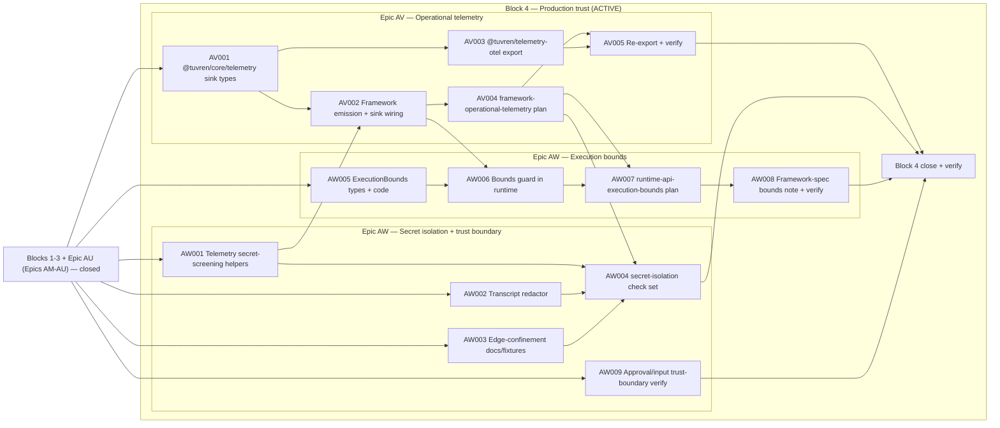

# Engineering Execution Plan

## 0. Version History & Changelog

- v0.29.1 - Maintenance alignment after Epic AU closure: compacted completed Epics AM-AU into the closed-work ledger, marked AU closed with `kernel-crash-recovery` evidence, narrowed the active production-trust scope to Epics AV and AW only (14 tickets, 60 points), and updated the active graph/DoD accordingly.
- v0.29.0 - Opened the v0.8.0 production-trust block (PRD v0.8.0 / Architecture v0.8.0 / TechSpec v0.28.0, ADR-042 through ADR-045): added Epics AU (durability & recovery proof under fault injection), AV (operational telemetry surface + vendor-neutral export), and AW (trust-boundary security hardening — framework-enforced execution bounds, secret isolation, and approval/input trust-boundary verification) as the active critical path (19 tickets, 83 points). Recorded the post-trust-block roadmap (Epics AX–BB: performance budgets, public API freeze, publication, docs/onboarding, reference application) as named, un-ticketed deferred scope to anchor a future planning session.
- v0.28.4 - Maintenance alignment: reflected TechSpec v0.27.2, closed the stale AQ status marker, narrowed active scope language to AS-AT, and corrected Epic AS planning around `@modelcontextprotocol/sdk@1.29.0`'s inherited `zod` peer requirement.
- ... [Older history truncated, refer to git logs]

## 1. Executive Summary & Active Critical Path

- **Total Active Story Points:** 60 across the remaining production-trust block — Epic AV (24) and Epic AW (36). Epics AM (32), AN (13), AO (26), AP (37), AQ (15), AR (15), AS (31), AT (34), and AU (23) are closed and retained as a compact audit ledger below.
- **Critical Path:** `KRT-AV001 → KRT-AV002`, with `KRT-AW001` feeding `KRT-AV002`; then the branch splits: `KRT-AV004 → KRT-AW004` for telemetry-secret isolation, while `KRT-AW005` converges with `KRT-AV002` into `KRT-AW006 → KRT-AW007 → KRT-AW008` for execution bounds. `KRT-AW009` is an independent required close-condition security lane and must complete before the final block closure/verify point.
- **Planning Assumptions:** PRD v0.8.0, Architecture v0.8.0, and TechSpec v0.28.x (ADR-042 through ADR-045) govern this block; Epic AU is closed in repository reality and Epics AV/AW remain active. The prior chain (PRD v0.7.0 / Architecture v0.7.0 / TechSpec v0.27.x, ADR-034 through ADR-041, Epics AM-AT) is closed. The production-trust block hardens the existing TypeScript line and does NOT reopen Rust framework/product work, additional drivers, additional host protocols, additional backends, or broader provider families. The `product proof gate`, `platform gate`, and `portability gate` from Epic AL remain the staged-gate baseline. The locked external dependency versions per TechSpec §1 still apply; `@tuvren/telemetry-otel` pins its `@opentelemetry/*` versions in Epic AV per the §1 pin-on-activation rule. The new `@tuvren/core/telemetry` subpath raises the curated core surface from 8 to 9 subpaths; `@tuvren/telemetry-otel` is an implementation-specific projection (a standing portability exception alongside AG-UI) while the canonical telemetry vocabulary (`telemetry/semconv/tuvren-runtime.yaml`) remains portable authority.

### Brownfield Continuity Note

- Epics A-AL remain historical context. Epic AL's closure of the staged gates is the foundation this chain extends.
- The current repo proves the host-facing SDK through the serious REPL host (`@tuvren/repl-host`) and its named `proving-host:*` validation lanes; exercises PostgreSQL as a first-class backend across kernel conformance and proving-host reload; closes the portability gate through `tools/scripts/portability-gate.ts`; and now carries the shared primitive surface in `@tuvren/core` with source-bearing runtime implementation in `@tuvren/runtime`. The old contract package handles and `@tuvren/runtime-core` are compatibility shims only; Epic AT retired `@tuvren/playground-host` and the remaining playground-named REPL internals in favor of the production REPL/headless CLI.
- Historical closure inventories live under `constitution/archived/` for audit only.

### Sequential Scope Rule

- No Rust framework or Rust product-line expansion is active in this plan. The kernel work in Epic AM (Rust `InMemoryKernel.thread_list` + gRPC server) extends the existing Rust kernel boundary; it does not open Rust framework/product scope.
- No first-class Tuvren provider packages are active in this plan beyond the TypeScript AI SDK bridge and the new MCP client (which is a tool source, not a model provider).
- No AG-UI portability work is active in this plan beyond preserving correct TypeScript projection behavior.
- No additional host protocols beyond the canonical stream and SSE surfaces are active in this plan. The headless REPL mode (Epic AT) is a CLI surface, not a wire protocol.
- Public package publication remains deferred. The consolidated SDK layout (`@tuvren/core` + `@tuvren/runtime`) defines the curated v1 surface; the publication act itself is out of scope for this chain and is recorded as a named post-trust-block roadmap item (Epic AZ) in §2.
- The remaining production-trust block (AV, AW) hardens the existing TypeScript line only. Epic AU's fault-injection seam is closed, testkit-only, and never reachable from production paths; the telemetry surface (Epic AV) adds an outbound observability surface plus an implementation-specific OTel projection without changing runtime truth; execution bounds and secret isolation (Epic AW) add framework-owned guards and credential-edge confinement without altering kernel semantics.

### Planning Heuristic

- Prefer ticket slices that fit focused solo-dev execution while preserving strict gates around product proof, backend rigor, and conformance truthfulness.
- Treat “green because a private harness succeeds” as insufficient evidence once a proving-host ticket exists on the critical path.

## 2. Project Phasing & Iteration Strategy

### Current Active Scope

- **Block 4 — Production trust remainder (Epics AV, AW): ACTIVE.** Epic AU is closed. The remaining critical path adds the first-class operational telemetry surface (`@tuvren/core/telemetry` sink) with framework emission and a vendor-neutral `@tuvren/telemetry-otel` export, then hardens trust boundaries through framework-enforced execution bounds with a typed `execution_bound_exceeded` terminal result, secret isolation across durable, telemetry, and transcript surfaces, and verification that approval gates are non-bypassable and untrusted MCP/tool inputs are validated.
- **Block 1 — Boundary correctness gate (Epics AM, AN, AO):** closed. The kernel now exposes `thread.list` with the corrected 30-operation narrative, `ExecutionHandle` exposes base-handle `awaitResult`, and `TuvrenRuntime` exposes the five-method durable-read surface (`listThreads`, `listBranches`, `getTurnState`, `getTurnHistory`, `readBranchMessages`).
- **Block 2 — Curated surface + ergonomics (Epics AP, AQ, AR):** closed. Epic AP landed `@tuvren/core` and folded the source-bearing runtime implementation into `@tuvren/runtime`. Epic AQ added the schema-agnostic `defineTool` helper (Zod / Standard Schema / wrapped JSON Schema with type inference). Epic AR added the `createTuvren({...})` batteries-included factory with full lifecycle conformance across memory, SQLite, and PostgreSQL backends.
- **Block 3 — Capability spikes (Epics AS, AT):** closed. Epic AS added `@tuvren/mcp-client` as a first-class tool source over stdio + Streamable HTTP-backed public `http-sse` transports. Epic AT retired `@tuvren/playground-host`, renamed internal REPL host modules to drop the playground naming, added headless stdin mode for the reference host, added streaming JSONL output, and added JSONL transcript capture/replay.

### Future / Deferred Scope

- Rust framework and Rust product-line work — still blocked. The kernel work in Epic AM (Rust `InMemoryKernel.thread_list` + gRPC server) extends the existing Rust kernel boundary only.
- First-class Tuvren-owned model-provider packages beyond the TypeScript AI SDK bridge.
- Cross-tenant thread search, multi-tenant ACLs, full-text indexed querying through the embeddable SDK (PRD v0.7.0 §6 Out of Scope; deferred to a future hosted/server projection).
- Server or REST projection of the durable-read surface (same future projection).
- Model Context Protocol server-side projection — Tuvren as an MCP server. Only the client side is in scope through Epic AS.
- Schema adapters beyond Zod, Standard Schema, and wrapped JSON Schema in the core surface — Valibot, ArkType, Effect Schema, and others remain post-v1 optional packages.
- Driver hot-swap or additional drivers beyond the ReAct baseline.
- Per-call approval edit forms beyond the existing approve/reject/edit verbs in the reference host UX.
- Script-file interpreter or external scripting language for the headless reference host (stdin is the only headless input surface).
- AG-UI as a required cross-language portable surface (currently a standing exception).
- Additional host protocols beyond the canonical stream and SSE surfaces.
- Additional official backends beyond memory, SQLite, and PostgreSQL.
- Public package publication and final long-lived package curation — the consolidated `@tuvren/core` + `@tuvren/runtime` layout from Epic AP defines the surface; the publication act itself is post-chain (see Epic AZ in the roadmap below).

#### Post-Trust-Block Roadmap (Epics AX–BB) — Named, Not Yet Ticketed

These epics are the agreed direction after the production-trust block, toward the goal of host adoption plus first-party dogfooding (PRD §1.4 Strategic Direction). They are recorded here with enough scope to anchor a future planning session; they are intentionally NOT decomposed into tickets yet, and their upstream PRD/Architecture/TechSpec deltas (where needed) are authored when each is activated.

- **Epic AX — Performance Characterization & Regression Budgets.** Benchmark the hot paths (deterministic CBOR encode/hash, checkpoint commit, context assembly, backend reads/writes, durable-read pagination), publish documented performance budgets, and wire a `bench` regression gate into the canonical verification path. Prerequisite: the durability guarantees from Epic AU are proven first, so budgets are measured against a correct baseline.
- **Epic AY — Public API Surface Freeze & Semver Discipline.** Define the stable public API of `@tuvren/core` + `@tuvren/runtime` (API-report tooling, deprecation policy, documented stability guarantees). Sequencing note: run AY *after* the reference application (BB) so the surface is frozen against real usage friction, not before.
- **Epic AZ — Publication & Release Engineering.** npm publication of the curated packages, changesets / versioning, CI release pipeline, and provenance. This is the deferred "post-chain" publication item, de-risked by the trust block and gated on AY's surface freeze.
- **Epic BA — Documentation & Onboarding.** Docs site, getting-started, cookbook, and API reference — the artifacts that convert "built" into "others build on it."
- **Epic BB — Reference Application (Dogfood Target).** A real, non-trivial application built end-to-end on Tuvren that satisfies the dogfooding goal and surfaces API friction feeding back into AY. Recommended to run before AY.

### Archived or Already Completed Scope

- Epic AH completed the constitutional authority reset: historical support material moved under `constitution/archived/`, active generated support artifacts now live under `constitution/support/live/`, and the live authority chain is narrowed to the four constitutional documents plus explicit support inputs.
- Epics A-Q established the baseline TypeScript runtime, ReAct path, provider bridge, stream adapters, playground host, and release-hardening work.
- Epic AI completed the current host-facing TypeScript package audit/normalization path through [epic-ai-high-level-sdk-surface-audit.md](./archived/spikes/epic-ai-high-level-sdk-surface-audit.md).
- Epic AJ completed the serious REPL proving-host path, including shared interactive/scenario host wiring, named `proving-host:*` validation targets, Node-backed SQLite reload proof, Rust-kernel interop proof, and refreshed compatibility evidence.
- Epic AK completed the PostgreSQL platform-gate path by landing `@tuvren/backend-postgres`, wiring REPL PostgreSQL reload proof plus TypeScript PostgreSQL conformance through `devenv`, and integrating those lanes into the canonical verification path.
- Epic AL closed the portability gate by promoting tool contracts, kernel CDDL registration, SSE projection, kernel and framework interop packets, and telemetry semantic conventions into packet/plan/runner-owned authority, by landing `tools/scripts/portability-gate.ts` as the canonical portability proxy in the verify lane, and by recording the staged-gate re-entry verdict in `constitution/support/live/epic-al-rust-re-entry-gate-reassessment.md`.
- Epics R-AG established the multi-language transition foundation, shared conformance architecture, kernel interop, and the AG hardening subset that remains historical evidence for promoted surfaces.
- Epics AM through AP closed the kernel enumeration, base-handle terminal-value, durable-read, and package-consolidation portions of the v0.27.0 constitutional revision chain.
- Epics AM-AU are summarized in the completed-work ledger in §4.
- That work remains valuable audit context. The active forward path is the remaining production-trust block (Epics AV and AW); see Current Active Scope.

## 3. Build Order (Mermaid)



## 4. Ticket List

### Completed Work Ledger (Epics AM-AU)

Completed ticket detail is removed from the active execution plan and retained through git history plus archived support artifacts. This ledger is the live audit summary for recently closed execution scope.

| Epic | Points | Closed Outcome | Evidence Anchor |
| --- | ---: | --- | --- |
| AM | 32 | Added `thread.list`, corrected the kernel operation narrative to 30 operations, and covered TypeScript/Rust/gRPC paths. | `kernel-protocol.thread.enumeration`; kernel protocol authority packet; refreshed compatibility evidence |
| AN | 13 | Promoted `ExecutionHandle.awaitResult` to the base handle with `ExecutionResult`. | `runtime-api-handle-terminal-value`; refreshed framework compatibility evidence |
| AO | 26 | Added the five-method `TuvrenRuntime` durable-read surface and removed the proving-host kernel-inspector seam. | `runtime-api-durable-reads`; refreshed framework compatibility evidence |
| AP | 37 | Consolidated shared primitives into `@tuvren/core`, folded source-bearing runtime code into `@tuvren/runtime`, and kept deprecated compatibility shims for one cycle. | `boundaries/shared/contracts/core/spec/authority-packet.json`; compatibility evidence |
| AQ | 15 | Added schema-agnostic `defineTool`, `FlexibleSchema`, `asSchema`, `jsonSchema`, `zodSchema`, and `standardSchema`. | `runtime-api-schema-authoring`; schema-authoring unit coverage |
| AR | 15 | Added the `createTuvren({...})` batteries-included factory, lifecycle cleanup, and curated runtime re-exports. | `runtime-api-batteries-included`; memory/SQLite/PostgreSQL compatibility evidence |
| AS | 31 | Added `@tuvren/mcp-client` as a first-class tool source over stdio and Streamable HTTP-backed public `http-sse` transport. | `providers-mcp-client`; MCP authority packet; portability inventory |
| AT | 34 | Consolidated the reference host on the REPL CLI, added headless stdin mode, streaming JSONL, transcript capture/replay, and retired `@tuvren/playground-host`. | `proving-host-headless-transcript-replay`; `proving-host:*` lanes; compatibility evidence |
| AU | 23 | Proved durability and recovery under failure with a testkit-only fault-injection seam, strengthened crash-recovery conformance, and the Crash Recovery Invariant. | `kernel.crash-recovery.*`; `createFaultInjectingBackend`; kernel restart-recovery evidence |

### Epic AV — Operational Telemetry Surface (KRT)

**Status:** Not started — active. Realizes ADR-042. `KRT-AV002` consumes the telemetry secret-screening helpers from `KRT-AW001`.

**KRT-AV001 `@tuvren/core/telemetry` Subpath: Sink + Record Types**
- **Type:** Feature
- **Effort:** 5
- **Dependencies:** None
- **Capability / Contract Mapping:** PRD `CAP-P0-052`; TechSpec ADR-042, §3.10, §4.18
- **Description:** Add the `./telemetry` subpath to `@tuvren/core`: `TuvrenTelemetrySink`, `TelemetrySpan`, `TelemetryEvent`, `TelemetryLineage`, `TelemetrySpanKind`, `TelemetryEventKind`, and `NoopTelemetrySink` (§3.10, §4.18). Update the package `exports` map (10 entries), `tsup.config.ts` (10 entries), the merged core authority packet (one new binding section plus authoritative source entries, with a packet-version bump), the shared core machine-readable sources and generated artifacts for the new telemetry shapes, and `tools/scripts/portability-gate.ts` for the new subpath.
- **Acceptance Criteria (Gherkin):**
```gherkin
Given the §3.10 record shapes and §4.18 sink contract
When the @tuvren/core/telemetry subpath is added
Then TuvrenTelemetrySink, TelemetrySpan, TelemetryEvent, TelemetryLineage, and NoopTelemetrySink are exported from @tuvren/core/telemetry
And TelemetrySpanKind and TelemetryEventKind are exported from @tuvren/core/telemetry
And the package exports map and tsup config carry 10 entries
And the merged core authority packet declares the telemetry binding section and bumps its version
And the shared core machine-readable sources and generated artifacts define the telemetry record shapes and kind unions
And the portability gate recognizes the new subpath
And typecheck and build pass
```

**KRT-AV002 Framework Emission + Sink Wiring + `createTuvren` Telemetry Option**
- **Type:** Feature
- **Effort:** 8
- **Dependencies:** `KRT-AV001`, `KRT-AW001`
- **Capability / Contract Mapping:** PRD `CAP-P0-052`; TechSpec ADR-042, §4.18, §5.6.2; ADR-044 (telemetry secret-screening)
- **Description:** Wire emission in `@tuvren/runtime` at the §4.18 points that already have producers in the runtime (turn/run start-end, iteration boundaries, model request/response, tool call start/end + approval transitions, checkpoint commit, recovery resume-or-fail, errors), reusing the canonical event vocabulary. Isolate a throwing sink (catch, log one warning, drop). Add `telemetry?: TuvrenTelemetrySink` to `CreateTuvrenOptions` and `RuntimeCoreOptions`, defaulting to `NoopTelemetrySink`. Apply the telemetry secret-screening helpers from `KRT-AW001` before records reach the sink. The bounded-execution telemetry producer lands with `KRT-AW006` once the bounds guard exists.
- **Acceptance Criteria (Gherkin):**
```gherkin
Given the telemetry sink contract and the telemetry secret-screening helpers exist
When framework emission is wired in @tuvren/runtime
Then a configured sink receives lineage-keyed spans and events at turn, run, iteration, model, tool, checkpoint, recovery, and error points
And a throwing sink is isolated and never fails the turn
And createTuvren and RuntimeCoreOptions accept an optional telemetry sink defaulting to NoopTelemetrySink
And host-supplied attributes pass through the semconv allowlist before reaching the sink
And telemetry error summaries are sanitized before reaching the sink
And supplying both top-level telemetry and runtimeOptions.telemetry is rejected as invalid_createtuvren_options
And the telemetry surface reuses the same canonical event vocabulary as the event stream
```

**KRT-AV003 `@tuvren/telemetry-otel` Vendor-Neutral Export Package**
- **Type:** Feature
- **Effort:** 5
- **Dependencies:** `KRT-AV001`
- **Capability / Contract Mapping:** PRD `CAP-P1-053`; TechSpec ADR-042, §4.18, §5.6.2
- **Description:** Create `@tuvren/telemetry-otel` under `boundaries/framework/implementations/typescript/telemetry-otel/`, peer-depending on `@tuvren/core`. Implement `createOtelTelemetrySink(options): TuvrenTelemetrySink` mapping `TelemetrySpan` / `TelemetryEvent` onto OpenTelemetry spans/events using the authored semconv attributes from `telemetry/semconv/tuvren-runtime.yaml`. Pin exact `@opentelemetry/*` versions in this epic's manifest change. Record the OTel projection as a standing implementation-specific portability exception in both the live portability inventory JSON and its paired Markdown inventory, preserving the existing standing exceptions already recorded there.
- **Acceptance Criteria (Gherkin):**
```gherkin
Given the telemetry sink contract and the authored semconv vocabulary
When @tuvren/telemetry-otel is implemented
Then createOtelTelemetrySink returns a TuvrenTelemetrySink that maps records onto OpenTelemetry spans and events using the semconv attributes
And the package peer-depends on @tuvren/core and pins exact @opentelemetry/* versions
And the OTel projection is recorded in the live portability inventory JSON and Markdown without dropping any existing standing exceptions
And a unit test verifies the record-to-OTel mapping
```

**KRT-AV004 `framework-operational-telemetry.json` Conformance Plan**
- **Type:** Feature
- **Effort:** 5
- **Dependencies:** `KRT-AV002`
- **Capability / Contract Mapping:** PRD `CAP-P0-052`; TechSpec ADR-042, ADR-030, §5.6.2
- **Description:** Add `framework-operational-telemetry.json` (check set `runtime-api-operational-telemetry`) under `boundaries/framework/conformance/plans/`. Drive a deterministic aimock turn and assert the expected lineage-keyed spans/events for turn/iteration/model/tool/checkpoint, approval transitions, and error paths through an in-memory capture sink added to `@tuvren/framework-testkit`, then drive a targeted restart/recovery fixture that asserts the recovery records. Record the new plan in `boundaries/shared/contracts/core/spec/authority-packet.json` so the framework runner discovers it. The OTel mapping stays out of the portable plan (covered by KRT-AV003's unit test).
- **Acceptance Criteria (Gherkin):**
```gherkin
Given framework emission is wired and an in-memory capture sink exists in the framework testkit
When the framework-operational-telemetry.json plan is added
Then a deterministic aimock turn emits the expected lineage-keyed spans and events for turn, run, iteration, model, tool, checkpoint, approval transitions, and error paths
And a targeted restart or recovery fixture emits the expected recovery records
And the check set asserts those records through the in-memory capture sink, not the OTel projection
And the merged core authority packet records framework-operational-telemetry.json, bumps its version, and makes bun run conformance discover it
And bun run conformance includes the new check set automatically
```

**KRT-AV005 Re-export Curated Telemetry Surface + `verify`**
- **Type:** Chore
- **Effort:** 1
- **Dependencies:** `KRT-AV004`, `KRT-AV003`
- **Capability / Contract Mapping:** TechSpec ADR-042, §5.6.2
- **Description:** Re-export `NoopTelemetrySink` and the telemetry record types from `@tuvren/runtime`'s curated re-exports. Run `bun run verify` from a clean checkout; capture fresh compatibility evidence reflecting the operational-telemetry lane.
- **Acceptance Criteria (Gherkin):**
```gherkin
Given the telemetry surface, emission, export package, and conformance plan exist
When @tuvren/runtime re-exports the curated telemetry surface and bun run verify runs
Then NoopTelemetrySink and the telemetry record types are reachable from @tuvren/runtime
And bun run verify exits zero from a clean checkout
And fresh compatibility evidence reflects the operational-telemetry lane
```

### Epic AW — Trust-Boundary Security Hardening (KRT)

**Status:** Not started — active. Realizes ADR-043 (execution bounds) and ADR-044 (secret isolation), plus verification of the approval/input trust boundaries the PRD elevated. `KRT-AW001` is an early cross-epic prerequisite consumed by `KRT-AV002`.

**KRT-AW001 Telemetry Secret-Screening Helpers**
- **Type:** Security
- **Effort:** 3
- **Dependencies:** None
- **Capability / Contract Mapping:** PRD `CAP-P0-055`; TechSpec ADR-044, §5.6.3
- **Description:** Implement the telemetry secret-screening helpers consumed by `KRT-AV002`'s emission path: an attribute allowlist keyed only to `telemetry/semconv/tuvren-runtime.yaml` (reject or drop credential-shaped keys such as `authorization`, `token`, `password`, `api-key`, `secret`, and drop or sanitize secret-like values on otherwise allowed keys) plus a telemetry-error-summary sanitizer that strips raw provider, MCP, backend, and transport error text down to a runtime-safe summary with no secret-bearing values. If operational telemetry needs a new canonical attribute (for example bounded-execution `bound`, `limit`, or `observed`), update the semconv source in the same change before the allowlist admits it.
- **Acceptance Criteria (Gherkin):**
```gherkin
Given the authored semconv attribute vocabulary in telemetry/semconv/tuvren-runtime.yaml
When the telemetry secret-screening helpers are implemented
Then only keys declared in telemetry/semconv/tuvren-runtime.yaml pass through to a telemetry record
And credential-shaped keys such as authorization, token, password, api-key, and secret are rejected or dropped
And secret-like values on otherwise allowed telemetry keys are dropped or sanitized before emission
And any newly required canonical runtime telemetry attribute is added to the semconv source in the same change before the helper allows it
And telemetry error summaries exclude raw headers, tokens, connection strings, credential-bearing URLs, and other secret-bearing text
And the helpers are exported for consumption by the framework emission path
And unit tests cover allowed and denied keys and sanitized error summaries
```

**KRT-AW002 Transcript Backend-Options Redactor**
- **Type:** Security
- **Effort:** 5
- **Dependencies:** None
- **Capability / Contract Mapping:** PRD `CAP-P0-055`; TechSpec ADR-044, §3.9, §5.6.3
- **Description:** Add a backend-options redactor and a non-secret backend identity descriptor to `@tuvren/repl-host`'s `repl-transcript.ts`. Mask PostgreSQL `connectionString` / `password` and any credential-shaped backend option in the transcript header `config.backend.options`. Ensure replay reconstructs the backend from non-secret options plus environment-supplied credentials, never from transcript-embedded secrets. This is a §3.9 transcript-format constraint addition (format `v: 1` compatible).
- **Acceptance Criteria (Gherkin):**
```gherkin
Given the §3.9 transcript header carries config.backend.options
When the backend-options redactor is added to repl-transcript.ts
Then a recorded transcript header masks PostgreSQL connectionString and password and any credential-shaped backend option
And the header retains a non-secret backend identity descriptor sufficient for replay topology
And replay reconstructs the backend from non-secret options plus environment-supplied credentials
And a transcript recorded before redaction remains replayable
```

**KRT-AW003 Edge-Confinement Documentation and Fixtures**
- **Type:** Security
- **Effort:** 2
- **Dependencies:** None
- **Capability / Contract Mapping:** PRD `CAP-P0-055`; TechSpec ADR-044, §5.6.3
- **Description:** Document the edge-confinement rule in `@tuvren/mcp-client` and `@tuvren/provider-bridge-ai-sdk` READMEs and add reusable fixture inputs that carry representative provider credentials and MCP auth values for the later secret-isolation assertions in `KRT-AW004`.
- **Acceptance Criteria (Gherkin):**
```gherkin
Given the Secret Isolation Model from ADR-044
When edge-confinement is documented and fixtured in @tuvren/mcp-client and @tuvren/provider-bridge-ai-sdk
Then each package README states that credentials are confined to the integration edge
And the fixtures stage representative provider keys and MCP auth values for later secret-isolation checks
And the cross-surface absence assertions remain the responsibility of KRT-AW004
```

**KRT-AW004 `secret-isolation` Check Set Across MCP, Telemetry, and Runtime Plans**
- **Type:** Security
- **Effort:** 5
- **Dependencies:** `KRT-AW001`, `KRT-AW002`, `KRT-AW003`, `KRT-AV004`
- **Capability / Contract Mapping:** PRD `CAP-P0-055`; TechSpec ADR-044, §5.6.3
- **Description:** Add a `secret-isolation` check set to `providers-mcp-client.json`, `framework-operational-telemetry.json`, and `runtime-api-callables-extended.json`. The fixture configures a provider key plus MCP bearer-auth and header-auth secrets, runs a turn that persists state, emits canonical stream events and telemetry, and records a transcript, then uses a shared runner-owned secret-absence helper to recursively scan those surfaces and assert none of the configured secret values or their common encoded variants appear in persisted kernel records, captured canonical stream events, captured telemetry attributes or error summaries, or the recorded transcript.
- **Acceptance Criteria (Gherkin):**
```gherkin
Given the telemetry secret-screening helpers, transcript redactor, and edge-confinement fixtures exist
When the secret-isolation check set is added to the MCP, telemetry, and runtime-api plans
Then a fixture configures a provider key plus MCP bearer-auth and header-auth secrets and runs a turn
And the check set asserts none of the configured secret values appear in any persisted kernel record
And the check set asserts none of the configured secret values appear in captured canonical stream events
And the check set asserts none of the configured secret values appear in captured telemetry attributes or error summaries
And the check set asserts none of the configured secret values appear in the recorded transcript
And the absence checks are evaluated by a shared runner-owned helper over raw observations rather than adapter-supplied verdict booleans
And the helper covers common derived leak forms such as bearer-prefixed, header-normalized, URL-encoded, base64-encoded, and partial-token variants
And bun run conformance includes the new check set automatically
```

**KRT-AW005 `ExecutionBounds` Types + `execution_bound_exceeded` Code**
- **Type:** Feature
- **Effort:** 3
- **Dependencies:** None
- **Capability / Contract Mapping:** PRD `CAP-P0-054`; TechSpec ADR-043, §3.11, §4.19
- **Description:** Add `ExecutionBounds` and `ExecutionBoundExceededDetails` to the shared core execution contracts, and add the cooperative provider-cancellation surface needed by `maxWallClockMs` (including `TuvrenPrompt.signal`) to the provider contract authority owned by `boundaries/providers/contracts/provider-api/` as well as the host-facing `@tuvren/core/provider` export surface. Document the stable `execution_bound_exceeded` `TuvrenRuntimeError` code in `@tuvren/core/errors`. Update the shared core execution machine-readable sources, generated artifacts, and merged core authority packet, plus the provider-api machine-readable sources, generated artifacts, and authority packet, for the new cancellation-aware contract.
- **Acceptance Criteria (Gherkin):**
```gherkin
Given the §3.11 bounds shapes and §4.19 contract
When ExecutionBounds and ExecutionBoundExceededDetails are added to @tuvren/core/execution
Then ExecutionBounds and ExecutionBoundExceededDetails are exported from @tuvren/core/execution
And the shared provider contract includes the cooperative TuvrenPrompt.signal cancellation field
And the provider-api machine-readable sources, generated artifacts, and authority packet are updated for that cancellation field and bumped as required
And the execution_bound_exceeded code is documented in @tuvren/core/errors
And the shared core execution machine-readable sources, generated artifacts, and merged core authority packet are updated for the new execution contract and bumped as required
And typecheck passes
```

**KRT-AW006 Framework-Enforced Bounds Guard in `@tuvren/runtime`**
- **Type:** Feature
- **Effort:** 8
- **Dependencies:** `KRT-AW005`, `KRT-AV002`
- **Capability / Contract Mapping:** PRD `CAP-P0-054`; TechSpec ADR-043, §4.19, §5.6.4
- **Description:** Implement the framework bounds guard in `@tuvren/runtime`'s turn/run orchestration shell. Enforce `maxIterations` and `maxToolCalls` at iteration and tool-batch boundaries above the driver's `LoopPolicy`, clamp `AgentConfig.maxIterations` by `bounds.maxIterations`, enforce `maxWallClockMs` as an end-to-end deadline that propagates abort signals into in-flight model/tool work, update the owned provider bridge and owned tool paths to forward and honor those signals, and enforce `maxConcurrentToolCalls` by throttling tool concurrency to the configured cap. On breach of a hard-stop bound, stop the loop, checkpoint a safe terminal outcome, finalize the turn as a `failed` `ExecutionResult` with `TuvrenRuntimeError` code `execution_bound_exceeded` and `details: ExecutionBoundExceededDetails`, emit a fatal canonical `error` event carrying the same code/details, let the canonical `turn.end` event mark the failed terminal state, and emit a bounded-execution telemetry event when a sink is configured. Add `bounds?: ExecutionBounds` to `CreateTuvrenOptions` and `RuntimeCoreOptions` with the §3.11 safe defaults, and reject invalid non-integer, non-finite, or non-positive bound values at construction time. A driver cannot raise or disable a bound.
- **Acceptance Criteria (Gherkin):**
```gherkin
Given ExecutionBounds is defined and the runtime owns the turn loop
When the framework bounds guard is implemented
Then exceeding maxIterations, maxToolCalls, or maxWallClockMs stops the loop above driver discretion
And the turn finalizes as a failed ExecutionResult with code execution_bound_exceeded and correct details
And the canonical stream emits a fatal error event with code execution_bound_exceeded before the failed terminal turn.end event
And the canonical turn.end event marks the failed terminal state while the bound metadata remains on the failed ExecutionResult, canonical error-event details, and bounded-execution telemetry event
And a bounded-execution telemetry event is emitted when a sink is configured
And the runtime stops awaiting model or tool work at maxWallClockMs by propagating an abort signal through TuvrenPrompt.signal and ToolExecutionContext.signal into the in-flight work
And any late completion after that abort is ignored and cannot reopen or mutate the bounded turn
And the owned provider bridge and owned tool paths forward and honor the propagated signal for full resource containment
And AgentConfig.maxIterations is clamped by bounds.maxIterations rather than bypassing it
And parallel tool execution never exceeds maxConcurrentToolCalls because the framework throttles to the configured cap
And when AgentConfig.maxParallelToolCalls or defaultMaxParallelToolCalls is present, the effective parallel-tool limit is clamped to maxConcurrentToolCalls
And unset bound fields take the documented safe defaults
And invalid non-integer, non-finite, or non-positive bound values are rejected at construction time
And supplying both top-level bounds and runtimeOptions.bounds is rejected as invalid_createtuvren_options
And a driver that always requests continue cannot exceed the framework bound
```

**KRT-AW007 `runtime-api-execution-bounds` Check Set**
- **Type:** Feature
- **Effort:** 5
- **Dependencies:** `KRT-AW006`, `KRT-AV004`
- **Capability / Contract Mapping:** PRD `CAP-P0-054`; TechSpec ADR-043, §5.6.4
- **Description:** Add the `runtime-api-execution-bounds` check set to `runtime-api-callables-extended.json` using a runaway aimock driver fixture that always requests continue. Assert each hard-stop bound's breach yields a `failed` result with code `execution_bound_exceeded` and the correct `details`, that the canonical stream emits the matching fatal `error` event before the failed `turn.end`, that a configured capture sink observes the `execution.bounded` telemetry event, that `AgentConfig.maxIterations` is clamped by `bounds.maxIterations`, that `maxConcurrentToolCalls` is enforced by throttling parallel tool execution to the configured cap, that invalid non-integer, non-finite, or non-positive bound configuration is rejected, and that a within-bounds control turn completes normally.
- **Acceptance Criteria (Gherkin):**
```gherkin
Given the framework bounds guard is implemented
When the runtime-api-execution-bounds check set is added
Then a runaway aimock driver breaching maxIterations, maxToolCalls, or maxWallClockMs yields a failed result with code execution_bound_exceeded and correct details
And the canonical stream emits the matching fatal error event before the failed terminal turn.end event
And a configured capture sink observes the execution.bounded telemetry event for each hard-stop breach
And AgentConfig.maxIterations is clamped by bounds.maxIterations rather than bypassing it
And maxConcurrentToolCalls is enforced by throttling parallel tool execution to the configured cap
And AgentConfig.maxParallelToolCalls and defaultMaxParallelToolCalls are clamped by maxConcurrentToolCalls rather than bypassing it
And invalid non-integer, non-finite, or non-positive bound configuration is rejected
And owned provider/tool integrations are exercised so signal delivery and late-completion ignoring are verified rather than assumed
And a within-bounds control turn completes normally
And bun run conformance includes the new check set automatically
```

**KRT-AW008 Framework-Spec Execution Bounds Section + `verify`**
- **Type:** Chore
- **Effort:** 2
- **Dependencies:** `KRT-AW007`
- **Capability / Contract Mapping:** TechSpec ADR-043, §5.6.4
- **Description:** Add a normative "Execution Bounds" section to `docs/KrakenFrameworkSpecification.md` (minor bump) describing the framework-owned guard so future drivers inherit it. Run `bun run verify` from a clean checkout; capture fresh evidence.
- **Acceptance Criteria (Gherkin):**
```gherkin
Given the execution-bounds guard and conformance pass
When the framework specification's Execution Bounds section is added and bun run verify runs
Then docs/KrakenFrameworkSpecification.md describes the framework-owned bounds guard
And bun run verify exits zero from a clean checkout
And fresh compatibility evidence reflects the execution-bounds lane
```

**KRT-AW009 Approval and Untrusted-Input Trust-Boundary Verification**
- **Type:** Security
- **Effort:** 3
- **Dependencies:** None
- **Capability / Contract Mapping:** PRD `CAP-P0-016`, `CAP-P0-017`, `CAP-P1-015`, Security NFR; TechSpec ADR-039, ADR-044
- **Description:** Add a `trust-boundary` security check set to `boundaries/framework/conformance/plans/runtime-api-callables-extended.json` and `boundaries/providers/conformance/plans/providers-mcp-client.json`, asserting the existing trust-boundary guarantees the PRD elevated: approval-gated tool work cannot proceed without an explicit decision (non-bypassable), and untrusted MCP/tool inputs are validated against their declared schema before execution with canonical error results rather than implicit trust. Pin the result semantics the runner will assert: local tool-contract validation failures surface as `tool.result` with `isError: true` carrying `TuvrenValidationError` code `tool_input_validation_failed`, while MCP-advertised input validation failures surface as `tool.result` with `isError: true` carrying `TuvrenProviderError` code `mcp_tool_input_invalid`. This is an independent required close-condition lane for the block even though it does not unblock other implementation tickets; any gap the check set exposes is fixed under this ticket.
- **Acceptance Criteria (Gherkin):**
```gherkin
Given approval gating and tool-input validation already exist
When the trust-boundary security check set is added to runtime-api-callables-extended.json and providers-mcp-client.json
Then a tool call requiring approval cannot execute without an explicit approval decision
And a local tool input that violates its declared schema is rejected before execution and surfaced as tool.result with isError true carrying TuvrenValidationError code tool_input_validation_failed
And an MCP-advertised tool input that violates its declared schema is rejected before transport invocation and surfaced as tool.result with isError true carrying TuvrenProviderError code mcp_tool_input_invalid
And any gap the check set exposes in the existing behavior is fixed under this ticket
And bun run conformance includes the new check set automatically
```

## 5. Issue-Level Definition of Done

The remaining production-trust chain is not closed until every applicable statement below is true in the repository and in the live constitution.

- The completed-work ledger remains the only live Tasks summary for Epics AM-AU; historical ticket bodies and human spike reports stay in git history or `constitution/archived/`, not in active execution scope.
- A first-class operational telemetry surface (`@tuvren/core/telemetry` `TuvrenTelemetrySink`) emits lineage-keyed spans and events at turn/run/iteration/model/tool/checkpoint/approval-transition/recovery/bounded-execution/error points, defaults to `NoopTelemetrySink`, isolates a throwing sink, and is conformance-covered by `framework-operational-telemetry.json` through deterministic steady-state plus targeted recovery fixtures.
- `@tuvren/telemetry-otel` provides the vendor-neutral OpenTelemetry projection as a standing implementation-specific exception while the semconv vocabulary remains portable authority.
- The framework enforces execution bounds (`maxIterations`, `maxToolCalls`, `maxWallClockMs`) above driver discretion by stopping runtime control flow at the bound and propagating abort signals through `TuvrenPrompt.signal` and `ToolExecutionContext.signal`.
- Breaching a hard-stop bound yields a `failed` `ExecutionResult` with code `execution_bound_exceeded`, a fatal canonical `error` event carrying the same code/details, a failed terminal `turn.end` event, and a bounded-execution telemetry event.
- Bound metadata is carried by the `ExecutionResult`, canonical `error`-event details, and telemetry rather than the canonical `turn.end` shape; late completion after abort is ignored and cannot mutate the bounded turn; `AgentConfig.maxIterations` is clamped by `bounds.maxIterations`; `maxConcurrentToolCalls` is enforced as a throttle; and invalid non-finite or non-positive bound configuration is rejected.
- Secret isolation is enforced and verified: credentials are confined to the Provider Gateway and MCP Client edges; durable, canonical-stream, telemetry, and transcript surfaces are credential-free zones; transcript headers redact credential-shaped backend options; telemetry secret-screening helpers exclude credential-shaped attributes and sanitize telemetry error summaries.
- The `secret-isolation` check set uses a shared runner-owned secret-absence helper to assert that a configured provider key plus MCP bearer-auth and header-auth secrets, along with their common encoded variants, appear in no persisted record, no captured canonical stream event, no captured telemetry attribute or error summary, and no recorded transcript.
- The trust-boundary guarantees are verified: approval-gated tool work is non-bypassable, and untrusted MCP/tool inputs are validated before execution with failures surfaced as agent-visible results.
- `docs/KrakenFrameworkSpecification.md` states the Execution Bounds guard that the conformance plans verify; `bun run verify` exits zero from a clean checkout after Epics AV and AW close.
