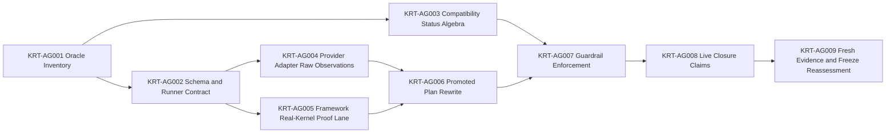

# Engineering Execution Plan

## 0. Version History & Changelog

- v0.19.0 - Activated Epic AG for non-self-attesting conformance hardening, superseding the Epic AF freeze-readiness conclusion without reopening AD, AE, or AF.
- v0.18.0 - Closed Epic AF in current repo reality through the generated conformance gap plan, promoted AF shared-runner checks, freshness and authority guardrails, refreshed compatibility evidence, and clean freeze validation; TypeScript was considered freeze-ready for the then-promoted surfaces.
- v0.17.0 - Closed Epic AE in current repo reality through the modular boundary hardening inventory, repo-wide `boundaries/**/*.ts` size audit, and a clean `bun run verify`; remaining active implementation scope was Epic AF.
- ... [Older history truncated, refer to git logs]

## 1. Executive Summary & Active Critical Path

- **Total Active Story Points:** 46
- **Critical Path:** KRT-AG001 -> KRT-AG002 + KRT-AG003 -> KRT-AG004 + KRT-AG005 -> KRT-AG006 -> KRT-AG007 -> KRT-AG008 -> KRT-AG009
- **Planning Assumptions:** TechSpec v0.16.0 governs the non-self-attesting conformance contract. Epics A-AF remain archived. Epic AF evidence is historical and must be regenerated under AG gates before freeze-readiness is reaffirmed. Rust framework product behavior remains unsupported and out of active scope.

### Brownfield Continuity Note

- Epic AG supersedes the freeze-readiness conclusion from Epic AF, not the work history.
- Epics AD, AE, and AF remain closed archived context and must not be reopened through AG ticket execution.
- AG treats the existing Authority Packets, Conformance Plans, Implementation Adapters, Generic Runner, and Compatibility Reporting surfaces as the architecture-approved physical contract to harden.

### Sequential Scope Rule

- No future implementation line, new driver, new provider family, new backend family, or new host protocol is activated by this plan.
- A later TechSpec/Tasks revision must explicitly activate any product implementation line after AG closes.
- Rust framework remains unsupported, not failed and not passed, until it advertises real framework capabilities.

### Planning Heuristic

- Prefer epic slices that look likely to land comfortably below roughly `5,000` lines of new code and treat roughly `10,000` lines as a warning threshold.
- This is a scoping heuristic for planning clarity, not an execution cap or a substitute for code review judgment.

## 2. Project Phasing & Iteration Strategy

### Delivery Cadence Posture

- No sprint or release-train cadence is assumed in this plan.
- This section uses "iteration strategy" only because the planning framework requires that heading; the content below is dependency phasing and hardening sequence, not a commitment to Scrum-style iterations.

### Current Active Scope

- Epic AG hardens the conformance authority layer so promoted checks cannot pass through adapter evidence alone.
- AG updates conformance schemas, runner assertion domains, compatibility status algebra, adapter restrictions, promoted plans, guardrails, and regenerated evidence.
- AG ensures promoted conformance pass/fail decisions are grounded in runner-observed `result`, `events`, `state`, schema validity, error-envelope shape, event ordering, terminality, or explicit absence of observed events.
- AG does not activate Rust framework product implementation, new drivers, new providers, new host protocols, or new backend families.

### Future / Deferred Scope

- Rust framework product implementation work is deferred until a later TechSpec/Tasks revision explicitly activates that line.
- Rust framework remains unsupported, not failed and not passed, until it advertises real framework capabilities.
- New product implementation lines remain deferred until AG closes and a later TechSpec/Tasks revision explicitly activates them.
- `LanguageModelV2` / `ProviderV2` compatibility is deferred.
- AI SDK agent loops, AI SDK UI message protocols, AI SDK transport helpers, LangChain bridges, provider-native tool support, and first-class Tuvren provider packages are deferred.
- ACP, A2A, or any additional host protocol beyond SSE and AG-UI is deferred until a future TechSpec revision names it.
- Future concrete drivers beyond ReAct, official peer backends beyond memory/SQLite, and future product implementation lines beyond the current TypeScript/Rust lanes are deferred until a later plan explicitly authorizes them.
- FFI-based Rust embedding is deferred until after the process-boundary kernel seam and the AG conformance-hardening closure are both proven boring and durable.
- Deno portability checks remain deferred until public package surfaces stabilize enough to avoid testing scaffolding churn.
- Authority packets for surfaces beyond the current promoted packet families remain deferred unless a later TechSpec revision classifies them as promote-now blockers.

### Archived or Already Completed Scope

- Epics A-Q established the architecture-first TypeScript baseline, shared contracts, ReAct/runtime execution path, provider bridge, host stream adapters, playground host, and release/portability hardening.
- Epics R-V established the multi-language transition foundation, contract/conformance artifactization, kernel interop governance, Rust kernel baseline, and TypeScript-framework-to-Rust-kernel interop evidence.
- Epics W-AF promoted the first shared semantic authority surfaces, normalized topology, enforced neutral machine authority, closed the TypeScript kernel gap, promoted run-liveness, promoted framework orchestration, closed the docs-to-authority freeze gate, completed TypeScript modular boundary hardening, and produced historical TypeScript freeze evidence.
- Epic AF evidence remains archived historical context and must be regenerated under AG gates before freeze-readiness is reaffirmed.

## 3. Build Order (Mermaid)



## 4. Ticket List

### Epic AG - Non-Self-Attesting Conformance Hardening

**KRT-AG001 Conformance Oracle Inventory**

- **Type:** Spike
- **Effort:** 3
- **Dependencies:** None
- **Capability / Contract Mapping:** TechSpec v0.16.0 ADR-030, ADR-031; TechSpec §4.10, §4.12, §4.13
- **Description:** Inventory all current self-attesting or stale proof paths before changing contracts or plans.
- **Acceptance Criteria (Gherkin):**

```gherkin
Given Authority Packet-referenced plans, promoted adapters, compatibility evidence, and closure reports exist
When the oracle inventory is completed
Then every Authority Packet-referenced plan is classified for evidence-only checks
And every evidence-rooted `schemaValid` or `noEvent` assertion is classified
And every promoted adapter semantic verifier/assert import is classified
And every promoted adapter `/test/` harness dependency is classified
And every pass-with-zero-applicable evidence entry is classified
And every stale closure claim is classified with its owning artifact and required AG follow-up
```

**KRT-AG002 Schema and Runner Contract**

- **Type:** Feature
- **Effort:** 5
- **Dependencies:** KRT-AG001
- **Capability / Contract Mapping:** TechSpec §4.12; ADR-030
- **Description:** Add non-evidence decisive assertion semantics to the conformance plan schema and shared runner.
- **Acceptance Criteria (Gherkin):**

```gherkin
Given promoted checks must not pass from adapter evidence alone
When the schema and runner contract is updated
Then `resultField` exists in the conformance schema, compiler, assertion engine, and tests
And every promoted check requires at least one decisive non-evidence assertion
And `evidenceField` cannot satisfy the decisive assertion requirement
And `schemaValid` over evidence is non-decisive
And `noEvent` reads runner-owned event observations
And meta-conformance proves evidence-only plans are rejected
```

**KRT-AG003 Compatibility Status Algebra**

- **Type:** Feature
- **Effort:** 3
- **Dependencies:** KRT-AG001
- **Capability / Contract Mapping:** TechSpec §4.10; ADR-031
- **Description:** Replace ambiguous raw compatibility status handling with the four-state status algebra.
- **Acceptance Criteria (Gherkin):**

```gherkin
Given compatibility evidence currently risks treating unsupported or empty suites as pass
When compatibility status algebra is implemented
Then raw status supports `pass`, `fail`, `unsupported`, and `not_applicable`
And pass with zero applicable checks is invalid
And unsupported evidence records zero applicable checks without raw pass
And `reportStatus` cannot contradict raw status
And `rust-framework` evidence regenerates as unsupported instead of pass
```

**KRT-AG004 Provider Adapter Raw Observations**

- **Type:** Feature
- **Effort:** 8
- **Dependencies:** KRT-AG002
- **Capability / Contract Mapping:** provider-api authority packet; provider conformance plans; TechSpec §4.13
- **Description:** Remove provider semantic verdict logic from the TypeScript provider adapter and expose only raw observations plus diagnostics.
- **Acceptance Criteria (Gherkin):**

```gherkin
Given provider conformance must be judged by the shared runner
When provider adapter observations are hardened
Then the TypeScript provider adapter no longer imports provider semantic verifier/assert helpers
And provider operations return raw result, events, state, and diagnostics
And provider errors expose stable implementation observations or error envelopes
And expected provider semantics live only in plans
And provider evidence remains diagnostic only
```

**KRT-AG005 Framework Real-Kernel Proof Lane**

- **Type:** Feature
- **Effort:** 8
- **Dependencies:** KRT-AG002
- **Capability / Contract Mapping:** runtime-api authority packet; framework conformance plans; kernel interop contract
- **Description:** Replace promoted framework proof paths that depend on fake kernel behavior with a real kernel-backed lane or an explicitly bounded testkit contract.
- **Acceptance Criteria (Gherkin):**

```gherkin
Given promoted framework checks must prove runtime behavior rather than fake-kernel behavior
When the real-kernel proof lane is implemented
Then promoted framework checks no longer depend on `runtime-core/test/fake-kernel.ts` as the main proof path
And a real kernel-backed lane covers completed turn, approval pause/resume, cancellation, recovery, tool staging, and handoff/orchestration continuity where applicable
And any remaining fake harness is package-local only or promoted as an explicit bounded testkit
And framework conformance still reports unsupported surfaces truthfully when capabilities are not advertised
```

**KRT-AG006 Promoted Plan Rewrite and Check Compression**

- **Type:** Feature
- **Effort:** 8
- **Dependencies:** KRT-AG004, KRT-AG005
- **Capability / Contract Mapping:** Authority Packet-referenced conformance plans; TechSpec §4.12
- **Description:** Rewrite promoted plans so runner-observed domains carry semantic proof and duplicate micro-checks are compressed where ordered assertions express the same behavior.
- **Acceptance Criteria (Gherkin):**

```gherkin
Given promoted plans may contain evidence-only or adapter-summarized checks
When promoted plans are rewritten
Then no Authority Packet-referenced check is evidence-only
And semantic values formerly asserted through evidence move into result, events, or state
And event-stream checks assert ordered event observations rather than adapter-reported event-type arrays
And micro-check inflation is compressed where one ordered assertion expresses the same behavior
And traceability to packet, plan, fixture, scenario, and compatibility evidence is preserved
```

**KRT-AG007 Guardrail Enforcement**

- **Type:** Chore
- **Effort:** 5
- **Dependencies:** KRT-AG003, KRT-AG006
- **Capability / Contract Mapping:** TechSpec §5.3; ADR-030, ADR-031
- **Description:** Add fail-closed validation so AG invariants cannot regress silently.
- **Acceptance Criteria (Gherkin):**

```gherkin
Given AG invariants must be enforced by tooling
When guardrails are added
Then verify and codegen fail on evidence-only promoted checks
And verify and codegen fail on pass-with-zero-applicable evidence
And verify and codegen fail on promoted adapter semantic verifier/assert imports
And verify and codegen fail on promoted adapter implementation-local `/test/` imports unless explicitly allowed by a boundary-owned testkit
And fixture self-tests prove each guardrail fails closed
```

**KRT-AG008 Live Closure Claims**

- **Type:** Chore
- **Effort:** 3
- **Dependencies:** KRT-AG007
- **Capability / Contract Mapping:** TechSpec §5.3; compatibility ledger; closure reports
- **Description:** Replace stale closure prose with generated or executable readiness claims.
- **Acceptance Criteria (Gherkin):**

```gherkin
Given closure claims can become stale prose
When live closure claims are implemented
Then measurable closure claims are generated from live scans or removed
And boundary size, conformance count, status algebra, and guardrail claims are backed by executable checks
And historical closure inventories remain archived context rather than current proof
And release-readiness text names exact commands and artifacts that generated the claim
```

**KRT-AG009 Fresh Evidence and Freeze Reassessment**

- **Type:** Chore
- **Effort:** 3
- **Dependencies:** KRT-AG008
- **Capability / Contract Mapping:** TechSpec v0.16.0 freeze-readiness posture; reports/compatibility
- **Description:** Regenerate evidence under AG gates and decide whether TypeScript freeze-readiness can be reaffirmed.
- **Acceptance Criteria (Gherkin):**

```gherkin
Given AG guardrails and live closure claims are complete
When fresh evidence and freeze reassessment are performed
Then conformance evidence is regenerated under AG gates
And the compatibility matrix reports truthful `pass`, `fail`, `unsupported`, or `not_applicable`
And `bun run codegen` has no drift
And `bun run conformance`, `bun run compatibility:evidence`, `bun run release-check`, and `bun run verify` pass for supported applicable surfaces
And Tasks and TechSpec state whether TypeScript freeze-readiness is reaffirmed under AG rules
```

## 5. Issue-Level Definition of Done

- No Authority Packet-referenced conformance check is evidence-only.
- No promoted check relies on `schemaValid` over evidence as its only semantic proof.
- No promoted event absence check reads adapter evidence arrays.
- `resultField` exists in schema, compiler, assertion engine, and tests.
- Raw compatibility status distinguishes `pass`, `fail`, `unsupported`, and `not_applicable`.
- `status: "pass"` with `applicableChecks: 0` is impossible.
- Promoted adapters do not import semantic verifier/assert helpers.
- Promoted framework proof does not depend on implementation-local fake-kernel behavior.
- Closure claims are generated or removed; stale prose cannot certify readiness.
- Final evidence is regenerated under AG gates.
- Rust framework remains unsupported unless a later revision explicitly activates real product behavior.
