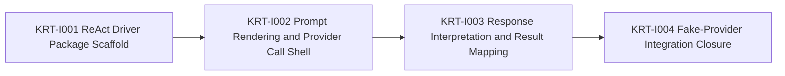

# Engineering Execution Plan

## 0. Version History & Changelog
- v0.4.0 - Advanced the active backlog past Epic H by splitting the post-runtime-core roadmap into narrower epics and making Epic I a focused ReAct Driver foundation slice.
- v0.3.1 - Narrowed Epic H around the docs-first minimal shared-core model by removing sequence semantics from core scope, reducing orchestration to handle/tree primitives, and shrinking the shared driver contract surface.
- v0.3.0 - Realigned the active backlog around Epic H after confirming Epics F and G already exist in repo reality, and expanded Epic H into the full brownfield-corrected shared framework foundation plan.
- ... [Older history truncated, refer to git logs]

## 1. Executive Summary & Active Critical Path
- **Total Active Story Points:** 13
- **Critical Path:** `KRT-I001 -> KRT-I002 -> KRT-I003 -> KRT-I004`
- **Planning Assumptions:** Kernel, SQLite backend, shared framework contract packages, and `runtime-core` are now implemented in repo reality through Epic H; the next active scope is the smallest useful ReAct Driver slice that proves one concrete driver can stand on the frozen shared core before provider-bridge and host work begins.

### Brownfield Continuity Note
- The current codebase already contains the workspace scaffold, shared core types, kernel protocol package, memory backend, SQLite backend, kernel testkit, shared framework contract packages, and `runtime-core`.
- This revision moves Epic H into archived completed scope and resets `Tasks.md` to the next active slice instead of carrying the already-delivered shared-foundation tickets forward as if they were still open work.

### Planning Heuristic
- During planning, prefer epic slices that look likely to land comfortably below roughly `5,000` lines of new code and treat roughly `10,000` lines as a warning threshold.
- This is a scoping heuristic for planning clarity, not an execution cap or a substitute for code review judgment.

## 2. Project Phasing & Iteration Strategy
### Delivery Cadence Posture
- No sprint or release-train cadence is assumed in this plan.
- This section uses "iteration strategy" only because the planning framework requires that heading; the content below is dependency phasing and scope partitioning, not a commitment to Scrum-style iterations.

### Current Active Scope
- Implement the first focused ReAct Driver foundation slice in `boundaries/framework/implementations/typescript/drivers/react`.
- Prove that one concrete driver can render canonical prompts, call a `TuvrenProvider`, interpret model responses, and return valid `DriverExecutionResult` values over the now-frozen shared-core boundary.
- Close Epic I with fake-provider-backed integration coverage before widening into deeper loop/tool semantics or provider-bridge work.

### Future / Deferred Scope
- Epic J will extend the ReAct Driver through full loop and tool integration, including deeper ReAct-specific continuation behavior beyond the initial foundation slice.
- Epic K will implement the AI SDK provider bridge baseline once the first concrete driver exists against the provider-neutral contract.
- Epic L will implement stream adapter packages after the ReAct Driver and baseline provider bridge are in place.
- Epic M will implement the playground host after the stream adapters and baseline provider bridge exist.
- Epic N will cover additional concrete drivers beyond ReAct, such as pipeline, router, evaluator-optimizer, or orchestrator-worker variants.
- Future later epics may add peer official backends beyond memory and SQLite, along with production-grade host surfaces beyond the playground baseline.

### Archived or Already Completed Scope
- Epic A delivered the root workspace scaffold and boundary-first monorepo structure.
- Epic B delivered the shared primitive package plus deterministic identity spike validation.
- Epic C delivered the kernel protocol contracts, deterministic CBOR/SHA helpers, and semantic fixtures.
- Epic D delivered the semantic reference memory backend.
- Epic E delivered the reusable kernel backend conformance, invariant, and recovery harness and closed the memory backend against it.
- Epic F delivered the SQLite backend, migrations, repository logic, and conformance closure.
- Epic G delivered the shared framework contract partition across runtime, driver, event, tool, and provider surfaces.
- Epic H delivered the docs-first shared framework foundations, including the minimal shared-core contract realignment and `runtime-core`.

## 3. Build Order (Mermaid)


## 4. Ticket List
### Epic I — ReAct Driver Foundation (RDF)

**KRT-I001 ReAct Driver Package Scaffold**
- **Type:** Feature
- **Effort:** 2
- **Dependencies:** None
- **Capability / Contract Mapping:** PRD `CAP-P0-033`, `CAP-P1-034`; Architecture `§2`, `§4.1`; TechSpec `§1.1`, `§5.1`, `§5.4`; ADR-014
- **Description:** Create `boundaries/framework/implementations/typescript/drivers/react` with Nx, Bun, and tsup wiring, explicit dependencies on the shared runtime and provider contracts, and the bounded public factory surface for the first concrete driver.
- **Acceptance Criteria (Gherkin):**
```gherkin
Given the shared framework substrate is already implemented
When the ReAct driver package scaffold is completed
Then the repository contains one bounded concrete driver package with explicit build, typecheck, and test wiring against the shared framework contracts
```

**KRT-I002 Prompt Rendering and Provider Call Shell**
- **Type:** Feature
- **Effort:** 5
- **Dependencies:** KRT-I001
- **Capability / Contract Mapping:** PRD `CAP-P0-012`, `CAP-P0-019`, `CAP-P0-020`, `CAP-P0-030`, `CAP-P0-033`; Architecture `§2`, `§4.1`; TechSpec `§4.4`, `§4.6`, `§5.4`; Framework Spec `§5.2`, `§6.2`, `§6.3`, `§6.5`
- **Description:** Implement the ReAct Driver prompt-rendering and provider-call shell so the driver can build canonical prompts from the shared runtime context, render tools and structured-output requests for provider use, invoke `TuvrenProvider.generate()` / `stream()`, and produce the canonical assistant stream shape expected by the shared framework.
- **Acceptance Criteria (Gherkin):**
```gherkin
Given the ReAct driver package scaffold exists
When the prompt renderer and provider call shell are implemented
Then the driver can invoke a provider through the canonical Tuvren provider contract without depending on bridge-specific wire shapes
```

**KRT-I003 Response Interpretation and Result Mapping**
- **Type:** Feature
- **Effort:** 3
- **Dependencies:** KRT-I002
- **Capability / Contract Mapping:** PRD `CAP-P0-012`, `CAP-P0-019`, `CAP-P0-020`, `CAP-P0-033`; Architecture `§2`, `§4.1`; TechSpec `§4.6`, `§5.4`; Framework Spec `§3.3`, `§5.6`, `§6.2`, `§6.4`
- **Description:** Interpret canonical `TuvrenModelResponse` values into the minimal driver seam by producing the single durable assistant message, tool-call requests, terminal non-tool responses, and the correct `RuntimeResolution` / `toolExecutionMode` combinations required by the shared framework contracts.
- **Acceptance Criteria (Gherkin):**
```gherkin
Given the ReAct driver can call a canonical Tuvren provider
When provider responses are interpreted through the driver result mapper
Then the driver emits valid shared-core driver results for terminal assistant output and tool-call request iterations without leaking provider-specific ontology
```

**KRT-I004 Fake-Provider Integration Closure**
- **Type:** Chore
- **Effort:** 3
- **Dependencies:** KRT-I003
- **Capability / Contract Mapping:** PRD `CAP-P0-033`, `CAP-P1-034`; Architecture `§2`, `§4.1`; TechSpec `§5.2`, `§5.4`; ADR-014
- **Description:** Close Epic I with fake-provider-backed integration and regression coverage proving `runtime-core` can execute one concrete ReAct Driver end to end for terminal assistant output and tool-request initiation paths before deeper ReAct loop/tool semantics or AI SDK bridge work begins.
- **Acceptance Criteria (Gherkin):**
```gherkin
Given the ReAct driver foundation exists against the shared runtime and provider contracts
When fake-provider integration closure is completed
Then the repository proves one concrete driver can execute end to end over the frozen shared core before Epic J and Epic K widen scope
```
