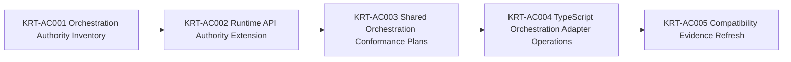

# Engineering Execution Plan

## 0. Version History & Changelog

- v0.13.0 - Closed Epics Z, AA, and AB in current repo reality, moved their detail out of the active plan and into archived summaries plus closure inventories, and opened Epic AC for framework orchestration authority promotion.
- v0.12.1 - Hardened the TypeScript provider and framework compatibility boundary by promoting fail-closed provider bridge checks, renaming the advertised provider capabilities to the narrower framework-mediated labels, and refreshing compatibility evidence so green TypeScript reports no longer imply unsupported native provider behavior.
- v0.12.0 - Opened TypeScript Kernel Gap Closure with Epic Z syscall implementation planning, Epic AA kernel conformance promotion, and Epic AB contract-first run-liveness recovery.
- ... [Older history truncated, refer to git logs]

## 1. Executive Summary & Active Critical Path

- **Total Active Story Points:** 20
- **Critical Path:** KRT-AC001 -> KRT-AC002 -> KRT-AC003 -> KRT-AC004 -> KRT-AC005.
- **Planning Assumptions:** Epics A-AB are closed in current repo reality. Authority Packet manifests follow TechSpec §4.11; Conformance Plans follow §4.12; the revised Implementation Adapter Protocol follows §4.13. Epic AC is documentation-backed by `docs/KrakenFrameworkSpecification.md` §10, the existing runtime-api binding appendix and `runtime-core` orchestration tests, and the current runtime-api authority gap described in TechSpec §1.2 and §5.4. Rust framework implementation work remains out of scope unless a later revision explicitly activates it by capability evidence.

### Brownfield Continuity Note

- The current codebase already contains the workspace scaffold, shared core types, kernel protocol package, memory backend, SQLite backend, kernel testkit, shared framework contract packages, provider contract package, `runtime-core`, and the ReAct Driver foundation package.
- Current repository reality includes closed Epic K, L, M, N, O, and P behavior with explicit closure artifacts in `constitution/spikes/epic-k-react-loop-cancellation-inventory.md`, `constitution/spikes/epic-l-parity-inventory.md`, `constitution/spikes/epic-m-tool-approval-gap-inventory.md`, `constitution/spikes/epic-n-ai-sdk-bridge-inventory.md`, `constitution/spikes/epic-o-stream-adapter-inventory.md`, and `constitution/spikes/epic-p-playground-host-inventory.md`.
- `KRT-Q001` is now closed in current repo reality through `constitution/spikes/epic-q-hardening-gap-inventory.md`, which inventories the extraction targets, release-check targets, portability matrix, deferred Deno work, and remaining hardening gaps for the rest of Epic Q.
- The Epic Q target packages now live under `boundaries/framework/implementations/typescript/testkit` and `boundaries/providers/implementations/typescript/testkit`, with release and verification scripts under `tools/scripts`.
- The private playground host now also owns automated aimock E2E validation lanes that exercise `@tuvren/provider-bridge-ai-sdk` through local OpenAI-, Anthropic-, and Gemini-compatible HTTP mock provider boundaries without provider credentials, covering streamed text, structured output, tool continuation, approval pause/resume, provider metadata, cancellation, provider failure, malformed responses, and unmatched fixtures.
- The private playground host now also exposes an opt-in `host-playground:scenario-gemini` lane that exercises the same bridge through `@ai-sdk/google@3.0.64` and real Gemini credentials for streaming, metadata, structured output, multi-step streamed tool continuity, and approval resume behavior without moving live-provider cost and flake into default verification.
- Those Epic Q testkit packages are now helper/facade packages; compatibility evidence flows through implementation-scoped TypeScript conformance runners over shared boundary-owned assets.
- Planning verification confirmed `ai@6.0.142` and `@ai-sdk/provider@3.0.8` are available and that `@ai-sdk/provider@3.0.8` exports `LanguageModelV3`, `ProviderV3`, `LanguageModelV3CallOptions`, `LanguageModelV3GenerateResult`, and `LanguageModelV3StreamPart`.
- Current TypeScript provider and framework compatibility evidence now records the mediated capability subset explicitly: framework-owned tool execution, framework-owned approval boundary, and rejection of undeclared native strict structured output. Shared provider and framework plans now prove those negative paths directly instead of relying on broad capability labels that could overstate native provider support.
- Epic N now extends repo reality beyond those planning notes: the bridge package exists and the closure artifact above is the authoritative upstream seam for Epic O.
- Epic O now extends repo reality beyond those planning notes: `@tuvren/stream-core`, `@tuvren/stream-sse`, and `@tuvren/stream-agui` exist, `constitution/spikes/epic-o-stream-adapter-inventory.md` is the authoritative adapter mapping record, and Epic P must treat tee-based fanout plus the documented `tuvren.runtime.*` AG-UI custom namespace as the handoff surface rather than rediscovering protocol gaps or resubscription hazards.
- Epic P now extends repo reality beyond those planning notes: `@tuvren/playground-host` exists under `boundaries/hosts/implementations/typescript/playground`, `constitution/spikes/epic-p-playground-host-inventory.md` is the authoritative playground handoff, full-turn streams cover canonical/SSE/AG-UI fanout, approval resume continuation is projected to canonical/SSE only, non-reload memory scenarios run under Bun tests, branching is validated from a completed source head, and SQLite reload is validated through the built Node CLI path.
- Epic R now extends repo reality beyond those planning notes: the repository has the explicit multi-language transition guide plus the closure inventory in `constitution/spikes/epic-r-multilanguage-transition-foundation-inventory.md`, Epic S has since closed the artifact promotion line, Epic T has since closed the kernel interop governance line, Epic U has since closed the Rust kernel baseline line, and Epic V has since closed the TypeScript framework to Rust kernel interop stabilization line.

### Sequential Scope Rule

- Epic V is closed. Epic W starts from the measured compatibility evidence and the Epic V closure inventories, but it is not Rust framework work. Epic W must mature the semantic ecosystem itself: coverage matrix, assertion-bearing conformance suites, promoted TypeScript-local semantics, and compatibility evidence precise enough for future implementations to consume without treating TypeScript as the oracle.
- Epic W and Epic X are closed. Epic X completed the structural normalization that relocated TS-only assets out of language-neutral boundary slots without changing semantics, conformance suites, fixtures, public package APIs, or generated artifacts.
- Epic Y authority-packet closure and final conformance closure are closed. The promoted neutral surfaces (`runtime-api`, `driver-api`, `event-stream`, `core-types`) plus the ReAct-driver, kernel protocol, and provider bridge plan families now resolve cross-implementation authority through packets, plans, generated artifacts, guardrails, shared-runner evidence, and implementation adapter hosts.
- Epics Z, AA, and AB are closed. The boundary-owned TypeScript kernel implementation now exists, promoted kernel evidence is shared-runner-owned, and run-liveness is normalized as an optional advertised extension rather than a pending critical-path implementation line.

### Planning Heuristic

- Prefer epic slices that look likely to land comfortably below roughly `5,000` lines of new code and treat roughly `10,000` lines as a warning threshold.
- This is a scoping heuristic for planning clarity, not an execution cap or a substitute for code review judgment.

## 2. Project Phasing & Iteration Strategy

### Delivery Cadence Posture

- No sprint or release-train cadence is assumed in this plan.
- This section uses "iteration strategy" only because the planning framework requires that heading; the content below is dependency phasing and scope partitioning, not a commitment to Scrum-style iterations.

### Current Active Scope

- Epic AC is active to promote framework orchestration from TypeScript-local behavior and binding-only documentation into boundary-owned runtime-api authority, shared conformance plans, TypeScript adapter capability evidence, and compatibility reporting.
- Epic AC is a conformance and authority promotion line, not a broad implementation-expansion epic: the core orchestration semantics already exist in `docs/KrakenFrameworkSpecification.md` §10 and in TypeScript `runtime-core`, but they are not yet machine-owned cross-implementation authority.
- Epic AC non-goals remain explicit: no Rust framework implementation, no A2A or ACP, no provider-native handoff or tool routing, no global worker scheduler, no ordered-pipeline standardization beyond handoff composition, and no new kernel concepts.

### Future / Deferred Scope

- Rust framework product implementation work is deferred beyond Epic AC. Rust framework adapter-host work remains evidence-only until a later plan explicitly activates native framework behavior.
- Rust framework orchestration support is deferred unless a later Tasks revision explicitly adds `framework.orchestration` implementation tickets. Rust lanes may report pass, fail, or non-applicable evidence only from advertised capability.
- `LanguageModelV2` / `ProviderV2` compatibility is deferred.
- AI SDK agent loops, AI SDK UI message protocols, AI SDK transport helpers, LangChain bridges, provider-native tool support, and first-class Tuvren provider packages are deferred.
- ACP, A2A, or any additional host protocol beyond SSE and AG-UI is deferred until a future TechSpec revision names it.
- Future concrete drivers beyond ReAct, official peer backends beyond memory/SQLite, and future product implementation lines beyond the current TypeScript/Rust lanes and active orchestration authority line are deferred unless a later TechSpec revision activates them from the matured semantic evidence, authority packets, and shared runner evidence.
- FFI-based Rust embedding is deferred until after the process-boundary kernel seam is proven boring and durable.
- Deno portability checks are deferred until public package surfaces stabilize enough to avoid testing scaffolding churn.
- Authoring authority packets for surfaces beyond the five named in Epic Y (kernel protocol packet hardening, host stream adapter packets, telemetry semconv packet, compatibility-ledger packet, AI SDK bridge packet) is deferred to a later epic that may build on Epic Y mechanics.

### Archived or Already Completed Scope

- Epics A-J established the architecture-first monorepo, shared core types, kernel protocol, memory and SQLite backends, shared framework contracts, `runtime-core`, the first ReAct driver slice, and the runtime-foundation hardening line.
- Epics K-M closed the first production-depth ReAct loop, streaming/provider parity, and tool/approval integration; authoritative closure evidence lives in `constitution/spikes/epic-k-react-loop-cancellation-inventory.md`, `constitution/spikes/epic-l-parity-inventory.md`, and `constitution/spikes/epic-m-tool-approval-gap-inventory.md`.
- Epics N-Q closed the post-ReAct TypeScript expansion line for the AI SDK bridge, host stream adapters, playground host harness, and release/portability hardening; authoritative closure evidence lives in `constitution/spikes/epic-n-ai-sdk-bridge-inventory.md`, `constitution/spikes/epic-o-stream-adapter-inventory.md`, `constitution/spikes/epic-p-playground-host-inventory.md`, and `constitution/spikes/epic-q-release-hardening-inventory.md`. That closure line now includes automated aimock provider-boundary coverage across OpenAI, Anthropic, and Gemini plus an opt-in real Gemini playground lane without reactivating the closed Epic Q backlog.
- Epic R closed the multi-language transition foundation through `constitution/spikes/epic-r-multilanguage-transition-guide.md` and `constitution/spikes/epic-r-multilanguage-transition-foundation-inventory.md`, delivering boundary-owned conformance and contract scaffold, canonical target vocabulary, telemetry codegen authority, and the first measured TypeScript-only compatibility baseline.
- Epic S closed boundary contract and conformance artifactization through `constitution/spikes/epic-s-boundary-contract-conformance-artifactization-inventory.md`, delivering TypeSpec-authored tool/provider artifacts, kernel CDDL grammar, implementation-scoped TypeScript conformance runners, and compatibility evidence sourced from those runners.
- Epic T closed kernel interop governance through `constitution/spikes/epic-t-kernel-interop-surface-inventory.md` and `constitution/spikes/epic-t-kernel-interop-governance-inventory.md`, delivering the governed kernel-only proto authority and Buf-backed interop governance lane.
- Epic U closed the Rust kernel baseline through `constitution/spikes/epic-u-rust-kernel-baseline-inventory.md`, delivering the root Cargo workspace, Rust kernel core, Rust conformance runner, runnable Rust gRPC service, and Rust telemetry helper without adding a TypeScript transport client or Rust framework path.
- Epic V closed TypeScript framework to Rust kernel interop stabilization through `constitution/spikes/epic-v-transport-decision-inventory.md` and `constitution/spikes/epic-v-framework-rust-kernel-interop-closure-inventory.md`, delivering the TypeScript gRPC transport helper, runtime selection seam, real interop-smoke evidence, compatibility-ledger interop entries, and separated cross-language verification.
- Epic W closed the semantic ecosystem maturity line through `constitution/spikes/epic-w-semantic-coverage-matrix.md` and `constitution/spikes/epic-w-semantic-ecosystem-maturity-closure-inventory.md`.
- Epic X closed the TypeScript topology normalization line through `constitution/spikes/epic-x-typescript-topology-normalization-inventory.md` and `constitution/spikes/epic-x-typescript-topology-normalization-closure-inventory.md`.
- Epic Y closed machine-enforced neutral authority and final shared-runner conformance through `constitution/spikes/epic-y-authority-leak-inventory.md`, `constitution/spikes/epic-y-machine-enforced-authority-closure-inventory.md`, and `constitution/spikes/epic-y-shared-conformance-engine-closure-inventory.md`.
- Epics Z, AA, and AB closed the TypeScript kernel implementation and promotion line through `constitution/spikes/epic-z-typescript-kernel-syscall-closure-inventory.md`, `constitution/spikes/epic-aa-kernel-conformance-promotion-closure-inventory.md`, and `constitution/spikes/epic-ab-run-liveness-recovery-closure-inventory.md`, leaving `@tuvren/kernel-runtime`, promoted kernel evidence, and `kernel.run-liveness` as current-reality baseline rather than active plan scope.
- Rust framework start is no longer Epic W. It is deferred behind Epic W's semantic maturity evidence.

## 3. Build Order (Mermaid)



## 4. Ticket List

### Epic AC - Framework Orchestration Authority Promotion (FOAP)

- Epic AC is the next active implementation/evidence line after closing Z, AA, and AB.
- Epic AC promotes orchestration into boundary-owned authority and shared-runner evidence; it does not authorize Rust framework implementation, A2A/ACP, provider-native routing, a global worker scheduler, ordered-pipeline standardization, or new kernel concepts.

**KRT-AC001 Orchestration Authority Inventory**

- **Type:** Spike
- **Effort:** 2
- **Dependencies:** None
- **Capability / Contract Mapping:** `docs/KrakenFrameworkSpecification.md` §10; TechSpec §1.2, §5.4
- **Description:** Inventory the current TypeScript orchestration implementation and tests against `docs/KrakenFrameworkSpecification.md` §10, classifying each behavior as already implemented and locally tested, implemented but not shared-conformance-covered, specified but not implemented, or intentionally implementation-defined outside conformance.
- **Acceptance Criteria (Gherkin):**

```gherkin
Given the framework specification already defines orchestration semantics
When the orchestration authority inventory is completed
Then every behavior in `docs/KrakenFrameworkSpecification.md` §10 is classified as implemented-and-locally-tested, implemented-without-shared-conformance, specified-but-not-implemented, or intentionally implementation-defined
And no behavior is promoted from TypeScript source alone without citing the framework spec, a packet, a plan, or measured evidence
And the inventory leaves no future implementation dependent on reading TypeScript `runtime-core` source to understand required orchestration semantics
```

**KRT-AC002 Runtime API Authority Extension**

- **Type:** Feature
- **Effort:** 5
- **Dependencies:** KRT-AC001
- **Capability / Contract Mapping:** TechSpec §4.1, §4.11; runtime-api authority packet
- **Description:** Extend the runtime-api authority surface to cover orchestration, either by extending the existing runtime-api packet and TypeSpec source or by creating a distinct `framework.orchestration` authority packet when the surface is better isolated.
- **Acceptance Criteria (Gherkin):**

```gherkin
Given the orchestration inventory identifies the portable shared semantics
When the runtime-api authority surface is extended
Then `OrchestrationRuntime`, `OrchestrationHandle`, `spawn`, `allEvents`, `awaitResult`, descendant source attribution, and run-local lifecycle semantics are represented in machine-readable authority or in an explicitly declared binding appendix for TypeScript-only async-iterator ergonomics
And generated artifacts and packet references are refreshed together with the authority change
And implementation paths, runner code, and Markdown prose remain forbidden cross-implementation authority sources
```

**KRT-AC003 Shared Orchestration Conformance Plans**

- **Type:** Feature
- **Effort:** 5
- **Dependencies:** KRT-AC002
- **Capability / Contract Mapping:** TechSpec §4.12, §4.13; `docs/KrakenFrameworkSpecification.md` §10
- **Description:** Add shared orchestration conformance plans that assert launch preconditions, run-local worker lifecycle behavior, event-surface boundaries, descendant source attribution, final visible result behavior, explicit execution-surface inheritance, and nested-worker attribution.
- **Acceptance Criteria (Gherkin):**

```gherkin
Given orchestration authority is packet-owned
When shared orchestration conformance plans are added
Then the plans cover spawn rejection before parent execution starts, `awaitResult()` not satisfying the spawn launch precondition, child execution on its own thread, parent and child pause-resume-cancel remaining run-local, `events()` being self-only, `allEvents()` including descendants, descendant source attribution, final visible result behavior, absence of a canonical injected parent `worker_result`, explicit execution-surface inheritance, and nested descendant attribution
And every orchestration check is assertion-bearing shared-runner data rather than adapter-local grading logic
And adapters receive neutral operations and return observations only
```

**KRT-AC004 TypeScript Orchestration Adapter Operations**

- **Type:** Feature
- **Effort:** 5
- **Dependencies:** KRT-AC003
- **Capability / Contract Mapping:** TechSpec §4.13; framework adapter protocol
- **Description:** Extend the TypeScript framework conformance adapter to execute orchestration scenarios against native `runtime-core` behavior and advertise `framework.orchestration` only when the required operations are implemented.
- **Acceptance Criteria (Gherkin):**

```gherkin
Given shared orchestration plans dispatch neutral runtime operations
When the TypeScript framework adapter advertises `framework.orchestration`
Then it executes native orchestration behavior through `runtime-core`
And it returns observations only, without receiving check IDs, deciding pass or fail, or writing check-scoped evidence
And existing local orchestration tests remain useful implementation tests without becoming the semantic oracle
```

**KRT-AC005 Compatibility Evidence Refresh**

- **Type:** Chore
- **Effort:** 3
- **Dependencies:** KRT-AC004
- **Capability / Contract Mapping:** TechSpec §4.10, §4.12
- **Description:** Refresh compatibility reports after orchestration promotion so the TypeScript framework line advertises `framework.orchestration`, shared evidence records orchestration results, and Rust remains unsupported or non-applicable unless it implements the surface.
- **Acceptance Criteria (Gherkin):**

```gherkin
Given the TypeScript framework adapter can execute shared orchestration checks
When compatibility evidence is refreshed
Then the TypeScript framework compatibility entry advertises `framework.orchestration`
And shared evidence records orchestration pass-fail detail alongside the existing runtime-api, event-stream, and run-liveness capability subsets
And Rust framework entries remain unsupported or non-applicable unless a Rust adapter advertises and exercises the orchestration surface
```
