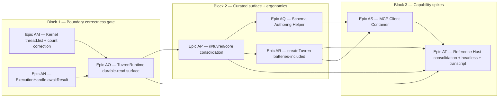

# Engineering Execution Plan

## 0. Version History & Changelog

- v0.28.1 - Pruned inactive completed epic ticket bodies from the live ticket list and restored the stage-4 changelog to the required three-entry history shape; archived scope remains summarized in Project Phasing for continuity.
- v0.28.0 - Opened the v0.27.0 constitutional revision execution chain (PRD v0.7.0, Architecture v0.7.0, TechSpec v0.27.0): Epic AM (kernel `thread.list` syscall + 28→30 count correction), Epic AN (`ExecutionHandle.awaitResult` promotion to base + `ExecutionResult` type), Epic AO (`TuvrenRuntime` durable-read surface + REPL kernel-inspector deletion), Epic AP (`@tuvren/core` consolidation + folding `runtime-core` into `@tuvren/runtime`), Epic AQ (Schema Authoring Helper with `defineTool` + `FlexibleSchema` + `asSchema`), Epic AR (`createTuvren` batteries-included factory), Epic AS (`@tuvren/mcp-client` MCP Client Container with stdio + HTTP/SSE transports), Epic AT (Reference Host consolidation, headless stdin mode, transcript capture/replay, `@tuvren/playground-host` retirement). Set Epic AM as the active critical path entry.
- v0.27.0 - Closed Epic AL in current repo reality by promoting the remaining intended portable surface (tool contracts, kernel CDDL registration, SSE projection, kernel and framework interop packets, telemetry semantic conventions, TechSpec verification-path enum alignment, portability-gate canonical replacement of the AF gap plan freshness proxy), landing the KRT-AL003 re-entry reassessment under `constitution/support/live/epic-al-rust-re-entry-gate-reassessment.md`, and stating plainly that the `product proof gate`, `platform gate`, and `portability gate` now all pass under fresh canonical-verification-path evidence. Rust framework/product work remains blocked until a new epic explicitly reopens that scope.
- ... [Older history truncated, refer to git logs]

## 1. Executive Summary & Active Critical Path

- **Total Active Story Points:** 203 (across 8 new epics — AM 32, AN 13, AO 26, AP 37, AQ 15, AR 15, AS 31, AT 34 — 63 atomic tickets in total)
- **Critical Path:** `KRT-AM001 → KRT-AM002 → KRT-AM003 → KRT-AM004 → KRT-AM005..AM008 → KRT-AM009 → KRT-AM010 → KRT-AM011 → KRT-AO001..AO007 → KRT-AP001 → KRT-AP002..AP011 → KRT-AQ001..AQ005 → KRT-AS001..AS009 → KRT-AT009`. Epic AN is sequenceable in parallel with the latter half of Epic AM (independent surface). Epic AR is sequenceable in parallel with Epic AQ. Epic AT001..AT008 are sequenceable in parallel with Epic AS (they depend on AO, AP, and AR); only KRT-AT009 depends on KRT-AS009. KRT-AS009 itself depends on KRT-AR005, so AR is also on the critical path before AS closes: `(AQ005, AR005) → AS001..AS008 → AS009 → AT009`. The longest single-thread sequence runs through the kernel bump, the durable-read surface, the package consolidation, the schema helper, the MCP client (AS001..AS009), and the MCP-scenario ticket (AT009).
- **Planning Assumptions:** PRD v0.7.0, Architecture v0.7.0, and TechSpec v0.27.0 (ADR-034 through ADR-041) are approved upstream and govern this execution chain. The `docs/KrakenKernelSpecification.md` bump to v0.10 (count correction plus `thread.list`) and `docs/KrakenFrameworkSpecification.md` bump to v0.18 (base-handle `awaitResult`) are in scope for this chain. The `product proof gate`, `platform gate`, and `portability gate` from Epic AL remain the staged-gate baseline; this chain extends the productized TypeScript line without reopening Rust framework/product work. `@modelcontextprotocol/sdk@1.29.0`, `zod@4.4.3`, and `@standard-schema/spec@1.1.0` are the locked external dependency versions per TechSpec §1. The host-facing SDK consolidation into `@tuvren/core` plus the slim `@tuvren/runtime` convenience package is the v1 commitment.

### Brownfield Continuity Note

- Epics A-AL remain historical context. Epic AL's closure of the staged gates is the foundation this chain extends.
- The current repo proves the host-facing SDK through the serious REPL host (`@tuvren/repl-host`) and its named `proving-host:*` validation lanes; exercises PostgreSQL as a first-class backend across kernel conformance and proving-host reload; closes the portability gate through `tools/scripts/portability-gate.ts`; and depends on the still-split contract packages (`@tuvren/core-types`, `@tuvren/runtime-api`, `@tuvren/event-stream`, `@tuvren/tool-contracts`, `@tuvren/driver-api`) plus the still-existing `@tuvren/playground-host` and the `createPlaygroundKernelInspector` boundary-pierce. This chain retires every one of those last items and rebuilds the host-facing surface around `@tuvren/core` + `@tuvren/runtime`.
- Historical closure inventories live under `constitution/archived/` for audit only.

### Sequential Scope Rule

- No Rust framework or Rust product-line expansion is active in this plan. The kernel work in Epic AM (Rust `InMemoryKernel.thread_list` + gRPC server) extends the existing Rust kernel boundary; it does not open Rust framework/product scope.
- No first-class Tuvren provider packages are active in this plan beyond the TypeScript AI SDK bridge and the new MCP client (which is a tool source, not a model provider).
- No AG-UI portability work is active in this plan beyond preserving correct TypeScript projection behavior.
- No additional host protocols beyond the canonical stream and SSE surfaces are active in this plan. The headless REPL mode (Epic AT) is a CLI surface, not a wire protocol.
- Public package publication remains deferred. The consolidated SDK layout (`@tuvren/core` + `@tuvren/runtime`) defines the curated v1 surface; the publication act itself is out of scope for this chain.

### Planning Heuristic

- Prefer ticket slices that fit focused solo-dev execution while preserving strict gates around product proof, backend rigor, and conformance truthfulness.
- Treat “green because a private harness succeeds” as insufficient evidence once a proving-host ticket exists on the critical path.

## 2. Project Phasing & Iteration Strategy

### Current Active Scope

- **Block 1 — Boundary correctness gate (Epics AM, AN, AO):** make the host-facing SDK self-sufficient before reshaping its packaging. The kernel gains `thread.list` (correcting the 28-vs-29 documentation drift to 30 in the same change), `ExecutionHandle` gains `awaitResult` on the base interface, and `TuvrenRuntime` gains a five-method durable-read surface (`listThreads`, `listBranches`, `getTurnState`, `getTurnHistory`, `readBranchMessages`). The boundary-piercing `createPlaygroundKernelInspector` in the REPL host is deleted once the new surface is available. This block alone discharges the "private seam" risk Architecture v0.6.0 §6 flagged.
- **Block 2 — Curated surface + ergonomics (Epics AP, AQ, AR):** consolidate the five split contract packages (`@tuvren/core-types`, `@tuvren/runtime-api`, `@tuvren/event-stream`, `@tuvren/tool-contracts`, `@tuvren/driver-api`) into one subpath-exported `@tuvren/core` with leaf packages peer-depending on it; fold `@tuvren/runtime-core` into the slim `@tuvren/runtime` convenience package; add the schema-agnostic `defineTool` helper (Zod / Standard Schema / wrapped JSON Schema with type inference); add the `createTuvren({...})` batteries-included factory.
- **Block 3 — Capability spikes (Epics AS, AT):** add `@tuvren/mcp-client` as a first-class tool source over stdio + HTTP/SSE transports; retire `@tuvren/playground-host`, rename internal REPL host modules to drop the playground naming, add headless stdin mode for the reference host, add JSONL transcript capture/replay.

### Future / Deferred Scope

- Rust framework and Rust product-line work — still blocked. The kernel work in Epic AM (Rust `InMemoryKernel.thread_list` + gRPC server) extends the existing Rust kernel boundary only.
- First-class Tuvren-owned model-provider packages beyond the TypeScript AI SDK bridge.
- Cross-tenant thread search, multi-tenant ACLs, full-text indexed querying through the embeddable SDK (PRD v0.7.0 §6 Out of Scope; deferred to a future hosted/server projection).
- Server or REST projection of the durable-read surface (same future projection).
- Model Context Protocol server-side projection — Tuvren as an MCP server. Only the client side is in scope through Epic AS.
- Schema adapters beyond Zod, Standard Schema, and wrapped JSON Schema in the core surface — Valibot, ArkType, Effect Schema, and others remain post-v1 optional packages.
- Driver hot-swap or additional drivers beyond the ReAct baseline.
- Per-call approval edit forms beyond the existing approve/reject/edit verbs in the reference host UX.
- Script-file interpreter or external scripting language for the headless reference host (stdin is the only headless input surface).
- AG-UI as a required cross-language portable surface (currently a standing exception).
- Additional host protocols beyond the canonical stream and SSE surfaces.
- Additional official backends beyond memory, SQLite, and PostgreSQL.
- Public package publication and final long-lived package curation — the consolidated `@tuvren/core` + `@tuvren/runtime` layout from Epic AP defines the surface; the publication act itself is post-chain.

### Archived or Already Completed Scope

- Epic AH completed the constitutional authority reset: historical support material moved under `constitution/archived/`, active generated support artifacts now live under `constitution/support/live/`, and the live authority chain is narrowed to the four constitutional documents plus explicit support inputs.
- Epics A-Q established the baseline TypeScript runtime, ReAct path, provider bridge, stream adapters, playground host, and release-hardening work.
- Epic AI completed the current host-facing TypeScript package audit/normalization path through [epic-ai-high-level-sdk-surface-audit.md](./archived/spikes/epic-ai-high-level-sdk-surface-audit.md).
- Epic AJ completed the serious REPL proving-host path, including shared interactive/scenario host wiring, named `proving-host:*` validation targets, Node-backed SQLite reload proof, Rust-kernel interop proof, and refreshed compatibility evidence.
- Epic AK completed the PostgreSQL platform-gate path by landing `@tuvren/backend-postgres`, wiring REPL PostgreSQL reload proof plus TypeScript PostgreSQL conformance through `devenv`, and integrating those lanes into the canonical verification path.
- Epic AL closed the portability gate by promoting tool contracts, kernel CDDL registration, SSE projection, kernel and framework interop packets, and telemetry semantic conventions into packet/plan/runner-owned authority, by landing `tools/scripts/portability-gate.ts` as the canonical portability proxy in the verify lane, and by recording the staged-gate re-entry verdict in `constitution/support/live/epic-al-rust-re-entry-gate-reassessment.md`.
- Epics R-AG established the multi-language transition foundation, shared conformance architecture, kernel interop, and the AG hardening subset that remains historical evidence for promoted surfaces.
- That work remains valuable audit context. The active forward path is now Epics AM through AT (the v0.27.0 constitutional revision execution chain).

## 3. Build Order (Mermaid)



## 4. Ticket List

### Epic AM — Kernel `thread.list` Syscall + 28→30 Count Correction (KRT)

**Status:** Closed — all 11 tickets implemented and verified under `bun run verify` + `bun run compatibility:evidence`. Correction to KRT-AM010 scope: `kernel.logical.thread_list` was placed in `kernel-protocol-extended.json` only (not all four plans) to avoid duplicate check IDs in the conformance runner's `nonApplicableCheckIds` across plans.

**KRT-AM001 Kernel Specification v0.10 Bump and Count Correction**
- **Type:** Chore
- **Effort:** 2
- **Dependencies:** None
- **Capability / Contract Mapping:** PRD `CAP-P0-039`; TechSpec ADR-034, §4.2
- **Description:** Bump `docs/KrakenKernelSpecification.md` to v0.10. Correct every "28 operations" / "28-vs-29" narrative mention to "30 operations across 10 groups." Add a normative `thread.list` syscall section defining parameters (`limit`, `cursor`, `filter.schemaId`), return shape, the `thread.enumeration` capability gate, and the `kernel_capability_unsupported` rejection envelope for backends that do not advertise the capability.
- **Acceptance Criteria (Gherkin):**
```gherkin
Given the kernel specification at v0.9 declares "28 operations" while the actual surface exposes 29
When the kernel specification is bumped to v0.10
Then the syscall-count narrative cites "30 operations across 10 groups"
And the new `thread.list` syscall has full validation rules, parameter shapes, return shape, and capability-rejection semantics documented
And every existing "28 operations" mention in the spec, kernel rationale, and TechSpec narrative is corrected
And the change is reviewable as one self-contained spec amendment
```

**KRT-AM002 Kernel Authority Packet Update for `thread.list`**
- **Type:** Chore
- **Effort:** 2
- **Dependencies:** `KRT-AM001`
- **Capability / Contract Mapping:** PRD `CAP-P0-039`, `CAP-P0-037`; TechSpec ADR-026, ADR-034
- **Description:** Update `boundaries/kernel/contracts/protocol/spec/authority-packet.json` to declare the new syscall surface (`thread.list`), reference the new conformance-plan check sets that will land in KRT-AM010, and bump the packet version. Update the CDDL grammar reference if the cursor or response payload requires it.
- **Acceptance Criteria (Gherkin):**
```gherkin
Given the kernel specification has been bumped to v0.10
When the kernel protocol authority packet is updated
Then the packet declares the new syscall surface in its `authoritativeSources` and `conformancePlans` arrays
And the packet `version` field is bumped per ADR-026 minor-bump rules
And the bumped packet passes `bun run codegen` and authority-packet freshness checks
```

**KRT-AM003 BackendCapability Descriptor on RuntimeBackend**
- **Type:** Feature
- **Effort:** 3
- **Dependencies:** `KRT-AM001`
- **Capability / Contract Mapping:** PRD `CAP-P0-039`; TechSpec §3.7, §4.3, ADR-034
- **Description:** Add the `BackendCapability` descriptor type and the `RuntimeBackend.capabilities(): BackendCapability` accessor to the boundary contract. Define the initial `thread.enumeration` capability bit. This is the shared contract change that all three TS backends and the Rust backend will need to honor in subsequent tickets.
- **Acceptance Criteria (Gherkin):**
```gherkin
Given the kernel protocol contract has no capability-advertisement surface today
When the BackendCapability descriptor is added to the RuntimeBackend contract
Then `RuntimeBackend.capabilities()` returns a `BackendCapability` with the `thread.enumeration` boolean bit
And the descriptor type allows additional future bits via index signature
And the contract addition is documented in the kernel authority packet binding appendix
And typecheck passes across the workspace without changes to existing backend behavior (capability defaults are not yet honored at dispatch)
```

**KRT-AM004 TypeScript RuntimeKernel `thread.list` Interface + Dispatch**
- **Type:** Feature
- **Effort:** 2
- **Dependencies:** `KRT-AM003`
- **Capability / Contract Mapping:** PRD `CAP-P0-039`; TechSpec §4.2, ADR-034
- **Description:** Add `thread.list(options?)` to the TypeScript `RuntimeKernel` interface. Implement dispatch in `boundaries/kernel/implementations/typescript/runtime-kernel/` that checks the backend's `capabilities()["thread.enumeration"]` bit and either delegates to `ThreadRepository.list` or throws `TuvrenPersistenceError` code `kernel_capability_unsupported`. Define `KernelThreadListCursor` shape per TechSpec §3.8.
- **Acceptance Criteria (Gherkin):**
```gherkin
Given the BackendCapability descriptor exists on RuntimeBackend
When the TypeScript RuntimeKernel adds the thread.list dispatch
Then calling `kernel.thread.list({...})` on a backend advertising `thread.enumeration: true` calls through to the backend's ThreadRepository.list
And calling `kernel.thread.list({...})` on a backend advertising `thread.enumeration: false` throws TuvrenPersistenceError with code `kernel_capability_unsupported`
And the dispatch surface honors limit, cursor, and filter parameters
And unit tests cover both the advertised and non-advertised paths
```

**KRT-AM005 backend-memory ThreadRepository.list Implementation**
- **Type:** Feature
- **Effort:** 2
- **Dependencies:** `KRT-AM004`
- **Capability / Contract Mapping:** PRD `CAP-P0-039`; TechSpec §4.3, ADR-034
- **Description:** Implement `ThreadRepository.list(options?)` in `@tuvren/backend-memory`. Sort by `(createdAtMs ASC, threadId ASC)`. Respect the optional `cursor` and `filter.schemaId`. Implement `capabilities()` to return `{ "thread.enumeration": true }`.
- **Acceptance Criteria (Gherkin):**
```gherkin
Given the TypeScript RuntimeKernel dispatch exists
When backend-memory implements ThreadRepository.list and capabilities
Then `kernel.thread.list({})` against a memory backend returns all threads in (createdAtMs, threadId) order
And cursor pagination resumes strictly after the (lastCreatedAtMs, lastThreadId) pair encoded in the cursor
And the `filter.schemaId` restricts results to matching threads
And cursor-stability invariants hold under concurrent thread.create operations within the same test
```

**KRT-AM006 backend-sqlite ThreadRepository.list Implementation**
- **Type:** Feature
- **Effort:** 3
- **Dependencies:** `KRT-AM005`
- **Capability / Contract Mapping:** PRD `CAP-P0-039`; TechSpec §4.3, §3.5 SQLite Backend Schema, ADR-034
- **Description:** Implement `ThreadRepository.list(options?)` in `@tuvren/backend-sqlite` with the SQL `SELECT * FROM threads WHERE (created_at_ms, thread_id) > (?, ?) [AND schema_id = ?] ORDER BY created_at_ms ASC, thread_id ASC LIMIT ?`. Add a forward-only migration that creates a covering index on `(created_at_ms, thread_id)`. Implement `capabilities()` to return `{ "thread.enumeration": true }`.
- **Acceptance Criteria (Gherkin):**
```gherkin
Given the backend-memory implementation exists as a reference
When backend-sqlite implements ThreadRepository.list and capabilities
Then a forward-only migration adds the `(created_at_ms, thread_id)` covering index
And the list query uses parameterized SQL and honors cursor + limit + schemaId filter
And the same conformance suite that passes against memory passes against sqlite
And the SQLite backend's `capabilities()` returns the thread.enumeration bit
```

**KRT-AM007 backend-postgres ThreadRepository.list Implementation**
- **Type:** Feature
- **Effort:** 3
- **Dependencies:** `KRT-AM005`
- **Capability / Contract Mapping:** PRD `CAP-P0-039`; TechSpec §4.3, §3.5 PostgreSQL Backend Schema, ADR-034
- **Description:** Implement `ThreadRepository.list(options?)` in `@tuvren/backend-postgres` with PostgreSQL-parameterized SQL equivalent to the SQLite implementation. Add a forward-only migration adding the covering index. Implement `capabilities()` to return `{ "thread.enumeration": true }`. Verify the implementation against the existing `devenv`-provisioned PostgreSQL service.
- **Acceptance Criteria (Gherkin):**
```gherkin
Given backend-memory and backend-sqlite implementations exist as references
When backend-postgres implements ThreadRepository.list and capabilities
Then the PostgreSQL migration adds the `(created_at_ms, thread_id)` covering index
And the list query uses prepared statements honoring cursor + limit + schemaId filter
And the same conformance suite that passes against memory and sqlite passes against postgres
And the PostgreSQL backend's `capabilities()` returns the thread.enumeration bit
```

**KRT-AM008 Rust InMemoryKernel `thread_list` Implementation**
- **Type:** Feature
- **Effort:** 3
- **Dependencies:** `KRT-AM001`, `KRT-AM003`
- **Capability / Contract Mapping:** PRD `CAP-P0-039`; TechSpec ADR-034
- **Description:** Add `thread_list(options)` to the Rust `InMemoryKernel` at `boundaries/kernel/implementations/rust/kernel/src/memory.rs`. Sort by `(created_at_ms, thread_id)`. Add a `capabilities()` accessor returning the `BackendCapability` equivalent struct. Maintain 1:1 parity with the TypeScript backend-memory behavior.
- **Acceptance Criteria (Gherkin):**
```gherkin
Given the TypeScript backend-memory thread.list implementation exists
When the Rust InMemoryKernel adds thread_list and the capability descriptor
Then the Rust implementation matches TypeScript backend-memory result ordering and cursor semantics
And the Rust capability descriptor advertises thread.enumeration support
And the Rust kernel crate's existing unit tests still pass
And a new Rust unit test covers thread_list against deterministic fixtures
```

**KRT-AM009 gRPC ThreadList RPC + Codec Regen + Rust Server**
- **Type:** Feature
- **Effort:** 5
- **Dependencies:** `KRT-AM004`, `KRT-AM008`
- **Capability / Contract Mapping:** PRD `CAP-P0-039`; TechSpec §4.9, ADR-034
- **Description:** Add the `ThreadList` RPC to `KernelThreadService` in `boundaries/kernel/interop/grpc/proto/tuvren/kernel/interop/v1/kernel_services.proto`. Define `ThreadListRequest` and `ThreadListResponse` messages in `kernel_types.proto` with the cursor payload as bytes (opaque on the wire). Regenerate TypeScript bindings via `bun run codegen`. Implement the new RPC handler in the Rust gRPC service at `boundaries/kernel/implementations/rust/grpc-service/src/lib.rs`. Add the codec call in the TypeScript `createGrpcRuntimeKernel` adapter.
- **Acceptance Criteria (Gherkin):**
```gherkin
Given the TypeScript and Rust local backends support thread.list
When the gRPC proto and Rust server expose ThreadList
Then `buf lint` and `buf breaking` pass against the proto change with the FILE compatibility policy
And `bun run codegen` regenerates the TypeScript bindings without diff drift
And the Rust gRPC service handles ThreadList requests and proxies to InMemoryKernel.thread_list
And the TypeScript `createGrpcRuntimeKernel` adapter exposes `thread.list` over the remote kernel transport
And the interop-smoke suite exercises TS framework → Rust kernel ThreadList end to end
```

**KRT-AM010 Kernel Conformance Plans `thread.enumeration` Check Set**
- **Type:** Feature
- **Effort:** 5
- **Dependencies:** `KRT-AM005`, `KRT-AM006`, `KRT-AM007`, `KRT-AM008`
- **Capability / Contract Mapping:** PRD `CAP-P0-039`, `CAP-P1-036`; TechSpec ADR-034, ADR-031
- **Description:** Add a `kernel-protocol.thread.enumeration` check set to all four kernel conformance plans (`kernel-protocol-core.json`, `kernel-protocol-extended.json`, `kernel-restart-recovery.json`, `kernel-run-liveness.json`). The check set evaluates per-backend-capability: backends advertising `thread.enumeration: true` are expected to pass the positive-path checks (ordering, cursor stability, filter correctness); backends advertising `thread.enumeration: false` are marked `not_applicable` per ADR-031. Provide deterministic fixtures.
- **Acceptance Criteria (Gherkin):**
```gherkin
Given all kernel implementations support thread.list
When the kernel conformance plans gain the thread.enumeration check set
Then the new check set is referenced by the bumped kernel authority packet
And all three TypeScript backends produce `pass` evidence for the check set
And the Rust kernel produces `pass` evidence for the check set
And a synthetic non-advertising backend (test-only) produces `not_applicable` evidence rather than `unsupported`
And `bun run conformance` includes the new check set without manual flag passing
```

**KRT-AM011 Canonical Verification Path + Interop-Smoke Evidence Refresh**
- **Type:** Chore
- **Effort:** 2
- **Dependencies:** `KRT-AM010`, `KRT-AM009`
- **Capability / Contract Mapping:** PRD `CAP-P0-039`; TechSpec §5.3
- **Description:** Run `bun run codegen`, `bun run conformance`, `bun run interop-smoke`, `bun run verify`, and `bun run compatibility:evidence` from a clean checkout. Refresh `reports/compatibility/compatibility-matrix.json` with the new check set's evidence. Commit the refreshed artifacts.
- **Acceptance Criteria (Gherkin):**
```gherkin
Given all Epic AM tickets through KRT-AM010 have merged
When the canonical verification path is run from a clean checkout
Then `bun run verify` exits zero
And the refreshed compatibility matrix records `pass` for kernel-protocol.thread.enumeration on all three TS backends and the Rust kernel
And the TS-framework-to-Rust-kernel interop smoke evidence covers the new ThreadList RPC
And no checked-in support artifact is stale relative to its sources
```

### Epic AN — `ExecutionHandle.awaitResult` Promotion to Base + `ExecutionResult` Type (KRT)

**Status:** Active — sequenceable in parallel with the latter half of Epic AM

**KRT-AN001 Framework Specification v0.18 Bump**
- **Type:** Chore
- **Effort:** 1
- **Dependencies:** None
- **Capability / Contract Mapping:** PRD `CAP-P0-042`; TechSpec ADR-035
- **Description:** Bump `docs/KrakenFrameworkSpecification.md` to v0.18. Update §7.1 to add `awaitResult(): Promise<ExecutionResult>` to the base `ExecutionHandle` definition. Define the `ExecutionResult` discriminated union in spec prose. Clarify that §10.6 `OrchestrationHandle.awaitResult` overrides to return `OrchestrationResult`.
- **Acceptance Criteria (Gherkin):**
```gherkin
Given the framework specification at v0.17 places awaitResult only on OrchestrationHandle
When the framework specification is bumped to v0.18
Then §7.1 lists awaitResult on the base ExecutionHandle with the ExecutionResult return shape
And §10.6 documents the OrchestrationResult subtype with child-result aggregation
And the spec change is reviewable as one self-contained amendment
```

**KRT-AN002 `@tuvren/runtime-api` `ExecutionHandle.awaitResult` + `ExecutionResult` Types**
- **Type:** Feature
- **Effort:** 2
- **Dependencies:** `KRT-AN001`
- **Capability / Contract Mapping:** PRD `CAP-P0-042`; TechSpec §4.1, ADR-035
- **Description:** Add `awaitResult(): Promise<ExecutionResult>` to the `ExecutionHandle` interface in `@tuvren/runtime-api` (pre-AP consolidation; post-AP, the type lives in `@tuvren/core/execution`). Define `ExecutionResult` and `OrchestrationResult` discriminated unions. Override `OrchestrationHandle.awaitResult` return type to `OrchestrationResult`.
- **Acceptance Criteria (Gherkin):**
```gherkin
Given the framework specification has been bumped to v0.18
When the runtime-api types add awaitResult and ExecutionResult
Then ExecutionHandle.awaitResult resolves to ExecutionResult
And ExecutionResult is a discriminated union with "completed" and "failed" branches
And OrchestrationHandle.awaitResult resolves to OrchestrationResult extending ExecutionResult with childResults
And typecheck passes across the workspace including all consumers
```

**KRT-AN003 `RuntimeExecutionHandle.awaitResult` Implementation**
- **Type:** Feature
- **Effort:** 3
- **Dependencies:** `KRT-AN002`
- **Capability / Contract Mapping:** PRD `CAP-P0-042`; TechSpec ADR-035
- **Description:** Implement `awaitResult` on `RuntimeExecutionHandle` in `boundaries/framework/implementations/typescript/runtime-core/src/lib/runtime-execution-handle.ts`. Reuse the existing internal event-buffer plumbing if present; otherwise collect events into a private buffer. Resolve on the first `turn.end` event. Synthesize the result from the final assistant message in collected events plus the final `status()` snapshot. Reject with `TuvrenRuntimeError` code `execution_cancelled` on cancellation.
- **Acceptance Criteria (Gherkin):**
```gherkin
Given the ExecutionHandle interface declares awaitResult
When RuntimeExecutionHandle implements awaitResult
Then awaiting a turn that completes returns an ExecutionResult with status "completed" and the final assistant message
And awaiting a turn that fails returns an ExecutionResult with status "failed" carrying the error
And awaiting a cancelled turn rejects with TuvrenRuntimeError code "execution_cancelled"
And the same handle may be awaited multiple times and returns the same ExecutionResult
And awaitResult does not interfere with concurrent events() iteration
```

**KRT-AN004 `OrchestrationHandleImpl.awaitResult` Override with Child Aggregation**
- **Type:** Feature
- **Effort:** 3
- **Dependencies:** `KRT-AN003`
- **Capability / Contract Mapping:** PRD `CAP-P0-042`; TechSpec ADR-035
- **Description:** Override `awaitResult` on `OrchestrationHandleImpl` in `boundaries/framework/implementations/typescript/runtime-core/src/lib/orchestration-runtime.ts` to additionally aggregate spawned child handles' `awaitResult` resolutions into `childResults`. The existing internal `awaitResult` becomes the parent-half; child aggregation runs after the parent completes.
- **Acceptance Criteria (Gherkin):**
```gherkin
Given RuntimeExecutionHandle.awaitResult exists
When OrchestrationHandleImpl overrides awaitResult
Then awaitResult on a parent orchestration returns an OrchestrationResult with childResults keyed by descendant source identity
And orchestrations with no spawned children resolve to OrchestrationResult with empty childResults
And child failures are recorded in childResults without failing the parent unless the parent itself failed
And test coverage exercises a parent-plus-two-children orchestration
```

**KRT-AN005 Migrate `awaitResult` Conformance Checks to New `runtime-api-handle-terminal-value` Set**
- **Type:** Chore
- **Effort:** 3
- **Dependencies:** `KRT-AN003`, `KRT-AN004`
- **Capability / Contract Mapping:** PRD `CAP-P0-042`, `CAP-P1-036`; TechSpec ADR-035, ADR-030
- **Description:** Create a new `runtime-api-handle-terminal-value` check set in `boundaries/framework/conformance/plans/runtime-api-callables.json` exercising `awaitResult` against the base `ExecutionHandle`. Migrate the two existing `runtime-orchestration.launch.await-result-rejects-before-parent-start` and `runtime-orchestration.surfaces.await-result-failure-rejects` checks from `runtime-api-orchestration.json` to the new check set where their semantics apply to the base handle; the orchestration plan keeps its subtree-result-specific assertions.
- **Acceptance Criteria (Gherkin):**
```gherkin
Given the awaitResult promotion is implemented in runtime-core
When the conformance plans are updated
Then runtime-api-callables.json contains the runtime-api-handle-terminal-value check set
And the check set covers positive-path completion, failure-path rejection, cancellation rejection, and repeat-await idempotency
And the migrated orchestration checks evaluate subtree-result semantics only, not base-handle semantics
And `bun run conformance` includes the new check set automatically
```

**KRT-AN006 Runtime-API Authority Packet Binding Appendix Update**
- **Type:** Chore
- **Effort:** 1
- **Dependencies:** `KRT-AN001`, `KRT-AN002`
- **Capability / Contract Mapping:** PRD `CAP-P0-042`; TechSpec ADR-026, ADR-035
- **Description:** Update the runtime-api authority packet binding appendix at `boundaries/framework/contracts/runtime-api/spec/bindings/typescript.md` to add `awaitResult` to the `ExecutionHandle` binding section. Note the `ExecutionResult` discriminated union and the `OrchestrationResult` extension. Bump the packet version if required by ADR-026 rules.
- **Acceptance Criteria (Gherkin):**
```gherkin
Given the framework specification and the runtime-api types include awaitResult
When the authority packet binding appendix is updated
Then the binding appendix documents awaitResult on the base ExecutionHandle binding
And the ExecutionResult discriminated union is documented
And the packet passes authority-packet freshness checks via `bun run codegen`
```

### Epic AO — `TuvrenRuntime` Durable-Read Surface (KRT)

**Status:** Active — depends on Epic AM (needs `thread.list`) and Epic AN (clean handle pattern)

**KRT-AO001 `TuvrenRuntime` Five-Method Signature Addition**
- **Type:** Feature
- **Effort:** 2
- **Dependencies:** `KRT-AM004`, `KRT-AN002`
- **Capability / Contract Mapping:** PRD `CAP-P0-043` through `CAP-P0-047`; TechSpec §4.1, ADR-036
- **Description:** Add the five durable-read method signatures (`listThreads`, `listBranches`, `getTurnState`, `getTurnHistory`, `readBranchMessages`) to the `TuvrenRuntime` interface. Export the supporting types (`ThreadSummary`, `BranchSummary`, `TurnSnapshot`, `ListThreadsCursor`, `TurnHistoryCursor`, `BranchMessagesCursor`).
- **Acceptance Criteria (Gherkin):**
```gherkin
Given the TuvrenRuntime interface lacks durable-read methods
When the five durable-read method signatures are added
Then TuvrenRuntime exposes listThreads, listBranches, getTurnState, getTurnHistory, readBranchMessages
And the supporting return types (ThreadSummary, BranchSummary, TurnSnapshot) and the three cursor types are exported
And typecheck passes across the workspace including all consumers
```

**KRT-AO002 Durable-Read Cursor Encode/Decode Helpers**
- **Type:** Feature
- **Effort:** 3
- **Dependencies:** `KRT-AO001`
- **Capability / Contract Mapping:** PRD `CAP-P0-043`, `CAP-P0-046`, `CAP-P0-047`; TechSpec §3.8, ADR-036
- **Description:** Implement cursor encode/decode helpers for `ListThreadsCursor`, `TurnHistoryCursor`, and `BranchMessagesCursor` per TechSpec §3.8. Cursors are URL-safe base64-encoded JSON. Decoding malformed cursors raises `TuvrenValidationError` code `invalid_durable_read_cursor`. Filter-mismatch detection between paged calls raises `TuvrenValidationError` code `durable_read_cursor_filter_mismatch`. Head-drift detection raises `TuvrenValidationError` code `durable_read_cursor_head_drift`.
- **Acceptance Criteria (Gherkin):**
```gherkin
Given the cursor shapes are specified
When the cursor helpers are implemented
Then encode/decode round-trips preserve the structured payload bit-for-bit
And decoding a malformed cursor raises TuvrenValidationError code "invalid_durable_read_cursor"
And paging listThreads with a mismatched filter between calls raises "durable_read_cursor_filter_mismatch"
And paging readBranchMessages after head drift raises "durable_read_cursor_head_drift"
And unit tests cover round-trips and every error path
```

**KRT-AO003 `durable-reads.ts` — `listThreads` + `listBranches`**
- **Type:** Feature
- **Effort:** 3
- **Dependencies:** `KRT-AO002`
- **Capability / Contract Mapping:** PRD `CAP-P0-043`, `CAP-P0-044`; TechSpec ADR-036
- **Description:** Implement the `listThreads` and `listBranches` methods in a new `durable-reads.ts` module under `boundaries/framework/implementations/typescript/runtime-core/src/lib/`. `listThreads` composes `kernel.thread.list(options)` and translates `StoredThread[]` into `ThreadSummary[]`. `listBranches` composes `kernel.branch.list(threadId)` and translates the `Array<[string, HashString]>` shape into `BranchSummary[]`. Both methods translate cursors at the boundary.
- **Acceptance Criteria (Gherkin):**
```gherkin
Given the cursor helpers and TuvrenRuntime signatures exist
When listThreads and listBranches are implemented
Then listThreads returns paginated ThreadSummary results in (createdAtMs, threadId) order
And listBranches returns BranchSummary results for the named thread
And kernel-capability-rejection from listThreads surfaces as TuvrenPersistenceError code "kernel_capability_unsupported"
And both methods are exposed through the assembled TuvrenRuntime instance
```

**KRT-AO004 `durable-reads.ts` — `getTurnState` + `getTurnHistory`**
- **Type:** Feature
- **Effort:** 5
- **Dependencies:** `KRT-AO003`
- **Capability / Contract Mapping:** PRD `CAP-P0-045`, `CAP-P0-046`; TechSpec ADR-036
- **Description:** Implement `getTurnState` and `getTurnHistory` in `durable-reads.ts`. `getTurnState` composes `kernel.branch.get` (when `turnNodeHash` is omitted, to find the current head), `kernel.node.get` to fetch the TurnNode, `kernel.tree.manifest` to enumerate paths, and `kernel.store.get` for each manifest reference relevant to the requested shape. Returns a `TurnSnapshot`. `getTurnHistory` returns an async iterator that lazily walks `kernel.node.walkBack` from the resolved start point (current head or cursor's `lastTurnNodeHash`), respecting `limit`, and yielding `TurnSnapshot` values in newest-first order.
- **Acceptance Criteria (Gherkin):**
```gherkin
Given listThreads and listBranches are implemented
When getTurnState and getTurnHistory are implemented
Then getTurnState returns a TurnSnapshot for the current head when turnNodeHash is omitted
And getTurnState returns a TurnSnapshot for any specific turnNodeHash on the branch
And getTurnHistory yields TurnSnapshot values newest-first, respecting limit and cursor
And the async iterator stops at the branch's root TurnNode or at the limit, whichever comes first
And lineage validation rejects requests targeting nodes outside the branch's lineage
```

**KRT-AO005 `durable-reads.ts` — `readBranchMessages` with Head-Drift Detection**
- **Type:** Feature
- **Effort:** 5
- **Dependencies:** `KRT-AO004`
- **Capability / Contract Mapping:** PRD `CAP-P0-047`; TechSpec §3.8, ADR-036
- **Description:** Implement `readBranchMessages` in `durable-reads.ts`. Compose `kernel.branch.get` to find the current head, `kernel.tree.resolve(treeHash, "messages")` to enumerate the ordered messages path, and `kernel.store.get` per message hash. Apply cursor `positionFromOldest` and `branchHeadAtCursorIssuance` to handle pagination. Detect head drift between paged calls and raise `durable_read_cursor_head_drift` when the messages prefix up to the cursor position has diverged.
- **Acceptance Criteria (Gherkin):**
```gherkin
Given getTurnState and getTurnHistory are implemented
When readBranchMessages is implemented
Then readBranchMessages returns durable TuvrenMessage[] from the branch's current head in oldest-first order
And cursor pagination resumes strictly after the recorded positionFromOldest when the branch head has not moved
And paging after head movement that preserved the prefix up to the cursor position resumes normally
And paging after head movement that diverged the prefix raises "durable_read_cursor_head_drift" so the host can restart
And unit tests cover both stable-head pagination and divergent-head detection
```

**KRT-AO006 `runtime-api-durable-reads` Conformance Check Set**
- **Type:** Feature
- **Effort:** 5
- **Dependencies:** `KRT-AO005`
- **Capability / Contract Mapping:** PRD `CAP-P0-043` through `CAP-P0-047`, `CAP-P1-036`; TechSpec ADR-036, ADR-030
- **Description:** Add a `runtime-api-durable-reads` check set to `boundaries/framework/conformance/plans/runtime-api-callables-extended.json` with positive-path coverage for all five methods, pagination coverage (cursor stability and forward progress), capability-rejected coverage for `listThreads` against a synthetic non-enumerating backend in the framework testkit, lineage-bounded coverage for `getTurnState`/`getTurnHistory`, and head-drift coverage for `readBranchMessages`. Run against all three real backends.
- **Acceptance Criteria (Gherkin):**
```gherkin
Given all five durable-read methods are implemented
When the runtime-api-durable-reads check set is added
Then the check set covers positive-path, pagination, lineage-bounded, capability-rejected, and head-drift scenarios
And the check set runs against memory, sqlite, and postgres backends with `pass` evidence
And the synthetic non-enumerating backend produces capability-rejected behavior matching the spec
And `bun run conformance` includes the new check set automatically
```

**KRT-AO007 Delete `createPlaygroundKernelInspector` and Migrate REPL Host Reads**
- **Type:** Chore
- **Effort:** 3
- **Dependencies:** `KRT-AO005`
- **Capability / Contract Mapping:** PRD `CAP-P0-047`, §1.1 (proving-host SDK-only invariant); TechSpec ADR-036, ADR-041
- **Description:** Delete `createPlaygroundKernelInspector` from `boundaries/hosts/implementations/typescript/repl/src/lib/playground-kernel.ts` (and its duplicate in the playground host package). Replace the three call sites in `@tuvren/repl-host` (`readBranchMessages`, `readBranchStatus`, equivalent) with calls to `runtime.readBranchMessages` and `runtime.getTurnState`. Delete the `boundaries/hosts/implementations/typescript/playground/src/lib/playground-kernel.ts` copy.
- **Acceptance Criteria (Gherkin):**
```gherkin
Given the TuvrenRuntime durable-read surface is implemented and covered by conformance
When createPlaygroundKernelInspector is deleted and the REPL host is migrated
Then no source file under boundaries/hosts/implementations/typescript/ imports kernel internals directly
And the REPL host's branch-message and branch-status reads go through TuvrenRuntime
And the playground-kernel.ts file is deleted from both the repl and playground host packages
And the REPL proving-host scenario suite still passes
```

### Epic AP — `@tuvren/core` Consolidation + Fold `runtime-core` Into `@tuvren/runtime` (KRT)

**Status:** Active — atomic epic; MUST land as one merge to avoid intermediate broken state

**KRT-AP001 Atomic-Merge Feasibility Spike**
- **Type:** Spike
- **Effort:** 2
- **Dependencies:** `KRT-AO007`
- **Capability / Contract Mapping:** PRD `CAP-P0-049`; TechSpec ADR-037, §5.5.4
- **Description:** Inventory every internal import of `@tuvren/core-types`, `@tuvren/runtime-api`, `@tuvren/event-stream`, `@tuvren/tool-contracts`, `@tuvren/driver-api`, and `@tuvren/runtime-core` across the workspace. Determine whether a one-shot codemod can rewrite all imports atomically or whether a staged migration with shim packages is required for the transition. Recommend one path and document the codemod or shim-package strategy.
- **Acceptance Criteria (Gherkin):**
```gherkin
Given the workspace contains many internal imports of the five contract packages and the runtime-core helper
When the atomic-merge feasibility spike completes
Then the spike report inventories every import site grouped by source package and target subpath
And the spike recommends either a one-shot codemod or a staged shim-package migration
And the recommendation includes effort estimates and risk classification for each path
And the recommended path is recorded in `constitution/support/live/` as a spike output
```

**KRT-AP002 `@tuvren/core` Package Scaffolding with 9 Export Entries**
- **Type:** Feature
- **Effort:** 3
- **Dependencies:** `KRT-AP001`
- **Capability / Contract Mapping:** PRD `CAP-P0-049`; TechSpec ADR-037, §5.1
- **Description:** Create the new `@tuvren/core` workspace package at `boundaries/shared/contracts/core/implementations/typescript/`. Scaffold the source directory layout: `src/index.ts` plus eight subpath directories (`messages/`, `tools/`, `events/`, `errors/`, `execution/`, `driver/`, `provider/`, `extensions/`). Configure `package.json` with conditional exports for the 9 entries pointing at the compiled `dist/<subpath>/index.js` and `dist/<subpath>/index.d.ts`. Configure `tsup.config.ts` with 9 build entries.
- **Acceptance Criteria (Gherkin):**
```gherkin
Given the spike has recommended the migration path
When the @tuvren/core package scaffolding is committed
Then `@tuvren/core` exists as a workspace package with exactly 9 export entries
And `bun run nx run @tuvren/core:build` produces dist artifacts for all 9 entries
And the package has no source content yet (placeholder index files only)
And the existing workspace continues to build and test without depending on @tuvren/core yet
```

**KRT-AP003 Migrate Source from 5 Retired Packages Into `@tuvren/core` Subpaths**
- **Type:** Chore
- **Effort:** 8
- **Dependencies:** `KRT-AP002`
- **Capability / Contract Mapping:** PRD `CAP-P0-049`; TechSpec ADR-037, §5.5.4
- **Description:** Move source from `@tuvren/core-types`, `@tuvren/runtime-api`, `@tuvren/event-stream`, `@tuvren/tool-contracts`, and `@tuvren/driver-api` into the appropriate `@tuvren/core/src/<subpath>/` directories per TechSpec §5.5.4 step 2. Preserve all existing exports' identity (every symbol must remain importable from the new subpath). Do not yet migrate consumers' imports — KRT-AP006 handles that.
- **Acceptance Criteria (Gherkin):**
```gherkin
Given @tuvren/core scaffolding exists
When source migration from the five retired packages completes
Then every previously-exported symbol from the five packages is available via the matching @tuvren/core subpath
And the five source packages still build (they re-export from @tuvren/core internally as a temporary shim during this ticket)
And typecheck across the workspace passes
And no symbol has been silently renamed or had its signature changed
```

**KRT-AP004 Merge Authority Packets Into `boundaries/shared/contracts/core/spec/authority-packet.json`**
- **Type:** Chore
- **Effort:** 3
- **Dependencies:** `KRT-AP003`
- **Capability / Contract Mapping:** PRD `CAP-P0-049`, `CAP-P0-037`; TechSpec ADR-026, ADR-037
- **Description:** Merge the runtime-api, event-stream, tool-contracts, driver-api, and core-types authority packets into one new packet at `boundaries/shared/contracts/core/spec/authority-packet.json` declaring all 8 subpath surfaces as binding sections. Move existing TypeSpec sources from `tool-contracts/spec/typespec/` (and any other source-bearing surfaces) under `boundaries/shared/contracts/core/spec/typespec/` with namespace adjustments.
- **Acceptance Criteria (Gherkin):**
```gherkin
Given source migration is complete
When the merged authority packet is created
Then the new packet declares 8 subpath surfaces with their authoritative sources, generated artifacts, conformance plans, and binding projections
And the five retired packets are removed from their original locations
And `bun run codegen` regenerates artifacts from the new packet without diff drift
And authority-packet freshness verification passes
```

**KRT-AP005 Update `portability-gate.ts` for New Packet Layout**
- **Type:** Chore
- **Effort:** 2
- **Dependencies:** `KRT-AP004`
- **Capability / Contract Mapping:** PRD `CAP-P0-049`; TechSpec ADR-037
- **Description:** Update `tools/scripts/portability-gate.ts` to recognize the new packet layout. The 12-packet count drops by 4 (the four absorbed packets are now declared as binding sections inside the merged core packet); the script's expected packet count and packet identity list are updated accordingly.
- **Acceptance Criteria (Gherkin):**
```gherkin
Given the merged authority packet exists
When portability-gate.ts is updated
Then `bun run nx run-many --target=portability-gate` passes with the new expected packet count
And the script's packet identity list reflects the consolidated layout
And no other packet has been silently dropped from the portability requirement
```

**KRT-AP006 Codemod Internal Imports Across Workspace**
- **Type:** Chore
- **Effort:** 5
- **Dependencies:** `KRT-AP004`
- **Capability / Contract Mapping:** PRD `CAP-P0-049`; TechSpec ADR-037, §5.5.4 step 8
- **Description:** Run one mechanical codemod across the workspace replacing imports from `@tuvren/core-types`, `@tuvren/runtime-api`, `@tuvren/event-stream`, `@tuvren/tool-contracts`, `@tuvren/driver-api` with the appropriate `@tuvren/core/<subpath>` imports per TechSpec §5.5.4 step 8. The codemod tool itself lives under `tools/scripts/` and is committed for auditability.
- **Acceptance Criteria (Gherkin):**
```gherkin
Given the merged @tuvren/core package exposes all symbols at the new subpath locations
When the codemod is run
Then no source file in the workspace imports from any of the five retired package names
And every migrated import resolves to the correct @tuvren/core subpath
And the codemod tool is committed under tools/scripts/ for future audit
And typecheck passes after the codemod
```

**KRT-AP007 Deprecated Shim Packages for the 5 Retired Handles**
- **Type:** Chore
- **Effort:** 3
- **Dependencies:** `KRT-AP006`
- **Capability / Contract Mapping:** PRD `CAP-P0-049`; TechSpec ADR-037
- **Description:** Replace the source-bearing implementations of `@tuvren/core-types`, `@tuvren/runtime-api`, `@tuvren/event-stream`, `@tuvren/tool-contracts`, `@tuvren/driver-api` with thin deprecated shim packages. Each shim contains only an `index.ts` that re-exports from the matching `@tuvren/core` subpath plus an optional development-mode `console.warn`. The shims preserve the published-name compatibility for one cycle.
- **Acceptance Criteria (Gherkin):**
```gherkin
Given internal imports have been migrated to @tuvren/core subpaths
When the deprecated shim packages are committed
Then each retired package handle still resolves and re-exports the correct symbols
And importing from a retired handle emits a development-mode deprecation warning
And the shim packages are flagged in their README as removal-targets for the next minor release
And the workspace continues to build and test
```

**KRT-AP008 Fold `runtime-core` Into `@tuvren/runtime`**
- **Type:** Chore
- **Effort:** 5
- **Dependencies:** `KRT-AP006`
- **Capability / Contract Mapping:** PRD `CAP-P0-049`; TechSpec ADR-037, ADR-040
- **Description:** Move source from `boundaries/framework/implementations/typescript/runtime-core/src/` into `boundaries/framework/implementations/typescript/runtime/src/lib/` (replacing the current thin barrel). `@tuvren/runtime` becomes the slim convenience package per ADR-040 with one root export entry. Rename the internal `createTuvrenRuntimeCore` factory to `createTuvrenRuntime` (the `Core` suffix exposed an internal name; ADR-040). Update internal imports.
- **Acceptance Criteria (Gherkin):**
```gherkin
Given the @tuvren/core consolidation has landed
When @tuvren/runtime-core is folded into @tuvren/runtime
Then @tuvren/runtime-core no longer exists as a separate workspace package
And the createTuvrenRuntimeCore factory is renamed to createTuvrenRuntime and exported from @tuvren/runtime
And all workspace consumers import from @tuvren/runtime instead of @tuvren/runtime-core
And typecheck and conformance still pass
```

**KRT-AP009 Update PeerDependency Declarations Across All Leaf Packages**
- **Type:** Chore
- **Effort:** 3
- **Dependencies:** `KRT-AP008`
- **Capability / Contract Mapping:** PRD `CAP-P0-049`; TechSpec ADR-037
- **Description:** Replace each leaf package's `dependencies` declaration of the five retired packages (including `@tuvren/core-types` and any others now subsumed by `@tuvren/core`) with a single `peerDependencies` entry on `@tuvren/core`. Leaf packages: `@tuvren/backend-memory`, `@tuvren/backend-sqlite`, `@tuvren/backend-postgres`, `@tuvren/stream-core`, `@tuvren/stream-sse`, `@tuvren/stream-agui`, `@tuvren/driver-react`, `@tuvren/provider-bridge-ai-sdk`, `@tuvren/kernel-runtime`, `@tuvren/kernel-protocol`, `@tuvren/runtime`. Also declare the peer in `peerDependenciesMeta` as required.
- **Acceptance Criteria (Gherkin):**
```gherkin
Given the runtime-core fold and consolidation are complete
When peerDependency declarations are updated across leaf packages
Then every leaf package declares @tuvren/core as a peerDependency (not a regular dependency)
And bun install succeeds with the peer-resolution honored across the workspace
And no leaf package exports a duplicated copy of any @tuvren/core symbol
And typecheck passes
```

**KRT-AP010 `@tuvren/core` Optional Peer Deps Declaration**
- **Type:** Chore
- **Effort:** 1
- **Dependencies:** `KRT-AP008`
- **Capability / Contract Mapping:** PRD `CAP-P0-049`, `CAP-P0-040`; TechSpec §1, ADR-038
- **Description:** Declare `zod@4.4.3` and `@standard-schema/spec@1.1.0` as optional `peerDependencies` of `@tuvren/core` with `peerDependenciesMeta.<name>.optional = true`. These support the upcoming Schema Authoring Helper (Epic AQ) without forcing installation on hosts that author tools only through wrapped JSON Schema.
- **Acceptance Criteria (Gherkin):**
```gherkin
Given @tuvren/core is the consolidated shared-primitive package
When zod and @standard-schema/spec are declared as optional peerDependencies
Then both packages are marked optional in peerDependenciesMeta
And bun install succeeds without installing zod or @standard-schema/spec when no consumer requests them
And typecheck passes (peer types resolve through the workspace when consumers do install them)
```

**KRT-AP011 Clean-Checkout Verify and Compatibility Refresh**
- **Type:** Chore
- **Effort:** 2
- **Dependencies:** `KRT-AP009`, `KRT-AP010`, `KRT-AP005`, `KRT-AP007`
- **Capability / Contract Mapping:** PRD `CAP-P0-049`; TechSpec §5.3
- **Description:** Run `bun install`, `bun run typecheck`, `bun run lint`, `bun run test`, `bun run conformance`, `bun run codegen`, `bun run interop-smoke`, `bun run verify`, and `bun run compatibility:evidence` from a clean checkout. Refresh `reports/compatibility/compatibility-matrix.json`. Commit the refreshed artifacts. This is the gate that confirms the atomic consolidation succeeded.
- **Acceptance Criteria (Gherkin):**
```gherkin
Given all Epic AP tickets through KRT-AP010 have merged
When the canonical verification path is run from a clean checkout
Then `bun run verify` exits zero
And the refreshed compatibility matrix records the new packet layout
And the portability-gate target passes with the updated packet count
And no stale support artifact references the retired package handles in a normative way
```

### Epic AQ — Schema Authoring Helper (`defineTool` + `FlexibleSchema`) (KRT)

**Status:** Active — depends on Epic AP (lives in `@tuvren/core/tools`)

**KRT-AQ001 `@tuvren/core` Schema-Authoring Type Exports**
- **Type:** Feature
- **Effort:** 2
- **Dependencies:** `KRT-AP011`
- **Capability / Contract Mapping:** PRD `CAP-P0-040`; TechSpec §4.14, ADR-038
- **Description:** Add the `Schema<T>` branded type, `schemaSymbol`, `FlexibleSchema<INPUT>` union, `ZodSchema<T>`, `StandardSchema<T>`, `LazySchema<T>` type exports to `@tuvren/core/tools`. The optional peer deps from KRT-AP010 supply the underlying library types.
- **Acceptance Criteria (Gherkin):**
```gherkin
Given @tuvren/core/tools is the consolidated tools subpath
When the schema-authoring type exports are added
Then @tuvren/core/tools exports Schema, schemaSymbol, FlexibleSchema, ZodSchema, StandardSchema, LazySchema
And the types resolve correctly with or without the optional zod / @standard-schema/spec peers installed
And typecheck passes across the workspace
```

**KRT-AQ002 `asSchema` Normalizer with 6-Branch Precedence**
- **Type:** Feature
- **Effort:** 5
- **Dependencies:** `KRT-AQ001`
- **Capability / Contract Mapping:** PRD `CAP-P0-040`; TechSpec §4.14, ADR-038
- **Description:** Implement `asSchema<T>(schema: FlexibleSchema<T>): Schema<T>` with the six-branch precedence from ADR-038: already-wrapped → Zod v4 → Standard Schema non-zod → Standard Schema with vendor "zod" → lazy function → bare TuvrenJsonSchema. Implement `jsonSchema<T>(schema, opts?)`, `zodSchema<T>(schema)`, `standardSchema<T>(schema)` adapter helpers. Borrow the detection logic patterns from the AI SDK source (re-implementation, not copy).
- **Acceptance Criteria (Gherkin):**
```gherkin
Given the schema authoring type surface is defined
When asSchema and the adapter helpers are implemented
Then asSchema correctly routes each FlexibleSchema input through its precedence branch
And jsonSchema wraps a TuvrenJsonSchema with a TS brand
And zodSchema accepts both Zod v3 and Zod v4 instances
And standardSchema accepts any Standard Schema-compliant input
And the ambiguous-case fixtures from ADR-038 (Zod v3 implementing ~standard with vendor "zod"; lazy function returning Zod v4; bare TuvrenJsonSchema) route as specified
And unit tests cover every precedence branch including the ambiguous cases
```

**KRT-AQ003 `defineTool` Helper Implementation**
- **Type:** Feature
- **Effort:** 2
- **Dependencies:** `KRT-AQ002`
- **Capability / Contract Mapping:** PRD `CAP-P0-040`; TechSpec §4.14, ADR-038
- **Description:** Implement `defineTool<INPUT, OUTPUT>({ name, description, inputSchema, execute, approval?, timeout?, metadata? })` in `@tuvren/core/tools`. Normalize `inputSchema` via `asSchema` once at definition time. Return a `TuvrenToolDefinition` whose `inputSchema` field carries the normalized `CustomSchema` shape that the Tool Execution Gateway has always accepted.
- **Acceptance Criteria (Gherkin):**
```gherkin
Given asSchema and the adapter helpers exist
When defineTool is implemented
Then defineTool returns a TuvrenToolDefinition whose inputSchema satisfies the CustomSchema boundary contract
And the execute callback's input parameter is strictly typed against the inferred INPUT from inputSchema
And normalization runs once at definition time, not per-invocation
And the boundary CustomSchema contract is unchanged; existing tool definitions continue to work without using defineTool
```

**KRT-AQ004 `runtime-api-schema-authoring` Conformance Check Set**
- **Type:** Feature
- **Effort:** 5
- **Dependencies:** `KRT-AQ003`
- **Capability / Contract Mapping:** PRD `CAP-P0-040`, `CAP-P1-036`; TechSpec ADR-038, ADR-030
- **Description:** Add a `runtime-api-schema-authoring` check set to `boundaries/framework/conformance/plans/runtime-api-callables-extended.json` with at least one fixture per precedence branch, including the ambiguous-case fixtures named in ADR-038. The check set evaluates correct adapter routing and tool-definition-output equivalence.
- **Acceptance Criteria (Gherkin):**
```gherkin
Given defineTool and asSchema are implemented
When the runtime-api-schema-authoring check set is added
Then the check set covers all six precedence branches with at least one fixture each
And the ambiguous-case fixtures from ADR-038 produce the documented routing decisions
And the check set passes against the TypeScript implementation
And `bun run conformance` includes the new check set automatically
```

**KRT-AQ005 Re-export `defineTool` and Helpers from `@tuvren/runtime`**
- **Type:** Chore
- **Effort:** 1
- **Dependencies:** `KRT-AQ003`
- **Capability / Contract Mapping:** PRD `CAP-P0-040`, `CAP-P0-049`; TechSpec ADR-038, ADR-040
- **Description:** Re-export `defineTool`, `asSchema`, `jsonSchema`, `zodSchema`, `standardSchema` from `@tuvren/runtime`'s curated re-export surface so hosts that import only `@tuvren/runtime` for batteries-included usage get the helpers without separately importing from `@tuvren/core/tools`.
- **Acceptance Criteria (Gherkin):**
```gherkin
Given defineTool and helpers exist in @tuvren/core/tools
When @tuvren/runtime re-exports them
Then a host importing only @tuvren/runtime can call defineTool, asSchema, jsonSchema, zodSchema, standardSchema
And the re-exports preserve type identity (no duplicated type definitions)
And typecheck passes for hosts using both the curated re-exports and direct @tuvren/core/tools imports
```

### Epic AR — `createTuvren` Batteries-Included Factory (KRT)

**Status:** Active — depends on Epic AP; sequenceable in parallel with Epic AQ

**KRT-AR001 `CreateTuvrenOptions` and `TuvrenInstance` Types**
- **Type:** Feature
- **Effort:** 2
- **Dependencies:** `KRT-AP011`
- **Capability / Contract Mapping:** PRD `CAP-P0-048`; TechSpec §4.16, ADR-040
- **Description:** Define the `CreateTuvrenOptions` interface (including `BackendKind`, `DriverKind`, the inline option discriminated unions per backend) and the `TuvrenInstance` interface in `@tuvren/runtime`. Export both from the package root.
- **Acceptance Criteria (Gherkin):**
```gherkin
Given @tuvren/runtime is the slim convenience package
When CreateTuvrenOptions and TuvrenInstance types are defined
Then both types are exported from @tuvren/runtime's root
And the type signatures match the contract in TechSpec §4.16
And typecheck passes across the workspace
```

**KRT-AR002 `createTuvren` Factory Implementation**
- **Type:** Feature
- **Effort:** 5
- **Dependencies:** `KRT-AR001`
- **Capability / Contract Mapping:** PRD `CAP-P0-048`; TechSpec §4.16, ADR-040
- **Description:** Implement `createTuvren(options)` in `@tuvren/runtime`'s root `index.ts`. Wire the chosen backend through the appropriate backend factory, build the kernel via `createRuntimeKernel({ backend })`, build a driver registry containing the requested driver (default `react`), and construct the framework runtime via the internal `createTuvrenRuntime` helper. Return a `TuvrenInstance` with `runtime`, `orchestration`, `kernel`, optional `provider`, and `[Symbol.asyncDispose]`.
- **Acceptance Criteria (Gherkin):**
```gherkin
Given the CreateTuvrenOptions and TuvrenInstance types are defined
When createTuvren is implemented
Then a host can construct a runnable TuvrenInstance from one factory call against any of memory, sqlite, or postgres backends
And the default driver is "react" when no driver option is supplied
And inline option shapes (e.g. { backend: "sqlite", options: { databasePath: "..." } }) are honored
And explicit RuntimeBackend instances are accepted as the backend option
```

**KRT-AR003 `[Symbol.asyncDispose]` Resource Cleanup Wiring**
- **Type:** Feature
- **Effort:** 3
- **Dependencies:** `KRT-AR002`
- **Capability / Contract Mapping:** PRD `CAP-P0-048`; TechSpec §4.16, ADR-040
- **Description:** Implement `[Symbol.asyncDispose]` on the returned `TuvrenInstance` so it closes any `McpToolSource` references in `tools`, releases backend resources (closes the SQLite file handle, returns the PostgreSQL pool), and resolves any pending kernel work cleanly. Support TC39 `await using` syntax.
- **Acceptance Criteria (Gherkin):**
```gherkin
Given createTuvren returns a TuvrenInstance
When [Symbol.asyncDispose] is implemented
Then `await using tuvren = await createTuvren({ backend: "memory" })` triggers cleanup at scope exit
And SQLite file handles are closed after disposal
And PostgreSQL connection pools are returned after disposal
And MCP tool sources have their close() invoked during disposal
And pending kernel work is awaited or cancelled cleanly during disposal
```

**KRT-AR004 `runtime-api-batteries-included` Conformance Check Set**
- **Type:** Feature
- **Effort:** 3
- **Dependencies:** `KRT-AR003`
- **Capability / Contract Mapping:** PRD `CAP-P0-048`, `CAP-P1-036`; TechSpec ADR-040, ADR-030
- **Description:** Add a `runtime-api-batteries-included` check set to `boundaries/framework/conformance/plans/runtime-api-callables-extended.json` exercising `createTuvren` compositional correctness across all three backend kinds with the `aimock-openai` provider. Cover full lifecycle: construct → execute a turn → readBranchMessages → dispose.
- **Acceptance Criteria (Gherkin):**
```gherkin
Given createTuvren and disposal are implemented
When the runtime-api-batteries-included check set is added
Then the check set covers construct + executeTurn + read + dispose against memory, sqlite, postgres
And the check set produces `pass` evidence on all three backends
And `bun run conformance` includes the new check set automatically
```

**KRT-AR005 Rename `createTuvrenRuntimeCore` → `createTuvrenRuntime` and Curated Re-exports**
- **Type:** Chore
- **Effort:** 2
- **Dependencies:** `KRT-AR002`
- **Capability / Contract Mapping:** PRD `CAP-P0-049`; TechSpec ADR-037, ADR-040
- **Description:** Complete the rename from KRT-AP008 by ensuring all consumers (including tests, the REPL host, and any examples) use `createTuvrenRuntime`. Add curated re-exports to `@tuvren/runtime`'s root: backend factories (`createMemoryBackend`, `createSqliteBackend`, `createPostgresBackend`), kernel factories (`createRuntimeKernel`, `createGrpcRuntimeKernel`), driver factory (`createReActDriver`), driver registry (`createDriverRegistry`), orchestration runtime factory (`createOrchestrationRuntime`), `createTuvrenRuntime`, and runtime telemetry constants. Hosts that need fine-grained control still get everything through one import path.
- **Acceptance Criteria (Gherkin):**
```gherkin
Given createTuvren exists as the batteries-included entrypoint
When the curated re-exports are added to @tuvren/runtime
Then a host importing only @tuvren/runtime can compose a runtime manually using the re-exported factories or batteries-included via createTuvren
And the createTuvrenRuntimeCore name is no longer exported anywhere
And the workspace continues to build and test
```

### Epic AS — MCP Client Container (`@tuvren/mcp-client`) (KRT)

**Status:** Active — depends on Epics AP, AQ, AR

**KRT-AS001 Spike: `@modelcontextprotocol/sdk@1.29.0` API Surface Verification**
- **Type:** Spike
- **Effort:** 3
- **Dependencies:** `KRT-AQ002`
- **Capability / Contract Mapping:** PRD `CAP-P0-041`; TechSpec ADR-039, §1
- **Description:** Verify that `@modelcontextprotocol/sdk@1.29.0`'s public API surface matches the assumptions in TechSpec §4.15 and ADR-039. Confirm: (1) the SDK exports a unified client that supports both stdio and HTTP/SSE transports through a single interface; (2) the SDK's Standard Schema integration (added in v1.29) is usable from `@tuvren/mcp-client` without forcing a `zod` peer dependency; (3) tool advertisements include `inputSchema`, optional `outputSchema`, and optional `annotations`; (4) transport-error envelopes are translatable to `TuvrenProviderError`. If any assumption is wrong, document the necessary contract or implementation amendment.
- **Acceptance Criteria (Gherkin):**
```gherkin
Given @modelcontextprotocol/sdk@1.29.0 is the locked dependency
When the API surface spike is completed
Then the spike report confirms or refutes each of the four assumptions
And any refuted assumption is paired with a proposed contract or implementation amendment
And the spike output is recorded under constitution/support/live/ for future audit
```

**KRT-AS002 New `@tuvren/mcp-client` Workspace Package Scaffolding**
- **Type:** Chore
- **Effort:** 2
- **Dependencies:** `KRT-AS001`
- **Capability / Contract Mapping:** PRD `CAP-P0-041`; TechSpec ADR-039, §5.1
- **Description:** Create the new `@tuvren/mcp-client` workspace package at `boundaries/providers/implementations/typescript/mcp-client/`. Configure `package.json` with `@modelcontextprotocol/sdk@1.29.0` as a direct dependency and `@tuvren/core` as a `peerDependency`. Configure `tsup.config.ts` and `tsconfig*.json` per the boundary conventions.
- **Acceptance Criteria (Gherkin):**
```gherkin
Given the spike confirms the SDK assumptions
When @tuvren/mcp-client is scaffolded
Then the package exists as a workspace member with the locked SDK dependency
And the package peer-depends on @tuvren/core
And `bun run nx run @tuvren/mcp-client:build` produces empty dist artifacts (no source yet)
```

**KRT-AS003 Internal `MCPClient` Interface + stdio Transport**
- **Type:** Feature
- **Effort:** 5
- **Dependencies:** `KRT-AS002`
- **Capability / Contract Mapping:** PRD `CAP-P0-041`; TechSpec §4.15, ADR-039
- **Description:** Implement the internal `MCPClient` interface wrapping the upstream SDK's client with one connection-lifecycle surface (`initialize`, `listTools`, `invokeTool`, `close`). Implement the stdio transport implementation that conforms to that interface using the SDK's stdio transport primitives.
- **Acceptance Criteria (Gherkin):**
```gherkin
Given the @tuvren/mcp-client package is scaffolded
When the internal MCPClient interface and stdio transport are implemented
Then the MCPClient exposes initialize, listTools, invokeTool, and close
And the stdio implementation handles process spawning, stdin/stdout framing, and graceful close
And unit tests cover handshake success, listTools, a successful invokeTool round-trip, and graceful close
And the stdio implementation does not import zod directly (the SDK's internal zod usage is internal)
```

**KRT-AS004 HTTP/SSE Transport Implementation**
- **Type:** Feature
- **Effort:** 5
- **Dependencies:** `KRT-AS003`
- **Capability / Contract Mapping:** PRD `CAP-P0-041`; TechSpec §4.15, ADR-039
- **Description:** Implement the HTTP/SSE transport using the SDK's HTTP/SSE primitives. The HTTP/SSE transport must conform to the same internal `MCPClient` interface as stdio so transport choice does not fragment behavior (per Architecture v0.7.0 §6 MCP transport fragmentation mitigation).
- **Acceptance Criteria (Gherkin):**
```gherkin
Given the stdio transport is implemented
When the HTTP/SSE transport is implemented
Then the HTTP/SSE implementation conforms to the same internal MCPClient interface as stdio
And the transport handles connection establishment, SSE event consumption, request/response correlation, and graceful close
And authentication (bearer + arbitrary header) is honored
And unit tests cover handshake success, listTools, a successful invokeTool round-trip, and graceful close against a mock HTTP/SSE server
```

**KRT-AS005 `createMcpToolSource` + `McpToolSource` + Translation Rules**
- **Type:** Feature
- **Effort:** 5
- **Dependencies:** `KRT-AS004`, `KRT-AQ003`
- **Capability / Contract Mapping:** PRD `CAP-P0-041`; TechSpec §4.15, ADR-039
- **Description:** Implement the public `createMcpToolSource(options)` helper and `McpToolSource` interface. Translate MCP tool advertisements into `TuvrenToolDefinition[]` per ADR-039's seven translation rules: name prefix, description passthrough, inputSchema wrapping via `jsonSchema`, optional outputSchema validation, annotations preserved under `metadata.mcp`, transport errors normalized to typed `ToolResultPart` with `isError: true`, and provider-level errors raised as `TuvrenProviderError`.
- **Acceptance Criteria (Gherkin):**
```gherkin
Given both transports and the MCPClient interface exist
When createMcpToolSource is implemented
Then it returns a Promise<McpToolSource> after the handshake completes
And the returned tools satisfy TuvrenToolDefinition with normalized CustomSchema input schemas
And MCP transport errors during invokeTool produce ToolResultPart with isError: true carrying a TuvrenProviderError
And MCP advertised outputSchema is validated against the returned output
And source.close() releases transport resources cleanly
And source.refresh() re-lists tools from the server
```

**KRT-AS006 Mock MCP Server in `@tuvren/provider-testkit`**
- **Type:** Feature
- **Effort:** 3
- **Dependencies:** `KRT-AS003`
- **Capability / Contract Mapping:** PRD `CAP-P0-041`; TechSpec ADR-039
- **Description:** Add a deterministic mock MCP server to `@tuvren/provider-testkit` that supports both stdio and HTTP/SSE transports for use in the conformance plan and downstream host tests. The mock advertises a deterministic tool set and produces deterministic tool results for given inputs.
- **Acceptance Criteria (Gherkin):**
```gherkin
Given the MCP client implementations exist
When the mock MCP server is added to provider-testkit
Then the mock supports both stdio and HTTP/SSE transports through one configuration surface
And the mock's tool advertisements and tool results are deterministic for the same inputs
And the mock's transport-error simulation can be triggered through test configuration
And the mock is usable both from unit tests in @tuvren/mcp-client and from the providers-mcp-client conformance plan
```

**KRT-AS007 MCP Authority Packet + Portability Gate Update**
- **Type:** Chore
- **Effort:** 2
- **Dependencies:** `KRT-AS005`
- **Capability / Contract Mapping:** PRD `CAP-P0-041`, `CAP-P0-037`; TechSpec ADR-026, ADR-039
- **Description:** Create the authority packet at `boundaries/providers/contracts/mcp/spec/authority-packet.json` declaring the MCP tool-source translation contract. The wire protocol itself is owned by `@modelcontextprotocol/sdk`; Tuvren's packet describes the translation rules and the conformance plan that verifies them. Also update `tools/scripts/portability-gate.ts` to expect 9 packets (was 8 after Epic AP; this MCP packet is the 9th).
- **Acceptance Criteria (Gherkin):**
```gherkin
Given createMcpToolSource is implemented and portability-gate.ts expects 8 packets
When the MCP authority packet is created
Then the packet declares the translation contract as its authoritative source
And the packet references the upcoming providers-mcp-client conformance plan
And the packet declares forbidden authority sources (implementation language source, prose docs)
And the packet passes authority-packet freshness verification
And portability-gate.ts is updated to expect 9 packets
And `bun run nx run-many --target=portability-gate` passes with the new count
```

**KRT-AS008 `providers-mcp-client` Conformance Plan with Both-Transport Parity**
- **Type:** Feature
- **Effort:** 5
- **Dependencies:** `KRT-AS006`, `KRT-AS007`
- **Capability / Contract Mapping:** PRD `CAP-P0-041`, `CAP-P1-036`; TechSpec ADR-039, ADR-030
- **Description:** Add a `providers-mcp-client.json` conformance plan exercising the seven translation rules and transport-error normalization. Run every scenario against both stdio and HTTP/SSE transports using the mock MCP server to enforce behavioral parity (per Architecture v0.7.0 §6 mitigation).
- **Acceptance Criteria (Gherkin):**
```gherkin
Given the mock MCP server and the authority packet exist
When the providers-mcp-client.json conformance plan is added
Then the plan covers every translation rule from ADR-039
And every scenario runs against both stdio and HTTP/SSE transports with `pass` evidence
And transport-error normalization is verified by injecting failures through the mock
And `bun run conformance` includes the new plan automatically
```

**KRT-AS009 Re-export `createMcpToolSource` from `@tuvren/runtime`**
- **Type:** Chore
- **Effort:** 1
- **Dependencies:** `KRT-AS005`, `KRT-AR005`
- **Capability / Contract Mapping:** PRD `CAP-P0-041`, `CAP-P0-049`; TechSpec ADR-039, ADR-040
- **Description:** Re-export `createMcpToolSource` and `McpToolSource` from `@tuvren/runtime`'s curated re-export surface so hosts that compose through `createTuvren` can pass MCP sources without separately importing from `@tuvren/mcp-client`. Depends on `KRT-AR005` because the re-export target (`@tuvren/runtime`) must have its curated surface established before MCP helpers are added to it.
- **Acceptance Criteria (Gherkin):**
```gherkin
Given createMcpToolSource exists in @tuvren/mcp-client
When @tuvren/runtime re-exports it
Then a host importing only @tuvren/runtime can call createMcpToolSource
And a host can pass the resulting source to createTuvren via the tools array
And typecheck passes for hosts using both the curated re-export and direct @tuvren/mcp-client imports
```

### Epic AT — Reference Host Consolidation + Headless + Transcript (KRT)

**Status:** Active — depends on Epics AO, AP, AQ, AR, AS

**KRT-AT001 Delete `@tuvren/playground-host` and Clean Up Nx Targets**
- **Type:** Chore
- **Effort:** 3
- **Dependencies:** `KRT-AO007`, `KRT-AP011`
- **Capability / Contract Mapping:** PRD `CAP-P1-050`, §4 (proving-host retirement); TechSpec ADR-041
- **Description:** Delete `boundaries/hosts/implementations/typescript/playground/` entirely. Remove `@tuvren/playground-host` from `bun.lock`, workspace `package.json` scripts, Nx project graph, `tools/scripts/`, and any other references. Relocate any scenario-test coverage unique to the playground into `@tuvren/repl-host` (most should already be duplicated).
- **Acceptance Criteria (Gherkin):**
```gherkin
Given the durable-read surface lets the REPL replace all playground-only reads
When @tuvren/playground-host is deleted
Then no workspace member references @tuvren/playground-host
And no Nx target invokes a playground:* command
And any scenario coverage that was unique to the playground host is preserved in @tuvren/repl-host
And the workspace continues to build and test
```

**KRT-AT002 Rename Internal `playground-*.ts` Files to `repl-*.ts` in `@tuvren/repl-host`**
- **Type:** Chore
- **Effort:** 3
- **Dependencies:** `KRT-AT001`
- **Capability / Contract Mapping:** PRD `CAP-P1-050`; TechSpec ADR-041
- **Description:** Rename internal files in `@tuvren/repl-host` per ADR-041: `playground-config.ts` → `repl-config.ts`, `playground-host.ts` → `repl-host.ts`, `playground-matrix.ts` → `repl-scenario-matrix.ts`, `playground-provider.ts` → `repl-provider.ts`, `playground-scenarios-support.ts` → `repl-scenarios-support.ts`, `playground-scenarios.ts` → `repl-scenarios.ts`, `playground-tools.ts` → `repl-builtin-tools.ts`, `playground-types.ts` → `repl-types.ts`. (The `playground-kernel.ts` was already deleted in KRT-AO007.)
- **Acceptance Criteria (Gherkin):**
```gherkin
Given the playground host package is deleted
When the internal files in @tuvren/repl-host are renamed
Then no file in @tuvren/repl-host begins with "playground-"
And every internal import has been updated to the new file names
And the existing public barrel in @tuvren/repl-host's index.ts continues to export the same identifiers
And the proving-host scenario suite still passes
```

**KRT-AT003 Rename Internal Type Names (`PlaygroundConfig` → `ReplConfig`, etc.)**
- **Type:** Chore
- **Effort:** 2
- **Dependencies:** `KRT-AT002`
- **Capability / Contract Mapping:** PRD `CAP-P1-050`; TechSpec ADR-041
- **Description:** Rename all internal type names that still carry the `Playground` prefix to use `Repl` (e.g. `PlaygroundConfig` → `ReplConfig`, `PlaygroundHost` → `ReplHost`, `PlaygroundScenarioName` → `ReplScenarioName`). The existing public alias barrel in `src/index.ts` becomes the actual definitions; remove the alias indirection.
- **Acceptance Criteria (Gherkin):**
```gherkin
Given the internal files are renamed
When the internal type names are renamed
Then no source file in @tuvren/repl-host declares a type or interface with a Playground prefix
And the public barrel exports the same external symbol names (Repl*)
And typecheck passes
And the proving-host scenario suite still passes
```

**KRT-AT004 `repl-headless-mode.ts` Implementation**
- **Type:** Feature
- **Effort:** 5
- **Dependencies:** `KRT-AT003`, `KRT-AR003`
- **Capability / Contract Mapping:** PRD `CAP-P1-050`; TechSpec §4.17, ADR-041
- **Description:** Implement the headless stdin dispatch loop in a new `repl-headless-mode.ts`. Read stdin line-by-line, dispatch each non-empty line through `runReplInput(shell, line)` (same path as interactive mode), write one JSON record per input/output pair to stdout per §3.9's `TranscriptOutputRecord` shape. Exit on EOF or `.exit`.
- **Acceptance Criteria (Gherkin):**
```gherkin
Given the REPL host's command-dispatch path exists
When the headless mode is implemented
Then a host process can run the REPL with --headless and pipe stdin to drive commands
And each input line produces exactly one TranscriptOutputRecord JSON object on stdout
And the headless mode exits cleanly on EOF
And the headless mode exits cleanly on .exit
And the same shell-command-handler is used as interactive mode
```

**KRT-AT005 `repl-transcript.ts` JSONL Writer/Reader**
- **Type:** Feature
- **Effort:** 5
- **Dependencies:** `KRT-AT003`
- **Capability / Contract Mapping:** PRD `CAP-P1-051`; TechSpec §3.9, §4.17, ADR-041
- **Description:** Implement the JSONL transcript writer and reader in a new `repl-transcript.ts`. Writer: append-only, one JSON object per line, deterministic field ordering, header + entries per §3.9. Reader: validates the header, yields entries lazily for replay consumption.
- **Acceptance Criteria (Gherkin):**
```gherkin
Given the transcript file format from §3.9 is specified
When repl-transcript.ts is implemented
Then the writer produces JSONL output with a header line followed by entry lines
And every record uses deterministic field ordering for cross-environment textual comparison
And the reader validates the header and yields entries lazily
And round-trip writes-then-reads preserve the structured records bit-for-bit
And unit tests cover every record kind from §3.9
```

**KRT-AT006 Replay Subsystem with Deterministic vs Non-Deterministic Handling**
- **Type:** Feature
- **Effort:** 5
- **Dependencies:** `KRT-AT005`, `KRT-AR002`
- **Capability / Contract Mapping:** PRD `CAP-P1-051`; TechSpec §4.17, ADR-041
- **Description:** Implement the transcript replay subsystem. Construct a fresh runtime via `createTuvren({ backend: header.config.backend })`. Replay each `TranscriptInputRecord` against the runtime. For deterministic providers (`aimock-*`, `fixture`), assert equality between recorded and live outputs and fail on mismatch. For real-provider transcripts (`ai-sdk-*`), capture both recorded and live outputs but do not fail on inequality; the report classifies records as deterministic-asserted or non-deterministic-recorded.
- **Acceptance Criteria (Gherkin):**
```gherkin
Given the JSONL writer/reader and createTuvren exist
When the replay subsystem is implemented
Then replay constructs a fresh runtime matching the transcript header's backend choice
And deterministic-mode replay asserts equality and exits non-zero on mismatch
And non-deterministic-mode replay records live outputs and does not fail on inequality
And the replay report distinguishes deterministic-asserted from non-deterministic-recorded records
And replay completes a recorded session and produces a structured pass/fail summary
```

**KRT-AT007 CLI Flag Parsing for `--headless`, `--record`, `--replay`**
- **Type:** Feature
- **Effort:** 3
- **Dependencies:** `KRT-AT004`, `KRT-AT006`
- **Capability / Contract Mapping:** PRD `CAP-P1-050`, `CAP-P1-051`; TechSpec §4.17, ADR-041
- **Description:** Update `cli.ts` to parse the `--headless`, `--record <path>`, and `--replay <path>` flags. Honor the `TUVREN_REPL_MODE=headless` env var. Wire each flag to the corresponding mode/writer/replay subsystem. Document the flags and env vars in the existing `.help` output.
- **Acceptance Criteria (Gherkin):**
```gherkin
Given headless mode, transcript writer, and replay exist
When cli.ts is updated to parse the new flags
Then `--headless` activates headless stdin mode
And `--record <path>` activates transcript capture during the session
And `--replay <path>` runs the replay subsystem and exits with pass/fail
And TUVREN_REPL_MODE=headless is equivalent to --headless
And `.help` documents every flag and env var
```

**KRT-AT008 `proving-host-headless-transcript-replay` Conformance Check Set**
- **Type:** Feature
- **Effort:** 5
- **Dependencies:** `KRT-AT007`
- **Capability / Contract Mapping:** PRD `CAP-P1-050`, `CAP-P1-051`, `CAP-P1-036`; TechSpec ADR-041, ADR-030
- **Description:** Add a `proving-host-headless-transcript-replay` check set to `boundaries/framework/conformance/plans/runtime-api-callables-extended.json` exercising a deterministic record-and-replay cycle. The check set runs the REPL in headless mode with `--record`, replays the captured transcript with `--replay`, and asserts equality on the deterministic records.
- **Acceptance Criteria (Gherkin):**
```gherkin
Given the headless mode, transcript writer, and replay are wired through the CLI
When the proving-host-headless-transcript-replay check set is added
Then the check set drives a record-and-replay cycle against a deterministic provider configuration
And the replay produces a structured pass report for the deterministic records
And the check set passes against the memory backend with deterministic provider modes
And `bun run conformance` includes the new check set automatically
```

**KRT-AT009 Update `proving-host:scenario-*` Targets to Exercise Both Modes**
- **Type:** Chore
- **Effort:** 3
- **Dependencies:** `KRT-AT008`, `KRT-AS009`
- **Capability / Contract Mapping:** PRD `CAP-P1-050`; TechSpec §5.3, §5.4
- **Description:** Update the existing `proving-host:scenario-sqlite`, `proving-host:scenario-postgres`, and `proving-host:interop-smoke` Nx targets to exercise both interactive and headless modes against the same scenarios. Headless coverage uses the new CLI flag. Wire the headless lane into `tools/scripts/verify.ts` so the canonical verification path covers both modes. Extend the headless scenario set to include at least one MCP-tool scenario that exercises `createMcpToolSource` re-exported from `@tuvren/runtime` (depends on KRT-AS009 making the export available).
- **Acceptance Criteria (Gherkin):**
```gherkin
Given the headless mode and transcript subsystem are conformance-covered
When the proving-host targets are updated
Then proving-host:scenario-sqlite, proving-host:scenario-postgres, and proving-host:interop-smoke each run both interactive and headless variants
And the canonical verification path through tools/scripts/verify.ts exercises both variants
And `bun run verify` exits zero
And the refreshed compatibility evidence reflects both-mode coverage for the proving-host scenarios
```

## 5. Issue-Level Definition of Done

- Historical constitutional support material no longer behaves like live authority once archived.
- The serious REPL host proves the SDK through the same host-facing abstractions downstream hosts are expected to use.
- End-to-end scenario automation exists for the proving host and covers durable reload, approvals, steering, orchestration, extensions, structured output, and persistence flows.
- `memory`, SQLite, and PostgreSQL modes are explicitly covered where their differing product obligations matter.
- SQLite and PostgreSQL satisfy the same strict kernel-visible semantics expected of first-class backends.
- Canonical stream semantics and SSE translation are portable runner-owned surfaces; AG-UI remains an explicitly implementation-specific projection.
- Provider-agnostic semantics remain Tuvren-owned and do not depend on AI SDK bridge shapes to define cross-language truth.
- TypeScript AI SDK bridge-backed provider scenarios remain a required TypeScript product-proof lane even though the bridge implementation itself is not a cross-language portability target.
- The canonical verification path enforces both the proving-host `product proof gate` and the promoted portability evidence once those lanes land.
- The `product proof gate`, `platform gate`, and `portability gate` are evidenced from fresh checks before Rust framework/product work can resume.
- The kernel syscall surface narrative cites the corrected operation count (30 operations across 10 groups, per ADR-034); no remaining text claims "28 operations" except as historical context.
- The kernel `thread.list` syscall is implemented on every official backend that advertises the `thread.enumeration` capability bit; backends that do not advertise it surface `TuvrenPersistenceError` code `kernel_capability_unsupported` on attempted invocations rather than degrading silently.
- `ExecutionHandle.awaitResult` is implemented on the base handle returning `ExecutionResult`; `OrchestrationHandle.awaitResult` overrides to return `OrchestrationResult` with `childResults` aggregation; the two previously-orchestration-only conformance checks have been migrated to the new base-handle check set.
- The `TuvrenRuntime` durable-read surface (`listThreads`, `listBranches`, `getTurnState`, `getTurnHistory`, `readBranchMessages`) is implemented on top of kernel structural primitives plus the new `thread.list` and is the only path the proving host uses to read durable state.
- `createPlaygroundKernelInspector` is deleted from the workspace; no host code (proving or otherwise) reads kernel state directly.
- The shared primitives are consolidated into `@tuvren/core` with subpath exports (`/messages`, `/tools`, `/events`, `/errors`, `/execution`, `/driver`, `/provider`, `/extensions`); the five retired packages (`@tuvren/core-types`, `@tuvren/runtime-api`, `@tuvren/event-stream`, `@tuvren/tool-contracts`, `@tuvren/driver-api`) exist only as deprecated re-export shims slated for removal in the next minor.
- `@tuvren/runtime-core` is folded into `@tuvren/runtime`; the slim convenience package exposes `createTuvren` plus curated re-exports as one host-developer entrypoint.
- Every leaf integration package peer-depends on `@tuvren/core` so consumers cannot end up with version-skewed primitive instances.
- The Schema Authoring Helper (`defineTool`, `FlexibleSchema`, `asSchema`, `jsonSchema`, `zodSchema`, `standardSchema`) is implemented in `@tuvren/core/tools`, re-exported through `@tuvren/runtime`, and conformance-covered by the `runtime-api-schema-authoring` check set with at least one fixture per precedence branch including the documented ambiguous cases.
- `@tuvren/mcp-client` is implemented as a first-class tool source over both stdio and HTTP/SSE transports with behavioral parity enforced by `providers-mcp-client.json`; the mock MCP server in `@tuvren/provider-testkit` exercises both transports.
- `createTuvren({...})` assembles a working `TuvrenInstance` from one factory call against any of the three official backends; `[Symbol.asyncDispose]` cleanup is verified for SQLite handles, PostgreSQL pools, and MCP transport sessions.
- `@tuvren/playground-host` is deleted from the workspace; the REPL is the sole proving host with renamed internal modules (no `playground-*.ts` files remain) and supports both interactive readline and headless stdin operating modes from one package and one command set.
- Transcript capture (`--record`) and replay (`--replay`) are implemented per the JSONL format in TechSpec §3.9; deterministic-mode replay asserts equality and fails non-zero on mismatch; non-deterministic-mode replay captures and reports without asserting.
- The canonical verification path through `tools/scripts/verify.ts` exercises both interactive and headless proving-host variants; `bun run verify` exits zero from a clean checkout after the chain closes.
