# Engineering Execution Plan

## 0. Version History & Changelog
- v0.3.1 - Narrowed Epic H around the docs-first minimal shared-core model by removing sequence semantics from core scope, reducing orchestration to handle/tree primitives, and shrinking the shared driver contract surface.
- v0.3.0 - Realigned the active backlog around Epic H after confirming Epics F and G already exist in repo reality, and expanded Epic H into the full brownfield-corrected shared framework foundation plan.
- v0.2.0 - Replaced the kernel-only backlog with a driver-aware next-phase plan focused on SQLite, shared framework contracts, and shared framework foundations while deferring the first concrete driver and downstream integrations.
- ... [Older history truncated, refer to git logs]

## 1. Executive Summary & Active Critical Path
- **Total Active Story Points:** 36
- **Critical Path:** `KRT-H001 -> KRT-H002 -> KRT-H003 -> KRT-H004 -> KRT-H006 -> KRT-H007 -> KRT-H009 -> KRT-H010` (Parallel prerequisites: `KRT-H005` must complete before `KRT-H006`; `KRT-H008` must complete before `KRT-H009` and `KRT-H010`.)
- **Planning Assumptions:** Kernel, SQLite backend, and shared framework contract foundations are already implemented in repo reality through Epic G; this revision covers the remaining shared framework substrate needed before the first concrete driver; Epic I starts only after runtime-core proves a fake driver can execute end to end through the explicit shared contracts.

### Brownfield Continuity Note
- The current codebase already contains the workspace scaffold, shared core types, kernel protocol package, memory backend, SQLite backend, kernel testkit, and the shared framework contract packages.
- This plan reopens the shared contract layer only where the authoritative framework spec drifted ahead of the brownfield package surfaces and runtime-core cannot be implemented safely without realignment.
- Ticket numbering continues from `KRT-G006` to preserve continuity with the existing execution history.

## 2. Project Phasing & Iteration Strategy
### Delivery Cadence Posture
- No sprint or release-train cadence is being assumed in this plan.
- This section uses "iteration strategy" only because the planning framework requires that heading; the content below is dependency phasing and scope partitioning, not a commitment to Scrum-style iterations.

### Current Active Scope
- Realign the shared runtime and driver contracts where the framework specification now requires a narrower driver seam, explicit lineage, and minimal handle/tree orchestration primitives that the brownfield packages did not yet expose.
- Implement the driver-neutral shared framework substrate in `runtime-core`, including durable kernel-backed helpers, event/control shell behavior, active-scope assembly, shared turn coordination, tool-gateway approval resume, context engineering, handoff, and minimal orchestration primitives.
- Close Epic H with fake-driver and regression coverage proving the shared layer can host explicit drivers and minimal orchestration without leaking ReAct-specific or pipeline-specific policy into the core framework package.

### Future / Deferred Scope
- Epic I will cover the first concrete driver, the ReAct Driver baseline.
- Epic J will cover the AI SDK bridge baseline once the shared framework and provider-neutral contract surfaces exist.
- Epic K will cover stream adapters and the playground host after runtime-core and the ReAct Driver are in place.
- Future later epics may add additional drivers beyond ReAct, such as pipeline, router, evaluator-optimizer, or orchestrator-worker variants.
- Future later epics may add peer official backends beyond memory and SQLite, along with production-grade host surfaces beyond the playground baseline.

### Archived or Already Completed Scope
- Epic A delivered the root workspace scaffold and boundary-first monorepo structure.
- Epic B delivered the shared primitive package plus deterministic identity spike validation.
- Epic C delivered the kernel protocol contracts, deterministic CBOR/SHA helpers, and semantic fixtures.
- Epic D delivered the semantic reference memory backend.
- Epic E delivered the reusable kernel backend conformance, invariant, and recovery harness and closed the memory backend against it.
- Epic F delivered the SQLite backend, migrations, repository logic, and conformance closure.
- Epic G delivered the shared framework contract partition across runtime, driver, event, tool, and provider surfaces.

## 3. Build Order (Mermaid)

```mermaid
flowchart LR
  KRTF001[KRT-F001 SQLite Backend Validation Spike] --> KRTF002[KRT-F002 SQLite Package Scaffold and Migrations]
  KRTF002 --> KRTF003[KRT-F003 SQLite Object and Tree Storage Repositories]
  KRTF003 --> KRTF004[KRT-F004 SQLite Lineage, Run, and Staging Repositories]
  KRTF004 --> KRTF005[KRT-F005 SQLite Conformance and Recovery Closure]

  KRTF005 --> KRTG001[KRT-G001 Framework Contract Partition Spike]
  KRTG001 --> KRTG002[KRT-G002 Runtime API Contracts]
  KRTG002 --> KRTG003[KRT-G003 Driver API Contracts]
  KRTG002 --> KRTG004[KRT-G004 Event Stream Contracts]
  KRTG002 --> KRTG005[KRT-G005 Tool Execution Contracts]
  KRTG002 --> KRTG006[KRT-G006 Provider API Contracts]

  KRTG003 --> KRTH001[KRT-H001 Shared Contract Realignment]
  KRTG004 --> KRTH001
  KRTG005 --> KRTH001
  KRTG006 --> KRTH001
  KRTH001 --> KRTH002[KRT-H002 Runtime-Core Package Scaffold]
  KRTH002 --> KRTH003[KRT-H003 Durable Kernel Coordination Helpers]
  KRTH003 --> KRTH004[KRT-H004 Canonical Event and Execution Handle Shell]
  KRTH003 --> KRTH005[KRT-H005 Shared Execution-Scope Assembly]
  KRTH004 --> KRTH006[KRT-H006 Shared Turn and Iteration Coordinator]
  KRTH005 --> KRTH006
  KRTH005 --> KRTH007[KRT-H007 Tool Gateway and Approval Resume]
  KRTH006 --> KRTH007
  KRTH005 --> KRTH008[KRT-H008 Context Engineering and Handoff Coordination]
  KRTH006 --> KRTH008
  KRTH001 --> KRTH009[KRT-H009 Minimal Core Orchestration Primitives]
  KRTH007 --> KRTH009
  KRTH008 --> KRTH009
  KRTH007 --> KRTH010[KRT-H010 Fake-Driver Closure and Regression Coverage]
  KRTH008 --> KRTH010
  KRTH009 --> KRTH010
```


## 4. Ticket List
### Epic F — SQLite Persistent Backend (SPB)

**KRT-F001 SQLite Backend Validation Spike**
- **Type:** Spike
- **Effort:** 2
- **Dependencies:** None
- **Capability / Contract Mapping:** TechSpec `§3.5`, `§4.3`, `§5.2`, `§5.4`; ADR-007
- **Description:** Validate the exact `better-sqlite3`, WAL-mode, `BEGIN IMMEDIATE`, and forward-only migration posture for `@kraken/backend-sqlite` before implementation work starts.
- **Acceptance Criteria (Gherkin):**
```gherkin
Given the persistent backend scope is now active
When the SQLite implementation spike is completed
Then the repository records a verified implementation posture for transactions, migrations, and runtime support that matches the TechSpec
```

**KRT-F002 SQLite Package Scaffold and Migrations**
- **Type:** Feature
- **Effort:** 3
- **Dependencies:** KRT-F001
- **Capability / Contract Mapping:** TechSpec `§3.5`, `§5.1`, `§5.2`, `§5.4`
- **Description:** Create the `@kraken/backend-sqlite` package, schema bootstrap, migration runner, and physical table/index realization defined by the TechSpec.
- **Acceptance Criteria (Gherkin):**
```gherkin
Given the SQLite backend posture is verified
When the SQLite package scaffold is implemented
Then the package exposes the TechSpec-defined project structure, migration baseline, and physical schema without inventing backend-visible capabilities
```

**KRT-F003 SQLite Object and Tree Storage Repositories**
- **Type:** Feature
- **Effort:** 5
- **Dependencies:** KRT-F002
- **Capability / Contract Mapping:** PRD `CAP-P0-001`, `CAP-P0-006`, `CAP-P0-007`; TechSpec `§3.2`, `§3.3`, `§3.5`, `§4.3`
- **Description:** Implement the SQLite repositories and transaction behavior for immutable objects, schemas, TurnTrees, TurnTree paths, and ordered-path chunk storage, including path-granular semantics and chunk reuse.
- **Acceptance Criteria (Gherkin):**
```gherkin
Given the SQLite schema and migrations exist
When the object and tree storage repositories are implemented
Then the backend can persist and resolve immutable kernel structural state with the same protocol-visible semantics as the memory backend
```

**KRT-F004 SQLite Lineage, Run, and Staging Repositories**
- **Type:** Feature
- **Effort:** 5
- **Dependencies:** KRT-F003
- **Capability / Contract Mapping:** PRD `CAP-P0-002`, `CAP-P0-004`, `CAP-P0-005`, `CAP-P0-008`, `CAP-P0-014`; TechSpec `§3.2`, `§3.4`, `§3.5`, `§4.3`
- **Description:** Implement the SQLite repositories and invariants for TurnNodes, threads, branches, turns, runs, and staged results, including lineage validation, active-run rules, and recovery-relevant state transitions.
- **Acceptance Criteria (Gherkin):**
```gherkin
Given the SQLite backend can already store kernel structural state
When lineage, run, and staging repositories are implemented
Then the backend can represent thread, branch, turn, run, and staged-result semantics required for checkpoint, recovery, and branch movement behavior
```

**KRT-F005 SQLite Conformance and Recovery Closure**
- **Type:** Chore
- **Effort:** 3
- **Dependencies:** KRT-F004
- **Capability / Contract Mapping:** PRD `CAP-P0-005`, `CAP-P0-014`; TechSpec `§3.4`, `§5.2`
- **Description:** Run the SQLite backend through the shared conformance, invariant, and recovery suites and add any SQLite-specific migration or crash-consistency coverage needed for the official persistent baseline.
- **Acceptance Criteria (Gherkin):**
```gherkin
Given the SQLite backend implementation exists
When conformance and recovery closure are completed
Then the SQLite backend passes the shared kernel testkit suites and local tests prove the persistent migration and transaction guarantees promised upstream
```

### Epic G — Shared Framework Contracts (SFC)

**KRT-G001 Framework Contract Partition Spike**
- **Type:** Spike
- **Effort:** 2
- **Dependencies:** KRT-F005
- **Capability / Contract Mapping:** PRD `CAP-P0-019`, `CAP-P0-020`, `CAP-P0-033`, `CAP-P1-034`; Architecture `§2`; TechSpec `§1.1`, `§4`, `§5.4`; ADR-004, ADR-014
- **Description:** Validate the exact package and dependency partition between host-facing runtime contracts, driver contracts, event vocabulary, tool contracts, and provider contracts before the shared framework packages are implemented.
- **Acceptance Criteria (Gherkin):**
```gherkin
Given the framework is now explicitly driver-oriented upstream
When the framework contract partition spike is completed
Then the repository records a verified boundary split that keeps shared framework contracts distinct from ReAct-specific behavior and downstream bridge implementation details
```

**KRT-G002 Runtime API Contracts**
- **Type:** Feature
- **Effort:** 2
- **Dependencies:** KRT-G001
- **Capability / Contract Mapping:** PRD `CAP-P0-019`, `CAP-P0-020`, `CAP-P0-033`; TechSpec `§4.1`, `§5.1`
- **Description:** Implement `boundaries/framework/contracts/runtime-api` with the driver-neutral host-facing framework types such as `KrakenRuntime`, `ExecutionHandle`, execution status, and control payloads.
- **Acceptance Criteria (Gherkin):**
```gherkin
Given the framework contract partition has been validated
When the runtime-api contract package is implemented
Then the host-facing execution surface defined in the TechSpec exists as one stable driver-neutral TypeScript contract package
```

**KRT-G003 Driver API Contracts**
- **Type:** Feature
- **Effort:** 2
- **Dependencies:** KRT-G002
- **Capability / Contract Mapping:** PRD `CAP-P0-033`, `CAP-P1-034`; TechSpec `§1.1`, `§5.1`; ADR-014
- **Description:** Implement `boundaries/framework/contracts/driver-api` to formalize the contract boundary between shared framework foundations and concrete driver implementations.
- **Acceptance Criteria (Gherkin):**
```gherkin
Given the runtime-api package exists
When the driver-api contract package is implemented
Then concrete drivers can target one explicit framework-owned contract rather than reaching into runtime-core internals ad hoc
```

**KRT-G004 Event Stream Contracts**
- **Type:** Feature
- **Effort:** 2
- **Dependencies:** KRT-G002
- **Capability / Contract Mapping:** PRD `CAP-P0-020`, `CAP-P1-021`; TechSpec `§4.5`, `§5.1`
- **Description:** Implement `boundaries/framework/contracts/event-stream` with the canonical event vocabulary used by stream adapters and hosts, including source and driver attribution fields.
- **Acceptance Criteria (Gherkin):**
```gherkin
Given the runtime-api contract package exists
When the event-stream contract package is implemented
Then stream adapters and hosts can compile against one canonical Kraken event vocabulary rather than provider-specific or driver-specific stream shapes
```

**KRT-G005 Tool Execution Contracts**
- **Type:** Feature
- **Effort:** 2
- **Dependencies:** KRT-G002
- **Capability / Contract Mapping:** PRD `CAP-P0-013`, `CAP-P0-016`, `CAP-P0-017`; TechSpec `§4.1`, `§5.1`
- **Description:** Implement `boundaries/framework/contracts/tool-contracts` for tool definitions, approval payloads, and runtime-facing tool execution contracts needed by shared framework foundations and future concrete drivers.
- **Acceptance Criteria (Gherkin):**
```gherkin
Given the runtime-api contract package exists
When the tool-contracts package is implemented
Then the shared runtime layer and future drivers share one typed contract for tool definitions, approval requests, and approval resolutions
```

**KRT-G006 Provider API Contracts**
- **Type:** Feature
- **Effort:** 2
- **Dependencies:** KRT-G002
- **Capability / Contract Mapping:** PRD `CAP-P0-012`, `CAP-P0-030`, `CAP-P1-031`; TechSpec `§4.4`, `§5.1`
- **Description:** Implement `boundaries/providers/contracts/provider-api` with the canonical provider-neutral generate/stream contract used by shared framework foundations and future provider bridges.
- **Acceptance Criteria (Gherkin):**
```gherkin
Given the runtime-api contract package exists
When the provider-api contract package is implemented
Then model-provider integration depends on one Kraken-owned provider contract rather than vendor wire shapes
```

### Epic H — Shared Framework Foundations (SFF)

**KRT-H001 Shared Contract Realignment**
- **Type:** Chore
- **Effort:** 2
- **Dependencies:** KRT-G003, KRT-G004, KRT-G005, KRT-G006
- **Capability / Contract Mapping:** PRD `CAP-P0-019`, `CAP-P0-023`, `CAP-P0-026`, `CAP-P0-027`, `CAP-P0-033`; TechSpec `§4.1`, `§5.1`, `§5.2`; Architecture `§2`
- **Description:** Correct the brownfield shared runtime and driver contracts so lineage, minimal runtime status, approval resume, minimal handle/tree orchestration, and immutable driver execution context match the authoritative framework specification before runtime-core depends on them.
- **Acceptance Criteria (Gherkin):**
```gherkin
Given the shared framework contract packages already exist in repo reality
When the Epic H contract realignment is completed
Then runtime-api, driver-api, fixtures, and constitution docs expose the orchestration and resume seams required by the framework specification
```

**KRT-H002 Runtime-Core Package Scaffold**
- **Type:** Feature
- **Effort:** 2
- **Dependencies:** KRT-H001
- **Capability / Contract Mapping:** PRD `CAP-P0-019`, `CAP-P0-033`; TechSpec `§1.1`, `§5.1`, `§5.2`; Architecture `§2`
- **Description:** Create `boundaries/framework/implementations/typescript/runtime-core` with Nx, Bun, and tsup wiring, explicit kernel and driver seams, and the public factories that keep shared framework behavior below concrete drivers and above the kernel.
- **Acceptance Criteria (Gherkin):**
```gherkin
Given the shared contracts are aligned with the framework specification
When the runtime-core package scaffold is implemented
Then the repository contains one bounded shared framework implementation package with explicit build, typecheck, and path-mapping support
```

**KRT-H003 Durable Kernel Coordination Helpers**
- **Type:** Feature
- **Effort:** 5
- **Dependencies:** KRT-H002
- **Capability / Contract Mapping:** PRD `CAP-P0-005`, `CAP-P0-010`, `CAP-P0-033`; TechSpec `§4.1`, `§5.2`; Architecture `§2`, `§4.2`, `§4.3`
- **Description:** Implement the shared kernel-backed helpers for thread, branch, turn, message, manifest, runtime-status, event-object, and checkpoint coordination so runtime-core can durably stage and advance execution state.
- **Acceptance Criteria (Gherkin):**
```gherkin
Given the runtime-core package scaffold exists
When the durable coordination helpers are implemented
Then runtime-core can read and write branch-aware execution state through the kernel without inventing provider-specific or ReAct-specific persistence behavior
```

**KRT-H004 Canonical Event and Execution Handle Shell**
- **Type:** Feature
- **Effort:** 3
- **Dependencies:** KRT-H003
- **Capability / Contract Mapping:** PRD `CAP-P0-004`, `CAP-P0-020`, `CAP-P0-033`; TechSpec `§4.1`, `§5.2`, `§5.4`; Architecture `§2`
- **Description:** Implement the canonical event fanout, execution-handle lifecycle, status snapshots, source attribution, cancel and steer control surface, and approval-resolution shell behavior used by all shared runtime execution.
- **Acceptance Criteria (Gherkin):**
```gherkin
Given runtime-core can durably coordinate kernel state
When the execution handle shell is implemented
Then hosts can observe canonical runtime events and control driver-neutral turn execution through one shared lifecycle surface
```

**KRT-H005 Shared Execution-Scope Assembly**
- **Type:** Feature
- **Effort:** 3
- **Dependencies:** KRT-H003
- **Capability / Contract Mapping:** PRD `CAP-P0-019`, `CAP-P1-022`, `CAP-P0-033`; TechSpec `§4.1`, `§5.2`; Architecture `§2`, `§4.3`
- **Description:** Build shared scope assembly for tool registries, extension-contributed shared exports, intercept ordering, around-chain helpers, system-prompt collection, and default contract fallback resolution.
- **Acceptance Criteria (Gherkin):**
```gherkin
Given runtime-core can load durable branch state
When shared execution-scope assembly is implemented
Then drivers receive one validated, duplicate-safe runtime scope built from explicit tools, extensions, and shared runtime defaults
```

**KRT-H006 Shared Turn and Iteration Coordinator**
- **Type:** Feature
- **Effort:** 5
- **Dependencies:** KRT-H004, KRT-H005
- **Capability / Contract Mapping:** PRD `CAP-P0-004`, `CAP-P0-005`, `CAP-P0-019`, `CAP-P0-033`; TechSpec `§4.1`, `§5.2`; Architecture `§2`, `§4.1`
- **Description:** Implement the shared `executeTurn` coordinator for input incorporation, steering incorporation, per-iteration driver execution, hook ordering, resolution precedence, max-iteration handling, and durable head advancement on continue, end, and fail paths.
- **Acceptance Criteria (Gherkin):**
```gherkin
Given the shared scope assembly and execution-handle shell exist
When the shared turn coordinator is implemented
Then runtime-core can execute driver iterations end to end while keeping turn state, hook timing, and checkpoint advancement consistent across drivers
```

**KRT-H007 Tool Gateway and Approval Resume**
- **Type:** Feature
- **Effort:** 5
- **Dependencies:** KRT-H005, KRT-H006
- **Capability / Contract Mapping:** PRD `CAP-P0-020`, `CAP-P0-021`, `CAP-P0-024`, `CAP-P0-033`; TechSpec `§4.1`, `§5.2`, `§5.4`; Architecture `§2`, `§4.1`
- **Description:** Implement shared tool validation and execution staging, approval precedence, partial pause checkpoints, canonical rejection-result synthesis for declined tool calls, timeout-safe post-timeout semantics, and resumed execution from unfinished approval-required calls.
- **Acceptance Criteria (Gherkin):**
```gherkin
Given the shared turn coordinator is running driver-neutral turns
When the tool gateway and approval resume path are implemented
Then runtime-core can pause, persist, resume, and complete approval-gated tool execution without rerunning turn bootstrap or leaking tool policy into driver code
```

**KRT-H008 Context Engineering and Handoff Coordination**
- **Type:** Feature
- **Effort:** 3
- **Dependencies:** KRT-H005, KRT-H006
- **Capability / Contract Mapping:** PRD `CAP-P0-010`, `CAP-P1-011`, `CAP-P0-026`, `CAP-P0-027`, `CAP-P0-033`; TechSpec `§4.1`, `§5.2`; Architecture `§2`, `§4.3`, `§4.4`
- **Description:** Implement shared context-engineering runs, helper surfaces, default handoff builders, same-turn handoff application, active-agent updates, active-scope rebuilds, and canonical handoff events.
- **Acceptance Criteria (Gherkin):**
```gherkin
Given runtime-core can coordinate shared turns and active scopes
When context engineering and handoff coordination are implemented
Then the shared framework layer can rewrite active context and swap agents durably without redefining message history semantics per driver
```

**KRT-H009 Minimal Core Orchestration Primitives**
- **Type:** Feature
- **Effort:** 5
- **Dependencies:** KRT-H001, KRT-H007, KRT-H008
- **Capability / Contract Mapping:** PRD `CAP-P0-023`, `CAP-P1-029`, `CAP-P0-033`; TechSpec `§4.1`, `§5.2`; Architecture `§2`, `§4.4`
- **Description:** Implement the minimal shared-core orchestration primitive as a handle/tree model with child spawning, subtree event aggregation, child completion access, and local approval handling, without standardizing sequence policy, canonical worker-result payloads, or global worker registries.
- **Acceptance Criteria (Gherkin):**
```gherkin
Given runtime-core can pause, resume, and hand off shared execution
When the minimal core orchestration primitive is implemented
Then hosts and drivers can coordinate child turns through explicit shared handle/tree contracts without importing driver-specific worker-plumbing logic or relying on a global worker registry
```

**KRT-H010 Fake-Driver Closure and Regression Coverage**
- **Type:** Chore
- **Effort:** 3
- **Dependencies:** KRT-H007, KRT-H008, KRT-H009
- **Capability / Contract Mapping:** PRD `CAP-P0-033`, `CAP-P1-034`; TechSpec `§5.2`, `§5.4`; Architecture `§2`
- **Description:** Close Epic H with fake-driver integration suites, brownfield regression coverage, and documentation sync proving runtime-core can host explicit drivers, approval resume, handoff, and minimal orchestration without ReAct-specific or sequence-specific assumptions.
- **Acceptance Criteria (Gherkin):**
```gherkin
Given the shared framework substrate is implemented
When fake-driver closure and regression coverage are completed
Then the repository proves the shared framework layer can host concrete drivers through the explicit contracts before Epic I begins
```
