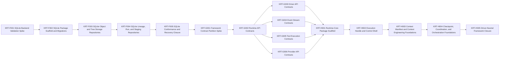

# Engineering Execution Plan

## 0. Version History & Changelog
- v0.2.0 - Replaced the kernel-only backlog with a driver-aware next-phase plan focused on SQLite, shared framework contracts, and shared framework foundations while deferring the first concrete driver and downstream integrations.
- v0.1.0 - Initial kernel-first execution plan separating the active foundational scope from the broader TechSpec baseline.
- ... [Older history truncated, refer to git logs]

## 1. Executive Summary & Active Critical Path
- **Total Active Story Points:** 51
- **Critical Path:** `KRT-F001 -> KRT-F002 -> KRT-F003 -> KRT-F004 -> KRT-F005 -> KRT-G001 -> KRT-G002 -> KRT-G003 -> KRT-H001 -> KRT-H002 -> KRT-H003 -> KRT-H004 -> KRT-H005` (Parallel prerequisites: `KRT-G004`, `KRT-G005`, and `KRT-G006` must complete before `KRT-H001`.)
- **Planning Assumptions:** Kernel foundations are complete in repo reality through Epics A-E; this revision covers only the next shared foundation slice authorized by the revised PRD, Architecture, and TechSpec; the first concrete driver, provider bridge implementation, and host adapters remain intentionally deferred until the shared framework substrate is explicit and stable.

### Brownfield Continuity Note
- The current codebase already contains the workspace scaffold, shared core types, kernel protocol package, memory backend, and kernel testkit.
- This plan does not reopen the completed kernel epics unless a later upstream revision explicitly changes kernel or backend contracts.
- Ticket numbering continues from `KRT-E002` to preserve continuity with the existing execution history.

## 2. Project Phasing & Iteration Strategy
### Delivery Cadence Posture
- No sprint or release-train cadence is being assumed in this plan.
- This section uses "iteration strategy" only because the planning framework requires that heading; the content below is dependency phasing and scope partitioning, not a commitment to Scrum-style iterations.

### Current Active Scope
- Deliver `@kraken/backend-sqlite` as the first official persistent backend with WAL-mode transactions, forward-only migrations, and shared conformance coverage.
- Formalize the shared framework contract surfaces so host, runtime, driver, tool, event, and provider boundaries are explicit before implementation pressure pushes ReAct assumptions into the wrong layer.
- Implement the driver-neutral shared framework foundations, including runtime-core scaffolding, execution-handle control flow, context and checkpoint coordination, orchestration boundaries, and driver-neutral integration closure.

### Future / Deferred Scope
- Epic I will cover the first concrete driver, the ReAct Driver baseline.
- Epic J will cover the AI SDK bridge baseline once the shared framework and provider-neutral contract surfaces exist.
- Epic K will cover stream adapters and the playground host after runtime-core and the ReAct Driver are in place.
- Future later epics may add additional drivers beyond ReAct, such as pipeline, router, evaluator-optimizer, or orchestrator-worker variants.
- Future later epics may add peer official backends beyond memory and SQLite, along with production-grade host surfaces beyond the playground baseline.

### Archived or Already Completed Scope
- Epic A delivered the root workspace scaffold and boundary-first monorepo structure.
- Epic B delivered the shared primitive package plus deterministic identity spike validation.
- Epic C delivered the kernel protocol contracts, deterministic CBOR/SHA helpers, and semantic fixtures.
- Epic D delivered the semantic reference memory backend.
- Epic E delivered the reusable kernel backend conformance, invariant, and recovery harness and closed the memory backend against it.

## 3. Build Order (Mermaid)


## 4. Ticket List
### Epic F — SQLite Persistent Backend (SPB)

**KRT-F001 SQLite Backend Validation Spike**
- **Type:** Spike
- **Effort:** 2
- **Dependencies:** None
- **Capability / Contract Mapping:** TechSpec `§3.5`, `§4.3`, `§5.2`, `§5.4`; ADR-007
- **Description:** Validate the exact `better-sqlite3`, WAL-mode, `BEGIN IMMEDIATE`, and forward-only migration posture for `@kraken/backend-sqlite` before implementation work starts.
- **Acceptance Criteria (Gherkin):**
```gherkin
Given the persistent backend scope is now active
When the SQLite implementation spike is completed
Then the repository records a verified implementation posture for transactions, migrations, and runtime support that matches the TechSpec
```

**KRT-F002 SQLite Package Scaffold and Migrations**
- **Type:** Feature
- **Effort:** 3
- **Dependencies:** KRT-F001
- **Capability / Contract Mapping:** TechSpec `§3.5`, `§5.1`, `§5.2`, `§5.4`
- **Description:** Create the `@kraken/backend-sqlite` package, schema bootstrap, migration runner, and physical table/index realization defined by the TechSpec.
- **Acceptance Criteria (Gherkin):**
```gherkin
Given the SQLite backend posture is verified
When the SQLite package scaffold is implemented
Then the package exposes the TechSpec-defined project structure, migration baseline, and physical schema without inventing backend-visible capabilities
```

**KRT-F003 SQLite Object and Tree Storage Repositories**
- **Type:** Feature
- **Effort:** 5
- **Dependencies:** KRT-F002
- **Capability / Contract Mapping:** PRD `CAP-P0-001`, `CAP-P0-006`, `CAP-P0-007`; TechSpec `§3.2`, `§3.3`, `§3.5`, `§4.3`
- **Description:** Implement the SQLite repositories and transaction behavior for immutable objects, schemas, TurnTrees, TurnTree paths, and ordered-path chunk storage, including path-granular semantics and chunk reuse.
- **Acceptance Criteria (Gherkin):**
```gherkin
Given the SQLite schema and migrations exist
When the object and tree storage repositories are implemented
Then the backend can persist and resolve immutable kernel structural state with the same protocol-visible semantics as the memory backend
```

**KRT-F004 SQLite Lineage, Run, and Staging Repositories**
- **Type:** Feature
- **Effort:** 5
- **Dependencies:** KRT-F003
- **Capability / Contract Mapping:** PRD `CAP-P0-002`, `CAP-P0-004`, `CAP-P0-005`, `CAP-P0-008`, `CAP-P0-014`; TechSpec `§3.2`, `§3.4`, `§3.5`, `§4.3`
- **Description:** Implement the SQLite repositories and invariants for TurnNodes, threads, branches, turns, runs, and staged results, including lineage validation, active-run rules, and recovery-relevant state transitions.
- **Acceptance Criteria (Gherkin):**
```gherkin
Given the SQLite backend can already store kernel structural state
When lineage, run, and staging repositories are implemented
Then the backend can represent thread, branch, turn, run, and staged-result semantics required for checkpoint, recovery, and branch movement behavior
```

**KRT-F005 SQLite Conformance and Recovery Closure**
- **Type:** Chore
- **Effort:** 3
- **Dependencies:** KRT-F004
- **Capability / Contract Mapping:** PRD `CAP-P0-005`, `CAP-P0-014`; TechSpec `§3.4`, `§5.2`
- **Description:** Run the SQLite backend through the shared conformance, invariant, and recovery suites and add any SQLite-specific migration or crash-consistency coverage needed for the official persistent baseline.
- **Acceptance Criteria (Gherkin):**
```gherkin
Given the SQLite backend implementation exists
When conformance and recovery closure are completed
Then the SQLite backend passes the shared kernel testkit suites and local tests prove the persistent migration and transaction guarantees promised upstream
```

### Epic G — Shared Framework Contracts (SFC)

**KRT-G001 Framework Contract Partition Spike**
- **Type:** Spike
- **Effort:** 2
- **Dependencies:** KRT-F005
- **Capability / Contract Mapping:** PRD `CAP-P0-019`, `CAP-P0-020`, `CAP-P0-033`, `CAP-P1-034`; Architecture `§2`; TechSpec `§1.1`, `§4`, `§5.4`; ADR-004, ADR-014
- **Description:** Validate the exact package and dependency partition between host-facing runtime contracts, driver contracts, event vocabulary, tool contracts, and provider contracts before the shared framework packages are implemented.
- **Acceptance Criteria (Gherkin):**
```gherkin
Given the framework is now explicitly driver-oriented upstream
When the framework contract partition spike is completed
Then the repository records a verified boundary split that keeps shared framework contracts distinct from ReAct-specific behavior and downstream bridge implementation details
```

**KRT-G002 Runtime API Contracts**
- **Type:** Feature
- **Effort:** 2
- **Dependencies:** KRT-G001
- **Capability / Contract Mapping:** PRD `CAP-P0-019`, `CAP-P0-020`, `CAP-P0-033`; TechSpec `§4.1`, `§5.1`
- **Description:** Implement `boundaries/framework/contracts/runtime-api` with the driver-neutral host-facing framework types such as `KrakenRuntime`, `ExecutionHandle`, execution status, and control payloads.
- **Acceptance Criteria (Gherkin):**
```gherkin
Given the framework contract partition has been validated
When the runtime-api contract package is implemented
Then the host-facing execution surface defined in the TechSpec exists as one stable driver-neutral TypeScript contract package
```

**KRT-G003 Driver API Contracts**
- **Type:** Feature
- **Effort:** 2
- **Dependencies:** KRT-G002
- **Capability / Contract Mapping:** PRD `CAP-P0-033`, `CAP-P1-034`; TechSpec `§1.1`, `§5.1`; ADR-014
- **Description:** Implement `boundaries/framework/contracts/driver-api` to formalize the contract boundary between shared framework foundations and concrete driver implementations.
- **Acceptance Criteria (Gherkin):**
```gherkin
Given the runtime-api package exists
When the driver-api contract package is implemented
Then concrete drivers can target one explicit framework-owned contract rather than reaching into runtime-core internals ad hoc
```

**KRT-G004 Event Stream Contracts**
- **Type:** Feature
- **Effort:** 2
- **Dependencies:** KRT-G002
- **Capability / Contract Mapping:** PRD `CAP-P0-020`, `CAP-P1-021`; TechSpec `§4.5`, `§5.1`
- **Description:** Implement `boundaries/framework/contracts/event-stream` with the canonical event vocabulary used by stream adapters and hosts, including source and driver attribution fields.
- **Acceptance Criteria (Gherkin):**
```gherkin
Given the runtime-api contract package exists
When the event-stream contract package is implemented
Then stream adapters and hosts can compile against one canonical Kraken event vocabulary rather than provider-specific or driver-specific stream shapes
```

**KRT-G005 Tool Execution Contracts**
- **Type:** Feature
- **Effort:** 2
- **Dependencies:** KRT-G002
- **Capability / Contract Mapping:** PRD `CAP-P0-013`, `CAP-P0-016`, `CAP-P0-017`; TechSpec `§4.1`, `§5.1`
- **Description:** Implement `boundaries/framework/contracts/tool-contracts` for tool definitions, approval payloads, and runtime-facing tool execution contracts needed by shared framework foundations and future concrete drivers.
- **Acceptance Criteria (Gherkin):**
```gherkin
Given the runtime-api contract package exists
When the tool-contracts package is implemented
Then the shared runtime layer and future drivers share one typed contract for tool definitions, approval requests, and approval resolutions
```

**KRT-G006 Provider API Contracts**
- **Type:** Feature
- **Effort:** 2
- **Dependencies:** KRT-G002
- **Capability / Contract Mapping:** PRD `CAP-P0-012`, `CAP-P0-030`, `CAP-P1-031`; TechSpec `§4.4`, `§5.1`
- **Description:** Implement `boundaries/providers/contracts/provider-api` with the canonical provider-neutral generate/stream contract used by shared framework foundations and future provider bridges.
- **Acceptance Criteria (Gherkin):**
```gherkin
Given the runtime-api contract package exists
When the provider-api contract package is implemented
Then model-provider integration depends on one Kraken-owned provider contract rather than vendor wire shapes
```

### Epic H — Shared Framework Foundations (SFF)

**KRT-H001 Runtime-Core Package Scaffold**
- **Type:** Feature
- **Effort:** 3
- **Dependencies:** KRT-G003, KRT-G004, KRT-G005, KRT-G006
- **Capability / Contract Mapping:** PRD `CAP-P0-019`, `CAP-P0-033`; TechSpec `§1.1`, `§5.1`; Architecture `§2`
- **Description:** Create `boundaries/framework/implementations/typescript/runtime-core` with the package scaffold, kernel integration wiring, and shared runtime domain types needed before concrete driver behavior is implemented.
- **Acceptance Criteria (Gherkin):**
```gherkin
Given the shared framework and provider contracts exist
When the runtime-core package scaffold is implemented
Then the repository has one bounded package ready to host the shared framework-services layer above the kernel and below concrete drivers
```

**KRT-H002 Execution Handle and Control Shell**
- **Type:** Feature
- **Effort:** 5
- **Dependencies:** KRT-H001
- **Capability / Contract Mapping:** PRD `CAP-P0-004`, `CAP-P0-019`, `CAP-P0-020`, `CAP-P0-033`; TechSpec `§4.1`, `§5.4`; Architecture `§2`
- **Description:** Implement the shared execution-handle lifecycle, runtime command shell, driver selection wiring, and canonical event publication path in runtime-core.
- **Acceptance Criteria (Gherkin):**
```gherkin
Given the runtime-core package scaffold exists
When the execution-handle and control shell are implemented
Then hosts can start turns, route controls, and observe canonical runtime events through one driver-neutral shared runtime layer
```

**KRT-H003 Context Manifest and Context Engineering Foundations**
- **Type:** Feature
- **Effort:** 5
- **Dependencies:** KRT-H002
- **Capability / Contract Mapping:** PRD `CAP-P0-010`, `CAP-P1-011`, `CAP-P1-022`, `CAP-P0-033`; TechSpec `§4.1`, `§5.2`; Architecture `§2`, `§4.3`
- **Description:** Implement the shared framework services for context manifest ownership, active-context assembly boundaries, and driver-neutral context-engineering coordination above the kernel.
- **Acceptance Criteria (Gherkin):**
```gherkin
Given the execution-handle and control shell exist
When context manifest and context-engineering foundations are implemented
Then the shared framework layer owns context metadata and rewrite coordination in a way that future drivers can reuse without redefining durable history semantics
```

**KRT-H004 Checkpoint, Coordination, and Orchestration Foundations**
- **Type:** Feature
- **Effort:** 5
- **Dependencies:** KRT-H003
- **Capability / Contract Mapping:** PRD `CAP-P0-005`, `CAP-P0-023`, `CAP-P0-026`, `CAP-P0-027`, `CAP-P1-029`, `CAP-P0-033`; TechSpec `§4.1`, `§5.2`; Architecture `§2`, `§4.1`, `§4.4`
- **Description:** Implement the shared framework services for checkpoint coordination, run-state handoff with the kernel, and driver-neutral worker and handoff orchestration boundaries.
- **Acceptance Criteria (Gherkin):**
```gherkin
Given context and control foundations already exist
When checkpoint, coordination, and orchestration foundations are implemented
Then the shared framework layer can coordinate durable execution transitions and orchestration state without embedding ReAct-specific loop behavior
```

**KRT-H005 Driver-Neutral Framework Closure**
- **Type:** Chore
- **Effort:** 3
- **Dependencies:** KRT-H004
- **Capability / Contract Mapping:** PRD `CAP-P0-033`, `CAP-P1-034`; TechSpec `§5.2`, `§5.4`; ADR-014
- **Description:** Add integration coverage, fake-driver smoke tests, and package-level closure work that proves the shared framework foundations are usable without depending on the ReAct Driver implementation itself.
- **Acceptance Criteria (Gherkin):**
```gherkin
Given runtime-core and the shared framework contracts are implemented
When driver-neutral framework closure is completed
Then tests prove the shared framework foundations can host a concrete driver through the explicit driver boundary without leaking ReAct-specific assumptions into the core layer
```
