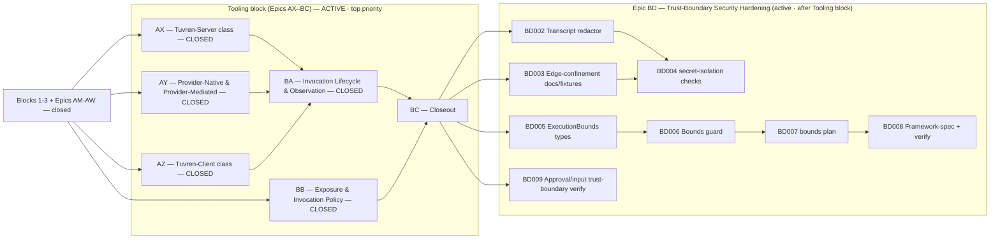

# Engineering Execution Plan

## 0. Version History & Changelog

- v0.31.6 - Closed Epic BB Exposure & Invocation Policy Model: `PolicyCapabilityMetadata` added to `@tuvren/core/capabilities` carrying per-capability policy dimensions (riskClass, requiredResidency, requiresUserPresence, requiredCredentialScopes, nonRetryable); `CapabilityPolicyContext` extended with BB001–BB004 dimensions (allowedResidencies, userPresent, unavailableCapabilityIds, availableCredentialScopes, capabilityMetadata); `TuvrenToolDefinition` gains five optional policy fields; `CapabilityPolicyContextInputs` new interface and `AgentConfig.policyContextInputs` added; full five-dimension policy engine (residency, risk/approval, active-endpoint, user-presence, credential-boundary, nonRetryable); exposure-time filtering wired in `createDriverExecutionContext` (withheld tools never reach the model); invocation-time context populated from real `AgentConfig.policyContextInputs`; resume-path invocation check added to `resolveResumeDecision` (and `createToolBatchEnvironment` in tool-resume path fixed to carry policy engine); `nonRetryable: true` overrides `idempotent: true` in retry budget; risk-based `requiresApproval` gate bridges policy decision into pending-approval flow; composition: deny-from-any-dimension with composed non-secret reason; deterministic; `capability-policy` conformance check set (26 checks covering BB001–BB005 at both decision points + composition + control path) registered in the `tuvren.shared.core` authority packet; compatibility evidence refreshed. 472 runtime tests pass; 425/425 framework conformance checks pass; `bun run verify` exits 0 (aside from worktree-only generated-artifact issues resolved by `bun run codegen`).
- v0.31.5 - Closed Epic BA Invocation Lifecycle & Observation Model: added `InvocationLifecycleState` union type to `@tuvren/core/capabilities` formalising the uniform cross-class lifecycle (resolved → policy-admitted → dispatched → completed/failed/ignored) per KRT-BA001; routed provider-native and provider-mediated `tool.start`/`tool.result` attribution events through `publishRuntimeEvent` so the telemetry emitter observes them alongside the canonical stream, closing the BA002 telemetry-consistency gap; `null` used as the JSON-serializable "not observed" sentinel for provider tool inputs (passes `assertTuvrenStreamEvent` validation); BA003 cross-class resume and recovery semantics proven: tuvren-server fails clean via existing durability rules, provider-native/mediated resolve from observed driver output, tuvren-client stale/unavailable paths surface typed error codes (CAPABILITY_RESULT_STALE, CAPABILITY_BINDING_UNAVAILABLE), and turn abort terminates as `execution_cancelled` without fabricated results; BA004 lifecycle telemetry depth confirmed: `tool_call` spans keyed to runtime lineage and execution class for all four classes using existing semconv attributes (no extension needed); `invocation-lifecycle-observation` conformance check set (19 checks) added to the authority packet and registered as an executable verification path with full BA001–BA003 coverage including fail-clean proofs; 424 runtime tests pass; 399/399 framework conformance checks pass; `bun run verify` exits 0.
- v0.31.4 - Closed Epic AZ Tuvren-Client Execution Class: implemented the runtime-side leased client-endpoint protocol and attachment seam (concrete endpoints remain host-developer deliverables); `AttachedClientEndpoint`, `ClientEndpointCapabilityAdvertisement`, `ClientInvocationEnvelope`, `ClientReportedResult`, `ClientEndpointBoundary`, `ClientDispatchResult` shapes added to `@tuvren/core/capabilities`; `AgentConfig.clientEndpoints` and `AgentConfig.clientEndpointBoundary` wired; `ClientEndpointBoundary.detach()` supports dynamic endpoint lifecycle; synthetic `TuvrenToolDefinition` entries built from advertised capabilities route dispatch through the boundary with leaseToken staleness detection; `isClientEndpointTool` guard suppresses `tool.audit` events and server-side rate-limiting for the class (canAudit: false); `observationForClass("tuvren-client")` explicit with partial-observability limits; client-side MCP classified as `tuvren-client / mcp-server` endpoint kind (never reclassified); `PauseContext` and `LoopState` carry the boundary through pause/resume and handoff cycles; `tuvren-client-execution-class` conformance check set (13 checks) added to the authority packet and registered as an executable verification path; `createClientEndpointBoundary` exported from `@tuvren/runtime`; integration contract documented at `boundaries/framework/contracts/client-endpoint-integration.md`; 394 runtime tests pass; 379/379 framework conformance checks pass; kernel verify:kernel:fresh passes.
- v0.31.3 - Closed Epic AY Provider-Native & Provider-Mediated Execution Classes: added `ProviderNativeToolDeclaration` and `ProviderMediatedToolConfig` to `TuvrenPrompt`/`AgentConfig`; wired the AI SDK bridge to accept declared provider tool results (`LanguageModelV3ToolResult`) via `providerToolClassLookup`; threaded `providerNativeTools`/`providerMediatedTools`/`providerContinuity` through `createProviderPrompt`/`createAroundModelContextSnapshot`; pre-staged provider tool messages bypass the Tool Execution Gateway; `emitProviderToolAttributionEvents` emits `tool.start`+`tool.result` with `owner:"provider"` and correct per-class observation limits (canAudit/canCancel/canRetry/canResume: false); `isProviderOnlyResponseEventSet` guard in `validateDriverAssistantEvents` handles pure provider-stream responses; `assertDriverMessages` guard extended to allow pre-staged provider tool messages; concrete proofs through the full stack (bridge → react-driver → runtime) for Anthropic `code_execution_20260120` pattern (generate path) and OpenAI `openai.mcp` pattern; `provider-native-execution-class` (10 checks) and `provider-mediated-execution-class` (10 checks) conformance check sets added to the `tuvren.providers.provider-api` authority packet; 54 bridge tests + 358 runtime tests + 78 react-driver tests pass; 52/52 provider conformance checks pass. Known gap: AY005 multi-turn providerContinuity round-trip (extraction from response → next prompt) is structurally wired but not exercised by a multi-turn test; single-turn proofs validate all other invariants.
- v0.31.2 - Closed Epic AX Tuvren-Server Execution Class: implemented full server lifecycle (input/output validation with `tool_input_validation_failed`/`tool_result_validation_failed` error codes, `TuvrenToolDefinition.outputSchema`), idempotent retry (`idempotent`, `maxRetries` fields, framework-owned retry loop, cooperative cancellation, late-completion ignoring), tenant isolation and rate-limiting (`AgentConfig.serverExecution`, `ServerRateLimiter`, `TOOL_INVOCATION_RATE_LIMITED` per-turn per-instance), server-side MCP binding classification confirmed (`mcp-server` endpoint kind), server sandbox endpoint (`TuvrenSandboxExecutor`, `metadata.sandbox.endpointId`, `tuvren-sandbox` endpoint kind, `AgentConfig.sandboxExecutors`), full-lifecycle `ToolAuditEvent` (`tool.audit`) at input/output validation, retry, and rate-limit lifecycle points with secret isolation, and the `tuvren-server-execution-class` conformance check set (19 checks including cancellation/late-completion, tenant isolation, and output-validated audit). 349 runtime tests pass; 19/19 AX conformance checks pass; 37 pre-existing non-AX conformance failures unchanged.
- v0.31.1 - Closed Epic AW Capability Orchestration Foundation: added `@tuvren/core/capabilities` subpath (§3.13 types), Capability Registry, Binding & Endpoint Resolver (back-compat `defineTool` → `tuvren-server`), Capability Policy Engine (exposure-time and invocation-time decision points, wired into tool dispatch), execution-class + owner attribution on canonical events and telemetry (semconv extended), `capability_binding_unavailable` error code, and the `runtime-api-capability-orchestration` foundation conformance check set (12 new checks including `tool.result isError` wired denial proof). Authority packet bumped to v1.2.0. 303 runtime tests, 347/347 framework conformance checks pass.
- v0.31.0 - Restructured the capability/tool restructuring into a contiguous, fully-ticketed **Tooling block (Epics AW–BC)** placed at the front of the queue, implementing the PRD v0.9.0 / Architecture v0.9.0 / TechSpec v0.29.0 capability-orchestration model (ADR-046, ADR-047): AW Capability Orchestration Foundation, AX Tuvren-Server Execution Class, AY Provider-Native & Provider-Mediated Execution Classes, AZ Tuvren-Client Execution Class, BA Invocation Lifecycle & Observation Model, BB Exposure & Invocation Policy Model, BC Tooling Restructuring Closeout. Tuvren-client scope is runtime protocol + attachment seam only (concrete client endpoints stay host deliverables); provider-native/mediated scope is runtime support proven against the AI-SDK-bridged providers. The whole block precedes the trust block and the productionization roadmap, so the former Epic AW (Trust-Boundary Security Hardening) is renumbered to **Epic BD** and the roadmap shifts to **Epics BE–BI**.
- v0.29.2 - Closed Epic AV operational telemetry: added `@tuvren/core/telemetry`, framework sink wiring with secret-screening, `@tuvren/telemetry-otel`, the `framework-operational-telemetry` conformance plan, curated runtime re-exports, portability-inventory updates, and verification coverage.
- v0.29.1 - Maintenance alignment after Epic AU closure: compacted completed Epics AM-AU into the closed-work ledger, marked AU closed with `kernel-crash-recovery` evidence, and updated the active graph/DoD accordingly.
- ... [Older history truncated, refer to git logs]

## 1. Executive Summary & Active Critical Path

- **Total Active Story Points:** 170 gross (**50 remaining**) across the remainder of the Tooling block plus the trust block — the **Tooling block remainder (Epic BC, 17 points)** as the top-priority front of the queue, and **Epic BD (Trust-Boundary Security Hardening, 33 remaining points, formerly Epic AW, with `KRT-BD001` already complete)** sequenced after it. Epics AM through BB are closed and retained as a compact audit ledger below.
- **Critical Path:** Epics AW, AX, AY, AZ, BA, and BB are closed. Next: closeout — `KRT-BC001 → KRT-BC002 → KRT-BC004` (BC003 can run parallel with BC002). Only after the Tooling block closes does Epic BD run: `KRT-BD002 → KRT-BD004` and `KRT-BD005 → KRT-BD006 → KRT-BD007 → KRT-BD008`, with `KRT-BD009` as an independent close-condition lane (`KRT-BD001` already complete).
- **Planning Assumptions:** The Tooling block (Epics AW–BC) is governed by PRD v0.9.0, Architecture v0.9.0, and TechSpec v0.29.0 (ADR-046, ADR-047); the upstream contracts (`@tuvren/core/capabilities` §3.13, the §4.21 contract) are authored, so the tickets are implementation-ready. Tuvren-client scope is the runtime protocol + attachment seam only — concrete client endpoints (browser extension, desktop, device) remain host-developer deliverables per PRD §6. Provider-native and provider-mediated scope is runtime support proven against today's AI-SDK-bridged providers, with at least one concrete proof per class and additional providers additive later. Epic BD (formerly Epic AW) is governed by PRD v0.8.0 / Architecture v0.8.0 / TechSpec v0.28.x (ADR-042 through ADR-045); it remains active and runs after the Tooling block per product priority. The prior chain (PRD v0.7.0 / Architecture v0.7.0 / TechSpec v0.27.x, ADR-034 through ADR-041, Epics AM-AT) is closed. The Tooling block reframes tool representation within the existing TypeScript line and keeps today's developer-defined tool path working unchanged as the Tuvren-server execution class; it adds no Rust framework/product scope, no new host protocol, no new backend, and no new model-provider family beyond the existing AI SDK bridge. The `product proof gate`, `platform gate`, and `portability gate` from Epic AL remain the staged-gate baseline. The locked external dependency versions per TechSpec §1 still apply.

### Brownfield Continuity Note

- Epics A-AL remain historical context. Epic AL's closure of the staged gates is the foundation this chain extends.
- The current repo proves the host-facing SDK through the serious REPL host (`@tuvren/repl-host`) and its named `proving-host:*` validation lanes; exercises PostgreSQL as a first-class backend; closes the portability gate through `tools/scripts/portability-gate.ts`; and carries the shared primitive surface in `@tuvren/core` with source-bearing runtime implementation in `@tuvren/runtime`. The old contract package handles and `@tuvren/runtime-core` are compatibility shims only.
- Historical closure inventories live under `constitution/archived/` for audit only.

### Sequential Scope Rule

- The Tooling block (Epics AW–BC) restructures how tools are represented within the existing TypeScript line. It adds no Rust scope, no new model-provider family beyond the existing AI SDK bridge, no new host protocol, and no new backend. It keeps the existing `defineTool` / Tool Execution Gateway path working unchanged as the Tuvren-server execution class.
- The Tuvren-client execution class (Epic AZ) is **closed**: the runtime gained the leased client-endpoint dispatch/result protocol and attachment seam, client-side MCP classification, availability/staleness handling, and partial-observability model. Concrete client endpoints (browser extension, desktop app, device agent) remain host-developer deliverables per PRD §6.
- Provider-native and provider-mediated execution (Epic AY) is closed: the runtime gained representation, configuration, attribution, and observation for those classes with one concrete proof each through mock-backed end-to-end tests. Real live-provider testing (API keys not in CI) is additive scope per the gap note in `constitution/support/live/ay001-provider-surface-matrix.md`. The AY005 multi-turn providerContinuity round-trip is structurally wired; a complete multi-turn proof is deferred to a follow-on epic.
- No Rust framework or Rust product-line expansion is active. No first-class Tuvren model-provider packages are active beyond the AI SDK bridge; the MCP client remains a tool source / binding mechanism, not a model provider.
- No additional host protocols beyond the canonical stream and SSE surfaces are active. Public package publication remains deferred (Epic BG in the roadmap).
- The production-trust block (now Epic BD) hardens the existing TypeScript line only and runs after the Tooling block. Epic AU's fault-injection seam is closed and testkit-only; Epic AV's telemetry surface is closed; execution bounds and secret isolation (Epic BD) add framework-owned guards and credential-edge confinement without altering kernel semantics.

### Planning Heuristic

- Prefer ticket slices that fit focused solo-dev execution while preserving strict gates around product proof, backend rigor, and conformance truthfulness.
- Treat “green because a private harness succeeds” as insufficient evidence once a proving-host or conformance ticket exists on the critical path.

## 2. Project Phasing & Iteration Strategy

### Current Active Scope

- **Block 5 — Tooling restructuring (Epics AW–BC): Epics AW, AX, AY, AZ, BA, and BB closed; Epic BC ACTIVE, top priority.** AW delivered the capability-orchestration foundation; AX delivered the full Tuvren-server execution class; AY delivered provider-native and provider-mediated execution classes; AZ delivered the Tuvren-client execution class; BA delivered the cross-class invocation lifecycle and observation model; BB delivered the full exposure/invocation policy model. The remainder (BC) closes out the Tooling block.
  - **AW — Capability Orchestration Foundation: CLOSED.** See Completed Work Ledger.
  - **AX — Tuvren-Server Execution Class: CLOSED.** See Completed Work Ledger.
  - **AY — Provider-Native & Provider-Mediated Execution Classes: CLOSED.** See Completed Work Ledger.
  - **AZ — Tuvren-Client Execution Class: CLOSED.** See Completed Work Ledger.
  - **BA — Invocation Lifecycle & Observation Model: CLOSED.** See Completed Work Ledger.
  - **BB — Exposure & Invocation Policy Model: CLOSED.** See Completed Work Ledger.
  - **BC — Tooling Restructuring Closeout:** cross-class integration conformance, the framework-spec "Capability Orchestration" section, portability inventory, and the clean `bun run verify` that proves the tooling aspect is finished.
- **Block 4 — Production trust remainder (Epic BD, formerly Epic AW): active, sequenced after the Tooling block.** Hardens execution bounds with a typed `execution_bound_exceeded` terminal result, secret isolation across durable/telemetry/transcript surfaces, and verification that approval gates are non-bypassable and untrusted MCP/tool inputs are validated. `KRT-BD001` (telemetry secret-screening helpers) is already complete.
- **Block 1 — Boundary correctness gate (Epics AM, AN, AO):** closed. `thread.list`, base-handle `awaitResult`, and the five-method `TuvrenRuntime` durable-read surface.
- **Block 2 — Curated surface + ergonomics (Epics AP, AQ, AR):** closed. `@tuvren/core` consolidation, schema-agnostic `defineTool`, and the `createTuvren({...})` batteries-included factory.
- **Block 3 — Capability spikes (Epics AS, AT):** closed. `@tuvren/mcp-client` as a first-class tool source and the consolidated REPL reference host with headless mode and transcript replay.

### Future / Deferred Scope

- Rust framework and Rust product-line work — still blocked.
- First-class Tuvren-owned model-provider packages beyond the TypeScript AI SDK bridge.
- Cross-tenant thread search, multi-tenant ACLs, full-text indexed querying through the embeddable SDK (deferred to a future hosted/server projection).
- Server or REST projection of the durable-read surface (same future projection).
- Model Context Protocol server-side projection — Tuvren as an MCP server. Only the client side and the MCP-as-binding classification are in scope.
- Concrete client endpoint products (browser extension, desktop app, device agent) — the runtime orchestrates and leases attached client endpoints (Epic AZ) but does not ship the endpoints themselves.
- Schema adapters beyond Zod, Standard Schema, and wrapped JSON Schema in the core surface.
- Driver hot-swap or additional drivers beyond the ReAct baseline.
- Additional host protocols beyond the canonical stream and SSE surfaces; additional official backends beyond memory, SQLite, and PostgreSQL.
- Public package publication and final long-lived package curation (Epic BG in the roadmap below).

#### Post-Tooling / Post-Trust Roadmap (Epics BE–BI) — Named, Not Yet Ticketed

These epics are the agreed direction after the Tooling block and the trust block, toward host adoption plus first-party dogfooding (PRD §1.4). They are recorded with enough scope to anchor a future planning session; they are intentionally NOT decomposed into tickets yet.

- **Epic BE — Performance Characterization & Regression Budgets.** Benchmark the hot paths, publish documented performance budgets, and wire a `bench` regression gate into the canonical verification path. Prerequisite: the durability guarantees from Epic AU are proven first.
- **Epic BF — Public API Surface Freeze & Semver Discipline.** Define the stable public API of `@tuvren/core` (including the new `/capabilities` surface) + `@tuvren/runtime`. Run after the reference application (BI) so the surface is frozen against real usage friction. BF and BI form an iteration ordering, not a hard dependency cycle: BI builds on the still-unfrozen surface, and BF performs the freeze after absorbing BI's friction feedback.
- **Epic BG — Publication & Release Engineering.** npm publication of the curated packages, changesets / versioning, CI release pipeline, and provenance. Gated on BF's surface freeze.
- **Epic BH — Documentation & Onboarding.** Docs site, getting-started, cookbook, and API reference.
- **Epic BI — Reference Application (Dogfood Target).** A real, non-trivial application built end-to-end on Tuvren that exercises the capability-orchestration model and surfaces API friction feeding back into BF.

### Archived or Already Completed Scope

- Epic AH completed the constitutional authority reset; the live authority chain is the four constitutional documents plus explicit support inputs.
- Epics A-Q established the baseline TypeScript runtime, ReAct path, provider bridge, stream adapters, playground host, and release-hardening work.
- Epics AI–AL completed the high-level SDK audit, the serious REPL proving host, the PostgreSQL platform gate, and the portability-gate closure.
- Epics R-AG established the multi-language transition foundation, shared conformance architecture, and kernel interop.
- Epics AM-AV are summarized in the completed-work ledger in §4.
- The active forward path is the Tooling block (Epics AW–BC) followed by the trust block (Epic BD); see Current Active Scope.

## 3. Build Order (Mermaid)



## 4. Ticket List

### Completed Work Ledger (Epics AX–BB)

Completed ticket detail is removed from the active execution plan and retained through git history plus archived support artifacts. This ledger is the live audit summary for the five most recently closed epics; older closure records live in git history and `constitution/archived/`.

| Epic | Points | Closed Outcome | Evidence Anchor |
| --- | ---: | --- | --- |
| AX | 28 | Delivered the Tuvren-Server Execution Class: input/output validation with typed error codes (`tool_input_validation_failed`, `tool_result_validation_failed`, `TuvrenToolDefinition.outputSchema`), idempotent retry (`idempotent`, `maxRetries`, framework-owned retry loop in `executeSingleTool`, cooperative cancellation, late-completion ignoring), tenant isolation + rate-limiting (`AgentConfig.serverExecution`, `ServerRateLimiter`, `TOOL_INVOCATION_RATE_LIMITED`, per-turn per-instance scoping), server-side MCP binding classification confirmed (`mcp-server` endpoint kind), server sandbox endpoint (`TuvrenSandboxExecutor`, `metadata.sandbox.endpointId`, `tuvren-sandbox` endpoint kind, `AgentConfig.sandboxExecutors`), full-lifecycle `ToolAuditEvent` (`tool.audit`) at five lifecycle points with secret isolation, and `tuvren-server-execution-class` conformance check set (19 checks: AX001–AX006 including cancellation/late-completion, tenant isolation, and output-validated audit). | `tuvren-server-execution-class` conformance plan (19/19 pass); `boundaries/shared/contracts/core/spec/authority-packet.json` |
| AY | 39 | Delivered Provider-Native & Provider-Mediated Execution Classes through the AI SDK bridge: `ProviderNativeToolDeclaration`/`ProviderMediatedToolConfig` in `TuvrenPrompt`/`AgentConfig`; bridge `providerToolClassLookup` accepts declared provider tool results; pre-staged provider tool messages bypass the Tool Execution Gateway; `emitProviderToolAttributionEvents` emits `tool.start`+`tool.result` with `owner:"provider"` and per-class observation limits (canAudit/canCancel/canRetry/canResume: false, canPersistResult: true); `assertDriverMessages` guard extended for pre-staged provider messages; `isProviderOnlyResponseEventSet` guard handles pure provider-stream responses; concrete generate and stream proofs for Anthropic code_execution and OpenAI MCP patterns; `provider-native-execution-class` (10 checks) and `provider-mediated-execution-class` (10 checks) in the `tuvren.providers.provider-api` authority packet; 52/52 provider conformance checks pass. Known gap: AY005 multi-turn providerContinuity extraction round-trip is structurally wired but not exercised by a multi-turn test. | `provider-native-execution-class` and `provider-mediated-execution-class` conformance plans (20 new checks, 52/52 total); `boundaries/providers/contracts/provider-api/spec/authority-packet.json`; `constitution/support/live/ay001-provider-surface-matrix.md` |
| AZ | 37 | Delivered the Tuvren-Client Execution Class (runtime side only): `AttachedClientEndpoint`, `ClientEndpointCapabilityAdvertisement`, `ClientInvocationEnvelope`, `ClientReportedResult`, `ClientEndpointBoundary` (with `detach()`), `ClientDispatchResult` shapes in `@tuvren/core/capabilities`; `AgentConfig.clientEndpoints` and `AgentConfig.clientEndpointBoundary` wired; synthetic `TuvrenToolDefinition` entries from advertised capabilities route dispatch through the boundary with leaseToken staleness detection; `isClientEndpointTool` guard suppresses `tool.audit` events and server-side rate-limiting (canAudit: false); `observationForClass("tuvren-client")` explicit; client-side MCP classified as `tuvren-client / mcp-server` endpoint kind; `PauseContext` and `LoopState` carry the boundary through lifecycle; `tuvren-client-execution-class` conformance check set (13 checks) registered in authority packet; client-endpoint integration contract documented. 394 runtime tests + 379/379 framework conformance checks pass; kernel verify:kernel:fresh passes. Concrete client endpoints remain host-developer deliverables. | `tuvren-client-execution-class` conformance plan (13/13 pass); `boundaries/shared/contracts/core/spec/authority-packet.json`; `boundaries/framework/contracts/client-endpoint-integration.md` |
| BA | 26 | Delivered Invocation Lifecycle & Observation Model: `InvocationLifecycleState` union type added to `@tuvren/core/capabilities` formalising the uniform cross-class lifecycle (resolved → policy-admitted → dispatched → completed/failed/ignored); provider-native/mediated `tool.start`/`tool.result` attribution events routed through `publishRuntimeEvent` so telemetry observes them (BA002 gap closed); `null` used as the JSON-serializable "not observed" sentinel for provider tool `tool.start` inputs; cross-class resume/recovery semantics proven: tuvren-server fails clean per durability, provider classes resolve from observed driver output, tuvren-client stale/unavailable paths surface CAPABILITY_RESULT_STALE/CAPABILITY_BINDING_UNAVAILABLE, turn abort terminates as `execution_cancelled`; lifecycle telemetry depth confirmed: `tool_call` spans keyed to runtime lineage + execution class for all four classes using existing semconv (no semconv extension needed); `invocation-lifecycle-observation` conformance check set (19 checks covering BA001–BA003) registered as an executable verification path. 424 runtime tests pass; 399/399 framework conformance checks pass; `bun run verify` exits 0. | `invocation-lifecycle-observation` conformance plan (19/19 pass); `boundaries/shared/contracts/core/spec/authority-packet.json` |
| BB | 26 | Delivered Exposure & Invocation Policy Model: `PolicyCapabilityMetadata` type added to `@tuvren/core/capabilities` (riskClass, requiredResidency, requiresUserPresence, requiredCredentialScopes, nonRetryable); `CapabilityPolicyContext` extended with all §4.21 dimensions; `TuvrenToolDefinition` gains five optional policy fields; `AgentConfig.policyContextInputs` added; full five-dimension policy engine (BB001 residency, BB002 risk/approval, BB003 active-endpoint/user-presence, BB004 credential-boundary/nonRetryable, BB005 composition/precedence); exposure-time filtering wired in `createDriverExecutionContext`; invocation-time context populated from real config; resume-path invocation check in `resolveResumeDecision` (tool-resume `createToolBatchEnvironment` fixed to carry policy engine); `requiresApproval` from policy engine bridges to pending-approval flow; `nonRetryable` overrides `idempotent` in retry budget; `capability-policy` conformance check set (26 checks, BB001–BB005 at both decision points + composition + control path) registered in `tuvren.shared.core` authority packet; compatibility evidence refreshed. 472 runtime tests pass; 425/425 framework conformance checks pass. | `capability-policy` conformance plan (26/26 pass); `boundaries/shared/contracts/core/spec/authority-packet.json`; `reports/compatibility/evidence/` |

### Epic AW — Capability Orchestration Foundation (KRT)

**Status:** **CLOSED.** See Completed Work Ledger. Ticket bodies retained in git history.

### Epic AX — Tuvren-Server Execution Class (KRT)

**Status:** **CLOSED.** See Completed Work Ledger. Ticket bodies retained in git history.

### Epic AY — Provider-Native & Provider-Mediated Execution Classes (KRT)

**Status:** **CLOSED.** See Completed Work Ledger. Ticket bodies retained in git history.

### Epic AZ — Tuvren-Client Execution Class (KRT)

**Status:** **CLOSED.** See Completed Work Ledger. Ticket bodies retained in git history.


### Epic BA — Invocation Lifecycle & Observation Model (KRT)

**Status:** **CLOSED.** See Completed Work Ledger. Ticket bodies retained in git history.

### Epic BB — Exposure & Invocation Policy Model (KRT)

**Status:** **CLOSED.** See Completed Work Ledger. Ticket bodies retained in git history.

### Epic BC — Tooling Restructuring Closeout (KRT)

**Status:** Active, final epic of the Tooling block. Proves the whole tooling aspect is finished end to end and states the model in the framework specification.

**KRT-BC001 Cross-Class Integration Conformance**
- **Type:** Feature
- **Effort:** 8
- **Dependencies:** `KRT-BA005`, `KRT-BB006`
- **Capability / Contract Mapping:** PRD `CAP-P0-056` through `CAP-P1-063`; TechSpec §4.21, §5.7
- **Description:** Add a `capability-orchestration-integration` check set exercising one agent segment that uses all four execution classes and at least one MCP binding under each applicable class, asserting the conceptual invariant holds across classes, policy applies at both decision points, and per-class observation limits are honored simultaneously.
- **Acceptance Criteria (Gherkin):**
```gherkin
Given all four execution classes, bindings, policy, and observation are implemented
When the cross-class integration check set is added
Then one agent segment exercises provider-native, provider-mediated, Tuvren-server, and Tuvren-client capabilities plus MCP bindings
And the conceptual invariant holds for every invocation across the segment
And exposure-time and invocation-time policy apply and per-class observation limits are honored simultaneously
And bun run conformance includes the new integration check set automatically
```

**KRT-BC002 Framework-Spec "Capability Orchestration" Section**
- **Type:** Chore
- **Effort:** 3
- **Dependencies:** `KRT-BC001`
- **Capability / Contract Mapping:** TechSpec ADR-046, §5.7.1
- **Description:** Add a normative "Capability Orchestration" section to `docs/KrakenFrameworkSpecification.md` (minor bump) describing the model (Tool Surface vs Capability, the four execution classes, bindings and endpoints, exposure-time and invocation-time policy, per-class observation limits, MCP-as-binding, and the conceptual invariant) so future drivers inherit it.
- **Acceptance Criteria (Gherkin):**
```gherkin
Given the capability-orchestration model is implemented and integration-conformance passes
When the framework specification's Capability Orchestration section is added
Then docs/KrakenFrameworkSpecification.md describes the model, the four execution classes, bindings/endpoints, policy, observation limits, and the conceptual invariant
And the section is normative so future drivers inherit the model
And the framework specification version is bumped
```

**KRT-BC003 Capability Surface Portability Inventory + Authority-Packet Finalization**
- **Type:** Chore
- **Effort:** 3
- **Dependencies:** `KRT-BC001`
- **Capability / Contract Mapping:** TechSpec §5.7; Architecture Authority Packet Surface
- **Description:** Finalize the authority packets and conformance plans for the capability surface and add them to the portability inventory (`constitution/support/live/epic-al-portability-inventory.json`) so the capability-orchestration surface is a tracked portable surface under the portability gate.
- **Acceptance Criteria (Gherkin):**
```gherkin
Given the capability-orchestration contracts and conformance plans exist
When the portability inventory and authority packets are finalized
Then the capability-orchestration surface is recorded in the portability inventory as a tracked portable surface
And its authority packets reference the capability-orchestration conformance plans
And the portability gate evaluates the capability surface
```

**KRT-BC004 Tooling Block Closeout: `verify` + Finished DoD**
- **Type:** Chore
- **Effort:** 3
- **Dependencies:** `KRT-BC002`, `KRT-BC003`
- **Capability / Contract Mapping:** TechSpec §5.7
- **Description:** Run `bun run verify` from a clean checkout, refresh compatibility evidence for the capability-orchestration lanes, and validate the block-level "tooling is finished" definition of done: all four execution classes orchestrated with honest per-class limits, MCP-as-binding across classes, exposure/invocation policy, cross-class invariant, and framework-spec coverage.
- **Acceptance Criteria (Gherkin):**
```gherkin
Given the entire Tooling block is implemented and conformance passes
When the closeout runs
Then bun run verify exits zero from a clean checkout
And fresh compatibility evidence reflects the capability-orchestration lanes
And the block-level finished definition of done in §5 is satisfied across all four execution classes
```

### Epic BD — Trust-Boundary Security Hardening (KRT)

**Status:** Active, sequenced after the Tooling block. Realizes ADR-043 (execution bounds) and ADR-044 (secret isolation), plus verification of the approval/input trust boundaries the PRD elevated. `KRT-BD001` is complete as the telemetry secret-screening prerequisite consumed by closed Epic AV.

**KRT-BD001 Telemetry Secret-Screening Helpers**
- **Type:** Security
- **Effort:** 3
- **Dependencies:** None
- **Capability / Contract Mapping:** PRD `CAP-P0-055`; TechSpec ADR-044, §5.6.3
- **Status:** Complete — closed with Epic AV because AV002 consumes the helpers.
- **Description:** Implement the telemetry secret-screening helpers consumed by `KRT-AV002`'s emission path: an attribute allowlist keyed only to `telemetry/semconv/tuvren-runtime.yaml` (reject or drop credential-shaped keys such as `authorization`, `token`, `password`, `api-key`, `secret`, and drop or sanitize secret-like values on otherwise allowed keys) plus a telemetry-error-summary sanitizer that strips raw provider, MCP, backend, and transport error text down to a runtime-safe summary with no secret-bearing values. If operational telemetry needs a new canonical attribute, update the semconv source in the same change before the allowlist admits it.
- **Acceptance Criteria (Gherkin):**
```gherkin
Given the authored semconv attribute vocabulary in telemetry/semconv/tuvren-runtime.yaml
When the telemetry secret-screening helpers are implemented
Then only keys declared in telemetry/semconv/tuvren-runtime.yaml pass through to a telemetry record
And credential-shaped keys such as authorization, token, password, api-key, and secret are rejected or dropped
And secret-like values on otherwise allowed telemetry keys are dropped or sanitized before emission
And any newly required canonical runtime telemetry attribute is added to the semconv source in the same change before the helper allows it
And telemetry error summaries exclude raw headers, tokens, connection strings, credential-bearing URLs, and other secret-bearing text
And the helpers are exported for consumption by the framework emission path
And unit tests cover allowed and denied keys and sanitized error summaries
```

**KRT-BD002 Transcript Backend-Options Redactor**
- **Type:** Security
- **Effort:** 5
- **Dependencies:** None
- **Capability / Contract Mapping:** PRD `CAP-P0-055`; TechSpec ADR-044, §3.9, §5.6.3
- **Description:** Add a backend-options redactor and a non-secret backend identity descriptor to `@tuvren/repl-host`'s `repl-transcript.ts`. Mask PostgreSQL `connectionString` / `password` and any credential-shaped backend option in the transcript header `config.backend.options`. Ensure replay reconstructs the backend from non-secret options plus environment-supplied credentials, never from transcript-embedded secrets. This is a §3.9 transcript-format constraint addition (format `v: 1` compatible).
- **Acceptance Criteria (Gherkin):**
```gherkin
Given the §3.9 transcript header carries config.backend.options
When the backend-options redactor is added to repl-transcript.ts
Then a recorded transcript header masks PostgreSQL connectionString and password and any credential-shaped backend option
And the header retains a non-secret backend identity descriptor sufficient for replay topology
And replay reconstructs the backend from non-secret options plus environment-supplied credentials
And a transcript recorded before redaction remains replayable
```

**KRT-BD003 Edge-Confinement Documentation and Fixtures**
- **Type:** Security
- **Effort:** 2
- **Dependencies:** None
- **Capability / Contract Mapping:** PRD `CAP-P0-055`; TechSpec ADR-044, §5.6.3
- **Description:** Document the edge-confinement rule in `@tuvren/mcp-client` and `@tuvren/provider-bridge-ai-sdk` READMEs and add reusable fixture inputs that carry representative provider credentials and MCP auth values for the later secret-isolation assertions in `KRT-BD004`.
- **Acceptance Criteria (Gherkin):**
```gherkin
Given the Secret Isolation Model from ADR-044
When edge-confinement is documented and fixtured in @tuvren/mcp-client and @tuvren/provider-bridge-ai-sdk
Then each package README states that credentials are confined to the integration edge
And the fixtures stage representative provider keys and MCP auth values for later secret-isolation checks
And the cross-surface absence assertions remain the responsibility of KRT-BD004
```

**KRT-BD004 `secret-isolation` Check Set Across MCP, Telemetry, and Runtime Plans**
- **Type:** Security
- **Effort:** 5
- **Dependencies:** `KRT-BD001`, `KRT-BD002`, `KRT-BD003`, `KRT-AV004`
- **Capability / Contract Mapping:** PRD `CAP-P0-055`; TechSpec ADR-044, §5.6.3
- **Description:** Add a `secret-isolation` check set to `providers-mcp-client.json`, `framework-operational-telemetry.json`, and `runtime-api-callables-extended.json`. The fixture configures a provider key plus MCP bearer-auth and header-auth secrets, runs a turn that persists state, emits canonical stream events and telemetry, and records a transcript, then uses a shared runner-owned secret-absence helper to recursively scan those surfaces and assert none of the configured secret values or their common encoded variants appear in persisted kernel records, captured canonical stream events, captured telemetry attributes or error summaries, or the recorded transcript.
- **Acceptance Criteria (Gherkin):**
```gherkin
Given the telemetry secret-screening helpers, transcript redactor, and edge-confinement fixtures exist
When the secret-isolation check set is added to the MCP, telemetry, and runtime-api plans
Then a fixture configures a provider key plus MCP bearer-auth and header-auth secrets and runs a turn
And the check set asserts none of the configured secret values appear in any persisted kernel record
And the check set asserts none of the configured secret values appear in captured canonical stream events
And the check set asserts none of the configured secret values appear in captured telemetry attributes or error summaries
And the check set asserts none of the configured secret values appear in the recorded transcript
And the absence checks are evaluated by a shared runner-owned helper over raw observations rather than adapter-supplied verdict booleans
And the helper covers common derived leak forms such as bearer-prefixed, header-normalized, URL-encoded, base64-encoded, and partial-token variants
And bun run conformance includes the new check set automatically
```

**KRT-BD005 `ExecutionBounds` Types + `execution_bound_exceeded` Code**
- **Type:** Feature
- **Effort:** 3
- **Dependencies:** None
- **Capability / Contract Mapping:** PRD `CAP-P0-054`; TechSpec ADR-043, §3.11, §4.19
- **Description:** Add `ExecutionBounds` and `ExecutionBoundExceededDetails` to the shared core execution contracts, and add the cooperative provider-cancellation surface needed by `maxWallClockMs` (including `TuvrenPrompt.signal`) to the provider contract authority owned by `boundaries/providers/contracts/provider-api/` as well as the host-facing `@tuvren/core/provider` export surface. Document the stable `execution_bound_exceeded` `TuvrenRuntimeError` code in `@tuvren/core/errors`. Update the shared core execution machine-readable sources, generated artifacts, and merged core authority packet, plus the provider-api machine-readable sources, generated artifacts, and authority packet, for the new cancellation-aware contract.
- **Acceptance Criteria (Gherkin):**
```gherkin
Given the §3.11 bounds shapes and §4.19 contract
When ExecutionBounds and ExecutionBoundExceededDetails are added to @tuvren/core/execution
Then ExecutionBounds and ExecutionBoundExceededDetails are exported from @tuvren/core/execution
And the shared provider contract includes the cooperative TuvrenPrompt.signal cancellation field
And the provider-api machine-readable sources, generated artifacts, and authority packet are updated for that cancellation field and bumped as required
And the execution_bound_exceeded code is documented in @tuvren/core/errors
And the shared core execution machine-readable sources, generated artifacts, and merged core authority packet are updated for the new execution contract and bumped as required
And typecheck passes
```

**KRT-BD006 Framework-Enforced Bounds Guard in `@tuvren/runtime`**
- **Type:** Feature
- **Effort:** 8
- **Dependencies:** `KRT-BD005`, `KRT-AV002`
- **Capability / Contract Mapping:** PRD `CAP-P0-054`; TechSpec ADR-043, §4.19, §5.6.4
- **Note:** When this guard is implemented, wire the `"ignored"` value of `InvocationLifecycleState` (`@tuvren/core/capabilities`) to the bounds-exceeded terminal path. The value is forward-declared in Epic BA with no observable event anchor until this ticket lands.
- **Description:** Implement the framework bounds guard in `@tuvren/runtime`'s turn/run orchestration shell. Enforce `maxIterations` and `maxToolCalls` at iteration and tool-batch boundaries above the driver's `LoopPolicy`, clamp `AgentConfig.maxIterations` by `bounds.maxIterations`, enforce `maxWallClockMs` as an end-to-end deadline that propagates abort signals into in-flight model/tool work, update the owned provider bridge and owned tool paths to forward and honor those signals, and enforce `maxConcurrentToolCalls` by throttling tool concurrency to the configured cap. On breach of a hard-stop bound, stop the loop, checkpoint a safe terminal outcome, finalize the turn as a `failed` `ExecutionResult` with `TuvrenRuntimeError` code `execution_bound_exceeded` and `details: ExecutionBoundExceededDetails`, emit a fatal canonical `error` event carrying the same code/details, let the canonical `turn.end` event mark the failed terminal state, and emit a bounded-execution telemetry event when a sink is configured. Add `bounds?: ExecutionBounds` to `CreateTuvrenOptions` and `RuntimeCoreOptions` with the §3.11 safe defaults, and reject invalid non-integer, non-finite, or non-positive bound values at construction time. A driver cannot raise or disable a bound.
- **Acceptance Criteria (Gherkin):**
```gherkin
Given ExecutionBounds is defined and the runtime owns the turn loop
When the framework bounds guard is implemented
Then exceeding maxIterations, maxToolCalls, or maxWallClockMs stops the loop above driver discretion
And the turn finalizes as a failed ExecutionResult with code execution_bound_exceeded and correct details
And the canonical stream emits a fatal error event with code execution_bound_exceeded before the failed terminal turn.end event
And the canonical turn.end event marks the failed terminal state while the bound metadata remains on the failed ExecutionResult, canonical error-event details, and bounded-execution telemetry event
And a bounded-execution telemetry event is emitted when a sink is configured
And the runtime stops awaiting model or tool work at maxWallClockMs by propagating an abort signal through TuvrenPrompt.signal and ToolExecutionContext.signal into the in-flight work
And any late completion after that abort is ignored and cannot reopen or mutate the bounded turn
And the owned provider bridge and owned tool paths forward and honor the propagated signal for full resource containment
And AgentConfig.maxIterations is clamped by bounds.maxIterations rather than bypassing it
And parallel tool execution never exceeds maxConcurrentToolCalls because the framework throttles to the configured cap
And when AgentConfig.maxParallelToolCalls or defaultMaxParallelToolCalls is present, the effective parallel-tool limit is clamped to maxConcurrentToolCalls
And unset bound fields take the documented safe defaults
And invalid non-integer, non-finite, or non-positive bound values are rejected at construction time
And supplying both top-level bounds and runtimeOptions.bounds is rejected as invalid_createtuvren_options
And a driver that always requests continue cannot exceed the framework bound
```

**KRT-BD007 `runtime-api-execution-bounds` Check Set**
- **Type:** Feature
- **Effort:** 5
- **Dependencies:** `KRT-BD006`, `KRT-AV004`
- **Capability / Contract Mapping:** PRD `CAP-P0-054`; TechSpec ADR-043, §5.6.4
- **Description:** Add the `runtime-api-execution-bounds` check set to `runtime-api-callables-extended.json` using a runaway aimock driver fixture that always requests continue. Assert each hard-stop bound's breach yields a `failed` result with code `execution_bound_exceeded` and the correct `details`, that the canonical stream emits the matching fatal `error` event before the failed `turn.end`, that a configured capture sink observes the `execution.bounded` telemetry event, that `AgentConfig.maxIterations` is clamped by `bounds.maxIterations`, that `maxConcurrentToolCalls` is enforced by throttling parallel tool execution to the configured cap, that invalid non-integer, non-finite, or non-positive bound configuration is rejected, and that a within-bounds control turn completes normally.
- **Acceptance Criteria (Gherkin):**
```gherkin
Given the framework bounds guard is implemented
When the runtime-api-execution-bounds check set is added
Then a runaway aimock driver breaching maxIterations, maxToolCalls, or maxWallClockMs yields a failed result with code execution_bound_exceeded and correct details
And the canonical stream emits the matching fatal error event before the failed terminal turn.end event
And a configured capture sink observes the execution.bounded telemetry event for each hard-stop breach
And AgentConfig.maxIterations is clamped by bounds.maxIterations rather than bypassing it
And maxConcurrentToolCalls is enforced by throttling parallel tool execution to the configured cap
And AgentConfig.maxParallelToolCalls and defaultMaxParallelToolCalls are clamped by maxConcurrentToolCalls rather than bypassing it
And invalid non-integer, non-finite, or non-positive bound configuration is rejected
And owned provider/tool integrations are exercised so signal delivery and late-completion ignoring are verified rather than assumed
And a within-bounds control turn completes normally
And bun run conformance includes the new check set automatically
```

**KRT-BD008 Framework-Spec Execution Bounds Section + `verify`**
- **Type:** Chore
- **Effort:** 2
- **Dependencies:** `KRT-BD007`
- **Capability / Contract Mapping:** TechSpec ADR-043, §5.6.4
- **Description:** Add a normative "Execution Bounds" section to `docs/KrakenFrameworkSpecification.md` (minor bump) describing the framework-owned guard so future drivers inherit it. Run `bun run verify` from a clean checkout; capture fresh evidence.
- **Acceptance Criteria (Gherkin):**
```gherkin
Given the execution-bounds guard and conformance pass
When the framework specification's Execution Bounds section is added and bun run verify runs
Then docs/KrakenFrameworkSpecification.md describes the framework-owned bounds guard
And bun run verify exits zero from a clean checkout
And fresh compatibility evidence reflects the execution-bounds lane
```

**KRT-BD009 Approval and Untrusted-Input Trust-Boundary Verification**
- **Type:** Security
- **Effort:** 3
- **Dependencies:** None
- **Capability / Contract Mapping:** PRD `CAP-P0-016`, `CAP-P0-017`, `CAP-P1-015`, Security NFR; TechSpec ADR-039, ADR-044
- **Description:** Add a `trust-boundary` security check set to `boundaries/framework/conformance/plans/runtime-api-callables-extended.json` and `boundaries/providers/conformance/plans/providers-mcp-client.json`, asserting the existing trust-boundary guarantees the PRD elevated: approval-gated tool work cannot proceed without an explicit decision (non-bypassable), and untrusted MCP/tool inputs are validated against their declared schema before execution with canonical error results rather than implicit trust. Pin the result semantics the runner will assert: local tool-contract validation failures surface as `tool.result` with `isError: true` carrying `TuvrenValidationError` code `tool_input_validation_failed`, while MCP-advertised input validation failures surface as `tool.result` with `isError: true` carrying `TuvrenProviderError` code `mcp_tool_input_invalid`. This is an independent required close-condition lane; any gap the check set exposes is fixed under this ticket.
- **Acceptance Criteria (Gherkin):**
```gherkin
Given approval gating and tool-input validation already exist
When the trust-boundary security check set is added to runtime-api-callables-extended.json and providers-mcp-client.json
Then a tool call requiring approval cannot execute without an explicit approval decision
And a local tool input that violates its declared schema is rejected before execution and surfaced as tool.result with isError true carrying TuvrenValidationError code tool_input_validation_failed
And an MCP-advertised tool input that violates its declared schema is rejected before transport invocation and surfaced as tool.result with isError true carrying TuvrenProviderError code mcp_tool_input_invalid
And any gap the check set exposes in the existing behavior is fixed under this ticket
And bun run conformance includes the new check set automatically
```

## 5. Issue-Level Definition of Done

The active chain is not closed until every applicable statement below is true in the repository and in the live constitution.

### Tooling block (Epics AW–BC) — "the tooling aspect is finished"

- `@tuvren/core` exposes the `./capabilities` subpath carrying the §3.13 shapes, declared as a binding section in the merged shared-core authority packet.
- The runtime separates the model-facing Tool Surface from the underlying Capability (Capability Registry), resolves each capability to one execution class and endpoint (Binding & Endpoint Resolver), and enforces exposure-time and invocation-time policy above driver discretion (Capability Policy Engine) with the full policy dimensions (residency, risk, presence, idempotency/retry, credential boundaries, composition/precedence).
- All four execution classes are orchestrated with honest per-class observation/control limits: **Tuvren-server** has the full lifecycle (validate, retry, cancel, trace, audit, tenant isolation, rate-limit, server-side MCP, server sandbox), today's `defineTool` path included unchanged; **provider-native** and **provider-mediated** are enabled/configured/attributed through the AI SDK bridge with one concrete proof each and recorded from provider-exposed events only; **Tuvren-client** is orchestrated through the leased dispatch/result protocol and attachment seam (runtime side only — concrete endpoints remain host deliverables), including client-side MCP, availability/staleness, and partial observability.
- MCP is classified as a binding mechanism by who invokes or runs the server, never as an execution class, across all applicable classes.
- The conceptual invariant holds and is conformance-verified end to end: every model-visible tool call resolves to a policy-checked capability invocation against a known execution class, including a cross-class integration check exercising all four classes in one agent segment.
- Canonical events and operational telemetry carry the execution-class and `owner` attribution; the runtime exposes no cancel/retry/audit affordance for a class that does not grant it; secret isolation holds for every class.
- `docs/KrakenFrameworkSpecification.md` states the normative Capability Orchestration model; the capability surface is in the portability inventory; and `bun run verify` exits zero from a clean checkout with refreshed compatibility evidence for the capability-orchestration lanes.

### Epic BD — Trust-Boundary Security Hardening

- The completed-work ledger remains the only live Tasks summary for Epics AM-AV; historical ticket bodies stay in git history or `constitution/archived/`.
- The framework enforces execution bounds (`maxIterations`, `maxToolCalls`, `maxWallClockMs`) above driver discretion by stopping runtime control flow at the bound and propagating abort signals through `TuvrenPrompt.signal` and `ToolExecutionContext.signal`.
- Breaching a hard-stop bound yields a `failed` `ExecutionResult` with code `execution_bound_exceeded`, a fatal canonical `error` event carrying the same code/details, a failed terminal `turn.end` event, and a bounded-execution telemetry event; bound metadata is carried by the result/error-details/telemetry rather than `turn.end`; late completion after abort is ignored; `AgentConfig.maxIterations` is clamped by `bounds.maxIterations`; `maxConcurrentToolCalls` is enforced as a throttle; and invalid non-finite or non-positive bound configuration is rejected.
- Secret isolation is enforced and verified: credentials are confined to the Provider Gateway and MCP Client edges; durable, canonical-stream, telemetry, and transcript surfaces are credential-free zones; transcript headers redact credential-shaped backend options; telemetry secret-screening helpers exclude credential-shaped attributes and sanitize telemetry error summaries; the `secret-isolation` check set asserts absence of the configured secrets and their common encoded variants across persisted records, stream events, telemetry, and transcripts.
- The trust-boundary guarantees are verified: approval-gated tool work is non-bypassable, and untrusted MCP/tool inputs are validated before execution with failures surfaced as agent-visible results.
- `docs/KrakenFrameworkSpecification.md` states the Execution Bounds guard; `bun run verify` exits zero from a clean checkout after the Tooling block and Epic BD close.
