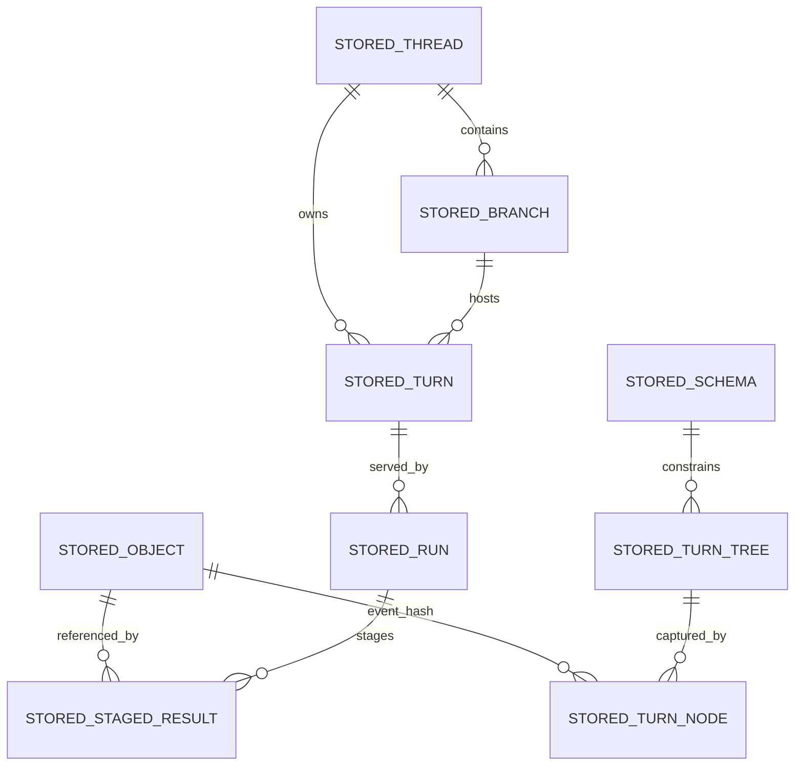

# Technical Specification

## 0. Version History & Changelog
- v0.1.0 - Initial TechSpec draft establishing the accepted baseline decisions, open kernel decisions, Kraken-owned persistence abstraction, bridge-first provider posture, and updated structured-output contracts.

## 1. Stack Specification (Bill of Materials)
- **Primary Language / Runtime:** TypeScript 6.0.2 is the accepted baseline for the framework layer and for initial implementation work. The Kernel implementation language remains open; Rust is the leading native-core candidate.
- **Primary Frameworks / Libraries:** `ai@6.0.141` and `@ai-sdk/provider@3.0.8` for the Vercel AI SDK bridge; `@langchain/core@1.1.38` for the LangChain bridge; `ajv@8.18.0` for JSON Schema validation; `@biomejs/biome@2.4.10` configured to follow the Ultracite standards profile; `tsup@8.5.1` for TypeScript package builds.
- **State Stores / Persistence:** Kraken-owned persistence abstraction first. Built-in in-memory backend first for development and contract validation. At least one fully conformant persisted backend is still required before Kraken can claim the PRD's durable-runtime guarantees; the concrete persisted backend remains an open decision rather than a baked-in product truth.
- **Infrastructure / Tooling:** Bun workspaces for local development, package management, and tests; root TypeScript project references; `tsup` for package builds; structured JSON logging; environment-variable based provider credentials at bridge boundaries.
- **Testing / Quality Tooling:** `bun test`, `tsc --noEmit`, Biome via Ultracite conventions, golden event-sequence tests, persistence-contract test suites shared across backends, bridge contract fixtures for AI SDK and LangChain adapters.
- **Version Pinning / Compatibility Policy:** Toolchain and bridge dependencies are pinned to exact versions in `package.json` and `bun.lock`. Public package APIs follow semantic versioning. Backend-specific persistence migrations are forward-only within each concrete backend implementation.

### 1.1 Stack Posture
- **Accepted baseline:** TypeScript-first implementation for the framework layer and for early project acceleration.
- **Accepted portability goal:** Core TypeScript packages should be usable from Bun, Node.js, and Deno without changing Kraken semantics. React Native compatibility is a design consideration, not a v0.1 guarantee.
- **Accepted constraint:** ESM-only for TypeScript packages in the JS-facing implementation path.
- **Open P0 decision:** Whether the Kernel starts in TypeScript as a baseline implementation or begins immediately as a native Rust core exposed through FFI.
- **Open P0 decision:** Which persisted backend becomes the first fully conformant durability implementation for Kraken.
- **Accepted principle:** No concrete storage product defines Kraken’s persistence model. Backends are implementations of a Kraken-owned contract.

### 1.2 Selection Notes
- Bun is not treated as the mandatory runtime for all consumers. It is the development and build baseline because your repo instructions explicitly prefer it, but the framework-facing TypeScript packages must avoid unnecessary Bun-only APIs.
- The LangChain and AI SDK bridge packages may have narrower runtime support than the core packages. Runtime portability applies primarily to `types`, `kernel-contract`, `kernel-memory`, `framework`, and `stream-*` packages.
- Official provider SDKs are intentionally not part of the baseline bridge strategy.

## 2. Architecture Decision Records (ADRs)
### ADR-001 TypeScript-First Baseline, Kernel Language Still Open
- **Status:** accepted
- **Context:** The project is starting from scratch and needs a practical implementation baseline. At the same time, the Kernel is intentionally language-agnostic and may later benefit from a native implementation.
- **Decision:** Use TypeScript 6.0.2 as the accepted baseline for the framework layer and for initial implementation work. Keep the Kernel implementation language explicitly open, with Rust as the leading native-core candidate if native leverage becomes compelling.
- **Consequences:** Early implementation work can begin quickly in one language, but the TechSpec must not pretend that this settles the long-term Kernel language. Kernel interfaces must remain explicit enough to support a future Rust FFI path.

### ADR-002 JavaScript Runtime Portability Is a Product Requirement for Core TS Packages
- **Status:** accepted
- **Context:** Kraken is intended to be meaningfully agnostic where it can be. The framework layer should not accidentally become Bun-only just because Bun is the preferred local tooling and runtime baseline.
- **Decision:** Core TypeScript packages must target portable ESM and avoid unnecessary Bun-specific APIs. Bun remains the local development baseline, but the intended compatibility surface for core packages is Bun, Node.js, and Deno.
- **Consequences:** Runtime-specific conveniences must stay behind adapters. Tests and packaging must verify that the core packages do not depend on Bun-only primitives. Some bridge packages may remain runtime-specific, which is acceptable if clearly documented.

### ADR-003 Ship as a Modular Monorepo, Not as Multiple Services
- **Status:** accepted
- **Context:** The architecture is explicitly modular, but the project posture is still solo-dev-friendly and library-first.
- **Decision:** Realize the approved logical containers as packages in one monorepo rather than as separate deployable services.
- **Consequences:** Boundary discipline is preserved without adding network, deployment, or service-coordination overhead. A later move to out-of-process components remains possible because the package boundaries stay explicit.

### ADR-004 Kraken-Owned Persistence Abstraction Comes Before Any Opinionated Backend
- **Status:** accepted
- **Context:** The updated Kernel specification now defines storage in terms of behavioral guarantees instead of naming or implying a preferred storage product.
- **Decision:** The first persistence artifact is a Kraken-owned backend contract that expresses the required guarantees and operations. The built-in in-memory implementation is for early development, semantic prototyping, and non-persistent contract testing. The first fully conformant persisted backend remains intentionally undecided. SQLite, PostgreSQL, Supabase, Appwrite, MySQL, or other options are candidates, but none is yet treated as Kraken's default truth.
- **Consequences:** The TechSpec cannot collapse Kraken persistence into SQLite schema design. Backend-specific schemas, migrations, and optimizations must sit behind the contract. The in-memory backend is useful immediately, but it cannot by itself satisfy the PRD and Kernel durability promises.

### ADR-005 First Provider Integrations Use Bridge Packages, Not Official Provider SDK Dependencies
- **Status:** accepted
- **Context:** You explicitly want the early provider effort to focus on bridges through the Vercel AI SDK and LangChain rather than on first-class provider packages or official provider SDK dependencies.
- **Decision:** Initial provider integration packages are `provider-bridge-ai-sdk` and `provider-bridge-langchain`. The Kraken provider abstraction is owned by Kraken. Official provider SDKs are avoided in the baseline bridge packages.
- **Consequences:** Early provider coverage can expand faster through bridge ecosystems. Kraken retains control of its own provider contract. First-class provider packages remain possible later, but they are not the initial focus.

### ADR-006 Library-First Host Contract
- **Status:** accepted
- **Context:** The architecture defines the host boundary as an embedding surface, not a mandated network API.
- **Decision:** The primary public surface is a TypeScript library contract centered on `KrakenRuntime`, `ExecutionHandle`, typed events, and backend/provider ports. Protocol adapters remain secondary packages.
- **Consequences:** Kraken stays transport-agnostic and embeddable. HTTP, WebSocket, CLI, and editor integrations are built on the library contract instead of redefining runtime semantics.

### ADR-007 TypeScript Tooling Uses Biome with Ultracite Conventions and tsup
- **Status:** accepted
- **Context:** You explicitly prefer Ultracite-style code standards through Biome and prefer `tsup` for the TypeScript build process.
- **Decision:** Use Biome as the formatter/linter engine, configured to follow Ultracite-aligned standards, and use `tsup` for package builds.
- **Consequences:** TypeScript-side code style and build behavior are no longer generic defaults. Generated config and package scripts must match this preference.

### ADR-008 Kernel Structural Sharing Model Is Still Open
- **Status:** proposed
- **Context:** The initial draft picked a path-granular `path_states` storage model too early. The correct decision depends on the Kraken-owned persistence contract and on how backend-neutral structural sharing should be.
- **Decision:** Do not lock the implementation to a `path_states` model yet. Carry forward three viable options:
  - path-granular structural sharing
  - chunked path segments for large ordered collections
  - more generic Merkle fragment/subtree representation
- **Consequences:** The TechSpec must describe the semantic contract for TurnTree sharing without overcommitting to one physical realization before that choice is approved.

### ADR-009 Canonical Serialization and Hashing Strategy Is Still Open
- **Status:** proposed
- **Context:** The initial draft overcommitted to RFC 8785 canonical JSON plus SHA-256 without first confirming whether Kraken records should always be treated as JSON-shaped structured data.
- **Decision:** Keep the hashing contract explicit but defer the concrete canonicalization strategy. Current candidates:
  - raw bytes for binary objects plus RFC 8785 canonical JSON for structured records
  - canonical CBOR for structured records
  - custom canonical binary framing if native-kernel concerns dominate
  Hashing candidates remain SHA-256 and BLAKE3 unless later analysis expands the set.
- **Consequences:** The Kernel implementation must keep a clear “bytes to hash” boundary. A later approval is required before concrete durable identity code is finalized.

### 2.1 Compatibility Record
- **Public package compatibility:** Breaking changes to exported library contracts require a semver-major release.
- **Canonical event compatibility:** New event types or optional fields may be introduced in minor releases; changes to existing event semantics are semver-major.
- **Persistence compatibility:** The backend contract is stable across implementations. Each concrete persisted backend owns its own migration policy and versioning.
- **Bridge compatibility:** AI SDK and LangChain bridge package upgrades may happen in minor releases only if the Kraken-owned contracts remain unchanged and bridge contract tests still pass.

## 3. State & Data Modeling
### 3.1 Canonical Persistence Model
- **Purpose:** Define the Kraken-owned persistence surface independent of any specific backend product.
- **Storage Shape:** Backend-neutral canonical entities with explicit IDs, hashes, lineage pointers, and state relationships. The first built-in implementation is in-memory for development. A separate persisted backend must later implement the same contract in order to satisfy Kraken's full durability requirements.
- **Constraints / Invariants:**
  - Object identity is immutable and content-addressed.
  - TurnNode lineage is append-only.
  - One Branch has exactly one active Head.
  - At most one `running` or `paused` Run may exist per Branch.
  - Staged results are durable at the backend-contract level before checkpoint consumption.
  - A backend must expose atomic semantics for `staging.stage`, checkpoint transactions, and backward branch archival.
- **Indexes / Access Paths:**
  - by `hash` for objects, TurnTrees, TurnNodes
  - by `schemaId`
  - by `threadId`, `branchId`, `turnId`, `runId`
  - by `previousTurnNodeHash` for lineage walks
  - by `(runId, taskId)` for staged-result recovery
- **Migration Notes:** The in-memory backend has no persisted migration surface. Persisted backends must ship forward-only migration strategies local to their own packages and may not redefine Kraken semantics.

#### Canonical Entity Shapes
- `StoredObject`
  - `hash: string`
  - `mediaType: string`
  - `bytes: Uint8Array`
  - `byteLength: number`
  - `createdAt: number`
- `StoredSchema`
  - `schemaId: string`
  - `schema: TurnTreeSchema`
  - `createdAt: number`
- `StoredTurnTree`
  - `hash: string`
  - `schemaId: string`
  - `pathValues: Record<string, string[] | string | null>`
  - `createdAt: number`
- `StoredTurnNode`
  - `hash: string`
  - `previousTurnNodeHash: string | null`
  - `turnTreeHash: string`
  - `consumedStagedResults: StagedResult[]`
  - `schemaId: string`
  - `eventHash: string | null`
  - `createdAt: number`
- `StoredThread`
  - `threadId: string`
  - `schemaId: string`
  - `rootTurnNodeHash: string`
  - `createdAt: number`
- `StoredBranch`
  - `branchId: string`
  - `threadId: string`
  - `headTurnNodeHash: string`
  - `archivedFromBranchId?: string`
  - `createdAt: number`
  - `updatedAt: number`
- `StoredTurn`
  - `turnId: string`
  - `threadId: string`
  - `branchId: string`
  - `parentTurnId: string | null`
  - `startTurnNodeHash: string`
  - `headTurnNodeHash: string`
  - `createdAt: number`
  - `updatedAt: number`
- `StoredRun`
  - `runId: string`
  - `turnId: string`
  - `branchId: string`
  - `schemaId: string`
  - `startTurnNodeHash: string`
  - `status: "running" | "paused" | "completed" | "failed"`
  - `currentStepIndex: number`
  - `stepSequence: StepDeclaration[]`
  - `createdTurnNodes: string[]`
  - `createdAt: number`
  - `updatedAt: number`
- `StoredStagedResult`
  - `runId: string`
  - `taskId: string`
  - `objectHash: string`
  - `objectType: string`
  - `status: "completed" | "failed" | "interrupted"`
  - `interruptPayload?: unknown`
  - `createdAt: number`



### 3.2 Built-In In-Memory Backend
- **Purpose:** Provide the first built-in implementation for early framework development, semantic prototyping, and non-persistent backend testing without coupling the project to a specific external store.
- **Storage Shape:** In-process maps keyed by canonical IDs and hashes, wrapped by a transaction coordinator that applies mutations atomically through copy-on-write snapshots.
- **Constraints / Invariants:**
  - One mutation coordinator serializes writes.
  - Each transaction operates on a cloned mutable snapshot and swaps it into the live state only on commit.
  - Failed transactions discard the staged snapshot entirely.
  - Reads after commit observe the new snapshot immediately.
  - This backend is intentionally non-durable across process restart and therefore is not a fully conformant persisted backend for the frozen Kernel storage guarantees.
- **Indexes / Access Paths:**
  - `Map<string, StoredObject>` by `hash`
  - `Map<string, StoredSchema>` by `schemaId`
  - `Map<string, StoredTurnTree>` by `hash`
  - `Map<string, StoredTurnNode>` by `hash`
  - `Map<string, StoredThread>` by `threadId`
  - `Map<string, StoredBranch>` by `branchId`
  - `Map<string, StoredTurn>` by `turnId`
  - `Map<string, StoredRun>` by `runId`
  - `Map<string, Map<string, StoredStagedResult>>` by `(runId, taskId)`
- **Migration Notes:** None. The in-memory backend is intentionally non-persistent.

### 3.3 Backend Implementation Contract
- **Purpose:** Define what any concrete backend package must implement to qualify as a Kraken backend.
- **Storage Shape:** Backend packages may use memory, relational storage, object storage, key-value stores, or coordinated multi-store designs so long as the observable contract is preserved.
- **Constraints / Invariants:**
  - No backend package may weaken the atomicity required by the Kernel spec.
  - No backend package may expose product-specific semantics into the Kernel surface.
  - Backends must pass the shared persistence-contract test suite unchanged.
- **Conformance note:** Persisted backends must pass the full persistence-contract suite, including restart durability. The built-in in-memory backend passes the semantic subset that excludes restart-durability assertions.
- **Product note:** An in-memory-only deployment is useful for development and test scenarios, but it must not be described as satisfying CAP-P0-001, CAP-P0-005, or CAP-P0-006.
- **Indexes / Access Paths:** Backend-specific, but must satisfy the canonical access paths listed in §3.1.
- **Migration Notes:** Each persisted backend package owns its own migration mechanism and version record.

```ts
export interface KrakenBackend {
  transact<T>(work: (tx: KrakenBackendTx) => Promise<T>): Promise<T>;
  health(): Promise<{ ok: true } | { ok: false; reason: string }>;
}

export interface KrakenBackendTx {
  objects: ObjectRepository;
  schemas: SchemaRepository;
  turnTrees: TurnTreeRepository;
  turnNodes: TurnNodeRepository;
  threads: ThreadRepository;
  branches: BranchRepository;
  turns: TurnRepository;
  runs: RunRepository;
  stagedResults: StagedResultRepository;
}
```

## 4. Interface Contract
### 4.1 Host-Facing Framework Library API
- **Style:** library API
- **Authentication / Authorization:** Not built into Kraken. Hosts authenticate and authorize callers before exposing runtime operations.
- **Compatibility Strategy:** Exported TypeScript package APIs follow semver. Additive fields and additive methods are minor-compatible.
- **Error model:** Typed `KrakenError` subclasses with stable `code` values. Runtime failures may also emit `error` events before terminal completion.

```ts
export interface KrakenRuntime {
  createThread(input: {
    threadId?: string;
    schemaId?: string;
    initialBranchId?: string;
  }): Promise<{
    threadId: string;
    branchId: string;
    rootTurnNodeHash: string;
    rootTurnTreeHash: string;
  }>;

  getThread(threadId: string): Promise<{
    threadId: string;
    schemaId: string;
    rootTurnNodeHash: string;
  } | null>;

  createBranch(input: {
    branchId?: string;
    threadId: string;
    fromTurnNodeHash: string;
  }): Promise<{
    branchId: string;
    threadId: string;
    headTurnNodeHash: string;
  }>;

  setBranchHead(input: {
    branchId: string;
    turnNodeHash: string;
  }): Promise<{
    branchId: string;
    headTurnNodeHash: string;
    archiveBranchId?: string;
  }>;

  executeTurn(input: {
    signal: InputSignal;
    threadId: string;
    branchId: string;
    schemaId?: string;
    config: AgentConfig;
    tools?: KrakenToolDefinition[];
    parentTurnId?: string | null;
  }): ExecutionHandle;
}

export interface ExecutionHandle {
  events(): AsyncIterable<KrakenStreamEvent>;
  cancel(): void;
  steer(signal: InputSignal): void;
  resolveApproval(response: ApprovalResponse): ExecutionHandle;
  status(): ExecutionStatus;
}
```

### 4.2 Kernel Boundary Contract
- **Style:** library API
- **Authentication / Authorization:** Internal-only contract used by framework packages and backend implementations.
- **Compatibility Strategy:** Internal monorepo contract. Breaking changes require synchronized kernel/framework changes.
- **Error model:** `KrakenError` with persistence, lineage, validation, and recovery codes.

```ts
export interface KrakenKernel {
  store: {
    put(blob: Uint8Array, mediaType?: string): Promise<string>;
    get(hash: string): Promise<Uint8Array | null>;
    has(hash: string): Promise<boolean>;
  };

  schema: {
    register(schema: TurnTreeSchema): Promise<string>;
    get(schemaId: string): Promise<TurnTreeSchema | null>;
  };

  tree: {
    create(
      schemaId: string,
      changes: Record<string, string[] | string | null>,
      baseTurnTreeHash?: string
    ): Promise<string>;
    incorporate(baseTurnTreeHash: string, stagedResults: StagedResult[]): Promise<string>;
    diff(treeHashA: string, treeHashB: string): Promise<string[]>;
    resolve(treeHash: string, path: string): Promise<string[] | string | null>;
    manifest(treeHash: string): Promise<Record<string, string[] | string | null>>;
  };

  thread: {
    create(threadId: string, schemaId: string, initialBranchId: string): Promise<ThreadCreateResult>;
    get(threadId: string): Promise<ThreadRecord | null>;
  };

  branch: {
    create(branchId: string, threadId: string, fromTurnNodeHash: string): Promise<BranchRecord>;
    get(branchId: string): Promise<BranchRecord | null>;
    setHead(branchId: string, turnNodeHash: string): Promise<SetHeadResult>;
    list(threadId: string): Promise<Array<{ branchId: string; headTurnNodeHash: string }>>;
  };

  run: {
    create(
      runId: string,
      turnId: string,
      branchId: string,
      schemaId: string,
      startTurnNodeHash: string,
      steps: StepDeclaration[]
    ): Promise<RunRecord>;
    beginStep(runId: string, stepId: string): Promise<StepContext>;
    completeStep(
      runId: string,
      stepId: string,
      eventHash?: string,
      observeResults?: ObserveResult[],
      treeHash?: string
    ): Promise<{ checkpointed: boolean; turnNodeHash?: string }>;
    complete(
      runId: string,
      status: "completed" | "failed" | "paused",
      eventHash?: string
    ): Promise<{ turnNodeHash?: string }>;
    recover(runId: string): Promise<RecoveryState>;
  };
}
```

### 4.3 Provider Bridge Contract
- **Style:** library API
- **Authentication / Authorization:** Credentials stay in bridge-specific configuration and environment resolution layers, never in persisted runtime state.
- **Compatibility Strategy:** The Kraken-owned provider contract remains stable while bridges adapt to AI SDK and LangChain changes.
- **Error model:** Bridge failures normalize into Kraken provider errors with bridge-specific diagnostic metadata.

```ts
export interface KrakenProvider {
  readonly id: string;
  generate(prompt: KrakenPrompt): Promise<KrakenModelResponse>;
  stream(prompt: KrakenPrompt): AsyncIterable<ProviderStreamChunk>;
}

export interface StructuredOutputRequest {
  schema: JSONSchema;
  name?: string;
  strict?: boolean;
}

export interface KrakenPrompt {
  messages: KrakenMessage[];
  tools?: RenderedToolDefinition[];
  config?: KrakenModelConfig;
  responseFormat?: StructuredOutputRequest;
}

export type ProviderStreamChunk =
  | { type: "text_delta"; text: string }
  | { type: "reasoning_delta"; text: string; signature?: string }
  | { type: "reasoning_done" }
  | { type: "structured_delta"; delta: string }
  | { type: "structured_done"; data: unknown; name?: string }
  | { type: "tool_call_start"; providerCallId: string; name: string }
  | { type: "tool_call_args_delta"; providerCallId: string; delta: string }
  | { type: "tool_call_done"; providerCallId: string; name: string; input: unknown }
  | {
      type: "finish";
      finishReason: "stop" | "tool_call" | "length" | "error" | "content_filter";
      usage?: { inputTokens: number; outputTokens: number };
      providerMetadata?: Record<string, unknown>;
    }
  | { type: "error"; error: unknown };
```

### 4.4 Canonical Event Stream Contract
- **Style:** library API
- **Authentication / Authorization:** Controlled by the host embedding layer.
- **Compatibility Strategy:** Existing event types and required fields are stable within a major version. Minor releases may add event types or optional fields.
- **Error model:** `error` events plus terminal `turn.end` state where applicable.

```ts
export interface EventSource {
  agent: string;
  workerId?: string;
  threadId?: string;
}

export type KrakenStreamEvent =
  | { type: "turn.start"; turnId: string; threadId: string; resumedFrom?: string; timestamp: string; source?: EventSource }
  | { type: "turn.end"; turnId: string; status: "completed" | "paused" | "failed"; timestamp: string; source?: EventSource }
  | { type: "iteration.start" | "iteration.end"; iterationCount: number; timestamp: string; source?: EventSource }
  | { type: "message.start"; messageId: string; role: "assistant"; timestamp: string; source?: EventSource }
  | { type: "text.delta"; messageId: string; delta: string; timestamp: string; source?: EventSource }
  | { type: "text.done"; messageId: string; text: string; timestamp: string; source?: EventSource }
  | { type: "reasoning.delta"; messageId: string; delta: string; timestamp: string; source?: EventSource }
  | { type: "reasoning.done"; messageId: string; timestamp: string; source?: EventSource }
  | { type: "structured.delta"; messageId: string; delta: string; timestamp: string; source?: EventSource }
  | { type: "structured.done"; messageId: string; data: unknown; name?: string; timestamp: string; source?: EventSource }
  | { type: "tool_call.start"; messageId: string; callId: string; name: string; timestamp: string; source?: EventSource }
  | { type: "tool_call.args_delta"; callId: string; delta: string; timestamp: string; source?: EventSource }
  | { type: "tool_call.done"; callId: string; name: string; input: unknown; timestamp: string; source?: EventSource }
  | { type: "message.done"; messageId: string; finishReason: "stop" | "tool_call" | "length" | "error" | "content_filter"; usage?: { inputTokens: number; outputTokens: number }; timestamp: string; source?: EventSource }
  | { type: "tool.start"; callId: string; name: string; input: unknown; timestamp: string; source?: EventSource }
  | { type: "tool.result"; callId: string; name: string; output: unknown; isError?: boolean; timestamp: string; source?: EventSource }
  | { type: "approval.requested"; request: ApprovalRequest; timestamp: string; source?: EventSource }
  | { type: "approval.resolved"; response: ApprovalResponse; timestamp: string; source?: EventSource }
  | { type: "steering.incorporated"; messageId: string; timestamp: string; source?: EventSource }
  | { type: "state.snapshot"; manifest: ContextManifest; timestamp: string; source?: EventSource }
  | { type: "state.checkpoint"; turnNodeHash: string; iterationCount: number; timestamp: string; source?: EventSource }
  | { type: "error"; error: { message: string; code?: string; details?: unknown }; fatal: boolean; timestamp: string; source?: EventSource }
  | { type: "custom"; name: string; data: unknown; timestamp: string; source?: EventSource };
```

## 5. Implementation Guidelines
### 5.1 Project Structure
```text
.
├── constitution/
│   ├── Architecture.md
│   ├── PRD.md
│   └── TechSpec.md
├── package.json
├── bun.lock
├── tsconfig.base.json
├── tsconfig.json
├── biome.jsonc
├── docs/
├── packages/
│   ├── types/
│   │   ├── src/
│   │   ├── test/
│   │   └── package.json
│   ├── kernel-contract/
│   │   ├── src/
│   │   ├── test/
│   │   └── package.json
│   ├── kernel-memory/
│   │   ├── src/
│   │   ├── test/
│   │   └── package.json
│   ├── constitution/
│   │   ├── src/
│   │   ├── test/
│   │   └── package.json
│   ├── provider-bridge-ai-sdk/
│   │   ├── src/
│   │   ├── test/
│   │   └── package.json
│   ├── provider-bridge-langchain/
│   │   ├── src/
│   │   ├── test/
│   │   └── package.json
│   ├── stream-core/
│   │   ├── src/
│   │   └── package.json
│   ├── stream-sse/
│   │   ├── src/
│   │   └── package.json
│   ├── stream-agui/
│   │   ├── src/
│   │   └── package.json
│   └── testkit/
│       ├── src/
│       └── package.json
├── examples/
│   └── playground-host/
│       ├── src/
│       └── package.json
└── scripts/
    ├── verify.ts
    ├── backend-contract.ts
    └── release-check.ts
```

### 5.2 Coding Standards
- **Formatting / Linting:** Use Biome configured to follow the Ultracite standards profile. Respect repo-local formatting settings rather than forcing a global style. Keep code explicit, type-safe, and maintainable.
- **Build Tooling:** Use `tsup` for TypeScript package builds. Core packages emit ESM-first builds. Any compatibility outputs are adapter-specific and must not reintroduce CommonJS into core package design.
- **TypeScript Settings:** 
  - `"strict": true`
  - `"module": "esnext"`
  - `"moduleResolution": "bundler"`
  - `"target": "es2025"`
  - explicit `"rootDir"` per package
  - explicit `"types"` arrays where runtime globals are required
- **Testing Expectations:**
  - Unit tests for pure logic in `types`, `kernel-contract`, `kernel-memory`, and `framework`
  - Shared persistence-contract tests that every backend implementation must pass
  - Golden event-sequence tests including structured output events
  - Bridge contract tests for the AI SDK and LangChain integrations
  - Runtime portability tests for core packages at minimum on Bun and Node; Deno compatibility tests added as soon as package surface stabilizes
- **Observability Hooks:**
  - Structured logger interface injected at runtime boundaries
  - Event tee support for tests and host adapters
  - Stable metric names for turn count, iteration count, provider latency, tool latency, checkpoint count, and recovery count
- **Migration / Deployment Notes:**
  - The in-memory backend requires no migrations and is not a persisted production backend
  - Persisted backend packages must ship their own migration runners
  - No runtime may silently weaken backend guarantees below the Kernel storage contract
- **Performance / Capacity Notes:**
  - Context decisions should rely on `ContextManifest`, not repeated history scans
  - Bridge packages must keep provider-native details out of the core hot path
  - Backends should support hash-only traversal for diff, lineage, and manifest operations where full object loads are unnecessary

### 5.3 Documentation Drift Prevention
- `constitution/PRD.md`, `constitution/Architecture.md`, and `constitution/TechSpec.md` remain the authoritative governing artifacts for product, architecture, and implementation posture and must be updated whenever scope, logical architecture, or implementation posture changes materially.
- New backend implementations require an update to the backend matrix and persistence-contract documentation.
- New public package contracts require matching examples or tests in `examples/playground-host` or `packages/testkit`.

### 5.4 Initial Build Sequence
1. Create workspace scaffolding and root Bun/TypeScript/tsup/Biome configuration.
2. Implement `packages/types` with canonical runtime types, including structured output.
3. Implement `packages/kernel-contract` with backend-neutral persistence interfaces and shared contract tests.
4. Implement `packages/kernel-memory` as the built-in backend for development and semantic contract tests.
5. Implement `packages/framework` against the kernel contract and provider contract.
6. Select and implement the first persisted backend that can satisfy the full Kernel storage contract.
7. Implement `provider-bridge-ai-sdk` and `provider-bridge-langchain`.
8. Implement stream adapter packages and the playground host.
9. Revisit the open P0 decisions around native Kernel posture, structural sharing, and canonical serialization before locking the long-term backend strategy.
