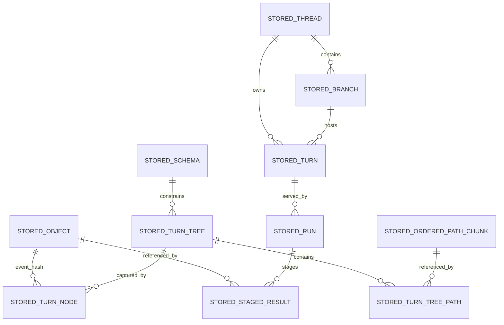

# Technical Specification

## 0. Version History & Changelog

- v0.5.6 - Added the playground-owned aimock OpenAI E2E validation lane, using `@copilotkit/aimock@1.15.1` plus `@ai-sdk/openai@3.0.53` to exercise streamed text, structured output, tool continuation, approval pause/resume, provider metadata, cancellation, provider failure, malformed responses, and unmatched fixtures across an actual local HTTP provider boundary without real provider credentials.
- v0.5.5 - Closed Epic Q in current repo reality, adding provider/framework testkits, release and portability tooling, the checked-in portability matrix, and the final release-hardening closure inventory.
- v0.5.4 - Closed `KRT-Q001` in current repo reality, added the Epic Q hardening gap inventory, and anchored the remaining testkit, release, and portability work to that inventory instead of leaving it implicit.
- v0.5.3 - Closed Epic P in current repo reality, adding the private playground host harness, recording Node-backed SQLite reload validation, and preserving AG-UI projection for complete turn lifecycles while canonical/SSE handle approval continuation fragments.
- v0.5.2 - Closed Epic O in current repo reality, pinning the AG-UI adapter to `@ag-ui/core@0.0.52`, tightening the AG-UI adapter surface to the official `AGUIEvent` union, and recording tee-based host fanout as the sanctioned multi-consumer path when all required branches subscribe before the first pull.
- v0.5.1 - Closed Epic N in current repo reality, correcting the AI SDK bridge baseline to the stable `ProviderStreamChunk` seam, synthesizing structured output from JSON text, and explicitly deferring streamed files and provider-owned tool governance.
- v0.5.0 - Activated the post-ReAct implementation line, locking the AI SDK bridge baseline to `LanguageModelV3` and defining sequential Epics N-Q for provider bridge, stream adapters, playground host, and release hardening.
- ... [Older history truncated, refer to git logs]

## 1. Stack Specification (Bill of Materials)

- **Primary Language / Runtime:** TypeScript `6.0.2` is the first authoritative implementation language for the framework and kernel protocol implementation. The kernel protocol remains language-neutral by contract. Core TypeScript packages target portable ESM across Bun, Node.js, and Deno. Bun remains the preferred local development runtime and package manager.
- **Primary Frameworks / Libraries:** `ai@6.0.142` and `@ai-sdk/provider@3.0.8` for the baseline AI SDK Providers bridge, using the `LanguageModelV3` / `ProviderV3` surface only in the baseline bridge; `@ag-ui/core@0.0.52` for the baseline AG-UI event union and runtime validation surface; `ajv@8.18.0` for JSON Schema validation; `cbor-x@1.6.4` for deterministic CBOR encoding and decoding in the TypeScript implementation; `@biomejs/biome@2.4.10` for formatting and linting; `tsup@8.5.1` for package builds.
- **State Stores / Persistence:** Tuvren Runtime uses a Kraken-owned backend contract first. `@tuvren/backend-memory` is the reference development and semantic test backend. `@tuvren/backend-sqlite` is the first officially supported persistent backend adapter. Future backends such as PostgreSQL, MySQL/MariaDB, and MongoDB are peer adapters against the same kernel contract, not SQLite-shaped variants.
- **Infrastructure / Tooling:** `devenv` for reproducible development environments, `nx@22.6.3` plus aligned `@nx/*` packages for TypeScript project orchestration, Bun workspaces, root TypeScript project references, `tsup` package builds, structured JSON logging, exact dependency pinning in `package.json` plus `bun.lock`, and environment-variable-based provider credentials at bridge boundaries.
- **Testing / Quality Tooling:** `bun test`, `tsc --noEmit`, Biome, deterministic CBOR golden-byte tests, hash identity fixtures, shared backend conformance suites, checkpoint/recovery scenario tests, AI SDK bridge contract fixtures, and private playground-owned E2E validation through `@copilotkit/aimock@1.15.1` plus `@ai-sdk/openai@3.0.53` against a local OpenAI-compatible mock server for success, control, and provider-failure paths.
- **Version Pinning / Compatibility Policy:** Versions named in this TechSpec are authoritative for the baseline implementation line and must match the repository manifests. Public package APIs follow semantic versioning. Changes to kernel record encoding, hash algorithm, or durable identity rules are semver-major.

### 1.1 Implementation Posture

- **Authoritative center:** The kernel boundary is a protocol of serializable data, not an in-process callback API.
- **First implementation choice:** TypeScript is the first authoritative implementation of that protocol for speed of validation, not a claim that the kernel is fundamentally JavaScript-bound.
- **Portability posture:** Core packages stay runtime-portable where practical; backend packages and provider bridges may have narrower runtime support when their dependencies require it.
- **Framework posture:** The framework layer is driver-oriented. Shared framework contracts and runtime services stay driver-neutral where practical, while concrete execution semantics live in driver implementations.
- **Initial driver posture:** The first production-depth driver is the ReAct Driver. It is the baseline implementation, not the whole framework ontology.
- **Provider posture:** Tuvren Runtime owns the canonical provider contract, while Kraken supplies the engine semantics behind it. The baseline bridge surface is AI SDK Providers only. LangChain is intentionally out of baseline scope. First-class Tuvren-scoped provider packages for major providers are expected later.
- **Backend posture:** All official backends implement one strict kernel-visible contract. Backend-specific optimizations may exist internally, but they must not change kernel semantics or require capability negotiation at the kernel layer in v0.1.

### 1.2 Current-State vs Target-State

- **Current repository reality:** The repository already contains the workspace scaffold, `@tuvren/core-types`, `@tuvren/kernel-protocol`, `@tuvren/backend-memory`, `@tuvren/backend-sqlite`, `@tuvren/kernel-testkit`, `@tuvren/runtime-api`, `@tuvren/driver-api`, `@tuvren/event-stream`, `@tuvren/tool-contracts`, `@tuvren/provider-api`, `@tuvren/runtime-core`, the ReAct Driver baseline with implementation-proven loop completion, streaming/provider semantics, and shared runtime-core tool/approval integration, `@tuvren/provider-bridge-ai-sdk` as the first concrete provider bridge, the host stream adapter line `@tuvren/stream-core`, `@tuvren/stream-sse`, and `@tuvren/stream-agui`, the private playground host harness `@tuvren/playground-host`, a playground-owned aimock/OpenAI E2E validation lane for the local provider HTTP boundary, the hardening testkits `@tuvren/provider-testkit` and `@tuvren/framework-testkit`, release and portability scripts under `tools/scripts`, the checked-in Epic Q portability matrix, and the Epic Q release-hardening closure inventory.
- **Target implementation state:** The package layout and interfaces defined below are the intended implementation target for the first authoritative code line.
- **Drift rule:** The future codebase must conform to this TechSpec. The TechSpec must not be treated as a loose commentary on whatever structure happens to emerge.

## 2. Architecture Decision Records (ADRs)

### ADR-001 The Kernel Boundary Is Protocol-First and Data-Only

- **Status:** accepted
- **Context:** The frozen kernel specification explicitly defines the kernel-framework boundary as a protocol where everything crossing the boundary is serializable data. Future multi-language SDKs and future non-TypeScript kernel implementations depend on preserving this narrow waist.
- **Decision:** The authoritative kernel boundary is a language-neutral protocol of concrete data structures and operations. No callbacks, framework types, or runtime-specific object identities cross the boundary.
- **Consequences:** The TechSpec must define exact record shapes, byte encoding, hashing, and operation signatures. TypeScript APIs above the kernel are framework SDK surfaces, not substitutes for the kernel protocol.

### ADR-002 TypeScript Is the First Authoritative Implementation, Not the Long-Term Kernel Monopoly

- **Status:** accepted
- **Context:** The project needs a fast path to validating the kernel and framework semantics, but the protocol must remain suitable for future Rust, Wasm, or other implementations.
- **Decision:** Use TypeScript `6.0.2` for the first authoritative implementation of the framework and kernel protocol. Treat it as the reference implementation of the protocol, not as a license to collapse protocol boundaries into JavaScript-only assumptions.
- **Consequences:** The implementation can progress quickly, while future Rust or Wasm implementations remain possible if they pass the same protocol fixtures and semantic test suites.

### ADR-003 Ship as a Modular Monorepo of Boundary-Owned Projects, Not as Multiple Services

- **Status:** accepted
- **Context:** The architecture is explicitly modular but intentionally in-process and solo-developer-friendly.
- **Decision:** Realize the approved logical containers as projects in one monorepo, grouped first by architectural boundary and then by contract versus implementation, rather than as separate deployable services.
- **Consequences:** Boundary discipline is preserved without adding network topology, deployment orchestration, or remote protocol complexity before it is justified. The repository structure mirrors the architecture docs instead of centering JavaScript package-manager conventions.

### ADR-004 The Framework Public Surface Remains Library-First and Driver-Neutral

- **Status:** accepted
- **Context:** Tuvren Runtime is a framework product for developers to embed, while Kraken remains the engine identity behind it. The architecture’s host boundary is an embedding surface.
- **Decision:** The primary TypeScript framework surface remains a library API centered on `TuvrenRuntime`, `ExecutionHandle`, typed events, driver selection, provider ports, and backend ports.
- **Consequences:** HTTP, WebSocket, CLI, editor, and protocol adapters are secondary packages layered over the library API. This does not weaken the protocol-first kernel boundary because the library surface sits above it, and it prevents the first driver from becoming the only host-facing abstraction.

### ADR-005 The Baseline Provider Strategy Is Tuvren Provider Contract Plus AI SDK Providers Bridge

- **Status:** accepted
- **Context:** The framework owns the canonical provider contract. Supporting multiple bridge ecosystems before the core runtime is proven would add translation surface and semantic drift for little value.
- **Decision:** The baseline provider integration package is `@tuvren/provider-bridge-ai-sdk`, built on `ai@6.0.142` and `@ai-sdk/provider@3.0.8`. The baseline bridge adapts `LanguageModelV3` and `ProviderV3` only. `LanguageModelV2` compatibility, AI SDK agent loops, AI SDK UI message protocols, LangChain bridges, and first-class Tuvren-scoped provider packages are deferred.
- **Consequences:** The initial provider surface stays narrow and Tuvren-scoped while preserving Kraken engine semantics internally. The bridge treats AI SDK as a provider/model source, not as the runtime loop, tool governance layer, host protocol, or durable state owner. Future packages such as `@tuvren/provider-openai`, `@tuvren/provider-anthropic`, and `@tuvren/provider-google` can be added later without redefining the framework contract.

### ADR-006 Official Backends Use One Strict Uniform Kernel Contract

- **Status:** accepted
- **Context:** Tuvren Runtime is a framework product, not a storage product. Developers must be able to move between backends without kernel-semantic drift.
- **Decision:** All official backends implement one strict kernel contract. Optional backend capabilities are not exposed at the kernel layer in v0.1.
- **Consequences:** Shared backend conformance suites remain authoritative. Backend-specific performance tricks stay internal. The framework and future SDKs do not branch on backend feature flags.

### ADR-007 Memory and SQLite Are the Official Initial Backends

- **Status:** accepted
- **Context:** The project needs a usable development backend immediately and a usable persistent backend package without pretending that one backend defines Kraken’s ontology.
- **Decision:** `@tuvren/backend-memory` is the reference non-persistent backend for development and semantic testing. `@tuvren/backend-sqlite` is the first officially supported persistent backend adapter.
- **Consequences:** SQLite is the first official persistent implementation, but not the canonical physical model for all future backends. PostgreSQL, MySQL/MariaDB, MongoDB, and others remain peer adapters against the same kernel contract.

### ADR-008 Structured Kernel Records Use Deterministic CBOR and Opaque Objects Hash Raw Bytes

- **Status:** accepted
- **Context:** Kernel identity needs a compact, deterministic, multi-language-friendly encoding. Canonical JSON is human-readable, but it carries JSON number and ECMAScript canonicalization constraints that are not ideal for durable kernel identity.
- **Decision:** Structured kernel records are encoded as deterministic CBOR before hashing. Opaque stored objects are hashed from raw bytes without re-encoding.
- **Consequences:** The kernel’s identity format is binary, deterministic, and language-neutral. JSON remains a debugging, export, and tooling format, not the canonical storage identity format.

### ADR-009 SHA-256 Is the Canonical Hash Algorithm

- **Status:** accepted
- **Context:** Durable identity must work cleanly across TypeScript, Python, Go, Rust, Bun, Node.js, Deno, and edge/Wasm-friendly environments with minimal dependency friction.
- **Decision:** Kraken uses SHA-256 as the canonical hash algorithm for both opaque object bytes and deterministic-CBOR structured records.
- **Consequences:** Hash identity uses ubiquitous primitives available in WebCrypto and standard libraries. Faster alternatives such as BLAKE3 are intentionally not used for canonical identity in v0.1.

### ADR-010 Core Kernel Records Use a Restricted Integer-Oriented Data Model

- **Status:** accepted
- **Context:** Cross-language deterministic encoding gets riskier when floats, tags, and broad dynamic types are allowed into core kernel records.
- **Decision:** Core kernel records are restricted to maps with string keys, arrays, text, byte strings, booleans, nulls, and integers. Floating-point values are not allowed in normative kernel records. Persisted timestamps are signed Unix epoch millisecond integers.
- **Consequences:** Deterministic CBOR encoding remains simple and predictable. Float-bearing data, if ever needed, must live in opaque objects, extension state, or higher-layer provider/application payloads, not in core kernel records.

### ADR-011 TurnTree Storage Is Path-Granular with Threshold-Based Chunking for Ordered Paths

- **Status:** accepted
- **Context:** The kernel contract is expressed in path values, not in generic subtree fragments. Ordered paths such as `messages` can grow large enough that flat rewrites become expensive, but a fully generic Merkle-fragment engine would overfit the problem.
- **Decision:** TurnTree semantics remain path-granular. Ordered paths are logically `Hash[]`; single paths are logically `Hash | null`. Internally, ordered paths start flat and may promote to append-optimized fixed-size chunked storage after crossing an implementation-defined threshold. Chunking is invisible at the protocol layer.
- **Consequences:** The public model stays simple while long ordered paths avoid pathological rewrite amplification. Numeric threshold and chunk-size values remain implementation constants, not protocol constants.

### ADR-012 TypeScript Tooling Uses Biome and tsup

- **Status:** accepted
- **Context:** The project explicitly prefers Bun-based workflows, Biome, and `tsup`.
- **Decision:** Use `@biomejs/biome@2.4.10` for linting and formatting and `tsup@8.5.1` for package builds.
- **Consequences:** The implementation posture is no longer ambiguous or tool-default-driven. Config, scripts, and examples must reflect this choice directly.

### ADR-013 Workspace Orchestration Uses devenv and Nx

- **Status:** accepted
- **Context:** The project explicitly fixed `devenv + nx` as non-negotiable workspace tooling and the repository now uses a boundary-grouped architecture-first layout.
- **Decision:** Use `devenv` as the reproducible developer environment entry point and pin `nx@22.6.3` with aligned `@nx/workspace@22.6.3` and `@nx/js@22.6.3` for orchestration of the TypeScript subtree.
- **Consequences:** Environment pinning lives in Nix/devenv configuration rather than npm manifests alone. Nx project orchestration is first-class, but limited to the TypeScript subtree and does not define the overall repository ontology.

### ADR-014 The Framework Is Driver-Oriented and ReAct Is the Initial Driver

- **Status:** accepted
- **Context:** The architecture now distinguishes shared framework services from concrete execution models. The current behavioral specification is strongly ReAct-shaped, but the product must support future workflow-oriented drivers over the same durable runtime foundation.
- **Decision:** Implement the framework as shared contracts plus shared runtime services, with concrete drivers as explicit implementation packages. The first driver is the ReAct Driver.
- **Consequences:** Package structure, task planning, and future implementation sequencing must separate shared framework logic from driver-specific logic. Future drivers can be added without redefining the kernel, host API, or provider-neutral content model.

### 2.1 Compatibility Record

- **Kernel identity compatibility:** Changes to deterministic CBOR profile, SHA-256 usage, hash string representation, or durable record shapes are semver-major.
- **Framework public API compatibility:** Breaking changes to exported TypeScript library contracts require a semver-major release.
- **Driver compatibility:** Changes to shared driver-selection semantics or driver-neutral framework contracts are semver-major; adding a new driver is semver-minor unless it changes existing shared contracts.
- **Backend compatibility:** All official backends must preserve the same kernel semantics. Physical schemas may differ by backend.
- **Provider compatibility:** AI SDK bridge upgrades may happen in minor releases only if the Tuvren-owned provider contract remains unchanged and contract fixtures still pass. Baseline AI SDK bridge compatibility is anchored to `LanguageModelV3`; adding `LanguageModelV2` compatibility later is additive only if it does not widen or weaken the Tuvren-owned provider contract.

## 3. State & Data Modeling

### 3.1 Canonical Kernel Record Profile

- **Purpose:** Define the durable data profile that all kernel implementations and backends must preserve.
- **Storage Shape:** Structured kernel records are deterministic CBOR maps with string keys. Opaque objects remain raw bytes plus media type metadata.
- **Constraints / Invariants:**
  - Hashes are lowercase hex-encoded SHA-256 digests.
  - Core kernel records do not use floating-point values.
  - Persisted timestamps are signed Unix epoch milliseconds.
  - Core kernel records do not use CBOR indefinite lengths.
  - Core kernel records do not use CBOR tags in v0.1.
  - TypeScript implementations must reject `NaN`, `Infinity`, non-safe integers, and non-canonical record shapes before persistence.
- **Indexes / Access Paths:** Hash-addressable records for all immutable entities; lineage walks by `previousTurnNodeHash`; run-scoped staging by `(runId, taskId)`.
- **Migration Notes:** Record profile changes are protocol changes and therefore semver-major.

#### Primitive Aliases

- `HashString`
  - lowercase hex string of a 32-byte SHA-256 digest
- `EpochMs`
  - signed integer Unix epoch milliseconds
- `KernelRecord`
  - deterministic-CBOR-encodable value using the restricted profile above

### 3.2 Canonical Entity Shapes

- **Purpose:** Define the exact logical records the TypeScript implementation persists and hashes.
- **Storage Shape:** Immutable records encoded with deterministic CBOR unless the item is an opaque Object blob.
- **Constraints / Invariants:**
  - `StoredObject.bytes` are hashed as raw bytes.
  - Every other record below is hashed from deterministic CBOR bytes.
  - `schemaId`, `threadId`, `branchId`, `turnId`, `runId`, and `taskId` are opaque framework/kernel identifiers and are never derived from storage vendor internals.
  - `StoredTurnTree.manifestCbor` is the immutable cached full-manifest representation of the logical TurnTree. `StoredTurnTreePath` rows are the backend-side indexed path realization used for efficient `resolve`, `diff`, and ordered-path chunking. Both must always describe the same logical TurnTree.
- **Indexes / Access Paths:** As listed per entity below.
- **Migration Notes:** Field additions require explicit compatibility handling; field removals or semantic changes are semver-major.

#### Canonical Entity Definitions

- `StoredObject`
  - `hash: HashString`
  - `mediaType: string`
  - `bytes: Uint8Array`
  - `byteLength: number`
  - `createdAtMs: EpochMs`
- `StoredSchema`
  - `schemaId: string`
  - `schemaCbor: Uint8Array`
  - `createdAtMs: EpochMs`
- `StoredTurnTree`
  - `hash: HashString`
  - `schemaId: string`
  - `manifestCbor: Uint8Array`
  - `createdAtMs: EpochMs`
  - identity note: `hash` is derived from the logical tree identity tuple `{ schemaId, manifest }`, so identical manifests under different schemas never alias
- `StoredTurnTreePath`
  - `turnTreeHash: HashString`
  - `path: string`
  - `collectionKind: "single" | "ordered"`
  - `singleHash?: HashString | null`
  - `orderedEncoding?: "flat" | "chunked"`
  - `orderedCount?: number`
  - `orderedInlineCbor?: Uint8Array`
  - `orderedChunkListCbor?: Uint8Array`
- `StoredOrderedPathChunk`
  - `chunkHash: HashString`
  - `itemCount: number`
  - `itemsCbor: Uint8Array`
  - `createdAtMs: EpochMs`
  - identity note: `chunkHash` is derived from the deterministic-CBOR logical chunk item list represented by `itemsCbor`; `itemCount` and `createdAtMs` are not identity inputs
- `StoredTurnNode`
  - `hash: HashString`
  - `previousTurnNodeHash: HashString | null`
  - `turnTreeHash: HashString`
  - `consumedStagedResultsCbor: Uint8Array`
  - `schemaId: string`
  - `eventHash: HashString | null`
  - `createdAtMs: EpochMs`
  - identity note: `hash` is derived from the logical TurnNode fields excluding `hash` itself; stored metadata such as `createdAtMs` is not part of the logical TurnNode identity
- `StoredThread`
  - `threadId: string`
  - `schemaId: string`
  - `rootTurnNodeHash: HashString`
  - `createdAtMs: EpochMs`
- `StoredBranch`
  - `branchId: string`
  - `threadId: string`
  - `headTurnNodeHash: HashString`
  - `archivedFromBranchId?: string`
  - `createdAtMs: EpochMs`
  - `updatedAtMs: EpochMs`
- `StoredTurn`
  - `turnId: string`
  - `threadId: string`
  - `branchId: string`
  - `parentTurnId: string | null`
  - `startTurnNodeHash: HashString`
  - `headTurnNodeHash: HashString`
  - `createdAtMs: EpochMs`
  - `updatedAtMs: EpochMs`
- `StoredRun`
  - `runId: string`
  - `turnId: string`
  - `branchId: string`
  - `schemaId: string`
  - `startTurnNodeHash: HashString`
  - `status: "running" | "paused" | "completed" | "failed"`
  - `currentStepIndex: number`
  - `stepSequenceCbor: Uint8Array`
  - `createdTurnNodesCbor: Uint8Array`
  - `createdAtMs: EpochMs`
  - `updatedAtMs: EpochMs`
  - liveness note: the current implementation does not claim stale-`running` recovery from process death. Any implementation that makes that claim must extend `StoredRun` with execution-owner, lease-expiry, and fencing-token fields in the same change that adds kernel lease/preemption operations.
- `StoredStagedResult`
  - `runId: string`
  - `taskId: string`
  - `objectHash: HashString`
  - `objectType: string`
  - `status: "completed" | "failed" | "interrupted"`
  - `interruptPayloadCbor?: Uint8Array`
  - `createdAtMs: EpochMs`

#### Run Liveness Extension Gate

- **Purpose:** Define the required implementation delta before Tuvren Runtime can claim durable recovery of stale `running` Runs.
- **Storage Shape:** Leased Run ownership extends `StoredRun` with backend-neutral fields equivalent to `executionOwnerId`, `leaseExpiresAtMs`, `fencingToken`, and `preemptionReason`.
- **Constraints / Invariants:**
  - Lease renewal is compare-and-swap by current owner and fencing token.
  - Lease renewal is valid only for `running` Runs.
  - `paused` Runs are approval-owned and are not lease-expiry candidates.
  - Stale-running preemption atomically verifies expiry, preserves verifiable staged work through reactive checkpointing, marks the superseded Run `failed`, and returns recovery state for a replacement Run.
  - Replacement execution creates a new Run; stale Runs are never reopened.
- **Indexes / Access Paths:** Backends implementing the extension must provide active stale-run discovery by status and lease expiry, plus owner/token lookup for renewal.
- **Migration Notes:** This extension is not a SQLite-only change. Kernel protocol, framework recovery behavior, runtime configuration, backend repositories, validators, conformance tests, and physical schemas must move together.



### 3.3 TurnTree Physical Realization

- **Purpose:** Concretize how the first implementation realizes path-granular TurnTrees without changing the frozen protocol.
- **Storage Shape:** Path-granular manifests plus internal ordered-path chunk storage where needed.
- **Constraints / Invariants:**
  - The protocol-facing meaning of an ordered path is always `Hash[]`.
  - The protocol-facing meaning of a single path is always `Hash | null`.
  - Ordered paths begin as flat inline sequences.
  - Ordered paths may promote to chunked storage after crossing an implementation-defined threshold.
  - Promotion is invisible to callers of `tree.resolve()` and `tree.manifest()`.
  - Chunk storage is append-optimized, fixed-size, and uses whole-chunk structural sharing.
  - Threshold and chunk-size numeric values are implementation constants, not protocol constants.
- **Indexes / Access Paths:**
  - by `(turnTreeHash, path)` for path lookup
  - by `chunkHash` for chunk reuse
  - by `turnTreeHash` for manifest reconstruction
- **Migration Notes:** Physical chunk policy may evolve without changing the protocol so long as `tree.create`, `tree.incorporate`, `tree.resolve`, `tree.diff`, and `tree.manifest` preserve the same behavior.

### 3.4 Backend Adapter Model

- **Purpose:** Define what it means for a backend package to be an official Tuvren Runtime backend.
- **Storage Shape:** Each backend package is a concrete implementation of the kernel storage contract. Physical schema is backend-specific.
- **Constraints / Invariants:**
  - Every official backend implements the full kernel contract.
  - No official backend exposes kernel-visible optional capabilities in v0.1.
  - No official backend may weaken the kernel’s required atomicity, lineage, or recovery guarantees.
  - Backends may optimize internally, but optimization must not change semantics.
- **Conformance note:** Shared backend contract tests are the authority for semantic conformance.
- **Product note:** `@tuvren/backend-memory` is intentionally non-persistent and must not be described as satisfying the durable-runtime guarantees of the PRD or kernel spec.
- **Indexes / Access Paths:** Backend-specific, but all must satisfy the canonical access patterns named in §§3.1-3.3.
- **Migration Notes:** Each backend package owns its own migration mechanism and version history.

### 3.5 SQLite Backend Schema

- **Purpose:** Specify the first official persistent backend package concretely enough to implement without guesswork.
- **Storage Shape:** Embedded in-process SQLite database using WAL mode and `BEGIN IMMEDIATE` transactions for kernel writes.
- **Constraints / Invariants:**
  - Foreign keys enabled.
  - WAL mode enabled.
  - Kernel write transactions use `BEGIN IMMEDIATE` and commit atomically.
  - Normal kernel write transactions validate touched records, referenced records, active Branch/Run constraints, and required lineage proofs without reloading and validating the full database.
  - Full persisted-state validation belongs to explicit health and diagnostic paths.
  - SQLite may maintain backend-local validation indexes such as TurnNode lineage root/depth metadata; those indexes do not change canonical kernel record shapes.
  - The first SQLite backend implementation uses `better-sqlite3@12.8.0`.
  - Because of that binding choice, the first SQLite backend implementation targets Node.js runtimes with local filesystem access and native addon support.
  - SQLite backend is not an edge/serverless target in v0.1.
  - SQLite is the first official persistent backend, not the canonical physical model for all future backends.
- **Indexes / Access Paths:** Listed per table below.
- **Migration Notes:** Forward-only SQL migrations owned by `@tuvren/backend-sqlite`.

#### SQLite Tables

- `objects`
  - columns: `hash TEXT PRIMARY KEY`, `media_type TEXT NOT NULL`, `bytes BLOB NOT NULL`, `byte_length INTEGER NOT NULL`, `created_at_ms INTEGER NOT NULL`
  - indexes: primary key on `hash`
- `schemas`
  - columns: `schema_id TEXT PRIMARY KEY`, `schema_cbor BLOB NOT NULL`, `created_at_ms INTEGER NOT NULL`
  - indexes: primary key on `schema_id`
- `turn_trees`
  - columns: `hash TEXT PRIMARY KEY`, `schema_id TEXT NOT NULL`, `manifest_cbor BLOB NOT NULL`, `created_at_ms INTEGER NOT NULL`
  - foreign keys: `schema_id -> schemas(schema_id)`
  - indexes: primary key on `hash`, secondary on `schema_id`
- `turn_tree_paths`
  - columns: `turn_tree_hash TEXT NOT NULL`, `path TEXT NOT NULL`, `collection_kind TEXT NOT NULL`, `single_hash TEXT NULL`, `ordered_encoding TEXT NULL`, `ordered_count INTEGER NULL`, `ordered_inline_cbor BLOB NULL`, `ordered_chunk_list_cbor BLOB NULL`
  - primary key: `(turn_tree_hash, path)`
  - foreign keys: `turn_tree_hash -> turn_trees(hash)`
  - indexes: primary key, secondary on `(path, turn_tree_hash)`
- `ordered_path_chunks`
  - columns: `chunk_hash TEXT PRIMARY KEY`, `item_count INTEGER NOT NULL`, `items_cbor BLOB NOT NULL`, `created_at_ms INTEGER NOT NULL`
  - indexes: primary key on `chunk_hash`
- `turn_nodes`
  - columns: `hash TEXT PRIMARY KEY`, `previous_turn_node_hash TEXT NULL`, `turn_tree_hash TEXT NOT NULL`, `consumed_staged_results_cbor BLOB NOT NULL`, `schema_id TEXT NOT NULL`, `event_hash TEXT NULL`, `created_at_ms INTEGER NOT NULL`
  - foreign keys: `previous_turn_node_hash -> turn_nodes(hash)`, `turn_tree_hash -> turn_trees(hash)`, `schema_id -> schemas(schema_id)`, `event_hash -> objects(hash)`
  - indexes: primary key on `hash`, secondary on `previous_turn_node_hash`, `turn_tree_hash`
- `turn_node_lineage_roots`
  - backend-local validation index; not a canonical kernel record
  - columns: `turn_node_hash TEXT PRIMARY KEY`, `root_turn_node_hash TEXT NOT NULL`, `depth INTEGER NOT NULL`
  - foreign keys: `turn_node_hash -> turn_nodes(hash)`, `root_turn_node_hash -> turn_nodes(hash)`
  - indexes: primary key on `turn_node_hash`, secondary on `(root_turn_node_hash, depth)`
- `threads`
  - columns: `thread_id TEXT PRIMARY KEY`, `schema_id TEXT NOT NULL`, `root_turn_node_hash TEXT NOT NULL`, `created_at_ms INTEGER NOT NULL`
  - foreign keys: `schema_id -> schemas(schema_id)`, `root_turn_node_hash -> turn_nodes(hash)`
  - indexes: primary key on `thread_id`, unique secondary on `root_turn_node_hash`
- `branches`
  - columns: `branch_id TEXT PRIMARY KEY`, `thread_id TEXT NOT NULL`, `head_turn_node_hash TEXT NOT NULL`, `archived_from_branch_id TEXT NULL`, `created_at_ms INTEGER NOT NULL`, `updated_at_ms INTEGER NOT NULL`
  - foreign keys: `thread_id -> threads(thread_id)`, `head_turn_node_hash -> turn_nodes(hash)`, `archived_from_branch_id -> branches(branch_id)`
  - indexes: primary key on `branch_id`, secondary on `thread_id`, `head_turn_node_hash`, `archived_from_branch_id`
- `turns`
  - columns: `turn_id TEXT PRIMARY KEY`, `thread_id TEXT NOT NULL`, `branch_id TEXT NOT NULL`, `parent_turn_id TEXT NULL`, `start_turn_node_hash TEXT NOT NULL`, `head_turn_node_hash TEXT NOT NULL`, `created_at_ms INTEGER NOT NULL`, `updated_at_ms INTEGER NOT NULL`
  - foreign keys: `thread_id -> threads(thread_id)`, `branch_id -> branches(branch_id)`, `parent_turn_id -> turns(turn_id)`, `start_turn_node_hash -> turn_nodes(hash)`, `head_turn_node_hash -> turn_nodes(hash)`
  - indexes: primary key on `turn_id`, secondary on `thread_id`, `branch_id`, `parent_turn_id`, `(thread_id, branch_id, head_turn_node_hash)`
- `runs`
  - columns: `run_id TEXT PRIMARY KEY`, `turn_id TEXT NOT NULL`, `branch_id TEXT NOT NULL`, `schema_id TEXT NOT NULL`, `start_turn_node_hash TEXT NOT NULL`, `status TEXT NOT NULL`, `current_step_index INTEGER NOT NULL`, `step_sequence_cbor BLOB NOT NULL`, `created_turn_nodes_cbor BLOB NOT NULL`, `created_at_ms INTEGER NOT NULL`, `updated_at_ms INTEGER NOT NULL`
  - foreign keys: `turn_id -> turns(turn_id)`, `branch_id -> branches(branch_id)`, `schema_id -> schemas(schema_id)`, `start_turn_node_hash -> turn_nodes(hash)`
  - indexes: primary key on `run_id`, secondary on `turn_id`, `branch_id`, `(branch_id, status)`
- `staged_results`
  - columns: `run_id TEXT NOT NULL`, `task_id TEXT NOT NULL`, `object_hash TEXT NOT NULL`, `object_type TEXT NOT NULL`, `status TEXT NOT NULL`, `interrupt_payload_cbor BLOB NULL`, `created_at_ms INTEGER NOT NULL`
  - primary key: `(run_id, task_id)`
  - foreign keys: `run_id -> runs(run_id)`, `object_hash -> objects(hash)`
  - indexes: primary key, secondary on `(run_id, status)`, `object_hash`

## 4. Interface Contract

### 4.0 Shared Error Foundation

- **Style:** shared cross-boundary TypeScript contract
- **Ownership:** `@tuvren/core-types` owns the shared error base class and category subclasses. Concrete packages own their package-specific `code` values and message text.
- **Compatibility Strategy:** `TuvrenError` shape, subclass names, and stable `code` values are semver-governed public API. Adding a new error subclass is semver-minor. Changing or removing an existing stable `code` is semver-major.
- **Code policy:** every `TuvrenError` carries a stable lowercase snake_case `code`. Category is conveyed by the subclass, not by a required string prefix.
- **Projection rule:** when errors cross logging, streaming, or host boundaries, implementations must preserve at least `name`, `message`, `code`, and optional `details`.

```ts
export type TuvrenErrorCode = string;

export interface TuvrenErrorOptions {
  code: TuvrenErrorCode;
  cause?: unknown;
  details?: unknown;
}

export abstract class TuvrenError extends Error {
  readonly code: TuvrenErrorCode;
  readonly details?: unknown;
  override readonly cause?: unknown;

  protected constructor(message: string, options: TuvrenErrorOptions);
}

export class TuvrenValidationError extends TuvrenError {}
export class TuvrenPersistenceError extends TuvrenError {}
export class TuvrenLineageError extends TuvrenError {}
export class TuvrenRecoveryError extends TuvrenError {}
export class TuvrenRuntimeError extends TuvrenError {}
export class TuvrenProviderError extends TuvrenError {}
```

Concrete code examples already defined in the authoritative specs such as `structured_output_validation` and `invalid_loop_policy` are `TuvrenRuntimeError` codes. Backend-specific failures must normalize to `TuvrenPersistenceError` codes before surfacing through shared contracts.

### 4.1 Host-Facing TypeScript Framework API

- **Style:** library API
- **Authentication / Authorization:** Not built into Tuvren Runtime. Host applications authenticate and authorize their own callers before exposing runtime operations.
- **Compatibility Strategy:** Exported TypeScript framework APIs follow semantic versioning. Additive methods and additive optional fields are minor-compatible.
- **Validator note:** Runtime `is*` / `assert*` guards treat the current released payload shapes as exact for that version. Minor releases that add optional fields must extend those validators in the same release; older releases are not required to accept newer payloads.
- **Error model:** Typed `TuvrenError` subclasses with stable `code` values plus canonical `error` stream events.
- **Driver note:** The host-facing framework API is driver-neutral. Callers may select a concrete driver, but the host surface does not become ReAct-specific.
- **Package partition note:** `@tuvren/runtime-api` is the semantic anchor for shared framework types and the host-facing runtime surface. `@tuvren/event-stream`, `@tuvren/tool-contracts`, and `@tuvren/provider-api` are focused facade packages that expose curated subsets of the same shared contract family.

```ts
export type HashString = string;
export type EpochMs = number; // must always be a safe integer

export interface TuvrenRuntime {
  createThread(input: {
    threadId?: string;
    schemaId?: string;
    initialBranchId?: string;
  }): Promise<{
    threadId: string;
    branchId: string;
    rootTurnNodeHash: HashString;
    rootTurnTreeHash: HashString;
  }>;

  getThread(threadId: string): Promise<{
    threadId: string;
    schemaId: string;
    rootTurnNodeHash: HashString;
  } | null>;

  createBranch(input: {
    branchId?: string;
    threadId: string;
    fromTurnNodeHash: HashString;
  }): Promise<{
    branchId: string;
    threadId: string;
    headTurnNodeHash: HashString;
  }>;

  setBranchHead(input: {
    branchId: string;
    turnNodeHash: HashString;
  }): Promise<{
    branchId: string;
    headTurnNodeHash: HashString;
    archiveBranchId?: string;
  }>;

  executeTurn(input: {
    signal: InputSignal;
    threadId: string;
    branchId: string;
    schemaId?: string;
    driverId?: string;
    config: AgentConfig;
    tools?: TuvrenToolDefinition[];
    parentTurnId?: string | null;
  }): ExecutionHandle;
}

export interface ExecutionHandle {
  events(): AsyncIterable<TuvrenStreamEvent>;
  cancel(): void;
  steer(signal: InputSignal): void;
  resolveApproval(response: ApprovalResponse): ExecutionHandle;
  status(): ExecutionStatus;
}

export interface OrchestrationHandle extends ExecutionHandle {
  resolveApproval(response: ApprovalResponse): OrchestrationHandle;
  spawn(input: { agent: string; signal: InputSignal }): OrchestrationHandle;
  allEvents(): AsyncIterable<TuvrenStreamEvent>;
  awaitResult(): Promise<unknown>;
}

export interface OrchestrationRuntime {
  executeTurn(input: {
    agent: string;
    signal: InputSignal;
    threadId: string;
    branchId: string;
    schemaId?: string;
    driverId?: string;
    tools?: TuvrenToolDefinition[];
    parentTurnId?: string | null;
  }): OrchestrationHandle;
}

- `spawn()` is valid only while the current orchestration handle is running.
- `spawn()` starts the child execution immediately; `awaitResult()` does not satisfy the parent launch precondition by itself.
- Child launches inherit the caller's explicit execution surface (`driverId`, per-request `tools`) because `spawn()` intentionally stays minimal.
- `InputSignal.parts` and persisted message `parts` are non-empty arrays in the shared contract; empty payload arrays are rejected at validation time.
- Once `resolveApproval(...)` returns a replacement handle, further control calls on the old paused handle are invalid.

export interface ExecutionStatus {
  phase: "running" | "paused" | "completed" | "failed";
  iterationCount: number;
  activeAgent?: string;
  manifest?: ContextManifest;
  pauseReason?: string;
  approval?: ApprovalRequest;
}

export interface AgentConfig {
  name: string;
  model?: string | TuvrenProvider;
  systemPrompt?: string;
  tools?: TuvrenToolDefinition[];
  extensions?: TuvrenExtension[];
  loopPolicy?: LoopPolicy;
  contextPolicy?: ContextPolicy;
  responseFormat?: StructuredOutputRequest;
  maxIterations?: number;
  maxParallelToolCalls?: number;
}
```

`ApprovalDecision.message` is optional operator commentary for every approval decision type. When present, runtime implementations must attach it to the resulting `ToolResultPart` produced by approval resolution rather than staging it as a separate `user` message or treating it as steering input. Reject and custom decisions therefore remain structurally valid without a message, but the runtime must synthesize a default error explanation when one is omitted.

`AgentConfig.maxParallelToolCalls` is an optional positive safe integer override for the shared runtime's parallel tool execution cap. When omitted, runtime-core uses its host-configured `defaultMaxParallelToolCalls`, which defaults to `10`.

Runtime-core options include `defaultMaxParallelToolCalls?: number`, `manifestExtensionStateWarningBudgetBytes?: number | false`, and `onWarning?: (warning: RuntimeWarning) => void`. Manifest state budget warnings are advisory host callbacks, not execution events and not hard limits. The default warning budget is `256 KiB` per extension namespace; `false` disables budget checks.

### 4.2 Kernel Protocol Surface

- **Style:** protocol-shaped library contract for the first TypeScript implementation
- **Authentication / Authorization:** Internal kernel boundary used by framework packages and backend adapters
- **Compatibility Strategy:** Protocol-first contract. Breaking changes to record shapes, operation signatures, or validation semantics are semver-major.
- **Error model:** `TuvrenError` with persistence, validation, lineage, and recovery codes
- **Concrete payload rule:** The frozen kernel specification names `ObserveResult.annotations` as `Object[]` and `signals` as `Signal[]`, but does not define their first TypeScript wire shape. The authoritative TypeScript realization is:
  - observe annotations are `KernelObject[]` carried into `run.completeStep`, where the kernel remains responsible for persisting them per the frozen kernel specification
  - observe signals are `KernelRecord[]`, keeping them serializable and boundary-safe within the run lifecycle

```ts
export type KernelSignal = KernelRecord;
export type VerdictDisposition = "HardFail" | "SoftFail" | "EndTurn";

export interface ObserveResult {
  annotations: KernelObject[];
  signals: KernelSignal[];
}

export type Verdict =
  | { kind: "proceed" }
  | { kind: "abort"; disposition: VerdictDisposition; reason: string }
  | { kind: "modify"; transform: KernelRecord }
  | { kind: "pause"; reason: string; resumptionSchema: KernelRecord }
  | { kind: "retry"; adjustment: KernelRecord };

export type ComposedVerdict = Verdict;

export interface StepContext {
  currentTurnNodeHash: HashString;
  schema: TurnTreeSchema;
  step: StepDeclaration;
  signals: KernelSignal[];
}

export interface RuntimeKernel {
  store: {
    put(blob: Uint8Array, mediaType?: string): Promise<HashString>;
    get(hash: HashString): Promise<Uint8Array | null>;
    has(hash: HashString): Promise<boolean>;
  };

  schema: {
    register(schema: TurnTreeSchema): Promise<string>;
    get(schemaId: string): Promise<TurnTreeSchema | null>;
  };

  tree: {
    create(
      schemaId: string,
      changes: Record<string, HashString[] | HashString | null>,
      baseTurnTreeHash?: HashString,
    ): Promise<HashString>;
    incorporate(
      baseTurnTreeHash: HashString,
      stagedResults: StagedResult[],
    ): Promise<HashString>;
    diff(treeHashA: HashString, treeHashB: HashString): Promise<string[]>;
    resolve(
      treeHash: HashString,
      path: string,
    ): Promise<HashString[] | HashString | null>;
    manifest(
      treeHash: HashString,
    ): Promise<Record<string, HashString[] | HashString | null>>;
  };

  node: {
    get(hash: HashString): Promise<TurnNode | null>;
    walkBack(fromHash: HashString): AsyncIterable<TurnNode>;
  };

  thread: {
    create(
      threadId: string,
      schemaId: string,
      initialBranchId: string,
    ): Promise<ThreadCreateResult>;
    get(threadId: string): Promise<ThreadRecord | null>;
  };

  branch: {
    create(
      branchId: string,
      threadId: string,
      fromTurnNodeHash: HashString,
    ): Promise<BranchRecord>;
    get(branchId: string): Promise<BranchRecord | null>;
    setHead(branchId: string, turnNodeHash: HashString): Promise<SetHeadResult>;
    list(threadId: string): Promise<Array<[string, HashString]>>;
  };

  staging: {
    stage(
      runId: string,
      blob: Uint8Array,
      taskId: string,
      objectType: string,
      status: "completed" | "failed" | "interrupted",
      interruptPayload?: KernelRecord,
    ): Promise<{ objectHash: HashString; stagedResult: StagedResult }>;
    current(runId: string): Promise<StagedResult[]>;
  };

  run: {
    create(
      runId: string,
      turnId: string,
      branchId: string,
      schemaId: string,
      startTurnNodeHash: HashString,
      steps: StepDeclaration[],
    ): Promise<RunRecord>;
    beginStep(runId: string, stepId: string): Promise<StepContext>;
    completeStep(
      runId: string,
      stepId: string,
      eventHash?: HashString,
      observeResults?: ObserveResult[],
      treeHash?: HashString,
    ): Promise<{ checkpointed: boolean; turnNodeHash?: HashString }>;
    complete(
      runId: string,
      status: "completed" | "failed" | "paused",
      eventHash?: HashString,
    ): Promise<{ turnNodeHash?: HashString }>;
    recover(runId: string): Promise<RecoveryState>;
  };

  verdicts: {
    compose(verdicts: Verdict[]): Promise<ComposedVerdict>;
  };

  turn: {
    create(
      turnId: string,
      threadId: string,
      branchId: string,
      parentTurnId: string | null | undefined,
      startTurnNodeHash: HashString,
    ): Promise<TurnRecord>;
    get(turnId: string): Promise<TurnRecord | null>;
    updateHead(turnId: string, headTurnNodeHash: HashString): Promise<void>;
  };
}
```

Turn parent validation is branch-aware through the active head lineage rather than branch-id equality alone: the first Turn on a forked Branch may use the source Branch head Turn as `parentTurnId` when both Turns share a Thread and the parent head matches `startTurnNodeHash`; subsequent Turns on that fork use the immediately previous Turn on the fork.

### 4.3 Backend Adapter Contract

- **Style:** library API
- **Authentication / Authorization:** Backends are internal persistence adapters selected by hosts/framework configuration, not end-user entry points
- **Compatibility Strategy:** Strict shared contract across all official backends
- **Error model:** backend-specific errors normalized into `TuvrenError` persistence codes

```ts
export interface RuntimeBackend {
  transact<T>(work: (tx: RuntimeBackendTx) => Promise<T>): Promise<T>;
  health(): Promise<{ ok: true } | { ok: false; reason: string }>;
}

export interface ObjectRepository {
  get(hash: HashString): Promise<StoredObject | null>;
  has(hash: HashString): Promise<boolean>;
  put(record: StoredObject): Promise<void>;
}

export interface SchemaRepository {
  get(schemaId: string): Promise<StoredSchema | null>;
  put(record: StoredSchema): Promise<void>;
}

export interface TurnTreeRepository {
  get(hash: HashString): Promise<StoredTurnTree | null>;
  put(record: StoredTurnTree): Promise<void>;
}

export interface TurnTreePathRepository {
  get(
    turnTreeHash: HashString,
    path: string,
  ): Promise<StoredTurnTreePath | null>;
  listByTurnTree(turnTreeHash: HashString): Promise<StoredTurnTreePath[]>;
  putMany(records: StoredTurnTreePath[]): Promise<void>;
}

export interface OrderedPathChunkRepository {
  get(chunkHash: HashString): Promise<StoredOrderedPathChunk | null>;
  put(record: StoredOrderedPathChunk): Promise<void>;
}

export interface TurnNodeRepository {
  get(hash: HashString): Promise<StoredTurnNode | null>;
  put(record: StoredTurnNode): Promise<void>;
}

export interface ThreadRepository {
  get(threadId: string): Promise<StoredThread | null>;
  put(record: StoredThread): Promise<void>;
}

export interface BranchRepository {
  get(branchId: string): Promise<StoredBranch | null>;
  listByThread(threadId: string): Promise<StoredBranch[]>;
  set(record: StoredBranch): Promise<void>;
}

export interface TurnRepository {
  get(turnId: string): Promise<StoredTurn | null>;
  set(record: StoredTurn): Promise<void>;
}

export interface RunRepository {
  get(runId: string): Promise<StoredRun | null>;
  listByBranch(branchId: string): Promise<StoredRun[]>;
  set(record: StoredRun): Promise<void>;
}

export interface StagedResultRepository {
  clearRun(runId: string): Promise<void>;
  get(runId: string, taskId: string): Promise<StoredStagedResult | null>;
  listByRun(runId: string): Promise<StoredStagedResult[]>;
  set(record: StoredStagedResult): Promise<void>;
}

export interface RuntimeBackendTx {
  objects: ObjectRepository;
  schemas: SchemaRepository;
  turnTrees: TurnTreeRepository;
  turnTreePaths: TurnTreePathRepository;
  orderedPathChunks: OrderedPathChunkRepository;
  turnNodes: TurnNodeRepository;
  threads: ThreadRepository;
  branches: BranchRepository;
  turns: TurnRepository;
  runs: RunRepository;
  stagedResults: StagedResultRepository;
}

export declare function createMemoryBackend(options?: {
  now?: () => EpochMs;
}): RuntimeBackend;
```

### 4.4 Provider Bridge Contract

- **Style:** library API
- **Authentication / Authorization:** Credentials stay in bridge configuration and host environment resolution; they are never persisted as core runtime state
- **Compatibility Strategy:** Tuvren Runtime owns the provider contract; the AI SDK bridge adapts to external package changes behind it
- **Error model:** Provider and bridge failures normalize into Tuvren provider errors with bridge-specific diagnostics
- **Structured-output dialects:** `StructuredOutputRequest.schema` defaults to JSON Schema draft-07 when `$schema` is absent. Draft-2019-09 and draft-2020-12 schemas are supported when the schema declares the matching `$schema` URI. Dynamic request schemas compile in isolated validator contexts so repeated `$id` values from different host requests do not collide across turns. Unsupported dialects, schema compilation failures, and data mismatches fail with `structured_output_validation`. `StructuredOutputRequest.strict` is not mapped generically by the baseline AI SDK bridge; `strict: true` fails fast as `invalid_ai_sdk_bridge_config` so the host must use explicit provider-specific options instead of relying on a silent no-op.
- **AI SDK baseline:** `@tuvren/provider-bridge-ai-sdk` adapts `LanguageModelV3` and `ProviderV3` from `@ai-sdk/provider@3.0.8`. The baseline bridge does not accept `LanguageModelV2`, AI SDK `ToolLoopAgent`, AI SDK UI messages, or AI SDK transport helpers as runtime inputs.
- **Bridge package ownership:** The bridge package owns all AI SDK imports, version-sensitive type guards, finish-reason conversion, usage conversion, prompt conversion, stream-part accumulation, and AI-SDK-specific error normalization. `@tuvren/runtime-api`, `@tuvren/provider-api`, ReAct, and `runtime-core` must not import AI SDK types.
- **Configuration mapping:** The bridge may read recognized call settings from `TuvrenPrompt.config.settings`: `maxOutputTokens`, `temperature`, `topP`, `topK`, `stopSequences`, `presencePenalty`, `frequencyPenalty`, `seed`, `toolChoice`, `headers`, and `providerOptions`. Unsupported or malformed bridge settings fail with a `TuvrenProviderError` using code `invalid_ai_sdk_bridge_config`; unknown provider-native options must travel through the namespaced `providerOptions` object.
- **Prompt mapping:** Tuvren system, user, assistant, and tool messages map to `LanguageModelV3Prompt` messages. Tuvren `TextPart`, `ReasoningPart`, `FilePart`, `ToolCallPart`, and `ToolResultPart` map to the closest `LanguageModelV3*Part` shape without changing Tuvren durable content. User and assistant `StructuredPart` history is also accepted in the baseline bridge by serializing the parsed data back into JSON text for prompt replay. The baseline bridge replays only continuity-safe assistant content metadata back into AI SDK `providerOptions`: Anthropic reasoning `signature` / `redactedData`, Google or Vertex `thoughtSignature` on text or reasoning parts, and OpenAI/Azure `reasoningEncryptedContent`. Streamed reasoning continuity may still land as flat durable `providerMetadata.signature` because the shared stream seam only exposes a generic signature token; replay therefore uses active-provider heuristics for Anthropic or Google/Vertex ids, and arbitrary wrapper ids must persist namespaced metadata to avoid ambiguity. Assistant response-level metadata, synthetic `aiSdkBridge` metadata, request IDs, and other output-only namespaces are not replayed as prompt options. Tuvren tool definitions map only to `LanguageModelV3FunctionTool`; provider-native `LanguageModelV3ProviderTool` support is deferred until a future contract explicitly represents provider-owned tools.
- **Output mapping:** The baseline bridge maps `LanguageModelV3` text, reasoning, file, and client-executed tool-call content into canonical Tuvren content parts. Canonical generated text, reasoning, file, tool-call, and synthesized structured-output parts preserve AI SDK `providerMetadata` when the shared durable content seam exposes a matching field. Generate-mode tool calls synthesize framework-owned `callId` values and preserve the native AI SDK `toolCallId` under `providerMetadata.providerCallId`, matching the stream path’s durable shape. Structured output requested through `TuvrenPrompt.responseFormat` is synthesized from AI SDK JSON text output and validated before durable exposure, but intermediate `tool_call` turns remain valid when the provider finishes with `tool-calls` before any structured JSON text has been emitted. AI SDK `source`, response metadata, warnings, raw usage, and other metadata-bearing surfaces are preserved under `providerMetadata.aiSdkBridge`. Provider-executed tool calls, dynamic/provider-owned tools, `tool-result`, and `tool-approval-request` content are out of baseline scope and fail with typed bridge errors instead of widening shared runtime contracts.
- **Finish and usage mapping:** AI SDK finish reasons map as follows: `stop -> stop`, `tool-calls -> tool_call`, `length -> length`, `content-filter -> content_filter`, and `error | other -> error`. `LanguageModelV3Usage.inputTokens.total` maps to `ProviderUsage.inputTokens` and `LanguageModelV3Usage.outputTokens.total` maps to `ProviderUsage.outputTokens`; detailed usage such as cached, text, reasoning, raw, or provider-specific token counts is preserved under `providerMetadata`.
- **Streaming mapping:** `LanguageModelV3StreamResult.stream` is consumed as a `ReadableStream<LanguageModelV3StreamPart>` and exposed as Tuvren `ProviderStreamChunk` values without widening the shared stream seam. `text-start/text-delta/text-end` map to `text_delta`, or to synthesized `structured_delta` / `structured_done` when a structured response format is active. `reasoning-start/reasoning-delta/reasoning-end` map to reasoning chunks; Anthropic or Google/Vertex streamed reasoning continuity tokens flow through `reasoning_delta.signature`, and Anthropic `redacted_thinking` survives as a canonical redacted reasoning part through the existing finish metadata trail without widening `ProviderStreamChunk`. `tool-input-start/tool-input-delta/tool-input-end` plus client-executed complete `tool-call` parts map to canonical `tool_call_*` chunks, and a structured-output turn may still finish with `tool-calls` before any structured JSON text is emitted. The bridge fails fast if the provider finishes the stream before every started tool call reaches `tool_call_done`. `finish` and `error` parts remain canonical. AI SDK `raw`, `stream-start`, `response-metadata`, and `source` parts are metadata-bearing inputs stored under finish metadata. Streamed non-signature part metadata that cannot cross the current shared stream seam remains under finish metadata; streamed `file`, `tool-result`, `tool-approval-request`, and provider-owned tool-governance parts are out of baseline scope and fail fast with bridge errors.

```ts
import type {
  LanguageModelV3,
  ProviderV3,
  SharedV3ProviderOptions,
} from "@ai-sdk/provider";

export interface TuvrenProvider {
  readonly id: string;
  generate(prompt: TuvrenPrompt): Promise<TuvrenModelResponse>;
  stream(prompt: TuvrenPrompt): AsyncIterable<ProviderStreamChunk>;
}

export interface AiSdkProviderBridgeOptions {
  id?: string;
  model: LanguageModelV3;
  defaultHeaders?: Record<string, string | undefined>;
  defaultProviderOptions?: SharedV3ProviderOptions;
}

export interface AiSdkProviderBridgeFromProviderOptions extends Omit<
  AiSdkProviderBridgeOptions,
  "model"
> {
  provider: ProviderV3;
  modelId: string;
}

export declare function createAiSdkProviderBridge(
  options: AiSdkProviderBridgeOptions,
): TuvrenProvider;

export declare function createAiSdkProviderBridgeFromProvider(
  options: AiSdkProviderBridgeFromProviderOptions,
): TuvrenProvider;

export interface StructuredOutputRequest {
  schema: JSONSchema;
  name?: string;
  strict?: boolean;
}

export interface TuvrenPrompt {
  messages: TuvrenMessage[];
  tools?: RenderedToolDefinition[];
  config?: TuvrenModelConfig;
  responseFormat?: StructuredOutputRequest;
}

export type ProviderStreamChunk =
  | { type: "text_delta"; text: string }
  | { type: "reasoning_delta"; text: string; signature?: string }
  | { type: "reasoning_done" }
  | { type: "structured_delta"; delta: string }
  | { type: "structured_done"; data: unknown; name?: string }
  | { type: "tool_call_start"; providerCallId: string; name: string }
  | { type: "tool_call_args_delta"; providerCallId: string; delta: string }
  | {
      type: "tool_call_done";
      providerCallId: string;
      name: string;
      input: unknown;
    }
  | {
      type: "finish";
      finishReason:
        | "stop"
        | "tool_call"
        | "length"
        | "error"
        | "content_filter";
      usage?: { inputTokens: number; outputTokens: number };
      providerMetadata?: Record<string, unknown>;
    }
  | { type: "error"; error: unknown };
```

On normal stream completion, `finish` is only valid after any started structured-output or tool-call part has been completed by its corresponding `structured_done` or `tool_call_done` chunk. A final-only `structured_done` chunk is valid; the driver synthesizes the missing `structured.delta` from the final data before publishing `structured.done`, matching the generated-response event shape. Cancellation partial finalization is the only path that may preserve incomplete accumulated content.

### 4.5 Canonical Event Stream Contract

- **Style:** library API
- **Authentication / Authorization:** Controlled by the host embedding layer
- **Compatibility Strategy:** Existing event types and required fields are stable within a major version; minor releases may add event types or optional fields
- **Validator note:** Current-version stream validators reject undeclared fields so adapter drift fails fast. When a minor release adds an optional field, the same release must widen the validator allowlists accordingly.
- **Error model:** `error` events plus terminal `turn.end` where applicable

```ts
export interface EventSource {
  agent: string;
  driver?: string;
  workerId?: string;
  threadId?: string;
}

export type TuvrenStreamEvent =
  | {
      type: "turn.start";
      turnId: string;
      threadId: string;
      resumedFrom?: HashString;
      timestamp: EpochMs;
      source?: EventSource;
    }
  | {
      type: "turn.end";
      turnId: string;
      status: "completed" | "paused" | "failed";
      timestamp: EpochMs;
      source?: EventSource;
    }
  | {
      type: "iteration.start" | "iteration.end";
      iterationCount: number;
      timestamp: EpochMs;
      source?: EventSource;
    }
  | {
      type: "message.start";
      messageId: string;
      role: "assistant";
      timestamp: EpochMs;
      source?: EventSource;
    }
  | {
      type: "file.done";
      messageId: string;
      data: string | Uint8Array;
      filename?: string;
      mediaType: string;
      timestamp: EpochMs;
      source?: EventSource;
    }
  | {
      type: "text.delta";
      messageId: string;
      delta: string;
      timestamp: EpochMs;
      source?: EventSource;
    }
  | {
      type: "text.done";
      messageId: string;
      text: string;
      timestamp: EpochMs;
      source?: EventSource;
    }
  | {
      type: "reasoning.delta";
      messageId: string;
      delta: string;
      timestamp: EpochMs;
      source?: EventSource;
    }
  | {
      type: "reasoning.done";
      messageId: string;
      timestamp: EpochMs;
      source?: EventSource;
    }
  | {
      type: "structured.delta";
      messageId: string;
      delta: string;
      timestamp: EpochMs;
      source?: EventSource;
    }
  | {
      type: "structured.done";
      messageId: string;
      data: unknown;
      name?: string;
      timestamp: EpochMs;
      source?: EventSource;
    }
  | {
      type: "tool_call.start";
      messageId: string;
      callId: string;
      name: string;
      timestamp: EpochMs;
      source?: EventSource;
    }
  | {
      type: "tool_call.args_delta";
      callId: string;
      delta: string;
      timestamp: EpochMs;
      source?: EventSource;
    }
  | {
      type: "tool_call.done";
      callId: string;
      name: string;
      input: unknown;
      timestamp: EpochMs;
      source?: EventSource;
    }
  | {
      type: "message.done";
      messageId: string;
      finishReason:
        | "stop"
        | "tool_call"
        | "length"
        | "error"
        | "content_filter";
      usage?: { inputTokens: number; outputTokens: number };
      timestamp: EpochMs;
      source?: EventSource;
    }
  | {
      type: "tool.start";
      callId: string;
      name: string;
      input: unknown;
      timestamp: EpochMs;
      source?: EventSource;
    }
  | {
      type: "tool.result";
      callId: string;
      name: string;
      output: unknown;
      isError?: boolean;
      timestamp: EpochMs;
      source?: EventSource;
    }
  | {
      type: "approval.requested";
      request: ApprovalRequest;
      timestamp: EpochMs;
      source?: EventSource;
    }
  | {
      type: "approval.resolved";
      response: ApprovalResponse;
      timestamp: EpochMs;
      source?: EventSource;
    }
  | {
      type: "steering.incorporated";
      messageId: string;
      timestamp: EpochMs;
      source?: EventSource;
    }
  | {
      type: "state.snapshot";
      manifest: ContextManifest;
      timestamp: EpochMs;
      source?: EventSource;
    }
  | {
      type: "state.checkpoint";
      turnNodeHash: HashString;
      iterationCount: number;
      timestamp: EpochMs;
      source?: EventSource;
    }
  | {
      type: "error";
      error: { message: string; code?: string; details?: unknown };
      fatal: boolean;
      timestamp: EpochMs;
      source?: EventSource;
    }
  | {
      type: "custom";
      name: string;
      data: unknown;
      timestamp: EpochMs;
      source?: EventSource;
    };
```

### 4.6 Driver Runtime Contract

- **Style:** library API
- **Authentication / Authorization:** Internal contract between shared runtime foundations and concrete driver implementations
- **Compatibility Strategy:** Breaking changes to driver execution entrypoints, driver result semantics, or registry ownership are semver-major because future drivers depend on this seam rather than on `runtime-core` internals
- **Error model:** Driver implementations return `RuntimeResolution` outcomes and may raise typed `TuvrenRuntimeError` failures for invalid driver behavior

```ts
export interface DriverRuntimePort {
  emit(event: TuvrenStreamEvent): Promise<void> | void;
  now(): EpochMs;
}

export interface DriverHandoffPort {
  createContextPlan(input: {
    targetAgent: string;
    reason: string;
    mode?: HandoffContextMode;
    builder?: HandoffContextBuilder;
    payload?: unknown;
  }): HandoffContextPlan;
}

export interface DriverExecutionContext {
  turnId: string;
  threadId: string;
  branchId: string;
  schemaId: string;
  iterationCount: number;
  config: Readonly<AgentConfig>;
  handoff: DriverHandoffPort;
  messages: ReadonlyArray<TuvrenMessage>;
  manifest: Readonly<ContextManifest>;
  toolRegistry: Readonly<ToolRegistry>;
  signal?: AbortSignal;
  runtime: DriverRuntimePort;
}

export interface DriverResumeContext extends DriverExecutionContext {
  approval: ApprovalResponse;
  resumedFrom?: HashString;
}

export interface DriverExtensionStateUpdate {
  extensionName: string;
  state: Record<string, unknown>;
}

export interface DriverExecutionResult {
  assistantEventReconciliation?: "allow_final_sequence_divergence";
  resolution: RuntimeResolution;
  messages?: TuvrenMessage[];
  partial?: boolean;
  stateUpdates?: DriverExtensionStateUpdate[];
  toolExecutionMode?: "parallel" | "sequential";
}

export interface RuntimeDriver {
  readonly id: string;
  execute(context: DriverExecutionContext): Promise<DriverExecutionResult>;
  resume?(context: DriverResumeContext): Promise<DriverExecutionResult>;
}

export interface RuntimeDriverFactory {
  readonly id: string;
  create(): RuntimeDriver;
}

export interface DriverRegistry {
  register(driver: RuntimeDriver | RuntimeDriverFactory): void;
  resolve(driverId: string): RuntimeDriver | RuntimeDriverFactory | undefined;
  list(): Array<RuntimeDriver | RuntimeDriverFactory>;
}
```

`DriverExecutionResult` may contain at most one assistant message per iteration. `toolExecutionMode` is required when that assistant message requests tool calls and omitted otherwise. A failed `partial` result may still contain interrupted tool-call content; those calls are staged as durable context only and are not executed while the resolution remains failed. `stateUpdates` carries per-extension manifest updates collected by concrete driver-owned `aroundModel` execution so the shared core can apply them at the same checkpoint that commits the assistant message and manifest. `assistantEventReconciliation` is optional and reserved for explicit driver-signaled streaming cases such as `aroundModel` post-stream durable replacement. This keeps sequential-vs-parallel selection, extension-state durability, and narrow assistant-stream validation policy on the shared driver boundary instead of on runtime-core construction options. Approval resume remains framework-owned; any driver `resume(...)` method is optional and not part of the current shared-core execution path.

The current provider-neutral content contract does not define a dedicated
handoff content part inside `TuvrenModelResponse.parts`. Baseline Epic K
handoff preservation therefore remains on the existing shared driver seam:
concrete drivers return `RuntimeResolution.handoff` and build the associated
`HandoffContextPlan` through `DriverHandoffPort` when a higher layer or
provider-native integration has already identified a handoff. Provider-native
tool-like handoff detection remains a future bridge or contract concern and is
not introduced into the current provider-neutral content model in this pass.

Baseline ReAct also evaluates `AgentConfig.loopPolicy` during iteration
resolution composition. For assistant responses without executable tool calls,
`loopPolicy` may request either continuation or turn termination. For assistant
responses that do request executable tool calls, the current shared driver seam
requires `continue: true` and `executeTools: true`; any custom policy that
returns a non-continuing or non-executing decision for executable tool calls is
rejected as `invalid_loop_policy` rather than producing a partial or
terminal-with-tools driver result shape that the shared core does not support.

`runtime.emit(...)` is limited to driver-owned stream content and custom events. Framework-owned lifecycle events such as `turn.*`, `iteration.*`, `tool.*`, `approval.*`, `state.*`, and `error` remain shared-core responsibilities and are rejected if a driver tries to emit them directly. Shared core publishes driver-emitted content and custom events as they occur, while still retaining them for post-call validation and response synthesis. Because publication is live, already-forwarded driver events are not retracted if a later validation step fails, including post-stream structured-output validation; instead the turn terminates with the relevant contract error. If a driver emits assistant content events for a successful durable assistant response, that emitted assistant sequence must normally reconcile to the durable assistant message in `DriverExecutionResult.messages`, including incremental delta payloads such as `text.delta`, `reasoning.delta`, `structured.delta`, and `tool_call.args_delta`, stable event identity (`messageId`, `callId`), canonical message-start/message-done ordering, and the final `finishReason`; otherwise runtime-core rejects it as an invalid stream event. The one intentional exception is `aroundModel` post-stream response replacement: when an `aroundModel` wrapper has already allowed a live assistant sequence to stream via `next()` and then returns a different final durable response, the driver must return `assistantEventReconciliation: "allow_final_sequence_divergence"` so shared core validates the emitted assistant sequences as complete standalone assistant messages instead of requiring equality with the checkpointed durable assistant message. Shared core honors that exception only when the active agent config includes at least one `aroundModel` handler, assistant content events were actually emitted, the final emitted assistant sequence actually diverges from the durable assistant message, and neither side requests tools. In that divergence case, shared core still synthesizes the `AfterIterationContext.response` value from the durable assistant checkpoint so hook-visible `TuvrenModelResponse` values remain internally coherent even when the live stream differed. On terminal `fail` paths before a durable assistant message exists, emitted assistant content may remain as an interrupted partial sequence; shared core validates that sequence for allowed event shapes and ordering, but does not require durable-message equality in that failure case. When a driver returns a durable assistant message without emitting matching assistant content events, runtime-core synthesizes those missing assistant stream events from the durable message so the public stream and persisted history stay aligned.

### 4.7 Host Stream Adapter, Playground, and Hardening Contracts

- **Style:** library adapters plus local host harness
- **Authentication / Authorization:** Stream adapters and the playground do not implement product authentication. Hosts remain responsible for authenticating external callers before exposing runtime operations, provider credentials, or approval controls.
- **Compatibility Strategy:** `TuvrenStreamEvent` remains the canonical internal event vocabulary. Adapter packages translate it outward and may add adapter-local metadata, but they must not change runtime event meaning, event order, stream single-consumer behavior, cancellation semantics, approval semantics, or durable state.
- **Error model:** Adapter failures normalize to typed adapter/runtime errors at the adapter boundary. They do not create kernel Runs, staged results, or synthetic provider events.

```ts
export type StreamProtocolAdapter<T> = (
  events: AsyncIterable<TuvrenStreamEvent>,
) => AsyncIterable<T>;

export interface StreamAdapterWarning {
  code: string;
  message: string;
  details?: unknown;
}

export interface StreamAdapterOptions {
  onWarning?: (warning: StreamAdapterWarning) => void;
}

export declare function teeTuvrenStreamEvents(
  events: AsyncIterable<TuvrenStreamEvent>,
  branchCount: number,
): readonly AsyncIterable<TuvrenStreamEvent>[];

export interface TuvrenSseFrame {
  event?: string;
  id?: string;
  data: string;
  retry?: number;
}

export declare function toSseFrames(
  events: AsyncIterable<TuvrenStreamEvent>,
  options?: StreamAdapterOptions,
): AsyncIterable<TuvrenSseFrame>;

export declare function toSseResponse(
  events: AsyncIterable<TuvrenStreamEvent>,
  options?: StreamAdapterOptions & ResponseInit,
): Response;

export declare function toAgUiEvents(
  events: AsyncIterable<TuvrenStreamEvent>,
  options?: StreamAdapterOptions,
): AsyncIterable<AGUIEvent>;
```

- `@tuvren/stream-core` owns shared adapter helpers: event cloning, tee/fanout for host or test multi-consumer flows, adapter-local warning projection, stream transform utilities, fixture helpers, and no-op pass-through transforms used by tests.
- `@tuvren/stream-sse` owns EventSource-compatible Server-Sent Events framing. Each SSE frame must preserve the original `TuvrenStreamEvent.type` as the default event name and serialize the complete canonical event as JSON in `data`.
- `@tuvren/stream-agui` owns AG-UI protocol translation. The baseline implementation is pinned to `@ag-ui/core@0.0.52` and uses its exported `AGUIEvent` union, `EventType`, and `EventSchemas` validator. Tuvren-only semantics that AG-UI cannot represent directly must flow through a documented `CUSTOM` namespace instead of inventing first-class AG-UI state.
- The initial playground lives under `boundaries/hosts/implementations/typescript/playground`. It is a local TypeScript host harness for exercising runtime embedding, provider bridge configuration, stream adapter output, cancellation, steering, approval resolution, status inspection, and persistent backend reloads. It is not a production web application or authentication boundary.
- The hardening line owns the extracted provider/framework testkits, release-check tooling that still includes the private playground host proof, package export smoke tests, and explicit portability-matrix validation for clearly portable core non-native packages across Bun and Node. `constitution/spikes/epic-q-release-hardening-inventory.md` is the authoritative closure record for that work. Epic Q certifies internal implementation-line readiness rather than public package publication. Deno checks remain deferred until package surfaces stabilize enough to avoid testing scaffolding churn.

## 5. Implementation Guidelines

### 5.1 Project Structure

Target implementation layout after code generation begins:

```text
.
├── constitution/
│   ├── Architecture.md
│   ├── PRD.md
│   └── TechSpec.md
├── docs/
├── devenv.nix
├── devenv.yaml
├── nx.json
├── package.json
├── bun.lock
├── tsconfig.base.json
├── tsconfig.json
├── biome.jsonc
├── boundaries/
│   ├── kernel/
│   │   ├── contracts/
│   │   │   └── protocol/
│   │   │       ├── package.json
│   │   │       ├── project.json
│   │   │       ├── src/
│   │   │       └── test/
│   │   ├── implementations/
│   │   │   └── typescript/
│   │   │       ├── backend-memory/
│   │   │       │   ├── package.json
│   │   │       │   ├── project.json
│   │   │       │   ├── src/
│   │   │       │   └── test/
│   │   │       └── backend-sqlite/
│   │   │           ├── package.json
│   │   │           ├── project.json
│   │   │           ├── migrations/
│   │   │           ├── src/
│   │   │           └── test/
│   │   └── testkit/
│   │       ├── package.json
│   │       ├── project.json
│   │       └── src/
│   ├── framework/
│   │   ├── contracts/
│   │   │   ├── runtime-api/
│   │   │   │   ├── package.json
│   │   │   │   ├── project.json
│   │   │   │   └── src/
│   │   │   ├── driver-api/
│   │   │   │   ├── package.json
│   │   │   │   ├── project.json
│   │   │   │   └── src/
│   │   │   ├── event-stream/
│   │   │   │   ├── package.json
│   │   │   │   ├── project.json
│   │   │   │   └── src/
│   │   │   └── tool-contracts/
│   │   │       ├── package.json
│   │   │       ├── project.json
│   │   │       └── src/
│   │   ├── implementations/
│   │   │   └── typescript/
│   │   │       ├── runtime-core/
│   │   │       │   ├── package.json
│   │   │       │   ├── project.json
│   │   │       │   ├── src/
│   │   │       │   └── test/
│   │   │       ├── drivers/
│   │   │       │   └── react/
│   │   │       │       ├── package.json
│   │   │       │       ├── project.json
│   │   │       │       ├── src/
│   │   │       │       └── test/
│   │   │       ├── stream-core/
│   │   │       │   ├── package.json
│   │   │       │   ├── project.json
│   │   │       │   └── src/
│   │   │       ├── stream-sse/
│   │   │       │   ├── package.json
│   │   │       │   ├── project.json
│   │   │       │   └── src/
│   │   │       └── stream-agui/
│   │   │           ├── package.json
│   │   │           ├── project.json
│   │   │           └── src/
│   │   └── testkit/
│   │       ├── package.json
│   │       ├── project.json
│   │       └── src/
│   ├── providers/
│   │   ├── contracts/
│   │   │   └── provider-api/
│   │   │       ├── package.json
│   │   │       ├── project.json
│   │   │       └── src/
│   │   ├── implementations/
│   │   │   └── typescript/
│   │   │       └── bridge-ai-sdk/
│   │   │           ├── package.json
│   │   │           ├── project.json
│   │   │           ├── src/
│   │   │           └── test/
│   │   └── testkit/
│   │       ├── package.json
│   │       ├── project.json
│   │       └── src/
│   ├── shared/
│   │   ├── contracts/
│   │   │   └── core-types/
│   │   │       ├── package.json
│   │   │       ├── project.json
│   │   │       └── src/
│   │   └── implementations/
│   │       └── typescript/
│   └── hosts/
│       └── implementations/
│           └── typescript/
│               └── playground/
│                   ├── package.json
│                   ├── project.json
│                   └── src/
├── tools/
│   ├── nx/
│   ├── scripts/
│   │   ├── verify.ts
│   │   ├── backend-contract.ts
│   │   ├── cbor-fixtures.ts
│   │   └── release-check.ts
│   └── generators/
└── tests/
    ├── fixtures/
    └── scenarios/
```

### 5.1.1 Structure Rules

- The repository is architecture-first and language-neutral at the top level.
- `boundaries/` is the authoritative implementation tree.
- Each architectural boundary owns its own contracts and implementations.
- Language-specific code lives under `implementations/<language>/...`.
- Nx manages the TypeScript projects in this tree. Nx does not define the repo ontology.
- `shared/` must remain small and contain only truly cross-boundary primitives. It must not become a semantic dumping ground.
- Contract-driven components such as backends, provider surfaces, driver contracts, tool contracts, and stream-event vocabulary must have an explicit contract home before any implementation package is added.
- `@tuvren/runtime-api` remains the semantic anchor and compatibility source for shared framework contracts. Focused facade packages remain the preferred public home for event, tool, provider, and driver-specific imports, but compatibility re-exports from `@tuvren/runtime-api` are allowed while the partition settles.

### 5.2 Coding Standards

- **Formatting / Linting:** Use Biome configured to follow the repository’s Ultracite-aligned standards.
- **Workspace Tooling:** Use `devenv` for reproducible developer environments and `nx@22.6.3` with aligned `@nx/*` packages for project orchestration, affected-graph analysis, caching, generators, and task coordination across the TypeScript subtree.
- **Build Tooling:** Use `tsup` for TypeScript package builds. Core packages emit ESM-first builds and do not publish JavaScript sourcemaps or TypeScript declaration maps by default.
- **TypeScript Settings:**
  - `"strict": true`
  - `"module": "esnext"`
  - `"moduleResolution": "bundler"`
  - `"target": "esnext"`
  - explicit `"rootDir"` per package
  - explicit `"types"` arrays where runtime globals are required
- **Kernel Encoding Rules:**
  - deterministic CBOR only for structured kernel records
  - lowercase hex SHA-256 digests only for canonical hash strings
  - no floating-point values in normative kernel records
  - timestamps are safe-integer epoch milliseconds
- **Testing Expectations:**
  - unit tests for pure logic in `shared/contracts/core-types`, `kernel/contracts/protocol`, `kernel/implementations/typescript/backend-memory`, `kernel/implementations/typescript/backend-sqlite`, `framework/implementations/typescript/runtime-core`, and `framework/implementations/typescript/drivers/react`
  - golden-byte tests for deterministic CBOR encodings
  - hash identity fixtures for opaque bytes and structured records
  - shared backend contract tests that every official backend must pass
  - recovery and checkpoint scenario tests covering pause/resume, reactive checkpointing, and rollback archival
  - driver contract and framework-runtime integration tests that keep shared framework services distinct from ReAct-specific behavior
  - AI SDK bridge contract tests
  - runtime portability tests for core packages on Bun and Node; Deno compatibility tests for core non-native packages as soon as package surfaces stabilize
- **Observability Hooks:**
  - structured logger interface injected at runtime boundaries
  - event tee support for tests and host adapters
  - stable metric names for turn count, iteration count, provider latency, tool latency, checkpoint count, and recovery count
- **Migration / Deployment Notes:**
  - `kernel/implementations/typescript/backend-memory` has no persisted migration surface
  - `kernel/implementations/typescript/backend-sqlite` ships forward-only SQL migrations
  - the first SQLite backend implementation is Node.js-first because it depends on `better-sqlite3@12.8.0`
  - future backends own their own physical migration story
  - no runtime may silently weaken backend guarantees below the kernel contract
- **Performance / Capacity Notes:**
  - `ContextManifest` exists to avoid repeated full-history scans
  - ordered-path chunking is an internal optimization and must remain protocol-invisible
  - provider bridges must keep provider-specific details out of core hot paths

### 5.3 Documentation Drift Prevention

- `docs/KrakenKernelSpecification.md` and `docs/KrakenFrameworkSpecification.md` remain the authoritative behavioral sources that this TechSpec realizes physically.
- `constitution/PRD.md`, `constitution/Architecture.md`, and `constitution/TechSpec.md` remain the governing artifacts for product, logical architecture, and technical implementation posture.
- Changes to provider posture, backend posture, record encoding, hash algorithm, or public framework contracts require a TechSpec update in the same change.
- Changes that alter the driver model, driver-neutral framework surface, or the ReAct Driver’s role as the initial baseline require a TechSpec update in the same change.
- New backend adapters require updates to backend conformance documentation and compatibility notes.

### 5.4 Initial Build Sequence

1. Scaffold `devenv`, `nx`, the Bun workspace, root TypeScript configuration, Biome configuration, and the boundary-grouped monorepo layout.
2. Implement `boundaries/shared/contracts/core-types` with the small set of truly cross-boundary primitives.
3. Implement `boundaries/kernel/contracts/protocol` with exact protocol data types, deterministic CBOR utilities, SHA-256 hashing helpers, validation rules, and shared semantic fixtures.
4. Implement `boundaries/kernel/implementations/typescript/backend-memory` as the reference semantic backend.
5. Implement `boundaries/kernel/implementations/typescript/backend-sqlite` with WAL mode, migrations, and full backend contract conformance.
6. Implement the shared framework contract packages under `boundaries/framework/contracts/`, including the driver contract surface.
7. Implement `boundaries/providers/contracts/provider-api` as the canonical provider-neutral model contract.
8. Implement `boundaries/framework/implementations/typescript/runtime-core` as the shared framework-services layer above the kernel and below concrete drivers.
9. Implement `boundaries/framework/implementations/typescript/drivers/react` as a focused ReAct Driver foundation slice: package scaffold, canonical prompt rendering, provider-call shell, and response/result mapping against the shared runtime and provider/tool contracts.
10. Complete the ReAct loop behavior in `boundaries/framework/implementations/typescript/drivers/react` and `boundaries/framework/implementations/typescript/runtime-core` without widening provider bridge or host adapter scope.
11. Harden ReAct provider streaming and non-streaming semantics in the driver/provider contract path, including live assistant event publication, durable response reconciliation, structured output validation, cancellation partials, usage/metadata preservation, and provider error normalization.
12. Complete ReAct tool and approval integration through shared runtime-core services: tool result continuation, sequential/parallel batch execution, approval pause/resume, edit/reject decisions, and partial batch durability.
13. Implement `boundaries/providers/implementations/typescript/bridge-ai-sdk` as the baseline provider bridge on `LanguageModelV3` / `ProviderV3`, with `LanguageModelV2`, provider-native tools, AI SDK agent loops, AI SDK UI message transports, LangChain, and first-class Tuvren provider packages deferred.
14. Implement host-facing stream protocol adapters after the provider bridge is proven: `boundaries/framework/implementations/typescript/stream-core`, `stream-sse`, and `stream-agui`. Runtime/model streaming semantics belong to the driver/provider implementation path above; adapter packages only translate canonical `TuvrenStreamEvent` output for hosts.
15. Implemented the local playground host harness under `boundaries/hosts/implementations/typescript/playground` after stream adapters exist, covering embedded runtime flows, provider bridge configuration, stream adapter output, cancellation, steering, approval resolution, status inspection, and persistent backend reloads. SQLite reload validation runs through the built Node CLI path because `@tuvren/backend-sqlite` depends on `better-sqlite3`.
16. Extract provider/framework testkits and add release/portability hardening after the playground harness proves the public host path: reusable fixtures, package export smoke tests, release checks, and Bun/Node portability coverage for core non-native packages.
17. Add future concrete drivers beyond ReAct only after the first driver, provider bridge, host-facing adapter path, playground host harness, and hardening line are proven.
18. Add backend conformance suites for future peer adapters such as PostgreSQL and MySQL/MariaDB before expanding the official backend set.

### 5.4.1 ReAct Epic Partition Status

- **Epic K — ReAct Loop Completion:** Closed in current repo reality. Loop correctness, cancellation boundaries, partial assistant durability, and the current handoff seam are implemented and recorded in `constitution/spikes/epic-k-react-loop-cancellation-inventory.md`.
- **Epic L — ReAct Streaming and Provider Semantics:** Closed in current repo reality. Streaming parity, assistant event reconciliation, structured output streaming, and opaque provider metadata preservation are implemented and recorded in `constitution/spikes/epic-l-parity-inventory.md`.
- **Epic M — ReAct Tool and Approval Integration:** Closed in current repo reality. Shared runtime-core now owns durable tool-result feedback, approval pause/resume primitives, edited/rejected decision recording, partial batch durability, and recovery-oriented coverage. Edited approvals execute with the approved edited input while preserving a durable audit trace of the original and edited values on the resulting tool result. Closure evidence is recorded in `constitution/spikes/epic-m-tool-approval-gap-inventory.md`.
- **Epic N — AI SDK Provider Bridge Baseline:** Closed in current repo reality. `@tuvren/provider-bridge-ai-sdk` now owns the `LanguageModelV3` / `ProviderV3` bridge on `@ai-sdk/provider@3.0.8`, keeps all AI SDK-specific imports, guards, mappings, errors, and compatibility drift inside the package, preserves the existing `ProviderStreamChunk` seam, synthesizes structured output from JSON text, and records the unsupported provider-owned tool/file surfaces in `constitution/spikes/epic-n-ai-sdk-bridge-inventory.md`.
- **Epic O — Host Stream Protocol Adapters:** Closed in current repo reality. `@tuvren/stream-core`, `@tuvren/stream-sse`, and `@tuvren/stream-agui` now translate canonical `TuvrenStreamEvent` output for hosts, use tee-based fanout as the sanctioned multi-consumer path above `ExecutionHandle.events()` when required branches subscribe before the first pull, pin AG-UI to `@ag-ui/core@0.0.52`, and record the lossy/custom fallback matrix in `constitution/spikes/epic-o-stream-adapter-inventory.md`.
- **Epic P — Playground Host Harness:** Closed in current repo reality. `@tuvren/playground-host` now owns the private local TypeScript host harness, exercises embedding, stream adapters, provider configuration, runtime controls, approval flow, branching, cancellation, AI SDK mock provider mode, and backend reload behavior without becoming a production web application or authentication boundary. Full-turn streams cover canonical/SSE/AG-UI fanout; approval resume continuation is projected to canonical/SSE only because AG-UI translation requires a complete turn lifecycle. Closure evidence is recorded in `constitution/spikes/epic-p-playground-host-inventory.md`.
- **Epic Q — Testkit, Portability, and Release Hardening:** Closed in current repo reality. `@tuvren/provider-testkit` extracts provider-contract-first fixtures with the AI SDK bridge as the first proving implementation, `@tuvren/framework-testkit` extracts stream/control fixtures while preserving the documented canonical/SSE-only resumed-continuation limit for AG-UI, `tools/scripts/verify.ts` and `tools/scripts/release-check.ts` own internal release readiness checks, `tools/scripts/portability-check.ts` validates conservative Bun/Node import portability, and closure evidence is recorded in `constitution/spikes/epic-q-release-hardening-inventory.md`. Deno checks remain deferred until package surfaces stabilize enough to avoid scaffolding churn.
- **Later driver, backend, provider, and host protocol expansion:** Deferred beyond Epic Q unless the TechSpec is revised. This includes `LanguageModelV2` compatibility, provider-native tools, AI SDK agent loops/UI transports, LangChain bridge work, first-class Tuvren provider packages, ACP, future non-ReAct drivers, and future official backends.
