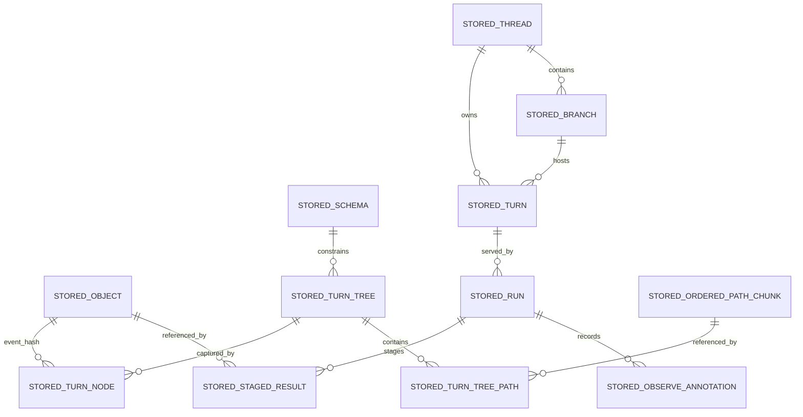

# Technical Specification

## 0. Version History & Changelog

- v0.19.0 - Removed lingering AG-era readiness wording from the live TechSpec, made the staged TypeScript gates the only active implementation-line bar, and clarified that product-proof and portability evidence must become part of the repo's canonical verification path.
- v0.18.0 - Replaced the dormant AG-closed readiness posture with an active TypeScript productization contract centered on a serious REPL proving host, staged freeze gates, PostgreSQL-before-Rust sequencing, portable canonical plus SSE streams, and archived constitutional history that no longer sits in the live-authority path.
- v0.17.0 - Closed Epic AG in current repo reality, reaffirmed TypeScript freeze-readiness for the currently promoted supported applicable surfaces under fresh AG-gated evidence, and preserved Rust framework as unsupported product behavior.
- ... [Older history truncated, refer to git logs]

## 1. Stack Specification (Bill of Materials)

- **Primary Language / Runtime:** TypeScript `6.0.2` is the first authoritative implementation language for the framework and kernel protocol implementation. Rust `1.95.0` is now active for the kernel-first implementation line through the root Cargo workspace and `rust-toolchain.toml`. The kernel protocol remains language-neutral by contract. Core TypeScript packages target portable ESM across Bun, Node.js, and Deno. Bun remains the preferred local development runtime and package manager. Future Go, Python, or Zig implementations must use their native workspace files when and only when their boundary work is authorized.
- **Primary Frameworks / Libraries:** `ai@6.0.142` and `@ai-sdk/provider@3.0.8` for the baseline AI SDK Providers bridge, using the `LanguageModelV3` / `ProviderV3` surface only in the baseline bridge; `@ag-ui/core@0.0.52` for the baseline AG-UI event union and runtime validation surface; `ajv@8.18.0` for JSON Schema validation; `cbor-x@1.6.4` for deterministic CBOR encoding and decoding in the TypeScript implementation; `@biomejs/biome@2.4.10` for formatting and linting; `tsup@8.5.1` for package builds; `@typespec/compiler@1.11.0`, `@typespec/json-schema@1.11.0`, `@typespec/openapi3@1.11.0`, and their pinned TypeSpec peer libraries for TypeSpec contract artifact generation; and `cddl@0.20.1` for kernel CDDL grammar validation. The transition line also standardizes on Protobuf plus gRPC for the first cross-language kernel process boundary, Buf v2 configuration for `.proto` governance, Devenv-provisioned `buf@1.66.1`, `protobuf`/`protoc`, and `protoc-gen-es@2.11.0` for current kernel interop generation, `@bufbuild/protobuf@2.11.0` for the generated TypeScript binding runtime, Rust `tonic`/`tonic-prost`/`tonic-prost-build@0.14.5`, `prost@0.14.3`, `tokio@1.52.1`, `ciborium@0.2.2`, `serde@1.0.228`, and OpenTelemetry semantic conventions for cross-language observability. Exact package and plugin versions for future additions must be pinned in the activation change that introduces them.
- **State Stores / Persistence:** Tuvren Runtime uses a Kraken-owned backend contract first. `@tuvren/backend-memory` is the reference development and semantic test backend. `@tuvren/backend-sqlite` is the first officially supported persistent backend adapter and the baseline persistent backend for Node-capable proving hosts. PostgreSQL is the next official backend priority after SQLite and must satisfy the same strict kernel-visible contract before Rust framework/product work resumes. Later backends such as MySQL/MariaDB and MongoDB are peer adapters against the same kernel contract, not SQLite-shaped variants.
- **Infrastructure / Tooling:** `devenv` for reproducible development environments, `nx@22.6.3` plus aligned `@nx/*` packages for TypeScript project orchestration, Bun workspaces, root TypeScript project references, `tsup` package builds, structured JSON logging, exact dependency pinning in `package.json` plus `bun.lock`, environment-variable-based provider credentials at bridge boundaries, and `devenv`-provisioned Weaver, Buf, and Protobuf generator CLI paths for semantic-convention and interop generation. The repo root also remains the home for repo-global orchestration, Buf configs, future Rust workspace files, `telemetry/`, `reports/compatibility/`, and `tools/` wrappers that coordinate native toolchains without replacing them.
- **Testing / Quality Tooling:** `bun test`, `tsc --noEmit`, Biome, TypeSpec code generation checks, CDDL grammar validation, deterministic CBOR golden-byte tests, hash identity fixtures, shared backend conformance suites, checkpoint/recovery scenario tests, AI SDK bridge contract fixtures, proving-host end-to-end validation, and local mock-provider validation through `@copilotkit/aimock@1.15.1` plus `@ai-sdk/openai@3.0.53`, `@ai-sdk/anthropic@3.0.66`, and `@ai-sdk/google@3.0.64` against local OpenAI-, Anthropic-, and Gemini-compatible provider boundaries for success, control, and provider-failure paths. The baseline TypeScript line may continue to use the current playground-owned lanes until the serious REPL host replaces them, but long-term product-proof claims must come from the proving host rather than from a private harness alone. The transition line adds boundary-owned JSON conformance fixtures, JSON Schema 2020-12 fixture validation, compatibility-matrix generation, Buf breaking-change checks when `.proto` surfaces exist, and real interop-smoke validation between the TypeScript framework line and future Rust kernel services.
- **Version Pinning / Compatibility Policy:** Versions named in this TechSpec are authoritative for the baseline implementation line and must match the repository manifests. Public package APIs follow semantic versioning. Changes to kernel record encoding, hash algorithm, or durable identity rules are semver-major. Semantic surface versions for kernel protocol, framework contracts, event vocabulary, error vocabulary, conformance suites, and interop transport are tracked independently from npm package versions or future crate versions.

### 1.1 Implementation Posture

- **Authoritative center:** The kernel boundary is a protocol of serializable data, not an in-process callback API.
- **First implementation choice:** TypeScript is the first authoritative implementation of that protocol for speed of validation, not a claim that the kernel is fundamentally JavaScript-bound.
- **Semantic authority posture:** `docs/` and `constitution/` are the human semantic authorities. Boundary-owned machine-readable contract, conformance, and interop assets are downstream projections of that authority unless explicitly promoted as normative in the same change.
- **Documentation posture:** `docs/` carries the project’s timeless semantic layer, while `constitution/` is the live planning and execution framework for the repo. `constitution/AGENTS.md` is a routing helper aligned to the live constitutional chain rather than a fifth authority document. Stale constitutional support material moves under `constitution/archived/` and must not remain in any live-authority reading path once archived.
- **Portability posture:** Core packages stay runtime-portable where practical; backend packages and provider bridges may have narrower runtime support when their dependencies require it.
- **Multilanguage posture:** Tuvren is one semantic ecosystem with multiple implementations, not multiple independent ports. Shape contracts, behavioral conformance, and cross-process transport are separate authority layers.
- **TypeScript productization posture:** TypeScript is the first full product line. It must prove the embeddable SDK through a serious REPL-style host that exercises the documented runtime surface end to end before package curation is treated as stable and before Rust framework/product work resumes.
- **Freeze-readiness posture:** AG-generated green evidence for the currently promoted supported applicable surfaces remains valid historical evidence, but it is no longer the governing readiness claim. Active readiness now follows three staged gates: `product proof gate`, `platform gate`, and `portability gate`. Rust remains blocked until the portability gate passes under fresh evidence.
- **Authority stack posture:** Cross-implementation meaning is carried by a layered authority stack — TypeSpec for the logical contract spine; CDDL for deterministic CBOR/kernel binary-record grammar; Protobuf/Buf for transport projections where gRPC is the chosen transport; JSON Schema 2020-12 for portable validation artifacts; conformance-plan JSON for executable behavior assertions; OpenTelemetry semconv via Weaver for telemetry vocabulary. TypeScript and Rust are implementation languages and binding-projection surfaces, not authority. Markdown is governance and rationale prose, not authority. Authority Packet manifests under `boundaries/<area>/contracts/<surface>/spec/authority-packet.json` declare which of these formats together carry one cross-implementation semantic surface and which sources are forbidden authority for that surface.
- **Framework posture:** The framework layer is driver-oriented. Shared framework contracts and runtime services stay driver-neutral where practical, while concrete execution semantics live in driver implementations.
- **Initial driver posture:** The first production-depth driver is the ReAct Driver. It is the baseline implementation, not the whole framework ontology.
- **Provider posture:** Tuvren Runtime owns the canonical provider contract, while Kraken supplies the engine semantics behind it. The baseline TypeScript bridge surface is AI SDK Providers only, but the AI SDK bridge is not the provider semantic oracle. Tuvren-owned provider semantics, event shapes, error behavior, and continuity expectations must remain portable and implementation-agnostic so future Rust connectors can satisfy the same contract without inheriting AI SDK types or naming. LangChain and first-class Tuvren provider packages remain out of current baseline scope.
- **Backend posture:** All official backends implement one strict kernel-visible contract. Memory remains the reference development backend, SQLite is the first production-depth backend for Node-capable hosts, and PostgreSQL is the next official backend priority before Rust framework/product work resumes. Backend-specific optimizations may exist internally, but they must not change kernel semantics or require capability negotiation at the kernel layer in v0.1.
- **Stream portability posture:** The canonical event stream and SSE projection are required portable surfaces. AG-UI translation remains implementation-specific because it depends on an external SDK ecosystem, but it must stay a projection of canonical runtime meaning rather than a competing semantic surface.
- **Toolchain posture:** Nx orchestrates repo-wide target names and dependency flow, but Bun, Cargo, Buf, and future language-native tools remain authoritative inside their ecosystems.
- **Interop posture:** The first cross-language seam is a process boundary around the kernel. FFI remains explicitly out of the first Rust phase.

### 1.2 Current-State vs Target-State

- **Current repository reality:** The repository already contains the workspace scaffold, `@tuvren/core-types`, `@tuvren/kernel-protocol`, `@tuvren/backend-memory`, `@tuvren/backend-sqlite`, `@tuvren/kernel-testkit`, `@tuvren/runtime-api`, `@tuvren/driver-api`, `@tuvren/event-stream`, `@tuvren/tool-contracts`, `@tuvren/provider-api`, `@tuvren/runtime-core`, the ReAct Driver baseline with implementation-proven loop completion, streaming/provider semantics, shared runtime-core tool/approval integration, and the reusable `createGrpcRuntimeKernel()` helper for the governed Rust-kernel transport seam, `@tuvren/provider-bridge-ai-sdk` as the first concrete provider bridge, the host stream adapter line `@tuvren/stream-core`, `@tuvren/stream-sse`, and `@tuvren/stream-agui`, the private playground host harness `@tuvren/playground-host` with `kernelMode` runtime selection plus `kernelGrpcBaseUrl`, playground-owned aimock E2E validation lanes for the local OpenAI, Anthropic, and Gemini provider HTTP boundaries, an opt-in Gemini validation lane for real provider calls through `@ai-sdk/google`, the hardening testkits `@tuvren/provider-testkit` and `@tuvren/framework-testkit`, release and portability scripts under `tools/scripts`, the checked-in Epic Q portability matrix, the Epic Q release-hardening closure inventory, repo-global `telemetry/` and `reports/compatibility/` roots, boundary-owned `conformance/` roots for the framework, kernel, and providers, TypeSpec-authored tool/provider contract sources plus reviewed JSON Schema/OpenAPI artifacts, kernel CDDL grammar, one shared semantic conformance runner under `tools/conformance/runner/`, JSON-RPC adapter protocol schemas under `tools/conformance/adapter-protocol/`, TypeScript and Rust implementation adapter hosts under `conformance-adapter/`, compatibility evidence emitted through shared-runner evidence files, kernel-only proto authority under `boundaries/kernel/interop/grpc/proto/`, root `buf.yaml` / `buf.gen.yaml`, the `kernel-interop-grpc` Nx target surface, Devenv-provisioned Buf/protoc generator tooling, generated TypeScript telemetry and kernel-interop helpers under the consuming framework implementation tree, root Cargo workspace files, the Rust kernel core, Rust gRPC service, generated Rust telemetry helper under the Rust kernel tree, a real TS-framework-to-Rust-kernel interop suite manifest under `boundaries/framework/interop/rust-kernel/`, and a measured compatibility matrix whose checked-in payload uses deterministic sentinel `generatedAtMs` / `sourceRevision` values plus scrubbed interop telemetry attributes while still preserving the substantive `rust-kernel`, `rust-framework`, TypeScript current-lane, and `typescript-framework__rust-kernel` evidence entries.
- **Current TypeScript kernel closure posture:** `@tuvren/kernel-runtime` now exists under `boundaries/kernel/implementations/typescript/runtime-kernel` as the boundary-owned TypeScript adapter from `RuntimeBackend` to `RuntimeKernel`, exported through `createRuntimeKernel()`. Playground local memory and SQLite modes now obtain syscall behavior from that package, while host-owned playground code is limited to inspectors and host wiring rather than private syscall semantics.
- **Current kernel conformance posture:** `tuvren.kernel.protocol` now references promoted kernel protocol core, kernel protocol extended, run-liveness, and restart-recovery plans. The TypeScript memory and SQLite kernel adapters execute native `@tuvren/kernel-runtime` behavior under the shared runner, TypeScript SQLite evidence is full-pass for its advertised capability set, TypeScript memory evidence is pass for its advertised capability subset without durable restart-recovery, and Rust remains capability-scoped and non-applicable where it does not advertise the relevant extension.
- **Current semantic-evidence posture:** The boundary-owned semantic evidence posture from Epic W remains intact after Epic X and final Epic Y closure. The TypeScript testkits still act as helper and facade packages for TypeScript-local testing, but they now live under implementation-owned paths. TypeScript and Rust conformance entry points are wrappers or native adapter hosts; `tools/conformance/runner/` owns assertion evaluation, required evidence, capability selection, adapter-error isolation, trace execution, and compatibility evidence emission.
- **Current host-proof posture:** The repository still proves the host story mainly through the private playground harness and its scenario lanes. That is sufficient as current-state evidence that the runtime is real, but it is not yet the serious REPL proving host required by the active TypeScript productization posture.
- **Current package/publication posture:** The high-level SDK surface is not yet curated for public publication. Package names, package boundaries, and top-level host-facing curation may still change before the serious REPL host lands, and that rename/restructure wave is intentionally scheduled just before the proving-host build.
- **Current freeze-readiness posture:** `reports/compatibility/compatibility-matrix.json` still records fresh AG-gated evidence for the currently promoted supported applicable surfaces, but that evidence is now historical input to the broader TypeScript productization program rather than the governing readiness claim. The `product proof gate`, `platform gate`, and `portability gate` all remain open.
- **Current TypeScript provider-bridge evidence posture:** The shared provider and framework compatibility evidence now describes TypeScript guarantees with framework-mediated capability labels instead of broad native-provider labels. The active TypeScript lane advertises `providers.framework-owned-tool-execution`, `providers.framework-owned-approval-boundary`, and `providers.rejects-native-strict-structured-output`, and the promoted provider or framework plans now prove the fail-closed bridge behavior for strict structured-output requests, provider-owned tool execution or approval surfaces, approval-resume continuity, and resumed event-stream checkpoint or thread association semantics.
- **Current framework orchestration authority posture:** The framework spec, the runtime-api authority packet, the shared orchestration conformance plan, the TypeScript binding appendix, and refreshed compatibility evidence now align on orchestration semantics such as `spawn()`, `allEvents()`, `awaitResult()`, descendant source attribution, run-local worker lifecycle behavior, explicit execution-surface inheritance, nested descendant attribution, handoff resolution boundaries, and worker-forwarded event sources. Remaining documented orchestration, extension, and host-proof semantics that are not yet packet/plan/runner-owned are active portability debt rather than accepted long-lived locality.
- **Current implementation-line gate posture:** Rust framework/product work remains blocked until TypeScript clears the `product proof gate`, `platform gate`, and `portability gate`. PostgreSQL lands before any Rust framework/product activation, and no later host/product line is activated merely because the AG subset remains green.
- **Current topology posture:** Epic X is closed in current repo reality. Boundary-root testkits now live under `boundaries/<area>/implementations/typescript/testkit/`, contract roots now expose only language-neutral assets plus README placeholders, and the TypeScript package guts for moved contract packages live under sibling `implementations/typescript/` subtrees. Path topology now reveals language ownership without opening files.
- **Target implementation state:** The package layout and interfaces defined below are the intended implementation target for the first authoritative TypeScript product line, including a serious REPL proving host, PostgreSQL as the next official backend, curated high-level SDK publication after lived proving-host experience, and comprehensive portable conformance across the documented runtime surface except for explicitly external-SDK-dependent integrations such as AG-UI translation and the TypeScript-only AI SDK bridge implementation.
- **Drift rule:** The future codebase must conform to this TechSpec. The TechSpec must not be treated as a loose commentary on whatever structure happens to emerge.

## 2. Architecture Decision Records (ADRs)

### ADR-001 The Kernel Boundary Is Protocol-First and Data-Only

- **Status:** accepted
- **Context:** The frozen kernel specification explicitly defines the kernel-framework boundary as a protocol where everything crossing the boundary is serializable data. Future multi-language SDKs and future non-TypeScript kernel implementations depend on preserving this narrow waist.
- **Decision:** The authoritative kernel boundary is a language-neutral protocol of concrete data structures and operations. No callbacks, framework types, or runtime-specific object identities cross the boundary.
- **Consequences:** The TechSpec must define exact record shapes, byte encoding, hashing, and operation signatures. TypeScript APIs above the kernel are framework SDK surfaces, not substitutes for the kernel protocol.

### ADR-002 TypeScript Is the First Authoritative Implementation, Not the Long-Term Kernel Monopoly

- **Status:** accepted
- **Context:** The project needs a fast path to validating the kernel and framework semantics, but the protocol must remain suitable for future Rust, Wasm, or other implementations.
- **Decision:** Use TypeScript `6.0.2` for the first authoritative implementation of the framework and kernel protocol. Treat it as the reference implementation of the protocol, not as a license to collapse protocol boundaries into JavaScript-only assumptions.
- **Consequences:** The implementation can progress quickly, while future Rust or Wasm implementations remain possible if they pass the same protocol fixtures and semantic test suites.

### ADR-003 Ship as a Modular Monorepo of Boundary-Owned Projects, Not as Multiple Services

- **Status:** accepted
- **Context:** The architecture is explicitly modular but intentionally in-process and solo-developer-friendly.
- **Decision:** Realize the approved logical containers as projects in one monorepo, grouped first by architectural boundary and then by contract versus implementation, rather than as separate deployable services.
- **Consequences:** Boundary discipline is preserved without adding network topology, deployment orchestration, or remote protocol complexity before it is justified. The repository structure mirrors the architecture docs instead of centering JavaScript package-manager conventions.

### ADR-004 The Framework Public Surface Remains Library-First and Driver-Neutral

- **Status:** accepted
- **Context:** Tuvren Runtime is a framework product for developers to embed, while Kraken remains the engine identity behind it. The architecture’s host boundary is an embedding surface.
- **Decision:** The primary TypeScript framework surface remains a library API centered on `TuvrenRuntime`, `ExecutionHandle`, typed events, driver selection, provider ports, and backend ports.
- **Consequences:** HTTP, WebSocket, CLI, editor, and protocol adapters are secondary packages layered over the library API. This does not weaken the protocol-first kernel boundary because the library surface sits above it, and it prevents the first driver from becoming the only host-facing abstraction.

### ADR-005 The Baseline Provider Strategy Is Tuvren Provider Contract Plus AI SDK Providers Bridge

- **Status:** accepted
- **Context:** The framework owns the canonical provider contract. Supporting multiple bridge ecosystems before the core runtime is proven would add translation surface and semantic drift for little value.
- **Decision:** The baseline provider integration package is `@tuvren/provider-bridge-ai-sdk`, built on `ai@6.0.142` and `@ai-sdk/provider@3.0.8`. The baseline bridge adapts `LanguageModelV3` and `ProviderV3` only. `LanguageModelV2` compatibility, AI SDK agent loops, AI SDK UI message protocols, LangChain bridges, and first-class Tuvren-scoped provider packages are deferred.
- **Consequences:** The initial provider surface stays narrow and Tuvren-scoped while preserving Kraken engine semantics internally. The bridge treats AI SDK as a provider/model source, not as the runtime loop, tool governance layer, host protocol, durable state owner, or long-term semantic oracle. Future packages such as `@tuvren/provider-openai`, `@tuvren/provider-anthropic`, and `@tuvren/provider-google` can be added later without redefining the framework contract, and future Rust connectors must satisfy the same Tuvren-owned provider semantics without inheriting AI SDK-specific shapes.

### ADR-006 Official Backends Use One Strict Uniform Kernel Contract

- **Status:** accepted
- **Context:** Tuvren Runtime is a framework product, not a storage product. Developers must be able to move between backends without kernel-semantic drift.
- **Decision:** All official backends implement one strict kernel contract. Optional backend capabilities are not exposed at the kernel layer in v0.1.
- **Consequences:** Shared backend conformance suites remain authoritative. Backend-specific performance tricks stay internal. The framework and future SDKs do not branch on backend feature flags.

### ADR-007 Memory and SQLite Are the Official Initial Backends

- **Status:** accepted
- **Context:** The project needs a usable development backend immediately and a usable persistent backend package without pretending that one backend defines Kraken’s ontology.
- **Decision:** `@tuvren/backend-memory` is the reference non-persistent backend for development and semantic testing. `@tuvren/backend-sqlite` is the first officially supported persistent backend adapter.
- **Consequences:** SQLite is the first official persistent implementation and the baseline proving-host backend for Node-capable environments, but not the canonical physical model for all future backends. PostgreSQL is the next official backend priority before Rust framework/product work resumes. MySQL/MariaDB, MongoDB, and others remain peer adapters against the same kernel contract.

### ADR-008 Structured Kernel Records Use Deterministic CBOR and Opaque Objects Hash Raw Bytes

- **Status:** accepted
- **Context:** Kernel identity needs a compact, deterministic, multi-language-friendly encoding. Canonical JSON is human-readable, but it carries JSON number and ECMAScript canonicalization constraints that are not ideal for durable kernel identity.
- **Decision:** Structured kernel records are encoded as deterministic CBOR before hashing. Opaque stored objects are hashed from raw bytes without re-encoding.
- **Consequences:** The kernel’s identity format is binary, deterministic, and language-neutral. JSON remains a debugging, export, and tooling format, not the canonical storage identity format.

### ADR-009 SHA-256 Is the Canonical Hash Algorithm

- **Status:** accepted
- **Context:** Durable identity must work cleanly across TypeScript, Python, Go, Rust, Bun, Node.js, Deno, and edge/Wasm-friendly environments with minimal dependency friction.
- **Decision:** Kraken uses SHA-256 as the canonical hash algorithm for both opaque object bytes and deterministic-CBOR structured records.
- **Consequences:** Hash identity uses ubiquitous primitives available in WebCrypto and standard libraries. Faster alternatives such as BLAKE3 are intentionally not used for canonical identity in v0.1.

### ADR-010 Core Kernel Records Use a Restricted Integer-Oriented Data Model

- **Status:** accepted
- **Context:** Cross-language deterministic encoding gets riskier when floats, tags, and broad dynamic types are allowed into core kernel records.
- **Decision:** Core kernel records are restricted to maps with string keys, arrays, text, byte strings, booleans, nulls, and integers. Floating-point values are not allowed in normative kernel records. Persisted timestamps are signed Unix epoch millisecond integers.
- **Consequences:** Deterministic CBOR encoding remains simple and predictable. Float-bearing data, if ever needed, must live in opaque objects, extension state, or higher-layer provider/application payloads, not in core kernel records.

### ADR-011 TurnTree Storage Is Path-Granular with Threshold-Based Chunking for Ordered Paths

- **Status:** accepted
- **Context:** The kernel contract is expressed in path values, not in generic subtree fragments. Ordered paths such as `messages` can grow large enough that flat rewrites become expensive, but a fully generic Merkle-fragment engine would overfit the problem.
- **Decision:** TurnTree semantics remain path-granular. Ordered paths are logically `Hash[]`; single paths are logically `Hash | null`. Internally, ordered paths start flat and may promote to append-optimized fixed-size chunked storage after crossing an implementation-defined threshold. Chunking is invisible at the protocol layer.
- **Consequences:** The public model stays simple while long ordered paths avoid pathological rewrite amplification. Numeric threshold and chunk-size values remain implementation constants, not protocol constants.

### ADR-012 TypeScript Tooling Uses Biome and tsup

- **Status:** accepted
- **Context:** The project explicitly prefers Bun-based workflows, Biome, and `tsup`.
- **Decision:** Use `@biomejs/biome@2.4.10` for linting and formatting and `tsup@8.5.1` for package builds.
- **Consequences:** The implementation posture is no longer ambiguous or tool-default-driven. Config, scripts, and examples must reflect this choice directly.

### ADR-013 Workspace Orchestration Uses devenv and Nx

- **Status:** accepted
- **Context:** The project explicitly fixed `devenv + nx` as non-negotiable workspace tooling and the repository now uses a boundary-grouped architecture-first layout.
- **Decision:** Use `devenv` as the reproducible developer environment entry point and pin `nx@22.6.3` with aligned `@nx/workspace@22.6.3` and `@nx/js@22.6.3` for orchestration of the TypeScript subtree.
- **Consequences:** Environment pinning lives in Nix/devenv configuration rather than npm manifests alone. Nx project orchestration is first-class, but limited to the TypeScript subtree and does not define the overall repository ontology.

### ADR-014 The Framework Is Driver-Oriented and ReAct Is the Initial Driver

- **Status:** accepted
- **Context:** The architecture now distinguishes shared framework services from concrete execution models. The current behavioral specification is strongly ReAct-shaped, but the product must support future workflow-oriented drivers over the same durable runtime foundation.
- **Decision:** Implement the framework as shared contracts plus shared runtime services, with concrete drivers as explicit implementation packages. The first driver is the ReAct Driver.
- **Consequences:** Package structure, task planning, and future implementation sequencing must separate shared framework logic from driver-specific logic. Future drivers can be added without redefining the kernel, host API, or provider-neutral content model.

### ADR-015 Semantic Authority Flows from Human Specs into Boundary-Owned Machine Artifacts

- **Status:** accepted
- **Context:** The multi-language transition needs machine-readable contract, conformance, and interop assets, but those assets cannot become an unreviewed parallel spec.
- **Decision:** `docs/` and `constitution/` remain the human semantic authorities. Boundary-owned machine-readable assets under `contracts/`, `conformance/`, and `interop/` are downstream authority layers that must be updated in lockstep when they become normative.
- **Consequences:** Generated code, helper wrappers, and compatibility reports are evidence or implementation support, not semantic source of truth. Contract or behavior drift must be resolved by updating the human and machine artifacts together.

### ADR-016 Shape Contracts, Behavioral Conformance, and Interop Transport Stay Separate

- **Status:** accepted
- **Context:** A single technology cannot cleanly express every kind of runtime authority Tuvren needs across framework contracts, kernel records, behavior fixtures, and cross-process transport.
- **Decision:** Keep shape contracts, behavioral conformance, and interop transport as separate layers. Framework/provider shape contracts use boundary-owned contract packages; kernel record grammar uses boundary-owned protocol grammar; observable behavior uses boundary-owned conformance suites; and cross-process transport uses boundary-owned interop contracts only where a boundary actually crosses process or language seams.
- **Consequences:** No schema language or transport definition silently becomes the meaning of the runtime. Implementations must satisfy both shape and behavior requirements, and interop may evolve on its own version track when needed.

### ADR-017 Native Toolchains Remain Authoritative Inside Each Implementation Tree

- **Status:** accepted
- **Context:** A language-neutral runtime does not imply a fake universal toolchain. TypeScript, Rust, and later languages each have real package, build, and test workflows that must stay first-class if the repo is to remain honest and maintainable.
- **Decision:** Nx provides repo-wide orchestration and canonical target names, but Bun, Cargo, Buf, and future language-native tools execute the actual build, test, conformance, code-generation, and interop work for their ecosystems.
- **Consequences:** Repo tooling coordinates rather than replaces native tooling. New language lines must bring their own authoritative workspace files, and implementation plans must avoid TypeScript-centric assumptions at the semantic seams.

### ADR-018 Rust Enters Through a Kernel-Only Process Boundary, Not FFI

- **Status:** accepted
- **Context:** The first non-TypeScript implementation needs a durable, inspectable, versioned seam that can later serve more than one language pair. FFI would couple early Rust work to the current embedding model and make versioning, observability, and process isolation harder.
- **Decision:** The first Rust phase is limited to the kernel boundary and exposes that boundary through a process transport contract rather than FFI. The framework remains TypeScript-first until the kernel transport and parity story are routine.
- **Consequences:** The first Rust implementation proves language-neutral kernel semantics without forcing an immediate Rust framework port. Performance optimization through tighter embedding can be reconsidered later only after the process-boundary contract is proven.

### ADR-019 Multi-Implementation Compatibility Is Proven by Shared Suites and a Generated Ledger

- **Status:** accepted
- **Context:** Comparing TypeScript and Rust directly would make the first implementation the oracle and hide which semantic surfaces actually pass or fail.
- **Decision:** Implementations prove parity by running the same boundary-owned conformance suites and interop-smoke checks, then publishing their status to a generated compatibility ledger under `reports/compatibility/`.
- **Consequences:** Compatibility claims become inspectable and versioned. The ledger records implementation reality without becoming semantic authority itself, and CI can separate repo-global, language-native, and cross-language validation lanes cleanly.

### ADR-020 TypeScript Must Adopt the Final Artifact and Conformance Structure First

- **Status:** accepted
- **Context:** The current repository still contains TypeScript-first structural shortcuts such as testkit packages standing in for a future language-neutral conformance system.
- **Decision:** Where the transition defines a stable language-neutral pattern, TypeScript adopts it first. Boundary-owned conformance assets, interop definitions, target naming, and compatibility reporting must normalize the TypeScript line before later implementations inherit the structure.
- **Consequences:** Later languages inherit a real system instead of a special case. Transition work may relocate or split current TypeScript-only helpers, but it must do so without weakening the existing TypeScript delivery path.

### ADR-021 Semantic Ecosystem Maturity Precedes New Implementation Lines

- **Status:** accepted
- **Context:** Epic R established the rule "one semantic ecosystem, then multiple implementations." Epics S-V created the artifact homes, initial conformance runners, Rust kernel baseline, and TS-framework-to-Rust-kernel interop proof, but current repo reality still leaves many normative framework, driver, provider, stream, backend, and error semantics asserted primarily by TypeScript implementation tests. Starting a Rust framework from that posture would risk turning `runtime-core` behavior into the hidden oracle.
- **Decision:** Epic W is the Semantic Ecosystem Maturity line. It must inventory the semantic coverage gap, promote high-value TypeScript-local semantics into boundary-owned conformance suites, add assertion-bearing suite manifests and evidence, and update compatibility reporting so implementations are judged against named semantic checks. Epic W does not authorize a Rust framework, another language implementation, a new driver, new official backend, or new host protocol.
- **Consequences:** New implementation work waits behind a stronger semantic gate. The TypeScript implementation remains the first producer of mature conformance evidence, but it does not retain special semantic authority. Future implementation-line activation must cite Epic W evidence instead of relying on broad Epic R/S/V labels.

### ADR-022 Path Topology Reveals Language Ownership In Boundaries

- **Status:** accepted
- **Context:** ADR-020 set the rule that TypeScript adopts the language-neutral structure first. In current repo reality, several TypeScript-only directories still occupy language-neutral boundary slots: `boundaries/{kernel,framework,providers}/testkit/` exposes TypeScript packages where a sibling `implementations/typescript/` subtree should hold them, and `boundaries/<area>/contracts/<contract>/` directories carry TypeScript package guts (`package.json`, `src/`, `dist/`, `tsup.config.ts`, `tsconfig*.json`, `node_modules/`, `test/`, `smoke/`, `bench/`) at the contract root alongside language-neutral specifications and artifacts. A reader cannot tell language ownership from path alone, which is the exact failure mode Architecture.md `6` warned about and ADR-020 declared the project would fix before another implementation line becomes authoritative. The Rust kernel is already authoritative through Epic U, so this normalization is overdue cleanup, not new architecture.
- **Decision:** Every directory under `boundaries/` belongs to exactly one of two classes, distinguishable by path:
  - language-neutral assets at boundary, contract, conformance, and interop roots — JSON fixtures, JSON Schema validators, suite manifests, CDDL grammar, TypeSpec sources, generated JSON Schema or OpenAPI artifacts, `.proto` files, scenario manifests, semantic README files;
  - language-specific assets exclusively under `boundaries/<area>/[contracts/<contract>/]implementations/<lang>/` — `package.json`, `Cargo.toml`, `tsup.config.ts`, `tsconfig*.json`, `src/`, `dist/`, `test/`, `bench/`, `smoke/`, `node_modules/`, `target/`, generated language bindings, and any other language-tooling output.
  No language-specific build manifest, source directory, or generated binding may live at a boundary, contract, conformance, or interop root. Epic X performs the initial physical relocation. Surfaces that lack a language-neutral source today (`runtime-api`, `driver-api`, `event-stream`, `core-types`) keep their TypeScript implementation under `implementations/typescript/` and carry only README placeholders at the contract root until a later epic authors a neutral source.
- **Consequences:** Reviewers can reject misplaced TypeScript-only files on path evidence alone. Future epics that add a Rust crate, a Go module, or a new TypeScript package must place their build artifacts under `implementations/<lang>/` from day one. Existing TypeScript package names stay stable across the relocation because consumers depend on workspace handles rather than directory paths, so no public API change is required. The constitution carries this rule alongside ADR-020 to make path topology auditable independently of semantic-authority decisions.

### ADR-023 No Implementation Oracle

- **Status:** accepted
- **Context:** Several deferred shared contract surfaces (`runtime-api`, `driver-api`, `event-stream`, `core-types`, callable seams) still describe their cross-language meaning by pointing at a TypeScript or Rust implementation file. That posture turns the implementation language into the silent oracle, which is exactly the failure mode CAP-P0-037 forbids.
- **Decision:** No cross-implementation semantic claim, conformance assertion, or compatibility claim may cite any file under `boundaries/<area>/contracts/<surface>/implementations/<lang>/`, `boundaries/<area>/implementations/<lang>/`, or any other implementation-language source tree as authority. Implementation-language files may host bindings, adapters, generated projections, local tests, and optimization logic; they may not define portable truth.
- **Consequences:** Every surface that currently relies on a TypeScript or Rust file as authority must promote to a boundary-owned authority packet (ADR-026) or be explicitly classified as implementation-specific in the Epic Y inventory. Existing `@tuvren/runtime-api` and other facade packages remain valid binding projections, but the phrase "semantic anchor" no longer attaches to any TypeScript package; the anchor is the authority packet manifest.

### ADR-024 No Prose Oracle

- **Status:** accepted
- **Context:** Markdown under `docs/`, `constitution/`, `AGENTS.md`, and boundary `README.md` placeholders is essential for rationale, workflow, planning, ADRs, and reviewer handoffs, but it is not executable. Treating prose as the source of a binding cross-language semantic produces silent drift between text, generated artifacts, and implementation behavior.
- **Decision:** No acceptance criterion, conformance claim, compatibility claim, release gate, or interop check may depend solely on Markdown. Every binding cross-language semantic claim must cite or derive from a machine authority packet (ADR-026), generated artifact, conformance plan, or measured evidence file. Markdown remains the home for rationale, workflow, ADRs, decision records, summaries, and review prose, paired with the executable artifacts that carry the actual contract.
- **Consequences:** README placeholders that today say "TypeScript implementation is the source of truth" or "see docs/ for semantics" are not authority and must be paired with an authority packet entry before the surface can be claimed cross-language. `docs/KrakenKernelSpecification.md` and `docs/KrakenFrameworkSpecification.md` retain their role as human authority chain inputs but cannot satisfy a portability claim by themselves.

### ADR-025 No Runner Oracle

- **Status:** accepted
- **Context:** A generic conformance runner that hard-codes expected event sequences, expected error codes, expected check IDs, expected lifecycle transitions, or expected provider/tool behavior in its source code becomes a second oracle. Switching runner implementations or adding a new language line then depends on inheriting hidden runner assumptions rather than reading the conformance plan.
- **Decision:** The final conformance architecture has one shared semantic conformance engine under `tools/conformance/runner/` and many implementation-language adapter hosts under `boundaries/<area>/implementations/<lang>/conformance-adapter/`. The shared runner is boundary-agnostic across current Kraken Engine conformance lanes: kernel, framework/runtime, ReAct driver, providers, and future promoted surfaces. It owns plan loading, scenario and fixture loading, schema validation, generic assertion operators, required-evidence enforcement, capability selection, adapter-error isolation, and compatibility evidence emission. Product semantics — expected event sequences, expected durable state transitions, expected checkpoint behavior, expected provider/tool behavior, expected error codes, expected recovery behavior, and expected check IDs — must arrive only from a Conformance Plan (§4.12) referenced by an Authority Packet manifest (§4.11).
- **Consequences:** Existing TypeScript and Rust conformance runners under `boundaries/<area>/implementations/<lang>/conformance-runner` are transitional hosts and must collapse toward adapter-only code. They may start native implementations, translate neutral operations to native calls, and return neutral observations, but they must not evaluate assertions, decide pass/fail, know check IDs, or emit check-scoped evidence. CI guardrails (KRT-Y011 and the final Epic Y closure work) reject product-semantic literals and assertion/pass-fail semantics appearing inside implementation-language runner or adapter source outside permitted native invocation mechanics.

### ADR-026 Authority Packet Model

- **Status:** accepted
- **Context:** ADR-015 set "human spec → machine artifact" lineage and ADR-016 partitioned shape contracts, behavioral conformance, and interop transport as separate layers. Neither ADR yet declares, per surface, exactly which combination of those layers together carries one cross-implementation semantic, nor which sources are explicitly forbidden authority for that surface. Without that declaration, drift between TypeSpec, CDDL, Protobuf, JSON Schema, conformance plans, semconv, and binding projections is invisible.
- **Decision:** Every cross-implementation semantic surface owns exactly one Authority Packet manifest at `boundaries/<area>/contracts/<surface>/spec/authority-packet.json` (or, for surfaces whose home is `boundaries/<area>/conformance/` or `boundaries/<area>/interop/<channel>/`, at the matching `spec/authority-packet.json` under that root). The manifest names a stable `packetId`, the packet `version`, the authoritative source files, the generated artifact directories, the language-binding projection roots, the referenced conformance plans, the allowed binding-specific appendices, the forbidden authority sources, and the freshness/compatibility checks the surface must satisfy. The manifest format is specified in §4.11.
- **Consequences:** Every Epic Y promotion ticket (KRT-Y003 through KRT-Y007) lands one authority packet manifest per promoted surface. Reviewers can reject any new contract source, generated artifact, or binding projection that is not declared in the manifest, and CI (KRT-Y011) verifies that declared sources exist, that declared generated artifacts are reachable from the declared sources, and that declared forbidden authority sources do not appear in any conformance evidence.

### ADR-027 Generated Artifact Freshness Is a CI Gate

- **Status:** accepted
- **Context:** Generated JSON Schema, OpenAPI, Protobuf descriptors and bindings, CDDL-derived validators, conformance plans, compatibility schemas, and telemetry outputs are functionally an authority change when they drift from their authority sources. Today drift is caught only by ad hoc review.
- **Decision:** Every generated artifact named by an Authority Packet manifest is regenerated and diff-checked in CI through the existing `bun run codegen` lane plus authority-packet-aware verification. CI fails when the generated artifact differs from the regeneration output, when the generated artifact is missing, or when a declared source is missing. The same gate applies to checked-in generated language bindings, when present.
- **Consequences:** `tools/scripts` gains an authority-packet freshness verifier wired into the existing repo-global verification flow. Authority packet manifests must declare every generated artifact subject to this gate; an undeclared generated artifact is not authoritative and may be deleted by the verifier. Implementations that depend on stale generated bindings must regenerate before merge.

### ADR-028 Forbidden Implementation Vocabulary in Authority Sources

- **Status:** accepted
- **Context:** TypeScript primitives (`Promise`, `AsyncIterable`, `AbortSignal`, `Uint8Array`, `Buffer`, language-native `Error`, `unknown`, `Record<string, unknown>`, callable signatures, Node/Bun/Deno runtime assumptions) and Rust ownership/lifetime vocabulary are convenient at the implementation layer but are not portable cross-language semantics. Allowing them inside authority sources lets the implementation language quietly leak into the contract.
- **Decision:** Authority packet sources (`spec/typespec/`, `spec/cddl/`, `.proto`, conformance plans, semconv YAML, fixture schemas) and the prose that documents them must use neutral vocabulary: operation, ordered event channel, cancellation/deadline control, byte sequence/octet payload, opaque JSON payload, metadata map, stable error envelope, language binding, implementation adapter. TypeScript and Rust primitives may appear only inside explicitly named binding-specific appendices declared by the Authority Packet manifest (for example `bindings/typescript.tsp` or `bindings/rust.md`).
- **Consequences:** Existing TypeScript-shaped narrative inside contract README files and inside §4 of this TechSpec progressively migrates to the neutral vocabulary as each surface is promoted. The TypeScript binding appendix for each promoted surface remains free to express the language-native shape (for instance the existing `Promise`/`AsyncIterable` `RuntimeKernel` shape) so implementation ergonomics are preserved while authority stays neutral.

### ADR-029 TypeScript Staged Readiness Gates New Framework Implementation Lines

- **Status:** accepted
- **Context:** The compatibility matrix proves that the promoted framework, kernel, and provider subsets are green for TypeScript, and that Rust framework remains unsupported. That is strong evidence, but future implementation maintainers still need a boundary-owned authority trail rather than required behavior that can be discovered only by reading TypeScript modules or TypeScript tests. Activating Rust framework work without that trail would reintroduce `runtime-core`, `sqlite-backend`, the framework adapter, provider bridge, or their tests as hidden semantic or structural oracles.
- **Decision:** The TypeScript freeze-readiness closure from Epics AD, AE, AF, and AG is historical evidence, not an active readiness claim. The live readiness contract is ADR-033: `product proof gate`, `platform gate`, and `portability gate` govern whether the TypeScript line is ready and whether another framework/product implementation line may resume. Before any new framework implementation line, future driver line, future official backend line, or future host/protocol expansion is activated, the active TechSpec/Tasks must name the line, preserve the staged gates as prerequisites, and add only the line-specific evidence that goes beyond those gates.
- **Consequences:** Epic AD through Epic AG remain closed in current repo reality and are not reopened as the governing readiness bar. Rust framework remains evidence-only and unsupported until the staged gates pass under fresh evidence and the active plan intentionally reopens implementation work. A raw compatibility `pass` entry remains necessary evidence for readiness, but it is never sufficient without the current staged-gate proof and runner-observed conformance guarantees.

### ADR-030 Adapter Evidence Is Not a Semantic Oracle

- **Status:** accepted
- **Context:** Promoted checks can appear to pass while relying on adapter-provided `evidence` fields, implementation-local verifier helpers, fake-kernel harness output, or check-result proxy fields. That recreates an implementation oracle inside the adapter even when the shared runner owns formal pass/fail mechanics.
- **Decision:** Adapter-supplied `Observation.evidence` is diagnostic and provenance material only. A promoted conformance pass must be decided from runner-observed `Observation.result`, `Observation.events`, `Observation.state`, schema validity over those domains, error-envelope shape, event ordering, terminality, or explicit absence of runner-observed events. `evidenceField` assertions may exist only as diagnostics and can never be the only semantic proof for a promoted check.
- **Consequences:** Authority Packet-referenced promoted plans must reject evidence-only checks. Promoted adapters must not return semantic verdict fields through evidence, import semantic verifier/assertion helpers, or use implementation-local `/test/` harnesses as the main proof path unless that harness is promoted as a boundary-owned testkit with a bounded contract.

### ADR-031 Raw Compatibility Status Uses Four Truthful States

- **Status:** accepted
- **Context:** Treating unsupported or non-applicable suites as `pass`, especially with `applicableChecks === 0`, makes compatibility evidence overstate readiness and hides whether a suite actually exercised a boundary.
- **Decision:** Raw compatibility status is exactly `pass`, `fail`, `unsupported`, or `not_applicable`. `pass` requires `applicableChecks > 0`, `failedChecks === 0`, and `passedChecks === applicableChecks`. `fail` means `failedChecks > 0`. `unsupported` means the suite is relevant to the implementation boundary but the implementation advertises no capabilities required by the suite. `not_applicable` means the suite does not target the implementation boundary, surface, or authority packet. `status: "pass"` with `applicableChecks === 0` is invalid.
- **Consequences:** Compatibility reporting must preserve the difference between "nothing to run because this implementation does not support the suite" and "the suite does not apply here." `reportStatus` may remain a presentation/classification field, but it must not contradict raw `status`.

### ADR-032 The First Product-Depth Host Is a Serious REPL CLI Built on the High-Level SDK

- **Status:** accepted
- **Context:** The project needs a product-depth proof that host developers can build serious operator-facing tools on Tuvren Runtime without private seams. The current playground harness proves many behaviors, but it is explicitly a local host harness rather than the lasting proving bar for the SDK surface.
- **Decision:** The first product-depth host is a serious REPL CLI built on the same high-level host-facing SDK surface that downstream hosts are expected to use. The proving host is not a separate product ontology and may not rely on private runtime shortcuts, implementation-local syscall seams, or test-only orchestration paths to claim readiness.
- **Consequences:** Host-proof claims require end-to-end validation through the REPL host. Package naming/topology normalization is scheduled immediately before the proving-host build so the CLI experience informs public-surface curation rather than the other way around.

### ADR-033 TypeScript Freeze Uses Product Proof, Platform, and Portability Gates

- **Status:** accepted
- **Context:** The AG closure proves an important subset of promoted semantics, but it does not by itself prove that the full TypeScript line is productized enough to freeze or that Rust can resume safely against the intended portable scope.
- **Decision:** TypeScript freeze uses three staged gates:
  - `product proof gate`: the high-level SDK plus serious REPL host prove the documented runtime surface end to end;
  - `platform gate`: package naming/topology normalization and PostgreSQL land at product depth;
  - `portability gate`: the intended portable surface is packet/plan/runner-owned under fresh evidence, with AG-UI and the TypeScript AI SDK bridge implementation remaining the main allowed implementation-specific exceptions.
- **Consequences:** Rust framework/product work remains blocked until all three gates pass. Conformance expands immediately/by subsystem during TypeScript product-building, then becomes the main driver during the portability gate closure.

### 2.1 Compatibility Record

- **Kernel identity compatibility:** Changes to deterministic CBOR profile, SHA-256 usage, hash string representation, or durable record shapes are semver-major.
- **Framework public API compatibility:** Breaking changes to exported TypeScript library contracts require a semver-major release.
- **Driver compatibility:** Changes to shared driver-selection semantics or driver-neutral framework contracts are semver-major; adding a new driver is semver-minor unless it changes existing shared contracts.
- **Backend compatibility:** All official backends must preserve the same kernel semantics. Physical schemas may differ by backend.
- **Provider compatibility:** AI SDK bridge upgrades may happen in minor releases only if the Tuvren-owned provider contract remains unchanged and contract fixtures still pass. Baseline AI SDK bridge compatibility is anchored to `LanguageModelV3`; adding `LanguageModelV2` compatibility later is additive only if it does not widen or weaken the Tuvren-owned provider contract.
- **Contract artifact compatibility:** Framework/provider contract versions, emitted JSON Schema artifacts, and emitted OpenAPI artifacts follow their owning boundary’s compatibility rules and are reviewed outputs of authored sources rather than independent contracts.
- **Conformance compatibility:** Normative fixture schemas, scenario identity, and suite semantics version independently from implementation packages. Behavior changes require explicit suite-version or compatibility-policy updates.
- **Interop transport compatibility:** Cross-process transport versions evolve independently from npm package or crate versions. Buf breaking policy must guard `.proto` changes once the interop surface exists.
- **Compatibility ledger posture:** `reports/compatibility/` records measured implementation parity and is not a public support matrix unless a later release policy explicitly promotes it.
- **Authority packet compatibility:** Each Authority Packet manifest carries its own `version`. Adding declared sources, generated artifacts, conformance plans, or binding projections is minor; removing a declared authoritative source, removing a referenced conformance plan, or relaxing a declared forbidden authority source is major. Conformance plans referenced by a manifest version-track independently and follow conformance-suite compatibility rules.
- **Generated artifact freshness:** Per ADR-027, every artifact declared as generated under an Authority Packet manifest is regenerated and diff-checked in CI. A drifting generated artifact is treated as a contract change for the purpose of release gating.

## 3. State & Data Modeling

### 3.1 Canonical Kernel Record Profile

- **Purpose:** Define the durable data profile that all kernel implementations and backends must preserve.
- **Storage Shape:** Structured kernel records are deterministic CBOR maps with string keys. Opaque objects remain raw bytes plus media type metadata.
- **Constraints / Invariants:**
  - Hashes are lowercase hex-encoded SHA-256 digests.
  - Core kernel records do not use floating-point values.
  - Persisted timestamps are signed Unix epoch milliseconds.
  - Core kernel records do not use CBOR indefinite lengths.
  - Core kernel records do not use CBOR tags in v0.1.
  - TypeScript implementations must reject `NaN`, `Infinity`, non-safe integers, and non-canonical record shapes before persistence.
- **Indexes / Access Paths:** Hash-addressable records for all immutable entities; lineage walks by `previousTurnNodeHash`; run-scoped staging by `(runId, taskId)`.
- **Migration Notes:** Record profile changes are protocol changes and therefore semver-major.

#### Primitive Aliases

- `HashString`
  - lowercase hex string of a 32-byte SHA-256 digest
- `EpochMs`
  - signed integer Unix epoch milliseconds
- `KernelRecord`
  - deterministic-CBOR-encodable value using the restricted profile above

### 3.2 Canonical Entity Shapes

- **Purpose:** Define the exact logical records the TypeScript implementation persists and hashes.
- **Storage Shape:** Immutable records encoded with deterministic CBOR unless the item is an opaque Object blob.
- **Constraints / Invariants:**
  - `StoredObject.bytes` are hashed as raw bytes.
  - Every other record below is hashed from deterministic CBOR bytes.
  - `schemaId`, `threadId`, `branchId`, `turnId`, `runId`, and `taskId` are opaque framework/kernel identifiers and are never derived from storage vendor internals.
  - `StoredTurnTree.manifestCbor` is the immutable cached full-manifest representation of the logical TurnTree. `StoredTurnTreePath` rows are the backend-side indexed path realization used for efficient `resolve`, `diff`, and ordered-path chunking. Both must always describe the same logical TurnTree.
- **Indexes / Access Paths:** As listed per entity below.
- **Migration Notes:** Field additions require explicit compatibility handling; field removals or semantic changes are semver-major.

#### Canonical Entity Definitions

- `StoredObject`
  - `hash: HashString`
  - `mediaType: string`
  - `bytes: Uint8Array`
  - `byteLength: number`
  - `createdAtMs: EpochMs`
- `StoredSchema`
  - `schemaId: string`
  - `schemaCbor: Uint8Array`
  - `createdAtMs: EpochMs`
- `StoredTurnTree`
  - `hash: HashString`
  - `schemaId: string`
  - `manifestCbor: Uint8Array`
  - `createdAtMs: EpochMs`
  - identity note: `hash` is derived from the logical tree identity tuple `{ schemaId, manifest }`, so identical manifests under different schemas never alias
- `StoredTurnTreePath`
  - `turnTreeHash: HashString`
  - `path: string`
  - `collectionKind: "single" | "ordered"`
  - `singleHash?: HashString | null`
  - `orderedEncoding?: "flat" | "chunked"`
  - `orderedCount?: number`
  - `orderedInlineCbor?: Uint8Array`
  - `orderedChunkListCbor?: Uint8Array`
- `StoredOrderedPathChunk`
  - `chunkHash: HashString`
  - `itemCount: number`
  - `itemsCbor: Uint8Array`
  - `createdAtMs: EpochMs`
  - identity note: `chunkHash` is derived from the deterministic-CBOR logical chunk item list represented by `itemsCbor`; `itemCount` and `createdAtMs` are not identity inputs
- `StoredTurnNode`
  - `hash: HashString`
  - `previousTurnNodeHash: HashString | null`
  - `turnTreeHash: HashString`
  - `consumedStagedResultsCbor: Uint8Array`
  - `schemaId: string`
  - `eventHash: HashString | null`
  - `createdAtMs: EpochMs`
  - identity note: `hash` is derived from the logical TurnNode fields excluding `hash` itself; stored metadata such as `createdAtMs` is not part of the logical TurnNode identity
- `StoredObserveAnnotation`
  - `annotationHash: HashString`
  - `runId: string`
  - `turnNodeHash: HashString | null`
  - `annotationCbor: Uint8Array`
  - `createdAtMs: EpochMs`
  - identity note: Observe annotations are persisted by the kernel at `run.completeStep` as durable annotation records, but they are not TurnNode identity inputs and do not change the frozen TurnNode hash contract.
- `StoredThread`
  - `threadId: string`
  - `schemaId: string`
  - `rootTurnNodeHash: HashString`
  - `createdAtMs: EpochMs`
- `StoredBranch`
  - `branchId: string`
  - `threadId: string`
  - `headTurnNodeHash: HashString`
  - `archivedFromBranchId?: string`
  - `createdAtMs: EpochMs`
  - `updatedAtMs: EpochMs`
- `StoredTurn`
  - `turnId: string`
  - `threadId: string`
  - `branchId: string`
  - `parentTurnId: string | null`
  - `startTurnNodeHash: HashString`
  - `headTurnNodeHash: HashString`
  - `createdAtMs: EpochMs`
  - `updatedAtMs: EpochMs`
- `StoredRun`
  - `runId: string`
  - `turnId: string`
  - `branchId: string`
  - `schemaId: string`
  - `startTurnNodeHash: HashString`
  - `status: "running" | "paused" | "completed" | "failed"`
  - `currentStepIndex: number`
  - `stepSequenceCbor: Uint8Array`
  - `createdTurnNodesCbor: Uint8Array`
  - `pendingSignalsCbor?: Uint8Array`
  - `createdAtMs: EpochMs`
  - `updatedAtMs: EpochMs`
  - liveness note: the base 28-operation surface does not by itself claim stale-`running` recovery from process death. Epic AB closed the optional `kernel.run-liveness` extension below as contract-first work, so storage fields, protocol helpers, framework recovery behavior, and conformance now move together only for implementations that advertise that extension.
- `StoredStagedResult`
  - `runId: string`
  - `taskId: string`
  - `objectHash: HashString`
  - `objectType: string`
  - `status: "completed" | "failed" | "interrupted"`
  - `interruptPayloadCbor?: Uint8Array`
  - `createdAtMs: EpochMs`

#### Run Liveness Extension Gate

- **Purpose:** Define the required implementation delta before Tuvren Runtime can claim durable recovery of stale `running` Runs.
- **Storage Shape:** Leased Run ownership extends `StoredRun` with backend-neutral fields equivalent to `executionOwnerId`, `leaseExpiresAtMs`, `fencingToken`, and `preemptionReason`. These fields are nullable/absent for non-leased base Runs and mandatory for any implementation claiming `kernel.run-liveness` capability.
- **Constraints / Invariants:**
  - Lease renewal is compare-and-swap by current owner and fencing token.
  - Lease renewal is valid only for `running` Runs.
  - `paused` Runs are approval-owned and are not lease-expiry candidates.
  - Stale-running preemption atomically verifies expiry, preserves verifiable staged work through reactive checkpointing, marks the superseded Run `failed`, and returns recovery state for a replacement Run.
  - Replacement execution creates a new Run; stale Runs are never reopened.
- **Indexes / Access Paths:** Backends implementing the extension must provide active stale-run discovery by status and lease expiry, plus owner/token lookup for renewal.
- **Migration Notes:** This extension is not a SQLite-only change and is not retroactively part of the frozen 28-operation base. Kernel protocol extension types, framework recovery behavior, runtime configuration, backend repositories, validators, conformance tests, and physical schemas must move together.



### 3.3 TurnTree Physical Realization

- **Purpose:** Concretize how the first implementation realizes path-granular TurnTrees without changing the frozen protocol.
- **Storage Shape:** Path-granular manifests plus internal ordered-path chunk storage where needed.
- **Constraints / Invariants:**
  - The protocol-facing meaning of an ordered path is always `Hash[]`.
  - The protocol-facing meaning of a single path is always `Hash | null`.
  - Ordered paths begin as flat inline sequences.
  - Ordered paths may promote to chunked storage after crossing an implementation-defined threshold.
  - Promotion is invisible to callers of `tree.resolve()` and `tree.manifest()`.
  - Chunk storage is append-optimized, fixed-size, and uses whole-chunk structural sharing.
  - Threshold and chunk-size numeric values are implementation constants, not protocol constants.
- **Indexes / Access Paths:**
  - by `(turnTreeHash, path)` for path lookup
  - by `chunkHash` for chunk reuse
  - by `turnTreeHash` for manifest reconstruction
- **Migration Notes:** Physical chunk policy may evolve without changing the protocol so long as `tree.create`, `tree.incorporate`, `tree.resolve`, `tree.diff`, and `tree.manifest` preserve the same behavior.

### 3.4 Backend Adapter Model

- **Purpose:** Define what it means for a backend package to be an official Tuvren Runtime backend.
- **Storage Shape:** Each backend package is a concrete implementation of the kernel storage contract. Physical schema is backend-specific.
- **Constraints / Invariants:**
  - Every official backend implements the full kernel contract.
  - No official backend exposes kernel-visible optional capabilities in v0.1.
  - No official backend may weaken the kernel’s required atomicity, lineage, or recovery guarantees.
  - Backends may optimize internally, but optimization must not change semantics.
- **Conformance note:** Shared backend contract tests are the authority for semantic conformance.
- **Product note:** `@tuvren/backend-memory` is intentionally non-persistent and must not be described as satisfying the durable-runtime guarantees of the PRD or kernel spec.
- **Indexes / Access Paths:** Backend-specific, but all must satisfy the canonical access patterns named in §§3.1-3.3.
- **Migration Notes:** Each backend package owns its own migration mechanism and version history.

### 3.5 SQLite Backend Schema

- **Purpose:** Specify the first official persistent backend package concretely enough to implement without guesswork.
- **Storage Shape:** Embedded in-process SQLite database using WAL mode and `BEGIN IMMEDIATE` transactions for kernel writes.
- **Constraints / Invariants:**
  - Foreign keys enabled.
  - WAL mode enabled.
  - Kernel write transactions use `BEGIN IMMEDIATE` and commit atomically.
  - Normal kernel write transactions validate touched records, referenced records, active Branch/Run constraints, and required lineage proofs without reloading and validating the full database.
  - Full persisted-state validation belongs to explicit health and diagnostic paths.
  - SQLite may maintain backend-local validation indexes such as TurnNode lineage root/depth metadata; those indexes do not change canonical kernel record shapes.
  - The first SQLite backend implementation uses `better-sqlite3@12.8.0`.
  - Because of that binding choice, the first SQLite backend implementation targets Node.js runtimes with local filesystem access and native addon support.
  - SQLite backend is not an edge/serverless target in v0.1.
  - SQLite is the first official persistent backend, not the canonical physical model for all future backends.
- **Indexes / Access Paths:** Listed per table below.
- **Migration Notes:** Forward-only SQL migrations owned by `@tuvren/backend-sqlite`.

#### SQLite Tables

- `objects`
  - columns: `hash TEXT PRIMARY KEY`, `media_type TEXT NOT NULL`, `bytes BLOB NOT NULL`, `byte_length INTEGER NOT NULL`, `created_at_ms INTEGER NOT NULL`
  - indexes: primary key on `hash`
- `schemas`
  - columns: `schema_id TEXT PRIMARY KEY`, `schema_cbor BLOB NOT NULL`, `created_at_ms INTEGER NOT NULL`
  - indexes: primary key on `schema_id`
- `turn_trees`
  - columns: `hash TEXT PRIMARY KEY`, `schema_id TEXT NOT NULL`, `manifest_cbor BLOB NOT NULL`, `created_at_ms INTEGER NOT NULL`
  - foreign keys: `schema_id -> schemas(schema_id)`
  - indexes: primary key on `hash`, secondary on `schema_id`
- `turn_tree_paths`
  - columns: `turn_tree_hash TEXT NOT NULL`, `path TEXT NOT NULL`, `collection_kind TEXT NOT NULL`, `single_hash TEXT NULL`, `ordered_encoding TEXT NULL`, `ordered_count INTEGER NULL`, `ordered_inline_cbor BLOB NULL`, `ordered_chunk_list_cbor BLOB NULL`
  - primary key: `(turn_tree_hash, path)`
  - foreign keys: `turn_tree_hash -> turn_trees(hash)`
  - indexes: primary key, secondary on `(path, turn_tree_hash)`
- `ordered_path_chunks`
  - columns: `chunk_hash TEXT PRIMARY KEY`, `item_count INTEGER NOT NULL`, `items_cbor BLOB NOT NULL`, `created_at_ms INTEGER NOT NULL`
  - indexes: primary key on `chunk_hash`
- `turn_nodes`
  - columns: `hash TEXT PRIMARY KEY`, `previous_turn_node_hash TEXT NULL`, `turn_tree_hash TEXT NOT NULL`, `consumed_staged_results_cbor BLOB NOT NULL`, `schema_id TEXT NOT NULL`, `event_hash TEXT NULL`, `created_at_ms INTEGER NOT NULL`
  - foreign keys: `previous_turn_node_hash -> turn_nodes(hash)`, `turn_tree_hash -> turn_trees(hash)`, `schema_id -> schemas(schema_id)`, `event_hash -> objects(hash)`
  - indexes: primary key on `hash`, secondary on `previous_turn_node_hash`, `turn_tree_hash`
- `turn_node_lineage_roots`
  - backend-local validation index; not a canonical kernel record
  - columns: `turn_node_hash TEXT PRIMARY KEY`, `root_turn_node_hash TEXT NOT NULL`, `depth INTEGER NOT NULL`
  - foreign keys: `turn_node_hash -> turn_nodes(hash)`, `root_turn_node_hash -> turn_nodes(hash)`
  - indexes: primary key on `turn_node_hash`, secondary on `(root_turn_node_hash, depth)`
- `threads`
  - columns: `thread_id TEXT PRIMARY KEY`, `schema_id TEXT NOT NULL`, `root_turn_node_hash TEXT NOT NULL`, `created_at_ms INTEGER NOT NULL`
  - foreign keys: `schema_id -> schemas(schema_id)`, `root_turn_node_hash -> turn_nodes(hash)`
  - indexes: primary key on `thread_id`, unique secondary on `root_turn_node_hash`
- `branches`
  - columns: `branch_id TEXT PRIMARY KEY`, `thread_id TEXT NOT NULL`, `head_turn_node_hash TEXT NOT NULL`, `archived_from_branch_id TEXT NULL`, `created_at_ms INTEGER NOT NULL`, `updated_at_ms INTEGER NOT NULL`
  - foreign keys: `thread_id -> threads(thread_id)`, `head_turn_node_hash -> turn_nodes(hash)`, `archived_from_branch_id -> branches(branch_id)`
  - indexes: primary key on `branch_id`, secondary on `thread_id`, `head_turn_node_hash`, `archived_from_branch_id`
- `turns`
  - columns: `turn_id TEXT PRIMARY KEY`, `thread_id TEXT NOT NULL`, `branch_id TEXT NOT NULL`, `parent_turn_id TEXT NULL`, `start_turn_node_hash TEXT NOT NULL`, `head_turn_node_hash TEXT NOT NULL`, `created_at_ms INTEGER NOT NULL`, `updated_at_ms INTEGER NOT NULL`
  - foreign keys: `thread_id -> threads(thread_id)`, `branch_id -> branches(branch_id)`, `parent_turn_id -> turns(turn_id)`, `start_turn_node_hash -> turn_nodes(hash)`, `head_turn_node_hash -> turn_nodes(hash)`
  - indexes: primary key on `turn_id`, secondary on `thread_id`, `branch_id`, `parent_turn_id`, `(thread_id, branch_id, head_turn_node_hash)`
- `runs`
  - columns: `run_id TEXT PRIMARY KEY`, `turn_id TEXT NOT NULL`, `branch_id TEXT NOT NULL`, `schema_id TEXT NOT NULL`, `start_turn_node_hash TEXT NOT NULL`, `status TEXT NOT NULL`, `current_step_index INTEGER NOT NULL`, `step_sequence_cbor BLOB NOT NULL`, `created_turn_nodes_cbor BLOB NOT NULL`, `created_at_ms INTEGER NOT NULL`, `updated_at_ms INTEGER NOT NULL`
  - foreign keys: `turn_id -> turns(turn_id)`, `branch_id -> branches(branch_id)`, `schema_id -> schemas(schema_id)`, `start_turn_node_hash -> turn_nodes(hash)`
  - indexes: primary key on `run_id`, secondary on `turn_id`, `branch_id`, `(branch_id, status)`
- `staged_results`
  - columns: `run_id TEXT NOT NULL`, `task_id TEXT NOT NULL`, `object_hash TEXT NOT NULL`, `object_type TEXT NOT NULL`, `status TEXT NOT NULL`, `interrupt_payload_cbor BLOB NULL`, `created_at_ms INTEGER NOT NULL`
  - primary key: `(run_id, task_id)`
  - foreign keys: `run_id -> runs(run_id)`, `object_hash -> objects(hash)`
  - indexes: primary key, secondary on `(run_id, status)`, `object_hash`

### 3.6 Boundary-Owned Contract, Conformance, and Compatibility Assets

- **Purpose:** Define the machine-readable assets that preserve one semantic system across TypeScript and future implementation lines.
- **Storage Shape:** Boundary-owned authored sources under `contracts/spec/`, `conformance/`, and `interop/`; reviewed generated artifacts under boundary-owned `artifacts/`; generated compatibility output under `reports/compatibility/`; and observability conventions under `telemetry/`.
- **Constraints / Invariants:**
  - Authored sources are primary. This includes `.tsp`, `.cddl`, `.proto`, JSON conformance fixtures, and conformance fixture schemas.
  - Framework- and provider-facing shape contracts may promote TypeSpec to the authored source and emit JSON Schema 2020-12 plus OpenAPI artifacts under the owning contract package.
  - Kernel record grammar is authored under boundary-owned CDDL and does not replace the human semantic authority of `docs/KrakenKernelSpecification.md`.
  - Boundary-owned conformance suites contain language-neutral schemas, fixtures, and scenarios with stable identity and explicit versioning.
  - Boundary-owned conformance assets are the behavioral source of truth for implementation parity. TypeScript runners consume them as one peer implementation path and do not retain special semantic authority after the split.
  - Mature conformance suites must identify named semantic checks, not only fixture files or smoke commands. A compatibility `pass` must be traceable to the exact check set that ran.
  - Promoted conformance checks are decided only by runner-observed domains (`result`, `events`, `state`) and decisive assertions over those domains, schema validity, error-envelope shape, event ordering, terminality, or explicit absence of events. Adapter `evidence` is diagnostic/provenance only and cannot be the sole proof of promoted check success.
  - Compatibility status is authoritative only as `pass`, `fail`, `unsupported`, or `not_applicable`; `pass` requires `applicableChecks > 0`, `failedChecks === 0`, and `passedChecks === applicableChecks`. `status: "pass"` with `applicableChecks === 0` is invalid.
  - Implementation-local tests may continue to exist for package internals, regressions, and convenience harnessing, but normative semantics that future implementations must share must be promoted into boundary-owned suites or explicitly marked implementation-specific.
  - A semantic coverage matrix must map the human specifications and high-value TypeScript implementation tests to boundary-owned suites, implementation runners, compatibility evidence, and documented gaps before any new implementation line is activated.
  - A docs-to-authority coverage matrix must classify every normative claim in `docs/KrakenFrameworkSpecification.md` and `docs/KrakenKernelSpecification.md` before any new framework implementation line is activated.
  - Freeze-gate reporting must name which claims are authority-backed and shared-conformance-covered, which remain implementation-local or implementation-defined, which are explicitly deferred, and which stale claims require docs cleanup before a future implementation line is authorized.
  - Checked-in generated language bindings, if they exist, must live under the consuming implementation tree rather than a shared root generated directory.
  - `reports/compatibility/compatibility-matrix.json` is generated from actual suite and interop results, is never hand-authored as a semantic claim, and should be suitable for near-public readiness scrutiny once the measured evidence exists.
  - `telemetry/semconv/tuvren-runtime.yaml` is the authored observability source for current and future implementation lines; reviewed summaries and generated language helpers are downstream outputs of that source.
- **Indexes / Access Paths:**
  - by boundary ownership: `boundaries/<area>/contracts/...`, `boundaries/<area>/conformance/...`, `boundaries/<area>/interop/...`
  - by repo-global generated outputs: `reports/compatibility/...`
  - by repo-global observability conventions: `telemetry/...`
- **Migration Notes:** Existing TypeScript testkit packages remain implementation-local helper/facade packages under `boundaries/<area>/implementations/typescript/testkit/`. Promoted compatibility evidence now flows through the shared semantic runner and implementation adapter hosts, not implementation-specific semantic runners. Epics AD through AG are archived historical context only; the live readiness baseline is the current staged-gate model plus fresh build-sequence evidence. Historical closure inventories may inform future maintenance, but current readiness claims must be generated from live checks or removed.
- **Authority packet membership (Epic Y):** Per ADR-026, every cross-implementation semantic surface owns exactly one Authority Packet manifest at the surface's `spec/authority-packet.json`. The manifest names which boundary-owned contract sources, conformance plans, transport projections, and binding projections together carry that surface and which sources are forbidden authority for it. A cross-implementation semantic claim that is not declared in such a manifest is not authoritative. Existing surfaces without a manifest (`runtime-api`, `driver-api`, `event-stream`, `core-types`, callable seams) are promoted through Epic Y; until promoted, their TypeScript implementations remain valid binding projections but cannot be cited as cross-language authority.

## 4. Interface Contract

### 4.0 Shared Error Foundation

- **Style:** shared cross-boundary TypeScript contract
- **Ownership:** `@tuvren/core-types` owns the shared error base class and category subclasses. Concrete packages own their package-specific `code` values and message text.
- **Compatibility Strategy:** `TuvrenError` shape, subclass names, and stable `code` values are semver-governed public API. Adding a new error subclass is semver-minor. Changing or removing an existing stable `code` is semver-major.
- **Code policy:** every `TuvrenError` carries a stable lowercase snake_case `code`. Category is conveyed by the subclass, not by a required string prefix.
- **Projection rule:** when errors cross logging, streaming, or host boundaries, implementations must preserve at least `name`, `message`, `code`, and optional `details`.

```ts
export type TuvrenErrorCode = string;

export interface TuvrenErrorOptions {
  code: TuvrenErrorCode;
  cause?: unknown;
  details?: unknown;
}

export abstract class TuvrenError extends Error {
  readonly code: TuvrenErrorCode;
  readonly details?: unknown;
  override readonly cause?: unknown;

  protected constructor(message: string, options: TuvrenErrorOptions);
}

export class TuvrenValidationError extends TuvrenError {}
export class TuvrenPersistenceError extends TuvrenError {}
export class TuvrenLineageError extends TuvrenError {}
export class TuvrenRecoveryError extends TuvrenError {}
export class TuvrenRuntimeError extends TuvrenError {}
export class TuvrenProviderError extends TuvrenError {}
```

Concrete code examples already defined in the authoritative specs such as `structured_output_validation` and `invalid_loop_policy` are `TuvrenRuntimeError` codes. Backend-specific failures must normalize to `TuvrenPersistenceError` codes before surfacing through shared contracts.

### 4.1 Host-Facing TypeScript Framework API

- **Style:** library API
- **Authentication / Authorization:** Not built into Tuvren Runtime. Host applications authenticate and authorize their own callers before exposing runtime operations.
- **Compatibility Strategy:** Exported TypeScript framework APIs follow semantic versioning. Additive methods and additive optional fields are minor-compatible.
- **Validator note:** Runtime `is*` / `assert*` guards treat the current released payload shapes as exact for that version. Minor releases that add optional fields must extend those validators in the same release; older releases are not required to accept newer payloads.
- **Error model:** Typed `TuvrenError` subclasses with stable `code` values plus canonical `error` stream events.
- **Driver note:** The host-facing framework API is driver-neutral. Callers may select a concrete driver, but the host surface does not become ReAct-specific.
- **Package partition note:** `boundaries/framework/contracts/runtime-api/spec/authority-packet.json` is the machine authority anchor for shared framework runtime semantics and the host-facing runtime surface. `@tuvren/runtime-api`, `@tuvren/event-stream`, `@tuvren/tool-contracts`, and `@tuvren/provider-api` are binding or facade packages that expose curated projections of their owning contract families.

```ts
export type HashString = string;
export type EpochMs = number; // must always be a safe integer

export interface TuvrenRuntime {
  createThread(input: {
    threadId?: string;
    schemaId?: string;
    initialBranchId?: string;
  }): Promise<{
    threadId: string;
    branchId: string;
    rootTurnNodeHash: HashString;
    rootTurnTreeHash: HashString;
  }>;

  getThread(threadId: string): Promise<{
    threadId: string;
    schemaId: string;
    rootTurnNodeHash: HashString;
  } | null>;

  createBranch(input: {
    branchId?: string;
    threadId: string;
    fromTurnNodeHash: HashString;
  }): Promise<{
    branchId: string;
    threadId: string;
    headTurnNodeHash: HashString;
  }>;

  setBranchHead(input: {
    branchId: string;
    turnNodeHash: HashString;
  }): Promise<{
    branchId: string;
    headTurnNodeHash: HashString;
    archiveBranchId?: string;
  }>;

  executeTurn(input: {
    signal: InputSignal;
    threadId: string;
    branchId: string;
    schemaId?: string;
    driverId?: string;
    config: AgentConfig;
    tools?: TuvrenToolDefinition[];
    parentTurnId?: string | null;
  }): ExecutionHandle;
}

export interface ExecutionHandle {
  events(): AsyncIterable<TuvrenStreamEvent>;
  cancel(): void;
  steer(signal: InputSignal): void;
  resolveApproval(response: ApprovalResponse): ExecutionHandle;
  status(): ExecutionStatus;
}

export interface OrchestrationHandle extends ExecutionHandle {
  resolveApproval(response: ApprovalResponse): OrchestrationHandle;
  spawn(input: { agent: string; signal: InputSignal }): OrchestrationHandle;
  allEvents(): AsyncIterable<TuvrenStreamEvent>;
  awaitResult(): Promise<unknown>;
}

export interface OrchestrationRuntime {
  executeTurn(input: {
    agent: string;
    signal: InputSignal;
    threadId: string;
    branchId: string;
    schemaId?: string;
    driverId?: string;
    tools?: TuvrenToolDefinition[];
    parentTurnId?: string | null;
  }): OrchestrationHandle;
}

- `spawn()` is valid only while the current orchestration handle is running.
- `spawn()` starts the child execution immediately; `awaitResult()` does not satisfy the parent launch precondition by itself.
- Child launches inherit the caller's explicit execution surface (`driverId`, per-request `tools`) because `spawn()` intentionally stays minimal.
- `InputSignal.parts` and persisted message `parts` are non-empty arrays in the shared contract; empty payload arrays are rejected at validation time.
- Once `resolveApproval(...)` returns a replacement handle, further control calls on the old paused handle are invalid.

export interface ExecutionStatus {
  phase: "running" | "paused" | "completed" | "failed";
  iterationCount: number;
  activeAgent?: string;
  manifest?: ContextManifest;
  pauseReason?: string;
  approval?: ApprovalRequest;
}

export interface AgentConfig {
  name: string;
  model?: string | TuvrenProvider;
  systemPrompt?: string;
  tools?: TuvrenToolDefinition[];
  extensions?: TuvrenExtension[];
  loopPolicy?: LoopPolicy;
  contextPolicy?: ContextPolicy;
  responseFormat?: StructuredOutputRequest;
  maxIterations?: number;
  maxParallelToolCalls?: number;
}
```

`ApprovalDecision.message` is optional operator commentary for every approval decision type. When present, runtime implementations must attach it to the resulting `ToolResultPart` produced by approval resolution rather than staging it as a separate `user` message or treating it as steering input. Reject and custom decisions therefore remain structurally valid without a message, but the runtime must synthesize a default error explanation when one is omitted.

`AgentConfig.maxParallelToolCalls` is an optional positive safe integer override for the shared runtime's parallel tool execution cap. When omitted, runtime-core uses its host-configured `defaultMaxParallelToolCalls`, which defaults to `10`.

Runtime-core options include `defaultMaxParallelToolCalls?: number`, `manifestExtensionStateWarningBudgetBytes?: number | false`, and `onWarning?: (warning: RuntimeWarning) => void`. Manifest state budget warnings are advisory host callbacks, not execution events and not hard limits. The default warning budget is `256 KiB` per extension namespace; `false` disables budget checks.

### 4.2 Kernel Protocol Surface

- **Style:** protocol-shaped library contract for the first TypeScript implementation
- **Authentication / Authorization:** Internal kernel boundary used by framework packages and backend adapters
- **Compatibility Strategy:** Protocol-first contract. Breaking changes to record shapes, operation signatures, or validation semantics are semver-major.
- **Error model:** `TuvrenError` with persistence, validation, lineage, and recovery codes
- **Concrete payload rule:** The frozen kernel specification names `ObserveResult.annotations` as `Object[]` and `signals` as `Signal[]`, but does not define their first TypeScript wire shape. The authoritative TypeScript realization is:
  - observe annotations are `KernelObject[]` carried into `run.completeStep`; the TypeScript kernel persists them as `StoredObserveAnnotation` records outside TurnNode identity and exposes their presence through conformance evidence rather than a new base syscall
  - observe signals are `KernelRecord[]`; the TypeScript kernel stores them in `pendingSignalsCbor` for the same Run so the next `run.beginStep` returns them in `StepContext.signals`
  - the base 28-operation surface remains frozen; stale-running leases use the optional `RuntimeKernelRunLiveness` extension below and must be advertised by capability

```ts
export type KernelSignal = KernelRecord;
export type VerdictDisposition = "HardFail" | "SoftFail" | "EndTurn";

export interface ObserveResult {
  annotations: KernelObject[];
  signals: KernelSignal[];
}

export type Verdict =
  | { kind: "proceed" }
  | { kind: "abort"; disposition: VerdictDisposition; reason: string }
  | { kind: "modify"; transform: KernelRecord }
  | { kind: "pause"; reason: string; resumptionSchema: KernelRecord }
  | { kind: "retry"; adjustment: KernelRecord };

export type ComposedVerdict = Verdict;

export interface StepContext {
  currentTurnNodeHash: HashString;
  schema: TurnTreeSchema;
  step: StepDeclaration;
  signals: KernelSignal[];
}

export interface RuntimeKernel {
  store: {
    put(blob: Uint8Array, mediaType?: string): Promise<HashString>;
    get(hash: HashString): Promise<Uint8Array | null>;
    has(hash: HashString): Promise<boolean>;
  };

  schema: {
    register(schema: TurnTreeSchema): Promise<string>;
    get(schemaId: string): Promise<TurnTreeSchema | null>;
  };

  tree: {
    create(
      schemaId: string,
      changes: Record<string, HashString[] | HashString | null>,
      baseTurnTreeHash?: HashString,
    ): Promise<HashString>;
    incorporate(
      baseTurnTreeHash: HashString,
      stagedResults: StagedResult[],
    ): Promise<HashString>;
    diff(treeHashA: HashString, treeHashB: HashString): Promise<string[]>;
    resolve(
      treeHash: HashString,
      path: string,
    ): Promise<HashString[] | HashString | null>;
    manifest(
      treeHash: HashString,
    ): Promise<Record<string, HashString[] | HashString | null>>;
  };

  node: {
    get(hash: HashString): Promise<TurnNode | null>;
    walkBack(fromHash: HashString): AsyncIterable<TurnNode>;
  };

  thread: {
    create(
      threadId: string,
      schemaId: string,
      initialBranchId: string,
    ): Promise<ThreadCreateResult>;
    get(threadId: string): Promise<ThreadRecord | null>;
  };

  branch: {
    create(
      branchId: string,
      threadId: string,
      fromTurnNodeHash: HashString,
    ): Promise<BranchRecord>;
    get(branchId: string): Promise<BranchRecord | null>;
    setHead(branchId: string, turnNodeHash: HashString): Promise<SetHeadResult>;
    list(threadId: string): Promise<Array<[string, HashString]>>;
  };

  staging: {
    stage(
      runId: string,
      blob: Uint8Array,
      taskId: string,
      objectType: string,
      status: "completed" | "failed" | "interrupted",
      interruptPayload?: KernelRecord,
    ): Promise<{ objectHash: HashString; stagedResult: StagedResult }>;
    current(runId: string): Promise<StagedResult[]>;
  };

  run: {
    create(
      runId: string,
      turnId: string,
      branchId: string,
      schemaId: string,
      startTurnNodeHash: HashString,
      steps: StepDeclaration[],
    ): Promise<RunRecord>;
    beginStep(runId: string, stepId: string): Promise<StepContext>;
    completeStep(
      runId: string,
      stepId: string,
      eventHash?: HashString,
      observeResults?: ObserveResult[],
      treeHash?: HashString,
    ): Promise<{ checkpointed: boolean; turnNodeHash?: HashString }>;
    complete(
      runId: string,
      status: "completed" | "failed" | "paused",
      eventHash?: HashString,
    ): Promise<{ turnNodeHash?: HashString }>;
    recover(runId: string): Promise<RecoveryState>;
  };

  verdicts: {
    compose(verdicts: Verdict[]): Promise<ComposedVerdict>;
  };

  turn: {
    create(
      turnId: string,
      threadId: string,
      branchId: string,
      parentTurnId: string | null | undefined,
      startTurnNodeHash: HashString,
    ): Promise<TurnRecord>;
    get(turnId: string): Promise<TurnRecord | null>;
    updateHead(turnId: string, headTurnNodeHash: HashString): Promise<void>;
  };
}

export interface RuntimeKernelRunLiveness {
  runLiveness: {
    createLeasedRun(
      input: {
        runId: string;
        turnId: string;
        branchId: string;
        schemaId: string;
        startTurnNodeHash: HashString;
        steps: StepDeclaration[];
        executionOwnerId: string;
        leaseExpiresAtMs: EpochMs;
      },
    ): Promise<RunRecord>;
    renewLease(
      runId: string,
      executionOwnerId: string,
      fencingToken: string,
      nextLeaseExpiresAtMs: EpochMs,
    ): Promise<{ fencingToken: string; leaseExpiresAtMs: EpochMs }>;
    listExpired(nowMs: EpochMs): Promise<RunRecord[]>;
    preemptExpired(
      runId: string,
      preemptingOwnerId: string,
      nowMs: EpochMs,
      reason: string,
    ): Promise<RecoveryState>;
  };
}
```

Turn parent validation is branch-aware through the active head lineage rather than branch-id equality alone: the first Turn on a forked Branch may use the source Branch head Turn as `parentTurnId` when both Turns share a Thread and the parent head matches `startTurnNodeHash`; subsequent Turns on that fork use the immediately previous Turn on the fork.

The target TypeScript implementation package for this surface is `@tuvren/kernel-runtime` under `boundaries/kernel/implementations/typescript/runtime-kernel`. It composes a `RuntimeBackend` into the documented `RuntimeKernel` surface; backend packages remain storage adapters and must not become alternate syscall implementations.

### 4.3 Backend Adapter Contract

- **Style:** library API
- **Authentication / Authorization:** Backends are internal persistence adapters selected by hosts/framework configuration, not end-user entry points
- **Compatibility Strategy:** Strict shared contract across all official backends
- **Error model:** backend-specific errors normalized into `TuvrenError` persistence codes

```ts
export interface RuntimeBackend {
  transact<T>(work: (tx: RuntimeBackendTx) => Promise<T>): Promise<T>;
  health(): Promise<{ ok: true } | { ok: false; reason: string }>;
}

export interface ObjectRepository {
  get(hash: HashString): Promise<StoredObject | null>;
  has(hash: HashString): Promise<boolean>;
  put(record: StoredObject): Promise<void>;
}

export interface SchemaRepository {
  get(schemaId: string): Promise<StoredSchema | null>;
  put(record: StoredSchema): Promise<void>;
}

export interface TurnTreeRepository {
  get(hash: HashString): Promise<StoredTurnTree | null>;
  put(record: StoredTurnTree): Promise<void>;
}

export interface TurnTreePathRepository {
  get(
    turnTreeHash: HashString,
    path: string,
  ): Promise<StoredTurnTreePath | null>;
  listByTurnTree(turnTreeHash: HashString): Promise<StoredTurnTreePath[]>;
  putMany(records: StoredTurnTreePath[]): Promise<void>;
}

export interface OrderedPathChunkRepository {
  get(chunkHash: HashString): Promise<StoredOrderedPathChunk | null>;
  put(record: StoredOrderedPathChunk): Promise<void>;
}

export interface TurnNodeRepository {
  get(hash: HashString): Promise<StoredTurnNode | null>;
  put(record: StoredTurnNode): Promise<void>;
}

export interface ThreadRepository {
  get(threadId: string): Promise<StoredThread | null>;
  put(record: StoredThread): Promise<void>;
}

export interface BranchRepository {
  get(branchId: string): Promise<StoredBranch | null>;
  listByThread(threadId: string): Promise<StoredBranch[]>;
  set(record: StoredBranch): Promise<void>;
}

export interface TurnRepository {
  get(turnId: string): Promise<StoredTurn | null>;
  set(record: StoredTurn): Promise<void>;
}

export interface RunRepository {
  get(runId: string): Promise<StoredRun | null>;
  listByBranch(branchId: string): Promise<StoredRun[]>;
  set(record: StoredRun): Promise<void>;
}

export interface StagedResultRepository {
  clearRun(runId: string): Promise<void>;
  get(runId: string, taskId: string): Promise<StoredStagedResult | null>;
  listByRun(runId: string): Promise<StoredStagedResult[]>;
  set(record: StoredStagedResult): Promise<void>;
}

export interface RuntimeBackendTx {
  objects: ObjectRepository;
  schemas: SchemaRepository;
  turnTrees: TurnTreeRepository;
  turnTreePaths: TurnTreePathRepository;
  orderedPathChunks: OrderedPathChunkRepository;
  turnNodes: TurnNodeRepository;
  threads: ThreadRepository;
  branches: BranchRepository;
  turns: TurnRepository;
  runs: RunRepository;
  stagedResults: StagedResultRepository;
}

export declare function createMemoryBackend(options?: {
  now?: () => EpochMs;
}): RuntimeBackend;
```

### 4.4 Provider Bridge Contract

- **Style:** library API
- **Authentication / Authorization:** Credentials stay in bridge configuration and host environment resolution; they are never persisted as core runtime state
- **Compatibility Strategy:** Tuvren Runtime owns the provider contract; the AI SDK bridge adapts to external package changes behind it
- **Error model:** Provider and bridge failures normalize into Tuvren provider errors with bridge-specific diagnostics
- **Structured-output dialects:** `StructuredOutputRequest.schema` defaults to JSON Schema draft-07 when `$schema` is absent. Draft-2019-09 and draft-2020-12 schemas are supported when the schema declares the matching `$schema` URI. Dynamic request schemas compile in isolated validator contexts so repeated `$id` values from different host requests do not collide across turns. Unsupported dialects, schema compilation failures, and data mismatches fail with `structured_output_validation`. `StructuredOutputRequest.strict` is not mapped generically by the baseline AI SDK bridge; `strict: true` fails fast as `invalid_ai_sdk_bridge_config` so the host must use explicit provider-specific options instead of relying on a silent no-op.
- **AI SDK baseline:** `@tuvren/provider-bridge-ai-sdk` adapts `LanguageModelV3` and `ProviderV3` from `@ai-sdk/provider@3.0.8`. The baseline bridge does not accept `LanguageModelV2`, AI SDK `ToolLoopAgent`, AI SDK UI messages, or AI SDK transport helpers as runtime inputs.
- **Bridge package ownership:** The bridge package owns all AI SDK imports, version-sensitive type guards, finish-reason conversion, usage conversion, prompt conversion, stream-part accumulation, and AI-SDK-specific error normalization. `@tuvren/runtime-api`, `@tuvren/provider-api`, ReAct, and `runtime-core` must not import AI SDK types.
- **Configuration mapping:** The bridge may read recognized call settings from `TuvrenPrompt.config.settings`: `maxOutputTokens`, `temperature`, `topP`, `topK`, `stopSequences`, `presencePenalty`, `frequencyPenalty`, `seed`, `toolChoice`, `headers`, and `providerOptions`. Unsupported or malformed bridge settings fail with a `TuvrenProviderError` using code `invalid_ai_sdk_bridge_config`; unknown provider-native options must travel through the namespaced `providerOptions` object.
- **Prompt mapping:** Tuvren system, user, assistant, and tool messages map to `LanguageModelV3Prompt` messages. Tuvren `TextPart`, `ReasoningPart`, `FilePart`, `ToolCallPart`, and `ToolResultPart` map to the closest `LanguageModelV3*Part` shape without changing Tuvren durable content. User and assistant `StructuredPart` history is also accepted in the baseline bridge by serializing the parsed data back into JSON text for prompt replay. The baseline bridge replays only continuity-safe assistant content metadata back into AI SDK `providerOptions`: Anthropic reasoning `signature` / `redactedData`, Google or Vertex `thoughtSignature` on text, reasoning, or tool-call parts, and OpenAI/Azure `reasoningEncryptedContent`. Streamed reasoning continuity may still land as flat durable `providerMetadata.signature` because the shared stream seam only exposes a generic reasoning signature token; replay therefore uses active-provider heuristics for Anthropic or Google/Vertex ids, and arbitrary wrapper ids must persist namespaced metadata to avoid ambiguity. Assistant response-level metadata, synthetic `aiSdkBridge` metadata, request IDs, and other output-only namespaces are not replayed as prompt options. Tuvren tool definitions map only to `LanguageModelV3FunctionTool`; provider-native `LanguageModelV3ProviderTool` support is deferred until a future contract explicitly represents provider-owned tools.
- **Output mapping:** The baseline bridge maps `LanguageModelV3` text, reasoning, file, and client-executed tool-call content into canonical Tuvren content parts. Canonical generated text, reasoning, file, tool-call, and synthesized structured-output parts preserve AI SDK `providerMetadata` when the shared durable content seam exposes a matching field. Generate-mode tool calls synthesize framework-owned `callId` values and preserve the native AI SDK `toolCallId` under `providerMetadata.providerCallId`, matching the stream path’s durable shape. Structured output requested through `TuvrenPrompt.responseFormat` is synthesized from AI SDK JSON text output and validated before durable exposure, but intermediate `tool_call` turns remain valid when the provider finishes with `tool-calls` before any structured JSON text has been emitted. AI SDK `source`, response metadata, warnings, raw usage, and other metadata-bearing surfaces are preserved under `providerMetadata.aiSdkBridge`. Provider-executed tool calls, dynamic/provider-owned tools, `tool-result`, and `tool-approval-request` content are out of baseline scope and fail with typed bridge errors instead of widening shared runtime contracts.
- **Finish and usage mapping:** AI SDK finish reasons map as follows: `stop -> stop`, `tool-calls -> tool_call`, `length -> length`, `content-filter -> content_filter`, and `error | other -> error`. `LanguageModelV3Usage.inputTokens.total` maps to `ProviderUsage.inputTokens` and `LanguageModelV3Usage.outputTokens.total` maps to `ProviderUsage.outputTokens`; detailed usage such as cached, text, reasoning, raw, or provider-specific token counts is preserved under `providerMetadata`.
- **Streaming mapping:** `LanguageModelV3StreamResult.stream` is consumed as a `ReadableStream<LanguageModelV3StreamPart>` and exposed as Tuvren `ProviderStreamChunk` values. `text-start/text-delta/text-end` map to `text_delta`, or to synthesized `structured_delta` / `structured_done` when a structured response format is active. `reasoning-start/reasoning-delta/reasoning-end` map to reasoning chunks; Anthropic or Google/Vertex streamed reasoning continuity tokens flow through `reasoning_delta.signature`, and Anthropic `redacted_thinking` survives as a canonical redacted reasoning part through the existing finish metadata trail. `tool-input-start/tool-input-delta/tool-input-end` plus client-executed complete `tool-call` parts map to canonical `tool_call_*` chunks; `tool_call_done.providerMetadata` now carries provider-owned tool-call continuity metadata so streamed Gemini / Vertex tool turns can replay their history correctly. A structured-output turn may still finish with `tool-calls` before any structured JSON text is emitted. The bridge fails fast if the provider finishes the stream before every started tool call reaches `tool_call_done`. `finish` and `error` parts remain canonical. AI SDK `raw`, `stream-start`, `response-metadata`, and `source` parts are metadata-bearing inputs stored under finish metadata. Streamed `file`, `tool-result`, `tool-approval-request`, and provider-owned tool-governance parts are out of baseline scope and fail fast with bridge errors.

```ts
import type {
  LanguageModelV3,
  ProviderV3,
  SharedV3ProviderOptions,
} from "@ai-sdk/provider";

export interface TuvrenProvider {
  readonly id: string;
  generate(prompt: TuvrenPrompt): Promise<TuvrenModelResponse>;
  stream(prompt: TuvrenPrompt): AsyncIterable<ProviderStreamChunk>;
}

export interface AiSdkProviderBridgeOptions {
  id?: string;
  model: LanguageModelV3;
  defaultHeaders?: Record<string, string | undefined>;
  defaultProviderOptions?: SharedV3ProviderOptions;
}

export interface AiSdkProviderBridgeFromProviderOptions extends Omit<
  AiSdkProviderBridgeOptions,
  "model"
> {
  provider: ProviderV3;
  modelId: string;
}

export declare function createAiSdkProviderBridge(
  options: AiSdkProviderBridgeOptions,
): TuvrenProvider;

export declare function createAiSdkProviderBridgeFromProvider(
  options: AiSdkProviderBridgeFromProviderOptions,
): TuvrenProvider;

export interface StructuredOutputRequest {
  schema: JSONSchema;
  name?: string;
  strict?: boolean;
}

export interface TuvrenPrompt {
  messages: TuvrenMessage[];
  tools?: RenderedToolDefinition[];
  config?: TuvrenModelConfig;
  responseFormat?: StructuredOutputRequest;
}

export type ProviderStreamChunk =
  | { type: "text_delta"; text: string }
  | { type: "reasoning_delta"; text: string; signature?: string }
  | { type: "reasoning_done" }
  | { type: "structured_delta"; delta: string }
  | { type: "structured_done"; data: unknown; name?: string }
  | { type: "tool_call_start"; providerCallId: string; name: string }
  | { type: "tool_call_args_delta"; providerCallId: string; delta: string }
  | {
      type: "tool_call_done";
      providerCallId: string;
      name: string;
      input: unknown;
      providerMetadata?: Record<string, unknown>;
    }
  | {
      type: "finish";
      finishReason:
        | "stop"
        | "tool_call"
        | "length"
        | "error"
        | "content_filter";
      usage?: { inputTokens: number; outputTokens: number };
      providerMetadata?: Record<string, unknown>;
    }
  | { type: "error"; error: unknown };
```

On normal stream completion, `finish` is only valid after any started structured-output or tool-call part has been completed by its corresponding `structured_done` or `tool_call_done` chunk. A final-only `structured_done` chunk is valid; the driver synthesizes the missing `structured.delta` from the final data before publishing `structured.done`, matching the generated-response event shape. Cancellation partial finalization is the only path that may preserve incomplete accumulated content.

### 4.5 Canonical Event Stream Contract

- **Style:** library API
- **Authentication / Authorization:** Controlled by the host embedding layer
- **Compatibility Strategy:** Existing event types and required fields are stable within a major version; minor releases may add event types or optional fields
- **Validator note:** Current-version stream validators reject undeclared fields so adapter drift fails fast. When a minor release adds an optional field, the same release must widen the validator allowlists accordingly.
- **Error model:** `error` events plus terminal `turn.end` where applicable

```ts
export interface EventSource {
  agent: string;
  driver?: string;
  workerId?: string;
  threadId?: string;
}

export type TuvrenStreamEvent =
  | {
      type: "turn.start";
      turnId: string;
      threadId: string;
      resumedFrom?: HashString;
      timestamp: EpochMs;
      source?: EventSource;
    }
  | {
      type: "turn.end";
      turnId: string;
      status: "completed" | "paused" | "failed";
      timestamp: EpochMs;
      source?: EventSource;
    }
  | {
      type: "iteration.start" | "iteration.end";
      iterationCount: number;
      timestamp: EpochMs;
      source?: EventSource;
    }
  | {
      type: "message.start";
      messageId: string;
      role: "assistant";
      timestamp: EpochMs;
      source?: EventSource;
    }
  | {
      type: "file.done";
      messageId: string;
      data: string | Uint8Array;
      filename?: string;
      mediaType: string;
      timestamp: EpochMs;
      source?: EventSource;
    }
  | {
      type: "text.delta";
      messageId: string;
      delta: string;
      timestamp: EpochMs;
      source?: EventSource;
    }
  | {
      type: "text.done";
      messageId: string;
      text: string;
      timestamp: EpochMs;
      source?: EventSource;
    }
  | {
      type: "reasoning.delta";
      messageId: string;
      delta: string;
      timestamp: EpochMs;
      source?: EventSource;
    }
  | {
      type: "reasoning.done";
      messageId: string;
      timestamp: EpochMs;
      source?: EventSource;
    }
  | {
      type: "structured.delta";
      messageId: string;
      delta: string;
      timestamp: EpochMs;
      source?: EventSource;
    }
  | {
      type: "structured.done";
      messageId: string;
      data: unknown;
      name?: string;
      timestamp: EpochMs;
      source?: EventSource;
    }
  | {
      type: "tool_call.start";
      messageId: string;
      callId: string;
      name: string;
      timestamp: EpochMs;
      source?: EventSource;
    }
  | {
      type: "tool_call.args_delta";
      callId: string;
      delta: string;
      timestamp: EpochMs;
      source?: EventSource;
    }
  | {
      type: "tool_call.done";
      callId: string;
      name: string;
      input: unknown;
      providerMetadata?: Record<string, unknown>;
      timestamp: EpochMs;
      source?: EventSource;
    }
  | {
      type: "message.done";
      messageId: string;
      finishReason:
        | "stop"
        | "tool_call"
        | "length"
        | "error"
        | "content_filter";
      usage?: { inputTokens: number; outputTokens: number };
      timestamp: EpochMs;
      source?: EventSource;
    }
  | {
      type: "tool.start";
      callId: string;
      name: string;
      input: unknown;
      timestamp: EpochMs;
      source?: EventSource;
    }
  | {
      type: "tool.result";
      callId: string;
      name: string;
      output: unknown;
      isError?: boolean;
      timestamp: EpochMs;
      source?: EventSource;
    }
  | {
      type: "approval.requested";
      request: ApprovalRequest;
      timestamp: EpochMs;
      source?: EventSource;
    }
  | {
      type: "approval.resolved";
      response: ApprovalResponse;
      timestamp: EpochMs;
      source?: EventSource;
    }
  | {
      type: "steering.incorporated";
      messageId: string;
      timestamp: EpochMs;
      source?: EventSource;
    }
  | {
      type: "state.snapshot";
      manifest: ContextManifest;
      timestamp: EpochMs;
      source?: EventSource;
    }
  | {
      type: "state.checkpoint";
      turnNodeHash: HashString;
      iterationCount: number;
      timestamp: EpochMs;
      source?: EventSource;
    }
  | {
      type: "error";
      error: { message: string; code?: string; details?: unknown };
      fatal: boolean;
      timestamp: EpochMs;
      source?: EventSource;
    }
  | {
      type: "custom";
      name: string;
      data: unknown;
      timestamp: EpochMs;
      source?: EventSource;
    };
```

### 4.6 Driver Runtime Contract

- **Style:** library API
- **Authentication / Authorization:** Internal contract between shared runtime foundations and concrete driver implementations
- **Compatibility Strategy:** Breaking changes to driver execution entrypoints, driver result semantics, or registry ownership are semver-major because future drivers depend on this seam rather than on `runtime-core` internals
- **Error model:** Driver implementations return `RuntimeResolution` outcomes and may raise typed `TuvrenRuntimeError` failures for invalid driver behavior

```ts
export interface DriverRuntimePort {
  emit(event: TuvrenStreamEvent): Promise<void> | void;
  now(): EpochMs;
}

export interface DriverHandoffPort {
  createContextPlan(input: {
    targetAgent: string;
    reason: string;
    mode?: HandoffContextMode;
    builder?: HandoffContextBuilder;
    payload?: unknown;
  }): HandoffContextPlan;
}

export interface DriverExecutionContext {
  turnId: string;
  threadId: string;
  branchId: string;
  schemaId: string;
  iterationCount: number;
  config: Readonly<AgentConfig>;
  handoff: DriverHandoffPort;
  messages: ReadonlyArray<TuvrenMessage>;
  manifest: Readonly<ContextManifest>;
  toolRegistry: Readonly<ToolRegistry>;
  signal?: AbortSignal;
  runtime: DriverRuntimePort;
}

export interface DriverResumeContext extends DriverExecutionContext {
  approval: ApprovalResponse;
  resumedFrom?: HashString;
}

export interface DriverExtensionStateUpdate {
  extensionName: string;
  state: Record<string, unknown>;
}

export interface DriverExecutionResult {
  assistantEventReconciliation?: "allow_final_sequence_divergence";
  resolution: RuntimeResolution;
  messages?: TuvrenMessage[];
  partial?: boolean;
  stateUpdates?: DriverExtensionStateUpdate[];
  toolExecutionMode?: "parallel" | "sequential";
}

export interface RuntimeDriver {
  readonly id: string;
  execute(context: DriverExecutionContext): Promise<DriverExecutionResult>;
  resume?(context: DriverResumeContext): Promise<DriverExecutionResult>;
}

export interface RuntimeDriverFactory {
  readonly id: string;
  create(): RuntimeDriver;
}

export interface DriverRegistry {
  register(driver: RuntimeDriver | RuntimeDriverFactory): void;
  resolve(driverId: string): RuntimeDriver | RuntimeDriverFactory | undefined;
  list(): Array<RuntimeDriver | RuntimeDriverFactory>;
}
```

`DriverExecutionResult` may contain at most one assistant message per iteration. `toolExecutionMode` is required when that assistant message requests tool calls and omitted otherwise. A failed `partial` result may still contain interrupted tool-call content; those calls are staged as durable context only and are not executed while the resolution remains failed. `stateUpdates` carries per-extension manifest updates collected by concrete driver-owned `aroundModel` execution so the shared core can apply them at the same checkpoint that commits the assistant message and manifest. `assistantEventReconciliation` is optional and reserved for explicit driver-signaled streaming cases such as `aroundModel` post-stream durable replacement. This keeps sequential-vs-parallel selection, extension-state durability, and narrow assistant-stream validation policy on the shared driver boundary instead of on runtime-core construction options. Approval resume remains framework-owned; any driver `resume(...)` method is optional and not part of the current shared-core execution path.

The current provider-neutral content contract does not define a dedicated
handoff content part inside `TuvrenModelResponse.parts`. Baseline Epic K
handoff preservation therefore remains on the existing shared driver seam:
concrete drivers return `RuntimeResolution.handoff` and build the associated
`HandoffContextPlan` through `DriverHandoffPort` when a higher layer or
provider-native integration has already identified a handoff. Provider-native
tool-like handoff detection remains a future bridge or contract concern and is
not introduced into the current provider-neutral content model in this pass.

Baseline ReAct also evaluates `AgentConfig.loopPolicy` during iteration
resolution composition. For assistant responses without executable tool calls,
`loopPolicy` may request either continuation or turn termination. For assistant
responses that do request executable tool calls, the current shared driver seam
requires `continue: true` and `executeTools: true`; any custom policy that
returns a non-continuing or non-executing decision for executable tool calls is
rejected as `invalid_loop_policy` rather than producing a partial or
terminal-with-tools driver result shape that the shared core does not support.

`runtime.emit(...)` is limited to driver-owned stream content and custom events. Framework-owned lifecycle events such as `turn.*`, `iteration.*`, `tool.*`, `approval.*`, `state.*`, and `error` remain shared-core responsibilities and are rejected if a driver tries to emit them directly. Shared core publishes driver-emitted content and custom events as they occur, while still retaining them for post-call validation and response synthesis. Because publication is live, already-forwarded driver events are not retracted if a later validation step fails, including post-stream structured-output validation; instead the turn terminates with the relevant contract error. If a driver emits assistant content events for a successful durable assistant response, that emitted assistant sequence must normally reconcile to the durable assistant message in `DriverExecutionResult.messages`, including incremental delta payloads such as `text.delta`, `reasoning.delta`, `structured.delta`, and `tool_call.args_delta`, stable event identity (`messageId`, `callId`), canonical message-start/message-done ordering, and the final `finishReason`; otherwise runtime-core rejects it as an invalid stream event. The one intentional exception is `aroundModel` post-stream response replacement: when an `aroundModel` wrapper has already allowed a live assistant sequence to stream via `next()` and then returns a different final durable response, the driver must return `assistantEventReconciliation: "allow_final_sequence_divergence"` so shared core validates the emitted assistant sequences as complete standalone assistant messages instead of requiring equality with the checkpointed durable assistant message. Shared core honors that exception only when the active agent config includes at least one `aroundModel` handler, assistant content events were actually emitted, the final emitted assistant sequence actually diverges from the durable assistant message, and neither side requests tools. In that divergence case, shared core still synthesizes the `AfterIterationContext.response` value from the durable assistant checkpoint so hook-visible `TuvrenModelResponse` values remain internally coherent even when the live stream differed. On terminal `fail` paths before a durable assistant message exists, emitted assistant content may remain as an interrupted partial sequence; shared core validates that sequence for allowed event shapes and ordering, but does not require durable-message equality in that failure case. When a driver returns a durable assistant message without emitting matching assistant content events, runtime-core synthesizes those missing assistant stream events from the durable message so the public stream and persisted history stay aligned.

### 4.7 Host Stream Adapter, Playground, and Hardening Contracts

- **Style:** library adapters plus local host harness
- **Authentication / Authorization:** Stream adapters and the playground do not implement product authentication. Hosts remain responsible for authenticating external callers before exposing runtime operations, provider credentials, or approval controls.
- **Compatibility Strategy:** `TuvrenStreamEvent` remains the canonical internal event vocabulary. Canonical stream semantics and SSE translation are portable runtime surfaces. Adapter packages translate outward and may add adapter-local metadata, but they must not change runtime event meaning, event order, stream single-consumer behavior, cancellation semantics, approval semantics, or durable state.
- **Error model:** Adapter failures normalize to typed adapter/runtime errors at the adapter boundary. They do not create kernel Runs, staged results, or synthetic provider events.

```ts
export type StreamProtocolAdapter<T> = (
  events: AsyncIterable<TuvrenStreamEvent>,
) => AsyncIterable<T>;

export interface StreamAdapterWarning {
  code: string;
  message: string;
  details?: unknown;
}

export interface StreamAdapterOptions {
  onWarning?: (warning: StreamAdapterWarning) => void;
}

export declare function teeTuvrenStreamEvents(
  events: AsyncIterable<TuvrenStreamEvent>,
  branchCount: number,
): readonly AsyncIterable<TuvrenStreamEvent>[];

export interface TuvrenSseFrame {
  event?: string;
  id?: string;
  data: string;
  retry?: number;
}

export declare function toSseFrames(
  events: AsyncIterable<TuvrenStreamEvent>,
  options?: StreamAdapterOptions,
): AsyncIterable<TuvrenSseFrame>;

export declare function toSseResponse(
  events: AsyncIterable<TuvrenStreamEvent>,
  options?: StreamAdapterOptions & ResponseInit,
): Response;

export declare function toAgUiEvents(
  events: AsyncIterable<TuvrenStreamEvent>,
  options?: StreamAdapterOptions,
): AsyncIterable<AGUIEvent>;
```

- `@tuvren/stream-core` owns shared adapter helpers: event cloning, tee/fanout for host or test multi-consumer flows, adapter-local warning projection, stream transform utilities, fixture helpers, and no-op pass-through transforms used by tests.
- `@tuvren/stream-sse` owns EventSource-compatible Server-Sent Events framing. Each SSE frame must preserve the original `TuvrenStreamEvent.type` as the default event name and serialize the complete canonical event as JSON in `data`.
- `@tuvren/stream-agui` owns AG-UI protocol translation. The baseline implementation is pinned to `@ag-ui/core@0.0.52` and uses its exported `AGUIEvent` union, `EventType`, and `EventSchemas` validator. Because AG-UI depends on an external SDK ecosystem, it remains an implementation-specific projection rather than a required cross-language portable surface. Tuvren-only semantics that AG-UI cannot represent directly must flow through a documented `CUSTOM` namespace instead of inventing first-class AG-UI state.
- The initial playground under `boundaries/hosts/implementations/typescript/playground` remains the current host harness for exercising runtime embedding, provider bridge configuration, stream adapter output, cancellation, steering, approval resolution, status inspection, and persistent backend reloads. It is transitional current-state proof rather than the lasting productization bar.
- The serious REPL host replaces the playground as the product-depth proof host. It must exercise the same high-level SDK surface offered to downstream hosts, prove durable reload and orchestration behavior end to end, and avoid private runtime shortcuts.
- The hardening line owns the extracted provider/framework testkits, release-check tooling, package export smoke tests, and explicit portability-matrix validation for clearly portable core non-native packages across Bun and Node. Historical closure detail from Epic Q and later support work may remain available for audit, but it must not substitute for current proving-host or portability-gate evidence. Deno checks remain deferred until package surfaces stabilize enough to avoid testing scaffolding churn.

### 4.8 Boundary-Owned Contract and Conformance Asset Surface

- **Style:** mixed machine-readable artifact surface
- **Authentication / Authorization:** Not a runtime auth boundary. These assets are repo-owned and reviewed through normal source-control and CI policy.
- **Compatibility Strategy:** Each boundary owns its own contract, conformance, and artifact outputs. Shape contracts, behavioral fixtures, and generated artifacts may version independently, but none may silently contradict the human semantic sources.
- **Error model:** Validation, generation, or suite-shape failures stop CI or local verification and do not count as runtime behavior.

```text
boundaries/<area>/contracts/<surface>/
  spec/
    typespec/        # when TypeSpec is the authored contract source
    cddl/            # when CDDL is the authored record-grammar source
  artifacts/
    json-schema/
    openapi/
  src/
  test/

boundaries/<area>/conformance/
  schemas/
  fixtures/
  scenarios/
```

- TypeSpec is the preferred authored source for framework- and provider-facing machine-readable shape contracts when a contract package is promoted to that level.
- Kernel protocol record grammar is authored under `boundaries/kernel/contracts/protocol/spec/cddl/`.
- Conformance fixture schemas use JSON Schema 2020-12 and validate language-neutral fixtures and scenarios.
- Conformance suite manifests must mature from listing fixtures to listing named semantic checks, their fixture or scenario inputs, required assertions, expected evidence fields, and implementation-runner applicability.
- High-value semantics currently proven only in TypeScript package tests must be triaged as one of: promoted to boundary-owned conformance, intentionally implementation-specific, deferred with a named rationale, or obsolete.
- Generated contract artifacts such as JSON Schema, OpenAPI, and compatibility reports may be checked in when they are useful reviewed outputs.
- Generated implementation bindings should generally not be checked in; when they are, they belong under the consuming implementation tree.

### 4.9 Kernel Interop Transport Contract

- **Style:** gRPC/RPC
- **Authentication / Authorization:** The interop transport is an internal runtime boundary. Any external authentication remains host-owned when the transport is exposed beyond local development or CI.
- **Compatibility Strategy:** The first interop surface is kernel-only, versioned independently from npm package or future crate versions, and governed mechanically through Buf lint and breaking-change checks once `.proto` files are introduced. Buf `FILE` compatibility is the required default gate from the first `.proto` merge onward, and any relaxation requires an explicit future TechSpec revision rather than local convenience.
- **Error model:** Transport errors carry stable kernel/runtime error payloads rather than language-native exception types as the cross-process contract.

The first transport surface mirrors the kernel-only subsystem operations the
TypeScript framework already depends on through `RuntimeKernel`. It must
include the thread, branch, turn, and run lifecycle operations needed to
preserve the current `TuvrenRuntime` surface over a remote kernel path, while
keeping framework-owned `ExecutionHandle` controls such as `cancel()`,
`steer(...)`, `resolveApproval(...)`, and driver-loop execution out of the
kernel transport entirely.

```proto
service KernelThreadService {
  rpc ThreadCreate(ThreadCreateRequest) returns (ThreadCreateResponse);
  rpc ThreadGet(ThreadGetRequest) returns (ThreadGetResponse);
}

service KernelBranchService {
  rpc BranchCreate(BranchCreateRequest) returns (BranchCreateResponse);
  rpc BranchGet(BranchGetRequest) returns (BranchGetResponse);
  rpc BranchSetHead(BranchSetHeadRequest) returns (BranchSetHeadResponse);
  rpc BranchList(BranchListRequest) returns (BranchListResponse);
}

service KernelTurnService {
  rpc TurnCreate(TurnCreateRequest) returns (TurnCreateResponse);
  rpc TurnGet(TurnGetRequest) returns (TurnGetResponse);
  rpc TurnUpdateHead(TurnUpdateHeadRequest) returns (TurnUpdateHeadResponse);
}

service KernelRunService {
  rpc RunCreate(RunCreateRequest) returns (RunCreateResponse);
  rpc RunBeginStep(RunBeginStepRequest) returns (RunBeginStepResponse);
  rpc RunCompleteStep(RunCompleteStepRequest)
      returns (RunCompleteStepResponse);
  rpc RunComplete(RunCompleteRequest) returns (RunCompleteResponse);
  rpc RunRecover(RunRecoverRequest) returns (RunRecoverResponse);
}
```

- Authored `.proto` files live under `boundaries/kernel/interop/grpc/proto/`.
- Event envelopes and stable error payloads are part of the transport surface where real cross-process execution needs them.
- Path values, verdicts, and staged-result outcomes must preserve the kernel
  contract's union semantics in Protobuf with `oneof` envelopes rather than
  parallel optional fields.
- The interop surface must stay narrower than the full framework API during the first Rust phase and must not absorb host or driver-owned control semantics in order to make the remote kernel path convenient.

### 4.10 Compatibility Ledger Contract

- **Style:** generated JSON report
- **Authentication / Authorization:** None. This is a repo-generated report artifact.
- **Compatibility Strategy:** The ledger records measured implementation parity by suite and version. It is designed as a conservative, reviewable near-public readiness signal, not merely a private maintainer scratchpad.
- **Determinism note:** Because the ledger is checked in, `generatedAtMs` and `sourceRevision` use stable sentinel metadata inside the JSON payload; Git history remains the authoritative record for when and from which revision that evidence entered the repo.
- **Error model:** Missing, stale, or contradictory suite results are report-generation failures, not silent compatibility claims.

```json
{
  "generatedAtMs": 0,
  "sourceRevision": "checked-in-workspace",
  "suites": [
    {
      "suiteId": "",
      "suiteVersion": "",
      "boundary": ""
    }
  ],
  "implementations": [
    {
      "implementationId": "",
      "language": "",
      "version": "",
      "results": [
        {
          "checkIds": [""],
          "checkSummary": {
            "applicableChecks": 1,
            "failedChecks": 0,
            "passedChecks": 1,
            "totalChecks": 1
          },
          "suiteId": "",
          "suiteVersion": "",
          "status": "pass",
          "reportStatus": "full_pass",
          "evidencePath": ""
        }
      ]
    }
  ],
  "interop": [
    {
      "pairId": "",
      "checkIds": [""],
      "checkSummary": {
        "applicableChecks": 1,
        "failedChecks": 0,
        "passedChecks": 1,
        "totalChecks": 1
      },
      "suiteId": "",
      "suiteVersion": "",
      "status": "pass",
      "reportStatus": "full_pass",
      "evidencePath": ""
    }
  ]
}
```

- `reports/compatibility/compatibility-matrix.json` is generated from actual conformance and interop-smoke runs.
- The ledger must answer whether a named implementation passes a named suite version, whether a named cross-language pairing passes its interop-smoke suite, and which evidence artifact supports each claim.
- Every implementation and interop result must name the executed `checkIds` and a `checkSummary` so reviewers can distinguish check-level semantic evidence from coarse suite success.
- Raw `status` is exactly `pass`, `fail`, `unsupported`, or `not_applicable`.
- `pass` requires `applicableChecks > 0`, `failedChecks === 0`, and `passedChecks === applicableChecks`.
- `fail` means `failedChecks > 0`.
- `unsupported` means the implementation advertises no capabilities required by the suite, while the suite is otherwise relevant to that implementation boundary.
- `not_applicable` means the suite does not target the implementation boundary, surface, or authority packet.
- `status: "pass"` with `applicableChecks === 0` is invalid and must fail report generation.
- `reportStatus` may remain as a presentation/classification field such as `full_pass`, `partial`, `unsupported`, or `not_applicable`, but it must not contradict raw `status`.
- A raw `pass` status is necessary but not sufficient for TypeScript readiness or future implementation-line activation. Sufficiency is defined by the active staged gates from ADR-033 and `§5.4`: product-proof evidence, platform evidence, portability evidence, and any current clean-checkout verification checks named by the live build sequence.
- Ledger wording must stay conservative and measured enough that the file can move toward external readiness signaling without later semantic cleanup.

### 4.11 Authority Packet Manifest Contract

- **Style:** boundary-owned JSON manifest validated by JSON Schema 2020-12
- **Authentication / Authorization:** None. The manifest is reviewed source under normal repo policy.
- **Compatibility Strategy:** Per the §2.1 authority-packet compatibility rule. Adding declared sources, generated artifacts, plans, or binding projections is minor; removing a declared authoritative source, removing a referenced conformance plan, or relaxing a declared forbidden authority source is major.
- **Error model:** Manifest-validation failures, missing declared sources, unreachable generated artifacts, undeclared generated outputs, and references to declared forbidden authority sources stop CI through the §ADR-027 freshness gate.

The manifest lives at `boundaries/<area>/contracts/<surface>/spec/authority-packet.json` for contract surfaces, and at `boundaries/<area>/conformance/spec/authority-packet.json` or `boundaries/<area>/interop/<channel>/spec/authority-packet.json` for behavior-rooted or interop-rooted surfaces. Each manifest validates against the JSON Schema below, which lives at `tools/schemas/authority-packet.schema.json`.

```json
{
  "$schema": "https://json-schema.org/draft/2020-12/schema",
  "$id": "https://tuvren.dev/schemas/authority-packet.schema.json",
  "type": "object",
  "required": [
    "packetId",
    "version",
    "boundary",
    "surface",
    "authoritativeSources",
    "forbiddenAuthoritySources",
    "verificationPaths"
  ],
  "additionalProperties": false,
  "properties": {
    "packetId": {
      "type": "string",
      "pattern": "^tuvren\\.[a-z][a-z0-9-]*(?:\\.[a-z][a-z0-9-]*)+$"
    },
    "version": { "type": "string", "pattern": "^\\d+\\.\\d+\\.\\d+$" },
    "boundary": {
      "type": "string",
      "enum": ["framework", "kernel", "providers", "shared", "hosts"]
    },
    "surface": { "type": "string", "minLength": 1 },
    "humanAuthorityRefs": {
      "type": "array",
      "items": { "type": "string", "minLength": 1 },
      "default": []
    },
    "authoritativeSources": {
      "type": "array",
      "minItems": 1,
      "items": {
        "type": "object",
        "required": ["path", "format"],
        "additionalProperties": false,
        "properties": {
          "path": { "type": "string", "minLength": 1 },
          "format": {
            "type": "string",
            "enum": [
              "typespec",
              "cddl",
              "proto",
              "json-schema",
              "conformance-plan",
              "semconv-yaml",
              "fixture-set"
            ]
          }
        }
      }
    },
    "generatedArtifacts": {
      "type": "array",
      "items": {
        "type": "object",
        "required": ["path", "generatedFrom"],
        "additionalProperties": false,
        "properties": {
          "path": { "type": "string", "minLength": 1 },
          "generatedFrom": { "type": "string", "minLength": 1 },
          "generator": { "type": "string", "minLength": 1 }
        }
      },
      "default": []
    },
    "conformancePlans": {
      "type": "array",
      "items": {
        "type": "object",
        "required": ["planId", "planVersion", "path"],
        "additionalProperties": false,
        "properties": {
          "planId": { "type": "string", "minLength": 1 },
          "planVersion": { "type": "string", "pattern": "^\\d+\\.\\d+\\.\\d+$" },
          "path": { "type": "string", "minLength": 1 }
        }
      },
      "default": []
    },
    "bindingProjections": {
      "type": "object",
      "additionalProperties": { "type": "string", "minLength": 1 },
      "default": {}
    },
    "bindingAppendices": {
      "type": "array",
      "items": {
        "type": "object",
        "required": ["language", "path"],
        "additionalProperties": false,
        "properties": {
          "language": { "type": "string", "minLength": 1 },
          "path": { "type": "string", "minLength": 1 }
        }
      },
      "default": []
    },
    "forbiddenAuthoritySources": {
      "type": "array",
      "minItems": 1,
      "items": { "type": "string", "minLength": 1 }
    },
    "verificationPaths": {
      "type": "array",
      "minItems": 1,
      "items": {
        "type": "object",
        "required": ["kind", "target"],
        "additionalProperties": false,
        "properties": {
          "kind": {
            "type": "string",
            "enum": [
              "schema-validation",
              "conformance-plan",
              "interop-smoke",
              "freshness-check",
              "vocabulary-check"
            ]
          },
          "target": { "type": "string", "minLength": 1 }
        }
      }
    },
    "freshnessChecks": {
      "type": "array",
      "items": {
        "type": "object",
        "required": ["artifact", "regenerateCommand"],
        "additionalProperties": false,
        "properties": {
          "artifact": { "type": "string", "minLength": 1 },
          "regenerateCommand": { "type": "string", "minLength": 1 }
        }
      },
      "default": []
    }
  }
}
```

- `humanAuthorityRefs` lists rationale documents (such as `docs/KrakenKernelSpecification.md` sections) that the packet projects but does not depend on for executable verification.
- `forbiddenAuthoritySources` always includes at minimum every implementation-language root that contributes binding projections for the surface, plus `README.md`, `docs`, and `constitution` paths that historically described it. Per ADR-023 and ADR-024, those are explicit forbidden authority sources for cross-language semantics carried by this packet, not forbidden source files.
- Every binding-language projection root listed under `bindingProjections` must also appear in `forbiddenAuthoritySources` (the projection is a downstream of the packet, not authority for it).
- `verificationPaths` must include at least one `schema-validation` or `conformance-plan` kind. A packet with only `freshness-check` entries is not yet executable authority and must be marked with `version` `0.0.x` until at least one verification path lands.

### 4.12 Conformance Plan Contract

- **Style:** boundary-owned JSON document validated by JSON Schema 2020-12
- **Authentication / Authorization:** None. Plans are reviewed source under normal repo policy.
- **Compatibility Strategy:** Plans use `planVersion` independent of npm/crate versions. Adding new checks or new applicable capabilities is minor; removing a check or tightening an existing assertion is major.
- **Error model:** Plan-loading failures, schema validation failures against the plan schema, and unresolved `$ref`s to fixtures or scenarios stop CI before any adapter executes.

A conformance plan is data-owned per ADR-025. Plans live alongside the surface they verify under `boundaries/<area>/conformance/plans/<plan-id>.json` (or under a sibling `interop/<channel>/plans/` directory for interop-rooted plans). Plans validate against `tools/schemas/conformance-plan.schema.json`.

```json
{
  "$schema": "https://json-schema.org/draft/2020-12/schema",
  "$id": "https://tuvren.dev/schemas/conformance-plan.schema.json",
  "type": "object",
  "required": [
    "planId",
    "planVersion",
    "packetId",
    "applicability",
    "checks"
  ],
  "additionalProperties": false,
  "$defs": {
    "assertion": {
      "type": "object",
      "required": ["kind"],
      "additionalProperties": false,
      "properties": {
        "kind": {
          "type": "string",
          "enum": [
            "resultField",
            "eventSequence",
            "terminalEvent",
            "schemaValid",
            "errorEnvelope",
            "stateField",
            "evidenceField",
            "ordering",
            "noEvent"
          ]
        },
        "path": { "type": "string", "minLength": 1 },
        "schema": { "type": "string", "minLength": 1 },
        "equals": {},
        "equalsPath": { "type": "string", "minLength": 1 },
        "matches": { "type": "string", "minLength": 1 },
        "contains": {},
        "containsPath": { "type": "string", "minLength": 1 },
        "field": { "type": "string", "minLength": 1 },
        "eventType": { "type": "string", "minLength": 1 }
      }
    }
  },
  "properties": {
    "planId": { "type": "string", "minLength": 1 },
    "planVersion": { "type": "string", "pattern": "^\\d+\\.\\d+\\.\\d+$" },
    "packetId": { "type": "string", "minLength": 1 },
    "applicability": {
      "type": "object",
      "required": ["capabilities"],
      "additionalProperties": false,
      "properties": {
        "capabilities": {
          "type": "array",
          "minItems": 1,
          "items": { "type": "string", "minLength": 1 }
        }
      }
    },
    "fixtures": {
      "type": "object",
      "additionalProperties": { "type": "string", "minLength": 1 },
      "default": {}
    },
    "checks": {
      "type": "array",
      "minItems": 1,
      "items": {
        "type": "object",
        "required": ["checkId", "operation", "assertions"],
        "additionalProperties": false,
        "properties": {
          "checkId": { "type": "string", "minLength": 1 },
          "operation": { "type": "string", "minLength": 1 },
          "capabilities": {
            "type": "array",
            "items": { "type": "string", "minLength": 1 },
            "default": []
          },
          "fixture": { "type": "string", "minLength": 1 },
          "scenario": { "type": "string", "minLength": 1 },
          "input": {},
          "controls": {
            "type": "object",
            "additionalProperties": false,
            "properties": {
              "deadlineMs": { "type": "integer", "minimum": 1 },
              "cancelAfterEvent": { "type": "string", "minLength": 1 }
            }
          },
          "assertions": {
            "type": "array",
            "minItems": 1,
            "items": { "$ref": "#/$defs/assertion" }
          },
          "steps": {
            "type": "array",
            "items": {
              "type": "object",
              "required": ["stepId", "operation"],
              "additionalProperties": false,
              "properties": {
                "stepId": { "type": "string", "minLength": 1 },
                "operation": { "type": "string", "minLength": 1 },
                "input": {},
                "controls": {},
                "assertions": {
                  "type": "array",
                  "minItems": 1,
                  "items": { "$ref": "#/$defs/assertion" }
                },
                "inspectState": {}
              }
            },
            "default": []
          },
          "evidence": {
            "type": "array",
            "items": { "type": "string", "minLength": 1 },
            "default": []
          }
        }
      }
    }
  }
}
```

- `operation` is a neutral operation name resolved by the Implementation Adapter Protocol (§4.13). The plan never names a TypeScript function or a Rust trait method directly; it names the neutral operation declared by the authority packet.
- `applicability.capabilities` and `checks[].capabilities` are executable. The shared runner selects checks by intersecting plan-required capabilities with capabilities declared by the adapter manifest or initialization response; promoted plans must not select by implementation ID, language, runner name, or adapter name.
- `assertions[].kind` covers decisive result observations (`resultField` over `$.result`), durable state (`stateField` over `$.state`), event-stream behavior (`eventSequence`, `terminalEvent`, `ordering`, and `noEvent` over `$.events`), shape (`schemaValid` over `$.result`, `$.events`, or `$.state`, plus `errorEnvelope`), and diagnostics (`evidenceField` over `$.evidence`).
- Decisive assertion kinds are `resultField`, `stateField`, `eventSequence`, `terminalEvent`, `schemaValid` over `$.result` / `$.events` / `$.state`, `errorEnvelope`, `ordering`, and `noEvent`. A conformance plan referenced by an Authority Packet must reject any promoted check that lacks at least one decisive non-evidence assertion.
The decisive-assertion requirement applies across both `checks[].assertions` and `checks[].steps[].assertions`. A lifecycle check may satisfy the requirement through step assertions, final trace assertions, or both, but no promoted check or promoted trace step may rely only on evidence assertions.
- `evidenceField` is never decisive. `schemaValid` over `$.evidence` is diagnostic and cannot satisfy the decisive-assertion requirement.
- `noEvent` must inspect the runner-owned event observation stream, not adapter evidence arrays or adapter-reported event-type summaries.
- The shared semantic runner implements assertion kinds once; product-specific assertion logic must be expressed through these operators rather than added as runner-side or adapter-side bespoke code.
- `equalsPath` and `containsPath` resolve against the runner-owned assertion context (`$.input`, `$.fixture`, `$.scenario`, `$.result`, `$.events`, `$.state`, and `$.evidence`) so plans can compare raw observations to fixture or prior-step values without moving comparison logic into adapters.
- `controls` covers cancellation injection and deadlines; additional generic mechanics may be added through capability selectors and adapter-declared capabilities rather than by hard-coding new control semantics in runner or adapter source.
- `evidence[]` lists the evidence artifact paths the runner must emit for the Compatibility Reporting Boundary; missing required evidence is a check failure.
- `steps[]` is the trace-plan extension for lifecycle-heavy behavior. Each step names a neutral operation, optional per-step input, optional controls, optional per-step assertions, and optional state inspection query. The shared runner executes steps against one adapter instance when the adapter supports lifecycle handles, stores each step's assertion context under `$.state.trace.<stepId>` and `$.evidence.trace.<stepId>`, resolves prior-step references before dispatch, and evaluates final check assertions over the assembled trace. Adapters still receive no `checkId` and own no assertion semantics.

### 4.13 Implementation Adapter Protocol

- **Style:** process-level adapter host protocol, with JSON-RPC 2.0 over stdio as the normative transport target
- **Authentication / Authorization:** Internal verification surface; adapters are not external entry points.
- **Compatibility Strategy:** Protocol-shaped contract under `tools/conformance/adapter-protocol/`. Breaking changes to the operation, event, cancellation, error envelope, or state-inspection seam require a major-version bump and a coordinated update across every implementation adapter the surface declares in its authority packet.
- **Error model:** Adapter/protocol failures are isolated from implementation result errors. A JSON-RPC transport or adapter failure returns an adapter error envelope and must not populate `$.result.error`; implementation-produced error behavior appears only inside a successful neutral observation returned by the native implementation path.

The adapter protocol is the neutral seam between the shared Semantic Conformance Runner and any one Implementation Adapter Host. It is intentionally minimal so that adding a new language line means writing a new adapter host and binding projection, not a new assertion engine or conformance suite. JSON-RPC 2.0 requires request/response objects to carry `jsonrpc: "2.0"`, correlates responses by `id`, and keeps success `result` mutually exclusive with error `error`; the Tuvren protocol uses that envelope while defining its own neutral methods and observation payloads.

```text
ConformanceAdapterHost (neutral protocol)

  initialize(packetId, planVersion) -> AdapterCapabilities
  createInstance(input?) -> InstanceHandle | null
  shutdown() -> void

  dispatch(operation, input, controls) -> OperationOutcome
    OperationOutcome ::=
      | { kind: "result", value: Observation }
      | { kind: "error",  error: AdapterErrorEnvelope }

  events(operation, input, controls, instance?) -> JsonValue[]
    Events returns any additional neutral events observed after dispatch.
    Event-stream implementation checks should normally return implementation
    events directly in Observation.events from dispatch so the runner can assert
    the actual native stream.

  inspectState(query, instance?) -> StateView | null
    StateView is a JSON-encodable projection of durable state declared inspectable by the authority packet

  destroyInstance(instanceHandle) -> void

Observation ::= {
  result?: JsonValue,
  events?: JsonValue[],
  state?: JsonValue,
  evidence?: JsonValue,
  diagnostics?: JsonValue
}

AdapterErrorEnvelope ::= { code: string, message: string, details?: JsonValue, cause?: AdapterErrorEnvelope }
```

- Operations are named by the authority packet, not by a TypeScript or Rust signature. The same operation name resolves to the language-native call inside the adapter.
- `Observation.result`, `Observation.events`, and `Observation.state` are the only semantic observation domains. `Observation.evidence` and `Observation.diagnostics` are diagnostic/provenance domains only.
- Adapter hosts do not receive `checkId`, do not emit check-scoped evidence, and do not decide pass/fail. The shared runner maps raw observations to required evidence paths and assertion results.
- Promoted implementation adapters must not return semantic verdict fields through evidence, including fields equivalent to `passed`, `matches`, `valid`, `verified`, or any check-result proxy.
- Promoted implementation adapters must not import semantic verifier/assertion helpers whose job is to decide whether expected runtime semantics matched. Expected behavior belongs in conformance plans and must be evaluated by the shared runner.
- Promoted framework conformance must not depend on implementation-local `/test/` harnesses as the main proof path unless that harness is promoted as an explicit boundary-owned testkit with a bounded contract.
- Event observations are ordered neutral event arrays; per ADR-025 the runner asserts the event sequence rather than the adapter implementing the expected sequence.
- Cancellation and deadlines are control inputs, not derived from `AbortSignal` or a Rust cancellation token at the protocol level. Adapters bridge to language-native cancellation internally.
- Byte payloads cross the seam as base64-encoded JSON strings or as opaque JSON values; the adapter is responsible for converting to or from `Uint8Array`, `Buffer`, `Vec<u8>`, or any other language-native byte container.
- `inspectState` and instance lifecycle methods are optional per packet. Packets that do not declare an inspectable or stateful surface omit them; packets that declare them list the queryable views and lifecycle requirements in the manifest or plan metadata.

## 5. Implementation Guidelines

### 5.1 Project Structure

Target implementation layout for the first authoritative TypeScript line plus
the multi-language transition foundation:

```text
.
├── constitution/
├── docs/
├── telemetry/
│   ├── semconv/
│   │   └── tuvren-runtime.yaml
│   ├── semantic-conventions.md
│   └── otel-attributes.json
├── reports/
│   └── compatibility/
├── tools/
│   ├── generators/
│   ├── nx/
│   └── scripts/
├── devenv.nix
├── devenv.yaml
├── biome.jsonc
├── package.json
├── bun.lock
├── nx.json
├── tsconfig.base.json
├── tsconfig.json
├── buf.yaml                # when kernel interop activates
├── buf.gen.yaml            # when kernel interop activates
├── Cargo.toml              # when Rust is introduced
├── Cargo.lock              # when Rust is introduced
├── rust-toolchain.toml     # when Rust is introduced
├── boundaries/
│   ├── framework/
│   │   ├── contracts/
│   │   │   ├── driver-api/
│   │   │   │   ├── spec/                     # neutral source when authored, placeholder otherwise
│   │   │   │   ├── artifacts/                # neutral generated artifacts
│   │   │   │   ├── README.md                 # neutral semantic notes
│   │   │   │   └── implementations/
│   │   │   │       └── typescript/           # TS package guts: package.json, src, dist, test, ...
│   │   │   ├── event-stream/
│   │   │   │   └── implementations/
│   │   │   │       └── typescript/
│   │   │   ├── runtime-api/
│   │   │   │   └── implementations/
│   │   │   │       └── typescript/
│   │   │   └── tool-contracts/
│   │   │       ├── spec/
│   │   │       │   └── typespec/
│   │   │       ├── artifacts/
│   │   │       └── implementations/
│   │   │           └── typescript/
│   │   ├── implementations/
│   │   │   ├── typescript/
│   │   │   │   ├── drivers/
│   │   │   │   │   └── react/
│   │   │   │   ├── runtime-core/
│   │   │   │   ├── stream-core/
│   │   │   │   ├── stream-sse/
│   │   │   │   ├── stream-agui/
│   │   │   │   ├── conformance-adapter/      # final Epic Y target; current conformance-runner paths are transitional
│   │   │   │   └── testkit/                  # framework testkit moved here from boundary root
│   │   │   └── rust/
│   │   │       └── conformance-adapter/      # final Epic Y target; current conformance-runner paths are transitional
│   │   ├── conformance/                      # neutral fixtures, schemas, scenarios
│   │   │   ├── schemas/
│   │   │   ├── fixtures/
│   │   │   └── scenarios/
│   │   └── interop/                          # neutral cross-language scenarios when present
│   │       └── rust-kernel/
│   ├── kernel/
│   │   ├── contracts/
│   │   │   └── protocol/
│   │   │       ├── spec/
│   │   │       │   └── cddl/
│   │   │       ├── artifacts/
│   │   │       └── implementations/
│   │   │           └── typescript/
│   │   ├── interop/
│   │   │   └── grpc/
│   │   │       └── proto/                    # neutral .proto authority
│   │   ├── implementations/
│   │   │   ├── typescript/
│   │   │   │   ├── runtime-kernel/
│   │   │   │   ├── backend-memory/
│   │   │   │   ├── backend-sqlite/
│   │   │   │   ├── conformance-runner/
│   │   │   │   └── testkit/                  # kernel testkit moved here from boundary root
│   │   │   └── rust/
│   │   │       ├── kernel/
│   │   │       ├── grpc-service/
│   │   │       └── conformance-runner/
│   │   └── conformance/
│   │       ├── schemas/
│   │       ├── fixtures/
│   │       └── scenarios/
│   ├── providers/
│   │   ├── contracts/
│   │   │   └── provider-api/
│   │   │       ├── spec/
│   │   │       │   └── typespec/
│   │   │       ├── artifacts/
│   │   │       └── implementations/
│   │   │           └── typescript/
│   │   ├── implementations/
│   │   │   ├── typescript/
│   │   │   │   ├── bridge-ai-sdk/
│   │   │   │   ├── conformance-runner/
│   │   │   │   └── testkit/                  # provider testkit moved here from boundary root
│   │   │   └── rust/
│   │   └── conformance/
│   │       ├── schemas/
│   │       ├── fixtures/
│   │       └── scenarios/
│   ├── shared/
│   │   └── contracts/
│   │       └── core-types/
│   │           ├── spec/                     # placeholder until a neutral source is authored
│   │           ├── artifacts/
│   │           └── implementations/
│   │               └── typescript/
│   └── hosts/
│       └── implementations/
│           └── typescript/
│               └── playground/
└── tests/                   # transitional until normative assets are migrated
```

Every contract directory carries language-neutral assets (`spec/`,
`artifacts/`, `README.md`) at its root and houses each language implementation
under a sibling `implementations/<lang>/` subtree. A contract surface that has
not yet authored a neutral source still keeps its TypeScript implementation
under `implementations/typescript/`, and its `spec/` directory remains a
placeholder until a later epic authors the neutral source. Boundary-level
testkits live under `implementations/<lang>/testkit/` rather than at the
boundary root, because a testkit is always language-specific harness code over
the language-neutral `conformance/` assets.

Per ADR-026, every contract surface that has crossed Epic Y promotion also
carries one Authority Packet manifest at
`boundaries/<area>/contracts/<surface>/spec/authority-packet.json` (or the
equivalent path under `conformance/spec/` or `interop/<channel>/spec/` for
behavior- or interop-rooted packets). Per Epic Y, conformance plans for a
boundary live under `boundaries/<area>/conformance/plans/`; the shared
semantic runner target lives under `tools/conformance/runner/`; the
implementation adapter protocol lives under
`tools/conformance/adapter-protocol/`; and the authority-packet and
conformance-plan JSON Schemas live under `tools/schemas/`.

### 5.1.1 Structure Rules

- The repository is architecture-first and language-neutral at the top level.
- `boundaries/` is the universal home for boundary-owned implementation code plus boundary-owned machine-readable contract, conformance, and interop assets.
- Top-level directories outside `boundaries/` are reserved for global human authority (`docs/`, `constitution/`), repo-global tooling (`tools/`), repo-global observability conventions (`telemetry/`), root workspace files, and generated reports (`reports/`).
- The current repo-root `tests/` tree is a deliberate transitional exception to that top-level posture until its normative assets are migrated into boundary-owned `conformance/` trees.
- Each architectural boundary owns its own `contracts/`, `implementations/`, `conformance/`, and `interop/` trees when those concerns exist for that boundary.
- Language-specific code lives under `implementations/<language>/...`, and any checked-in generated language bindings belong under the consuming implementation tree rather than a shared root generated directory.
- Per ADR-022, every directory under `boundaries/` is either language-neutral (at boundary, contract, conformance, or interop roots) or language-specific (exclusively under `implementations/<language>/...`). No language-specific build manifest, source directory, or generated binding may live at a boundary, contract, conformance, or interop root. This rule covers `package.json`, `Cargo.toml`, `tsup.config.ts`, `tsconfig*.json`, `src/`, `dist/`, `test/`, `bench/`, `smoke/`, `node_modules/`, `target/`, and any other language-tooling output. Boundary-level testkits live under `boundaries/<area>/implementations/<language>/testkit/`, never at the boundary root.
- Nx manages orchestration and target naming. Nx does not define the repo ontology and must delegate actual work to the native toolchain for the language or artifact family involved.
- `shared/` must remain small and contain only truly cross-boundary primitives. It must not become a semantic dumping ground or a backdoor TypeScript convenience layer.
- Contract-driven components such as backends, provider surfaces, driver contracts, tool contracts, event vocabulary, conformance suites, and interop seams must have an explicit boundary-owned home before any new implementation package is added.
- `boundaries/framework/contracts/runtime-api/spec/authority-packet.json` is the machine authority entry for shared framework runtime contracts. Focused facade packages remain the preferred public home for event, tool, provider, and driver-specific imports, but compatibility re-exports from `@tuvren/runtime-api` are allowed while the partition settles as TypeScript binding projections.
- Where a stable language-neutral structure exists, TypeScript adopts it first so later languages inherit a real system rather than a permanent TypeScript exception.
- Per ADR-023, ADR-024, ADR-025, ADR-026, ADR-027, and ADR-028, every cross-implementation semantic surface must own one Authority Packet manifest declaring its authoritative sources, generated artifacts, conformance plans, binding projections, and forbidden authority sources. Implementation-language source trees, generic conformance runner source, and Markdown documents are forbidden authority sources for any cross-implementation semantic; they may project, validate, or describe authority but cannot become it. Generic runners must own only generic mechanics and consume product semantics from conformance plans referenced by an authority packet.
- Per the final Epic Y conformance-engine adjustment, implementation language trees may host `conformance-adapter/` code that invokes native logic and returns neutral observations. Assertion evaluation, required-evidence enforcement, capability selection, adapter-error isolation, and compatibility evidence emission belong in the shared runner under `tools/conformance/runner/`, not in language adapter hosts.
- Per Epic AG, promoted conformance adapters must expose raw `result`, `events`, and `state` observations and may expose diagnostic/provenance `evidence`; they must not expose semantic verdict proxies through evidence, import semantic verifier/assertion helpers, or depend on implementation-local `/test/` harnesses as the main proof path unless a boundary-owned testkit contract explicitly allows it.

### 5.2 Coding Standards

- **Formatting / Linting:** Use Biome configured to follow the repository’s Ultracite-aligned standards.
- **Workspace Tooling:** Use `devenv` for reproducible developer environments and `nx@22.6.3` with aligned `@nx/*` packages for project orchestration, affected-graph analysis, caching, generators, and task coordination across the TypeScript subtree. Canonical repo-wide target names are `build`, `test`, `lint`, `typecheck`, `conformance`, `codegen`, `interop-smoke`, and later `bench` where benchmarking becomes a first-class concern.
- **Build Tooling:** Use `tsup` for TypeScript package builds. Core packages emit ESM-first builds and do not publish JavaScript sourcemaps or TypeScript declaration maps by default.
- **Contract / Artifact Rules:**
  - TypeSpec emits JSON Schema 2020-12 and OpenAPI artifacts only from boundary-owned contract packages that have explicitly promoted TypeSpec to the authored source.
  - Kernel record grammar is authored in CDDL and validated separately from runtime behavior.
  - `.proto` definitions lint, generate, and run breaking-change checks through Buf once the interop surface exists, with Buf `FILE` compatibility as the default breaking gate.
  - JSON conformance fixtures are reviewed like code and validated by boundary-owned fixture schemas.
- **TypeScript Settings:**
  - `"strict": true`
  - `"module": "esnext"`
  - `"moduleResolution": "bundler"`
  - `"target": "esnext"`
  - explicit `"rootDir"` per package
  - explicit `"types"` arrays where runtime globals are required
- **Kernel Encoding Rules:**
  - deterministic CBOR only for structured kernel records
  - lowercase hex SHA-256 digests only for canonical hash strings
  - no floating-point values in normative kernel records
  - timestamps are safe-integer epoch milliseconds
- **Testing Expectations:**
  - unit tests for pure logic in `shared/contracts/core-types/implementations/typescript`, `kernel/contracts/protocol/implementations/typescript`, `kernel/implementations/typescript/backend-memory`, `kernel/implementations/typescript/backend-sqlite`, `framework/implementations/typescript/runtime-core`, and `framework/implementations/typescript/drivers/react`
  - golden-byte tests for deterministic CBOR encodings
  - hash identity fixtures for opaque bytes and structured records
  - shared backend contract tests that every official backend must pass
  - recovery and checkpoint scenario tests covering pause/resume, reactive checkpointing, and rollback archival
  - driver contract and framework-runtime integration tests that keep shared framework services distinct from ReAct-specific behavior
  - AI SDK bridge contract tests
  - a shared semantic conformance runner that consumes boundary-owned plans and drives implementation-language adapter hosts without redefining semantics locally
  - compatibility-matrix generation from actual conformance and interop-smoke results
  - runtime portability tests for core packages on Bun and Node; Deno compatibility tests for core non-native packages as soon as package surfaces stabilize
- **Observability Hooks:**
  - structured logger interface injected at runtime boundaries
  - event tee support for tests and host adapters
  - stable metric names for turn count, iteration count, provider latency, tool latency, checkpoint count, and recovery count
  - `telemetry/semconv/tuvren-runtime.yaml` is the authored OpenTelemetry semantic-convention source for current and future implementation lines
  - reviewed outputs such as `telemetry/semantic-conventions.md` and `telemetry/otel-attributes.json` are derived from that source
  - generated TypeScript and Rust constants or helpers derived from the telemetry semantic-convention source belong under the consuming implementation trees, not under a shared root generated directory
  - OpenTelemetry attribute conventions cover run id, turn id, branch id, driver id, tool call id, checkpoint hash, parent checkpoint hash, resumed-from hash, backend id, and provider id
- **Migration / Deployment Notes:**
  - `kernel/implementations/typescript/backend-memory` has no persisted migration surface
  - `kernel/implementations/typescript/backend-sqlite` ships forward-only SQL migrations
  - the first SQLite backend implementation is Node.js-first because it depends on `better-sqlite3@12.8.0`
  - future backends own their own physical migration story
  - no runtime may silently weaken backend guarantees below the kernel contract
- **Performance / Capacity Notes:**
  - `ContextManifest` exists to avoid repeated full-history scans
  - ordered-path chunking is an internal optimization and must remain protocol-invisible
  - provider bridges must keep provider-specific details out of core hot paths

### 5.3 Documentation Drift Prevention

- `docs/KrakenKernelSpecification.md` and `docs/KrakenFrameworkSpecification.md` remain the authoritative behavioral sources that this TechSpec realizes physically.
- `constitution/PRD.md`, `constitution/Architecture.md`, `constitution/TechSpec.md`, and `constitution/Tasks.md` remain the governing artifacts for product, logical architecture, technical implementation posture, and execution posture.
- During archive migration, the Epic AD docs-to-authority coverage matrix and the Epic AF gap-plan outputs remain explicitly retained live support artifacts under `constitution/spikes/` until the archive-reset tasks relocate or replace them.
- Historical constitutional support material that no longer drives forward execution belongs under `constitution/archived/` and must be removed from any live-authority path once archived.
- Changes to provider posture, backend posture, record encoding, hash algorithm, or public framework contracts require a TechSpec update in the same change.
- Changes that alter the driver model, driver-neutral framework surface, or the ReAct Driver’s role as the initial baseline require a TechSpec update in the same change.
- New backend adapters require updates to backend conformance documentation and compatibility notes.
- Changes that promote or revise boundary-owned contract, conformance, interop, telemetry, or compatibility-ledger authority require TechSpec updates in the same change.
- Normative claims in `docs/KrakenFrameworkSpecification.md` and `docs/KrakenKernelSpecification.md` must be inventoried and classified in a checked-in docs-to-authority coverage matrix before a future framework implementation line is activated.
- Any claim that remains implementation-defined, explicitly deferred, stale, or backed only by implementation-local evidence must be labeled at the nearest relevant docs or constitution section rather than implied as portable.
- When a shared contract adds a host-owned control or policy seam, the baseline ReAct/runtime path must either wire it through in the same change or document the limitation explicitly in `docs/` and `constitution/`.
- Adding, removing, or changing an Authority Packet manifest, a referenced Conformance Plan, a generated artifact declared in a manifest, the Compatibility Ledger Contract, or the Implementation Adapter Protocol requires a TechSpec update in the same change. ADR-023 through ADR-033 are not advisory: a future contributor may not satisfy a cross-implementation semantic claim by editing implementation source, runner source, adapter evidence, or Markdown alone.
- `bun run codegen` and `bun run verify` must reject promoted evidence-only checks; `schemaValid` over `$.evidence` as the only decisive-looking assertion; `noEvent` over adapter evidence arrays; raw compatibility evidence with `status: "pass"` and `applicableChecks: 0`; promoted adapter imports of implementation-local `/test/` harnesses unless explicitly allowed by a boundary-owned testkit contract; promoted adapter imports of semantic verifier/assertion helpers; and measurable closure claims that are not generated from live checks.
- Freeze-readiness or future implementation-line activation claims require fresh `bun run verify`, `bun run release-check`, `bun run conformance`, `bun run codegen`, and `bun run interop-smoke` evidence from a clean checkout, plus refreshed compatibility evidence and proving-host validation wired into the canonical verification path with cited affected check IDs.

### 5.4 Initial Build Sequence

1. Treat Epics A-AG and related closure inventories as historical context, not as the active implementation posture. Move stale constitutional support material under `constitution/archived/` so live authority paths stay narrow and trustworthy.
2. Reconfirm the live authority chain: `docs/` carries timeless runtime semantics; `constitution/PRD.md`, `constitution/Architecture.md`, `constitution/TechSpec.md`, and `constitution/Tasks.md` carry live planning and execution posture; `constitution/AGENTS.md` routes contributors to that chain without becoming a fifth authority source; archived material is historical only.
3. Expand the TypeScript line from “promoted subset is green” to “full product line is being proven”: keep conformance hardening active by subsystem while product work proceeds, but stop treating the AG subset as the whole readiness story.
4. Normalize TypeScript package naming and topology immediately before the serious REPL host build so the lived host-building experience, rather than historical package accidents, determines the curated public SDK surface.
5. Build the serious REPL host entirely on the intended high-level SDK surface. The proving host must exercise durable threads and branches, streaming, steering, approvals, orchestration, extensions, structured output, and SQLite-backed reload without private runtime shortcuts, and its automated evidence must become the decisive `product proof gate` in the canonical verification path.
6. Land PostgreSQL as the next official backend and prove it against the same strict kernel-visible contract required of memory and SQLite. PostgreSQL is part of the `platform gate`, not a post-Rust follow-up.
7. Close the `portability gate` by promoting the intended portable surface into packet/plan/runner-owned evidence under fresh checks, wiring that evidence into the canonical verification path, keeping canonical stream plus SSE portable, and allowing AG-UI plus the TypeScript AI SDK bridge implementation to remain the main implementation-specific exceptions.
8. Only after `product proof gate`, `platform gate`, and `portability gate` all pass may Rust framework/product work resume.

### 5.4.1 ReAct and Multilanguage Epic Partition Status

- Historical epic closure detail from Epics A-AG remains useful audit context, but it no longer belongs in the live forward-execution path once archive migration is complete.
- The active forward path is now TypeScript product proof, TypeScript platform completion, and then portability-gate closure.
- Rust framework/product work, future provider-family expansion, future host protocols, and future driver families remain blocked until the staged gates in `5.4` pass.
