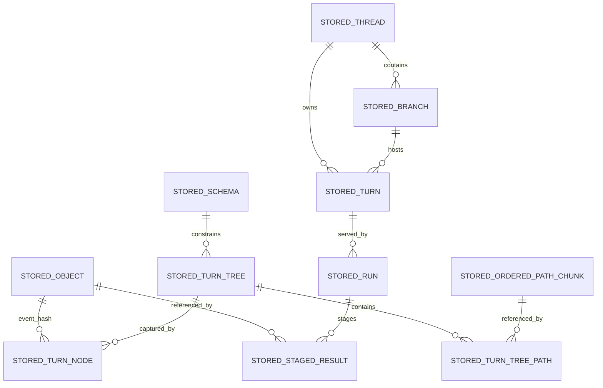

# Technical Specification

## 0. Version History & Changelog
- v0.2.3 - Defined the backend adapter repository interfaces and the `createMemoryBackend` factory surface so backend implementations no longer depend on implied persistence contracts.
- v0.2.2 - Defined the concrete TypeScript kernel-contract shapes for `StepContext`, `ObserveResult`, and kernel observe signals so the run lifecycle surface no longer depends on implied upstream payload structure.
- v0.2.1 - Added the shared `KrakenError` foundation contract so stable error codes and category subclasses are specified before later framework and backend work depends on them.
- v0.2.0 - Locked the authoritative implementation posture: protocol-first kernel, TypeScript first implementation, AI SDK bridge-only provider baseline, strict uniform backend contract, official `memory` and `sqlite` backends, deterministic CBOR plus SHA-256 identity rules, integer-only core record profile, path-granular TurnTree storage with threshold-based chunking for ordered paths, and an architecture-first `devenv + nx` monorepo layout grouped by boundary, contract, and implementation language.
- ... [Older history truncated, refer to git logs]

## 1. Stack Specification (Bill of Materials)
- **Primary Language / Runtime:** TypeScript `6.0.2` is the first authoritative implementation language for the framework and kernel protocol implementation. The kernel protocol remains language-neutral by contract. Core TypeScript packages target portable ESM across Bun, Node.js, and Deno. Bun remains the preferred local development runtime and package manager.
- **Primary Frameworks / Libraries:** `ai@6.0.142` and `@ai-sdk/provider@3.0.8` for the baseline AI SDK Providers bridge; `ajv@8.18.0` for JSON Schema validation; `cbor-x@1.6.4` for deterministic CBOR encoding and decoding in the TypeScript implementation; `@biomejs/biome@2.4.10` for formatting and linting; `tsup@8.5.1` for package builds.
- **State Stores / Persistence:** Kraken-owned backend contract first. `@kraken/backend-memory` is the reference development and semantic test backend. `@kraken/backend-sqlite` is the first officially supported persistent backend adapter. Future backends such as PostgreSQL, MySQL/MariaDB, and MongoDB are peer adapters against the same kernel contract, not SQLite-shaped variants.
- **Infrastructure / Tooling:** `devenv` for reproducible development environments, `nx@22.6.3` plus aligned `@nx/*` packages for TypeScript project orchestration, Bun workspaces, root TypeScript project references, `tsup` package builds, structured JSON logging, exact dependency pinning in `package.json` plus `bun.lock`, and environment-variable-based provider credentials at bridge boundaries.
- **Testing / Quality Tooling:** `bun test`, `tsc --noEmit`, Biome, deterministic CBOR golden-byte tests, hash identity fixtures, shared backend conformance suites, checkpoint/recovery scenario tests, and AI SDK bridge contract fixtures.
- **Version Pinning / Compatibility Policy:** Versions named in this TechSpec are authoritative for the baseline implementation line and must match the repository manifests. Public package APIs follow semantic versioning. Changes to kernel record encoding, hash algorithm, or durable identity rules are semver-major.

### 1.1 Implementation Posture
- **Authoritative center:** The kernel boundary is a protocol of serializable data, not an in-process callback API.
- **First implementation choice:** TypeScript is the first authoritative implementation of that protocol for speed of validation, not a claim that the kernel is fundamentally JavaScript-bound.
- **Portability posture:** Core packages stay runtime-portable where practical; backend packages and provider bridges may have narrower runtime support when their dependencies require it.
- **Provider posture:** Kraken owns the canonical provider contract. The baseline bridge surface is AI SDK Providers only. LangChain is intentionally out of baseline scope. First-class Kraken provider packages for major providers are expected later.
- **Backend posture:** All official backends implement one strict kernel-visible contract. Backend-specific optimizations may exist internally, but they must not change kernel semantics or require capability negotiation at the kernel layer in v0.1.

### 1.2 Current-State vs Target-State
- **Current repository reality:** The repository currently contains governing documents only: `constitution/` and `docs/`.
- **Target implementation state:** The package layout and interfaces defined below are the intended implementation target for the first authoritative code line.
- **Drift rule:** The future codebase must conform to this TechSpec. The TechSpec must not be treated as a loose commentary on whatever structure happens to emerge.

## 2. Architecture Decision Records (ADRs)
### ADR-001 The Kernel Boundary Is Protocol-First and Data-Only
- **Status:** accepted
- **Context:** The frozen kernel specification explicitly defines the kernel-framework boundary as a protocol where everything crossing the boundary is serializable data. Future multi-language SDKs and future non-TypeScript kernel implementations depend on preserving this narrow waist.
- **Decision:** The authoritative kernel boundary is a language-neutral protocol of concrete data structures and operations. No callbacks, framework types, or runtime-specific object identities cross the boundary.
- **Consequences:** The TechSpec must define exact record shapes, byte encoding, hashing, and operation signatures. TypeScript APIs above the kernel are framework SDK surfaces, not substitutes for the kernel protocol.

### ADR-002 TypeScript Is the First Authoritative Implementation, Not the Long-Term Kernel Monopoly
- **Status:** accepted
- **Context:** The project needs a fast path to validating the kernel and framework semantics, but the protocol must remain suitable for future Rust, Wasm, or other implementations.
- **Decision:** Use TypeScript `6.0.2` for the first authoritative implementation of the framework and kernel protocol. Treat it as the reference implementation of the protocol, not as a license to collapse protocol boundaries into JavaScript-only assumptions.
- **Consequences:** The implementation can progress quickly, while future Rust or Wasm implementations remain possible if they pass the same protocol fixtures and semantic test suites.

### ADR-003 Ship as a Modular Monorepo of Boundary-Owned Projects, Not as Multiple Services
- **Status:** accepted
- **Context:** The architecture is explicitly modular but intentionally in-process and solo-developer-friendly.
- **Decision:** Realize the approved logical containers as projects in one monorepo, grouped first by architectural boundary and then by contract versus implementation, rather than as separate deployable services.
- **Consequences:** Boundary discipline is preserved without adding network topology, deployment orchestration, or remote protocol complexity before it is justified. The repository structure mirrors the architecture docs instead of centering JavaScript package-manager conventions.

### ADR-004 The Framework Public Surface Remains Library-First
- **Status:** accepted
- **Context:** Kraken is a framework for developers to embed, not a mandatory network service. The architecture’s host boundary is an embedding surface.
- **Decision:** The primary TypeScript framework surface remains a library API centered on `KrakenRuntime`, `ExecutionHandle`, typed events, provider ports, and backend ports.
- **Consequences:** HTTP, WebSocket, CLI, editor, and protocol adapters are secondary packages layered over the library API. This does not weaken the protocol-first kernel boundary because the library surface sits above it.

### ADR-005 The Baseline Provider Strategy Is Kraken Contract Plus AI SDK Providers Bridge
- **Status:** accepted
- **Context:** The framework owns the canonical provider contract. Supporting multiple bridge ecosystems before the core runtime is proven would add translation surface and semantic drift for little value.
- **Decision:** The baseline provider integration package is `@kraken/provider-bridge-ai-sdk`, built on `ai@6.0.142` and `@ai-sdk/provider@3.0.8`. LangChain is not part of the baseline implementation. First-class Kraken provider packages are deferred but expected.
- **Consequences:** The initial provider surface stays narrow and Kraken-native. Future packages such as `@kraken/provider-openai`, `@kraken/provider-anthropic`, and `@kraken/provider-google` can be added later without redefining the framework contract.

### ADR-006 Official Backends Use One Strict Uniform Kernel Contract
- **Status:** accepted
- **Context:** Kraken is a framework, not a storage product. Developers must be able to move between backends without kernel-semantic drift.
- **Decision:** All official backends implement one strict kernel contract. Optional backend capabilities are not exposed at the kernel layer in v0.1.
- **Consequences:** Shared backend conformance suites remain authoritative. Backend-specific performance tricks stay internal. The framework and future SDKs do not branch on backend feature flags.

### ADR-007 Memory and SQLite Are the Official Initial Backends
- **Status:** accepted
- **Context:** The project needs a usable development backend immediately and a usable persistent backend package without pretending that one backend defines Kraken’s ontology.
- **Decision:** `@kraken/backend-memory` is the reference non-persistent backend for development and semantic testing. `@kraken/backend-sqlite` is the first officially supported persistent backend adapter.
- **Consequences:** SQLite is the first official persistent implementation, but not the canonical physical model for all future backends. PostgreSQL, MySQL/MariaDB, MongoDB, and others remain peer adapters against the same kernel contract.

### ADR-008 Structured Kernel Records Use Deterministic CBOR and Opaque Objects Hash Raw Bytes
- **Status:** accepted
- **Context:** Kernel identity needs a compact, deterministic, multi-language-friendly encoding. Canonical JSON is human-readable, but it carries JSON number and ECMAScript canonicalization constraints that are not ideal for durable kernel identity.
- **Decision:** Structured kernel records are encoded as deterministic CBOR before hashing. Opaque stored objects are hashed from raw bytes without re-encoding.
- **Consequences:** The kernel’s identity format is binary, deterministic, and language-neutral. JSON remains a debugging, export, and tooling format, not the canonical storage identity format.

### ADR-009 SHA-256 Is the Canonical Hash Algorithm
- **Status:** accepted
- **Context:** Durable identity must work cleanly across TypeScript, Python, Go, Rust, Bun, Node.js, Deno, and edge/Wasm-friendly environments with minimal dependency friction.
- **Decision:** Kraken uses SHA-256 as the canonical hash algorithm for both opaque object bytes and deterministic-CBOR structured records.
- **Consequences:** Hash identity uses ubiquitous primitives available in WebCrypto and standard libraries. Faster alternatives such as BLAKE3 are intentionally not used for canonical identity in v0.1.

### ADR-010 Core Kernel Records Use a Restricted Integer-Oriented Data Model
- **Status:** accepted
- **Context:** Cross-language deterministic encoding gets riskier when floats, tags, and broad dynamic types are allowed into core kernel records.
- **Decision:** Core kernel records are restricted to maps with string keys, arrays, text, byte strings, booleans, nulls, and integers. Floating-point values are not allowed in normative kernel records. Persisted timestamps are signed Unix epoch millisecond integers.
- **Consequences:** Deterministic CBOR encoding remains simple and predictable. Float-bearing data, if ever needed, must live in opaque objects, extension state, or higher-layer provider/application payloads, not in core kernel records.

### ADR-011 TurnTree Storage Is Path-Granular with Threshold-Based Chunking for Ordered Paths
- **Status:** accepted
- **Context:** The kernel contract is expressed in path values, not in generic subtree fragments. Ordered paths such as `messages` can grow large enough that flat rewrites become expensive, but a fully generic Merkle-fragment engine would overfit the problem.
- **Decision:** TurnTree semantics remain path-granular. Ordered paths are logically `Hash[]`; single paths are logically `Hash | null`. Internally, ordered paths start flat and may promote to append-optimized fixed-size chunked storage after crossing an implementation-defined threshold. Chunking is invisible at the protocol layer.
- **Consequences:** The public model stays simple while long ordered paths avoid pathological rewrite amplification. Numeric threshold and chunk-size values remain implementation constants, not protocol constants.

### ADR-012 TypeScript Tooling Uses Biome and tsup
- **Status:** accepted
- **Context:** The project explicitly prefers Bun-based workflows, Biome, and `tsup`.
- **Decision:** Use `@biomejs/biome@2.4.10` for linting and formatting and `tsup@8.5.1` for package builds.
- **Consequences:** The implementation posture is no longer ambiguous or tool-default-driven. Config, scripts, and examples must reflect this choice directly.

### ADR-013 Workspace Orchestration Uses devenv and Nx
- **Status:** accepted
- **Context:** The project explicitly fixed `devenv + nx` as non-negotiable workspace tooling and the repository now uses a boundary-grouped architecture-first layout.
- **Decision:** Use `devenv` as the reproducible developer environment entry point and pin `nx@22.6.3` with aligned `@nx/workspace@22.6.3` and `@nx/js@22.6.3` for orchestration of the TypeScript subtree.
- **Consequences:** Environment pinning lives in Nix/devenv configuration rather than npm manifests alone. Nx project orchestration is first-class, but limited to the TypeScript subtree and does not define the overall repository ontology.

### 2.1 Compatibility Record
- **Kernel identity compatibility:** Changes to deterministic CBOR profile, SHA-256 usage, hash string representation, or durable record shapes are semver-major.
- **Framework public API compatibility:** Breaking changes to exported TypeScript library contracts require a semver-major release.
- **Backend compatibility:** All official backends must preserve the same kernel semantics. Physical schemas may differ by backend.
- **Provider compatibility:** AI SDK bridge upgrades may happen in minor releases only if the Kraken-owned provider contract remains unchanged and contract fixtures still pass.

## 3. State & Data Modeling
### 3.1 Canonical Kernel Record Profile
- **Purpose:** Define the durable data profile that all kernel implementations and backends must preserve.
- **Storage Shape:** Structured kernel records are deterministic CBOR maps with string keys. Opaque objects remain raw bytes plus media type metadata.
- **Constraints / Invariants:**
  - Hashes are lowercase hex-encoded SHA-256 digests.
  - Core kernel records do not use floating-point values.
  - Persisted timestamps are signed Unix epoch milliseconds.
  - Core kernel records do not use CBOR indefinite lengths.
  - Core kernel records do not use CBOR tags in v0.1.
  - TypeScript implementations must reject `NaN`, `Infinity`, non-safe integers, and non-canonical record shapes before persistence.
- **Indexes / Access Paths:** Hash-addressable records for all immutable entities; lineage walks by `previousTurnNodeHash`; run-scoped staging by `(runId, taskId)`.
- **Migration Notes:** Record profile changes are protocol changes and therefore semver-major.

#### Primitive Aliases
- `HashString`
  - lowercase hex string of a 32-byte SHA-256 digest
- `EpochMs`
  - signed integer Unix epoch milliseconds
- `KernelRecord`
  - deterministic-CBOR-encodable value using the restricted profile above

### 3.2 Canonical Entity Shapes
- **Purpose:** Define the exact logical records the TypeScript implementation persists and hashes.
- **Storage Shape:** Immutable records encoded with deterministic CBOR unless the item is an opaque Object blob.
- **Constraints / Invariants:**
  - `StoredObject.bytes` are hashed as raw bytes.
  - Every other record below is hashed from deterministic CBOR bytes.
  - `schemaId`, `threadId`, `branchId`, `turnId`, `runId`, and `taskId` are opaque framework/kernel identifiers and are never derived from storage vendor internals.
  - `StoredTurnTree.manifestCbor` is the immutable cached full-manifest representation of the logical TurnTree. `StoredTurnTreePath` rows are the backend-side indexed path realization used for efficient `resolve`, `diff`, and ordered-path chunking. Both must always describe the same logical TurnTree.
- **Indexes / Access Paths:** As listed per entity below.
- **Migration Notes:** Field additions require explicit compatibility handling; field removals or semantic changes are semver-major.

#### Canonical Entity Definitions
- `StoredObject`
  - `hash: HashString`
  - `mediaType: string`
  - `bytes: Uint8Array`
  - `byteLength: number`
  - `createdAtMs: EpochMs`
- `StoredSchema`
  - `schemaId: string`
  - `schemaCbor: Uint8Array`
  - `createdAtMs: EpochMs`
- `StoredTurnTree`
  - `hash: HashString`
  - `schemaId: string`
  - `manifestCbor: Uint8Array`
  - `createdAtMs: EpochMs`
  - identity note: `hash` is derived from the logical tree identity tuple `{ schemaId, manifest }`, so identical manifests under different schemas never alias
- `StoredTurnTreePath`
  - `turnTreeHash: HashString`
  - `path: string`
  - `collectionKind: "single" | "ordered"`
  - `singleHash?: HashString | null`
  - `orderedEncoding?: "flat" | "chunked"`
  - `orderedCount?: number`
  - `orderedInlineCbor?: Uint8Array`
  - `orderedChunkListCbor?: Uint8Array`
- `StoredOrderedPathChunk`
  - `chunkHash: HashString`
  - `itemCount: number`
  - `itemsCbor: Uint8Array`
  - `createdAtMs: EpochMs`
  - identity note: `chunkHash` is derived from the deterministic-CBOR logical chunk item list represented by `itemsCbor`; `itemCount` and `createdAtMs` are not identity inputs
- `StoredTurnNode`
  - `hash: HashString`
  - `previousTurnNodeHash: HashString | null`
  - `turnTreeHash: HashString`
  - `consumedStagedResultsCbor: Uint8Array`
  - `schemaId: string`
  - `eventHash: HashString | null`
  - `createdAtMs: EpochMs`
  - identity note: `hash` is derived from the logical TurnNode fields excluding `hash` itself; stored metadata such as `createdAtMs` is not part of the logical TurnNode identity
- `StoredThread`
  - `threadId: string`
  - `schemaId: string`
  - `rootTurnNodeHash: HashString`
  - `createdAtMs: EpochMs`
- `StoredBranch`
  - `branchId: string`
  - `threadId: string`
  - `headTurnNodeHash: HashString`
  - `archivedFromBranchId?: string`
  - `createdAtMs: EpochMs`
  - `updatedAtMs: EpochMs`
- `StoredTurn`
  - `turnId: string`
  - `threadId: string`
  - `branchId: string`
  - `parentTurnId: string | null`
  - `startTurnNodeHash: HashString`
  - `headTurnNodeHash: HashString`
  - `createdAtMs: EpochMs`
  - `updatedAtMs: EpochMs`
- `StoredRun`
  - `runId: string`
  - `turnId: string`
  - `branchId: string`
  - `schemaId: string`
  - `startTurnNodeHash: HashString`
  - `status: "running" | "paused" | "completed" | "failed"`
  - `currentStepIndex: number`
  - `stepSequenceCbor: Uint8Array`
  - `createdTurnNodesCbor: Uint8Array`
  - `createdAtMs: EpochMs`
  - `updatedAtMs: EpochMs`
- `StoredStagedResult`
  - `runId: string`
  - `taskId: string`
  - `objectHash: HashString`
  - `objectType: string`
  - `status: "completed" | "failed" | "interrupted"`
  - `interruptPayloadCbor?: Uint8Array`
  - `createdAtMs: EpochMs`



### 3.3 TurnTree Physical Realization
- **Purpose:** Concretize how the first implementation realizes path-granular TurnTrees without changing the frozen protocol.
- **Storage Shape:** Path-granular manifests plus internal ordered-path chunk storage where needed.
- **Constraints / Invariants:**
  - The protocol-facing meaning of an ordered path is always `Hash[]`.
  - The protocol-facing meaning of a single path is always `Hash | null`.
  - Ordered paths begin as flat inline sequences.
  - Ordered paths may promote to chunked storage after crossing an implementation-defined threshold.
  - Promotion is invisible to callers of `tree.resolve()` and `tree.manifest()`.
  - Chunk storage is append-optimized, fixed-size, and uses whole-chunk structural sharing.
  - Threshold and chunk-size numeric values are implementation constants, not protocol constants.
- **Indexes / Access Paths:**
  - by `(turnTreeHash, path)` for path lookup
  - by `chunkHash` for chunk reuse
  - by `turnTreeHash` for manifest reconstruction
- **Migration Notes:** Physical chunk policy may evolve without changing the protocol so long as `tree.create`, `tree.incorporate`, `tree.resolve`, `tree.diff`, and `tree.manifest` preserve the same behavior.

### 3.4 Backend Adapter Model
- **Purpose:** Define what it means for a backend package to be an official Kraken backend.
- **Storage Shape:** Each backend package is a concrete implementation of the kernel storage contract. Physical schema is backend-specific.
- **Constraints / Invariants:**
  - Every official backend implements the full kernel contract.
  - No official backend exposes kernel-visible optional capabilities in v0.1.
  - No official backend may weaken the kernel’s required atomicity, lineage, or recovery guarantees.
  - Backends may optimize internally, but optimization must not change semantics.
- **Conformance note:** Shared backend contract tests are the authority for semantic conformance.
- **Product note:** `@kraken/backend-memory` is intentionally non-persistent and must not be described as satisfying the durable-runtime guarantees of the PRD or kernel spec.
- **Indexes / Access Paths:** Backend-specific, but all must satisfy the canonical access patterns named in §§3.1-3.3.
- **Migration Notes:** Each backend package owns its own migration mechanism and version history.

### 3.5 SQLite Backend Schema
- **Purpose:** Specify the first official persistent backend package concretely enough to implement without guesswork.
- **Storage Shape:** Embedded in-process SQLite database using WAL mode and `BEGIN IMMEDIATE` transactions for kernel writes.
- **Constraints / Invariants:**
  - Foreign keys enabled.
  - WAL mode enabled.
  - Kernel write transactions use `BEGIN IMMEDIATE` and commit atomically.
  - The first SQLite backend implementation uses `better-sqlite3@12.8.0`.
  - Because of that binding choice, the first SQLite backend implementation targets Node.js runtimes with local filesystem access and native addon support.
  - SQLite backend is not an edge/serverless target in v0.1.
  - SQLite is the first official persistent backend, not the canonical physical model for all future backends.
- **Indexes / Access Paths:** Listed per table below.
- **Migration Notes:** Forward-only SQL migrations owned by `@kraken/backend-sqlite`.

#### SQLite Tables
- `objects`
  - columns: `hash TEXT PRIMARY KEY`, `media_type TEXT NOT NULL`, `bytes BLOB NOT NULL`, `byte_length INTEGER NOT NULL`, `created_at_ms INTEGER NOT NULL`
  - indexes: primary key on `hash`
- `schemas`
  - columns: `schema_id TEXT PRIMARY KEY`, `schema_cbor BLOB NOT NULL`, `created_at_ms INTEGER NOT NULL`
  - indexes: primary key on `schema_id`
- `turn_trees`
  - columns: `hash TEXT PRIMARY KEY`, `schema_id TEXT NOT NULL`, `manifest_cbor BLOB NOT NULL`, `created_at_ms INTEGER NOT NULL`
  - foreign keys: `schema_id -> schemas(schema_id)`
  - indexes: primary key on `hash`, secondary on `schema_id`
- `turn_tree_paths`
  - columns: `turn_tree_hash TEXT NOT NULL`, `path TEXT NOT NULL`, `collection_kind TEXT NOT NULL`, `single_hash TEXT NULL`, `ordered_encoding TEXT NULL`, `ordered_count INTEGER NULL`, `ordered_inline_cbor BLOB NULL`, `ordered_chunk_list_cbor BLOB NULL`
  - primary key: `(turn_tree_hash, path)`
  - foreign keys: `turn_tree_hash -> turn_trees(hash)`
  - indexes: primary key, secondary on `(path, turn_tree_hash)`
- `ordered_path_chunks`
  - columns: `chunk_hash TEXT PRIMARY KEY`, `item_count INTEGER NOT NULL`, `items_cbor BLOB NOT NULL`, `created_at_ms INTEGER NOT NULL`
  - indexes: primary key on `chunk_hash`
- `turn_nodes`
  - columns: `hash TEXT PRIMARY KEY`, `previous_turn_node_hash TEXT NULL`, `turn_tree_hash TEXT NOT NULL`, `consumed_staged_results_cbor BLOB NOT NULL`, `schema_id TEXT NOT NULL`, `event_hash TEXT NULL`, `created_at_ms INTEGER NOT NULL`
  - foreign keys: `previous_turn_node_hash -> turn_nodes(hash)`, `turn_tree_hash -> turn_trees(hash)`, `schema_id -> schemas(schema_id)`, `event_hash -> objects(hash)`
  - indexes: primary key on `hash`, secondary on `previous_turn_node_hash`, `turn_tree_hash`
- `threads`
  - columns: `thread_id TEXT PRIMARY KEY`, `schema_id TEXT NOT NULL`, `root_turn_node_hash TEXT NOT NULL`, `created_at_ms INTEGER NOT NULL`
  - foreign keys: `schema_id -> schemas(schema_id)`, `root_turn_node_hash -> turn_nodes(hash)`
  - indexes: primary key on `thread_id`
- `branches`
  - columns: `branch_id TEXT PRIMARY KEY`, `thread_id TEXT NOT NULL`, `head_turn_node_hash TEXT NOT NULL`, `archived_from_branch_id TEXT NULL`, `created_at_ms INTEGER NOT NULL`, `updated_at_ms INTEGER NOT NULL`
  - foreign keys: `thread_id -> threads(thread_id)`, `head_turn_node_hash -> turn_nodes(hash)`, `archived_from_branch_id -> branches(branch_id)`
  - indexes: primary key on `branch_id`, secondary on `thread_id`, `head_turn_node_hash`
- `turns`
  - columns: `turn_id TEXT PRIMARY KEY`, `thread_id TEXT NOT NULL`, `branch_id TEXT NOT NULL`, `parent_turn_id TEXT NULL`, `start_turn_node_hash TEXT NOT NULL`, `head_turn_node_hash TEXT NOT NULL`, `created_at_ms INTEGER NOT NULL`, `updated_at_ms INTEGER NOT NULL`
  - foreign keys: `thread_id -> threads(thread_id)`, `branch_id -> branches(branch_id)`, `parent_turn_id -> turns(turn_id)`, `start_turn_node_hash -> turn_nodes(hash)`, `head_turn_node_hash -> turn_nodes(hash)`
  - indexes: primary key on `turn_id`, secondary on `thread_id`, `branch_id`, `parent_turn_id`
- `runs`
  - columns: `run_id TEXT PRIMARY KEY`, `turn_id TEXT NOT NULL`, `branch_id TEXT NOT NULL`, `schema_id TEXT NOT NULL`, `start_turn_node_hash TEXT NOT NULL`, `status TEXT NOT NULL`, `current_step_index INTEGER NOT NULL`, `step_sequence_cbor BLOB NOT NULL`, `created_turn_nodes_cbor BLOB NOT NULL`, `created_at_ms INTEGER NOT NULL`, `updated_at_ms INTEGER NOT NULL`
  - foreign keys: `turn_id -> turns(turn_id)`, `branch_id -> branches(branch_id)`, `schema_id -> schemas(schema_id)`, `start_turn_node_hash -> turn_nodes(hash)`
  - indexes: primary key on `run_id`, secondary on `turn_id`, `branch_id`, `(branch_id, status)`
- `staged_results`
  - columns: `run_id TEXT NOT NULL`, `task_id TEXT NOT NULL`, `object_hash TEXT NOT NULL`, `object_type TEXT NOT NULL`, `status TEXT NOT NULL`, `interrupt_payload_cbor BLOB NULL`, `created_at_ms INTEGER NOT NULL`
  - primary key: `(run_id, task_id)`
  - foreign keys: `run_id -> runs(run_id)`, `object_hash -> objects(hash)`
  - indexes: primary key, secondary on `(run_id, status)`, `object_hash`

## 4. Interface Contract
### 4.0 Shared Error Foundation
- **Style:** shared cross-boundary TypeScript contract
- **Ownership:** `@kraken/shared-core-types` owns the shared error base class and category subclasses. Concrete packages own their package-specific `code` values and message text.
- **Compatibility Strategy:** `KrakenError` shape, subclass names, and stable `code` values are semver-governed public API. Adding a new error subclass is semver-minor. Changing or removing an existing stable `code` is semver-major.
- **Code policy:** every `KrakenError` carries a stable lowercase snake_case `code`. Category is conveyed by the subclass, not by a required string prefix.
- **Projection rule:** when errors cross logging, streaming, or host boundaries, implementations must preserve at least `name`, `message`, `code`, and optional `details`.

```ts
export type KrakenErrorCode = string;

export interface KrakenErrorOptions {
  code: KrakenErrorCode;
  cause?: unknown;
  details?: unknown;
}

export abstract class KrakenError extends Error {
  readonly code: KrakenErrorCode;
  readonly details?: unknown;
  override readonly cause?: unknown;

  protected constructor(message: string, options: KrakenErrorOptions);
}

export class KrakenValidationError extends KrakenError {}
export class KrakenPersistenceError extends KrakenError {}
export class KrakenLineageError extends KrakenError {}
export class KrakenRecoveryError extends KrakenError {}
export class KrakenRuntimeError extends KrakenError {}
export class KrakenProviderError extends KrakenError {}
```

Concrete code examples already defined in the authoritative specs such as `structured_output_validation` and `invalid_loop_policy` are `KrakenRuntimeError` codes. Backend-specific failures must normalize to `KrakenPersistenceError` codes before surfacing through shared contracts.

### 4.1 Host-Facing TypeScript Framework API
- **Style:** library API
- **Authentication / Authorization:** Not built into Kraken. Host applications authenticate and authorize their own callers before exposing runtime operations.
- **Compatibility Strategy:** Exported TypeScript framework APIs follow semantic versioning. Additive methods and additive optional fields are minor-compatible.
- **Error model:** Typed `KrakenError` subclasses with stable `code` values plus canonical `error` stream events.

```ts
export type HashString = string;
export type EpochMs = number; // must always be a safe integer

export interface KrakenRuntime {
  createThread(input: {
    threadId?: string;
    schemaId?: string;
    initialBranchId?: string;
  }): Promise<{
    threadId: string;
    branchId: string;
    rootTurnNodeHash: HashString;
    rootTurnTreeHash: HashString;
  }>;

  getThread(threadId: string): Promise<{
    threadId: string;
    schemaId: string;
    rootTurnNodeHash: HashString;
  } | null>;

  createBranch(input: {
    branchId?: string;
    threadId: string;
    fromTurnNodeHash: HashString;
  }): Promise<{
    branchId: string;
    threadId: string;
    headTurnNodeHash: HashString;
  }>;

  setBranchHead(input: {
    branchId: string;
    turnNodeHash: HashString;
  }): Promise<{
    branchId: string;
    headTurnNodeHash: HashString;
    archiveBranchId?: string;
  }>;

  executeTurn(input: {
    signal: InputSignal;
    threadId: string;
    branchId: string;
    schemaId?: string;
    config: AgentConfig;
    tools?: KrakenToolDefinition[];
    parentTurnId?: string | null;
  }): ExecutionHandle;
}

export interface ExecutionHandle {
  events(): AsyncIterable<KrakenStreamEvent>;
  cancel(): void;
  steer(signal: InputSignal): void;
  resolveApproval(response: ApprovalResponse): ExecutionHandle;
  status(): ExecutionStatus;
}
```

### 4.2 Kernel Protocol Surface
- **Style:** protocol-shaped library contract for the first TypeScript implementation
- **Authentication / Authorization:** Internal kernel boundary used by framework packages and backend adapters
- **Compatibility Strategy:** Protocol-first contract. Breaking changes to record shapes, operation signatures, or validation semantics are semver-major.
- **Error model:** `KrakenError` with persistence, validation, lineage, and recovery codes
- **Concrete payload rule:** The frozen kernel specification names `ObserveResult.annotations` as `Object[]` and `signals` as `Signal[]`, but does not define their first TypeScript wire shape. The authoritative TypeScript realization is:
  - observe annotations are `KernelObject[]` carried into `run.completeStep`, where the kernel remains responsible for persisting them per the frozen kernel specification
  - observe signals are `KernelRecord[]`, keeping them serializable and boundary-safe within the run lifecycle

```ts
export type KernelSignal = KernelRecord;
export type VerdictDisposition = "HardFail" | "SoftFail" | "EndTurn";

export interface ObserveResult {
  annotations: KernelObject[];
  signals: KernelSignal[];
}

export type Verdict =
  | { kind: "proceed" }
  | { kind: "abort"; disposition: VerdictDisposition; reason: string }
  | { kind: "modify"; transform: KernelRecord }
  | { kind: "pause"; reason: string; resumptionSchema: KernelRecord }
  | { kind: "retry"; adjustment: KernelRecord };

export type ComposedVerdict = Verdict;

export interface StepContext {
  currentTurnNodeHash: HashString;
  schema: TurnTreeSchema;
  step: StepDeclaration;
  signals: KernelSignal[];
}

export interface KrakenKernel {
  store: {
    put(blob: Uint8Array, mediaType?: string): Promise<HashString>;
    get(hash: HashString): Promise<Uint8Array | null>;
    has(hash: HashString): Promise<boolean>;
  };

  schema: {
    register(schema: TurnTreeSchema): Promise<string>;
    get(schemaId: string): Promise<TurnTreeSchema | null>;
  };

  tree: {
    create(
      schemaId: string,
      changes: Record<string, HashString[] | HashString | null>,
      baseTurnTreeHash?: HashString
    ): Promise<HashString>;
    incorporate(
      baseTurnTreeHash: HashString,
      stagedResults: StagedResult[]
    ): Promise<HashString>;
    diff(treeHashA: HashString, treeHashB: HashString): Promise<string[]>;
    resolve(
      treeHash: HashString,
      path: string
    ): Promise<HashString[] | HashString | null>;
    manifest(
      treeHash: HashString
    ): Promise<Record<string, HashString[] | HashString | null>>;
  };

  node: {
    get(hash: HashString): Promise<TurnNode | null>;
    walkBack(fromHash: HashString): AsyncIterable<TurnNode>;
  };

  thread: {
    create(
      threadId: string,
      schemaId: string,
      initialBranchId: string
    ): Promise<ThreadCreateResult>;
    get(threadId: string): Promise<ThreadRecord | null>;
  };

  branch: {
    create(
      branchId: string,
      threadId: string,
      fromTurnNodeHash: HashString
    ): Promise<BranchRecord>;
    get(branchId: string): Promise<BranchRecord | null>;
    setHead(
      branchId: string,
      turnNodeHash: HashString
    ): Promise<SetHeadResult>;
    list(threadId: string): Promise<Array<[string, HashString]>>;
  };

  staging: {
    stage(
      runId: string,
      blob: Uint8Array,
      taskId: string,
      objectType: string,
      status: "completed" | "failed" | "interrupted",
      interruptPayload?: KernelRecord
    ): Promise<{ objectHash: HashString; stagedResult: StagedResult }>;
    current(runId: string): Promise<StagedResult[]>;
  };

  run: {
    create(
      runId: string,
      turnId: string,
      branchId: string,
      schemaId: string,
      startTurnNodeHash: HashString,
      steps: StepDeclaration[]
    ): Promise<RunRecord>;
    beginStep(runId: string, stepId: string): Promise<StepContext>;
    completeStep(
      runId: string,
      stepId: string,
      eventHash?: HashString,
      observeResults?: ObserveResult[],
      treeHash?: HashString
    ): Promise<{ checkpointed: boolean; turnNodeHash?: HashString }>;
    complete(
      runId: string,
      status: "completed" | "failed" | "paused",
      eventHash?: HashString
    ): Promise<{ turnNodeHash?: HashString }>;
    recover(runId: string): Promise<RecoveryState>;
  };

  verdicts: {
    compose(verdicts: Verdict[]): Promise<ComposedVerdict>;
  };

  turn: {
    create(
      turnId: string,
      threadId: string,
      branchId: string,
      parentTurnId: string | null | undefined,
      startTurnNodeHash: HashString
    ): Promise<TurnRecord>;
    get(turnId: string): Promise<TurnRecord | null>;
    updateHead(turnId: string, headTurnNodeHash: HashString): Promise<void>;
  };
}
```

### 4.3 Backend Adapter Contract
- **Style:** library API
- **Authentication / Authorization:** Backends are internal persistence adapters selected by hosts/framework configuration, not end-user entry points
- **Compatibility Strategy:** Strict shared contract across all official backends
- **Error model:** backend-specific errors normalized into `KrakenError` persistence codes

```ts
export interface KrakenBackend {
  transact<T>(work: (tx: KrakenBackendTx) => Promise<T>): Promise<T>;
  health(): Promise<{ ok: true } | { ok: false; reason: string }>;
}

export interface ObjectRepository {
  get(hash: HashString): Promise<StoredObject | null>;
  has(hash: HashString): Promise<boolean>;
  put(record: StoredObject): Promise<void>;
}

export interface SchemaRepository {
  get(schemaId: string): Promise<StoredSchema | null>;
  put(record: StoredSchema): Promise<void>;
}

export interface TurnTreeRepository {
  get(hash: HashString): Promise<StoredTurnTree | null>;
  put(record: StoredTurnTree): Promise<void>;
}

export interface TurnTreePathRepository {
  get(
    turnTreeHash: HashString,
    path: string
  ): Promise<StoredTurnTreePath | null>;
  listByTurnTree(turnTreeHash: HashString): Promise<StoredTurnTreePath[]>;
  putMany(records: StoredTurnTreePath[]): Promise<void>;
}

export interface OrderedPathChunkRepository {
  get(chunkHash: HashString): Promise<StoredOrderedPathChunk | null>;
  put(record: StoredOrderedPathChunk): Promise<void>;
}

export interface TurnNodeRepository {
  get(hash: HashString): Promise<StoredTurnNode | null>;
  put(record: StoredTurnNode): Promise<void>;
}

export interface ThreadRepository {
  get(threadId: string): Promise<StoredThread | null>;
  put(record: StoredThread): Promise<void>;
}

export interface BranchRepository {
  get(branchId: string): Promise<StoredBranch | null>;
  listByThread(threadId: string): Promise<StoredBranch[]>;
  set(record: StoredBranch): Promise<void>;
}

export interface TurnRepository {
  get(turnId: string): Promise<StoredTurn | null>;
  set(record: StoredTurn): Promise<void>;
}

export interface RunRepository {
  get(runId: string): Promise<StoredRun | null>;
  listByBranch(branchId: string): Promise<StoredRun[]>;
  set(record: StoredRun): Promise<void>;
}

export interface StagedResultRepository {
  clearRun(runId: string): Promise<void>;
  get(runId: string, taskId: string): Promise<StoredStagedResult | null>;
  listByRun(runId: string): Promise<StoredStagedResult[]>;
  set(record: StoredStagedResult): Promise<void>;
}

export interface KrakenBackendTx {
  objects: ObjectRepository;
  schemas: SchemaRepository;
  turnTrees: TurnTreeRepository;
  turnTreePaths: TurnTreePathRepository;
  orderedPathChunks: OrderedPathChunkRepository;
  turnNodes: TurnNodeRepository;
  threads: ThreadRepository;
  branches: BranchRepository;
  turns: TurnRepository;
  runs: RunRepository;
  stagedResults: StagedResultRepository;
}

export interface MemoryBackendOptions {
  now?: () => EpochMs;
}

export declare function createMemoryBackend(
  options?: MemoryBackendOptions
): KrakenBackend;
```

### 4.4 Provider Bridge Contract
- **Style:** library API
- **Authentication / Authorization:** Credentials stay in bridge configuration and host environment resolution; they are never persisted as core runtime state
- **Compatibility Strategy:** Kraken owns the provider contract; the AI SDK bridge adapts to external package changes behind it
- **Error model:** Provider and bridge failures normalize into Kraken provider errors with bridge-specific diagnostics

```ts
export interface KrakenProvider {
  readonly id: string;
  generate(prompt: KrakenPrompt): Promise<KrakenModelResponse>;
  stream(prompt: KrakenPrompt): AsyncIterable<ProviderStreamChunk>;
}

export interface StructuredOutputRequest {
  schema: JSONSchema;
  name?: string;
  strict?: boolean;
}

export interface KrakenPrompt {
  messages: KrakenMessage[];
  tools?: RenderedToolDefinition[];
  config?: KrakenModelConfig;
  responseFormat?: StructuredOutputRequest;
}

export type ProviderStreamChunk =
  | { type: "text_delta"; text: string }
  | { type: "reasoning_delta"; text: string; signature?: string }
  | { type: "reasoning_done" }
  | { type: "structured_delta"; delta: string }
  | { type: "structured_done"; data: unknown; name?: string }
  | { type: "tool_call_start"; providerCallId: string; name: string }
  | { type: "tool_call_args_delta"; providerCallId: string; delta: string }
  | { type: "tool_call_done"; providerCallId: string; name: string; input: unknown }
  | {
      type: "finish";
      finishReason: "stop" | "tool_call" | "length" | "error" | "content_filter";
      usage?: { inputTokens: number; outputTokens: number };
      providerMetadata?: Record<string, unknown>;
    }
  | { type: "error"; error: unknown };
```

### 4.5 Canonical Event Stream Contract
- **Style:** library API
- **Authentication / Authorization:** Controlled by the host embedding layer
- **Compatibility Strategy:** Existing event types and required fields are stable within a major version; minor releases may add event types or optional fields
- **Error model:** `error` events plus terminal `turn.end` where applicable

```ts
export interface EventSource {
  agent: string;
  workerId?: string;
  threadId?: string;
}

export type KrakenStreamEvent =
  | { type: "turn.start"; turnId: string; threadId: string; resumedFrom?: HashString; timestamp: EpochMs; source?: EventSource }
  | { type: "turn.end"; turnId: string; status: "completed" | "paused" | "failed"; timestamp: EpochMs; source?: EventSource }
  | { type: "iteration.start" | "iteration.end"; iterationCount: number; timestamp: EpochMs; source?: EventSource }
  | { type: "message.start"; messageId: string; role: "assistant"; timestamp: EpochMs; source?: EventSource }
  | { type: "text.delta"; messageId: string; delta: string; timestamp: EpochMs; source?: EventSource }
  | { type: "text.done"; messageId: string; text: string; timestamp: EpochMs; source?: EventSource }
  | { type: "reasoning.delta"; messageId: string; delta: string; timestamp: EpochMs; source?: EventSource }
  | { type: "reasoning.done"; messageId: string; timestamp: EpochMs; source?: EventSource }
  | { type: "structured.delta"; messageId: string; delta: string; timestamp: EpochMs; source?: EventSource }
  | { type: "structured.done"; messageId: string; data: unknown; name?: string; timestamp: EpochMs; source?: EventSource }
  | { type: "tool_call.start"; messageId: string; callId: string; name: string; timestamp: EpochMs; source?: EventSource }
  | { type: "tool_call.args_delta"; callId: string; delta: string; timestamp: EpochMs; source?: EventSource }
  | { type: "tool_call.done"; callId: string; name: string; input: unknown; timestamp: EpochMs; source?: EventSource }
  | { type: "message.done"; messageId: string; finishReason: "stop" | "tool_call" | "length" | "error" | "content_filter"; usage?: { inputTokens: number; outputTokens: number }; timestamp: EpochMs; source?: EventSource }
  | { type: "tool.start"; callId: string; name: string; input: unknown; timestamp: EpochMs; source?: EventSource }
  | { type: "tool.result"; callId: string; name: string; output: unknown; isError?: boolean; timestamp: EpochMs; source?: EventSource }
  | { type: "approval.requested"; request: ApprovalRequest; timestamp: EpochMs; source?: EventSource }
  | { type: "approval.resolved"; response: ApprovalResponse; timestamp: EpochMs; source?: EventSource }
  | { type: "steering.incorporated"; messageId: string; timestamp: EpochMs; source?: EventSource }
  | { type: "state.snapshot"; manifest: ContextManifest; timestamp: EpochMs; source?: EventSource }
  | { type: "state.checkpoint"; turnNodeHash: HashString; iterationCount: number; timestamp: EpochMs; source?: EventSource }
  | { type: "error"; error: { message: string; code?: string; details?: unknown }; fatal: boolean; timestamp: EpochMs; source?: EventSource }
  | { type: "custom"; name: string; data: unknown; timestamp: EpochMs; source?: EventSource };
```

## 5. Implementation Guidelines
### 5.1 Project Structure
Target implementation layout after code generation begins:

```text
.
├── constitution/
│   ├── Architecture.md
│   ├── PRD.md
│   └── TechSpec.md
├── docs/
├── devenv.nix
├── devenv.yaml
├── nx.json
├── package.json
├── bun.lock
├── tsconfig.base.json
├── tsconfig.json
├── biome.jsonc
├── boundaries/
│   ├── kernel/
│   │   ├── contracts/
│   │   │   └── protocol/
│   │   │       ├── package.json
│   │   │       ├── project.json
│   │   │       ├── src/
│   │   │       └── test/
│   │   ├── implementations/
│   │   │   └── typescript/
│   │   │       ├── backend-memory/
│   │   │       │   ├── package.json
│   │   │       │   ├── project.json
│   │   │       │   ├── src/
│   │   │       │   └── test/
│   │   │       └── backend-sqlite/
│   │   │           ├── package.json
│   │   │           ├── project.json
│   │   │           ├── migrations/
│   │   │           ├── src/
│   │   │           └── test/
│   │   └── testkit/
│   │       ├── package.json
│   │       ├── project.json
│   │       └── src/
│   ├── framework/
│   │   ├── contracts/
│   │   │   ├── runtime-api/
│   │   │   │   ├── package.json
│   │   │   │   ├── project.json
│   │   │   │   └── src/
│   │   │   ├── event-stream/
│   │   │   │   ├── package.json
│   │   │   │   ├── project.json
│   │   │   │   └── src/
│   │   │   └── tool-contracts/
│   │   │       ├── package.json
│   │   │       ├── project.json
│   │   │       └── src/
│   │   ├── implementations/
│   │   │   └── typescript/
│   │   │       ├── core/
│   │   │       │   ├── package.json
│   │   │       │   ├── project.json
│   │   │       │   ├── src/
│   │   │       │   └── test/
│   │   │       ├── stream-core/
│   │   │       │   ├── package.json
│   │   │       │   ├── project.json
│   │   │       │   └── src/
│   │   │       ├── stream-sse/
│   │   │       │   ├── package.json
│   │   │       │   ├── project.json
│   │   │       │   └── src/
│   │   │       └── stream-agui/
│   │   │           ├── package.json
│   │   │           ├── project.json
│   │   │           └── src/
│   │   └── testkit/
│   │       ├── package.json
│   │       ├── project.json
│   │       └── src/
│   ├── providers/
│   │   ├── contracts/
│   │   │   └── provider-api/
│   │   │       ├── package.json
│   │   │       ├── project.json
│   │   │       └── src/
│   │   ├── implementations/
│   │   │   └── typescript/
│   │   │       └── bridge-ai-sdk/
│   │   │           ├── package.json
│   │   │           ├── project.json
│   │   │           ├── src/
│   │   │           └── test/
│   │   └── testkit/
│   │       ├── package.json
│   │       ├── project.json
│   │       └── src/
│   ├── shared/
│   │   ├── contracts/
│   │   │   └── core-types/
│   │   │       ├── package.json
│   │   │       ├── project.json
│   │   │       └── src/
│   │   └── implementations/
│   │       └── typescript/
│   └── hosts/
│       └── implementations/
│           └── typescript/
│               └── playground/
│                   ├── package.json
│                   ├── project.json
│                   └── src/
├── tools/
│   ├── nx/
│   ├── scripts/
│   │   ├── verify.ts
│   │   ├── backend-contract.ts
│   │   ├── cbor-fixtures.ts
│   │   └── release-check.ts
│   └── generators/
└── tests/
    ├── fixtures/
    └── scenarios/
```

### 5.1.1 Structure Rules
- The repository is architecture-first and language-neutral at the top level.
- `boundaries/` is the authoritative implementation tree.
- Each architectural boundary owns its own contracts and implementations.
- Language-specific code lives under `implementations/<language>/...`.
- Nx manages the TypeScript projects in this tree. Nx does not define the repo ontology.
- `shared/` must remain small and contain only truly cross-boundary primitives. It must not become a semantic dumping ground.
- Contract-driven components such as backends, provider surfaces, tool contracts, and stream-event vocabulary must have an explicit contract home before any implementation package is added.

### 5.2 Coding Standards
- **Formatting / Linting:** Use Biome configured to follow the repository’s Ultracite-aligned standards.
- **Workspace Tooling:** Use `devenv` for reproducible developer environments and `nx@22.6.3` with aligned `@nx/*` packages for project orchestration, affected-graph analysis, caching, generators, and task coordination across the TypeScript subtree.
- **Build Tooling:** Use `tsup` for TypeScript package builds. Core packages emit ESM-first builds.
- **TypeScript Settings:**
  - `"strict": true`
  - `"module": "esnext"`
  - `"moduleResolution": "bundler"`
  - `"target": "esnext"`
  - explicit `"rootDir"` per package
  - explicit `"types"` arrays where runtime globals are required
- **Kernel Encoding Rules:**
  - deterministic CBOR only for structured kernel records
  - lowercase hex SHA-256 digests only for canonical hash strings
  - no floating-point values in normative kernel records
  - timestamps are safe-integer epoch milliseconds
- **Testing Expectations:**
  - unit tests for pure logic in `shared/contracts/core-types`, `kernel/contracts/protocol`, `kernel/implementations/typescript/backend-memory`, `kernel/implementations/typescript/backend-sqlite`, and `framework/implementations/typescript/core`
  - golden-byte tests for deterministic CBOR encodings
  - hash identity fixtures for opaque bytes and structured records
  - shared backend contract tests that every official backend must pass
  - recovery and checkpoint scenario tests covering pause/resume, reactive checkpointing, and rollback archival
  - AI SDK bridge contract tests
  - runtime portability tests for core packages on Bun and Node; Deno compatibility tests for core non-native packages as soon as package surfaces stabilize
- **Observability Hooks:**
  - structured logger interface injected at runtime boundaries
  - event tee support for tests and host adapters
  - stable metric names for turn count, iteration count, provider latency, tool latency, checkpoint count, and recovery count
- **Migration / Deployment Notes:**
  - `kernel/implementations/typescript/backend-memory` has no persisted migration surface
  - `kernel/implementations/typescript/backend-sqlite` ships forward-only SQL migrations
  - the first SQLite backend implementation is Node.js-first because it depends on `better-sqlite3@12.8.0`
  - future backends own their own physical migration story
  - no runtime may silently weaken backend guarantees below the kernel contract
- **Performance / Capacity Notes:**
  - `ContextManifest` exists to avoid repeated full-history scans
  - ordered-path chunking is an internal optimization and must remain protocol-invisible
  - provider bridges must keep provider-specific details out of core hot paths

### 5.3 Documentation Drift Prevention
- `docs/KrakenKernelSpecification.md` and `docs/KrakenFrameworkSpecification.md` remain the authoritative behavioral sources that this TechSpec realizes physically.
- `constitution/PRD.md`, `constitution/Architecture.md`, and `constitution/TechSpec.md` remain the governing artifacts for product, logical architecture, and technical implementation posture.
- Changes to provider posture, backend posture, record encoding, hash algorithm, or public framework contracts require a TechSpec update in the same change.
- New backend adapters require updates to backend conformance documentation and compatibility notes.

### 5.4 Initial Build Sequence
1. Scaffold `devenv`, `nx`, the Bun workspace, root TypeScript configuration, Biome configuration, and the boundary-grouped monorepo layout.
2. Implement `boundaries/shared/contracts/core-types` with the small set of truly cross-boundary primitives.
3. Implement `boundaries/kernel/contracts/protocol` with exact protocol data types, deterministic CBOR utilities, SHA-256 hashing helpers, validation rules, and shared semantic fixtures.
4. Implement `boundaries/kernel/implementations/typescript/backend-memory` as the reference semantic backend.
5. Implement `boundaries/kernel/implementations/typescript/backend-sqlite` with WAL mode, migrations, and full backend contract conformance.
6. Implement the framework contract packages under `boundaries/framework/contracts/`.
7. Implement `boundaries/framework/implementations/typescript/core` against the kernel protocol and backend ports.
8. Implement `boundaries/providers/contracts/provider-api` and then `boundaries/providers/implementations/typescript/bridge-ai-sdk`.
9. Implement stream adapter packages and the playground host under their architectural boundaries.
10. Add backend conformance suites for future peer adapters such as PostgreSQL and MySQL/MariaDB before expanding the official backend set.
