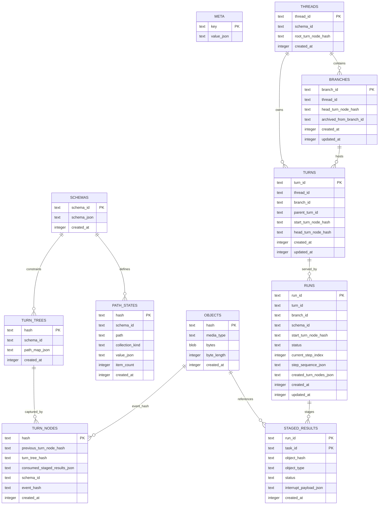

# Technical Specification

## 0. Version History & Changelog
- v0.1.0 - Initial TechSpec derived from PRD v0.1.0 and Architecture v0.1.0, selecting the concrete stack, state model, contracts, and repository structure for Kraken Runtime.
- ... [Older history truncated, refer to git logs]

## 1. Stack Specification (Bill of Materials)
- **Primary Language / Runtime:** TypeScript 6.0.x on Bun 1.3.11, ESM-only
- **Primary Frameworks / Libraries:** Built-in `bun:sqlite` for the authoritative durable store; official provider SDKs behind adapter packages: `openai@6.33.0`, `@anthropic-ai/sdk@0.80.0`, `@google/genai@1.47.0`; `ajv@8.18.0` for JSON Schema validation; `@biomejs/biome@2.4.10` for formatting and linting
- **State Stores / Persistence:** Single file-backed SQLite database in WAL mode as the sole authoritative state store for kernel durability; file-system fixtures and snapshots only for tests and examples
- **Infrastructure / Tooling:** Bun workspaces, root `tsconfig` project references, SQL migration files executed by an internal migration runner, environment-variable based provider credentials, structured JSON logging
- **Testing / Quality Tooling:** `bun test`, `tsc --noEmit`, Biome checks, golden event-sequence tests, crash-recovery integration tests using file-backed SQLite databases, provider-adapter contract fixtures
- **Version Pinning / Compatibility Policy:** Bun pinned to exact patch (`1.3.11`) and TypeScript pinned to exact minor (`6.0.x`) in the workspace; production dependencies pinned exactly in `package.json` and `bun.lock`; public package APIs follow semantic versioning; persisted schema changes require forward-only SQL migrations and compatibility notes in the changelog

### 1.1 Selection Notes
- This stack is a recommendation, not a recovered user preference. No explicit stack was supplied, so this stage treats the decision as delegated and chooses the lowest-ops option that still honors the architecture.
- Bun 1.3.11 is current per the official Bun release line as of 2026-03-18, and Bun’s official docs confirm native workspaces plus a built-in synchronous SQLite driver with transaction support and WAL guidance.
- TypeScript 6.0 is current per the official announcement dated 2026-03-23. The configuration in this TechSpec avoids patterns TypeScript 6.0 deprecates, including `baseUrl` and legacy `node` module resolution.
- OpenAI, Anthropic, and Google all maintain official JavaScript SDKs. Google’s current official guidance recommends `@google/genai`, and Anthropic’s official SDK docs explicitly list Bun support for the TypeScript client.

## 2. Architecture Decision Records (ADRs)
### ADR-001 Primary Implementation Platform is TypeScript 6.0 on Bun 1.3
- **Status:** accepted
- **Context:** The architecture requires an embeddable modular runtime with strong local durability, clear package boundaries, and low operational burden for a solo developer. The project instructions also prefer Bun over npm/yarn/pnpm and Bun over Node.js.
- **Decision:** Implement Kraken as an ESM-only TypeScript 6.0 monorepo running on Bun 1.3.11. Use Bun’s runtime primitives, workspace support, test runner, and built-in SQLite driver as the default implementation platform.
- **Consequences:** The initial implementation stays in one language and one runtime, which reduces cognitive and operational overhead. The kernel/framework split remains architectural and package-level rather than process-level. Future porting of the kernel to a native language remains possible because the kernel boundary is still explicit, but it is not part of v0.1.

### ADR-002 Ship as a Modular Monorepo, Not as Multiple Services
- **Status:** accepted
- **Context:** The architecture defines multiple logical containers, but the PRD and architecture both prioritize solo-dev realism and embeddability over operational theater.
- **Decision:** Realize the containers as Bun workspace packages within one repository and one runtime deployment unit by default. Separate packages will exist for `types`, `kernel`, `framework`, provider adapters, and stream adapters, but not as separately deployed services.
- **Consequences:** Internal boundaries remain explicit and testable without introducing inter-service networking, service discovery, or distributed tracing complexity. If later stages require out-of-process deployment, the package boundaries already exist, but the v0.1 implementation does not carry that overhead.

### ADR-003 Use SQLite WAL as the Sole Authoritative Durable Store
- **Status:** accepted
- **Context:** The kernel requires single-writer ACID semantics, durable staging, atomic checkpoint transactions, and read-after-write consistency. The architecture’s persistence boundary is deliberately minimal and local-first.
- **Decision:** Use a single SQLite database file opened through `bun:sqlite`, with `PRAGMA journal_mode = WAL`, `PRAGMA foreign_keys = ON`, and explicit transactional boundaries managed inside the kernel package.
- **Consequences:** The implementation meets the kernel storage contract without a server dependency. One runtime instance is the sole writer for a given database file. Cross-process concurrent writers are out of scope for v0.1. Backup and recovery are simple file-level operations, but long-lived WAL files and checkpoint policy must be managed explicitly.

### ADR-004 Use Path-Granular Structural Sharing over a Generic Tree Engine
- **Status:** accepted
- **Context:** The kernel specification requires immutable TurnTrees with structural sharing, but the approved schema model exposes state as a flat set of named paths with `ordered` and `single` collection semantics rather than arbitrary nested documents.
- **Decision:** Physically implement structural sharing at the schema-path layer. Each path value is content-addressed independently as a `path_state`, and each `turn_tree` stores a canonical mapping from path name to `path_state` hash. `tree.diff` compares path-state hashes directly.
- **Consequences:** This satisfies the structural-sharing requirement while keeping the first implementation small and inspectable. The design is optimized for Kraken’s actual schema shape rather than for hypothetical arbitrary trees. If future product scope introduces deeper nested state semantics, a lower-level Merkle subtree representation can be introduced behind the same kernel contract.

### ADR-005 Use RFC 8785 Canonical JSON plus SHA-256 for Durable Record Identity
- **Status:** accepted
- **Context:** The kernel requires deterministic hashing of durable records. The implementation needs a portable, reproducible encoding for structured data across packages and possible future language boundaries.
- **Decision:** Serialize all structured kernel and framework records as UTF-8 canonical JSON following RFC 8785 before hashing with SHA-256. Raw binary object payloads are stored as-is in the object store; when a framework object is binary-bearing, the binary content is represented as base64url inside its canonical JSON record.
- **Consequences:** Hashing and persistence remain deterministic and portable without extra native dependencies. SHA-256 is slower than BLAKE3 but universally available through standard crypto APIs. Binary-heavy payloads are less storage-efficient than a fully split blob-reference model, but the implementation remains simple and auditable for the initial release.

### ADR-006 Use Official Provider SDKs Behind Per-Provider Gateway Packages
- **Status:** accepted
- **Context:** The PRD requires provider neutrality, but the architecture explicitly isolates providers behind a gateway boundary. Official docs show stable first-party JavaScript SDKs for OpenAI, Anthropic, and Google.
- **Decision:** Each provider adapter package will depend on its provider’s official JavaScript SDK. The core framework package will never import provider SDKs directly and will speak only the `KrakenProvider` contract.
- **Consequences:** Provider-specific retries, streaming quirks, auth mechanisms, and response normalization are isolated. Provider upgrades affect only their adapter packages. The workspace carries more dependencies than a raw-HTTP implementation, but maintenance risk is lower because official SDKs track API changes directly.

### ADR-007 Public Host Contract is Library-First and AsyncIterable-Based
- **Status:** accepted
- **Context:** The architecture defines the host boundary as an embedding contract rather than a mandated network API. The framework spec already centers `ExecutionHandle` and a canonical event stream.
- **Decision:** The first-class public surface will be a TypeScript library API centered on `KrakenRuntime`, `ExecutionHandle`, and typed event streams. Protocol adapters for SSE, AG-UI, ACP, and similar transports are secondary packages built on top of the canonical event stream.
- **Consequences:** The runtime stays transport-neutral and easy to embed. Hosts can expose HTTP, WebSocket, CLI, or editor integrations without changing Kraken’s core semantics. Public API compatibility must be managed carefully because library consumers bind directly to types and behavior.

### ADR-008 Use Hand-Written SQL and a Minimal Migration Runner, Not an ORM
- **Status:** accepted
- **Context:** The kernel’s semantics revolve around atomic transactions, idempotent writes, statement-level control, and explicit invariants. An ORM would obscure key durability behavior and make low-level transaction reasoning harder.
- **Decision:** Implement persistence with hand-written SQL files and a thin repository/transaction layer inside the kernel package. Schema migrations are forward-only SQL scripts executed by an internal migrator.
- **Consequences:** Transaction behavior remains explicit and debuggable. The team owns SQL and migration discipline directly. There is more handwritten persistence code, but less hidden abstraction and less risk of ORM behavior drifting from kernel invariants.

### 2.1 Compatibility Record
- **Public package compatibility:** Breaking changes to exported library contracts require a semver-major release.
- **Serialized event compatibility:** New event types are allowed in minor releases; existing event field removals or semantic changes are semver-major.
- **Persisted database compatibility:** Migrations are forward-only. A newer runtime may migrate an older DB in place; an older runtime is not required to reopen a DB migrated by a newer runtime.
- **Provider adapter compatibility:** Provider package upgrades may occur in minor releases only if the `KrakenProvider` contract remains unchanged and golden normalization tests still pass.

## 3. State & Data Modeling
### 3.1 Authoritative Kernel Database
- **Purpose:** Persist all durable runtime state needed for objects, schemas, TurnTrees, TurnNodes, Threads, Branches, Turns, Runs, and staged results while preserving checkpoint atomicity and recovery semantics.
- **Storage Shape:** One SQLite file in WAL mode. All structural records are stored as canonical JSON text except object bytes, which are stored in BLOB columns.
- **Constraints / Invariants:**
  - `objects.hash` is unique and immutable.
  - `runs.status` must stay within `running | paused | completed | failed`.
  - At most one `running` or `paused` run may exist for a branch at a time.
  - `branches.head_turn_node_hash` must always reference a TurnNode in the same thread lineage.
  - `staged_results` rows are durable before any checkpoint that consumes them.
  - `turn_nodes.consumed_staged_results_json` is the authoritative audit record of what a checkpoint consumed.
- **Indexes / Access Paths:**
  - Primary lookups by `hash`, `thread_id`, `branch_id`, `turn_id`, and `run_id`
  - `idx_runs_branch_status` for one-active-run enforcement
  - `idx_turn_nodes_previous` for lineage walks
  - `idx_branches_thread_id` for branch listing
  - `idx_turns_thread_branch_created_at` for semantic turn traversal
  - `idx_staged_results_run_id` for run recovery
- **Migration Notes:** Schema changes use forward-only SQL migrations in lexical order. Each migration updates `PRAGMA user_version` and the `meta` table’s `schema_version`. Destructive migrations require a compatibility note and a backup recommendation in release notes.

#### Table Definitions
- `meta`
  - `key TEXT PRIMARY KEY`
  - `value_json TEXT NOT NULL`
  - Stores runtime metadata such as `schema_version`, `hash_algorithm`, and initialization timestamps.
- `objects`
  - `hash TEXT PRIMARY KEY`
  - `media_type TEXT NOT NULL`
  - `bytes BLOB NOT NULL`
  - `byte_length INTEGER NOT NULL`
  - `created_at INTEGER NOT NULL`
- `schemas`
  - `schema_id TEXT PRIMARY KEY`
  - `schema_json TEXT NOT NULL`
  - `created_at INTEGER NOT NULL`
- `path_states`
  - `hash TEXT PRIMARY KEY`
  - `schema_id TEXT NOT NULL`
  - `path TEXT NOT NULL`
  - `collection_kind TEXT NOT NULL CHECK (collection_kind IN ('ordered','single'))`
  - `value_json TEXT NOT NULL`
  - `item_count INTEGER NOT NULL`
  - `created_at INTEGER NOT NULL`
- `turn_trees`
  - `hash TEXT PRIMARY KEY`
  - `schema_id TEXT NOT NULL`
  - `path_map_json TEXT NOT NULL`
  - `created_at INTEGER NOT NULL`
- `turn_nodes`
  - `hash TEXT PRIMARY KEY`
  - `previous_turn_node_hash TEXT NULL`
  - `turn_tree_hash TEXT NOT NULL`
  - `consumed_staged_results_json TEXT NOT NULL`
  - `schema_id TEXT NOT NULL`
  - `event_hash TEXT NULL`
  - `created_at INTEGER NOT NULL`
- `threads`
  - `thread_id TEXT PRIMARY KEY`
  - `schema_id TEXT NOT NULL`
  - `root_turn_node_hash TEXT NOT NULL`
  - `created_at INTEGER NOT NULL`
- `branches`
  - `branch_id TEXT PRIMARY KEY`
  - `thread_id TEXT NOT NULL`
  - `head_turn_node_hash TEXT NOT NULL`
  - `archived_from_branch_id TEXT NULL`
  - `created_at INTEGER NOT NULL`
  - `updated_at INTEGER NOT NULL`
- `turns`
  - `turn_id TEXT PRIMARY KEY`
  - `thread_id TEXT NOT NULL`
  - `branch_id TEXT NOT NULL`
  - `parent_turn_id TEXT NULL`
  - `start_turn_node_hash TEXT NOT NULL`
  - `head_turn_node_hash TEXT NOT NULL`
  - `created_at INTEGER NOT NULL`
  - `updated_at INTEGER NOT NULL`
- `runs`
  - `run_id TEXT PRIMARY KEY`
  - `turn_id TEXT NOT NULL`
  - `branch_id TEXT NOT NULL`
  - `schema_id TEXT NOT NULL`
  - `start_turn_node_hash TEXT NOT NULL`
  - `status TEXT NOT NULL CHECK (status IN ('running','paused','completed','failed'))`
  - `current_step_index INTEGER NOT NULL`
  - `step_sequence_json TEXT NOT NULL`
  - `created_turn_nodes_json TEXT NOT NULL`
  - `created_at INTEGER NOT NULL`
  - `updated_at INTEGER NOT NULL`
- `staged_results`
  - `run_id TEXT NOT NULL`
  - `task_id TEXT NOT NULL`
  - `object_hash TEXT NOT NULL`
  - `object_type TEXT NOT NULL`
  - `status TEXT NOT NULL CHECK (status IN ('completed','failed','interrupted'))`
  - `interrupt_payload_json TEXT NULL`
  - `created_at INTEGER NOT NULL`
  - `PRIMARY KEY (run_id, task_id)`

#### SQLite Runtime Policy
- Open one writer connection per runtime instance.
- Enable `PRAGMA journal_mode = WAL`.
- Enable `PRAGMA foreign_keys = ON`.
- Use `safeIntegers: true` for all kernel connections.
- Wrap `staging.stage`, `thread.create`, `branch.setHead` backward movement, `run.completeStep`, and `run.complete` in explicit database transactions.
- Use prepared statements cached at module scope for hot-path reads and writes.



### 3.2 In-Memory Domain Modeling Rules
- IDs
  - `threadId`, `branchId`, `turnId`, and `runId` are generated as prefixed random IDs using `crypto.randomUUID()` with stable prefixes in the application layer.
  - `hash` values are lowercase hex SHA-256 digests.
- Time
  - Persist timestamps as Unix epoch milliseconds in INTEGER columns.
  - Convert to ISO 8601 only at host-adapter boundaries.
- Serialization
  - Structured records use RFC 8785 canonical JSON before hashing and persistence.
  - `Uint8Array` values are encoded as base64url strings when they appear inside structured JSON.
- TurnTree implementation
  - `path_map_json` shape: `{ "<path>": "<pathStateHash>" }`
  - `path_states.value_json` shape:
    - ordered path: `["hashA","hashB"]`
    - single path: `"hashA"` or `null`

## 4. Interface Contract
### 4.1 Host-Facing Framework Library API
- **Style:** library API
- **Authentication / Authorization:** Not built into the runtime. Hosts are responsible for authenticating callers before exposing runtime control methods. Within Kraken, control operations are authorization-sensitive commands, not conversational inputs.
- **Compatibility Strategy:** Exported package APIs follow semver. Additive fields and additive methods are minor-compatible. Parameter removals, behavioral contract changes, or result-shape narrowing are major changes.
- **Error model:** Typed `KrakenError` subclasses with stable `code` strings. Public methods reject with typed errors; stream failures also emit `error` events before terminal completion when possible.

```ts
export type KrakenErrorCode =
  | "INVALID_INPUT"
  | "RUN_CONFLICT"
  | "LINEAGE_VIOLATION"
  | "UNKNOWN_TOOL"
  | "INVALID_TOOL_INPUT"
  | "INVALID_LOOP_POLICY"
  | "APPROVAL_REQUIRED"
  | "PROVIDER_ERROR"
  | "PERSISTENCE_ERROR"
  | "RECOVERY_ERROR";

export class KrakenError extends Error {
  readonly code: KrakenErrorCode;
  readonly cause?: unknown;
}

export interface KrakenRuntime {
  createThread(input: {
    threadId?: string;
    schemaId?: string;
    initialBranchId?: string;
  }): Promise<{ threadId: string; branchId: string; rootTurnNodeHash: string; rootTurnTreeHash: string }>;

  getThread(threadId: string): Promise<{
    threadId: string;
    schemaId: string;
    rootTurnNodeHash: string;
  } | null>;

  createBranch(input: {
    branchId?: string;
    threadId: string;
    fromTurnNodeHash: string;
  }): Promise<{ branchId: string; threadId: string; headTurnNodeHash: string }>;

  setBranchHead(input: {
    branchId: string;
    turnNodeHash: string;
  }): Promise<{
    branchId: string;
    headTurnNodeHash: string;
    archiveBranchId?: string;
  }>;

  executeTurn(input: {
    signal: InputSignal;
    threadId: string;
    branchId: string;
    schemaId?: string;
    config: AgentConfig;
    tools?: KrakenToolDefinition[];
    parentTurnId?: string | null;
  }): ExecutionHandle;
}

export interface ExecutionHandle {
  events(): AsyncIterable<KrakenStreamEvent>;
  cancel(): void;
  steer(signal: InputSignal): void;
  resolveApproval(response: ApprovalResponse): ExecutionHandle;
  status(): ExecutionStatus;
}

export interface ExecutionStatus {
  phase: "running" | "paused" | "completed" | "failed";
  iterationCount: number;
  activeAgent?: string;
  manifest?: ContextManifest;
  pauseReason?: string;
  approval?: ApprovalRequest;
}

export interface InputSignal {
  parts: ContentPart[];
}

export interface ApprovalResponse {
  decisions: ApprovalDecision[];
}

export interface ApprovalDecision {
  callId: string;
  type: "approve" | "edit" | "reject" | string;
  editedInput?: unknown;
  message?: string;
}
```

### 4.2 Kernel Boundary Contract
- **Style:** library API
- **Authentication / Authorization:** Internal-only contract. Accessible only to framework packages inside the workspace.
- **Compatibility Strategy:** Internal semver within the monorepo. Breaking changes require synchronized updates to `framework` and `kernel` packages in the same release.
- **Error model:** Internal `KrakenError` with persistence and lineage codes; kernel never throws provider- or tool-specific errors.

```ts
export interface KrakenKernel {
  store: {
    put(blob: Uint8Array, mediaType?: string): Promise<string>;
    get(hash: string): Promise<Uint8Array | null>;
    has(hash: string): Promise<boolean>;
  };

  schema: {
    register(schema: TurnTreeSchema): Promise<string>;
    get(schemaId: string): Promise<TurnTreeSchema | null>;
  };

  tree: {
    create(
      schemaId: string,
      changes: Record<string, string[] | string | null>,
      baseTurnTreeHash?: string
    ): Promise<string>;
    incorporate(baseTurnTreeHash: string, stagedResults: StagedResult[]): Promise<string>;
    diff(treeHashA: string, treeHashB: string): Promise<string[]>;
    resolve(treeHash: string, path: string): Promise<string[] | string | null>;
    manifest(treeHash: string): Promise<Record<string, string[] | string | null>>;
  };

  thread: {
    create(threadId: string, schemaId: string, initialBranchId: string): Promise<ThreadCreateResult>;
    get(threadId: string): Promise<ThreadRecord | null>;
  };

  branch: {
    create(branchId: string, threadId: string, fromTurnNodeHash: string): Promise<BranchRecord>;
    get(branchId: string): Promise<BranchRecord | null>;
    setHead(branchId: string, turnNodeHash: string): Promise<SetHeadResult>;
    list(threadId: string): Promise<Array<{ branchId: string; headTurnNodeHash: string }>>;
  };

  run: {
    create(
      runId: string,
      turnId: string,
      branchId: string,
      schemaId: string,
      startTurnNodeHash: string,
      steps: StepDeclaration[]
    ): Promise<RunRecord>;
    beginStep(runId: string, stepId: string): Promise<StepContext>;
    completeStep(
      runId: string,
      stepId: string,
      eventHash?: string,
      observeResults?: ObserveResult[],
      treeHash?: string
    ): Promise<{ checkpointed: boolean; turnNodeHash?: string }>;
    complete(
      runId: string,
      status: "completed" | "failed" | "paused",
      eventHash?: string
    ): Promise<{ turnNodeHash?: string }>;
    recover(runId: string): Promise<RecoveryState>;
  };
}
```

### 4.3 Provider Adapter Contract
- **Style:** library API
- **Authentication / Authorization:** Provider credentials are supplied via environment variables or injected credential providers. Adapters must never read secrets from persisted runtime state.
- **Compatibility Strategy:** The `KrakenProvider` contract is stable across providers. Provider-native feature additions are exposed only through `providerMetadata` or new adapter options, not through contract forks.
- **Error model:** Adapters normalize provider transport failures and validation issues into `KrakenError` with `PROVIDER_ERROR`.

```ts
export interface KrakenProvider {
  readonly id: string;

  generate(prompt: KrakenPrompt): Promise<KrakenModelResponse>;

  stream(prompt: KrakenPrompt): AsyncIterable<ProviderStreamChunk>;
}

export type ProviderStreamChunk =
  | { type: "text_delta"; text: string }
  | { type: "reasoning_delta"; text: string; signature?: string }
  | { type: "reasoning_done" }
  | { type: "tool_call_start"; providerCallId: string; name: string }
  | { type: "tool_call_args_delta"; providerCallId: string; delta: string }
  | { type: "tool_call_done"; providerCallId: string; name: string; input: unknown }
  | {
      type: "finish";
      finishReason: "stop" | "tool_call" | "length" | "error" | "content_filter";
      usage?: { inputTokens: number; outputTokens: number };
      providerMetadata?: Record<string, unknown>;
    }
  | { type: "error"; error: unknown };
```

### 4.4 Canonical Event Stream Contract
- **Style:** library API
- **Authentication / Authorization:** Event consumers inherit authorization from the host embedding layer. Kraken emits runtime truth; hosts decide which consumers may observe which streams.
- **Compatibility Strategy:** Existing event `type` names and required fields are stable within a major version. Minor releases may add new event types and optional fields.
- **Error model:** Terminal failures are surfaced both as `error` events and through final `turn.end` state when the failure occurs after a turn has started.

```ts
export interface EventSource {
  agent: string;
  workerId?: string;
  threadId?: string;
}

export type KrakenStreamEvent =
  | {
      type: "turn.start";
      turnId: string;
      threadId: string;
      resumedFrom?: string;
      timestamp: string;
      source?: EventSource;
    }
  | {
      type: "turn.end";
      turnId: string;
      status: "completed" | "paused" | "failed";
      timestamp: string;
      source?: EventSource;
    }
  | {
      type: "iteration.start" | "iteration.end";
      iterationCount: number;
      timestamp: string;
      source?: EventSource;
    }
  | {
      type: "message.start";
      messageId: string;
      role: "assistant";
      timestamp: string;
      source?: EventSource;
    }
  | {
      type: "text.delta";
      messageId: string;
      delta: string;
      timestamp: string;
      source?: EventSource;
    }
  | {
      type: "text.done";
      messageId: string;
      text: string;
      timestamp: string;
      source?: EventSource;
    }
  | {
      type: "reasoning.delta";
      messageId: string;
      delta: string;
      timestamp: string;
      source?: EventSource;
    }
  | {
      type: "reasoning.done";
      messageId: string;
      timestamp: string;
      source?: EventSource;
    }
  | {
      type: "tool_call.start";
      messageId: string;
      callId: string;
      name: string;
      timestamp: string;
      source?: EventSource;
    }
  | {
      type: "tool_call.args_delta";
      callId: string;
      delta: string;
      timestamp: string;
      source?: EventSource;
    }
  | {
      type: "tool_call.done";
      callId: string;
      name: string;
      input: unknown;
      timestamp: string;
      source?: EventSource;
    }
  | {
      type: "message.done";
      messageId: string;
      finishReason: "stop" | "tool_call" | "length" | "error" | "content_filter";
      usage?: { inputTokens: number; outputTokens: number };
      timestamp: string;
      source?: EventSource;
    }
  | {
      type: "tool.start";
      callId: string;
      name: string;
      input: unknown;
      timestamp: string;
      source?: EventSource;
    }
  | {
      type: "tool.result";
      callId: string;
      name: string;
      output: unknown;
      isError?: boolean;
      timestamp: string;
      source?: EventSource;
    }
  | {
      type: "approval.requested";
      request: ApprovalRequest;
      timestamp: string;
      source?: EventSource;
    }
  | {
      type: "approval.resolved";
      response: ApprovalResponse;
      timestamp: string;
      source?: EventSource;
    }
  | {
      type: "steering.incorporated";
      messageId: string;
      timestamp: string;
      source?: EventSource;
    }
  | {
      type: "state.snapshot";
      manifest: ContextManifest;
      timestamp: string;
      source?: EventSource;
    }
  | {
      type: "state.checkpoint";
      turnNodeHash: string;
      iterationCount: number;
      timestamp: string;
      source?: EventSource;
    }
  | {
      type: "error";
      error: { message: string; code?: string; details?: unknown };
      fatal: boolean;
      timestamp: string;
      source?: EventSource;
    }
  | {
      type: "custom";
      name: string;
      data: unknown;
      timestamp: string;
      source?: EventSource;
    };
```

## 5. Implementation Guidelines
### 5.1 Project Structure
```text
.
├── framework/
│   ├── Architecture.md
│   ├── PRD.md
│   └── TechSpec.md
├── package.json
├── bun.lock
├── tsconfig.base.json
├── tsconfig.json
├── biome.jsonc
├── docs/
├── packages/
│   ├── types/
│   │   ├── src/
│   │   ├── test/
│   │   └── package.json
│   ├── kernel/
│   │   ├── migrations/
│   │   ├── src/
│   │   ├── test/
│   │   └── package.json
│   ├── framework/
│   │   ├── src/
│   │   ├── test/
│   │   └── package.json
│   ├── provider-openai/
│   │   ├── src/
│   │   ├── test/
│   │   └── package.json
│   ├── provider-anthropic/
│   │   ├── src/
│   │   ├── test/
│   │   └── package.json
│   ├── provider-google/
│   │   ├── src/
│   │   ├── test/
│   │   └── package.json
│   ├── stream-core/
│   │   ├── src/
│   │   └── package.json
│   ├── stream-sse/
│   │   ├── src/
│   │   └── package.json
│   ├── stream-agui/
│   │   ├── src/
│   │   └── package.json
│   └── testkit/
│       ├── src/
│       └── package.json
├── examples/
│   └── playground-host/
│       ├── src/
│       └── package.json
└── scripts/
    ├── migrate.ts
    ├── verify.ts
    └── release-check.ts
```

### 5.2 Coding Standards
- **Formatting / Linting:** Use Biome for formatting and linting. Enforce ESM-only imports, no CommonJS, no default path aliasing through `baseUrl`, and explicit `rootDir` in every package `tsconfig`. Root TypeScript settings:
  - `"strict": true`
  - `"module": "esnext"`
  - `"moduleResolution": "bundler"`
  - `"target": "es2025"`
  - `"rootDir": "./src"` at package level
  - `"types": ["bun"]` at package level where Bun globals are used
- **Testing Expectations:** 
  - Unit tests for pure logic in `types`, `kernel`, and `framework`
  - Integration tests for SQLite transactions, recovery, rollback, pause/resume, and handoff flows
  - Golden tests for `KrakenStreamEvent` sequences
  - Adapter contract tests with recorded provider fixtures and mocked transport
  - No feature is complete without at least one failure-path test when the feature touches persistence, approvals, orchestration, or streaming
- **Observability Hooks:** 
  - Structured logger interface injected at runtime boundary
  - Optional event tee for tests and host adapters
  - Stable internal metric names for turn count, iteration count, provider latency, tool latency, checkpoint count, and recovery count
- **Migration / Deployment Notes:** 
  - Run migrations at startup before opening the framework surface
  - Refuse to start if the DB user version is newer than the runtime supports
  - Provide a backup helper that checkpoints WAL and copies the database file before irreversible migrations
  - Keep one writer runtime per DB file in production
- **Performance / Capacity Notes:** 
  - Hot-path context decisions must read the persisted `ContextManifest` instead of rescanning historical messages
  - Use prepared statement caching throughout the kernel package
  - Keep provider streaming off the SQLite hot path until staging boundaries
  - Batch staged-result consumption into a single checkpoint transaction per required boundary
  - Do not load full object bytes unless the active flow needs them; prefer hash-only traversal when diffing, lineage-walking, or manifest inspection

### 5.3 Documentation Drift Prevention
- `framework/PRD.md`, `framework/Architecture.md`, and `framework/TechSpec.md` are authoritative design artifacts and must be updated in the same PR as any breaking scope, architecture, or implementation change.
- New public APIs require matching examples or tests in `examples/playground-host` or `packages/testkit`.
- New persisted fields or tables require a migration, an ADR or compatibility note when materially irreversible, and a recovery-path test.

### 5.4 Initial Build Sequence
1. Create workspace scaffolding and root TypeScript/Bun configuration.
2. Implement `packages/types` with canonical runtime types and public interfaces.
3. Implement `packages/kernel` with migrations, hashing, SQLite repositories, and transaction boundaries.
4. Implement `packages/framework` with turn execution, context engineering, tool dispatch, and orchestration.
5. Implement provider adapter packages behind `KrakenProvider`.
6. Implement stream adapter packages and the playground host.
7. Add crash-recovery and compatibility test suites before widening the public API.
